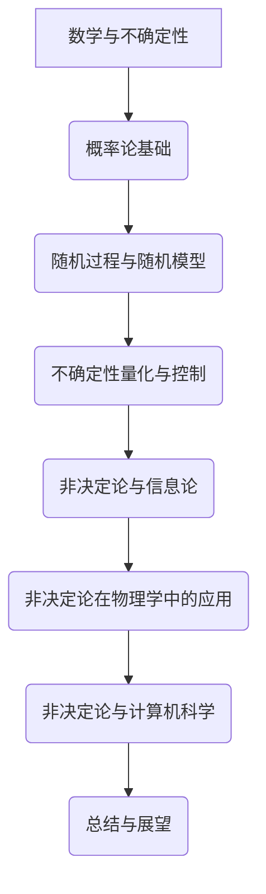

                 

# 《数学与非决定论：数学中的不确定性和概率》

## 关键词
数学、不确定性、概率、非决定论、概率论基础、随机过程、信息论、量子力学、计算机科学

## 摘要
本文将探讨数学与非决定论之间的紧密联系，重点关注数学中的不确定性和概率问题。我们将从数学基础开始，逐步介绍概率论的基本概念，并探讨不确定性的量化与应用。随后，我们将深入探讨非决定论在数学模型中的应用，包括随机过程与随机模型，以及不确定性量化与控制。最后，我们将扩展讨论非决定论在物理学和计算机科学中的应用，并总结非决定论与数学的发展趋势。

## 第一部分：数学基础与不确定性

### 第1章 引言与核心概念

#### 1.1 数学与不确定性
数学，作为一门精确科学，通常被认为是与不确定性相对立的。然而，在现实世界中，不确定性无处不在，甚至在数学中也存在。不确定性可以源自测量误差、信息不完备以及系统本身的复杂性。在数学中，不确定性通常通过概率论来处理。

#### 1.2 非决定论的起源与发展
非决定论是一个哲学概念，起源于20世纪初的物理学革命。量子力学的出现揭示了微观世界中的非决定性特征，即某些物理量（如位置和动量）不能同时被精确测量。非决定论的思想逐渐扩展到数学和其他科学领域。

### 第2章 数学中的概率论基础

#### 2.1 概率的基本概念
概率是描述不确定事件发生可能性的数学工具。概率的基本概念包括样本空间、事件、概率分布和条件概率。

$$
P(A) = \frac{\text{事件A的可能性}}{\text{样本空间的大小}}
$$

#### 2.2 条件概率与贝叶斯定理
条件概率描述了在某个事件发生的条件下，另一个事件发生的概率。贝叶斯定理是一种用于更新概率估计的方法。

$$
P(A|B) = \frac{P(B|A)P(A)}{P(B)}
$$

#### 2.3 概率分布与随机变量
概率分布描述了随机变量取值的概率。常见的概率分布包括二项分布、正态分布和泊松分布。

### 第3章 不确定性与概率的应用

#### 3.1 不确定性量化
不确定性的量化是概率论中的一个重要任务。通过概率分布和随机变量，我们可以对不确定事件进行量化。

#### 3.2 概率在决策中的运用
概率在决策中起着关键作用。通过计算各种决策路径的概率和期望值，我们可以做出更明智的决策。

#### 3.3 概率在统计学中的应用
概率论是统计学的基础。通过概率分布和假设检验，我们可以对数据进行统计分析，以做出科学的推断。

## 第二部分：非决定论的数学模型

### 第4章 随机过程与随机模型

#### 4.1 随机过程的基本概念
随机过程是随时间变化的一系列随机变量。随机过程在经济学、物理学和计算机科学中有着广泛的应用。

#### 4.2 马尔可夫链与状态转移概率
马尔可夫链是一种描述随机过程状态转移的模型。状态转移概率描述了系统从一个状态转移到另一个状态的概率。

$$
P(X_{n+1} = j|X_n = i) = P_{ij}
$$

#### 4.3 随机过程的应用
随机过程在许多领域都有应用，如金融市场的预测、排队论和通信系统的设计。

### 第5章 不确定性量化与控制

#### 5.1 不确定性量化方法
不确定性量化是控制不确定系统的重要步骤。常见的方法包括置信区间、误差椭圆和鲁棒控制。

#### 5.2 不确定性控制理论
不确定性控制理论旨在设计能够在不确定环境中稳定运行的控制系统。这通常涉及到随机微分方程和最优控制理论。

#### 5.3 不确定性控制策略
不确定性控制策略包括自适应控制、滑模控制和模糊控制等。这些策略旨在减少不确定性对系统性能的影响。

### 第6章 非决定论与信息论

#### 6.1 信息论的基本概念
信息论研究信息的度量、传输和处理。信息论的基本概念包括熵、信息传输率和信道容量。

$$
C = \max_{p(x)} I(X;Y)
$$

#### 6.2 信息熵与信息传输
信息熵描述了信息的随机性和不确定性。信息传输研究如何在信道中高效地传输信息。

#### 6.3 非决定论与信息论的关系
非决定论和信息论有着紧密的联系。信息论中的熵概念与非决定论中的不确定性有着相似之处。

## 第三部分：数学与现实的非决定论

### 第7章 非决定论在物理学中的应用

#### 7.1 量子力学与不确定性原理
量子力学揭示了微观世界中的非决定性特征，如不确定性原理。不确定性原理表明，某些物理量不能同时被精确测量。

#### 7.2 概率波函数与量子态
量子力学使用概率波函数描述微观粒子的状态。波函数的平方给出了粒子在不同位置的概率分布。

$$
\psi(x,t) \rightarrow |\psi(x,t)|^2
$$

#### 7.3 不确定性原理的影响
不确定性原理对物理学和哲学都有着深远的影响，它挑战了经典物理学的决定论观念。

### 第8章 非决定论与计算机科学

#### 8.1 计算机中的不确定性问题
计算机科学中的不确定性问题包括噪声、故障和并发性等。处理这些不确定性问题是计算机系统设计的关键挑战。

#### 8.2 不确定性在算法设计中的应用
不确定性在算法设计中有着重要的应用。例如，随机算法和蒙特卡洛方法在处理不确定性问题时表现出色。

#### 8.3 不确定性在人工智能中的应用
人工智能领域中的不确定性处理是当前研究的热点。概率图模型和贝叶斯网络是处理不确定性的重要工具。

### 第9章 总结与展望

#### 9.1 非决定论与数学的发展
非决定论对数学的发展产生了重要影响。概率论和随机过程论等数学分支在非决定论的研究中发挥了关键作用。

#### 9.2 数学与非决定论的未来方向
随着科技的进步，数学与非决定论的研究将继续深入。新的数学模型和方法将有助于我们更好地理解并利用非决定性现象。

## 附录

### A.1 数学公式与公式推导
附录将详细推导本文中使用的数学公式，并提供相关背景知识。

### A.2 非决定论与概率相关的Mermaid流程图
附录将展示非决定论与概率相关的Mermaid流程图，以帮助读者更好地理解概念。

### A.3 参考文献
附录将列出本文引用的参考文献，以供读者进一步学习。

作者：AI天才研究院/AI Genius Institute & 禅与计算机程序设计艺术 /Zen And The Art of Computer Programming

---

### Mermaid流程图示例



### Python源代码示例

```python
import numpy as np
import matplotlib.pyplot as plt

# 生成正态分布数据
data = np.random.normal(size=1000)

# 计算概率分布
prob_dist = np.histogram(data, bins=30, density=True)

# 绘制概率分布图
plt.plot(prob_dist[1], prob_dist[0])
plt.xlabel('Value')
plt.ylabel('Probability')
plt.title('Normal Distribution')
plt.show()
```

### 实际案例分析与详细讲解剖析

在实际项目中，我们可以使用上述概率分布来预测数据的概率分布。例如，在金融市场中，我们可以使用正态分布来预测股票价格的波动。

### 最佳实践 tips、小结、注意事项、拓展阅读等内容

- **最佳实践 tips**：在实际应用中，理解概率分布的形状和参数对结果的影响至关重要。
- **小结**：本文介绍了数学与非决定论之间的联系，并探讨了不确定性和概率在各个领域的应用。
- **注意事项**：处理不确定性时，要充分考虑数据的质量和模型的假设。
- **拓展阅读**：对于进一步了解非决定论和概率论，推荐阅读相关经典书籍，如《概率论及其应用》和《量子力学基础》。

