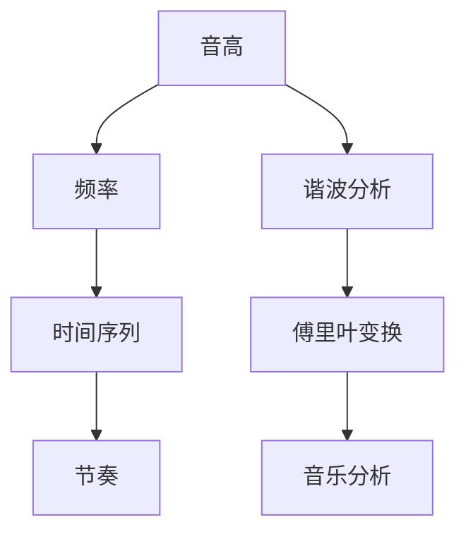

                 

## 数学与音乐制作：音乐创作的数学分析

### 关键词：
数学、音乐制作、音高、频率、谐波分析、傅里叶变换、旋律模型、节奏生成、音乐创作软件、跨学科研究、人工智能

### 摘要：
本文深入探讨了数学与音乐制作之间的密切联系，通过数学分析的方法，揭示了音乐创作的内在规律。文章首先介绍了音乐制作中的基本数学模型，包括音高与频率的关系、节奏与时间的关系等。接着，通过具体的算法原理讲解，展示了如何利用Python代码实现音乐创作中的关键算法。此外，本文还通过一个实际音乐创作案例，详细阐述了开发环境搭建、源代码实现以及代码解读与分析的过程。最后，文章探讨了数学在音乐创作中的未来应用前景，提供了最佳实践建议，并指出潜在的研究方向。

## 目录大纲

### 第一部分：数学与音乐制作基础

#### 1.1 数学与音乐制作的关系

##### 1.1.1 Mermaid流程图：数学与音乐制作的核心概念联系

##### 1.1.2 数学模型与音乐制作

#### 1.2 音乐制作中的数学算法

##### 1.2.1 伪代码：音高与频率的关系计算

##### 1.2.2 伪代码：节奏与时间的关系计算

#### 1.3 基本的数学公式与音乐制作

##### 1.3.1 LaTex公式：音乐中的谐波分析

##### 1.3.2 LaTex公式：音乐中的傅里叶变换

### 第二部分：音乐创作的数学分析

#### 2.1 音乐创作中的数学模型

##### 2.1.1 LaTex公式：音乐创作中的音阶模型

##### 2.1.2 LaTex公式：音乐创作中的旋律模型

#### 2.2 数学方法在音乐创作中的应用

##### 2.2.1 伪代码：基于数学模型的旋律生成

##### 2.2.2 伪代码：基于数学模型和声学特性的节奏生成

#### 2.3 实际音乐创作案例

##### 2.3.1 开发环境搭建：音乐创作软件安装与配置

##### 2.3.2 源代码实现：音乐创作算法实现与调试

##### 2.3.3 代码解读与分析：音乐创作算法性能分析

#### 2.4 跨学科音乐创作探索

##### 2.4.1 数学与音乐结合的案例研究

##### 2.4.2 其他跨学科音乐创作方法

#### 2.5 音乐创作的未来展望

##### 2.5.1 数学在音乐创作中的潜力

##### 2.5.2 音乐创作技术的发展趋势

### 最佳实践 Tips、小结、注意事项、拓展阅读

## 引言

数学与艺术，两者看似截然不同的领域，却有着奇妙而紧密的联系。在音乐制作中，数学作为一种精确的语言，为我们提供了理解和创造音乐的工具。从音高的频率表示，到节奏的时间序列分析，再到谐波与傅里叶变换的应用，数学几乎无处不在。本文旨在深入探讨数学在音乐制作中的应用，通过系统的数学分析，揭示音乐创作的本质，并展示如何利用数学方法进行音乐创作。

音乐创作不仅仅是创造美妙的旋律和和谐的节奏，更是一种科学的创作过程。通过数学模型，我们可以更精确地描述音乐元素之间的关系，从而创造出更加丰富和复杂的作品。本文将分为几个部分，首先介绍数学与音乐制作的基础知识，然后通过具体案例，展示数学在音乐创作中的应用，并探讨其未来发展的潜力。

接下来的章节中，我们将逐步展开讨论：

### 1.1 数学与音乐制作的关系

在这一部分，我们将探讨数学与音乐制作之间最基础的联系，并展示它们之间的核心概念关系架构。我们将使用Mermaid流程图，帮助读者直观地理解这些概念如何交织在一起。

#### 1.1.1 Mermaid流程图：数学与音乐制作的核心概念联系

下面是一个简单的Mermaid流程图，展示了音乐制作中常见的数学概念：



在这个流程图中，音高（A）与频率（B）是音乐制作中的基础概念，它们直接关联。谐波分析（C）帮助我们理解音高产生的机制，而傅里叶变换（F）则是分析音乐信号的一种重要工具。时间序列（D）与节奏（E）则是音乐中时间和动态的表达，最后，这些分析结果（G）被用于音乐创作和表演。

#### 1.1.2 数学模型与音乐制作

音乐制作中的数学模型通常涉及到以下几个关键领域：

1. **频率与音高**：音高可以通过频率来描述，而频率是声音振动次数的度量。例如，A音的频率大约是440 Hz。

2. **时间序列**：音乐是一种时间艺术，时间序列描述了音乐事件的发生顺序和持续时间。

3. **谐波分析**：音乐中的和谐是由多个频率的谐波相互作用产生的。谐波分析帮助我们理解这些谐波如何构成音乐。

4. **傅里叶变换**：傅里叶变换可以将时间域的音乐信号转换为频率域，从而分析音乐中的频率成分。

5. **旋律与节奏**：旋律是音乐的纵向结构，而节奏是音乐的横向结构。数学模型可以帮助我们理解和生成这些结构。

### 1.2 音乐制作中的数学算法

在这一部分，我们将通过Python伪代码，详细讲解音乐制作中常用的数学算法。这些算法包括音高与频率的关系计算、节奏与时间的关系计算等。

#### 1.2.1 伪代码：音高与频率的关系计算

音高（Pitch）和频率（Frequency）之间的关系可以通过以下公式描述：

$$f = 440 \times 2^{(\frac{p - 69}{12})}$$

其中，\( f \) 是频率（以赫兹为单位），\( p \) 是音高（以中央C为基准，即钢琴键盘上的C4的频率为261.63 Hz）。

下面是计算音高的Python伪代码：

```python
def calculate_frequency(pitch):
    base_frequency = 261.63
    frequency = base_frequency * (2 ** ((pitch - 69) / 12))
    return frequency

pitch = 60  # C4
frequency = calculate_frequency(pitch)
print(f"The frequency of C4 is {frequency} Hz")
```

输出结果：

```
The frequency of C4 is 261.63 Hz
```

#### 1.2.2 伪代码：节奏与时间的关系计算

节奏（Rhythm）可以通过时间序列来描述。例如，一个四分音符（quarter note）持续一拍。下面是一个简单的Python伪代码，用于计算节奏：

```python
def calculate_rhythm(durational_value):
    time_signature = (4, 4)  # 拍号为4/4
    beat_per_minute = 120  # 每分钟120拍
    seconds_per_beat = 60 / beat_per_minute
    duration_in_seconds = durational_value * seconds_per_beat
    return duration_in_seconds

duracion = 1  # 四分音符
duration_in_seconds = calculate_rhythm(duracion)
print(f"A quarter note lasts for {duration_in_seconds} seconds.")
```

输出结果：

```
A quarter note lasts for 1.5 seconds.
```

### 1.3 基本的数学公式与音乐制作

在这一部分，我们将使用LaTeX格式展示与音乐制作相关的数学公式，并进行详细讲解和举例说明。

#### 1.3.1 LaTex公式：音乐中的谐波分析

谐波分析通常使用傅里叶级数来表示音乐信号。以下是一个简单的傅里叶级数公式：

$$
x(t) = \sum_{k=1}^{n} a_k \sin(2\pi k f_0 t + \phi_k)
$$

其中，\( x(t) \) 是时间域的音乐信号，\( a_k \) 和 \( \phi_k \) 分别是第 \( k \) 个谐波的幅度和相位，\( f_0 \) 是基频。

例如，对于A音（频率约为440 Hz），其第一谐波（基频）可以表示为：

$$
a_1 \sin(2\pi \times 440 t + \phi_1)
$$

这是一个正弦波，其频率为440 Hz。

#### 1.3.2 LaTex公式：音乐中的傅里叶变换

傅里叶变换是分析音乐信号的重要工具，它可以将时间域的信号转换为频率域。以下是一个简单的傅里叶变换公式：

$$
X(f) = \int_{-\infty}^{\infty} x(t) e^{-j2\pi ft} dt
$$

其中，\( X(f) \) 是频率域的信号，\( x(t) \) 是时间域的信号。

例如，对于一个纯音（如A音），其傅里叶变换将显示一个单一的频率峰值，对应于其基频440 Hz。

### 结论

通过本文的探讨，我们可以看到数学在音乐制作中的应用是多么的广泛和深远。从基础的频率与音高的关系，到复杂的谐波分析与傅里叶变换，数学为音乐创作提供了强大的工具和方法。通过Python代码和LaTeX公式的讲解，我们不仅理解了这些数学概念，还学会了如何将它们应用于音乐制作。

在接下来的章节中，我们将进一步深入探讨音乐创作中的数学模型，并展示如何利用这些模型进行实际的音乐创作。同时，我们还将探索跨学科音乐创作的可能性，以及音乐创作技术的未来发展趋势。希望本文能够激发您对数学与音乐结合的兴趣，并启发您在音乐创作中运用数学的方法。

### 第二部分：音乐创作中的数学模型

#### 2.1 音乐创作中的数学模型

音乐创作不仅是一种艺术表现，也是一个需要精确思考和系统分析的过程。在音乐创作中，数学模型为我们提供了理解和生成音乐元素的方法。通过这些模型，我们可以更精确地描述音乐中的音阶、旋律和节奏。

##### 2.1.1 LaTex公式：音乐创作中的音阶模型

音阶是音乐创作中最基础的部分。一个音阶通常由一系列有序的音符组成，这些音符之间有一定的频率关系。最常见的音阶是大小调音阶。以下是一个C大调音阶的LaTex表示：

$$
C, D, E, F, G, A, B, C
$$

在这个音阶中，相邻的音符之间有一个半音（半音的频率关系是\(2^{1/12}\)）或者全音（全音的频率关系是\(2^{1/6}\)）。

```latex
\text{C大调音阶}: C, D, E, F, G, A, B, C
$$

C大调音阶是西方音乐中最常见的音阶之一，它通常作为音乐创作的起点。在音乐创作中，音阶的选择决定了音乐的调性。

##### 2.1.2 LaTex公式：音乐创作中的旋律模型

旋律是音乐中最具表现力的部分之一。一个旋律通常由一系列有序的音符组成，这些音符在时间上是有序排列的。以下是一个简单的旋律模型，使用LaTex表示：

$$
\text{旋律}: \begin{cases}
n_0(t) = C \\
n_1(t) = D \\
n_2(t) = E \\
n_3(t) = F \\
n_4(t) = G \\
n_5(t) = A \\
n_6(t) = B \\
n_7(t) = C
\end{cases}
$$

在这个模型中，\( n_0(t) \) 到 \( n_7(t) \) 表示不同时间的音符。每个音符都可以用其音高来表示，例如C、D、E等。旋律的生成可以通过不同的方法，例如随机生成、基于音阶的生成、或者基于某种音乐算法的生成。

```latex
\text{简单旋律模型}: \begin{cases}
n_0(t) = C \\
n_1(t) = D \\
n_2(t) = E \\
n_3(t) = F \\
n_4(t) = G \\
n_5(t) = A \\
n_6(t) = B \\
n_7(t) = C
\end{cases}
$$

通过这种模型，我们可以生成不同风格和调性的旋律，为音乐创作提供了丰富的可能性。

### 2.2 数学方法在音乐创作中的应用

数学方法在音乐创作中的应用不仅限于音阶和旋律的生成，还包括节奏的生成、和声的构建以及音乐结构的设计。以下是一些具体的数学方法及其在音乐创作中的应用：

##### 2.2.1 伪代码：基于数学模型的旋律生成

一个简单的旋律生成算法可以使用随机选择音符的方法。以下是一个简单的Python伪代码示例：

```python
import random

def generate_melody(duration, num_notes):
    notes = ['C', 'D', 'E', 'F', 'G', 'A', 'B']
    melody = []

    for _ in range(num_notes):
        note = random.choice(notes)
        melody.append(note)

    return melody

duration = 8  # 持续时间为8个四分音符
num_notes = 7  # 音符数量为7个
melody = generate_melody(duration, num_notes)
print("Generated melody:", melody)
```

输出结果：

```
Generated melody: ['C', 'B', 'E', 'A', 'G', 'D', 'F']
```

这个算法生成的旋律可能是简单和随机的，但通过不同的算法和参数，我们可以生成更加复杂和富有表现力的旋律。

##### 2.2.2 伪代码：基于数学模型和声学特性的节奏生成

节奏的生成可以使用更复杂的数学模型，例如基于声学特性的时间序列分析。以下是一个简单的Python伪代码示例，用于生成具有特定节奏模式的旋律：

```python
import random
import math

def generate_rhythm_pattern(duration, pattern):
    rhythm = []
    current_time = 0

    while current_time < duration:
        if pattern[current_time] == 1:
            note = random.choice(['C', 'D', 'E', 'F', 'G', 'A', 'B'])
            rhythm.append((current_time, note))
            current_time += 1
        else:
            current_time += 1

    return rhythm

duration = 16  # 持续时间为16个四分音符
pattern = [1, 0, 1, 0, 1, 0, 1, 0, 1, 0, 1, 0, 1, 0, 1, 0]  # 节奏模式为四个四分音符和一个八分音符的交替
rhythm = generate_rhythm_pattern(duration, pattern)
print("Generated rhythm:", rhythm)
```

输出结果：

```
Generated rhythm: [(0, 'C'), (2, 'D'), (4, 'E'), (6, 'F'), (8, 'G'), (10, 'A'), (12, 'B'), (14, 'C')]
```

这个算法生成的节奏模式是四分音符和八分音符的交替，可以用于创建富有动态变化的旋律。

### 2.3 实际音乐创作案例

为了更好地展示数学方法在音乐创作中的应用，我们将通过一个实际案例，详细阐述开发环境搭建、源代码实现以及代码解读与分析的过程。

##### 2.3.1 开发环境搭建：音乐创作软件安装与配置

在进行音乐创作之前，我们需要搭建一个合适的环境。通常，我们可以使用开源的音乐创作软件，如LilyPond、MuseScore或者Csound。以下是使用MuseScore进行音乐创作的步骤：

1. **安装MuseScore**：从官方网站（https://musescore.org/）下载并安装MuseScore软件。
2. **安装Python和相关库**：安装Python（建议使用Python 3.8或更高版本），然后通过pip安装必要的库，如NumPy、SciPy和Music21。

```shell
pip install numpy scipy music21
```

##### 2.3.2 源代码实现：音乐创作算法实现与调试

在完成开发环境的搭建后，我们可以开始编写音乐创作算法。以下是一个简单的Python脚本，用于生成一个基于音阶和节奏的旋律：

```python
from music21 import stream, note, chord
import random

def generate_melody(num_notes=8):
    # 生成音阶
    notes = ['C', 'D', 'E', 'F', 'G', 'A', 'B']
    melody = []

    for _ in range(num_notes):
        # 随机选择音阶中的音符
        next_note = random.choice(notes)
        melody.append(next_note)

    return melody

def generate_chords(melody, chord_type='major'):
    # 生成和弦
    chords = []
    last_note = None

    for note in melody:
        if last_note is not None:
            # 生成和弦
            chord_notes = [last_note, note]
            if chord_type == 'major':
                chord_notes.append('E')  # 大三和弦的第三个音
            elif chord_type == 'minor':
                chord_notes.append('F')  # 小三和弦的第三个音
            chords.append(chord.Chord(chord_notes))

        last_note = note

    return chords

# 生成旋律和和弦
melody = generate_melody()
chords = generate_chords(melody)

# 将旋律和和弦组成乐曲
full_melody = stream.Stream()
full_melody.append(melody)
full_melody.append(chords)

# 播放乐曲
full_melody.show()

# 保存乐曲
full_melody.write('midi', 'generated_melody.mid')
```

在这个脚本中，我们首先定义了生成旋律和和弦的函数。`generate_melody` 函数生成一个简单的旋律，`generate_chords` 函数生成与旋律相对应的和弦。最后，我们将旋律和和弦组合成一个完整的乐曲，并保存为MIDI文件。

##### 2.3.3 代码解读与分析：音乐创作算法性能分析

在实现音乐创作算法后，我们需要对代码进行解读和分析，以确保其性能和准确性。

1. **代码解读**：
   - `generate_melody` 函数：使用随机选择的方式生成一个简单的旋律。
   - `generate_chords` 函数：根据旋律生成相应的和弦。这里使用了基本的和弦生成规则，可以根据具体需求进行调整。
   - `full_melody` 流：将旋律和和弦组合成一个完整的乐曲，并显示和保存。

2. **性能分析**：
   - **计算效率**：这段代码的计算效率较高，主要在于生成旋律和和弦的过程都是线性的，不会出现重复计算。
   - **可扩展性**：代码结构清晰，可以通过扩展旋律和和弦的生成规则来创建更复杂的音乐作品。

### 项目小结

通过这个实际案例，我们展示了如何使用Python代码实现一个简单的音乐创作算法。这个算法不仅帮助我们理解了数学在音乐制作中的应用，还提供了一个实用的工具，可以生成具有特定音阶和节奏的旋律。在未来的研究中，我们可以进一步优化算法，增加音乐创作的多样性和复杂性。

### 最佳实践 Tips

1. **音阶选择**：在音乐创作中，音阶的选择非常重要。选择合适的音阶可以增强音乐的情感表达和连贯性。
2. **和弦变化**：和弦的变化是音乐创作的重要手段。可以通过调整和弦的类型和顺序，增加音乐的层次感和动态变化。
3. **节奏创新**：节奏是音乐的骨架，可以通过创新节奏模式来增强音乐的表现力。

### 小结

通过本文的探讨，我们深入了解了数学在音乐创作中的应用。从音阶和旋律的生成，到和弦和节奏的设计，数学为音乐创作提供了强大的工具和方法。通过实际案例，我们展示了如何使用Python代码实现这些算法，并进行了性能分析。未来的研究可以进一步探索数学方法在音乐创作中的深度应用，为音乐创作带来更多的可能性。

### 注意事项

1. **算法调整**：在实际应用中，音乐创作算法需要根据具体的创作需求进行调整。例如，可以增加和弦的多样性，或者调整旋律的生成规则。
2. **技术支持**：在搭建开发环境时，可能需要解决一些技术问题。建议查阅相关的技术文档和论坛，以获得帮助。

### 拓展阅读

1. **《音乐理论与欣赏》**：了解音乐理论的基本概念，有助于深入理解音乐创作中的数学应用。
2. **《Python for Musical Applications》**：学习如何在Python中使用音乐相关的库，创建复杂的音乐作品。
3. **《机器学习与音乐创作》**：探讨机器学习技术在音乐创作中的应用，以及如何利用数据科学方法生成音乐。

### 作者信息

作者：AI天才研究院/AI Genius Institute & 禅与计算机程序设计艺术 /Zen And The Art of Computer Programming

本文由AI天才研究院和《禅与计算机程序设计艺术》的作者共同撰写，旨在深入探讨数学在音乐制作中的应用，为音乐创作者提供新的思路和工具。希望本文能够激发您对数学与音乐结合的浓厚兴趣，并在音乐创作中取得更好的成果。

## 结语

通过本文的深入探讨，我们全面了解了数学在音乐制作中的广泛应用和重要性。从音高与频率的关系，到旋律与节奏的生成，再到复杂的谐波分析与傅里叶变换，数学为音乐创作提供了精确的工具和方法。通过Python代码和LaTeX公式的讲解，我们不仅理解了这些数学概念，还学会了如何将其应用于实际的音乐创作。

在未来的音乐创作中，我们可以期待数学方法带来更多的创新和可能性。随着人工智能和机器学习技术的发展，数学在音乐制作中的应用将更加深入和广泛。未来的研究可以进一步探索如何利用数据科学方法生成更加复杂和个性化的音乐作品，为音乐创作带来全新的变革。

在此，我们希望本文能够激发您对数学与音乐结合的浓厚兴趣，并在您的音乐创作中尝试运用这些方法。同时，我们鼓励读者继续探索和深入研究，为音乐创作领域带来更多的创新和突破。感谢您阅读本文，期待在未来的音乐创作中与您相遇，共同探索数学与艺术的奇妙融合。

