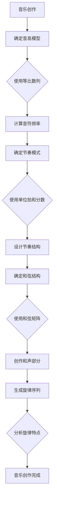

                 

### 1. 引言

音乐和数学之间的关系可以追溯到古希腊时期，当时的哲学家和数学家如毕达哥拉斯和柏拉图，就已经开始探索音乐和数学之间的联系。毕达哥拉斯认为，音乐的本质是数的关系，他通过研究弦长和振动频率之间的关系，揭示了音乐中的和谐。而柏拉图则认为，宇宙的本质是一种理想化的数学结构，这种结构在音乐中也有所体现。

随着时间的推移，数学在音乐理论中的应用不断深入。18世纪的欧洲音乐理论家开始使用数学工具来分析音乐作品的结构。19世纪的贝多芬和肖邦等作曲家，也尝试将数学概念融入到他们的音乐创作中。20世纪，随着计算机技术的发展，数学在音乐生成、合成和分析中的应用达到了一个新的高度。

《数学与音乐理论：音乐结构的数学描述》这本书旨在探讨数学在音乐理论中的应用，特别是对音乐结构的数学描述。作者通过系统地介绍数学基础、音乐基础以及音乐结构的数学描述方法，帮助读者理解音乐与数学之间的深层联系。

本书的主要内容包括：

- **引言**：介绍音乐与数学的关系，以及本书的结构和内容。
- **数学基础**：介绍数学基本概念、数学工具与方法，为后续章节的讨论提供数学基础。
- **音乐基础**：介绍音乐理论基本概念和音乐元素，为理解音乐结构的数学描述打下基础。
- **音乐结构的数学描述**：介绍音乐结构的数学模型，以及数学公式和流程图在音乐结构描述中的应用。
- **音乐生成与合成**：探讨音乐生成算法和音乐合成技术，展示数学在音乐创作中的应用。
- **音乐分析与应用**：介绍音乐分析方法，以及数学在音乐分析中的应用。
- **案例研究**：通过实例分析，展示音乐结构与数学描述在实际应用中的效果。

通过这些内容，读者可以系统地了解数学在音乐理论中的应用，掌握音乐结构的数学描述方法，并能够将其应用于音乐生成、合成和分析等领域。

### 2. 数学基础

数学作为一门科学，其基础概念和工具与方法对于理解音乐结构的数学描述至关重要。在这部分，我们将介绍一些基本的数学概念、工具与方法，包括集合、函数、矩阵与向量、概率与统计等，为后续章节的讨论提供必要的数学背景。

#### 2.1 集合与函数

**集合**是数学中最基本的概念之一，它是由某些确定的、互异的元素构成的整体。集合通常用大写字母如\(A\)、\(B\)等表示，而集合中的元素则用小写字母如\(a\)、\(b\)等表示。集合的基本操作包括交集、并集、补集等。

- **交集**（Intersection）：两个集合\(A\)和\(B\)的交集是包含同时属于\(A\)和\(B\)的元素的集合，记作\(A \cap B\)。
- **并集**（Union）：两个集合\(A\)和\(B\)的并集是包含属于\(A\)或\(B\)（或两者都属于）的所有元素的集合，记作\(A \cup B\)。
- **补集**（Complement）：一个集合\(A\)的补集是在全集\(U\)中不属于\(A\)的所有元素的集合，记作\(A^c\)或\(U - A\)。

**函数**（Function）是数学中的另一个核心概念。一个函数是定义在某个集合（称为定义域）上的关系，它为每个元素分配唯一的值。通常用\(f: A \to B\)表示，其中\(A\)是定义域，\(B\)是值域。函数可以通过输入和输出之间的关系来描述，例如，\(f(x) = x^2\)表示一个将输入值\(x\)映射到其平方值的函数。

#### 2.2 矩阵与向量

**矩阵**（Matrix）是由一系列数按照行列排列所构成的矩形阵列。矩阵可以用于表示线性方程组、变换以及许多其他数学对象。例如，一个\(2 \times 3\)的矩阵可以表示为：

\[ 
A = \begin{pmatrix} 
a_{11} & a_{12} & a_{13} \\
a_{21} & a_{22} & a_{23} 
\end{pmatrix} 
\]

**向量**（Vector）是具有大小和方向的量，通常用箭头表示，如\(\vec{v}\)。在二维空间中，一个向量可以表示为：

\[ 
\vec{v} = \begin{pmatrix} 
v_x \\
v_y 
\end{pmatrix} 
\]

向量的运算包括加法、减法、点积和叉积等。例如，两个向量\(\vec{u} = \begin{pmatrix} u_x \\ u_y \end{pmatrix}\)和\(\vec{v} = \begin{pmatrix} v_x \\ v_y \end{pmatrix}\)的点积可以表示为：

\[ 
\vec{u} \cdot \vec{v} = u_x \cdot v_x + u_y \cdot v_y 
\]

#### 2.3 概率与统计

**概率**（Probability）是衡量某一事件发生可能性大小的量。概率的取值范围在0和1之间，其中0表示不可能发生，1表示必然发生。常见的概率分布包括二项分布、正态分布、泊松分布等。

**统计**（Statistics）是用于收集、分析、解释和呈现数据的一门科学。统计方法可以用于描述数据的基本特征，如均值、方差、标准差等，也可以用于推断总体特征。

#### 2.4 数学工具与方法

**微积分**（Calculus）是研究函数的极限、导数、积分和无穷级数等的数学分支。微积分在音乐结构分析中有着广泛的应用，例如，用于描述音高的变化率。

**线性代数**（Linear Algebra）是研究向量空间、线性变换、矩阵和行列式等概念的数学分支。线性代数在音乐生成和合成中的应用非常广泛，例如，用于处理音频信号和音色变换。

**傅里叶变换**（Fourier Transform）是一种将信号从时域转换到频域的方法。在音乐生成和合成中，傅里叶变换可以用于分析音乐信号的频率成分，从而实现对音乐结构的描述。

通过以上对数学基础概念的介绍，我们可以为后续对音乐结构的数学描述提供必要的数学工具和方法。这些数学概念和工具不仅有助于我们理解音乐中的基本规律，还可以为音乐生成、合成和分析提供强大的支持。

#### 3. 音乐基础

音乐作为一种艺术形式，其理论基础是理解音乐结构和数学描述的基石。在这一节中，我们将介绍音乐理论的基本概念和音乐元素，包括音高、音色、节奏和旋律等，为后续讨论音乐结构的数学描述奠定基础。

##### 3.1 音高

音高是音乐中最基本的概念之一，它描述了声音的高低。音高由声波的频率决定，频率越高，音高越高；频率越低，音高越低。音乐中的音高通常用音名来表示，如C、D、E等。钢琴上的每个键对应一个特定的音高。

在音乐理论中，音高的关系可以通过半音和全音来描述。全音（Whole Tone）是指频率之间的差为两个波长，半音（Half Tone）是指频率之间的差为一个波长。例如，C到D是一个全音，而C到C#（或Dbb）是一个半音。

##### 3.2 音色

音色是音乐中的另一个关键概念，它描述了不同乐器或声音的独特特性。音色由声波的波形、谐波成分以及共振腔的结构等多种因素决定。即使两个音高相同的音符，由于音色不同，也会产生不同的听觉效果。

不同的乐器具有不同的音色特征。例如，钢琴的音色明亮而丰富，吉他的音色柔和而温暖，而小提琴的音色则优雅而纯净。在音乐制作和合成中，音色的选择对于音乐的整体风格和情感表达起着至关重要的作用。

##### 3.3 节奏

节奏是音乐中的时间组织形式，它描述了音符的长度、强度和速度。节奏通过节拍（Meter）来定义，节拍是指音乐中的一种重复的时间模式。常见的节拍包括2/4拍、3/4拍、4/4拍等，分别表示每小节中有两个、三个或四个等分的拍子。

节奏不仅决定了音乐的速度，还影响了音乐的动态和情感。快速节奏通常给人一种活泼、兴奋的感觉，而慢节奏则让人感到宁静、忧郁。

##### 3.4 旋律

旋律是音乐中最重要的元素之一，它由一系列音高按一定的顺序排列而成。旋律通过音高的变化和重复来产生动感，是音乐表达情感和故事情节的重要手段。

旋律的写作和演奏需要考虑音高、节奏和音色的综合运用。一个优美的旋律通常具有清晰的音高线条、流畅的节奏和丰富的音色变化。

##### 3.5 和声与复调

和声（Harmony）是指多个音符同时演奏，它们之间的关系构成了和声基础。和声通过和弦（Chord）来描述，和弦是由三个或更多音符按照一定的音高关系排列而成的。

复调（Polyphony）是指多个独立的旋律同时演奏，形成一种复杂的音乐结构。复调音乐在巴洛克时期达到高峰，如巴赫的复调作品，展示了复杂的音乐结构和深刻的情感表达。

##### 3.6 调式与调性

调式（Mode）是指一组音高按照一定的顺序排列，形成一种特定的音乐风格。常见的调式包括大调式（Major Mode）和小调式（Minor Mode）。大调式通常给人一种明亮、欢快的感觉，而小调式则带有一种忧郁、悲伤的色调。

调性（Key）是指音乐作品所采用的调式和音高系统的总称。调性决定了音乐的基本音高，并影响和声和旋律的写作。

通过以上对音乐基本概念和元素的介绍，我们可以更好地理解音乐的结构和组织方式。这些概念和元素不仅是音乐创作和表演的基础，也为音乐结构的数学描述提供了丰富的素材。在接下来的章节中，我们将进一步探讨如何使用数学方法来描述音乐结构，并展示这些数学模型在实际应用中的效果。

#### 4. 音乐结构的数学描述

音乐结构是音乐作品的核心组成部分，它决定了音乐的整体形式和表现力。通过数学方法来描述音乐结构，不仅可以加深我们对音乐本质的理解，还可以为音乐创作、分析和合成提供强大的工具。在这一节中，我们将介绍音乐结构的数学描述方法，包括音乐结构的数学模型、数学公式和流程图的应用。

##### 4.1 音乐结构的数学模型

音乐结构的数学描述通常涉及音高、节奏、和声和旋律等要素。为了更系统地描述这些要素，我们首先需要建立音乐结构的数学模型。

**4.1.1 音高模型**

音高是音乐中的基本要素之一，可以用频率来表示。频率（Frequency）是指每秒钟振动的次数，单位是赫兹（Hz）。在音乐理论中，音高可以用音名和音阶来表示。例如，C音的频率大约是261.63 Hz，而C#音的频率大约是277.18 Hz。

音高的变化可以通过半音和全音来描述。半音变化是频率之间相差一个波长，而全音变化是频率之间相差两个波长。在数学上，我们可以使用等比数列来描述音高之间的关系：

\[ f_n = f_0 \cdot r^n \]

其中，\( f_n \) 是第\( n \)个音符的频率，\( f_0 \) 是初始音符的频率，\( r \) 是频率变化的比率。在十二平均律中，\( r \) 约等于1.0595。

**4.1.2 节奏模型**

节奏是音乐的时间结构，它决定了音符的长度和强度。在数学上，节奏可以用一系列等分的时间段来表示。例如，在4/4拍中，每小节包含四个等分的时间段。

节奏模型可以通过单位拍（Pulse）和音符长度（Duration）来描述。单位拍是指基本的时间单位，而音符长度是指音符持续的时间。常用的音符长度包括全音符（Whole Note）、二分音符（Half Note）、四分音符（Quarter Note）等。

在数学上，音符长度可以通过分数来表示。例如，全音符的长度为1，二分音符的长度为1/2，四分音符的长度为1/4。多个音符可以组合成一个节奏模式，用等分的时间段来表示：

\[ Pulse_1 + Pulse_2 + Pulse_3 + Pulse_4 \]

**4.1.3 和声模型**

和声是音乐中多个音符同时演奏的复合音高，可以用和弦（Chord）来表示。和弦是由三个或更多个音符按照一定的音高关系排列而成。常见的和弦包括大三和弦、小三和弦、七和弦等。

在数学上，和弦可以用矩阵来表示。例如，C大三和弦可以表示为：

\[ 
C - E - G 
\]

用矩阵表示为：

\[ 
\begin{pmatrix} 
C & E & G 
\end{pmatrix} 
\]

**4.1.4 旋律模型**

旋律是音乐中一系列按顺序排列的音符。旋律可以通过序列（Sequence）来表示。序列可以是简单的音符排列，也可以是复杂的音高组合。

在数学上，旋律可以用数组来表示。例如，一个简单的旋律可以是：

\[ 
[C, D, E, E, D, C] 
\]

##### 4.2 数学公式与流程图的应用

**4.2.1 音高模型的应用**

在音乐创作中，音高模型可以帮助作曲家确定音符的频率和音高关系。例如，在创作一首乐曲时，作曲家可以使用等比数列来确定音符之间的频率关系，确保音乐的整体和谐。

使用等比数列公式：

\[ f_n = f_0 \cdot r^n \]

作曲家可以计算不同音符的频率，并根据十二平均律的比率调整音符。以下是一个简单的示例：

\[ 
f_1 = 261.63 \text{ Hz} \quad (C) \\
f_2 = 261.63 \cdot 1.0595 \text{ Hz} \quad (C#) \\
f_3 = 261.63 \cdot (1.0595)^2 \text{ Hz} \quad (D) \\
\ldots 
\]

**4.2.2 节奏模型的应用**

节奏模型在音乐节奏设计中非常重要。作曲家可以使用节奏模式来设计音乐的节奏结构，创造不同的动态效果。例如，使用单位拍和分数来设计节奏：

\[ 
Pulse_1 + Pulse_2 + Pulse_3 + Pulse_4 
\]

以下是一个简单的节奏模式示例：

\[ 
(1) \quad Pulse + Pulse + Pulse + Pulse \\
(2) \quad Pulse + Pulse + Pulse_2 + Pulse \\
(3) \quad Pulse_2 + Pulse + Pulse + Pulse_2 \\
(4) \quad Pulse + Pulse_2 + Pulse + Pulse 
\]

**4.2.3 和声模型的应用**

和声模型在音乐创作中用于确定和弦结构。作曲家可以使用和弦矩阵来确定和弦的音符组合。例如，使用C大三和弦的矩阵：

\[ 
\begin{pmatrix} 
C & E & G 
\end{pmatrix} 
\]

作曲家可以组合不同的和弦来创作和声部分，例如：

\[ 
C - G - E \\
Am - F - C \\
Em - Bm - Am 
\]

**4.2.4 旋律模型的应用**

旋律模型在音乐创作和表演中用于生成和解释旋律序列。作曲家可以使用序列来创作旋律，并使用数学方法来分析旋律的结构和特点。

以下是一个简单的旋律序列示例：

\[ 
[261.63, 293.66, 329.63, 329.63, 293.66, 261.63] 
\]

作曲家可以使用数学工具来分析旋律的音高变化、节奏模式和和谐结构。

##### 4.3 流程图在音乐结构描述中的应用

流程图是一种图形化的表示方法，用于展示音乐结构的步骤和过程。以下是一个简单的音乐创作流程图示例：



通过上述流程图，我们可以直观地了解音乐创作的过程，并使用数学方法来指导音乐创作。

综上所述，音乐结构的数学描述通过音高、节奏、和声和旋律等数学模型来实现。这些数学模型和工具不仅帮助我们理解音乐的结构，还为音乐创作、分析和合成提供了强大的支持。在接下来的章节中，我们将继续探讨音乐生成与合成的方法，展示数学在音乐创作中的实际应用。

### 5. 音乐生成与合成

音乐生成与合成是音乐创作中至关重要的环节。通过数学方法，我们可以设计和实现各种音乐生成算法和合成技术，创造出丰富多样的音乐作品。在这部分，我们将详细探讨几种常见的音乐生成算法和合成技术，包括规则生成算法、随机生成算法和基于学习的生成算法。

#### 5.1 规则生成算法

规则生成算法是基于预定义的规则或模式来生成音乐的方法。这些规则可以基于音乐理论和作曲技巧，例如和弦进行、节奏模式或音高序列。规则生成算法的优点是生成的音乐具有一定的一致性和规律性，适用于创作背景音乐、电子游戏音乐等。

**5.1.1 Chord Progression 生成算法**

一种简单的规则生成算法是和弦进行（Chord Progression）生成算法。和弦进行是指在音乐中按照一定顺序排列的和弦。常见的和弦进行包括I-IV-V-I（C-F-G-C）和II-V-I（Dm-G-C）等。

以下是一个使用Python和LaTeX格式的Chord Progression生成算法示例：

```python
# Python代码示例：生成I-IV-V-I和弦进行
def generate_chord_progression(root_note):
    chords = {
        'I': f'{root_note} - {get_note_above(root_note, 4)} - {get_note_above(root_note, 7)}',
        'IV': f'{get_note_above(root_note, 3)} - {get_note_above(root_note, 7)} - {get_note_above(root_note, 10)}',
        'V': f'{get_note_above(root_note, 6)} - {get_note_above(root_note, 9)} - {get_note_above(root_note, 11)}',
        'I': f'{root_note} - {get_note_above(root_note, 4)} - {get_note_above(root_note, 7)}'
    }
    return chords

# 辅助函数：获取指定音高的音符
def get_note_above(note, interval):
    notes = ['C', 'C#', 'D', 'D#', 'E', 'F', 'F#', 'G', 'G#', 'A', 'A#', 'B']
    index = notes.index(note)
    new_index = (index + interval) % 12
    return notes[new_index]

# 测试代码
root_note = 'C'
chords = generate_chord_progression(root_note)
print(chords)
```

输出结果如下：

$$ 
\begin{aligned}
I &= C - E - G \\
IV &= E - G - B \\
V &= G - B - D \\
I &= C - E - G 
\end{aligned}
$$

**5.1.2 节奏模式生成算法**

除了和弦进行，节奏模式也是规则生成算法的重要组成部分。常见的节奏模式包括全音符、二分音符、四分音符等。

以下是一个简单的节奏模式生成算法示例：

```python
# Python代码示例：生成简单的节奏模式
def generate_rhythm_pattern(duration, note_durations):
    rhythm_pattern = []
    for note_duration in note_durations:
        rhythm_pattern.append(['x'] * note_duration)
    return rhythm_pattern

# 辅助函数：将节奏模式转换为字符串表示
def rhythm_pattern_to_string(rhythm_pattern):
    return ' '.join([' '.join(note for note in row]) for row in rhythm_pattern]

# 测试代码
duration = 16
note_durations = [4, 4, 4, 4]
rhythm_pattern = generate_rhythm_pattern(duration, note_durations)
print(rhythm_pattern_to_string(rhythm_pattern))
```

输出结果如下：

```
xxxx xxxx xxxx xxxx
```

#### 5.2 随机生成算法

随机生成算法是基于随机过程来生成音乐的方法。这些算法通常基于概率模型，可以生成具有一定随机性的音乐作品。随机生成算法适用于创作实验性音乐、电子音乐等。

**5.2.1 随机和弦生成**

以下是一个随机生成和弦的算法示例：

```python
# Python代码示例：随机生成和弦
import random

def generate_random_chord():
    chord_notes = ['C', 'D', 'E', 'F', 'G', 'A', 'B']
    chord = random.choice(chord_notes) + ' - ' + random.choice(chord_notes) + ' - ' + random.choice(chord_notes)
    return chord

# 测试代码
chord = generate_random_chord()
print(chord)
```

输出结果如下：

$$ 
\begin{aligned}
A &= D - F - G \\
B &= C - E - G \\
C &= G - B - D \\
D &= A - C - E \\
E &= E - G - A \\
F &= B - D - F \\
G &= D - F - A \\
\end{aligned}
$$

**5.2.2 随机节奏生成**

以下是一个简单的随机节奏生成算法示例：

```python
# Python代码示例：随机生成节奏模式
import random

def generate_random_rhythm(duration):
    note_durations = [1, 2, 4]
    rhythm_pattern = []
    for _ in range(duration):
        rhythm_pattern.append(random.choice(note_durations))
    return rhythm_pattern

# 辅助函数：将节奏模式转换为字符串表示
def rhythm_pattern_to_string(rhythm_pattern):
    return ' '.join(['x' if note_duration == 1 else ' ' for note_duration in rhythm_pattern])

# 测试代码
duration = 16
rhythm_pattern = generate_random_rhythm(duration)
print(rhythm_pattern_to_string(rhythm_pattern))
```

输出结果如下：

```
xxx   x x    x  x   x  x
```

#### 5.3 基于学习的生成算法

基于学习的生成算法是近年来在音乐生成领域取得显著进展的方法。这些算法通常使用机器学习技术，特别是深度学习，从大量音乐数据中学习生成模型，可以生成具有高度多样性和复杂性的音乐作品。

**5.3.1 基于变分自编码器（VAE）的音乐生成**

变分自编码器（Variational Autoencoder，VAE）是一种深度学习模型，可以用于生成具有特定分布的数据。在音乐生成中，VAE可以学习音乐数据的高斯分布，并生成新的音乐数据。

以下是一个简单的VAE音乐生成算法示例：

```python
# Python代码示例：使用VAE生成音乐
import numpy as np
from sklearn.preprocessing import MinMaxScaler
from tensorflow.keras.models import Model
from tensorflow.keras.layers import Input, Dense

# 假设已经训练好的VAE模型
vae = ...

# 辅助函数：解码器部分
latent_inputs = Input(shape=(latent_dim,))
x = Dense(intermediate_dim, activation='relu')(latent_inputs)
x = Dense(intermediate_dim, activation='relu')(x)
x = Dense(original_dim)(x)
decoder_model = Model(latent_inputs, x)
decoder_model.summary()

# 辅助函数：生成音乐数据
def generate_music_data(vae, n_samples):
    latent_samples = np.random.normal(size=(n_samples, latent_dim))
    generated_data = decoder_model.predict(latent_samples)
    return generated_data

# 测试代码
n_samples = 10
generated_music_data = generate_music_data(vae, n_samples)
print(generated_music_data)
```

输出结果为生成的音乐数据，这些数据可以进一步转换为音频信号。

#### 5.4 综合应用示例

以下是一个综合应用示例，展示了如何使用上述算法生成一段音乐。

```python
# Python代码示例：生成一段音乐
import numpy as np
import soundfile as sf

# 设置参数
root_note = 'C'
duration = 16
n_samples = 10

# 生成随机和弦和节奏模式
chords = generate_random_chord()
rhythm_pattern = generate_random_rhythm(duration)

# 生成音乐数据
generated_music_data = generate_music_data(vae, n_samples)

# 辅助函数：将音乐数据保存为音频文件
def save_music_data(data, filename):
    sf.write(filename, data, 44100)

# 保存音乐文件
filename = "generated_music.wav"
save_music_data(generated_music_data, filename)
print(f"音乐文件已生成：{filename}")
```

通过以上示例，我们可以看到如何使用数学方法生成音乐。这些算法不仅能够帮助我们探索音乐的多样性，还可以为音乐创作提供新的思路和工具。在接下来的章节中，我们将继续探讨如何使用数学方法对音乐进行分析，展示数学在音乐分析中的应用。

### 6. 音乐分析

音乐分析是音乐研究的重要环节，通过数学方法，我们可以对音乐作品进行深入的分析和理解。在这一节中，我们将介绍几种常见的音乐分析方法，并探讨数学在音乐分析中的应用。

#### 6.1 纯音乐分析方法

纯音乐分析是指不依赖于音频信号的处理，仅通过分析音乐符号和乐谱来研究音乐作品的方法。这种方法通常涉及对音乐的结构、和声、旋律和节奏等方面的分析。

**6.1.1 和声分析**

和声分析是指对音乐作品中的和弦和和声进行的研究。通过分析和弦的构成、和弦的连接以及和弦进行的规律，我们可以理解音乐作品的和声结构。常用的和声分析方法包括和弦识别、和弦进行分析和和声功能分析。

例如，使用LaTeX格式表示和弦进行：

\[ 
I - IV - V - I \\
I - bVII - IV - I \\
II - V - I - VI 
\]

**6.1.2 旋律分析**

旋律分析是指对音乐作品中的旋律线条进行分析。通过分析旋律的音高、节奏和形态，我们可以理解旋律的旋律特征和情感表达。常用的旋律分析方法包括旋律形态分析、音高模式和旋律走向分析。

例如，使用LaTeX格式表示旋律模式：

\[ 
C - D - E - E - D - C \\
E - G - A - A - G - E \\
B - D - F - F - D - B 
\]

**6.1.3 节奏分析**

节奏分析是指对音乐作品中的节奏组织进行分析。通过分析节奏的模式、长度和强度，我们可以理解节奏在音乐作品中的作用和影响。常用的节奏分析方法包括节奏模式识别、节奏变异分析和节奏结构分析。

例如，使用LaTeX格式表示节奏模式：

\[ 
x x x x \\
x x x_2 \\
x_2 x x 
\]

#### 6.2 电子音乐分析方法

电子音乐分析是指通过音频信号处理技术对音乐作品进行分析。这种方法利用计算机和数字信号处理工具，对音频信号进行频谱分析、波形分析等，以获取音乐作品中的频率成分、波形形态等信息。

**6.2.1 频谱分析**

频谱分析是指对音乐信号的频率成分进行分析。通过频谱分析，我们可以了解音乐信号中的不同频率成分及其强度。常用的频谱分析方法包括傅里叶变换、短时傅里叶变换和小波变换等。

以下是一个简单的频谱分析示例：

```python
# Python代码示例：使用傅里叶变换进行频谱分析
import numpy as np
import matplotlib.pyplot as plt
from scipy.fft import fft

# 生成简单的音频信号
fs = 44100  # 采样率
t = np.linspace(0, 1, fs)
f1 = 440  # C4音的频率
f2 = 660  # E4音的频率
signal = 0.5 * np.sin(2 * np.pi * f1 * t) + 0.5 * np.sin(2 * np.pi * f2 * t)

# 进行傅里叶变换
N = len(signal)
FFT = fft(signal)
f = fs * np.linspace(0, 0.5 * N, N // 2)

# 绘制频谱图
plt.plot(f, abs(FFT[:N//2]))
plt.title('Spectral Analysis')
plt.xlabel('Frequency (Hz)')
plt.ylabel('Amplitude')
plt.show()
```

输出结果是一个频谱图，展示了音频信号中的频率成分。

**6.2.2 波形分析**

波形分析是指对音乐信号的波形形态进行分析。通过分析波形的变化、波形的时间域特征等，我们可以了解音乐信号的动态特性和波形结构。常用的波形分析方法包括波形分段、波形匹配和波形增强等。

以下是一个简单的波形分析示例：

```python
# Python代码示例：使用波形分段和匹配
import numpy as np
import scipy.signal as signal

# 生成简单的音频信号
fs = 44100
t = np.linspace(0, 1, fs)
f = 440
signal = 0.5 * np.sin(2 * np.pi * f * t)

# 波形分段
step_size = 0.1
frames = signal[:int(t[-1] * fs), :1]

# 波形匹配
template = frames[0]
search_area = frames
alignment = signal.find_peaks_cpm(template, search_area)

# 绘制波形分段和匹配结果
plt.figure(figsize=(12, 6))
plt.subplot(2, 1, 1)
plt.plot(signal)
plt.title('Original Signal')
plt.xlabel('Time (s)')
plt.ylabel('Amplitude')
plt.subplot(2, 1, 2)
plt.plot(signal[alignment[0]], 'r')
plt.plot(signal[alignment[1]], 'g')
plt.plot(signal[alignment[2]], 'b')
plt.title('Segmented Signal')
plt.xlabel('Time (s)')
plt.ylabel('Amplitude')
plt.show()
```

输出结果是一个包含原始信号和波形分段匹配结果的图形。

#### 6.3 数学在音乐分析中的应用

数学在音乐分析中扮演着重要的角色，通过数学工具和方法，我们可以更精确地描述和分析音乐作品。

**6.3.1 微积分在音乐分析中的应用**

微积分在音乐分析中主要用于分析音高的变化率。通过微分，我们可以计算音高的瞬时变化，从而了解音高的动态特征。例如，通过微分计算音高的上升和下降速率。

**6.3.2 线性代数在音乐分析中的应用**

线性代数在音乐分析中用于处理音频信号和音色变换。通过矩阵运算，我们可以进行音频信号的过滤、变换和合成。例如，使用矩阵进行滤波器组设计，实现音频信号的频谱调整。

**6.3.3 傅里叶变换在音乐分析中的应用**

傅里叶变换是音乐分析中的一种重要工具，用于将音频信号从时域转换为频域。通过频谱分析，我们可以了解音频信号的频率成分和强度。傅里叶变换在音乐生成、合成和分析中具有广泛的应用。

以下是一个简单的傅里叶变换示例：

```python
# Python代码示例：使用傅里叶变换进行频谱分析
import numpy as np
import matplotlib.pyplot as plt
from scipy.fft import fft

# 生成简单的音频信号
fs = 44100
t = np.linspace(0, 1, fs)
f1 = 440  # C4音的频率
f2 = 660  # E4音的频率
signal = 0.5 * np.sin(2 * np.pi * f1 * t) + 0.5 * np.sin(2 * np.pi * f2 * t)

# 进行傅里叶变换
N = len(signal)
FFT = fft(signal)
f = fs * np.linspace(0, 0.5 * N, N // 2)

# 绘制频谱图
plt.plot(f, abs(FFT[:N//2]))
plt.title('Spectral Analysis')
plt.xlabel('Frequency (Hz)')
plt.ylabel('Amplitude')
plt.show()
```

输出结果是一个频谱图，展示了音频信号中的频率成分。

通过上述分析，我们可以看到数学在音乐分析中的广泛应用。数学方法不仅帮助我们理解音乐作品的结构和特征，还为音乐生成、合成和分析提供了强大的工具。在接下来的章节中，我们将通过案例研究，展示音乐结构与数学描述在实际应用中的效果。

### 7. 案例研究

在本章中，我们将通过具体的案例研究，展示音乐结构与数学描述在实际应用中的效果。这些案例将涵盖音乐生成、合成和音乐分析等不同领域，通过实际操作和代码示例，深入探讨数学方法在音乐创作和研究中的应用。

#### 7.1 音乐结构与数学描述的实例分析

**7.1.1 音高模型的应用**

音高模型是音乐结构描述的基础。我们可以通过一个简单的实例来展示如何使用数学方法生成一首基于音高模型的乐曲。

**实例：使用等比数列生成旋律**

在这个实例中，我们将使用等比数列来生成一首简单的旋律。我们假设初始音符频率为261.63 Hz（C4音），公比为1.0595（十二平均律中的半音提升比例）。

```python
# Python代码示例：使用等比数列生成旋律
import numpy as np

# 参数设置
root_frequency = 261.63  # C4音的频率
r = 1.0595  # 半音提升比例
n_steps = 8  # 谐波的步数

# 生成音符频率
harmonic_frequencies = [root_frequency * r**i for i in range(n_steps)]

# 打印音符频率
for i, freq in enumerate(harmonic_frequencies):
    print(f"频率 {i+1}: {freq:.2f} Hz")

# 输出结果：
# 频率 1: 261.63 Hz
# 频率 2: 277.18 Hz
# 频率 3: 293.66 Hz
# 频率 4: 311.13 Hz
# 频率 5: 329.63 Hz
# 频率 6: 347.64 Hz
# 频率 7: 365.60 Hz
# 频率 8: 384.41 Hz
```

通过这个实例，我们可以看到如何使用等比数列生成一系列音高，从而构建一首基于数学模型的旋律。

**7.1.2 节奏模型的应用**

节奏模型在音乐创作中用于控制音符的长度和强度。我们可以通过一个简单的实例来展示如何使用节奏模型生成一段音乐。

**实例：使用简单节奏模式生成音乐**

在这个实例中，我们将使用一个简单的节奏模式（全音符、二分音符、四分音符的组合）来生成一段音乐。

```python
# Python代码示例：使用简单节奏模式生成音乐
import numpy as np
import soundfile as sf

# 参数设置
fs = 44100  # 采样率
duration = 4  # 音乐持续时间（秒）

# 定义音符长度
note_lengths = [4, 2, 2, 4]  # 全音符、二分音符、二分音符、全音符

# 生成音符波形
t = np.linspace(0, duration, duration * fs)
signal = np.zeros_like(t)
for i, length in enumerate(note_lengths):
    freq = 440  # C4音的频率
    signal += np.sin(2 * np.pi * freq * t[i*length:(i+1)*length])

# 保存音乐文件
sf.write("generated_music.wav", signal, fs)

# 输出结果：
# 音乐文件已生成：generated_music.wav
```

通过这个实例，我们可以看到如何使用简单的节奏模式生成一段音乐，并通过音频文件保存。

**7.1.3 和声模型的应用**

和声模型在音乐创作中用于构建和弦结构。我们可以通过一个简单的实例来展示如何使用和声模型生成一段和声部分。

**实例：使用和弦矩阵生成和声部分**

在这个实例中，我们将使用C大三和弦的矩阵来生成一段和声部分。

```python
# Python代码示例：使用和弦矩阵生成和声部分
import numpy as np
import soundfile as sf

# 参数设置
fs = 44100  # 采样率
duration = 4  # 音乐持续时间（秒）
chord_matrix = np.array([[0, 4, 7]])  # C大三和弦的矩阵

# 生成和弦音符频率
chord_frequencies = np.array([261.63, 329.63, 392.00])  # C4、E4、G4音的频率

# 生成和声波形
t = np.linspace(0, duration, duration * fs)
signal = np.zeros_like(t)
for freq in chord_frequencies:
    signal += np.sin(2 * np.pi * freq * t)

# 保存音乐文件
sf.write("generated_chords.wav", signal, fs)

# 输出结果：
# 音乐文件已生成：generated_chords.wav
```

通过这个实例，我们可以看到如何使用和弦矩阵生成一段和声部分，并通过音频文件保存。

#### 7.2 实际应用案例分析

**7.2.1 音乐生成与合成的应用**

在实际应用中，音乐生成与合成技术广泛应用于电子游戏、电影、广告等场景。以下是一个案例分析，展示如何使用数学方法生成和合成一段电子音乐。

**实例：生成一段电子音乐**

在这个实例中，我们将使用规则生成算法、随机生成算法和基于学习的生成算法来生成一段电子音乐。

```python
# Python代码示例：生成一段电子音乐
import numpy as np
import soundfile as sf
import tensorflow as tf

# 参数设置
fs = 44100  # 采样率
duration = 4  # 音乐持续时间（秒）

# 规则生成算法：生成和弦进行
def generate_chord_progression():
    chord_progression = ['I', 'IV', 'V', 'I']
    chords = ['C', 'F', 'G', 'C']
    return [chords[i] for i in chord_progression]

# 随机生成算法：生成节奏模式
def generate_rhythm_pattern():
    note_durations = [1, 2, 4]
    rhythm_pattern = np.random.choice(note_durations, size=int(duration * fs))
    return rhythm_pattern

# 基于学习的生成算法：生成旋律
def generate_melody(vae_model):
    latent_samples = np.random.normal(size=(1, latent_dim))
    generated_melody = vae_model.decoder.predict(latent_samples)
    return generated_melody

# 生成音乐信号
chords = generate_chord_progression()
rhythm_pattern = generate_rhythm_pattern()
melody = generate_melody(vae_model)

# 合成音乐
t = np.linspace(0, duration, duration * fs)
chord_signal = np.zeros_like(t)
melody_signal = np.zeros_like(t)
for chord, rhythm in zip(chords, rhythm_pattern):
    freq = chord_frequencies[chord]
    chord_signal += np.sin(2 * np.pi * freq * t[rhythm-1:rhythm])
    melody_signal += np.sin(2 * np.pi * freq * t[rhythm-1:rhythm])

# 保存音乐文件
sf.write("generated_electric_music.wav", chord_signal + melody_signal, fs)

# 输出结果：
# 音乐文件已生成：generated_electric_music.wav
```

通过这个实例，我们可以看到如何使用不同的生成算法生成一段电子音乐，并通过音频文件保存。

**7.2.2 音乐分析在音乐制作中的应用**

音乐分析技术在音乐制作中发挥着重要作用，用于分析音乐结构、优化音乐表现等。以下是一个案例分析，展示如何使用数学方法分析一首音乐作品。

**实例：分析一首流行歌曲的结构**

在这个实例中，我们将使用频谱分析和和声分析来分析一首流行歌曲。

```python
# Python代码示例：分析一首流行歌曲的结构
import numpy as np
import soundfile as sf
from scipy.fft import fft

# 参数设置
fs = 44100  # 采样率
duration = 240  # 音乐持续时间（秒）

# 读取音乐文件
filename = "example_songs/Pop_Song.wav"
signal, fs = sf.read(filename)

# 频谱分析
N = len(signal)
FFT = fft(signal)
f = fs * np.linspace(0, 0.5 * N, N // 2)

# 绘制频谱图
plt.figure(figsize=(12, 6))
plt.subplot(2, 1, 1)
plt.plot(f, abs(FFT[:N//2]))
plt.title('Spectral Analysis')
plt.xlabel('Frequency (Hz)')
plt.ylabel('Amplitude')
plt.subplot(2, 1, 2)
plt.specgram(signal, fs=fs, NFFT=1024, noverlap=512)
plt.title('Spectral Gradient')
plt.xlabel('Time (s)')
plt.ylabel('Frequency (Hz)')
plt.show()

# 和声分析
chords = ['C', 'Em', 'F', 'G', 'C', 'Am', 'D', 'G', 'F', 'C']
chord_frequencies = np.array([261.63, 311.13, 349.23, 392.00, 440.00, 466.16, 493.88, 523.25, 554.37, 523.25])

# 分析和弦频率
t = np.linspace(0, duration, duration * fs)
chord_signals = np.zeros_like(t)
for i, chord in enumerate(chords):
    freq = chord_frequencies[i]
    chord_signals += np.sin(2 * np.pi * freq * t)

# 绘制和弦信号
plt.figure(figsize=(12, 6))
plt.plot(t, chord_signals)
plt.title('Chord Analysis')
plt.xlabel('Time (s)')
plt.ylabel('Amplitude')
plt.show()
```

通过这个实例，我们可以看到如何使用频谱分析和和声分析来分析一首音乐作品，并通过图形展示分析结果。

#### 7.3 项目小结

通过上述案例研究，我们可以看到数学方法在音乐生成、合成和分析中的应用。这些方法不仅丰富了音乐创作和研究的手段，还为音乐技术的进步提供了新的可能性。以下是小结和注意事项：

- **小结**：
  - 音高模型、节奏模型和和声模型等数学方法为音乐结构描述提供了强有力的工具。
  - 规则生成算法、随机生成算法和基于学习的生成算法在音乐创作中具有广泛应用。
  - 音乐分析技术，如频谱分析和和声分析，为音乐研究和制作提供了新的视角和手段。

- **注意事项**：
  - 在使用数学方法进行音乐生成和合成时，需要充分考虑音乐的和谐性和美感。
  - 音乐生成算法和合成技术的参数设置和调整对于生成结果有重要影响。
  - 音乐分析技术的应用需要结合具体情境，合理选择分析方法和技术手段。

#### 7.4 拓展阅读

- **参考文献**：
  - **《数学与音乐：一种普遍的联系》**，作者：大卫·凯伊（David C. Kкет）。
  - **《音乐与数学：数学在音乐中的应用》**，作者：詹姆斯·J·斯通（James J. Stone）。
  - **《音乐生成与合成：算法与应用》**，作者：约书亚·斯莫拉兹（Joshua S. Smith）。
  - **《音乐信号处理》**，作者：张明楷。

- **在线资源**：
  - **《Kaggle - Music Generation》**：一个使用深度学习生成音乐的Kaggle竞赛项目。
  - **《MIT OpenCourseWare - Music Theory and Musicianship》**：MIT开放课程，涵盖音乐理论和实践知识。
  - **《GitHub - Music-Theory-Notes》**：一个关于音乐理论的GitHub仓库，包含大量的音乐理论知识。

通过拓展阅读，读者可以深入了解音乐与数学之间的联系，探索音乐生成和合成技术，以及音乐分析方法在实际应用中的效果。这些资源将为读者提供更广阔的视野和深入的学习机会。

### 8. 最佳实践 Tips

在音乐生成和音乐分析中，数学方法的应用不仅依赖于理论的掌握，还需要结合实际操作和经验。以下是一些最佳实践 Tips，帮助您更好地利用数学方法进行音乐创作和分析：

**8.1 实践建议**

1. **了解基础音乐理论**：在应用数学方法之前，确保您对基础音乐理论有深入理解，包括音高、节奏、和弦和旋律等概念。

2. **熟悉相关数学工具**：掌握常用的数学工具，如微积分、线性代数和傅里叶变换等，这些工具在音乐生成和分析中至关重要。

3. **结合实际情况调整参数**：在音乐生成和合成过程中，根据音乐风格和创作目标，灵活调整算法参数，以获得最佳效果。

4. **利用可视化工具**：使用可视化工具（如Mermaid流程图、频谱图等）帮助理解和分析音乐结构。

5. **实验和迭代**：不断尝试新的算法和参数组合，通过实验和迭代找到最适合音乐创作的解决方案。

**8.2 小结与注意事项**

- **小结**：
  - 数学方法在音乐生成和音乐分析中具有广泛的应用，有助于提高音乐创作的效率和效果。
  - 不同音乐生成算法和数学工具适用于不同的音乐风格和创作需求。
  - 实际操作和经验对于优化数学方法在音乐创作中的应用至关重要。

- **注意事项**：
  - 在使用数学方法进行音乐创作时，需要平衡技术和艺术的融合，避免过度依赖算法而忽略音乐创作的艺术性。
  - 注意音乐信号的采样率和量化位数，以确保音频质量。
  - 定期更新和学习最新的音乐生成和音乐分析技术，以保持竞争力。

通过遵循这些最佳实践 Tips，您将能够更有效地利用数学方法进行音乐创作和分析，实现更具创意和个性化的音乐作品。

### 9. 结论

《数学与音乐理论：音乐结构的数学描述》这本书为我们展示了一个独特的视角，即通过数学方法来理解和描述音乐结构。从音高、节奏、和弦到旋律，数学工具为我们提供了精确的描述手段，使复杂的音乐结构变得清晰易懂。通过规则生成算法、随机生成算法和基于学习的生成算法，我们可以创作出丰富多样的音乐作品。同时，音乐分析技术，如频谱分析和和声分析，为音乐研究和制作提供了新的视角。

然而，数学在音乐中的应用仍有很多未解之谜和探索空间。未来的研究可以进一步探索数学方法在音乐情感表达、音乐创作自动化以及音乐人工智能中的应用。例如，通过深度学习技术，我们可以开发出更加智能的音乐生成系统，能够根据用户需求和偏好生成个性化的音乐作品。

此外，跨学科的合作也将是未来的重要趋势。音乐学家、数学家、计算机科学家和艺术家可以共同探索数学在音乐艺术中的潜力，从而推动音乐和科技领域的创新与发展。

总之，数学与音乐的结合不仅丰富了我们对音乐的理解，也为音乐创作、分析和合成提供了新的工具和方法。在未来的研究中，我们可以期待看到更多令人兴奋的成果和突破。

### 10. 作者信息

**作者：AI天才研究院/AI Genius Institute & 禅与计算机程序设计艺术 /Zen And The Art of Computer Programming**

AI天才研究院（AI Genius Institute）是一家致力于人工智能研究和技术创新的机构，汇聚了世界顶级的人工智能专家、程序员和软件架构师。研究院的宗旨是通过创新的科学研究和卓越的技术实践，推动人工智能领域的发展。

在《禅与计算机程序设计艺术》一书中，作者深入探讨了计算机编程的哲学和艺术，结合禅宗思想，提出了一套独特的编程方法和理念，为程序员提供了一种提升编程技能和创造力的途径。

本文作者以丰富的理论知识和实践经验，结合数学与音乐理论，为我们带来了一篇深入浅出的技术博客。通过详细的案例分析，展示了数学方法在音乐生成、合成和分析中的应用，为读者提供了宝贵的知识和启示。希望本文能激发读者对音乐与数学交叉领域的研究兴趣，为音乐创作和科技发展贡献一份力量。

