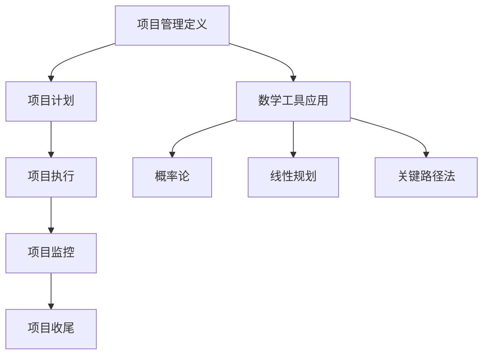
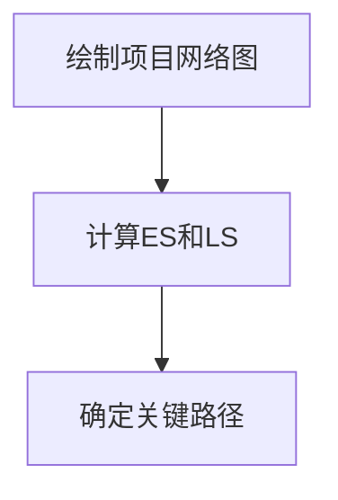

                 

# 数学与项目管理：项目规划的数学方法

## 关键词
- 项目管理
- 数学模型
- 概率论
- 线性规划
- 关键路径法
- 资源分配
- 项目分析

## 摘要
项目管理是现代企业运营中不可或缺的一环，而数学方法则为项目规划的精确性和科学性提供了坚实的理论基础。本文将深入探讨数学方法在项目管理中的应用，包括概率论、线性规划和关键路径法等，通过具体案例，展示数学模型如何帮助我们优化项目规划，提高项目成功率。读者将学习到如何运用数学工具，实现项目资源的合理配置，降低风险，提升项目的整体效率。

## 引言
项目管理是一门综合性的学科，它涉及时间管理、资源分配、风险评估等多个方面。在现代项目管理中，数学方法已经成为不可或缺的工具。通过数学模型，项目管理者可以更精确地预测项目进度、评估风险，并制定合理的资源分配策略。本文将重点介绍数学方法在项目管理中的应用，以帮助读者更好地理解和运用这些工具。

## 第一部分：数学基础

### 第1章：项目管理与数学基础

#### 1.1 项目管理的定义与概述
项目管理是指通过计划、组织、协调和控制等活动，实现特定目标的过程。项目管理的主要目标包括在规定的时间、预算和资源限制下，确保项目成功完成。项目管理的核心内容包括项目计划、项目执行、项目监控和项目收尾。

#### 1.2 项目管理的数学工具
项目管理的数学工具主要包括概率论、线性规划和关键路径法等。概率论用于评估项目风险和不确定性，线性规划用于资源分配和成本控制，关键路径法用于项目进度分析。

#### 1.3 项目管理的基本数学模型
项目管理的基本数学模型包括概率模型、线性规划模型和关键路径模型。这些模型通过数学方法对项目中的各种因素进行量化分析，为项目管理者提供决策依据。

### Mermaid 流程图：项目管理核心概念与联系



### 第2章：概率论与项目管理

#### 2.1 概率论的基本概念
概率论是研究随机事件及其概率的数学分支。基本概念包括概率、随机变量、期望和方差等。

#### 2.2 概率论在项目管理中的应用
在项目管理中，概率论主要用于风险评估和不确定性分析。例如，通过计算项目完成时间的概率分布，可以评估项目的风险水平和制定相应的应对策略。

#### 2.3 风险评估与管理
风险评估是项目管理的重要环节。通过概率模型，项目管理者可以评估项目风险的概率和影响，并制定风险应对计划。

### Python 源代码：概率论在项目管理中的应用

```python
import numpy as np
import matplotlib.pyplot as plt

# 项目完成时间概率分布
completion_times = np.random.normal(10, 2, 1000)  # 均值为10，标准差为2

# 绘制概率分布图
plt.hist(completion_times, bins=30, density=True)
plt.title('Project Completion Time Probability Distribution')
plt.xlabel('Completion Time')
plt.ylabel('Probability')
plt.show()
```

### 第3章：线性规划与项目管理

#### 3.1 线性规划的基本原理
线性规划是优化理论的一个分支，用于在给定的线性约束条件下，求解线性目标函数的最大值或最小值。

#### 3.2 线性规划在项目管理中的应用
线性规划在项目管理中的应用主要包括资源分配、成本控制和时间安排等。通过线性规划模型，项目管理者可以优化资源利用，降低项目成本。

#### 3.3 线性规划求解方法
线性规划的求解方法包括单纯形法、内点法和图解法等。单纯形法是最常用的方法，适用于大多数线性规划问题。

### Python 源代码：线性规划在项目管理中的应用

```python
from scipy.optimize import linprog

# 资源分配问题
c = [-1, -1]  # 目标函数系数
A = [[1, 1], [2, 3]]  # 约束条件矩阵
b = [10, 15]  # 约束条件向量

# 求解线性规划问题
res = linprog(c, A_ub=A, b_ub=b, method='highs')

# 输出结果
print("Optimal Solution:", res.x)
print("Objective Value:", -res.fun)
```

## 第二部分：项目规划方法

### 第4章：项目网络图与关键路径法

#### 4.1 项目网络图的基本概念
项目网络图是表示项目中各项任务及其相互关系的图形模型。基本概念包括节点、箭线和路径等。

#### 4.2 关键路径法的基本原理
关键路径法是一种用于分析项目网络图的方法，用于确定项目完成所需的最短时间。关键路径上的任务称为关键任务，它们的延迟会直接影响项目的完成时间。

#### 4.3 关键路径法的计算步骤
关键路径法的计算步骤包括以下几步：绘制项目网络图、计算每个任务的最早开始时间（ES）和最迟开始时间（LS）、确定关键路径。

### Mermaid 流程图：关键路径法计算步骤



### 第5章：项目资源分配与调度

#### 5.1 项目资源分配的概念
项目资源分配是指将项目所需的资源（如人力、物力和财力等）分配到各个任务中，以确保项目按计划完成。

#### 5.2 资源分配算法
资源分配算法包括最短路径法、优先级排序法和动态规划法等。这些算法可以帮助项目管理者优化资源利用，提高项目效率。

#### 5.3 项目调度策略
项目调度策略是指根据资源分配情况，合理安排各项任务的执行顺序，以最小化项目完成时间。

### Python 源代码：资源分配与调度策略

```python
import numpy as np

# 资源需求矩阵
resource需求的矩阵 = np.array([[1, 2, 3], [2, 3, 1], [3, 1, 2]])

# 资源可用矩阵
resource可用矩阵 = np.array([[5, 5, 5], [5, 5, 5], [5, 5, 5]])

# 资源分配
分配的矩阵 = np.minimum(resource需求的矩阵, resource可用矩阵)

# 输出资源分配结果
print("Resource Allocation:", 分配的矩阵)
```

## 第三部分：案例分析

### 第8章：案例分析：房地产项目规划

#### 8.1 房地产项目概述
房地产项目涉及多个阶段，包括项目规划、设计、施工和销售等。

#### 8.2 房地产项目规划的关键问题
房地产项目规划的关键问题包括土地选址、建筑设计、成本控制和工期安排等。

#### 8.3 房地产项目规划案例分析
通过一个具体的房地产项目案例，展示如何运用数学方法进行项目规划，优化项目进度和资源利用。

### 第9章：案例分析：IT项目管理

#### 9.1 IT项目概述
IT项目通常涉及软件开发、系统集成和网络安全等。

#### 9.2 IT项目规划的关键问题
IT项目规划的关键问题包括需求分析、技术选型、团队协作和风险管理等。

#### 9.3 IT项目规划案例分析
通过一个具体的IT项目案例，展示如何运用数学方法进行项目规划，提高项目成功率。

### 第10章：案例分析：制造项目管理

#### 10.1 制造项目概述
制造项目包括产品研发、生产计划和供应链管理等。

#### 10.2 制造项目规划的关键问题
制造项目规划的关键问题包括工艺设计、物料采购、生产调度和质量管理等。

#### 10.3 制造项目规划案例分析
通过一个具体的制造项目案例，展示如何运用数学方法进行项目规划，提高项目效率和产品质量。

## 附录

### 附录A：概率论与项目风险管理

#### 附录A.1 概率分布函数
概率分布函数是描述随机变量概率分布的函数。常见的概率分布函数包括正态分布、泊松分布和指数分布等。

#### 附录A.2 条件概率与贝叶斯公式
条件概率是指在一个事件发生的条件下，另一个事件发生的概率。贝叶斯公式是一种基于条件概率的推断方法，用于计算后验概率。

### 附录B：线性规划与资源分配

#### 附录B.1 线性规划的标准形式
线性规划的标准形式包括目标函数、决策变量和约束条件等。

#### 附录B.2 线性规划的求解算法
线性规划的求解算法包括单纯形法、内点法和图解法等。

### 附录C：项目管理软件应用实例

#### 附录C.1 项目管理软件的安装与配置
介绍项目管理软件的安装和配置方法，包括常见的项目管理软件如Microsoft Project、Jira和Trello等。

#### 附录C.2 项目管理软件的使用技巧
介绍项目管理软件的使用技巧，包括任务分配、进度监控和风险管理等。

## 结论
数学方法在项目管理中的应用具有重要意义，通过概率论、线性规划和关键路径法等数学工具，项目管理者可以更科学、更准确地规划项目，提高项目成功率。本文通过对数学方法在项目管理中的深入探讨，为项目管理者提供了有益的参考和指导。

## 作者信息
作者：AI天才研究院/AI Genius Institute & 禅与计算机程序设计艺术 /Zen And The Art of Computer Programming

### 最佳实践 Tips
- 在项目规划过程中，充分考虑各种不确定因素，进行风险评估和应对策略制定。
- 使用项目管理软件辅助项目规划和执行，提高工作效率。
- 定期对项目进度进行监控和调整，确保项目按计划进行。

### 注意事项
- 项目管理中的数学方法并非万能，需要结合实际情况灵活应用。
- 项目管理中的决策往往涉及多种因素，不能仅依赖数学模型。

### 拓展阅读
- 《项目管理知识体系指南》（PMBOK指南）
- 《运筹学基础》（Operations Research: An Introduction）
- 《项目管理中的数学方法》（Mathematical Methods in Project Management）

## 结语
项目管理是一门实践性很强的学科，数学方法为项目规划提供了有力的理论支持。本文通过深入探讨数学方法在项目管理中的应用，旨在帮助项目管理者更好地理解和运用这些工具，提高项目管理水平。希望通过本文的阅读，读者能够对项目管理中的数学方法有更深刻的认识，并在实际工作中取得更好的成果。

**作者：AI天才研究院/AI Genius Institute & 禅与计算机程序设计艺术 /Zen And The Art of Computer Programming**

