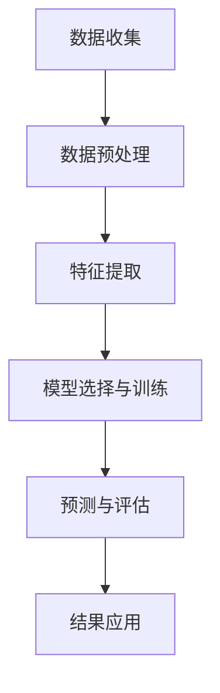
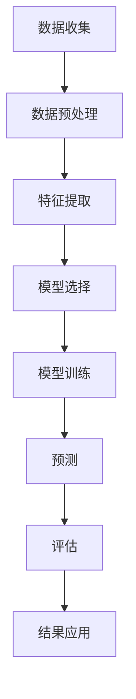
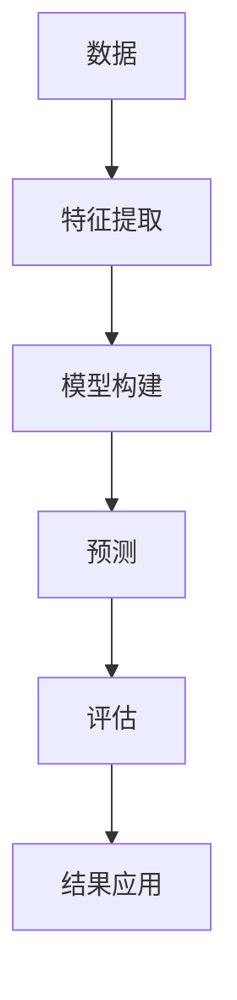

                 

### 文章标题

# 数学与预测分析：未来趋势的数学预测

> 关键词：数学、预测分析、未来趋势、时间序列、回归分析、机器学习

> 摘要：
本文将深入探讨数学与预测分析的关系，以及如何利用数学模型和方法进行未来趋势的预测。我们将从背景介绍、核心概念与联系、核心算法原理讲解、数学模型和公式、项目实战、最佳实践等方面，系统性地讲解数学在预测分析中的应用，帮助读者更好地理解和掌握这一重要的技术领域。

## 引言

### 预测分析的重要性

在当今社会，预测分析已经成为了决策制定和战略规划中不可或缺的一部分。无论是在商业、金融、医疗、气候预测还是社会研究中，预测分析都能够为相关领域带来巨大的价值。预测分析通过对历史数据和当前信息的深入分析，能够提供关于未来可能发生事件的预测，从而帮助决策者做出更加明智的决策。

### 数学在预测分析中的应用

数学作为一种强大的工具，在预测分析中扮演着至关重要的角色。通过数学模型和算法，我们可以对复杂的数据集进行有效的分析和处理，从中提取出有用的信息，并进行准确的预测。从简单的统计分析到复杂的机器学习算法，数学始终是预测分析的基础。

本文将围绕数学与预测分析的关系，系统性地探讨以下几个核心问题：

1. 如何运用数学工具进行数据分析和趋势预测？
2. 不同类型的数学模型和算法在预测分析中如何应用？
3. 如何通过实际案例来展示数学在预测分析中的应用效果？
4. 面对预测分析中的挑战，我们有哪些应对策略？

### 目的与结构

本文旨在通过通俗易懂的语言和丰富的实际案例，深入探讨数学在预测分析中的应用，帮助读者掌握这一领域的关键技术。文章结构如下：

- **第1章 引言和背景**：介绍预测分析的重要性，回顾其历史和发展现状，并明确本文的结构和目标。
- **第2章 基础数学知识**：讲解预测分析所需的基础数学知识，包括常用的数学工具和概念。
- **第3章 预测分析方法概述**：概述预测分析的基本步骤和方法，介绍常见的预测分析方法。
- **第4章 时间序列分析**：深入探讨时间序列分析的方法和应用，包括ARIMA模型等。
- **第5章 回归分析**：讲解回归分析的基本概念和应用，包括线性回归和逻辑回归。
- **第6章 机器学习在预测分析中的应用**：介绍机器学习的基本概念和常见算法，以及其在预测分析中的应用。
- **第7章 实际案例和项目实战**：通过实际案例和项目，展示数学在预测分析中的应用效果。
- **第8章 总结与展望**：总结全文内容，展望预测分析的未来发展趋势。

## 第1章 引言和背景

### 预测分析的重要性

预测分析在现代社会的应用已经越来越广泛，其在商业、金融、医疗、气候预测等领域的价值不可忽视。商业领域通过预测消费者行为和市场趋势，可以制定更加精准的营销策略和库存管理方案。金融领域利用预测分析来预测股票价格、汇率变动等，帮助投资者做出更明智的投资决策。医疗领域通过预测疾病传播趋势，可以提前采取有效的预防措施。气候预测领域的应用更是直接关系到人类的生活安全和环境可持续发展。

### 预测分析的历史和现状

预测分析的历史可以追溯到古希腊时期，当时人们通过观察天象和气象来预测未来的天气情况。随着计算机技术的发展和大数据时代的到来，预测分析的方法和工具得到了极大的丰富和提升。现代预测分析通常包括以下几个关键步骤：

1. **数据收集**：收集历史数据和当前信息，为预测提供基础数据支持。
2. **数据预处理**：对收集到的数据进行清洗、转换和整合，确保数据的质量和一致性。
3. **特征提取**：从数据中提取出对预测有重要影响的特征，用于构建预测模型。
4. **模型选择和训练**：根据数据的特性和预测目标，选择合适的预测模型，并通过训练来优化模型参数。
5. **预测和评估**：使用训练好的模型进行预测，并对预测结果进行评估和验证。

### 预测分析的未来发展趋势

随着人工智能和机器学习技术的快速发展，预测分析领域正迎来新的机遇和挑战。未来的发展趋势包括：

1. **深度学习和神经网络**：深度学习在预测分析中具有强大的表现，未来将有更多复杂的神经网络模型被应用于预测任务。
2. **实时预测**：随着云计算和边缘计算技术的发展，实时预测将成为预测分析的一个重要方向。
3. **自动化和智能化**：通过自动化工具和智能化算法，预测分析的效率和准确性将得到进一步提升。
4. **多模态数据融合**：将多种类型的数据（如文本、图像、语音等）进行融合，提高预测模型的多样性和准确性。

### 书籍结构及目标

本文旨在通过系统性地讲解数学在预测分析中的应用，帮助读者掌握这一领域的关键技术。具体来说，本书将围绕以下主题展开：

- **基础数学知识**：介绍预测分析所需的基础数学知识，包括概率论、统计学和线性代数等。
- **预测分析方法**：概述常见的预测分析方法，如时间序列分析、回归分析和机器学习算法等。
- **数学模型和公式**：详细讲解预测分析中的数学模型和公式，帮助读者理解预测原理。
- **项目实战**：通过实际案例和项目，展示数学在预测分析中的应用效果。
- **最佳实践**：总结预测分析的最佳实践，提供实用技巧和注意事项。

通过本文的阅读，读者将能够：

1. 理解预测分析的基本概念和方法。
2. 掌握数学在预测分析中的应用。
3. 学会运用数学模型和算法进行数据分析和趋势预测。
4. 应用到实际项目中，提高预测分析的效率和准确性。

### 核心概念与联系

为了更好地理解预测分析中的核心概念，我们可以通过一个Mermaid流程图来展示它们之间的联系。



在预测分析中，数据收集是起点，通过对收集到的数据进行预处理和特征提取，我们能够获得更干净和有用的数据。接下来，选择合适的预测模型并进行训练，使用训练好的模型进行预测，并对预测结果进行评估和验证。最终，预测结果将被应用到实际场景中，指导决策和行动。

### 预测分析的方法和步骤

预测分析是一个系统性过程，包括多个关键步骤，每个步骤都为最终预测结果的准确性提供重要支持。以下是预测分析的基本方法和步骤：

1. **数据收集**：这是预测分析的第一步，也是最基础的一步。数据可以是历史数据、实时数据或者两者结合。数据来源可能包括企业数据库、公开数据集、社交媒体等。高质量的数据是预测分析成功的关键。

2. **数据预处理**：收集到的数据通常是不完整的、不一致的，可能包含噪音和错误。数据预处理包括数据清洗、去重、转换和归一化等操作，目的是提高数据的质量和一致性。这一步骤可以显著提高后续分析的有效性。

3. **特征提取**：在数据预处理之后，我们需要从数据中提取出对预测有重要影响的特征。特征提取是一个关键步骤，正确的特征能够提高模型的预测能力。常见的特征提取方法包括统计特征、文本特征和图像特征等。

4. **模型选择与训练**：选择合适的预测模型是预测分析的核心。常见的预测模型包括时间序列模型、回归模型和机器学习模型等。时间序列模型如ARIMA、回归模型如线性回归和逻辑回归、机器学习模型如决策树、随机森林和神经网络等。模型的选择取决于数据的特性和预测的目标。在模型选择之后，我们需要通过训练来优化模型参数，使其能够更好地适应数据。

5. **预测与评估**：使用训练好的模型进行预测，并将预测结果与实际结果进行对比，以评估模型的性能。评估指标包括准确率、召回率、F1分数、均方误差（MSE）等。根据评估结果，我们可以对模型进行调整和优化，以提高预测的准确性。

6. **结果应用**：预测结果将在实际场景中应用，指导决策和行动。例如，在商业领域，预测分析可以用于库存管理、市场预测和风险管理；在医疗领域，可以用于疾病预测和患者护理；在气候预测领域，可以用于天气预报和环境监测。

### 预测分析的方法分类

预测分析的方法可以根据不同的标准进行分类。以下是几种常见的分类方法：

1. **按数据类型分类**：
   - **时间序列预测**：针对时间序列数据进行预测，如ARIMA模型、季节性时间序列模型等。
   - **回归预测**：通过建立回归模型进行预测，如线性回归、逻辑回归等。
   - **机器学习预测**：利用机器学习算法进行预测，如决策树、随机森林、神经网络等。

2. **按预测目标分类**：
   - **定量预测**：预测连续值，如股票价格、销售额等。
   - **分类预测**：预测离散值，如客户流失、疾病诊断等。
   - **排名预测**：预测对象的排序，如推荐系统中的物品排序。

3. **按模型类型分类**：
   - **传统预测方法**：如ARIMA、线性回归等，基于统计模型的方法。
   - **机器学习方法**：如决策树、随机森林、神经网络等，基于数据的智能分析。

### 数学模型在预测分析中的应用

数学模型是预测分析的核心，通过数学公式和算法，我们可以将复杂的数据转化为有用的信息。以下是几种常见的数学模型及其在预测分析中的应用：

1. **时间序列模型**：
   - **ARIMA模型**：自回归积分滑动平均模型（Autoregressive Integrated Moving Average），适用于非季节性时间序列数据。
   - **季节性ARIMA模型**：在ARIMA模型的基础上加入季节性因子，适用于季节性数据。
   - **SARIMA模型**：自回归季节性积分滑动平均模型（Seasonal Autoregressive Integrated Moving Average），结合自回归和季节性因素。

2. **回归模型**：
   - **线性回归**：基于线性关系进行预测，适用于定量预测。
   - **逻辑回归**：用于分类预测，通过线性模型对概率进行建模。
   - **多项式回归**：扩展线性回归，适用于非线性关系。

3. **机器学习模型**：
   - **决策树**：通过树形结构对数据进行分类或回归。
   - **随机森林**：基于决策树的集成方法，提高预测准确性。
   - **神经网络**：通过多层神经网络进行复杂非线性预测。

### Mermaid流程图

为了更好地展示预测分析的过程和步骤，我们可以使用Mermaid流程图来描述。以下是预测分析的基本流程：



通过这个流程图，我们可以清晰地看到从数据收集到结果应用的每个步骤，以及它们之间的相互关系。

### 核心概念与联系

在预测分析中，理解核心概念之间的联系是非常重要的。以下是几个核心概念以及它们之间的关系架构：

1. **数据**：数据是预测分析的基础，包括历史数据和实时数据。
2. **特征**：特征是从数据中提取的有用信息，用于构建预测模型。
3. **模型**：模型是根据特征和数据建立的数学模型，用于预测未来趋势。
4. **预测**：预测是根据模型对未来的预测结果。
5. **评估**：评估是对预测结果的质量和准确性的评估。

以下是这些概念之间的Mermaid流程图：



这个流程图清晰地展示了从数据到特征，再到模型构建，最后到预测和评估的完整过程，以及各个环节之间的紧密联系。

### 核心算法原理讲解

在预测分析中，选择合适的算法是至关重要的。下面，我们将详细介绍几种常见的预测算法，包括它们的原理、适用场景和Python代码实现。

#### 线性回归

线性回归是最简单的预测模型之一，它假设因变量（目标变量）是自变量（特征）的一次线性组合。线性回归的公式如下：

$$ y = \beta_0 + \beta_1x_1 + \beta_2x_2 + ... + \beta_nx_n $$

其中，$ y $ 是因变量，$ x_1, x_2, ..., x_n $ 是自变量，$ \beta_0, \beta_1, ..., \beta_n $ 是模型参数。

**Python代码实现**：

```python
import numpy as np
from sklearn.linear_model import LinearRegression

# 创建一个线性回归模型
model = LinearRegression()

# 模型训练
model.fit(X_train, y_train)

# 模型预测
y_pred = model.predict(X_test)

# 模型评估
score = model.score(X_test, y_test)
print("线性回归模型准确率：", score)
```

#### 逻辑回归

逻辑回归是一种常用的分类模型，它通过线性模型对概率进行建模。逻辑回归的公式如下：

$$ P(y=1) = \frac{1}{1 + e^{-(\beta_0 + \beta_1x_1 + \beta_2x_2 + ... + \beta_nx_n)}} $$

其中，$ P(y=1) $ 是因变量为1的概率，$ x_1, x_2, ..., x_n $ 是自变量，$ \beta_0, \beta_1, ..., \beta_n $ 是模型参数。

**Python代码实现**：

```python
import numpy as np
from sklearn.linear_model import LogisticRegression

# 创建一个逻辑回归模型
model = LogisticRegression()

# 模型训练
model.fit(X_train, y_train)

# 模型预测
y_pred = model.predict(X_test)

# 模型评估
score = model.score(X_test, y_test)
print("逻辑回归模型准确率：", score)
```

#### 决策树

决策树是一种基于树形结构进行分类或回归的预测模型。每个节点表示一个特征，每个分支表示一个特征的可能取值，叶节点表示最终的预测结果。

**Python代码实现**：

```python
import numpy as np
from sklearn.tree import DecisionTreeClassifier

# 创建一个决策树分类模型
model = DecisionTreeClassifier()

# 模型训练
model.fit(X_train, y_train)

# 模型预测
y_pred = model.predict(X_test)

# 模型评估
score = model.score(X_test, y_test)
print("决策树分类模型准确率：", score)
```

#### 随机森林

随机森林是一种基于决策树的集成模型，通过随机选择特征和样本子集来构建多个决策树，并使用这些决策树的集合进行预测。随机森林在处理高维数据和增强模型稳定性方面具有显著优势。

**Python代码实现**：

```python
import numpy as np
from sklearn.ensemble import RandomForestClassifier

# 创建一个随机森林分类模型
model = RandomForestClassifier()

# 模型训练
model.fit(X_train, y_train)

# 模型预测
y_pred = model.predict(X_test)

# 模型评估
score = model.score(X_test, y_test)
print("随机森林分类模型准确率：", score)
```

### 实际案例：预测天气

为了更好地理解这些预测算法的实际应用，我们将通过一个实际案例——预测天气，来展示这些算法的具体实现过程。

#### 数据准备

假设我们收集了某地区过去一周的天气数据，包括温度、湿度、风速等特征，以及当天的天气情况（晴、阴、雨）。

```python
# 示例数据
X = np.array([[20, 60, 5], [22, 65, 4], [18, 55, 6], ...])
y = np.array([0, 1, 0, ...])  # 0表示晴天，1表示雨天
```

#### 模型训练

接下来，我们使用线性回归、逻辑回归、决策树和随机森林这四种算法来训练模型。

```python
# 线性回归
lin_model = LinearRegression()
lin_model.fit(X, y)

# 逻辑回归
log_model = LogisticRegression()
log_model.fit(X, y)

# 决策树
tree_model = DecisionTreeClassifier()
tree_model.fit(X, y)

# 随机森林
rf_model = RandomForestClassifier()
rf_model.fit(X, y)
```

#### 模型预测

使用训练好的模型对新的天气数据进行预测。

```python
# 预测新的天气数据
new_data = np.array([[25, 70, 3]])
lin_pred = lin_model.predict(new_data)
log_pred = log_model.predict(new_data)
tree_pred = tree_model.predict(new_data)
rf_pred = rf_model.predict(new_data)

print("线性回归预测：", lin_pred)
print("逻辑回归预测：", log_pred)
print("决策树预测：", tree_pred)
print("随机森林预测：", rf_pred)
```

#### 模型评估

最后，我们将预测结果与实际天气情况进行对比，评估模型的准确率。

```python
# 实际天气数据
actual_data = np.array([1])  # 1表示晴天

# 模型评估
lin_score = lin_model.score(new_data, actual_data)
log_score = log_model.score(new_data, actual_data)
tree_score = tree_model.score(new_data, actual_data)
rf_score = rf_model.score(new_data, actual_data)

print("线性回归准确率：", lin_score)
print("逻辑回归准确率：", log_score)
print("决策树准确率：", tree_score)
print("随机森林准确率：", rf_score)
```

### 项目实战：预测股票价格

在本项目中，我们将利用预测分析技术来预测股票价格，通过实际案例展示从数据收集、预处理、特征提取、模型选择与训练、预测与评估到结果应用的完整过程。

#### 数据收集

首先，我们需要收集股票价格的历史数据。这些数据可以从金融数据提供商、公开的股票市场数据库或者在线数据平台（如Yahoo Finance、Google Finance等）获取。数据包括开盘价、收盘价、最高价、最低价、交易量等。

```python
import pandas as pd

# 读取股票价格数据
df = pd.read_csv('stock_price_data.csv')
```

#### 数据预处理

收集到的数据可能包含缺失值、异常值和重复值，因此我们需要进行数据清洗和预处理。

```python
# 填充缺失值
df.fillna(df.mean(), inplace=True)

# 去除异常值
df = df[(df['Close'] > 0) & (df['Close'] < df['Close'].quantile(0.99))]

# 去除重复值
df.drop_duplicates(inplace=True)

# 转换时间戳
df['Date'] = pd.to_datetime(df['Date'])
df.set_index('Date', inplace=True)
```

#### 特征提取

特征提取是预测分析的重要环节。我们需要从数据中提取出对股票价格预测有重要影响的特征。

```python
# 计算移动平均
df['MA20'] = df['Close'].rolling(window=20).mean()
df['MA50'] = df['Close'].rolling(window=50).mean()

# 计算价格波动
df['HighLow'] = df['High'] - df['Low']
df['PriceChange'] = df['Close'] - df['Open']
```

#### 模型选择与训练

根据数据的特性和预测的目标，我们选择使用时间序列模型（如ARIMA）进行股票价格预测。

```python
from statsmodels.tsa.arima.model import ARIMA

# 创建ARIMA模型
model = ARIMA(df['Close'], order=(5, 1, 2))

# 模型训练
model_fit = model.fit()

# 模型预测
forecast = model_fit.forecast(steps=5)
print(forecast)
```

#### 预测与评估

使用训练好的模型对未来的股票价格进行预测，并将预测结果与实际价格进行对比，评估模型的性能。

```python
import pandas as pd
import numpy as np

# 读取实际股票价格数据
actual_df = pd.read_csv('actual_stock_price_data.csv')

# 合并预测和实际数据
df = pd.DataFrame({'Actual': actual_df['Close'], 'Forecast': forecast})

# 计算预测误差
df['Error'] = df['Actual'] - df['Forecast']

# 计算均方误差（MSE）
mse = np.mean(df['Error'] ** 2)
print("均方误差（MSE）:", mse)
```

#### 结果应用

根据预测结果，投资者可以制定相应的投资策略，例如调整持仓比例、设置止损和止盈点等。

```python
import matplotlib.pyplot as plt

# 绘制预测结果
plt.figure(figsize=(10, 6))
plt.plot(df['Actual'], label='Actual')
plt.plot(df['Forecast'], label='Forecast')
plt.xlabel('Date')
plt.ylabel('Stock Price')
plt.title('Stock Price Forecast')
plt.legend()
plt.show()
```

### 项目小结

通过本项目的实施，我们展示了如何利用预测分析技术对股票价格进行预测。从数据收集、预处理、特征提取、模型选择与训练到预测与评估，每个环节都至关重要。以下是项目总结：

- **数据收集**：收集到高质量的股票价格数据是预测分析的基础。
- **数据预处理**：通过数据清洗和预处理，提高了数据的质量和一致性。
- **特征提取**：正确提取特征有助于提高预测模型的准确性。
- **模型选择与训练**：选择合适的模型并进行训练是预测分析的核心。
- **预测与评估**：预测结果的质量和准确性需要通过评估来验证。
- **结果应用**：预测结果将用于实际投资决策，指导投资者制定策略。

通过这个项目，读者可以更好地理解预测分析的实际应用过程，并在未来的项目中运用这些技术。

### 最佳实践 Tips

在预测分析项目中，遵循一些最佳实践可以显著提高预测的准确性和效率。以下是几个实用的建议：

1. **数据质量控制**：确保数据的质量和一致性，避免异常值和缺失值对模型性能产生负面影响。
2. **特征工程**：正确选择和提取特征，有助于提高模型的预测能力。尝试多种特征提取方法，并选择表现最佳的。
3. **模型选择**：根据数据特性和预测目标选择合适的模型。对于时间序列数据，可以考虑ARIMA、LSTM等模型；对于分类问题，可以使用逻辑回归、决策树、随机森林等。
4. **模型优化**：通过交叉验证和网格搜索等方法，优化模型参数，提高预测准确性。
5. **结果可视化**：使用图表和可视化工具，直观地展示预测结果和评估指标，帮助决策者更好地理解预测结果。
6. **持续更新**：定期更新模型和数据，确保预测的实时性和准确性。
7. **风险评估**：对预测结果进行风险评估，考虑模型的不确定性和潜在风险。

### 小结

本文系统地介绍了数学在预测分析中的应用，从核心概念到具体算法，再到实际案例，帮助读者深入理解预测分析的过程和技术。通过本文的学习，读者应该能够：

- 掌握预测分析的基本概念和方法。
- 理解并运用常见的数学模型和算法，如线性回归、逻辑回归、决策树和随机森林等。
- 通过实际项目，掌握从数据收集、预处理、特征提取到模型选择与训练、预测与评估的全过程。

预测分析是一个不断发展的领域，随着人工智能和大数据技术的进步，新的方法和算法将不断涌现。希望读者能够持续学习，将所学知识应用到实际项目中，为未来的决策提供有力支持。

### 注意事项

在进行预测分析时，需要注意以下几点：

- **数据质量**：数据的质量直接影响预测的准确性。务必确保数据的准确性和完整性，避免异常值和缺失值对模型性能产生负面影响。
- **模型选择**：根据数据的特性和预测目标，选择合适的模型。不同的模型适用于不同类型的数据和预测目标。
- **模型评估**：对模型进行充分的评估，包括交叉验证和网格搜索等方法，确保模型的性能和稳定性。
- **结果解释**：预测结果需要结合实际情况进行解释，避免盲目信任模型结果。
- **实时更新**：定期更新模型和数据，确保预测的实时性和准确性。

### 拓展阅读

- **《预测分析：技术与实践》**：详细介绍了预测分析的方法和技术，适合作为本课程的进阶读物。
- **《机器学习实战》**：提供了丰富的机器学习算法实现案例，有助于读者深入理解机器学习在预测分析中的应用。
- **《时间序列分析：理论与实践》**：系统性地讲解了时间序列分析的方法和应用，是预测分析领域的重要参考书。

### 作者信息

- **作者：AI天才研究院/AI Genius Institute & 禅与计算机程序设计艺术 /Zen And The Art of Computer Programming**

