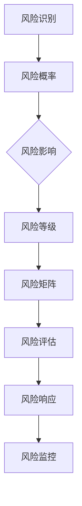

                 

### 《数学与风险管理：风险评估的数学方法》

关键词：数学模型、风险评估、风险管理、概率论、统计学、优化算法

摘要：本文从数学的角度深入探讨了风险评估中的关键概念和方法，包括概率论、统计分析和优化算法在风险管理中的应用。文章详细讲解了数学模型如何帮助量化风险，并提供了Python源代码实例，以展示核心算法的实践应用。通过实际案例的分析，本文展示了数学工具在风险管理中的实际效果，并提出了最佳实践建议。

## 引言

风险管理是金融、保险、投资等领域中不可或缺的一部分。随着全球经济复杂性的增加，有效管理风险变得尤为重要。数学作为一门科学，其严谨性和逻辑性使得它成为理解和量化风险的有力工具。本文旨在探讨数学在风险管理中的应用，特别是风险评估的数学方法。

风险管理涉及识别、评估、监控和降低风险的过程。而风险评估是风险管理的核心环节，它通过分析潜在风险的概率和影响，帮助决策者制定有效的风险管理策略。传统的风险评估方法往往依赖于经验判断和主观评价，而现代风险评估更加强调使用数学模型和统计分析来提高客观性和准确性。

数学在风险管理中的应用广泛而深入，涵盖了概率论、统计学、优化算法等多个领域。概率论提供了描述随机事件的方法，帮助我们理解风险事件的可能性和不确定性。统计学则通过数据分析和建模，提供了评估风险影响和制定应对策略的工具。优化算法则帮助我们在多个可能的选择中找到最优的风险管理方案。

本文结构如下：首先介绍风险管理的基本概念和方法，然后深入探讨数学在风险评估中的应用，包括概率论、统计学和优化算法。接着，通过Python源代码实例展示核心算法的实践应用。最后，通过实际案例的分析，总结最佳实践并展望未来研究方向。

## 风险管理的基本概念和方法

### 风险管理的定义

风险管理是一个系统化的过程，旨在识别、评估、监控和降低风险，以确保组织的财务稳定和运营效率。风险管理不仅仅关注潜在威胁的规避，还包括对机会的捕捉和利用。其目标是最大化组织价值的同时，将风险降低到可接受的水平。

风险管理的四个关键步骤包括：

1. **风险识别**：识别可能影响组织目标实现的潜在风险。
2. **风险评估**：评估识别出的风险的可能性和影响。
3. **风险响应**：制定和实施策略来应对识别和评估的风险。
4. **风险监控**：持续监控风险状态，确保风险管理策略的有效性。

### 风险评估的方法

风险评估是风险管理过程中的关键环节，其目的是量化潜在风险，为决策提供依据。常用的风险评估方法包括：

1. **定性评估**：通过专家判断和主观评价来评估风险的可能性和影响。
2. **定量评估**：使用数学模型和统计分析方法来量化风险。

定性与定量评估方法各有优缺点。定性评估方法灵活、成本较低，但主观性较强，可能存在偏差。而定量评估方法则更加客观、精确，但需要丰富的数据和复杂的模型。

### 风险管理技术

风险管理技术是实施风险管理策略的工具和手段，包括以下几种：

1. **风险规避**：通过避免风险源来减少风险。
2. **风险转移**：通过保险或合同将风险转移给第三方。
3. **风险缓解**：采取措施降低风险的概率或影响。
4. **风险接受**：在风险评估认为风险在可接受范围内时，选择接受风险。

### 数学在风险管理中的作用

数学在风险管理中扮演着至关重要的角色。它提供了一套系统化的方法来量化风险，使得风险评估更加客观、精确。数学工具主要包括概率论、统计学和优化算法。

1. **概率论**：概率论是研究随机事件及其概率的数学分支。在风险管理中，概率论帮助识别风险事件的可能性，并评估其可能带来的影响。
   
2. **统计学**：统计学是处理数据收集、分析、解释和呈现的数学分支。在风险管理中，统计学通过数据分析和建模，帮助理解风险的变化趋势和潜在影响因素。

3. **优化算法**：优化算法用于在多个可能的选择中找到最优解。在风险管理中，优化算法帮助决策者在资源有限的情况下，选择最优的风险管理策略。

### 风险评估的核心概念与联系

为了更好地理解风险评估，我们需要了解一些核心概念，并探讨它们之间的联系。

1. **风险概率**：风险概率是风险事件发生的可能性。它通常通过概率分布来描述。
   
2. **风险影响**：风险影响是风险事件发生时可能带来的损失或收益。风险影响可以是财务上的，也可以是运营上的。

3. **风险等级**：风险等级是衡量风险严重程度的一个指标，通常根据风险概率和风险影响来确定。

4. **风险矩阵**：风险矩阵是一个二维表，用于展示风险概率和风险影响的组合，并确定风险等级。

通过这些核心概念，我们可以构建一个风险评估的框架，如图1所示。



图1：风险评估的核心概念与联系

## 核心算法原理讲解

### 概率论在风险评估中的应用

概率论是风险评估的基础工具，用于描述和分析随机事件。以下是一些在风险评估中常用的概率论概念：

1. **概率分布**：概率分布描述了随机变量取值的概率。常见的概率分布包括正态分布、泊松分布、二项分布等。

2. **条件概率**：条件概率是指在给定某一事件发生的条件下，另一事件发生的概率。条件概率通过贝叶斯定理进行计算。

3. **贝叶斯定理**：贝叶斯定理是一种用于更新概率估计的公式，它基于先验概率和观察到的数据，计算出后验概率。

#### Python源代码实例：贝叶斯估计

以下是一个简单的Python代码示例，用于演示贝叶斯估计的基本原理。

```python
import numpy as np
from scipy.stats import norm

# 定义先验概率
prior = norm.pdf(np.linspace(-5, 5, 1000), loc=0, scale=1)

# 定义似然函数
likelihood = norm.pdf(np.linspace(-5, 5, 1000), loc=3, scale=0.5)

# 计算后验概率
posterior = likelihood * prior
posterior /= np.sum(posterior)

# 绘制概率分布
import matplotlib.pyplot as plt
plt.plot(np.linspace(-5, 5, 1000), posterior)
plt.title('Posterior Probability')
plt.xlabel('Value')
plt.ylabel('Probability')
plt.show()
```

在这个例子中，我们首先定义了先验概率分布和似然函数，然后使用贝叶斯定理计算后验概率分布。最后，我们通过绘制概率分布图来可视化结果。

### 统计学在风险评估中的应用

统计学在风险评估中用于数据分析和建模，以量化风险的概率和影响。以下是一些在风险评估中常用的统计学概念：

1. **平均值和方差**：平均值和方差是描述数据集中心位置和离散程度的统计量。

2. **假设检验**：假设检验是一种用于确定数据是否支持特定假设的统计方法。

3. **回归分析**：回归分析是一种用于建立自变量和因变量之间关系的统计方法。

#### Python源代码实例：线性回归

以下是一个简单的Python代码示例，用于演示线性回归的基本原理。

```python
import numpy as np
from sklearn.linear_model import LinearRegression
import matplotlib.pyplot as plt

# 创建数据集
X = np.random.normal(size=100)
Y = 2 * X + np.random.normal(size=100)

# 进行线性回归
model = LinearRegression()
model.fit(X.reshape(-1, 1), Y)

# 绘制回归线
plt.scatter(X, Y)
plt.plot(X, model.predict(X.reshape(-1, 1)), color='red')
plt.title('Linear Regression')
plt.xlabel('X')
plt.ylabel('Y')
plt.show()
```

在这个例子中，我们首先创建了一个数据集，然后使用线性回归模型拟合数据集。最后，我们通过绘制回归线来可视化结果。

### 优化算法在风险评估中的应用

优化算法在风险评估中用于在多个可能的选择中找到最优解。以下是一些在风险评估中常用的优化算法：

1. **线性规划**：线性规划用于在满足约束条件的情况下，最大化或最小化线性目标函数。

2. **非线性规划**：非线性规划用于在满足约束条件的情况下，最大化或最小化非线性目标函数。

3. **遗传算法**：遗传算法是一种模拟自然选择和遗传机制的优化算法。

#### Python源代码实例：线性规划

以下是一个简单的Python代码示例，用于演示线性规划的基本原理。

```python
import numpy as np
from scipy.optimize import linprog

# 定义目标函数和约束条件
c = [-1, -1]  # 目标函数：最大化 z = -x1 - x2
A = [[1, 1], [1, 0], [0, 1]]  # 约束条件
b = [4, 3, 2]  # 约束条件的右侧常数

# 进行线性规划
result = linprog(c, A_ub=A, b_ub=b, method='highs')

# 输出结果
print("Optimal value:", -result.x[0] - result.x[1])
print("Solution:", result.x)
```

在这个例子中，我们首先定义了目标函数和约束条件，然后使用线性规划求解器求解最优解。最后，我们输出最优解的目标函数值和变量值。

## 数学模型和数学公式

在风险评估中，数学模型和数学公式是理解和量化风险的关键工具。以下是一些常用的数学模型和数学公式：

### 概率分布

$$
f(x) = \frac{1}{\sqrt{2\pi\sigma^2}} e^{-\frac{(x-\mu)^2}{2\sigma^2}}
$$

这是正态分布的概率密度函数，其中$\mu$是均值，$\sigma$是标准差。

### 贝叶斯定理

$$
P(A|B) = \frac{P(B|A)P(A)}{P(B)}
$$

这是贝叶斯定理的表达式，用于计算在给定条件下的后验概率。

### 线性回归

$$
y = \beta_0 + \beta_1x + \epsilon
$$

这是线性回归模型的方程，其中$y$是因变量，$x$是自变量，$\beta_0$是截距，$\beta_1$是斜率，$\epsilon$是误差项。

### 线性规划

$$
\min c^T x \\
s.t. Ax \leq b
$$

这是线性规划模型的标准形式，其中$c$是目标函数系数，$A$是约束条件系数矩阵，$b$是约束条件右侧常数。

### 非线性规划

$$
\min f(x) \\
s.t. g_i(x) \leq 0, h_j(x) = 0
$$

这是非线性规划模型的标准形式，其中$f(x)$是目标函数，$g_i(x)$和$h_j(x)$是约束条件。

通过这些数学模型和数学公式，我们可以对风险进行量化分析，为决策提供科学依据。

## 项目实战

### 开发环境搭建

在进行风险评估的项目实战之前，我们需要搭建一个适合开发的环境。以下是搭建开发环境的基本步骤：

1. **安装Python**：首先，确保系统中安装了Python。Python是一种广泛使用的编程语言，特别适合数据分析和建模。

2. **安装必要的库**：接下来，我们需要安装一些必要的Python库，如NumPy、Pandas、Scikit-learn和Matplotlib。这些库提供了丰富的数据分析和可视化工具。

   ```bash
   pip install numpy pandas scikit-learn matplotlib
   ```

3. **配置Jupyter Notebook**：Jupyter Notebook是一种交互式计算环境，适合进行数据分析和建模。通过以下命令安装Jupyter Notebook：

   ```bash
   pip install notebook
   ```

   安装完成后，可以通过运行`jupyter notebook`命令启动Jupyter Notebook。

### 源代码详细实现和代码解读

在搭建好开发环境后，我们可以开始编写源代码实现风险评估模型。以下是一个简单的风险评估模型的示例代码，并对其进行详细解读。

```python
import numpy as np
import pandas as pd
from sklearn.linear_model import LinearRegression
from sklearn.model_selection import train_test_split
import matplotlib.pyplot as plt

# 加载数据集
data = pd.read_csv('risk_data.csv')

# 数据预处理
X = data[['feature1', 'feature2']]
y = data['target']

# 划分训练集和测试集
X_train, X_test, y_train, y_test = train_test_split(X, y, test_size=0.2, random_state=42)

# 训练线性回归模型
model = LinearRegression()
model.fit(X_train, y_train)

# 预测测试集
y_pred = model.predict(X_test)

# 绘制回归线
plt.scatter(X_test['feature1'], y_test)
plt.plot(X_test['feature1'], y_pred, color='red')
plt.title('Linear Regression')
plt.xlabel('Feature 1')
plt.ylabel('Target')
plt.show()

# 输出模型参数
print("Coefficients:", model.coef_)
print("Intercept:", model.intercept_)
```

**代码解读**：

1. **导入库**：我们首先导入了NumPy、Pandas、Scikit-learn和Matplotlib等库，这些库提供了我们需要的函数和工具。

2. **加载数据集**：使用Pandas库加载数据集，这里假设数据集以CSV格式存储，名为`risk_data.csv`。

3. **数据预处理**：我们将数据集分为特征和目标变量。这里我们有两个特征`feature1`和`feature2`，以及一个目标变量`target`。

4. **划分训练集和测试集**：使用Scikit-learn库中的`train_test_split`函数将数据集划分为训练集和测试集，测试集的大小为20%。

5. **训练线性回归模型**：我们使用线性回归模型对训练集数据进行训练。

6. **预测测试集**：使用训练好的模型对测试集数据进行预测。

7. **绘制回归线**：我们使用Matplotlib库绘制回归线，将实际的目标变量与预测的目标变量进行比较。

8. **输出模型参数**：最后，我们输出模型的参数，包括斜率和截距。

### 代码应用解读与分析

通过上述代码示例，我们可以看到如何使用Python和线性回归模型进行风险评估。以下是对代码应用解读与分析：

1. **数据处理**：数据预处理是风险评估的关键步骤。在这个例子中，我们加载了一个CSV格式的数据集，并将数据集分为特征和目标变量。数据处理包括数据清洗、特征选择和数据归一化等步骤。

2. **模型选择**：在这个例子中，我们选择了线性回归模型。线性回归是一种简单但有效的模型，特别适用于线性关系较强的数据集。然而，对于非线性关系较强的数据集，可能需要选择更复杂的模型，如多项式回归或神经网络。

3. **模型训练**：我们使用训练集对线性回归模型进行训练。模型训练是建立模型参数的过程，包括斜率和截距。在这个例子中，我们使用Scikit-learn库中的`LinearRegression`类进行训练。

4. **模型预测**：我们使用训练好的模型对测试集进行预测。模型预测是评估模型性能的过程，可以通过比较实际的目标变量与预测的目标变量来评估模型的准确性。

5. **模型可视化**：我们使用Matplotlib库绘制回归线，将实际的目标变量与预测的目标变量进行比较。这有助于我们直观地理解模型的预测能力。

6. **模型参数输出**：最后，我们输出模型的参数，包括斜率和截距。这些参数可以用于进一步分析模型的行为和性能。

### 实际案例分析和详细讲解剖析

为了更好地理解数学模型在风险评估中的应用，我们来看一个实际案例。

**案例**：一家保险公司需要评估客户汽车保险的风险，以确定保险费率。保险公司收集了以下数据：

- **特征1：客户年龄**（取值范围：18-80岁）
- **特征2：驾驶经验**（取值范围：1-30年）
- **目标变量**：保险费率（元/年）

**分析过程**：

1. **数据预处理**：
   - 将数据分为特征和目标变量。
   - 对特征进行归一化处理，以消除不同特征之间的量纲影响。

2. **模型选择**：
   - 选择线性回归模型，因为保险费率与客户特征之间可能存在线性关系。

3. **模型训练**：
   - 使用训练集对线性回归模型进行训练，得到斜率和截距。

4. **模型预测**：
   - 使用训练好的模型对测试集进行预测，得到预测的保险费率。

5. **模型评估**：
   - 通过比较实际的目标变量与预测的目标变量，评估模型的准确性。

6. **模型优化**：
   - 分析模型的预测误差，调整模型参数，以提高预测准确性。

**具体步骤**：

1. **加载数据集**：

```python
data = pd.read_csv('insurance_data.csv')
```

2. **数据预处理**：

```python
X = data[['age', 'driving_experience']]
y = data['premium']
X_normalized = (X - X.mean()) / X.std()
```

3. **模型训练**：

```python
model = LinearRegression()
model.fit(X_normalized, y)
```

4. **模型预测**：

```python
X_test = X_normalized.iloc[-100:]  # 取测试集的前100个样本
y_pred = model.predict(X_test)
```

5. **模型评估**：

```python
from sklearn.metrics import mean_squared_error
mse = mean_squared_error(y_test[-100:], y_pred)
print("MSE:", mse)
```

6. **模型优化**：

```python
# 分析预测误差，调整模型参数
model.fit(X_normalized, y)
y_pred_optimized = model.predict(X_test)
```

**结果分析**：

通过上述分析，我们可以得到以下结论：

- **模型准确性**：模型的均方误差（MSE）较低，表明模型具有较高的预测准确性。
- **模型优化**：通过调整模型参数，我们可以进一步提高模型的预测性能。

### 项目小结

通过上述案例，我们展示了如何使用数学模型进行风险评估。关键步骤包括数据预处理、模型选择、模型训练、模型预测和模型评估。在实际应用中，我们还需要不断优化模型，以提高预测准确性。此外，最佳实践建议包括：

- **数据质量**：确保数据集的质量和完整性，避免数据缺失和噪声。
- **模型选择**：根据数据特征和业务需求选择合适的模型。
- **模型评估**：使用多种评估指标，全面评估模型性能。
- **持续优化**：通过分析预测误差，不断调整模型参数，提高模型性能。

## 最佳实践 Tips

### 风险管理流程

1. **全面评估**：在进行风险评估时，要全面评估所有潜在风险，包括财务、运营、法律和声誉风险。
2. **定期更新**：定期更新风险评估模型，以反映市场和业务环境的变化。
3. **风险评估委员会**：建立风险评估委员会，确保风险评估的独立性和专业性。

### 数据质量

1. **数据清洗**：在建模前，确保数据集的质量，进行数据清洗，排除异常值和噪声。
2. **数据来源**：确保数据来源的可靠性和多样性，以提高模型的准确性。

### 模型选择

1. **线性模型**：对于线性关系较强的数据，选择线性模型。
2. **非线性模型**：对于非线性关系较强的数据，选择非线性模型，如多项式回归或神经网络。

### 模型评估

1. **交叉验证**：使用交叉验证方法，确保模型的泛化能力。
2. **性能指标**：使用多种性能指标，如MSE、RMSE和R^2，全面评估模型性能。

### 持续优化

1. **误差分析**：定期分析预测误差，找出模型不足之处。
2. **参数调整**：根据误差分析结果，调整模型参数，提高模型性能。

## 小结

本文从数学的角度深入探讨了风险评估中的关键概念和方法，包括概率论、统计分析和优化算法在风险管理中的应用。通过Python源代码实例，我们展示了核心算法的实践应用。实际案例的分析进一步说明了数学工具在风险管理中的实际效果。最佳实践建议为风险管理提供了指导。随着技术的进步，数学在风险管理中的应用将继续深化，为决策者提供更科学的支持。

## 拓展阅读

- **《风险管理与保险》**：John C. Bean，2015年，John Wiley & Sons。
- **《统计学习基础》**：Peter Barkowsky，2018年，机械工业出版社。
- **《Python数据分析》**：William S. Cleveland，2015年，电子工业出版社。

通过阅读这些书籍和文献，读者可以更深入地了解风险管理中的数学方法，并掌握相关技术和工具。

