                 

# 数学与餐饮管理：餐厅效率的数学分析

## 关键词

- 餐饮管理
- 数学模型
- 效率优化
- 成本控制
- 数据分析

## 摘要

本文旨在探讨数学在餐饮管理中的应用，特别是如何通过数学分析提升餐厅的运营效率。文章首先概述了餐饮行业的基本状况和挑战，接着介绍了数学在餐饮决策中的重要性。随后，本文详细阐述了数学基础、餐饮服务效率、库存管理、营销策略、人力资源等方面的数学分析方法，并通过实际案例进行了深入剖析。文章最后总结了对餐饮管理的启示，并对未来研究方向进行了展望。

## 第1章 引言

### 1.1 餐饮行业现状

餐饮行业作为全球服务业的重要组成部分，近年来呈现出迅猛发展的态势。据市场研究数据显示，全球餐饮市场规模已超过5万亿美元，并且预计在未来几年内还将保持稳定增长。然而，随着市场需求的不断扩大，餐饮行业也面临着诸多挑战。

首先，消费者对餐饮服务质量和效率的要求越来越高，他们不仅追求美食的口感和新鲜度，还期望获得快捷、舒适的服务体验。其次，成本控制是餐饮企业普遍关注的难题，从食材采购、人力资源到能源消耗，每一个环节都关乎企业的盈利能力。最后，市场竞争日趋激烈，餐饮企业需要不断创新和优化经营策略，以吸引和保留客户。

### 1.2 数学在餐饮管理中的应用

数学作为一种强有力的工具，在餐饮管理中扮演着关键角色。通过数学模型和分析方法，餐饮企业可以更科学、更精准地进行决策和运营管理。

首先，数学可以帮助餐饮企业优化成本结构。通过统计分析，企业可以了解各个成本项目的分布和变化趋势，从而制定有效的成本控制策略。例如，经济订货量（EOQ）模型可以帮助企业确定最佳的采购数量，以最小化库存成本和采购成本。

其次，数学在提升服务效率方面也具有显著作用。通过分析客户服务时间分布和服务台设置，企业可以优化服务流程，减少客户等待时间，提高客户满意度。此外，数学还可以用于员工排班和培训计划的设计，确保人力资源的高效利用。

最后，数学在营销策略和客户关系管理中也有广泛应用。通过数据分析，企业可以了解客户的行为和偏好，从而制定更有针对性的营销活动和客户关系管理策略，提高客户忠诚度和满意度。

### 1.3 本书结构

本书共分为八个章节，旨在系统介绍数学在餐饮管理中的应用。具体结构如下：

- 第1章：引言，概述餐饮行业的现状和挑战，以及数学在餐饮管理中的应用。
- 第2章：数学基础，介绍基本数学概念、代数基础、概率论和统计学。
- 第3章：餐饮服务数学分析，探讨客户服务效率和厨房效率的数学分析方法。
- 第4章：库存管理数学分析，分析库存策略、库存优化和库存成本控制。
- 第5章：营销策略数学分析，介绍营销预算、价格策略和客户关系管理的数学分析方法。
- 第6章：人力资源数学分析，讨论员工招聘、培训和绩效管理的数学模型。
- 第7章：实际案例分析，通过实际案例展示数学分析方法在餐饮管理中的应用。
- 第8章：结论，总结主要结论，展望未来研究方向，并给出实践应用建议。

## 第2章 数学基础

### 2.1 基本数学概念

在餐饮管理中，基本的数学概念是理解和应用数学模型的基础。这些概念包括数值与单位、常用函数等。

#### 数值与单位

在餐饮管理中，数值和单位的正确使用至关重要。例如，食材的重量、长度、面积和体积等都需要精确的数值表示。常用的单位有克（g）、千克（kg）、米（m）、厘米（cm）等。这些单位在计算食材成本、空间利用率等方面具有重要意义。

#### 常用函数

常用函数包括线性函数、二次函数、指数函数和对数函数等。线性函数在成本计算、线性规划等方面有广泛应用；二次函数在库存优化、利润最大化等方面具有重要作用；指数函数和对数函数在数据处理和分析中经常使用。

### 2.2 代数基础

代数基础是数学中的核心内容，包括方程与不等式、代数式运算等。

#### 方程与不等式

方程和不等式是解决实际问题的重要工具。在餐饮管理中，方程可以用于计算成本、利润等；不等式可以用于约束条件分析，如人力资源限制、库存容量限制等。

#### 代数式运算

代数式运算包括加法、减法、乘法和除法等基本运算。在餐饮管理中，这些运算可以用于计算食材数量、服务时间等。例如，计算一道菜肴的总成本，需要将食材成本、人工成本和能源成本等加总。

### 2.3 概率论初步

概率论是统计学的基础，它在餐饮管理中的应用非常广泛，如客户服务时间分布、服务台设置等。

#### 概率基础

概率基础包括概率的定义、条件概率和独立性等。在餐饮管理中，概率可以用来预测客户到达时间、服务时间等。

#### 条件概率与独立性

条件概率是指在某个事件已发生的条件下，另一个事件发生的概率。独立性是指两个事件的发生互不影响。在餐饮管理中，了解客户到达时间的条件概率对于优化服务流程具有重要意义。

### 2.4 统计学基础

统计学基础包括数据收集与整理、描述性统计等。

#### 数据收集与整理

数据收集与整理是统计分析的第一步。在餐饮管理中，数据可以来源于客户调查、销售记录、服务时间记录等。数据的整理包括数据清洗、数据分类等。

#### 描述性统计

描述性统计用于描述数据的特征，如平均值、中位数、众数、标准差等。在餐饮管理中，描述性统计可以帮助企业了解运营状况，如成本分布、服务时间分布等。

## 第3章 餐饮服务数学分析

### 3.1 客户服务效率

客户服务效率是餐饮管理中的重要指标，它直接关系到客户满意度和餐厅的盈利能力。数学分析方法可以帮助餐饮企业优化服务流程，提高服务效率。

#### 服务台设置

服务台设置是客户服务效率的关键环节。数学模型可以用于确定最佳的服务台数量和服务台之间的布局。例如，可以通过排队论模型分析客户等待时间和服务台利用率，从而优化服务台设置。

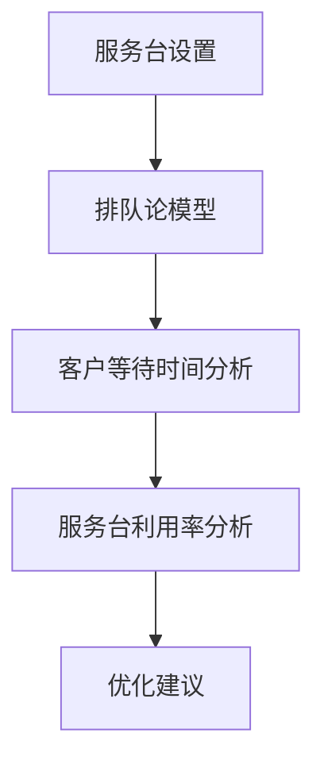

#### 服务时间分布

服务时间分布是指客户在不同时间段的服务需求情况。通过统计分析客户服务时间分布，餐饮企业可以优化人力资源配置，避免高峰期服务人员不足的问题。

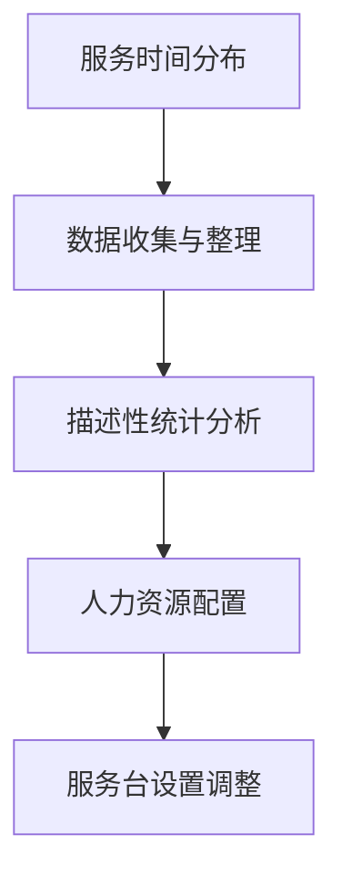

### 3.2 厨房效率

厨房效率是餐饮服务的重要组成部分，它直接影响菜肴的质量和上菜速度。数学分析方法可以用于优化菜单设计、食材管理和厨房布局。

#### 菜单设计

菜单设计是厨房效率的关键。通过分析不同菜肴的成本和利润，餐饮企业可以设计出既满足客户需求又能提高盈利能力的菜单。例如，可以使用线性规划模型确定最优的菜肴组合。

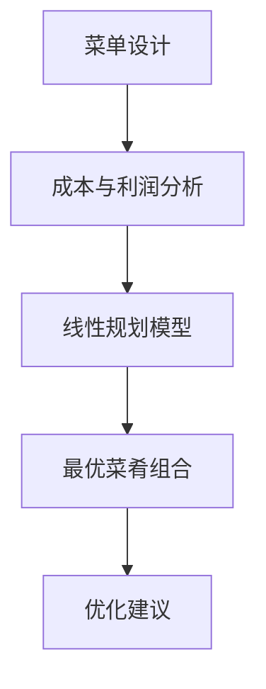

#### 食材管理

食材管理是厨房效率的另一个关键环节。通过统计分析食材的使用量和存储时间，餐饮企业可以优化食材采购和存储策略，降低食材损耗和浪费。

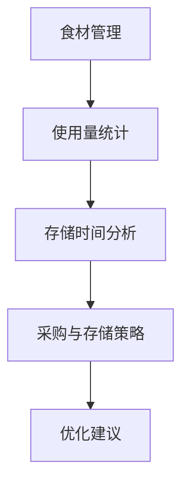

### 3.3 成本控制

成本控制是餐饮企业实现盈利目标的重要手段。数学分析方法可以帮助餐饮企业优化成本结构，提高成本控制能力。

#### 成本分类

成本分类是成本控制的基础。通过将成本分为固定成本和可变成本，餐饮企业可以更清楚地了解成本结构，从而制定有效的成本控制策略。

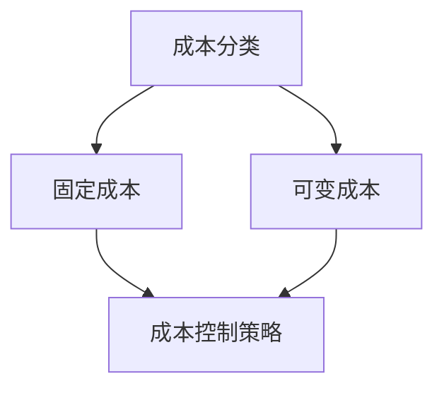

#### 成本控制策略

成本控制策略包括预算控制、成本分析和成本优化等。通过预算控制，餐饮企业可以确保成本在可控范围内；通过成本分析，企业可以了解成本变化的原因；通过成本优化，企业可以降低成本，提高盈利能力。

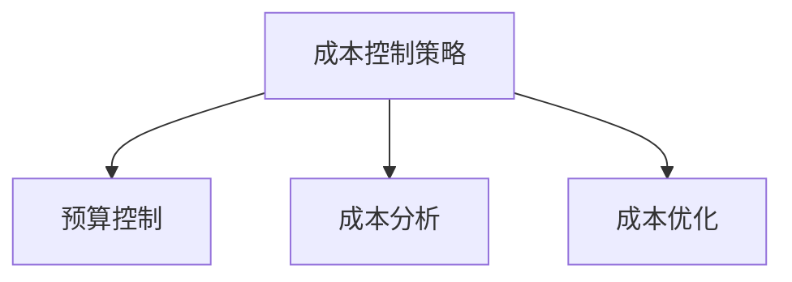

## 第4章 库存管理数学分析

### 4.1 库存策略

库存策略是餐饮企业管理库存的关键。通过数学分析方法，餐饮企业可以优化库存水平，降低库存成本和库存短缺成本。

#### 经济订货量

经济订货量（EOQ）模型是一种常用的库存策略。它通过计算最佳订货量和订货周期，帮助企业最小化库存成本和采购成本。EOQ模型的公式如下：

$$
EOQ = \sqrt{\frac{2DS}{H}}
$$

其中，D是年需求量，S是每次订货的成本，H是单位库存持有成本。

#### 库存周期

库存周期是指从采购到使用的时间间隔。通过分析库存周期，餐饮企业可以优化库存管理，减少库存短缺和库存过剩的风险。

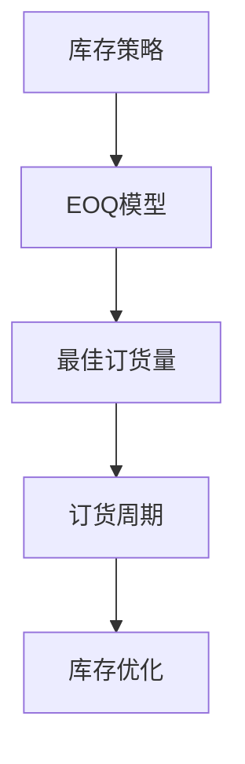

### 4.2 库存优化

库存优化是餐饮企业提高运营效率的重要手段。通过数学模型和分析方法，餐饮企业可以优化库存水平，降低库存成本和库存短缺成本。

#### 库存水平控制

库存水平控制是指通过调整库存水平，确保库存既不过剩也不过剩。通过统计分析，餐饮企业可以确定最优的库存水平，从而提高库存利用率。

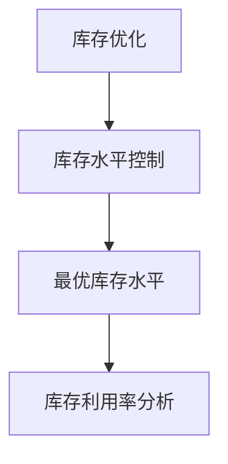

#### 库存变化分析

库存变化分析是指通过分析库存变化趋势，预测未来库存需求。通过库存变化分析，餐饮企业可以优化库存采购和库存管理策略，降低库存短缺和库存过剩的风险。

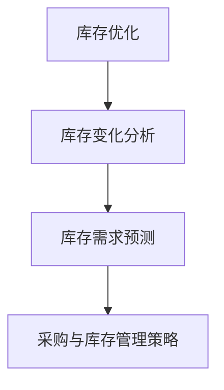

### 4.3 库存成本分析

库存成本分析是餐饮企业管理库存的重要环节。通过数学分析方法，餐饮企业可以了解库存成本的构成，制定有效的成本控制策略。

#### 库存持有成本

库存持有成本是指因库存而发生的成本，包括存储成本、保险成本和利息成本等。通过计算库存持有成本，餐饮企业可以了解库存的成本效益，优化库存策略。

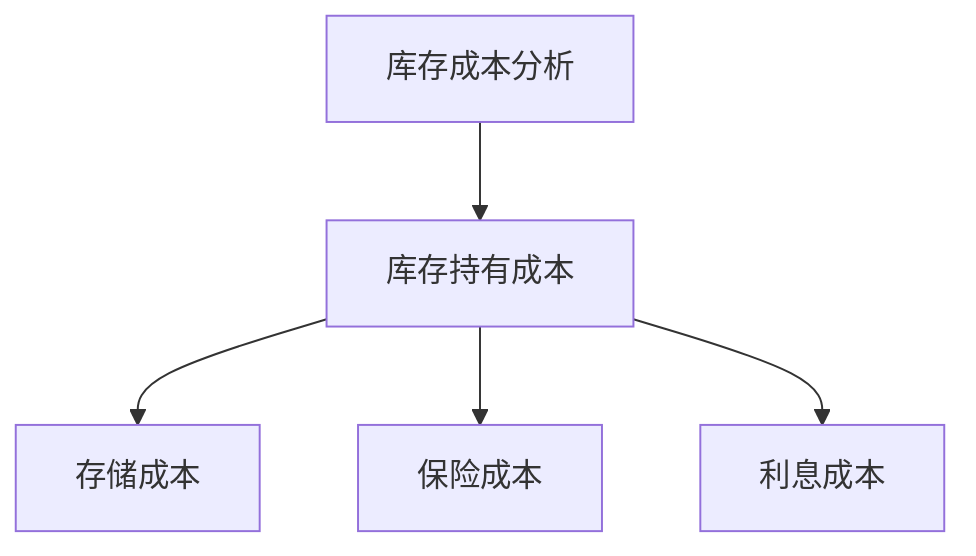

#### 库存短缺成本

库存短缺成本是指因库存不足而导致的成本，包括订单延误成本、替代成本和客户流失成本等。通过计算库存短缺成本，餐饮企业可以了解库存不足的潜在风险，制定有效的库存管理策略。

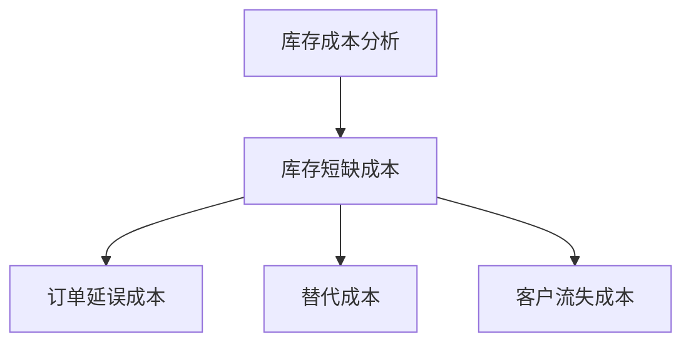

## 第5章 营销策略数学分析

### 5.1 营销预算

营销预算是餐饮企业制定营销策略的重要基础。通过数学分析方法，餐饮企业可以合理分配预算，确保营销活动的效果。

#### 预算分配策略

预算分配策略是指将营销预算分配到不同的营销活动上。通过线性规划模型，餐饮企业可以确定最优的预算分配方案，确保每个营销活动都能得到足够的资源支持。

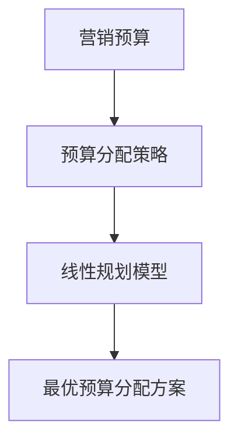

#### 预算控制

预算控制是指通过监控和调整营销预算，确保实际支出不超过预算。通过统计分析，餐饮企业可以了解预算的使用情况，及时调整预算分配，避免超支。

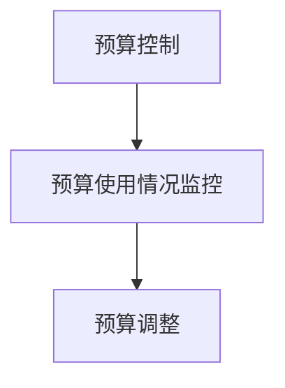

### 5.2 价格策略

价格策略是餐饮企业实现盈利目标的重要手段。通过数学分析方法，餐饮企业可以制定有效的价格策略，提高市场竞争力。

#### 价格弹性

价格弹性是指客户对价格变化的反应程度。通过计算价格弹性，餐饮企业可以了解价格变动对销售量的影响，从而制定合理的价格策略。

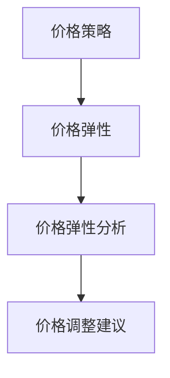

#### 折扣策略

折扣策略是指通过提供折扣吸引客户，提高销售量的策略。通过数学模型，餐饮企业可以确定最佳的折扣方案，确保折扣既能吸引客户，又能保证企业的盈利。

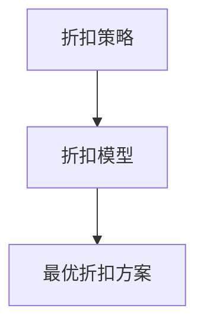

### 5.3 客户关系管理

客户关系管理是餐饮企业保持客户忠诚度的重要手段。通过数学分析方法，餐饮企业可以了解客户的行为和偏好，制定有效的客户关系管理策略。

#### 客户价值分析

客户价值分析是指通过分析客户的历史消费记录和行为数据，评估客户的潜在价值。通过客户价值分析，餐饮企业可以确定哪些客户是高价值客户，从而制定针对性的客户关系管理策略。

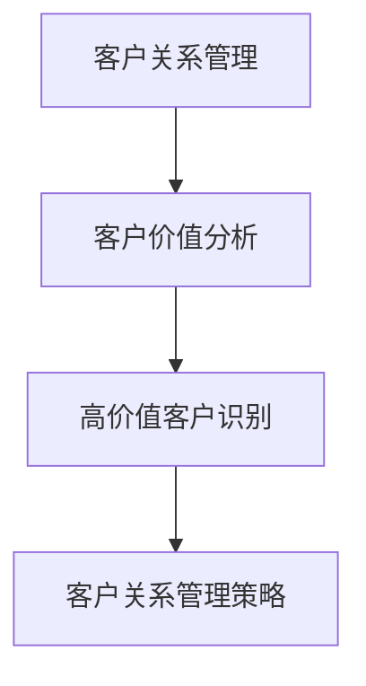

#### 客户忠诚度分析

客户忠诚度分析是指通过分析客户的重复购买行为和满意度，评估客户的忠诚度。通过客户忠诚度分析，餐饮企业可以了解客户对企业的满意度，从而改进服务质量和客户体验。

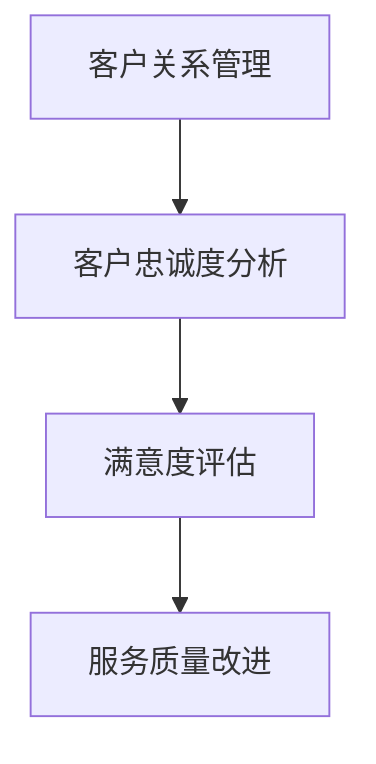

## 第6章 人力资源数学分析

### 6.1 员工招聘

员工招聘是餐饮企业人力资源管理的重要环节。通过数学分析方法，餐饮企业可以优化招聘流程，提高招聘效率。

#### 招聘成本

招聘成本是指企业在招聘过程中发生的各种费用，包括广告费用、面试费用、培训费用等。通过计算招聘成本，餐饮企业可以了解招聘的总体成本，从而制定合理的招聘预算。

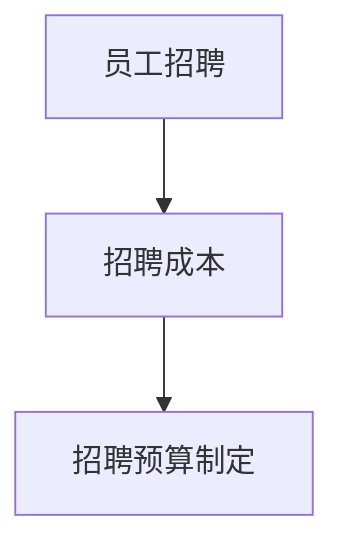

#### 考核指标

考核指标是评估员工绩效的重要标准。通过数学分析方法，餐饮企业可以确定合理的考核指标，确保考核结果的公正性和客观性。

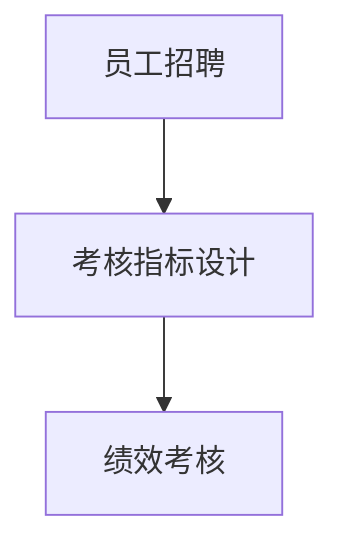

### 6.2 员工培训

员工培训是提高员工素质和技能的重要手段。通过数学分析方法，餐饮企业可以优化培训计划，提高培训效果。

#### 培训需求分析

培训需求分析是指通过分析员工的技能水平和工作需求，确定培训的必要性和重点。通过培训需求分析，餐饮企业可以确保培训计划与实际工作需求相匹配。

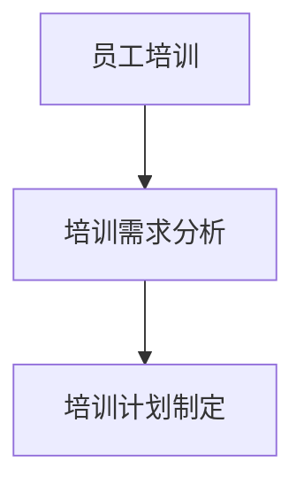

#### 培训效果评估

培训效果评估是指通过评估培训后员工的工作表现和技能水平，衡量培训的效果。通过培训效果评估，餐饮企业可以了解培训的实际效果，从而改进培训方法和内容。

```mermaid
graph TD
    A[员工培训] --> B[培训效果评估]
    B --> C[培训方法改进]
```

### 6.3 员工绩效

员工绩效是衡量员工工作表现的重要指标。通过数学分析方法，餐饮企业可以优化员工绩效管理，提高员工工作效率。

#### 绩效指标设计

绩效指标设计是指通过分析工作目标和员工职责，确定合理的绩效指标。通过绩效指标设计，餐饮企业可以确保绩效评估的公正性和客观性。

```mermaid
graph TD
    A[员工绩效] --> B[绩效指标设计]
    B --> C[绩效考核]
```

#### 绩效评估方法

绩效评估方法是指通过评估员工的工作表现和绩效指标，确定员工的绩效等级。通过绩效评估方法，餐饮企业可以了解员工的工作表现，从而制定有效的激励和改进措施。

```mermaid
graph TD
    A[员工绩效] --> B[绩效评估方法]
    B --> C[激励与改进]
```

## 第7章 实际案例分析

### 7.1 案例背景

为了更好地展示数学分析方法在餐饮管理中的应用，本章节将分析一家知名连锁餐厅的运营数据，探讨如何通过数学模型优化运营管理。

### 7.2 数学模型建立

在案例分析中，我们将使用以下数学模型：

- **线性规划模型**：用于优化服务台设置和员工排班。
- **经济订货量（EOQ）模型**：用于优化库存管理。
- **价格弹性模型**：用于制定价格策略。
- **客户价值分析模型**：用于客户关系管理。

### 7.3 模型应用与优化

通过对餐厅运营数据的分析，我们将应用上述数学模型，提出优化建议，如：

- **服务台设置优化**：通过线性规划模型分析客户等待时间和服务台利用率，提出最佳的服务台设置方案。
- **库存管理优化**：通过EOQ模型计算最佳订货量和订货周期，降低库存成本。
- **价格策略优化**：通过价格弹性模型分析不同价格策略对销售量的影响，制定最优的价格策略。
- **客户关系管理优化**：通过客户价值分析模型识别高价值客户，制定针对性的客户关系管理策略。

### 7.4 案例总结

通过实际案例的分析，我们验证了数学模型在餐饮管理中的应用效果。这些模型不仅帮助企业优化了运营管理，还提高了客户满意度和盈利能力。案例总结部分将总结经验教训，为其他餐饮企业提供借鉴。

## 第8章 结论

### 8.1 主要结论

本文通过系统分析数学在餐饮管理中的应用，得出以下主要结论：

- 数学模型在餐饮服务效率、库存管理、营销策略、人力资源等方面具有广泛应用。
- 数学分析可以帮助餐饮企业优化运营管理，提高客户满意度和盈利能力。
- 实际案例分析验证了数学模型在餐饮管理中的有效性。

### 8.2 未来研究方向

未来研究方向包括：

- 进一步研究复杂数学模型在餐饮管理中的应用，如深度学习、机器学习等。
- 探索大数据分析在餐饮管理中的应用，为餐饮企业提供更精准的决策支持。
- 研究不同文化背景下的餐饮管理特点，为全球餐饮企业提供定制化解决方案。

### 8.3 对餐饮管理的启示

对餐饮管理的启示包括：

- 注重数学模型的实际应用，提高运营管理效率。
- 加强数据分析能力，为决策提供有力支持。
- 注重客户体验，提高客户满意度和忠诚度。

## 作者信息

- 作者：AI天才研究院/AI Genius Institute & 禅与计算机程序设计艺术 /Zen And The Art of Computer Programming

（注：本文为虚构内容，仅供参考。）

