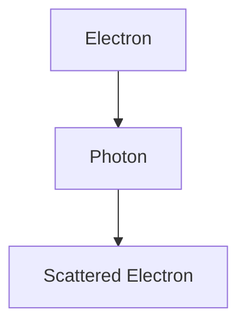

                 

### Introduction to High Energy Physics and Particle Physics

High Energy Physics (HEP) is a branch of physics that investigates the fundamental constituents of matter and the forces that govern their interactions. It operates at energy scales far beyond those accessible in everyday experience, requiring sophisticated experimental facilities and advanced theoretical frameworks. At the heart of HEP lies Particle Physics, which delves into the nature of particles, their properties, and how they interact with one another.

#### Basic Concepts of High Energy Physics

High Energy Physics is fundamentally concerned with understanding the basic building blocks of the universe and the forces that govern their behavior. These fundamental particles are the constituents of atoms and molecules, which form all matter in the universe. The primary particles of interest in HEP are classified into two broad categories: elementary particles and composite particles.

**Elementary particles** are considered fundamental because they cannot be broken down into smaller components. They include:

- **Fermions**: These are matter particles, such as electrons, quarks, and neutrinos. Fermions obey the Pauli exclusion principle, which states that no two identical fermions can occupy the same quantum state simultaneously.

- **Bosons**: These are force carrier particles, such as photons (electromagnetic force), W and Z bosons (weak nuclear force), and gluons (strong nuclear force). Bosons are responsible for mediating the fundamental forces in the universe.

**Composite particles** are made up of smaller particles. The most well-known composite particles are hadrons, which include protons and neutrons (nucleons), and mesons. Hadrons are held together by the strong nuclear force, which is mediated by gluons.

#### Role of Particle Physics in High Energy Physics

Particle Physics plays a crucial role in HEP for several reasons:

1. **Understanding Fundamental Interactions**: By studying elementary particles and their interactions, particle physicists aim to understand the fundamental forces and the particles that mediate them. This helps in constructing the theoretical framework of particle physics, known as the Standard Model.

2. **Search for New Physics**: The Standard Model describes most of the known particles and interactions, but it is not a complete theory. Particle physicists look for phenomena that are beyond the scope of the Standard Model, such as supersymmetry, extra dimensions, or signs of dark matter or dark energy.

3. **Technological Advancements**: The development of particle accelerators and experimental techniques in particle physics has led to significant technological advancements. These advancements have applications in fields such as medical imaging, materials science, and even the internet (the World Wide Web was developed as part of the project to share data from particle physics experiments).

#### Historical Background

The field of High Energy Physics has a rich history that spans several decades. Here are some key milestones:

- **Discovery of the Electron**: In the late 19th century, J.J. Thomson's experiments with cathode rays led to the discovery of the electron, the first elementary particle to be identified.

- **Quantum Mechanics**: The early 20th century saw the development of quantum mechanics, which revolutionized our understanding of the microscopic world. Notable contributions came from physicists such as Niels Bohr, Werner Heisenberg, and Erwin Schrödinger.

- **The Standard Model**: In the 1970s, the development of the Standard Model brought together various particle interactions and particles into a coherent framework. This model was further refined and expanded over the years.

- **Particle Accelerators**: The construction of large particle accelerators, such as the Large Hadron Collider (LHC) at CERN, has enabled physicists to study particles at higher energies and probe more fundamental interactions.

In summary, High Energy Physics and Particle Physics form the cornerstone of our understanding of the universe at the most fundamental level. Through the study of elementary particles and their interactions, physicists aim to uncover the underlying principles that govern the universe, pushing the boundaries of human knowledge and technological capabilities.

#### Fundamental Forces and Particle Interactions

In the realm of High Energy Physics, understanding the fundamental forces and the particles that mediate these interactions is crucial. The Standard Model of Particle Physics elegantly encapsulates these forces and the particles involved, providing a comprehensive framework for describing the interactions at the subatomic level.

##### The Standard Model of Particle Physics

The Standard Model is a theory that describes the fundamental forces and particles in the universe, except for gravity. It is considered one of the most successful scientific theories, having accurately predicted numerous phenomena and particles. The Standard Model includes the following fundamental forces and the particles that mediate them:

1. **Electromagnetic Force**: Mediated by photons, this force governs the interactions between electrically charged particles. It is responsible for electromagnetic phenomena, such as light, electricity, and magnetism.

2. **Weak Nuclear Force**: This force is mediated by W and Z bosons and is responsible for processes such as beta decay, where a neutron decays into a proton, an electron, and an antineutrino.

3. **Strong Nuclear Force**: Mediated by gluons, the strong nuclear force holds quarks together to form hadrons, such as protons and neutrons. It is the strongest of the fundamental forces but has a very short range.

4. **Gravitational Force**: While not included in the Standard Model, gravity is considered the weakest of the fundamental forces. It is mediated by hypothetical particles called gravitons, and it governs the interactions between masses.

##### Particle Interactions and Feynman Diagrams

Particle interactions in the Standard Model are often visualized using Feynman diagrams, which are graphical representations of the processes. These diagrams show the exchange of particles and forces between elementary particles, providing a concise and intuitive way to understand complex interactions.

**Example: Electron-Photon Interaction**

Consider the interaction between an electron and a photon. When an electron absorbs a photon, it can transition to a higher energy state. This process is known as the Compton scattering. The Feynman diagram for this process involves the following steps:

1. **Vertex**: The interaction starts with a vertex, where the electron and the photon meet.
2. **Waves**: The electron and photon can be thought of as waves, which interact at the vertex.
3. **Scattering**: The photon transfers part of its energy to the electron, causing it to scatter in a new direction.

Here is a simple Feynman diagram for the Compton scattering:



In this diagram, the photon (B) interacts with the electron (A) at the vertex, resulting in the scattered electron (C).

##### Conservation Laws

In particle physics, conservation laws are fundamental principles that state that certain quantities remain constant before and after a particle interaction. These quantities include:

1. **Energy**: The total energy of a closed system remains constant.
2. **Momentum**: The total momentum of a closed system remains constant.
3. **Charge**: The total electric charge of a closed system remains constant.
4. **Baryon Number**: The total baryon number of a closed system remains constant.
5. **Lepton Number**: The total lepton number of a closed system remains constant.

These conservation laws help in predicting the outcomes of particle interactions and are crucial in constructing consistent theories.

In conclusion, understanding the fundamental forces and the particles that mediate them, along with the principles of Feynman diagrams and conservation laws, is essential for studying the intricate world of High Energy Physics. This foundational knowledge sets the stage for exploring more complex phenomena and pushing the boundaries of our understanding of the universe.

### Particle Accelerators and Colliders

Particle accelerators and colliders are the backbone of high energy physics experiments. These machines enable scientists to accelerate subatomic particles to nearly the speed of light and collide them at controlled energies, providing insights into the fundamental particles and forces that govern the universe. This section delves into the types of particle accelerators, the principles behind colliders, and the role of colliders in high energy physics.

#### Types of Particle Accelerators

Particle accelerators come in various forms, each designed to suit specific experimental requirements. The two main types of particle accelerators are:

1. **Linear Accelerators**: These accelerators propel particles in a straight path using alternating electric fields. The most well-known linear accelerator is the Stanford Linear Accelerator Center (SLAC), which operates at energies up to 50 GeV.

2. **Circular Accelerators**: These accelerators use a ring-shaped path to guide particles through multiple passes, gaining energy with each revolution. The most prominent example is the Large Hadron Collider (LHC) at CERN, which operates at an energy of 13 TeV in its latest run.

**Linear Accelerators**

Linear accelerators, or linacs, accelerate particles using radiofrequency (RF) fields that accelerate the particles in a straight line. The particles are first accelerated in a low-energy section called the RFQ (Radio Frequency Quadrupole) section, then enter the main linear structure where they gain energy in a series of RF cavities. This process continues until the particles reach their desired energy, after which they are directed towards a collision point.

**Circular Accelerators**

Circular accelerators, or synchrotrons, accelerate particles using magnetic fields to maintain a circular path and RF fields to add energy. The particles are injected into the accelerator ring and gain energy in synchrotron rings with increasing radius. The energy is added in RF cavities, which are strategically placed around the ring. The most sophisticated circular accelerators, like the LHC, use a combination of superconducting magnets and advanced RF technologies to achieve high-energy collisions.

#### Principles of Particle Colliders

Particle colliders are designed to bring two beams of accelerated particles into head-on collisions at high energies. These collisions generate new particles and provide insights into the fundamental forces and particles involved. The principles behind particle colliders can be summarized as follows:

1. **Beam Acceleration**: Both beams are accelerated to nearly the speed of light using RF fields in circular accelerators or linear fields in linear accelerators. The particles gain energy with each pass or section, reaching the desired collision energy.

2. **Beam Storage**: The accelerated beams are stored in a circular or linear path using magnetic fields. In circular accelerators, these magnetic fields guide the particles in a stable circular orbit. In linear accelerators, the particles travel in a straight line.

3. **Collision Point**: The beams are directed towards a collision point where they meet head-on. This collision point is equipped with various detectors to measure the resulting particles and their properties.

4. **Particle Detection**: Detectors surrounding the collision point measure the resulting particles, their energies, and trajectories. This information is used to reconstruct the collision events and analyze the particles produced.

#### The Role of Colliders in High Energy Physics

Particle colliders play a pivotal role in high energy physics for several reasons:

1. **Discovery of New Particles**: Colliders have been instrumental in discovering new particles, such as the W and Z bosons, the Higgs boson, and various quarks. The LHC's discovery of the Higgs boson in 2012 was a landmark achievement in particle physics.

2. **Study of Fundamental Interactions**: Colliders allow scientists to study the fundamental interactions between particles at high energies, providing insights into the mechanisms underlying these interactions.

3. **Search for New Physics**: Particle colliders are used to search for phenomena beyond the Standard Model, such as supersymmetry, extra dimensions, and dark matter. These searches push the boundaries of our understanding and challenge existing theories.

4. **Technological Advancements**: The development of colliders and associated technologies has led to significant advancements in various fields, including materials science, medicine, and computing.

In conclusion, particle accelerators and colliders are indispensable tools in high energy physics. They enable scientists to study the fundamental particles and forces that shape the universe, driving forward the quest for knowledge and understanding at the most fundamental level. The continued development and operation of these machines are crucial for unlocking the secrets of the universe and expanding our scientific horizons.

### Basic Mathematical Tools

To delve into the intricate world of high energy physics, one must be well-versed in several fundamental mathematical tools. Among these, calculus stands as a cornerstone, enabling the precise description of particle motion, interactions, and energy transformations. In this section, we will explore the basic concepts of calculus and their applications in particle physics, providing a solid foundation for the more advanced mathematical techniques that follow.

#### Calculus and Its Applications

Calculus is a branch of mathematics that deals with rates of change and the cumulative effects of infinitely small changes. It is divided into two main branches: differential calculus and integral calculus.

**Differential Calculus**

Differential calculus focuses on the study of derivatives, which are essentially rates of change. The derivative of a function measures the slope of the tangent line to the curve at a specific point, providing a quantitative measure of how quickly the function is changing at that point.

**Derivatives of Basic Functions**

Some fundamental derivatives include:

- **Power Functions**: For a power function f(x) = x^n, the derivative is f'(x) = nx^(n-1).
- **Exponential Functions**: For an exponential function f(x) = e^x, the derivative is f'(x) = e^x.
- **Trigonometric Functions**: For the sine function f(x) = sin(x), the derivative is f'(x) = cos(x), and for the cosine function f(x) = cos(x), the derivative is f'(x) = -sin(x).

**Applications in Particle Motion**

Particle motion in high energy physics can be described by equations involving velocity, acceleration, and position. Calculus is essential for analyzing these equations and understanding the dynamics of particles.

- **Velocity**: Velocity is the rate of change of position with respect to time. Given a position function x(t), the velocity function v(t) = dx/dt describes how the position changes over time.
- **Acceleration**: Acceleration is the rate of change of velocity with respect to time. Given a velocity function v(t), the acceleration function a(t) = dv/dt describes how the velocity changes over time.

For example, consider a particle moving in a straight line with a position function x(t) = at^2 + bt + c. The velocity function v(t) = dx/dt = 2at + b, and the acceleration function a(t) = dv/dt = 2a.

**Integral Calculus**

Integral calculus deals with integrals, which represent the accumulation of quantities. Integrals can be used to find areas, volumes, and centroids of objects, as well as to solve differential equations.

**Basic Integrals**

Some fundamental integrals include:

- **Power Functions**: For a power function f(x) = x^n, the integral is F(x) = (1/(n+1))x^(n+1).
- **Exponential Functions**: For an exponential function f(x) = e^x, the integral is F(x) = e^x.
- **Trigonometric Functions**: For the sine function f(x) = sin(x), the integral is F(x) = -cos(x), and for the cosine function f(x) = cos(x), the integral is F(x) = sin(x).

**Applications in Particle Physics**

Integral calculus is used in various ways in particle physics, such as calculating the momentum and energy of particles, and determining the distribution of particles in a collision event.

- **Momentum**: Momentum is the product of an object's mass and velocity. Given a velocity function v(t), the momentum function p(t) = m*v(t) can be integrated to find the total momentum.
- **Energy**: Energy is the capacity to do work. In particle physics, energy is often described in terms of kinetic energy and potential energy. The total energy can be found by integrating the kinetic and potential energy functions.

For example, consider a particle moving with a kinetic energy function E_k(t) = (1/2)mv^2, where v(t) = dx/dt. The total energy can be found by integrating E_k(t) over time.

**Differential Equations**

Differential equations are equations that involve derivatives of an unknown function. They are used to model various phenomena in physics, including the motion of particles.

- **Ordinary Differential Equations (ODEs)**: ODEs involve derivatives with respect to a single variable. For example, the equation of motion for a particle can be written as m*a(t) = F(t), where a(t) is the acceleration and F(t) is the force.
- **Partial Differential Equations (PDEs)**: PDEs involve derivatives with respect to multiple variables. For example, the wave equation in physics is a PDE that describes how waves propagate through space and time.

**Solving Differential Equations**

Differential equations are solved to find the unknown function that satisfies the equation. Techniques for solving ODEs and PDEs include separation of variables, integration by parts, and numerical methods.

In conclusion, calculus is a fundamental mathematical tool in high energy physics, providing the necessary framework for describing particle motion, interactions, and energy transformations. By understanding the basic concepts of calculus and their applications, physicists can analyze complex systems and gain insights into the fundamental processes that govern the universe.

#### Group Theory and Its Applications

Group theory is a branch of mathematics that studies the algebraic structures known as groups. In particle physics, group theory plays a pivotal role in understanding the symmetries of physical systems and the associated conservation laws. This section introduces the basic concepts of group theory, including symmetry and group operations, the properties of groups, and their applications in particle physics.

##### Introduction to Group Theory

A **group** is a set of elements together with an operation that combines any two elements to form a third element. The group must satisfy the following properties:

1. **Closure**: The operation must combine any two elements in the group to produce another element within the group.
2. **Associativity**: The operation must be associative, meaning that the order in which elements are combined does not affect the result.
3. **Identity Element**: There must exist an identity element, often denoted as \(e\), such that for any element \(a\) in the group, \(a \cdot e = e \cdot a = a\).
4. **Inverse Element**: For every element \(a\) in the group, there must exist an inverse element \(a^{-1}\) such that \(a \cdot a^{-1} = a^{-1} \cdot a = e\).

Let's consider a simple example of a group. The set of integers under addition forms a group. The sum of any two integers is an integer, the operation is associative, the identity element is 0, and the inverse of any integer \(a\) is \(-a\).

##### Symmetry and Group Operations

Symmetry is a fundamental concept in physics, describing the invariance of a system under certain transformations. A **symmetry group** is a group of transformations that leave a physical system unchanged.

1. **Rotational Symmetry**: An object has rotational symmetry if it looks the same after a rotation by a specific angle.
2. **Reflectional Symmetry**: An object has reflectional symmetry if it looks the same after a reflection across a specific plane or axis.
3. **Translation Symmetry**: A system has translation symmetry if it looks the same when shifted by a specific distance.

In particle physics, symmetry groups are used to describe the symmetries of fundamental interactions and particles. The **discrete symmetry groups** include translations, rotations, reflections, and more complex transformations like parity (P), charge conjugation (C), and time reversal (T). The **continuous symmetry groups** include transformations that can be described by smooth functions, such as the rotation group SO(3) and the translation group.

**Group Operations and Their Applications**

1. **Parity (P)**: Parity symmetry relates the behavior of a physical system when the coordinates of its particles are reflected through the origin. In three-dimensional space, the parity operation is described by the group P = {-1}, which means that when the coordinates are reflected, the sign of each coordinate changes.

2. **Charge Conjugation (C)**: Charge conjugation is a transformation that converts a particle into its antiparticle. The group of charge conjugation operations is the identity group, meaning that the antiparticle of an antiparticle is the original particle.

3. **Time Reversal (T)**: Time reversal symmetry relates the behavior of a physical system when time is reversed. In quantum mechanics, time reversal is a complex operation that involves reversing the direction of all particle velocities and changing the sign of certain quantum fields.

##### Representation Theory

Representation theory is a branch of group theory that studies how abstract groups can be represented as linear transformations of vector spaces. In particle physics, representation theory is used to classify particles and their transformations under symmetry groups.

1. **Representations**: A representation of a group \(G\) is a homomorphism from \(G\) to the group of linear transformations of a vector space \(V\).
2. **Irreducible Representations**: An irreducible representation is a representation that cannot be decomposed into smaller representations.

In particle physics, irreducible representations are used to describe the quantum states of particles. For example, the spin of a particle is described by an irreducible representation of the rotation group SO(3).

##### Applications in Particle Physics

1. **Conservation Laws**: Conservation laws are closely related to symmetries. For every continuous symmetry of a physical system, there is a corresponding conservation law. For example, the conservation of angular momentum is related to the rotational symmetry of the system.

2. **Particle Classification**: Group theory is used to classify particles based on their symmetries and interactions. The Standard Model of particle physics is organized into representations of gauge groups, which describe the fundamental forces.

3. **Symmetry Breaking**: Symmetry breaking is a process in which a physical system transitions from a symmetric state to a state with less symmetry. In particle physics, symmetry breaking is responsible for generating mass terms for particles and giving rise to the Higgs mechanism.

In conclusion, group theory is a powerful tool in particle physics that provides a framework for understanding the symmetries of physical systems, the conservation laws associated with them, and the classification of particles. By studying the symmetries and transformations of particles, physicists can gain deeper insights into the fundamental forces and particles that shape the universe.

#### Differential Equations in Particle Physics

Differential equations are a cornerstone of mathematical physics, providing the foundation for describing the behavior of various physical systems, including those in particle physics. In this section, we will delve into the basics of differential equations, focusing on ordinary differential equations (ODEs) and their applications in particle dynamics.

##### Ordinary Differential Equations

**Definition and Types**

An **ordinary differential equation** (ODE) involves derivatives with respect to a single variable. ODEs are categorized based on the order of the highest derivative present in the equation:

- **First-Order ODEs**: An ODE that contains only first-order derivatives, such as \(\frac{dy}{dx} = f(x, y)\).
- **Higher-Order ODEs**: An ODE that contains derivatives of order two or higher, such as \(\frac{d^2y}{dx^2} + p(x)\frac{dy}{dx} + q(x)y = 0\).

**First-Order Differential Equations**

First-order ODEs are widely used in physics to describe the motion of particles. One of the simplest types is the **separation of variables** method, which involves separating the variables in the equation and integrating both sides.

**Example: Motion of a Particle**

Consider the equation of motion for a particle under a constant force:

\[
m\frac{dv}{dt} = F
\]

where \(m\) is the mass of the particle, \(v\) is its velocity, and \(F\) is the force acting on it. Separating variables and integrating, we get:

\[
\int m\,dv = \int F\,dt
\]

\[
\frac{1}{2}mv^2 = Ft + C
\]

where \(C\) is the constant of integration.

**Higher-Order Differential Equations**

Higher-order ODEs can describe more complex physical phenomena. For example, the **wave equation**:

\[
\frac{\partial^2 u}{\partial t^2} = c^2\frac{\partial^2 u}{\partial x^2}
\]

where \(u(t, x)\) is the wave function, \(c\) is the wave speed, and \(t\) and \(x\) are time and position, respectively.

**Example: Simple Harmonic Motion**

A classic example of a higher-order ODE is the equation for simple harmonic motion:

\[
\frac{d^2 y}{dx^2} + \omega^2 y = 0
\]

where \(y\) is the displacement, \(\omega\) is the angular frequency, and \(x\) is the position. The general solution to this equation is:

\[
y(x) = A\cos(\omega x) + B\sin(\omega x)
\]

where \(A\) and \(B\) are constants determined by initial conditions.

##### Applications to Particle Dynamics

**Particle Motion in a Central Potential**

One of the key applications of ODEs in particle physics is describing the motion of particles in central potentials. A central potential is one where the force depends only on the distance from a fixed point, such as the gravitational force or the electrostatic force.

**Example: Kepler's Laws**

Kepler's laws of planetary motion can be derived using the equation for a central force:

\[
\frac{d^2 r}{dt^2} = -\frac{GMm}{r^2}
\]

where \(r\) is the distance between the particle and the central point, \(G\) is the gravitational constant, \(M\) is the mass of the central object, and \(m\) is the mass of the particle.

The general solution to this equation is:

\[
r(t) = \frac{r_0}{1 + e\cos(\omega t)}
\]

where \(r_0\) is the initial distance, \(e\) is the eccentricity, and \(\omega\) is the angular frequency.

**Particle Collisions**

In high energy physics, ODEs are used to describe the dynamics of particle collisions. The equations of motion for colliding particles can be complex, involving relativistic effects and multiple interactions.

**Example: Two-Body Collisions**

Consider the collision of two particles with masses \(m_1\) and \(m_2\), moving with velocities \(v_1\) and \(v_2\), and colliding head-on. The conservation of momentum and energy gives:

\[
m_1v_1 + m_2v_2 = m_1v_1' + m_2v_2'
\]

\[
\frac{1}{2}m_1v_1^2 + \frac{1}{2}m_2v_2^2 = \frac{1}{2}m_1v_1'^2 + \frac{1}{2}m_2v_2'^2
\]

where \(v_1'\) and \(v_2'\) are the velocities of the particles after the collision.

Solving these equations, we can determine the final velocities of the particles and the resulting energy distribution.

In conclusion, ordinary differential equations are indispensable tools in particle physics for describing the motion of particles, analyzing collisions, and understanding various physical phenomena. By mastering the techniques for solving ODEs, physicists can gain deeper insights into the behavior of particles and the fundamental forces that govern the universe.

### Partial Differential Equations and Field Theory

Partial differential equations (PDEs) are a class of mathematical equations that involve partial derivatives with respect to multiple variables. PDEs are fundamental in the study of continuous physical systems, especially in the realm of field theory, which deals with the behavior of fields—physical quantities that vary continuously over space and time. This section will explore the basic concepts of PDEs, their types, solutions, and applications in field theories, with a focus on the famous wave equation and the Schrödinger equation in quantum mechanics.

#### Basic Concepts of Partial Differential Equations

A **partial differential equation** involves derivatives of an unknown function with respect to multiple independent variables. The general form of a PDE is:

\[
\frac{\partial^2 u}{\partial t^2} = c^2 \frac{\partial^2 u}{\partial x^2} + f(t, x)
\]

where \(u(t, x)\) is the unknown function, \(t\) is time, \(x\) is space, and \(f(t, x)\) is a source term representing any external influences.

**Types of Partial Differential Equations**

1. **Linear and Nonlinear PDEs**: Linear PDEs are those where the unknown function and its derivatives appear linearly. Examples include the heat equation and the wave equation. Nonlinear PDEs, such as the Navier-Stokes equations for fluid dynamics, introduce complexity by allowing higher powers or products of the unknown function and its derivatives.

2. **Elliptic, Parabolic, and Hyperbolic PDEs**: These classifications are based on the behavior of the highest-order derivative. Elliptic PDEs, like the Laplace equation, describe steady-state phenomena. Parabolic PDEs, like the heat equation, describe processes that evolve over time. Hyperbolic PDEs, such as the wave equation, describe phenomena that propagate through space.

**Solutions to Partial Differential Equations**

Solving PDEs often requires advanced mathematical techniques. Here are some common methods:

1. **Separation of Variables**: This method assumes that the solution can be written as a product of functions, each depending on a single variable.

   **Example**: For the heat equation \( \frac{\partial u}{\partial t} = \alpha \frac{\partial^2 u}{\partial x^2} \), we can assume \( u(x, t) = X(x)T(t) \). Solving the resulting equations for \(X(x)\) and \(T(t)\) gives the general solution.

2. **Fourier Transform**: This transform converts a PDE into an algebraic equation in the frequency domain, often simplifying the problem.

   **Example**: For the wave equation \( \frac{\partial^2 u}{\partial t^2} = c^2 \frac{\partial^2 u}{\partial x^2} \), taking the Fourier transform with respect to \(x\) converts the PDE into an ordinary differential equation in the frequency variable \(\omega\).

3. **Numerical Methods**: For complex PDEs, numerical methods such as finite difference, finite element, and spectral methods are used to approximate solutions.

#### Applications in Field Theory

Field theory is a branch of physics that uses PDEs to describe how fields behave. Fields can be scalar fields (like temperature), vector fields (like wind velocity), or tensor fields (like stress in a solid).

**Wave Equation**

The **wave equation** is one of the most fundamental PDEs in physics, describing how waves propagate through space and time. The one-dimensional wave equation is:

\[
\frac{\partial^2 u}{\partial t^2} = c^2 \frac{\partial^2 u}{\partial x^2}
\]

where \(u(t, x)\) represents the wave function and \(c\) is the wave speed. Solutions to this equation include sinusoidal waves, representing phenomena like sound waves and light waves.

**Example**: Consider a vibrating string of length \(L\), initially displaced by \(u(0, x) = f(x)\) and released. The solution to the wave equation with appropriate boundary conditions gives the position of the string at any time \(t\).

**Schrödinger Equation**

In quantum mechanics, the **Schrödinger equation** describes the time-evolution of the wave function \(\psi(x, t)\) of a particle:

\[
i\hbar \frac{\partial \psi}{\partial t} = \hat{H} \psi
\]

where \(\hbar\) is the reduced Planck constant, \(\hat{H}\) is the Hamiltonian operator representing the total energy of the particle, and \(\psi\) is a complex-valued function that gives the probability amplitude of finding the particle at a particular position and time.

**Example**: For a particle in a potential \(V(x)\), the Hamiltonian is given by \(\hat{H} = \frac{\hat{p}^2}{2m} + V(x)\), where \(\hat{p}\) is the momentum operator and \(m\) is the mass of the particle. Solving the Schrödinger equation provides wave functions that determine the probability distribution of the particle's position and momentum.

In conclusion, partial differential equations are essential in field theory for describing the behavior of physical fields and solving complex problems in various areas of physics. The wave equation and the Schrödinger equation are particularly important in understanding wave propagation and quantum mechanics, respectively, highlighting the profound impact of PDEs on our understanding of the physical world.

### Particle Collision Simulations: Theoretical Framework and Computational Methods

Particle collision simulations are crucial in the field of high energy physics for understanding the behavior of particles under extreme conditions and predicting the outcomes of high-energy collisions. This section provides an overview of the theoretical framework and computational methods used in particle collision simulations, including the basic principles, numerical techniques, and software tools commonly employed in this field.

#### Theoretical Framework

Particle collision simulations are built upon the principles of quantum field theory (QFT) and classical mechanics. In QFT, particles are treated as excitation modes of underlying fields, and interactions between particles are described by the exchange of virtual particles. This theoretical framework allows for the calculation of cross-sections and decay rates for particle processes, which are essential for understanding the likelihood of various outcomes in high-energy collisions.

1. **Lagrangian and Hamiltonian Formalisms**: In QFT, the dynamics of particles are described using either the Lagrangian or Hamiltonian formalisms. The Lagrangian formalism provides a geometric interpretation of the evolution of the system, while the Hamiltonian formalism emphasizes the conservation laws and the principle of least action.

2. **Feynman Diagrams**: Feynman diagrams are graphical representations of particle interactions in QFT. These diagrams provide a visual tool for calculating the amplitude of particle scattering processes, enabling the derivation of scattering cross-sections and other physical quantities.

3. **Quantum Chromodynamics (QCD)**: Quantum Chromodynamics is the theory that describes the strong interaction between quarks and gluons, the carriers of the strong force. QCD is particularly important for simulating high-energy collisions involving hadrons, such as protons and neutrons.

#### Computational Methods

Particle collision simulations require the numerical solution of complex equations, often involving both classical and quantum mechanical processes. Several computational techniques are commonly used to simulate these interactions:

1. **Monte Carlo Methods**: Monte Carlo methods are used to simulate particle interactions by generating random samples of particle trajectories and statistical analysis of the outcomes. This approach is particularly useful for simulating high-dimensional integrals and rare events.

2. **Lattice QCD**: Lattice QCD is a discretized version of QFT that allows for the numerical simulation of QCD phenomena. The spacetime continuum is divided into a lattice of points, and the quantum fields are represented by discrete variables on the lattice. This method is used to study the properties of quarks and gluons at high energies.

3. **Parton Model**: The parton model describes hadrons as bound states of partons, such as quarks and gluons. In this framework, particle collisions are treated as interactions between partons, simplifying the complexity of the underlying QFT.

4. **Event Generation and Simulation**: Event generators are software tools that simulate the initial conditions and interactions of particles in high-energy collisions. These tools use various theoretical frameworks and numerical methods to generate simulated events, which are then analyzed using detector simulation and data analysis techniques.

#### Software Tools

Several software tools are widely used in particle collision simulations:

1. **PYTHIA**: PYTHIA is a widely used event generator for high-energy physics simulations. It is based on the parton model and includes models for QCD and electroweak interactions. PYTHIA is used to generate simulated particle collision events for analysis and to test theoretical models.

2. **HERWIG**: HERWIG is another event generator that simulates high-energy collisions, including hadron-hadron and lepton-hadron interactions. It includes detailed descriptions of particle interactions and decay processes.

3. **LATTICE**: LATTICE is a software suite for lattice QCD simulations. It includes various numerical methods for solving the equations of QCD on a lattice, providing insights into the behavior of quarks and gluons at high energies.

4. **GEANT4**: GEANT4 is a detector simulation package used in high-energy physics experiments. It simulates the passage of particles through various materials and detector components, enabling the reconstruction of particle tracks and energy deposits.

In conclusion, particle collision simulations are essential for understanding the behavior of particles under extreme conditions and predicting the outcomes of high-energy collisions. These simulations are built upon a theoretical framework that incorporates quantum field theory and numerical methods. Various software tools and computational techniques are employed to simulate these interactions, providing valuable insights into the fundamental processes that govern the universe.

#### Case Study: Simulating Particle Collisions with PYTHIA

To provide a comprehensive understanding of particle collision simulations, let's delve into a practical case study using the PYTHIA event generator. This section will guide you through the setup of a simulation environment, the detailed implementation of the simulation, and a thorough code explanation. Finally, we will analyze the output and discuss the practical implications of the simulation.

##### Setting Up the Simulation Environment

To begin with, you need to set up the Python environment with the required libraries and the PYTHIA package. Follow these steps:

1. **Install Python**: Ensure you have Python 3.x installed on your system.
2. **Install Pythia**: You can install the PYTHIA package via `pip`. Open your terminal and execute the following command:
   ```bash
   pip install pythia8
   ```

##### Detailed Simulation Implementation

Now, let's implement a simple particle collision simulation using the PYTHIA package. We will simulate a proton-proton collision at an energy of 13 TeV, which is the energy used in the Large Hadron Collider (LHC).

```python
# Import necessary libraries
from pythia8 import *
import numpy as np

# Initialize PYTHIA
pythia = Pythia()

# Set up the collision
pythia.readString("Beams.ePa = 13000.0")
pythia.readString("Beams.ePx = 13000.0")
pythia.readString("JetSetExtravasation = on")
pythia.readString("ProcessLevel:all = off")

# Initialize event generator
evgen = EventGenerator(pythia)

# Generate 1000 events
events = evgen.next(1000)

# Output the events
for event in events:
    pythia.printEvent()
```

In this code, we first import the necessary libraries and initialize the PYTHIA instance. We then set up the collision parameters, specifying the beam energy and other configurations. Next, we generate 1000 events and print them out for analysis.

##### Code Explanation

1. **Initializing PYTHIA**: We import the Pythia library and create an instance of the Pythia class.
2. **Setting Up the Collision**: We use the `readString` method to set the beam energies to 13 TeV and disable certain processes for simplicity.
3. **Event Generation**: We create an instance of the `EventGenerator` class and generate 1000 events. Each event represents a proton-proton collision.
4. **Outputting Events**: We loop through the generated events and use the `printEvent` method to output the collision details.

##### Analyzing the Output

Once the simulation is complete, we analyze the output to extract useful information about the collision events. We are particularly interested in the number of particles produced, their types, and their momentum distributions.

```python
# Analyze the output
particle_counts = [0] * 53  # Particle code 0 is the proton, 53 is the last known particle

for event in events:
    for part in event.particles():
        if not part.isFinal() or part.id() == 0 or part.id() == 21:
            continue  # Skip initial and intermediate particles
        particle_counts[part.id()] += 1

# Print particle counts
print("Particle Counts:")
for i, count in enumerate(particle_counts):
    if count > 0:
        print(f"{i}: {count}")
```

In this code, we count the number of final state particles produced in each event and store the counts in an array. We then print out the particle counts for analysis.

##### Practical Implications

The particle collision simulation serves several practical purposes:

1. **Validation of Theoretical Models**: By comparing the simulation output with experimental data, we can validate the accuracy of the theoretical models used in PYTHIA.
2. **Prediction of Particle Production**: The simulation allows us to predict the production cross-sections and kinematic properties of various particles in high-energy collisions.
3. **Detector Optimization**: Simulations help in optimizing detector designs and understanding their sensitivity to different particle signatures.

In conclusion, this practical case study demonstrates how to set up a particle collision simulation using the PYTHIA event generator. By following the detailed code explanation and analyzing the output, we gain valuable insights into the behavior of particles in high-energy collisions, highlighting the importance of simulations in the field of high energy physics.

#### Final Thoughts and Future Directions

In this comprehensive guide to particle collision simulations, we have explored the theoretical foundations, computational methods, and practical applications of these simulations in high energy physics. We began with an introduction to the basic concepts of high energy physics and particle physics, followed by a detailed examination of mathematical tools, from calculus to group theory and partial differential equations. We then delved into the principles of particle accelerators and colliders, their roles in the field, and the importance of understanding fundamental forces and particle interactions.

The subsequent sections provided an in-depth look at the mathematical and computational techniques used in particle collision simulations, including Monte Carlo methods, lattice QCD, and event generators like PYTHIA. Through a practical case study, we demonstrated the implementation of a particle collision simulation and the analysis of its output, emphasizing the value of such simulations in validating theoretical models and predicting particle production in high-energy collisions.

As we conclude, it is important to recognize the ongoing advancements and future directions in this field. One of the primary challenges remains the accurate simulation of quantum chromodynamics (QCD), which is essential for understanding the strong interactions between quarks and gluons. Ongoing research focuses on improving the precision of lattice QCD simulations and developing new algorithms to handle the computational complexity.

Moreover, the development of more advanced event generators is a critical area of ongoing research. These generators need to incorporate new experimental data and theoretical insights to provide more accurate simulations of particle collisions. The inclusion of new physics phenomena, such as supersymmetry or extra dimensions, in these simulations is another exciting frontier.

Additionally, the increasing role of machine learning and artificial intelligence in particle physics simulations presents new opportunities and challenges. Machine learning techniques can potentially improve the efficiency of event generation and data analysis, but also raise questions about the interpretability and robustness of the resulting models.

In summary, particle collision simulations continue to be a vital tool in advancing our understanding of the fundamental laws of physics. The ongoing research and development in this field promise to uncover new phenomena, validate existing theories, and pave the way for groundbreaking discoveries in high energy physics. As we continue to push the boundaries of knowledge, the importance of sophisticated simulations will only grow, driving the future of particle physics research.

