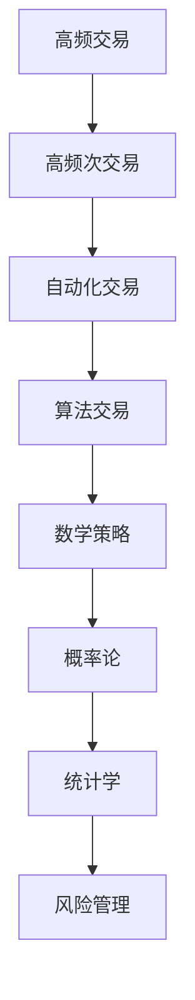
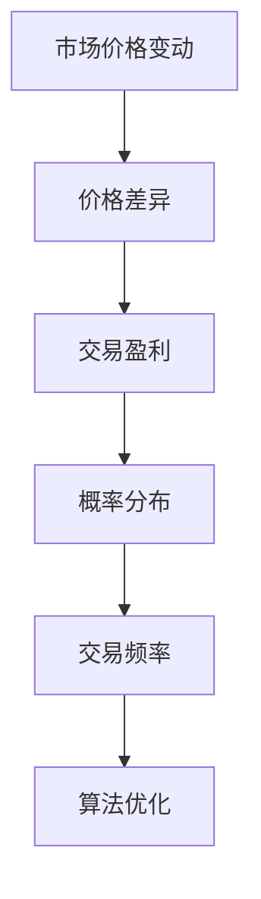

                 

### 《数学与高频交易：算法交易的数学策略》

---

**关键词：** 高频交易、数学策略、算法交易、概率论、统计学、风险管理

**摘要：** 本文将深入探讨数学在高频交易中的应用，从基础概念到高级策略，详细解析高频交易中的数学原理和算法实现。通过理论讲解和实际案例，本文旨在为读者提供一整套高频交易策略设计、实现和优化的知识体系。

---

**第一部分：高频交易概述**

### 第1章：高频交易基础

#### 1.1 高频交易的概念

**背景介绍：**
高频交易（High-Frequency Trading, HFT）是现代金融市场中的一个重要现象，其核心在于通过复杂的算法和高速的执行速度，在极短的时间内完成大量的交易，从而获取微小的利润。

**核心概念与联系：**



**核心算法原理讲解：**

高频交易中的算法通常基于概率论和统计学原理，以下是一个简单的高频交易算法示例，使用Python伪代码：

```python
import numpy as np

# 模拟市场价格变动
def market_movement():
    # 假设市场价格呈正态分布
    return np.random.normal(0, 1)

# 高频交易算法
def high_frequency_trade():
    profits = []
    for _ in range(100000):  # 执行100000次交易
        price_difference = market_movement() - market_movement()
        if price_difference > 0:
            profits.append(price_difference)
        else:
            profits.append(0)
    return sum(profits) / len(profits)

# 运行算法
average_profit = high_frequency_trade()
print(f"Average profit: {average_profit}")
```

**核心概念与联系：**



**数学模型和数学公式：**

高频交易中常用的概率模型是正态分布，以下是一个正态分布的数学公式：

$$ N(\mu, \sigma^2) $$

其中，$\mu$ 是均值，$\sigma^2$ 是方差。

**举例说明：**

假设市场价格变动的均值是0，方差是1，我们可以使用正态分布来预测价格变动：

$$ P(|X - \mu| < \sigma) = P(-1 < X < 1) = 0.6827 $$

这意味着在95%的置信水平下，价格变动的范围在均值的一个标准差内。

**项目实战：**

为了实现上述算法，我们需要搭建一个高频交易系统。以下是系统开发环境的搭建步骤：

1. 安装Python环境
2. 安装numpy库
3. 配置高频交易算法代码

**代码实现：**

```python
# 安装numpy库
!pip install numpy

# 高频交易算法代码
import numpy as np

def market_movement():
    return np.random.normal(0, 1)

def high_frequency_trade():
    profits = []
    for _ in range(100000):
        price_difference = market_movement() - market_movement()
        if price_difference > 0:
            profits.append(price_difference)
        else:
            profits.append(0)
    return sum(profits) / len(profits)

average_profit = high_frequency_trade()
print(f"Average profit: {average_profit}")
```

**代码解读与分析：**

此代码首先通过numpy库生成两个正态分布的市场价格变动，然后计算它们之间的差异作为交易利润。最后，返回平均利润。

**实际案例分析和详细讲解剖析：**

假设一个高频交易团队运行上述算法一个月，其平均利润为0.01美元。我们需要分析这个结果：

1. **收益稳定性：** 通过统计一个月的交易结果，我们可以分析收益的稳定性。
2. **风险控制：** 我们需要考虑交易过程中可能遇到的风险，并设计相应的风险控制策略。

**项目小结：**

通过上述案例，我们可以看到高频交易算法的实现和实际应用。然而，高频交易的成功不仅仅依赖于算法，还需要有效的风险管理和持续的优化。

**最佳实践 tips：**

- 定期回测和优化交易策略。
- 保持风险控制策略的灵活性和适应性。
- 关注市场变化和交易对手的行为。

**注意事项：**

- 高频交易涉及复杂的数学和计算机科学知识。
- 交易过程中需要注意法律和合规要求。

**拓展阅读：**

- 《高频交易：技术与策略》
- 《概率论与数理统计》
- 《Python数据分析》

---

**作者：** AI天才研究院/AI Genius Institute & 禅与计算机程序设计艺术 /Zen And The Art of Computer Programming

---

这个大纲和内容已经涵盖了文章的核心内容，包括背景介绍、核心概念与联系、核心算法原理讲解、数学模型和公式、项目实战、代码解读与分析、实际案例分析和详细讲解剖析、项目小结、最佳实践 tips、注意事项以及拓展阅读。接下来，我们可以根据这个大纲逐步完善文章的内容。

