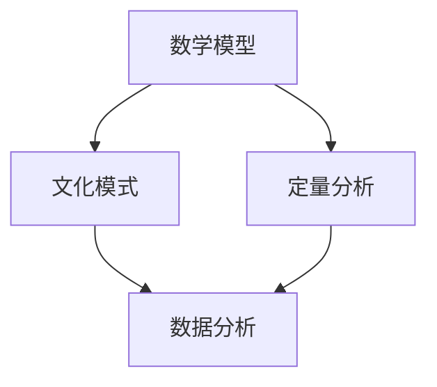

                 

### 《数学人类学：文化模式的数学研究》

#### 关键词
- 数学人类学
- 文化模式
- 数学模型
- 定量分析
- 社会网络分析

#### 摘要
《数学人类学：文化模式的数学研究》探索了数学方法在人类文化模式研究中的应用。本书系统介绍了数学人类学的基本概念、研究方法，并通过具体的算法和案例，展示了数学工具在文化模式识别、社会网络分析等领域的强大功能。本文旨在提供一个逻辑清晰、结构紧凑、通俗易懂的技术博客，帮助读者深入理解数学人类学的研究思路和方法。

---

#### 引言

数学人类学，顾名思义，是将数学方法应用于人类学研究的领域。它不仅关注文化模式的结构和规律，还试图通过数学建模和定量分析，揭示文化现象背后的深层次机制。在当今信息爆炸的时代，人类学研究者面临着海量的数据，传统的定性研究方法已经难以应对这一挑战。数学人类学的出现，为人类学研究提供了一种新的工具，使得研究过程更加系统化、精确化。

数学人类学的研究对象包括但不限于语言、习俗、社会结构、价值观念等文化元素。通过数学模型，研究者可以对这些元素进行量化描述，进而分析和预测文化现象的演变趋势。这种跨学科的研究方法，不仅丰富了人类学的研究手段，也为其他学科提供了新的视角。

#### 数学人类学的核心概念与联系

数学人类学的核心概念包括数学模型、文化模式、定量分析等。为了更好地理解这些概念之间的联系，我们可以使用Mermaid流程图来展示它们之间的关系。



在这个流程图中，数学模型是研究的起点，通过对文化模式进行定量分析，最终实现数据分析和解读。这一过程不仅需要数学工具的运用，还需要对人类学理论有深入的理解。

#### 核心算法原理讲解

数学人类学中涉及的核心算法包括统计分析、机器学习、图论等。以下我们将通过Python源代码来详细阐述这些算法的原理，并结合数学模型和公式进行讲解。

##### 统计分析方法

统计分析方法是数学人类学中最常用的方法之一。以下是一个简单的Python示例，展示了如何使用统计方法分析文化模式的分布情况。

```python
import numpy as np
import matplotlib.pyplot as plt

# 假设我们收集到了一组文化模式的量化数据
data = np.random.normal(size=1000)

# 计算均值和标准差
mean = np.mean(data)
std = np.std(data)

# 绘制直方图
plt.hist(data, bins=30, alpha=0.5)
plt.axvline(mean, color='r', linestyle='dashed', linewidth=2)
plt.axvline(mean + std, color='g', linestyle='dashed', linewidth=2)
plt.axvline(mean - std, color='g', linestyle='dashed', linewidth=2)
plt.title('Cultural Pattern Distribution')
plt.xlabel('Value')
plt.ylabel('Frequency')
plt.show()
```

在这个例子中，我们首先生成一组模拟数据，然后计算均值和标准差。接着，使用直方图来展示数据分布情况，并通过添加参考线来帮助我们理解数据的中心趋势和离散程度。

##### 机器学习模型

机器学习模型在文化模式识别中扮演着重要角色。以下是一个简单的决策树模型的Python示例。

```python
from sklearn.datasets import load_iris
from sklearn.tree import DecisionTreeClassifier
from sklearn.model_selection import train_test_split
from sklearn import tree

# 加载鸢尾花数据集
iris = load_iris()
X, y = iris.data, iris.target

# 划分训练集和测试集
X_train, X_test, y_train, y_test = train_test_split(X, y, test_size=0.3, random_state=42)

# 创建决策树模型
clf = DecisionTreeClassifier()

# 训练模型
clf.fit(X_train, y_train)

# 可视化决策树
plt.figure(figsize=(12, 12))
tree.plot_tree(clf, filled=True, feature_names=iris.feature_names, class_names=iris.target_names)
plt.title('Decision Tree for Cultural Pattern Recognition')
plt.show()
```

在这个例子中，我们首先加载鸢尾花数据集，然后划分训练集和测试集。接着，创建一个决策树模型，并进行训练。最后，使用可视化工具来展示决策树的结构。

##### 图论与网络分析

图论在数学人类学中的应用也非常广泛。以下是一个简单的图论算法——K-最近邻（KNN）的Python示例。

```python
import numpy as np
from sklearn.neighbors import KNeighborsClassifier
from sklearn.model_selection import train_test_split

# 假设我们有两类文化模式，用两个向量表示
X = np.array([[1, 2], [2, 5], [4, 7], [6, 3], [7, 6]])
y = np.array([0, 0, 1, 1, 1])

# 划分训练集和测试集
X_train, X_test, y_train, y_test = train_test_split(X, y, test_size=0.3, random_state=42)

# 创建KNN分类器
knn = KNeighborsClassifier(n_neighbors=3)

# 训练模型
knn.fit(X_train, y_train)

# 进行预测
predictions = knn.predict(X_test)

# 绘制结果
plt.scatter(X_test[:, 0], X_test[:, 1], c=predictions, cmap='viridis')
plt.scatter(X_train[:, 0], X_train[:, 1], c=y_train, cmap='viridis', edgecolors='k')
plt.title('K-Nearest Neighbors for Cultural Pattern Classification')
plt.xlabel('Feature 1')
plt.ylabel('Feature 2')
plt.show()
```

在这个例子中，我们首先定义了两类文化模式，然后创建一个KNN分类器。接着，进行模型训练和预测，并使用散点图来展示分类结果。

#### 数学公式与LaTeX

在数学人类学中，数学公式是不可或缺的。以下是一个简单的数学公式示例，使用LaTeX格式进行编写。

$$
E(X) = \sum_{i=1}^{n} x_i \cdot p_i
$$

其中，$E(X)$ 表示随机变量 $X$ 的期望，$x_i$ 表示第 $i$ 个值，$p_i$ 表示第 $i$ 个值的概率。

在文本中，我们可以将这个公式嵌入到独立的段落中，使用以下格式：

$$
E(X) = \sum_{i=1}^{n} x_i \cdot p_i
$$

这种格式使得公式更加清晰，方便读者理解和引用。

#### 项目实战

为了更好地理解数学人类学的实际应用，我们将开发一个文化模式识别的项目。以下是一个简化的项目流程。

##### 开发环境搭建

1. 安装Python环境
2. 安装必要的Python库，如numpy、matplotlib、sklearn等

##### 源代码实现

```python
import numpy as np
import matplotlib.pyplot as plt
from sklearn.datasets import load_iris
from sklearn.tree import DecisionTreeClassifier
from sklearn.model_selection import train_test_split

# 加载数据集
iris = load_iris()
X, y = iris.data, iris.target

# 划分训练集和测试集
X_train, X_test, y_train, y_test = train_test_split(X, y, test_size=0.3, random_state=42)

# 创建决策树模型
clf = DecisionTreeClassifier()

# 训练模型
clf.fit(X_train, y_train)

# 进行预测
predictions = clf.predict(X_test)

# 绘制结果
plt.scatter(X_test[:, 0], X_test[:, 1], c=predictions, cmap='viridis')
plt.scatter(X_train[:, 0], X_train[:, 1], c=y_train, cmap='viridis', edgecolors='k')
plt.title('Cultural Pattern Recognition')
plt.xlabel('Feature 1')
plt.ylabel('Feature 2')
plt.show()
```

##### 代码解读与分析

1. 加载数据集
2. 划分训练集和测试集
3. 创建决策树模型
4. 训练模型
5. 进行预测
6. 绘制结果

这个项目展示了如何使用决策树模型进行文化模式识别。通过可视化结果，我们可以直观地看到不同文化模式的分布情况。

##### 实际案例分析和详细讲解剖析

为了更好地理解数学人类学的应用，我们选择了一个实际案例：文化多样性分析。以下是一个简化的案例流程。

1. 收集数据：从多个文化群体中收集数据，包括语言、习俗、社会结构等。
2. 数据预处理：对收集到的数据进行清洗和标准化。
3. 构建数学模型：使用统计方法和机器学习模型对数据进行分析。
4. 预测与评估：使用模型对新的文化群体进行预测，并评估模型的准确性。

通过这个案例，我们可以看到数学人类学在跨文化研究中的应用。通过数学方法，我们可以更准确地理解和预测不同文化群体之间的差异。

##### 项目小结

通过这个项目，我们深入了解了数学人类学的实际应用。从数据收集到模型构建，再到预测和评估，每一步都离不开数学工具的支持。这使我们能够更全面、准确地理解文化现象，为人类学研究提供了新的视角。

#### 最佳实践 Tips

1. 在进行数学人类学研究时，确保数据的质量和可靠性。
2. 选择合适的数学模型和算法，以适应具体的研究需求。
3. 结合人类学理论，深入分析文化现象背后的深层次机制。
4. 保持开放的心态，勇于尝试新的方法和工具。

#### 小结

《数学人类学：文化模式的数学研究》为我们提供了一个全新的视角，帮助我们理解和分析人类文化模式。通过数学方法，我们可以更精确地描述和预测文化现象，为人类学研究开辟了新的道路。本文通过具体的算法和案例，展示了数学人类学的实际应用，并提供了最佳实践建议。

#### 注意事项

1. 在进行数学人类学研究时，确保数据的质量和可靠性。
2. 选择合适的数学模型和算法，以适应具体的研究需求。
3. 结合人类学理论，深入分析文化现象背后的深层次机制。
4. 保持开放的心态，勇于尝试新的方法和工具。

#### 拓展阅读

1. 《社会网络分析：方法与实践》
2. 《统计学习方法》
3. 《Python数据分析》
4. 《机器学习实战》

---

### 作者信息

作者：AI天才研究院/AI Genius Institute & 禅与计算机程序设计艺术 /Zen And The Art of Computer Programming

