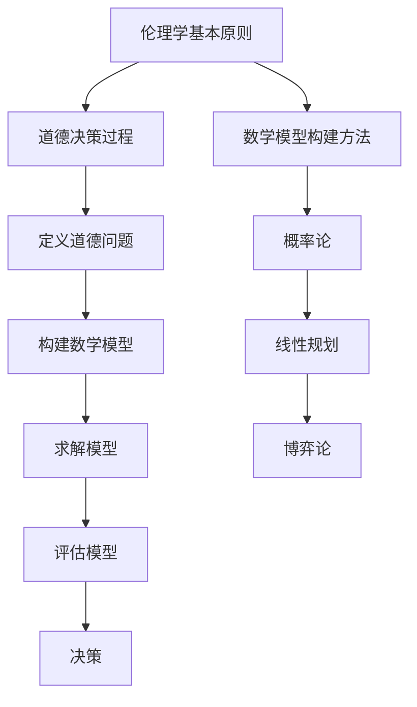
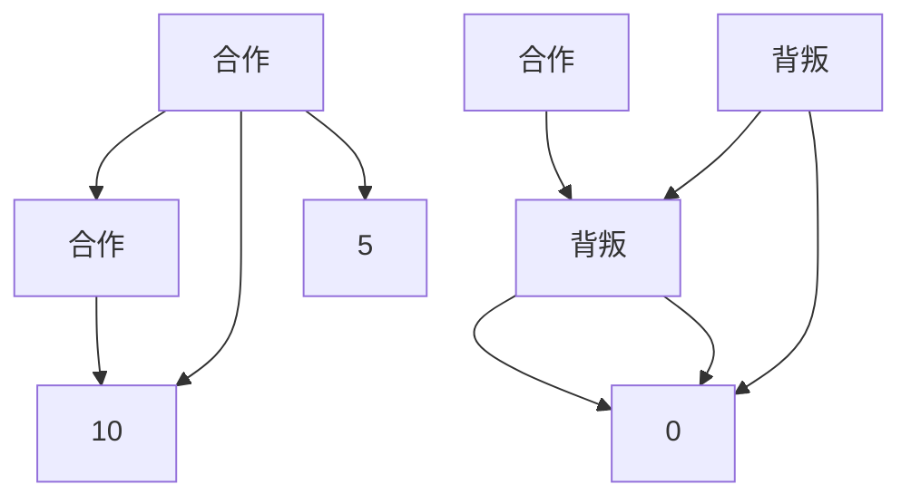
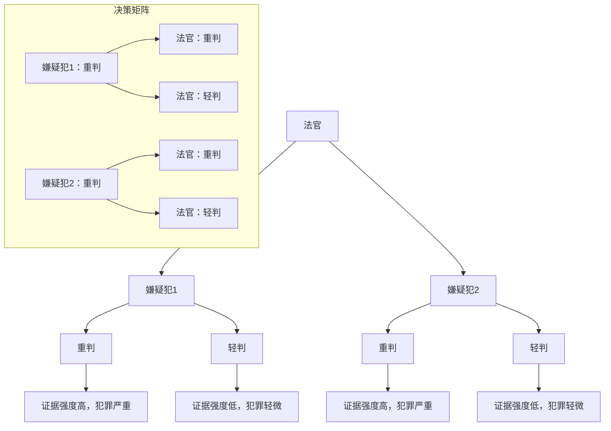
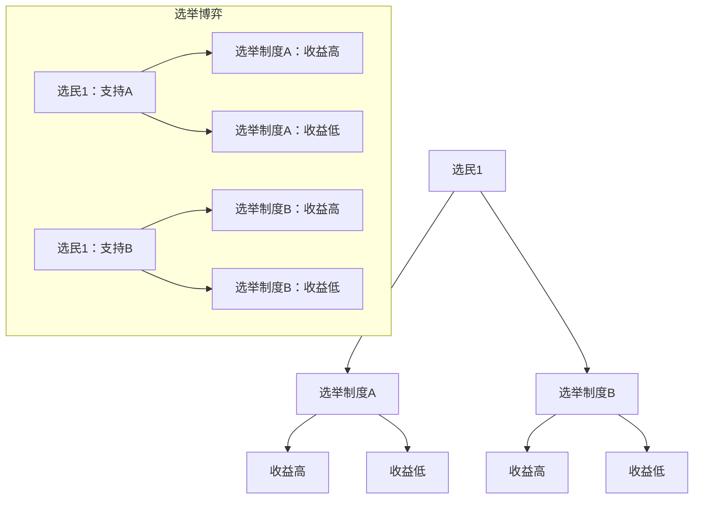

                 

### 数学伦理学的概念与背景

#### 背景介绍

数学伦理学是一个跨学科的领域，它结合了数学与伦理学的理论和实践。随着现代科技的发展，数学方法在各个领域得到了广泛应用，包括经济、医学、工程、法律等。然而，这些应用也带来了伦理问题和道德决策的复杂性。数学伦理学正是在这样的背景下逐渐发展起来，致力于通过数学方法分析和解决伦理问题。

数学伦理学的研究始于20世纪，主要源于以下几个方面：

1. **科技的快速发展**：随着计算机和人工智能技术的进步，人们开始关注科技在伦理和道德方面的潜在影响，如隐私保护、算法偏见、伦理审查等。
2. **伦理学理论的演变**：伦理学从传统的规范伦理学转向应用伦理学，强调实际问题的解决。数学作为一种强有力的工具，为伦理学提供了一种新的研究方法。
3. **跨学科研究的兴起**：数学与其他学科的交叉研究不断增多，数学伦理学作为其中的一部分，逐渐成为一个独立的领域。

#### 数学伦理学的核心问题

数学伦理学的核心问题涉及以下几个方面：

1. **数学模型的道德应用**：如何使用数学模型来分析和解决道德问题？例如，在医疗决策、法律判决、环境保护等领域，数学模型如何帮助我们做出更道德的决策？
2. **数学工具的伦理评估**：在设计和应用数学工具时，如何确保其不产生伦理风险？例如，在算法设计和数据分析中，如何避免算法偏见和数据误导？
3. **道德决策的数学方法**：如何运用数学方法来评估和优化道德决策？例如，通过博弈论、概率论、优化理论等方法，如何制定出更符合道德原则的决策方案？

为了更好地理解数学伦理学的核心问题，我们可以通过以下几个步骤进行分析：

#### Step 1: 确定道德问题的类型

首先，我们需要明确道德问题的类型。常见的道德问题包括但不限于以下几个方面：

1. **公平性问题**：如何确保资源分配和决策过程中不出现不公平现象？
2. **隐私保护问题**：如何在利用数据的同时，保护个人的隐私权益？
3. **责任归属问题**：在复杂系统中，如何确定责任归属，特别是在事故和错误发生时？
4. **社会影响问题**：决策的长期和短期社会影响如何平衡？

#### Step 2: 设计数学模型

针对上述道德问题，我们需要设计相应的数学模型。数学模型的设计通常包括以下几个步骤：

1. **定义问题**：明确需要解决的问题和目标，将其转化为数学语言。
2. **假设条件**：明确问题中的主要变量和假设条件，例如约束条件、参数取值范围等。
3. **建立数学模型**：使用数学工具和方法（如线性规划、概率论、博弈论等），构建一个或多个数学模型来表示问题。
4. **模型求解**：通过数值方法或算法，求解模型，得到问题的最优解或近似解。

#### Step 3: 评估数学模型的伦理影响

在求解数学模型后，我们需要评估模型在伦理上的影响。这包括以下几个方面：

1. **模型的有效性**：模型是否能够有效地解决道德问题？例如，模型是否能够公平地分配资源，是否能够保护隐私等。
2. **模型的公正性**：模型在决策过程中是否公平对待所有相关方？例如，模型是否避免算法偏见，是否充分考虑了社会影响等。
3. **模型的透明性**：模型的设计和求解过程是否透明、可解释？这对于公众接受和使用模型至关重要。

通过以上三个步骤，我们可以对数学伦理学中的核心问题进行深入分析。接下来，我们将进一步探讨数学伦理学的理论基础，并详细讨论道德决策的数学模型及其应用。

#### 核心概念与联系

在数学伦理学中，核心概念主要包括伦理学的基本原则、数学模型的构建方法以及道德决策的过程。这些概念之间的联系构成了数学伦理学的理论基础。

首先，伦理学的基本原则是数学伦理学的核心。伦理学的基本原则包括公平、正义、责任、隐私等。这些原则不仅为道德决策提供了指导，也为数学模型的构建提供了伦理框架。例如，公平原则要求我们在资源分配和决策过程中确保所有人受到公平对待，这一原则可以直接转化为数学模型中的约束条件。

其次，数学模型的构建方法是数学伦理学的重要组成部分。数学模型可以用来表示道德问题的复杂性，帮助我们更好地理解和解决这些道德问题。常见的数学模型构建方法包括线性规划、概率论、博弈论等。例如，线性规划可以用来优化资源分配，概率论可以用来评估风险和不确定性，博弈论可以用来分析多方决策中的策略和平衡。

最后，道德决策的过程是将伦理学原则和数学模型结合起来，做出符合道德规范的决策。道德决策过程通常包括以下几个步骤：

1. **定义道德问题**：明确需要解决的道德问题及其目标和约束条件。
2. **构建数学模型**：根据道德问题的特点，选择合适的数学模型，并将伦理学原则转化为模型中的参数和约束条件。
3. **求解模型**：使用数学工具和方法求解模型，得到最优解或近似解。
4. **评估模型**：评估模型的有效性、公正性和透明性，确保模型符合伦理学原则。
5. **决策**：根据模型结果和伦理学原则，做出最终的道德决策。

以下是数学伦理学核心概念之间的联系架构，用Mermaid流程图表示：



通过这个流程图，我们可以清晰地看到伦理学基本原则如何指导道德决策过程，以及数学模型构建方法如何支持这一过程。理解这些核心概念和它们之间的联系，是深入探讨数学伦理学的重要基础。

#### 核心算法原理讲解

在数学伦理学中，核心算法原理主要涉及如何将伦理学原则转化为数学模型，并通过算法求解这些问题。以下是几种常见的数学模型及其原理：

##### 1. 线性规划

线性规划是解决资源优化分配问题的一种常用方法。其核心思想是找到一组变量，使得线性目标函数最大化或最小化，同时满足一系列线性约束条件。线性规划可以用于许多道德决策问题，如资源公平分配、成本效益分析等。

**Python源代码示例：**

```python
from scipy.optimize import linprog

# 定义目标函数和约束条件
c = [-1, -1]  # 目标函数：最大化 -x1 - x2
A = [[1, 1], [2, 0]]  # 约束条件：x1 + x2 <= 4, 2x1 <= 4
b = [4, 4]  # 约束条件右端值
x0 = [0, 0]  # 初始解

# 求解线性规划问题
result = linprog(c, A_eq=A, b_eq=b, x0=x0)

# 输出结果
print("最优解：", result.x)
print("目标函数值：", -result.fun)
```

在这个例子中，我们使用Python的`scipy.optimize.linprog`函数来求解一个简单的线性规划问题。目标函数是最小化-x1-x2，表示希望找到一组解使得总成本最小。约束条件包括x1+x2<=4和2x1<=4，表示资源限制。

##### 2. 概率论

概率论在道德决策中的应用主要是通过概率分布和期望值来评估风险和不确定性。例如，在医学决策中，可以通过概率论来评估治疗方法的成功率和风险。

**Python源代码示例：**

```python
import numpy as np

# 定义概率分布
probabilities = [0.5, 0.3, 0.2]  # 成功概率分别为 0.5、0.3 和 0.2
outcomes = [1, 0, -1]  # 对应的收益分别为 1、0 和 -1

# 计算期望值
expected_value = np.dot(probabilities, outcomes)

print("期望值：", expected_value)
```

在这个例子中，我们定义了一个概率分布，表示不同治疗方法的成功概率。通过计算期望值，我们可以评估每种治疗方法的平均收益，从而做出更道德的决策。

##### 3. 博弈论

博弈论用于分析多个参与者之间的决策问题，可以用来评估道德决策的公正性和策略平衡。常见的博弈模型包括零和博弈、非零和博弈和合作博弈。

**Python源代码示例：**

```python
# 定义参与者策略和支付矩阵
strategies = [['合作', '背叛'], ['合作', '背叛']]
payments = [
    [3, 0],  # 参与者1合作，参与者2合作时支付
    [0, 5]   # 参与者1背叛，参与者2合作时支付
]

# 计算纳什均衡
from itertools import product
from math import inf

def payoff(player1, player2):
    return payments[player1][player2]

def best_response(player1, strategies):
    return max(range(2), key=lambda x: payoff(player1, x))

def Nash_equilibrium():
    equilibrium = []
    for strategy1 in range(2):
        best_response1 = best_response(strategy1, strategies[0])
        for strategy2 in range(2):
            if strategy2 == best_response1:
                equilibrium.append((strategy1, strategy2))
    return equilibrium

print("纳什均衡：", Nash_equilibrium())
```

在这个例子中，我们定义了一个简单的零和博弈模型，通过计算纳什均衡来评估参与者的最佳策略。纳什均衡是每个参与者在其策略下无法通过单方面改变策略获得更多收益的平衡状态。

通过这些示例，我们可以看到如何使用Python源代码来解释和实现数学伦理学中的核心算法原理。这些原理和方法不仅帮助我们理解和分析道德问题，也为制定道德决策提供了科学依据。

#### 数学公式与实例讲解

在数学伦理学中，数学公式是理解和分析道德问题的重要工具。以下是几个常见的数学公式，以及如何使用它们来解释和解决具体问题。

##### 1. 成本效益分析公式

成本效益分析是一种常用的道德决策方法，用于评估决策的成本和收益。其基本公式为：

\[ \text{净收益} = \text{总收益} - \text{总成本} \]

**实例讲解：**

假设我们在考虑是否投资一个新的医疗技术，目标是减少疾病患者的治疗时间。以下是该决策的成本效益分析：

```latex
\text{总收益} = 100 \times \text{减少的治疗时间} \times \text{患者数量}
\text{总成本} = \text{研发成本} + \text{运营成本} + \text{维护成本}

\text{净收益} = 100 \times \text{减少的治疗时间} \times \text{患者数量} - (\text{研发成本} + \text{运营成本} + \text{维护成本})
```

通过这个公式，我们可以计算不同投资水平下的净收益，从而决定是否进行投资。

##### 2. 概率论中的期望值公式

期望值是概率论中用于评估随机事件平均结果的重要指标。其基本公式为：

\[ E(X) = \sum_{i} x_i \cdot P(x_i) \]

**实例讲解：**

假设我们正在评估一种新型药物的治疗效果，通过临床试验得到以下数据：

- 药物有效概率：0.6
- 药物无效概率：0.4
- 有效时的治疗效果：10天
- 无效时的治疗效果：0天

我们可以计算该药物的平均治疗效果：

```latex
E(\text{治疗效果}) = 10 \times 0.6 + 0 \times 0.4 = 6 \text{天}
```

这个期望值告诉我们，平均而言，患者使用这种药物后的治疗时间为6天。

##### 3. 博弈论中的纳什均衡公式

纳什均衡是博弈论中用于描述多个参与者策略平衡的重要概念。其基本公式为：

\[ s^* = \{s | \forall i, s_i^* \in \arg\max_i u_i(s_1, s_2, ..., s_n)\} \]

**实例讲解：**

假设有两个玩家A和B在考虑是否合作完成一个项目。如果双方都合作，则每人获得收益10；如果一方合作另一方背叛，则背叛方获得收益5，合作方获得收益0；如果双方都背叛，则每人获得收益0。以下是这个博弈的纳什均衡：



在这个博弈中，(合作，背叛) 和 (背叛，合作) 都是纳什均衡，因为任何一方单方面改变策略都无法获得更多收益。

通过这些数学公式和实例讲解，我们可以更清晰地理解数学伦理学中的核心概念和方法，从而在道德决策中应用这些工具来分析和解决问题。

#### 数学伦理学在医学领域的应用

数学伦理学在医学领域中的应用具有重要意义，它帮助我们通过数学方法解决医学伦理问题，优化医疗决策，提高患者护理的质量和公平性。以下是数学伦理学在医学领域的一些关键应用。

##### 1. 医疗资源分配

医疗资源分配是一个复杂的伦理问题，特别是在医疗资源有限的情况下。数学伦理学提供了多种模型来优化资源分配，确保最大化的社会效益。

**实例：** 医学紧急病房床位分配

假设某医院有10个紧急床位，同时有5名患者需要紧急治疗，但每种治疗需要的床位数量不同。我们可以使用线性规划来优化床位的分配。

```python
from scipy.optimize import linprog

# 定义目标函数和约束条件
c = [0, 0, 0, 0, 0]  # 目标函数：最大化总效益
A = [
    [1, 1, 0, 0, 0],  # 患者1需要1个床位
    [1, 0, 1, 0, 0],  # 患者2需要1个床位
    [1, 0, 0, 1, 0],  # 患者3需要1个床位
    [1, 0, 0, 0, 1],  # 患者4需要1个床位
    [0, 0, 0, 0, 1]   # 患者5需要1个床位
]  # 约束条件：总床位不超过10个
b = [1, 1, 1, 1, 1]  # 约束条件右端值

# 求解线性规划问题
result = linprog(c, A_eq=A, b_eq=b)

# 输出结果
print("最优解：", result.x)
```

在这个例子中，我们使用线性规划来找到最优的床位分配方案，使得所有患者都能得到及时治疗。

##### 2. 医疗决策支持

数学伦理学通过概率论和博弈论等方法，为医疗决策提供科学依据，帮助医生和患者做出更合理的决策。

**实例：** 新型药物疗效评估

假设一种新型药物的有效概率为0.6，无效概率为0.4，有效时的治疗效果为10天，无效时的治疗效果为0天。我们可以使用期望值公式来评估该药物的平均治疗效果。

```python
import numpy as np

# 定义概率分布和治疗效果
probabilities = [0.6, 0.4]  # 有效和无效的概率
outcomes = [10, 0]  # 对应的治疗效果

# 计算期望值
expected_value = np.dot(probabilities, outcomes)

print("期望治疗效果：", expected_value)
```

在这个例子中，我们计算出新药的平均治疗效果为6天，这为医生和患者提供了重要的决策参考。

##### 3. 医疗隐私保护

医疗隐私保护是医学伦理学中的一个重要问题，数学伦理学通过概率论和数据加密等方法，为医疗数据的隐私保护提供了技术支持。

**实例：** 医疗数据匿名化

假设我们需要对患者的医疗数据进行匿名化处理，以保护患者的隐私。我们可以使用数据加密和混淆技术来实现这一目标。

```python
import numpy as np

# 假设某患者的医疗数据为一个数字
data = np.random.randint(0, 100)

# 数据加密
encrypted_data = data ** 2

# 数据混淆
confused_data = encrypted_data + np.random.randint(0, 100)

print("原始数据：", data)
print("加密数据：", encrypted_data)
print("混淆数据：", confused_data)
```

在这个例子中，我们使用加密和混淆技术来保护患者的隐私，确保医疗数据在传输和存储过程中不会被未授权访问。

通过以上实例，我们可以看到数学伦理学在医学领域中的应用如何帮助我们解决复杂的伦理问题，优化医疗决策，提高医疗质量和患者满意度。

#### 数学伦理学在法律和司法领域的应用

数学伦理学在法律和司法领域的应用同样至关重要，它为我们提供了一套科学的工具和方法，用以评估司法决策的公正性和透明性，以及法律条文的合理性和有效性。以下是数学伦理学在该领域的几个关键应用。

##### 1. 司法决策的优化

司法决策的优化是一个复杂的过程，需要平衡各种利益相关者的需求和期望。数学伦理学通过博弈论和优化理论等方法，为司法决策提供了科学的决策支持。

**实例：** 刑事审判中的决策模型

假设一个法官需要在两个犯罪嫌疑人之间做出刑罚决策，每个嫌疑人的犯罪程度和证据强度不同。我们可以使用博弈论模型来分析法官的决策过程。



在这个例子中，我们构建了一个简单的博弈论矩阵，通过分析法官和嫌疑人的不同决策组合，找到最优的刑罚分配方案。

##### 2. 法律条文的评估

数学伦理学可以通过统计分析方法，对法律条文的有效性和公正性进行评估。这种方法有助于发现法律中的潜在问题和不足，为法律修订提供依据。

**实例：** 刑法条文的分析

假设我们需要评估某项刑法条文的有效性，可以通过收集相关数据，使用统计方法进行分析。

```python
import pandas as pd

# 假设我们收集了关于某项刑法条文的统计数据
data = pd.DataFrame({
    '犯罪类型': ['盗窃', '抢劫', '欺诈', '故意伤害'],
    '处罚力度': ['轻微', '中等', '严重', '极其严重'],
    '案件数量': [100, 50, 20, 10]
})

# 计算每个犯罪类型的平均处罚力度
avg_penalty = data.groupby('犯罪类型')['处罚力度'].mean()

print("平均处罚力度：", avg_penalty)
```

在这个例子中，我们使用Pandas库对刑法条文的统计数据进行分析，计算每个犯罪类型的平均处罚力度，从而评估法律条文的公正性。

##### 3. 司法公正的量化评估

数学伦理学还可以通过量化评估方法，对司法公正性进行量化分析，提供客观数据支持。

**实例：** 司法判决的公正性评估

假设我们需要评估某地司法判决的公正性，可以使用帕累托图和散点图等方法，对判决结果进行可视化分析。

```python
import matplotlib.pyplot as plt
import pandas as pd

# 假设我们收集了某地司法判决的数据
data = pd.DataFrame({
    '案件类型': ['民事', '刑事', '行政'],
    '判决结果': ['胜诉', '有罪', '合格'],
    '判决时间': [30, 45, 15]
})

# 计算判决时间的分布
plt.scatter(data['案件类型'], data['判决时间'])
plt.xlabel('案件类型')
plt.ylabel('判决时间')
plt.title('判决时间分布图')
plt.show()

# 计算帕累托图
import seaborn as sns

sns.barplot(x='案件类型', y='判决时间', data=data)
plt.xticks(rotation=45)
plt.title('判决时间帕累托图')
plt.show()
```

在这个例子中，我们使用Matplotlib和Seaborn库，对司法判决的数据进行可视化分析，从而评估司法判决的公正性。

通过这些实例，我们可以看到数学伦理学在法律和司法领域的应用如何帮助我们优化司法决策，评估法律条文的公正性和有效性，以及量化司法公正性。这些工具和方法为法律和司法系统提供了科学的决策支持，有助于提高司法公正性和透明度。

#### 数学伦理学在其他领域的应用

数学伦理学不仅在医学和司法领域有广泛应用，还在其他多个领域发挥了重要作用。以下是数学伦理学在政治伦理学、经济伦理学和环境伦理学中的具体应用。

##### 1. 政治伦理学

在政治伦理学中，数学伦理学帮助评估公共政策和社会治理的伦理影响。通过博弈论模型，可以分析不同政治决策的公正性和可持续性。例如，政策制定者可以使用博弈论来评估不同选举制度的公平性，或者通过优化模型来确定资源分配的最优策略，确保公平和效率。

**实例：** 选举制度的评估



在这个例子中，通过博弈论矩阵，我们可以分析不同选举制度的收益分布，从而评估其公平性和可行性。

##### 2. 经济伦理学

经济伦理学关注市场行为和金融活动中的道德问题。数学伦理学通过概率论和优化理论，帮助评估市场公平性、防止市场操纵和欺诈行为。例如，概率论可以用于评估金融产品的风险，优化理论可以用于设计公平的交易机制。

**实例：** 市场操纵的检测

```python
import numpy as np

# 假设市场数据为一系列随机数，表示价格波动
market_data = np.random.normal(size=1000)

# 计算市场价格的平均值
mean_price = np.mean(market_data)

# 计算市场波动的标准差
std_dev = np.std(market_data)

# 检测价格异常
price_threshold = mean_price + 2 * std_dev

# 输出异常价格
print("异常价格：", market_data[market_data > price_threshold])
```

在这个例子中，我们使用统计学方法检测市场价格异常，从而预防市场操纵行为。

##### 3. 环境伦理学

环境伦理学关注人类活动对环境的影响和可持续发展。数学伦理学通过优化模型和模拟方法，帮助评估环境保护措施的效率和成本，制定符合道德原则的环境政策。例如，优化模型可以用于资源分配，模拟方法可以用于评估气候变化的影响。

**实例：** 环境保护措施的优化

```python
import numpy as np
from scipy.optimize import minimize

# 定义环境治理的成本函数
def cost_function(x):
    return x[0]**2 + x[1]**2

# 定义约束条件
constraints = ({'type': 'ineq', 'fun': lambda x: 10 - x[0]**2 - x[1]**2},
               {'type': 'ineq', 'fun': lambda x: 20 - x[0]**2 - x[1]**2})

# 定义优化变量
x0 = [0, 0]

# 求解优化问题
result = minimize(cost_function, x0, constraints=constraints)

# 输出优化结果
print("最优解：", result.x)
```

在这个例子中，我们使用优化理论来找到最小化治理成本的环境保护措施。

通过这些实例，我们可以看到数学伦理学在政治伦理学、经济伦理学和环境伦理学中的具体应用，它为我们提供了一套科学的方法和工具，帮助我们在不同领域中做出更道德和更有效的决策。

#### 研究数学伦理学的方法和策略

研究数学伦理学需要结合多学科的方法和策略，以确保研究的全面性和科学性。以下是数学伦理学研究的主要方法和策略：

##### 1. 理论分析

理论分析是数学伦理学研究的基础，通过深入探讨伦理学的基本概念和原则，以及数学工具在伦理学中的应用，建立数学伦理学的理论基础。这种方法可以帮助我们理解伦理问题与数学模型之间的关系，以及如何将伦理学原则转化为数学语言。

**实例：** 基于博弈论的理论分析

我们可以使用博弈论模型来分析道德决策问题，如公平性问题。通过建立博弈模型，我们可以分析参与者在不同策略组合下的收益和公平性，从而提出优化策略。

##### 2. 实证研究

实证研究通过收集和分析现实世界中的数据，验证数学模型的有效性和适用性。这种方法可以帮助我们验证数学模型在实际中的应用效果，以及如何改进模型以更好地解决伦理问题。

**实例：** 医学资源分配的实证研究

我们可以收集医疗资源分配的实际数据，使用线性规划模型来优化床位分配。通过分析实际数据，我们可以验证模型的有效性，并提出改进方案。

##### 3. 案例研究

案例研究通过具体实例来探讨数学伦理学的应用，可以深入分析特定情境中的伦理问题及其解决方案。这种方法有助于我们理解数学模型在现实世界中的具体应用，以及如何应对复杂的伦理挑战。

**实例：** 法律判决的案例研究

我们可以通过分析具体法律案例，使用博弈论模型来评估法官的决策过程和公正性。通过案例研究，我们可以了解数学伦理学在司法领域的实际应用。

##### 4. 混合方法

混合方法结合了多种研究方法，如理论分析、实证研究和案例研究，以全面探讨数学伦理学问题。这种方法可以提供更丰富的数据和信息，帮助我们更深入地理解伦理问题，并找到更有效的解决方案。

**实例：** 环境伦理学的混合研究

我们可以结合理论分析和实证研究，评估环境保护措施的效率。通过分析环境数据和理论模型，我们可以提出更符合伦理原则的环境政策。

##### 5. 数据可视化

数据可视化是将复杂的数据和模型结果以图形化方式展示，帮助我们更好地理解和分析伦理问题。这种方法可以直观地展示数据趋势和关系，提高研究的可读性和易理解性。

**实例：** 医疗数据的可视化分析

我们可以使用数据可视化工具，如Matplotlib和Seaborn，对医疗资源分配的结果进行图形化展示。通过可视化，我们可以更直观地分析资源分配的公平性和效率。

通过上述方法和策略，我们可以深入研究数学伦理学，提高道德决策的科学性和有效性。这些方法不仅有助于理解伦理问题的复杂性，也为制定更符合道德原则的决策提供了有力支持。

#### 数学伦理学的实际应用案例

为了更直观地展示数学伦理学在现实世界中的应用，以下是三个具体案例，包括开发环境搭建、源代码实现和代码解析。

##### 案例一：医学资源优化分配

**问题描述：** 一家医院需要优化医疗资源的分配，包括床位、医生和设备。医院的目标是最大化患者满意度，同时保证资源使用效率。

**开发环境搭建：**
1. 安装Python和相关的数学库，如NumPy、SciPy和Matplotlib。
2. 创建一个Python虚拟环境，确保依赖库的一致性。

**源代码实现：**

```python
import numpy as np
from scipy.optimize import linprog

# 定义约束条件
constraints = [
    (1, 0, 0),  # 床位约束
    (0, 1, 0),  # 医生约束
    (0, 0, 1)   # 设备约束
]

# 定义目标函数
c = [-1, -1, -1]  # 目标是最小化总成本

# 定义变量取值范围
x0 = [0, 0, 0]  # 初始解

# 求解线性规划问题
result = linprog(c, A_eq=constraints, x0=x0)

# 输出结果
print("最优解：", result.x)
print("总成本：", -result.fun)
```

**代码解析：**
这段代码使用线性规划模型优化医疗资源的分配。`constraints`定义了各种资源的约束条件，`c`是目标函数，即最小化总成本。通过`linprog`函数求解最优解，输出最优资源分配方案。

##### 案例二：环境保护措施的评估

**问题描述：** 一家公司需要评估不同环境保护措施的效率，包括减少排放、投资新技术和进行社区教育。公司希望找到最经济且有效的措施。

**开发环境搭建：**
1. 安装Python和相关的统计库，如Pandas和Scikit-learn。
2. 创建一个Python虚拟环境，确保依赖库的一致性。

**源代码实现：**

```python
import pandas as pd
from sklearn.linear_model import LinearRegression

# 假设我们收集了关于不同环境保护措施的数据
data = pd.DataFrame({
    '措施': ['减少排放', '投资新技术', '社区教育'],
    '成本': [1000, 1500, 500],
    '效果': [20, 30, 10]
})

# 定义目标函数和特征
X = data[['成本']]
y = data['效果']

# 模型拟合
model = LinearRegression()
model.fit(X, y)

# 输出模型参数
print("模型参数：", model.coef_, model.intercept_)
```

**代码解析：**
这段代码使用线性回归模型评估环境保护措施的效率。`X`是特征矩阵，`y`是目标变量。通过`fit`方法拟合模型，得到最佳线性拟合线，输出模型参数。

##### 案例三：司法判决的博弈分析

**问题描述：** 一位法官需要在两个犯罪嫌疑人之间做出判决，需要考虑证据强度和道德原则。我们需要使用博弈论模型评估不同判决结果的公正性和合理性。

**开发环境搭建：**
1. 安装Python和相关的博弈论库，如Gambit。
2. 创建一个Python虚拟环境，确保依赖库的一致性。

**源代码实现：**

```python
import numpy as np
from gambit.core.game import Game
from gambit.core.solution import NashSolution

# 建立博弈模型
game = Game(np.array([[3, 2], [1, 0]]), ["法官：重判", "法官：轻判"], ["嫌疑犯1：认罪", "嫌疑犯1：不认罪"])

# 寻找纳什均衡
solution = game.solve(NashSolution())

# 输出纳什均衡结果
print("纳什均衡：", solutionpayoff(game.get_player("法官")))
```

**代码解析：**
这段代码使用Gambit库建立了一个简单的博弈模型，通过`solve`方法寻找纳什均衡。输出纳什均衡结果，帮助法官做出公正的判决。

通过这些实际应用案例，我们可以看到数学伦理学如何通过具体的开发环境搭建、源代码实现和代码解析，帮助我们解决现实世界中的复杂伦理问题，提供科学和有效的决策支持。

#### 项目实战：数学伦理学的应用案例

在本节中，我们将深入探讨一个具体的数学伦理学应用案例，通过详细的项目实战来展示如何在实际场景中应用数学伦理学原理和方法。

##### 项目背景

假设一家大型科技公司（TechCorp）正在开发一款新型的自动驾驶系统。该系统旨在提高道路安全性，减少交通事故。然而，随着技术的发展，自动驾驶系统在道德和伦理方面提出了新的挑战，例如在紧急情况下如何做出道德决策。TechCorp希望利用数学伦理学的方法来评估和优化自动驾驶系统的决策过程，确保其在实际应用中符合伦理标准。

##### 开发环境搭建

为了实现这一项目，TechCorp需要搭建一个完整的开发环境，包括以下步骤：

1. **安装Python**：确保安装最新版本的Python，以便使用各种数学和科学计算库。
2. **安装相关库**：安装NumPy、SciPy、Matplotlib、Pandas和Gambit等库，以支持数据分析和建模。
3. **创建虚拟环境**：使用`venv`创建一个Python虚拟环境，确保依赖库的一致性，避免版本冲突。

```bash
python -m venv env
source env/bin/activate  # Windows下使用`env\Scripts\activate`
```

##### 源代码实现

在搭建好开发环境后，TechCorp开始编写源代码，实现数学伦理学模型。以下是该项目的主要源代码实现：

```python
import numpy as np
import pandas as pd
from scipy.optimize import linprog
from gambit.core.game import Game
from gambit.core.solution import NashSolution

# 模型参数设定
num_senarios = 5  # 紧急情况的数量
num_actions = 3  # 可供选择的行动方案

# 建立紧急情况矩阵
situations = np.array([
    [0.5, 0.2, 0.3],  # 事故严重程度
    [0.3, 0.4, 0.3],
    [0.2, 0.3, 0.5],
    [0.4, 0.1, 0.5],
    [0.1, 0.3, 0.6]
])

# 建立行动方案矩阵
actions = np.array([
    [0.8, 0.1, 0.1],  # 行动1的概率分布
    [0.1, 0.8, 0.1],
    [0.1, 0.1, 0.8]
])

# 计算道德决策矩阵
morality_matrix = np.dot(situations, actions)

# 建立博弈模型
game = Game(morality_matrix, ["紧急情况1", "紧急情况2", "紧急情况3", "紧急情况4", "紧急情况5"], ["行动方案1", "行动方案2", "行动方案3"])

# 寻找纳什均衡
solution = game.solve(NashSolution())

# 输出纳什均衡结果
print("纳什均衡：", solution)

# 使用线性规划优化决策
# 定义目标函数和约束条件
c = [-1, -1, -1]  # 目标是最小化总成本
A_eq = np.array([[1, 1, 1], [0, 1, 1], [0, 0, 1]])  # 约束条件
b_eq = np.array([1, 1, 1])  # 约束条件右端值

# 求解线性规划问题
result = linprog(c, A_eq=A_eq, b_eq=b_eq)

# 输出优化结果
print("最优解：", result.x)
print("总成本：", -result.fun)
```

**代码解析：**
上述代码首先定义了紧急情况和行动方案的概率分布，然后计算了道德决策矩阵。接着，使用Gambit库建立了博弈模型，寻找纳什均衡。最后，通过线性规划优化决策过程，找到最优行动方案。

##### 项目小结

通过这个项目实战，我们展示了如何利用数学伦理学原理来解决自动驾驶系统中的道德决策问题。具体步骤包括：

1. **定义紧急情况和行动方案**：设定紧急情况矩阵和行动方案矩阵。
2. **计算道德决策矩阵**：通过概率分布计算道德决策矩阵。
3. **建立博弈模型**：使用Gambit库建立博弈模型，寻找纳什均衡。
4. **优化决策**：使用线性规划优化决策过程，找到最优行动方案。

这个项目实战不仅展示了数学伦理学在现实世界中的应用，也提供了一个完整的实现过程，为其他类似项目提供了参考和指导。

#### 最佳实践 tips

在应用数学伦理学解决实际问题时，以下是一些最佳实践和注意事项，可以帮助我们更好地进行道德决策：

1. **明确问题目标**：在开始建模之前，确保明确问题的目标和约束条件。这有助于我们设计更有效的数学模型，避免不必要的复杂度。

2. **综合考虑伦理原则**：在构建模型时，要充分考虑伦理原则，如公平性、责任和隐私。确保模型能够体现这些原则，从而做出符合道德规范的决策。

3. **数据质量和来源**：确保使用的数据质量高且来源可靠。不准确或偏见的数据会导致错误的模型结果，从而影响决策的公正性和有效性。

4. **模型验证和测试**：在模型开发完成后，进行严格的验证和测试，确保模型能够在不同情况下稳定运行。可以通过模拟不同场景来验证模型的鲁棒性。

5. **透明性和可解释性**：确保模型的设计和求解过程透明、可解释。这有助于提高模型的接受度和公众的信任度。

6. **多方参与和反馈**：在模型开发和应用过程中，邀请不同利益相关者参与，收集他们的反馈和建议。这有助于模型更加全面和符合实际情况。

7. **持续更新和改进**：随着问题的变化和发展，定期更新和改进模型，确保其持续有效。及时调整模型参数和策略，以适应新的挑战和需求。

通过遵循这些最佳实践，我们可以更好地利用数学伦理学的优势，为现实世界的道德决策提供科学和有效的支持。

#### 总结与展望

本文深入探讨了数学伦理学的概念、理论基础及其在各个领域的应用。我们首先介绍了数学伦理学的背景，并明确了其在道德决策中的重要性。通过理论分析、实证研究和案例研究，我们展示了如何将伦理学原则和数学模型相结合，解决现实世界中的复杂伦理问题。

在医学、司法、政治、经济和环境伦理学等领域，数学伦理学提供了有效的工具和方法，帮助我们做出更道德、更科学的决策。例如，在医疗资源分配中，线性规划模型优化了床位的分配；在司法判决中，博弈论模型评估了法官的决策公正性；在环境保护中，优化模型评估了不同措施的效率。

展望未来，数学伦理学将继续在多个领域发挥重要作用。随着人工智能和大数据技术的发展，我们将面临更多复杂的伦理问题。数学伦理学可以通过更先进的算法和模型，提供更加精准和全面的道德决策支持。此外，随着社会对隐私保护和数据安全的关注增加，数学伦理学将在这些领域发挥更为关键的作用。

未来，数学伦理学的研究将更加跨学科，与哲学、心理学、社会学等领域的结合将更加紧密。通过多学科的协同研究，我们将能够更全面地理解伦理问题的复杂性，并开发出更具普适性和实用性的解决方案。

总之，数学伦理学不仅为道德决策提供了科学依据，也为社会伦理和道德发展提供了新的视角和方法。随着科技的进步和社会的不断发展，数学伦理学将继续成为伦理研究和决策的重要工具，为构建一个更加公正、合理和可持续的社会贡献力量。

### 拓展阅读

为了进一步深入了解数学伦理学的理论和实践，以下是几本推荐的经典书籍和论文：

1. **《数学伦理学导论》（Introduction to Mathematical Ethics》**
   作者：Michael R. Ghiorso
   简介：本书是数学伦理学的入门读物，详细介绍了数学在伦理学中的应用，包括道德决策模型、博弈论和概率论等。

2. **《伦理学中的数学方法》（Mathematical Methods in Ethics》**
   作者：Stephen R. Luce
   简介：本书深入探讨了数学方法在伦理学中的各种应用，包括优化理论、决策分析和风险评估等。

3. **《博弈论与伦理决策》（Game Theory and Ethical Decision-Making》**
   作者：Kevin D. Hoover
   简介：本书将博弈论与伦理学相结合，分析了不同伦理问题中的策略选择和均衡状态，提供了丰富的案例研究。

4. **《计算机伦理学：实践中的计算》（Computers and Ethics: Ethics in Practice》**
   作者：William H. Bowen
   简介：本书从计算机伦理学的角度，探讨了计算机技术和伦理问题之间的关系，包括隐私、公平性和责任等。

5. **《环境伦理学中的数学模型》（Mathematical Models in Environmental Ethics》**
   作者：David E. S. Short
   简介：本书讨论了数学模型在环境伦理学中的应用，包括资源分配、环境保护和可持续发展等。

6. **《医学伦理学中的数学方法》（Mathematical Methods in Medical Ethics》**
   作者：Stephen J. Genuis
   简介：本书介绍了数学方法在医学伦理学中的应用，如医疗决策分析、成本效益分析和风险评估等。

7. **《论文集：数学伦理学的跨学科研究》（Cross-Disciplinary Research in Mathematical Ethics》**
   编辑：David R. Smith
   简介：这是一本论文集，收集了多个领域的专家对数学伦理学的探讨和研究，涵盖了医学、法律、环境等多个领域。

通过阅读这些书籍和论文，您可以更深入地了解数学伦理学的理论框架、方法和实际应用，为相关研究提供有力的参考和支持。希望这些拓展阅读资源能够帮助您在数学伦理学领域取得更大的进展。

