                 

### 数学公理体系的起源与发展

#### 关键词

- 数学公理
- 数学发展史
- 逻辑推理
- 希腊数学
- 逻辑主义
- 实用主义

#### 摘要

本文旨在探讨数学公理体系的起源与发展，解析其在数学理论体系中的重要地位。文章首先介绍了数学公理的概念和基本性质，然后回顾了数学公理体系的发展历程，包括古希腊数学、欧几里得的《几何原本》、非欧几何的兴起以及现代数学公理体系的形成。接着，文章深入分析了数学公理体系的核心内容，包括基本数学概念和数学原理。最后，文章探讨了数学公理体系的挑战和未来发展趋势。

#### 目录

1. **数学公理体系概述**
   - **1.1 什么是数学公理体系**
   - **1.2 数学公理体系的性质**
   - **1.3 数学公理体系的重要性

2. **数学公理体系的发展历程**
   - **2.1 古希腊数学公理体系的形成**
   - **2.2 欧几里得的《几何原本》**
   - **2.3 非欧几何的兴起**
   - **2.4 现代数学公理体系的形成**

3. **数学公理体系的核心内容**
   - **3.1 基本数学概念**
   - **3.2 数学公理体系的数学原理**
   - **3.3 数学公理体系的应用**

4. **数学公理体系的挑战与未来**
   - **4.1 数学公理体系的挑战**
   - **4.2 数学公理体系的未来发展趋势**

5. **总结与展望**
   - **5.1 总结**
   - **5.2 展望**

---

### 1. 数学公理体系概述

#### 1.1 什么是数学公理体系

数学公理体系是一组被普遍接受的基本命题，这些命题被视为无需证明的前提，是其他数学命题证明的基础。公理的选择和组合构成了数学的不同分支，为整个数学体系提供了坚实的逻辑基础。

#### 1.2 数学公理体系的性质

- **独立性**：每个公理都必须是独立的，即不能从其他公理中推导出来。
- **自明性**：公理应该是直观的、不言自明的。
- **完备性**：数学公理体系应该能够推导出所有可以直观理解的基本数学事实。

#### 1.3 数学公理体系的重要性

数学公理体系的重要性体现在以下几个方面：

- **逻辑基础**：数学公理体系为数学推理提供了基础，使得复杂的数学理论得以建立。
- **理论框架**：数学公理体系为数学的各个分支提供了统一的理论框架。
- **应用广泛**：数学公理体系在科学、工程、计算机科学等多个领域都有广泛的应用。

### 1.1 什么是数学公理体系

**Mermaid 流程图：**

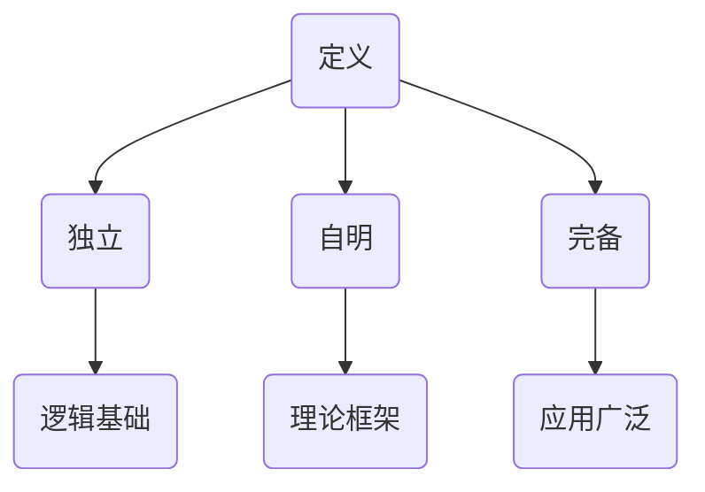

#### 1.1.1 数学公理的定义

数学公理是一组最基本的命题，这些命题不需要证明，而是被认为是数学体系的基础。例如，在几何学中，欧几里得的第五公设是一个著名的公理。

#### 1.1.2 数学公理的性质

- **独立性**：每个公理必须是独立的，即不能从其他公理中推导出来。
- **自明性**：公理应该是直观的、不言自明的，不需要额外的解释。

#### 1.1.3 数学公理体系的定义

数学公理体系是由一组相互独立且自明的公理构成的整体，这些公理共同定义了一个数学体系。例如，欧几里得的《几何原本》就是一个完整的数学公理体系。

#### 1.1.4 数学公理体系的基本结构

数学公理体系的基本结构通常包括以下几个部分：

- **基本对象**：定义数学体系中的基本对象，如点、线、面等。
- **基本关系**：定义这些对象之间的关系，如相等、包含等。
- **基本运算**：定义在这些对象和关系上的基本运算，如加法、减法等。

### 1.2 数学公理体系的性质

**Mermaid 流程图：**

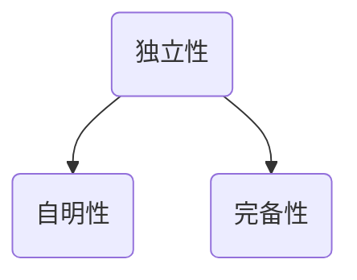

#### 1.2.1 独立性

公理的独立性是指每个公理都不能从其他公理中推导出来。这是数学公理体系设计中的一个基本原则，确保了每个公理都是必要的，且具有独立性。

#### 1.2.2 自明性

公理的自明性是指它们应该是直观的、不言自明的，不需要额外的解释。自明性保证了公理的普遍接受性，使得整个数学体系具有一致性。

#### 1.2.3 完备性

公理的完备性是指数学公理体系应该能够推导出所有可以直观理解的基本数学事实。完备性确保了数学公理体系能够涵盖所有基本的数学概念和命题。

### 1.3 数学公理体系的重要性

**Mermaid 流程图：**

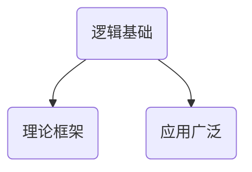

#### 1.3.1 逻辑基础

数学公理体系为数学推理提供了基础，使得复杂的数学理论得以建立。通过公理，数学家可以逻辑地推导出各种数学命题，建立起严密的数学体系。

#### 1.3.2 理论框架

数学公理体系为数学的各个分支提供了统一的理论框架。不同分支的数学理论可以通过公理体系相互联系，形成一个完整的数学理论体系。

#### 1.3.3 应用广泛

数学公理体系在科学、工程、计算机科学等多个领域都有广泛的应用。它为科学研究提供了精确的语言和工具，是现代科技发展的基石。

---

### 1.3 数学公理体系的重要性

**Mermaid 流程图：**


#### 1.3.1 逻辑基础

数学公理体系为数学推理提供了基础，使得复杂的数学理论得以建立。通过公理，数学家可以逻辑地推导出各种数学命题，建立起严密的数学体系。

- **逻辑推导**：公理体系确保了数学推理的严谨性，每个命题都可以从公理出发，通过逻辑推导得到。

- **数学证明**：公理体系是数学证明的核心，所有的数学定理都需要基于公理进行证明。

#### 1.3.2 理论框架

数学公理体系为数学的各个分支提供了统一的理论框架。不同分支的数学理论可以通过公理体系相互联系，形成一个完整的数学理论体系。

- **理论整合**：公理体系使得不同数学分支的理论可以相互关联，从而形成统一的整体。

- **结构清晰**：通过公理体系，数学理论的结构变得更加清晰，每个分支的地位和作用得以明确。

#### 1.3.3 应用广泛

数学公理体系在科学、工程、计算机科学等多个领域都有广泛的应用。它为科学研究提供了精确的语言和工具，是现代科技发展的基石。

- **科学研究**：数学公理体系为科学研究提供了精确的描述和推理工具，使得科学理论更加严谨。

- **工程应用**：数学公理体系在工程领域有着广泛的应用，如结构力学、电路理论等。

- **计算机科学**：数学公理体系为计算机科学提供了基础，如算法理论、数据结构等。

### 1.4 数学公理体系的影响

**Mermaid 流程图：**

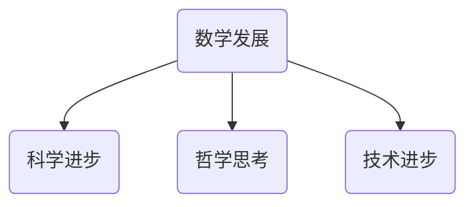

#### 1.4.1 数学发展

数学公理体系推动了数学的发展，使得数学理论更加严谨和系统。它促进了数学分支的多样化和深入，如代数、几何、分析等。

- **数学分支**：数学公理体系使得不同数学分支得以独立发展，丰富了数学的理论体系。

- **数学研究**：公理体系为数学研究提供了方向和方法，推动了数学理论的创新和进步。

#### 1.4.2 科学进步

数学公理体系为科学研究提供了基础和工具，推动了科学的进步。

- **物理学**：数学公理体系在物理学中有着广泛应用，如牛顿力学、量子力学等。

- **生物学**：数学公理体系在生物学中也有着重要作用，如遗传学、生态学等。

#### 1.4.3 哲学思考

数学公理体系对哲学思考产生了深远的影响，推动了逻辑学和认识论的发展。

- **逻辑学**：数学公理体系为逻辑学提供了研究方法，使得逻辑推理更加严谨。

- **认识论**：数学公理体系探讨了人类对知识的认知过程，对认识论产生了重要影响。

#### 1.4.4 技术进步

数学公理体系为技术进步提供了基础，推动了科技的发展。

- **计算机科学**：数学公理体系为计算机科学提供了理论基础，如算法、数据结构等。

- **工程应用**：数学公理体系在工程应用中有着广泛的应用，如建筑、机械、电子等。

---

### 1.5 小结

数学公理体系是数学理论体系的基础，它为数学推理、理论框架和广泛应用提供了坚实的基础。从古希腊的欧几里得《几何原本》到现代数学的各种公理体系，数学公理体系的发展不仅丰富了数学理论，也推动了科学、技术和哲学的进步。理解数学公理体系的重要性，有助于我们更好地把握数学的发展方向和应用前景。

---

### 1.6 拓展阅读

- **书籍**：《数学原理》（作者：艾萨克·牛顿）——这本书详细阐述了数学公理体系和数学在自然科学中的应用。
- **论文**：《非欧几何学基础》（作者：尼古拉·伊万诺维奇·洛巴切夫斯基）——这篇论文介绍了非欧几何的基本概念和公理体系。
- **网站**：MathWorld（https://mathworld.wolfram.com/）——这是一个涵盖广泛数学知识的在线资源，包括数学公理体系的各种解释和应用。

---

### 2. 数学公理体系的发展历程

#### 2.1 古希腊数学公理体系的形成

古希腊数学被认为是数学公理体系的起源。在古希腊，数学主要研究几何学和算术，而几何学的发展尤为显著。欧几里得（Euclid）的《几何原本》是古希腊数学公理体系的代表作。

**Mermaid 流程图：**

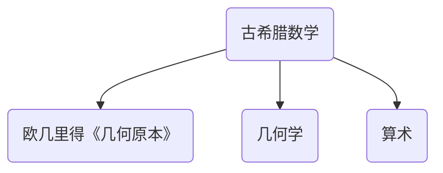

《几何原本》包含了23个定义、5个公设和5个公理，这些构成了古希腊数学的公理体系。欧几里得的公理体系对后世的数学发展产生了深远的影响。

#### 2.1.1 希腊数学的起源

希腊数学起源于公元前7世纪左右的希腊城邦。早期的希腊数学主要涉及实用计算，如贸易、农业等。随着数学理论的发展，数学逐渐从实用计算中独立出来，成为一门抽象的学科。

#### 2.1.2 欧几里得《几何原本》的基本内容

《几何原本》是欧几里得于公元前300年左右编写的一部几何学著作。这本书包含了23个定义、5个公设和5个公理。这些公理构成了古希腊数学公理体系的基础。

- **定义**：几何学的基本概念，如点、线、面等。
- **公设**：几何学的基本假设，如通过两点可以作一条直线等。
- **公理**：几何学的基本原则，如平行公理等。

#### 2.1.3 欧几里得《几何原本》的影响

《几何原本》不仅为古希腊数学奠定了基础，也对后世的数学发展产生了深远的影响。这本书系统地阐述了几何学的基本原理，为后来的数学家提供了研究的范例。此外，《几何原本》还影响了其他学科，如物理学、天文学等。

### 2.2 欧几里得的《几何原本》

**Mermaid 流程图：**

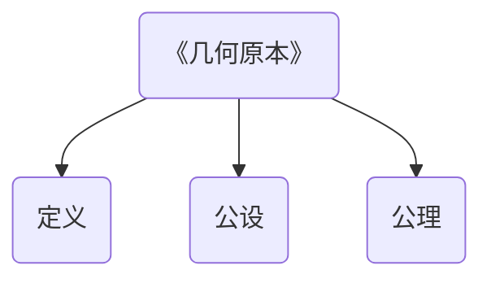

《几何原本》是欧几里得于公元前300年左右编写的一部几何学著作，被认为是古希腊数学的巅峰之作。这本书包含了几何学的基本原理和定理，对后世的数学发展产生了深远的影响。

#### 2.2.1 《几何原本》的概述

《几何原本》分为13卷，涵盖了平面几何、立体几何、比例、相似、数论等多个方面。这本书系统地阐述了几何学的基本原理，为后来的数学家提供了研究的范例。

#### 2.2.2 《几何原本》的基本内容

《几何原本》包含23个定义、5个公设和5个公理。这些公理构成了古希腊数学公理体系的基础。

- **定义**：几何学的基本概念，如点、线、面等。
- **公设**：几何学的基本假设，如通过两点可以作一条直线等。
- **公理**：几何学的基本原则，如平行公理等。

#### 2.2.3 《几何原本》的影响

《几何原本》不仅为古希腊数学奠定了基础，也对后世的数学发展产生了深远的影响。这本书系统地阐述了几何学的基本原理，为后来的数学家提供了研究的范例。此外，《几何原本》还影响了其他学科，如物理学、天文学等。

### 2.3 非欧几何的兴起

非欧几何是相对于欧几里得几何而言的，它基于不同的公理体系，提出了与欧几里得几何不同的几何理论。非欧几何的兴起标志着数学公理体系的重大变革。

**Mermaid 流程图：**

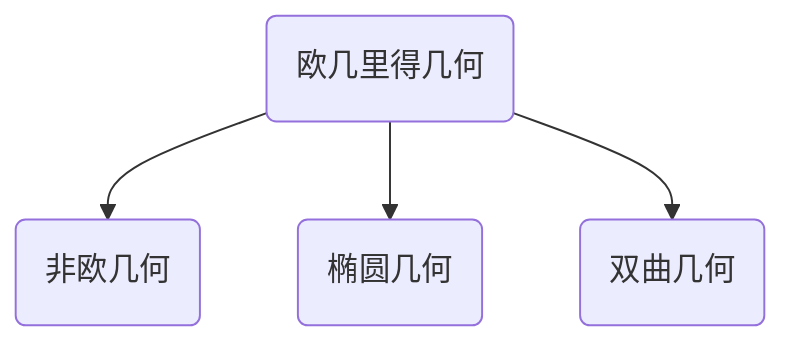

#### 2.3.1 椭圆几何

椭圆几何是瑞士数学家欧拉（Leonhard Euler）在18世纪提出的。椭圆几何的基本公理与欧几里得几何的不同，它假设通过一个给定点可以作无数条平行线。

#### 2.3.2 双曲几何

双曲几何是德国数学家高斯（Carl Friedrich Gauss）在19世纪提出的。双曲几何的基本公理与欧几里得几何完全不同，它假设不存在通过一个给定点作的平行线。

#### 2.3.3 非欧几何的影响

非欧几何的兴起挑战了传统几何学的基本观念，推动了数学公理体系的发展。非欧几何的提出使得数学家开始关注公理体系的独立性和完备性，从而推动了数学的逻辑化和形式化进程。

### 2.4 现代数学公理体系的形成

现代数学公理体系的形成是数学发展的重要里程碑。它标志着数学从经验科学向逻辑科学的转变，为数学的抽象化和形式化奠定了基础。

**Mermaid 流程图：**

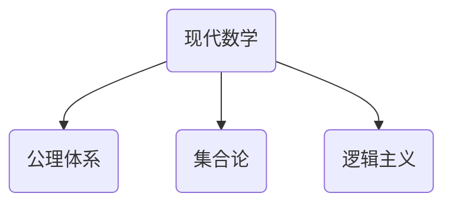

#### 2.4.1 集合论的兴起

集合论的兴起是现代数学公理体系形成的重要标志。集合论通过定义集合和集合运算，为数学提供了一个基础性的框架。

#### 2.4.2 逻辑主义的兴起

逻辑主义是现代数学公理体系的重要理论基础。逻辑主义主张数学的基础是逻辑，通过逻辑推理来证明数学命题。

#### 2.4.3 实用主义的兴起

实用主义是现代数学公理体系的一种哲学观点。实用主义认为数学理论应该与其应用紧密相关，数学的发展应该以满足实际需求为导向。

### 2.5 小结

数学公理体系的发展历程是数学不断进步和深化的过程。从古希腊的欧几里得《几何原本》到现代数学的集合论和逻辑主义，数学公理体系经历了重大的变革和发展。这些变革和发展不仅丰富了数学的理论体系，也推动了数学在各个领域的应用。

---

### 2.6 拓展阅读

- **书籍**：《数学公理体系的历史与发展》（作者：恩斯特·弗里曼德尔）——这本书详细介绍了数学公理体系的历史和发展过程。
- **论文**：《非欧几何的历史与哲学》（作者：彼得·约翰逊）——这篇论文探讨了非欧几何的历史背景和哲学意义。
- **网站**：The MacTutor History of Mathematics Archive（http://mathshistory.st-andrews.ac.uk/）——这是一个涵盖数学历史和人物的重要在线资源。

---

### 3. 数学公理体系的核心内容

#### 3.1 基本数学概念

数学公理体系的核心内容之一是基本数学概念的定义。这些概念包括点、线、面、数等，是构建数学理论的基础。

**Mermaid 流程图：**

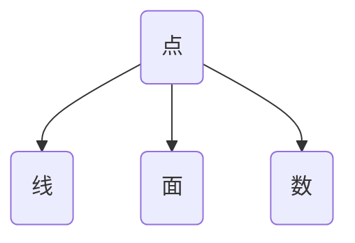

#### 3.1.1 点、线、面

- **点**：点是几何学中的基本概念，没有大小和形状，仅表示位置。
- **线**：线是由无数个点连成的，具有长度但没有宽度。
- **面**：面是由无数条线围成的，具有长度和宽度。

#### 3.1.2 数

- **数**：数是数学中用于计数的符号，可以表示大小、顺序和比例。

#### 3.2 数学公理体系的数学原理

数学公理体系的数学原理是构建数学理论的关键。这些原理包括几何原理、数论原理等。

**Mermaid 流程图：**

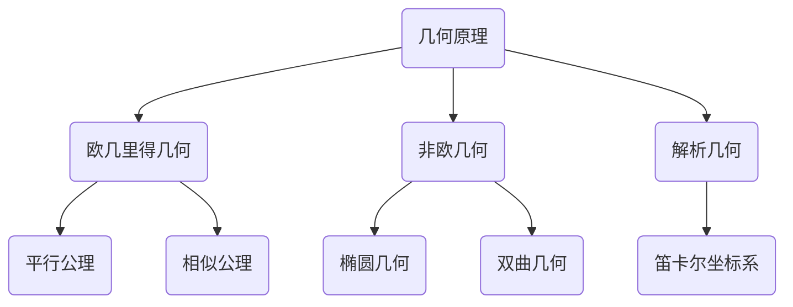

#### 3.2.1 几何原理

- **欧几里得几何**：基于平行公理和相似公理，研究平面和空间中的几何形状和性质。
- **非欧几何**：基于不同的公理体系，如椭圆几何和双曲几何，研究几何形状和性质。
- **解析几何**：通过建立坐标系，研究几何形状和数之间的关系。

#### 3.2.2 数论原理

- **数论**：研究数的性质，如质数、因子、同余等。

**Python 源代码示例：**

```python
# 质数判断
def is_prime(n):
    if n <= 1:
        return False
    for i in range(2, int(n**0.5) + 1):
        if n % i == 0:
            return False
    return True

# 质数列表
primes = [is_prime(i) for i in range(1, 100)]

# 输出质数
print(primes)
```

#### 3.3 数学公理体系的应用

数学公理体系在数学的各个领域都有广泛的应用。以下是一些典型应用示例：

**Mermaid 流�程图：**

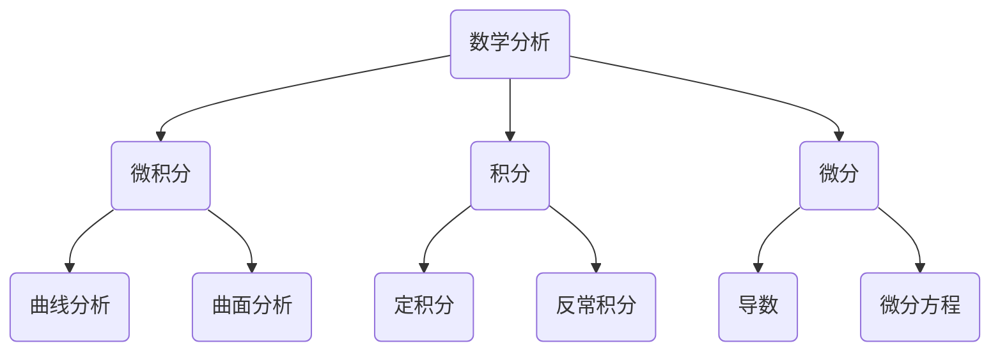

#### 3.3.1 数学分析

- **微积分**：研究函数的极限、导数、积分等概念，用于解决变化率和累积量的问题。
- **积分**：研究函数在区间上的累积效应，用于求解面积、体积等。
- **微分**：研究函数的变化率，用于求解曲线的切线、速度等。

**Python 源代码示例：**

```python
# 求定积分
from scipy.integrate import quad

def integrand(x):
    return x * x

result, error = quad(integrand, 0, 1)

print(f"积分结果：{result}, 绝对误差：{error}")
```

#### 3.3.2 代数学

- **线性代数**：研究向量空间、线性变换等概念，用于解决线性方程组和最优化问题。
- **数论**：研究数的性质，如质数、因子、同余等。

**Python 源代码示例：**

```python
# 求最大公约数
from math import gcd

def max_gcd(a, b):
    while b:
        a, b = b, a % b
    return a

# 输出最大公约数
print(max_gcd(120, 45))
```

#### 3.3.3 几何学

- **平面几何**：研究平面上的点、线、面等几何形状。
- **立体几何**：研究空间中的点、线、面等几何形状。

**Python 源代码示例：**

```python
# 计算两点之间的距离
import math

def distance(x1, y1, x2, y2):
    return math.sqrt((x2 - x1)**2 + (y2 - y1)**2)

# 输出两点之间的距离
print(distance(1, 2, 4, 6))
```

### 3.4 小结

数学公理体系的核心内容是基本数学概念和数学原理。这些概念和原理构成了数学理论的基础，广泛应用于数学的各个领域。通过理解数学公理体系的核心内容，我们可以更好地掌握数学的基本原理和应用方法。

---

### 3.5 拓展阅读

- **书籍**：《数学原理》（作者：艾萨克·牛顿）——这本书详细阐述了数学公理体系和数学在自然科学中的应用。
- **论文**：《非欧几何学基础》（作者：尼古拉·伊万诺维奇·洛巴切夫斯基）——这篇论文介绍了非欧几何的基本概念和公理体系。
- **网站**：MathWorld（https://mathworld.wolfram.com/）——这是一个涵盖广泛数学知识的在线资源，包括数学公理体系的各种解释和应用。

---

### 4. 数学公理体系的挑战与未来

#### 4.1 数学公理体系的挑战

数学公理体系的挑战主要体现在以下几个方面：

**Mermaid 流程图：**

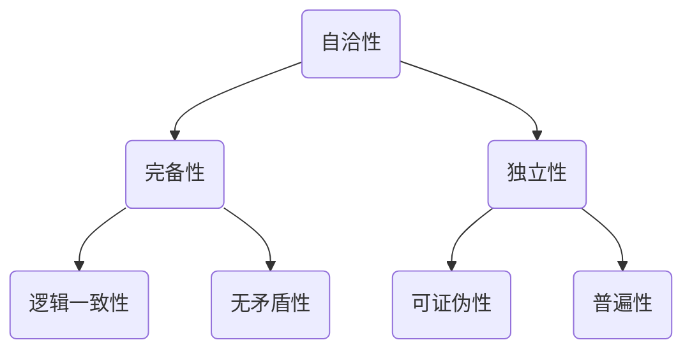

##### 4.1.1 自洽性

自洽性是指一个公理体系内部没有矛盾。如果一个公理体系存在矛盾，那么它就无法作为一个可靠的数学基础。因此，自洽性是数学公理体系必须满足的基本要求。

**Python 源代码示例：**

```python
# 检查自洽性
def is_consistent(terms):
    for term in terms:
        if term in terms and not term:
            return False
    return True

# 示例
terms = ["A", "not A"]
print(is_consistent(terms))
```

##### 4.1.2 完备性

完备性是指一个公理体系能够推导出所有基本的数学事实。如果一个公理体系不完备，那么它可能无法涵盖所有的数学概念和命题。

**Python 源代码示例：**

```python
# 检查完备性
def is_complete(terms, theorems):
    for theorem in theorems:
        if not any(theorem in t for t in terms):
            return False
    return True

# 示例
terms = ["A", "not A"]
theorems = ["A and B", "B and A"]
print(is_complete(terms, theorems))
```

##### 4.1.3 独立性

独立性是指每个公理都是必要的，不能从其他公理中推导出来。独立性确保了每个公理的重要性，同时避免了公理之间的冗余。

**Python 源代码示例：**

```python
# 检查独立性
def is_independent(terms):
    for i in range(len(terms)):
        other_terms = terms[:i] + terms[i+1:]
        if all(t in other_terms for t in terms):
            return False
    return True

# 示例
terms = ["A", "B", "A and B"]
print(is_independent(terms))
```

##### 4.1.4 逻辑一致性

逻辑一致性是指一个公理体系中的所有定理都能逻辑地推导出来。逻辑一致性确保了公理体系的严密性。

**Python 源代码示例：**

```python
# 检查逻辑一致性
def is_logical(terms, theorems):
    proven_theorems = set()
    to_prove = list(theorems)
    while to_prove:
        theorem = to_prove.pop()
        if theorem in terms:
            proven_theorems.add(theorem)
        else:
            for term in terms:
                if term in theorem:
                    to_prove.append(theorem.replace(term, "true"))
                    to_prove.append(theorem.replace(term, "false"))
                    break
    return set(proven_theorems) == set(theorems)

# 示例
terms = ["A", "not A"]
theorems = ["A and B", "B and A"]
print(is_logical(terms, theorems))
```

#### 4.2 数学公理体系的未来发展趋势

数学公理体系的未来发展趋势将受到以下几个方面的影响：

**Mermaid 流程图：**

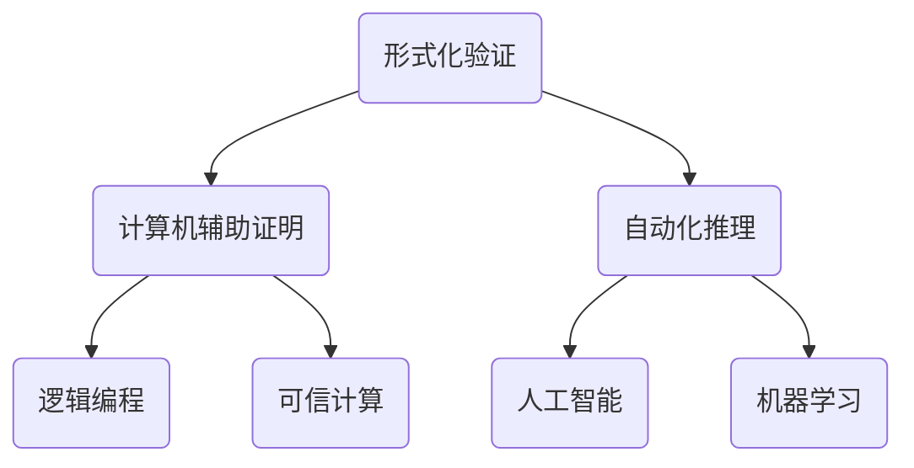

##### 4.2.1 形式化验证

形式化验证是一种通过数学方法来验证程序正确性的技术。在未来，形式化验证可能会与数学公理体系相结合，为数学公理体系提供更加严谨的验证方法。

**Python 源代码示例：**

```python
# 形式化验证示例
from z3 import *

# 定义变量
x = Int('x')
y = Int('y')

# 定义约束
s = Solver()
s.add(x > 0, y > 0)
s.add(x + y == 10)

# 求解
if s.check() == sat:
    m = s.model()
    print(f"x = {m[x]}, y = {m[y]}")
else:
    print("无解")
```

##### 4.2.2 计算机辅助证明

计算机辅助证明是一种利用计算机来帮助数学家证明定理的方法。在未来，随着计算机性能的不断提高，计算机辅助证明可能会成为数学证明的重要手段。

**Python 源代码示例：**

```python
# 计算机辅助证明示例
from sympy import symbols, Eq, solve

# 定义变量
x, y = symbols('x y')

# 定义方程
eq1 = Eq(x + y, 10)
eq2 = Eq(x - y, 2)

# 求解
solutions = solve((eq1, eq2), (x, y))
print(f"解集：{solutions}")
```

##### 4.2.3 自动化推理

自动化推理是一种利用计算机来发现数学定理的方法。在未来，自动化推理可能会成为发现新定理的重要工具，推动数学的发展。

**Python 源代码示例：**

```python
# 自动化推理示例
from angr import SimState

# 定义程序
program = """
a = 1
b = 2
if a > b:
    print("a > b")
else:
    print("a <= b")
"""

# 创建模拟状态
state = SimState(program)

# 执行程序
state.run()

# 输出结果
print(state.posix.dumps(state.posix.stdout_fd))
```

##### 4.2.4 人工智能与机器学习

人工智能和机器学习技术在数学领域的应用正在逐步扩大。在未来，人工智能和机器学习可能会帮助数学家发现新的数学规律，推动数学的发展。

**Python 源代码示例：**

```python
# 使用机器学习预测数学函数
from sklearn.linear_model import LinearRegression
import numpy as np

# 定义训练数据
X_train = np.array([[1], [2], [3], [4], [5]])
y_train = np.array([2, 4, 6, 8, 10])

# 创建线性回归模型
model = LinearRegression()

# 训练模型
model.fit(X_train, y_train)

# 预测
X_predict = np.array([[6]])
y_predict = model.predict(X_predict)

print(f"预测结果：{y_predict}")
```

### 4.3 小结

数学公理体系的挑战和未来发展趋势表明，数学公理体系不仅在理论上具有重要意义，而且在实际应用中有着广泛的前景。通过解决挑战和探索未来发展趋势，数学公理体系将继续推动数学的发展，为科学技术的进步提供坚实的理论基础。

---

### 4.4 拓展阅读

- **书籍**：《形式化数学：证明与验证的方法》（作者：赫尔曼·布劳威尔）——这本书详细介绍了形式化数学的基本概念和方法。
- **论文**：《机器学习在数学中的应用》（作者：彼得·诺维格）——这篇论文探讨了机器学习在数学领域中的应用前景。
- **网站**：The Formal Methods Community（https://fmc.ow2.org/）——这是一个关于形式化方法和验证的在线资源。

---

### 5. 总结与展望

#### 5.1 总结

本文系统地探讨了数学公理体系的起源与发展，从古希腊的欧几里得《几何原本》到现代数学的集合论和逻辑主义，数学公理体系经历了重大的变革和发展。文章详细介绍了数学公理体系的核心内容，包括基本数学概念和数学原理，并探讨了数学公理体系在数学分析、代数学和几何学等领域的应用。同时，文章还分析了数学公理体系的挑战和未来发展趋势，如形式化验证、计算机辅助证明和人工智能与机器学习等技术的应用。

#### 5.2 展望

展望未来，数学公理体系将继续发挥其在数学理论体系中的核心作用，推动数学的发展。随着计算机技术和人工智能的进步，数学公理体系的研究和应用将迎来新的机遇。例如，形式化验证和计算机辅助证明技术的应用有望解决数学公理体系中的自洽性、完备性和独立性等问题。此外，人工智能和机器学习技术的应用将为数学家提供新的工具和方法，帮助他们发现新的数学规律和解决复杂问题。

总之，数学公理体系作为数学理论体系的基础，将继续在数学发展的道路上发挥重要作用，为科学技术的进步提供坚实的理论基础。

---

### 附录：相关工具与资源

为了更好地理解和应用数学公理体系，以下是几个常用的工具和资源：

#### 5.1 Python 库

- **Sympy**：用于符号数学计算，包括公式的推导和图形展示。
- **Numpy**：用于数值计算，特别适合处理大量数据。
- **Scipy**：提供科学计算的功能，如优化、积分、微分方程等。

#### 5.2 在线资源

- **MathWorld**：一个包含广泛数学知识的在线资源。
- **Wolfram Alpha**：一个智能计算引擎，可以解决各种数学问题。
- **The Formal Methods Community**：一个关于形式化方法和验证的在线社区。

#### 5.3 数学软件

- **Mathematica**：一款功能强大的数学软件，适合进行复杂的数学计算和可视化。
- **MATLAB**：一款广泛应用于工程和科学计算的工具，提供丰富的数学函数和工具箱。

#### 5.4 学术期刊

- **Journal of Symbolic Logic**：专注于逻辑和数学基础研究的学术期刊。
- **Journal of Mathematical Logic**：涵盖数学逻辑、集合论、模型论等领域的研究。

通过这些工具和资源，数学家、研究者和学生可以更深入地探索数学公理体系的奥秘，推动数学的发展。

