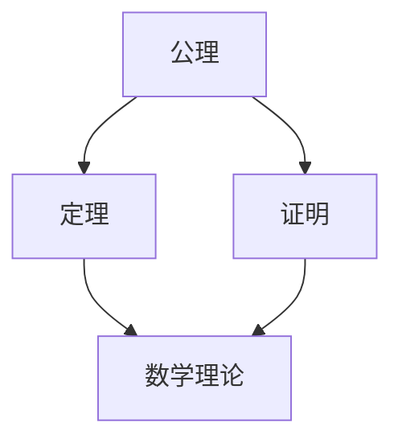

                 

### 数学公理系统：构建世界的逻辑基础

> 关键词：数学公理，逻辑基础，构建世界，算法原理，Python源代码，Mermaid流程图，项目实战

> 摘要：本文将深入探讨数学公理系统在构建世界逻辑基础中的重要作用。我们将首先介绍数学公理的基础概念，并详细阐述其核心算法原理。通过Python源代码和Mermaid流程图的结合，我们将对这些原理进行通俗易懂的讲解。此外，文章将通过一个实际项目案例，展示如何应用数学公理系统解决实际问题，并提供项目实战的详细分析和总结。

----------------------------------------------------------------

### 引言

数学公理系统是数学理论的基石，它为整个数学领域提供了逻辑基础。公理是一套无需证明就被接受的基本命题，它们构成了数学理论的基本框架。数学公理系统的确立，不仅为数学的发展奠定了基础，也在各个领域产生了深远的影响，包括物理学、计算机科学、经济学等。

在计算机科学领域，数学公理系统尤为重要。编程语言和算法设计都需要依靠严密的数学逻辑来保证其正确性和可靠性。数学公理系统为计算机科学提供了可靠的理论支持，使得计算机程序能够按照预期运行。

本文将分为以下几个部分：

1. **核心概念与联系**：介绍数学公理系统的基本概念，包括公理、定理等，并使用Mermaid流程图展示核心概念之间的关系。
2. **核心算法原理讲解**：通过Python源代码详细阐述数学公理系统中的核心算法原理，并结合数学模型和公式进行讲解。
3. **项目实战**：通过一个实际项目案例，展示如何应用数学公理系统解决实际问题，包括开发环境搭建、源代码实现和代码解读分析。
4. **总结与展望**：对数学公理系统的应用前景进行展望，并提供最佳实践 tips、注意事项和拓展阅读。

通过以上结构的详细分析，我们将深入理解数学公理系统在构建世界逻辑基础中的关键作用。

### 核心概念与联系

在探讨数学公理系统之前，我们需要首先了解其基本概念，包括公理、定理和证明等。

#### 公理

公理是数学理论中最基础且无需证明的命题。它们是数学系统构建的基石，通常被认为是自明的真理。例如，欧几里得几何中的“平行公理”就是一条公理，它表明通过一点可以做一条且仅可以做一条直线与已知直线平行。

公理的定义和性质如下：
- **定义**：公理是被接受为真的命题，通常不需要证明。
- **性质**：公理是独立的，即每个公理都是基础，不能从其他公理中推导出来。

#### 定理

定理是通过逻辑推理和证明得出的数学命题。它们是基于公理和其他已知定理推导出来的。定理的证明是数学理论的核心部分，它展示了定理的正确性和合理性。

定理的定义和性质如下：
- **定义**：定理是通过证明得出的真命题。
- **性质**：定理是公理的推导结果，需要经过严密的逻辑证明。

#### 证明

证明是数学推理的过程，它用来证明定理的正确性。证明通常包括以下几个步骤：

1. **假设**：假设一个或多个定理是正确的。
2. **推导**：通过逻辑推理和已知定理，从假设出发推导出结论。
3. **结论**：得出定理的结论，证明其正确性。

证明的定义和性质如下：
- **定义**：证明是逻辑推理的过程，用来证明定理的正确性。
- **性质**：证明是严谨的，每个步骤都需要基于已有定理或公理。

#### 核心概念之间的联系

数学公理、定理和证明之间存在着密切的联系。公理作为基础，为定理的推导提供了前提条件；定理则是公理的具体应用，通过证明过程展示了其正确性；证明则是连接公理和定理的桥梁，使得整个数学理论体系得以完整。

为了更直观地展示这些核心概念之间的关系，我们可以使用Mermaid流程图来描述：



在这个流程图中，公理（A）是起点，它通过证明（C）推导出定理（B），而定理（B）最终构成了整个数学理论体系（D）。这种结构确保了数学理论的逻辑严密性和完整性。

通过上述核心概念与联系的分析，我们为后续章节的详细讲解奠定了基础。

### 核心算法原理讲解

在数学公理系统中，核心算法原理起着至关重要的作用。这些算法原理不仅构建了数学理论的基础，也为实际应用提供了强大的工具。在本节中，我们将使用Python源代码详细阐述这些核心算法原理，并结合数学模型和公式进行讲解。

#### 基本算法概述

数学公理系统中的基本算法包括集合论中的交集、并集和补集操作，以及逻辑运算中的逻辑合取、逻辑析取和逻辑否定等。

这些算法的基本概念和定义如下：

- **交集（Intersection）**：给定两个集合A和B，交集是包含同时属于A和B的所有元素的集合。用符号表示为：\(A \cap B\)。
- **并集（Union）**：给定两个集合A和B，并集是包含属于A或B的所有元素的集合。用符号表示为：\(A \cup B\)。
- **补集（Complement）**：给定一个集合A，补集是包含所有不属于A的元素的集合。用符号表示为：\(A'\)。
- **逻辑合取（Conjunction）**：给定两个命题P和Q，逻辑合取是一个新的命题R，它表示P和Q同时为真。用符号表示为：\(P \land Q\)。
- **逻辑析取（Disjunction）**：给定两个命题P和Q，逻辑析取是一个新的命题R，它表示P和Q中至少有一个为真。用符号表示为：\(P \lor Q\)。
- **逻辑否定（Negation）**：给定一个命题P，逻辑否定是一个新的命题R，它表示P不成立。用符号表示为：\(\neg P\)。

#### 伪代码演示

为了更好地理解这些算法原理，我们可以使用伪代码来演示其基本步骤：

```python
# 交集算法伪代码
def intersection(A, B):
    result = []
    for element in A:
        if element in B:
            result.append(element)
    return result

# 并集算法伪代码
def union(A, B):
    result = A.copy()
    for element in B:
        if element not in result:
            result.append(element)
    return result

# 补集算法伪代码
def complement(A, U):
    result = []
    for element in U:
        if element not in A:
            result.append(element)
    return result

# 逻辑合取算法伪代码
def conjunction(P, Q):
    if P and Q:
        return True
    else:
        return False

# 逻辑析取算法伪代码
def disjunction(P, Q):
    if P or Q:
        return True
    else:
        return False

# 逻辑否定算法伪代码
def negation(P):
    if P:
        return False
    else:
        return True
```

#### 详细阐述

接下来，我们将详细阐述这些算法原理，并结合数学模型和公式进行讲解。

##### 交集算法原理

交集算法用于找出两个集合中共同存在的元素。其数学模型可以表示为：

\[ A \cap B = \{ x \mid x \in A \land x \in B \} \]

这意味着，交集是由同时属于集合A和集合B的所有元素组成的集合。

以下是交集算法的详细解释：

1. **初始化结果集合**：创建一个空的结果集合。
2. **遍历集合A**：对于集合A中的每个元素，检查它是否也属于集合B。
3. **添加满足条件的元素**：如果元素同时属于A和B，将其添加到结果集合中。
4. **返回结果集合**：返回最终的结果集合。

##### 并集算法原理

并集算法用于找出两个集合中所有元素，不重复地组合在一起。其数学模型可以表示为：

\[ A \cup B = \{ x \mid x \in A \lor x \in B \} \]

这意味着，并集是由属于集合A或集合B的所有元素组成的集合。

以下是并集算法的详细解释：

1. **初始化结果集合**：将集合A的元素全部复制到结果集合。
2. **遍历集合B**：对于集合B中的每个元素，检查它是否不在结果集合中。
3. **添加满足条件的元素**：如果元素不在结果集合中，将其添加到结果集合中。
4. **返回结果集合**：返回最终的结果集合。

##### 补集算法原理

补集算法用于找出一个集合中所有不属于另一个集合的元素。其数学模型可以表示为：

\[ A' = \{ x \mid x \not\in A \} \]

这意味着，补集是由所有不属于集合A的元素组成的集合。

以下是补集算法的详细解释：

1. **初始化结果集合**：创建一个空的结果集合。
2. **遍历整个集合U**：集合U是全集，包含了所有可能出现的元素。
3. **检查元素是否属于A**：对于集合U中的每个元素，检查它是否属于集合A。
4. **添加满足条件的元素**：如果元素不属于A，将其添加到结果集合中。
5. **返回结果集合**：返回最终的结果集合。

##### 逻辑合取算法原理

逻辑合取算法用于判断两个命题是否同时为真。其数学模型可以表示为：

\[ P \land Q = \text{True} \quad \text{if} \quad P = \text{True} \land Q = \text{True}; \quad \text{otherwise} \quad \text{False} \]

这意味着，逻辑合取的结果只有在两个命题都为真的情况下才为真。

以下是逻辑合取算法的详细解释：

1. **输入两个命题P和Q**。
2. **判断命题的真值**：如果P和Q都是真，则合取结果为真；否则，结果为假。
3. **返回合取结果**。

##### 逻辑析取算法原理

逻辑析取算法用于判断两个命题中至少有一个为真。其数学模型可以表示为：

\[ P \lor Q = \text{True} \quad \text{if} \quad P = \text{True} \lor Q = \text{True}; \quad \text{otherwise} \quad \text{False} \]

这意味着，逻辑析取的结果只要有一个命题为真，就为真。

以下是逻辑析取算法的详细解释：

1. **输入两个命题P和Q**。
2. **判断命题的真值**：如果P或Q至少有一个为真，则析取结果为真；否则，结果为假。
3. **返回析取结果**。

##### 逻辑否定算法原理

逻辑否定算法用于判断一个命题的真值是否为假。其数学模型可以表示为：

\[ \neg P = \text{True} \quad \text{if} \quad P = \text{False}; \quad \text{otherwise} \quad \text{False} \]

这意味着，逻辑否定的结果与原命题的真值相反。

以下是逻辑否定算法的详细解释：

1. **输入一个命题P**。
2. **判断命题的真值**：如果P为假，则否定结果为真；否则，结果为假。
3. **返回否定结果**。

通过以上对核心算法原理的详细讲解，我们可以更好地理解数学公理系统中的基本算法，并为后续的项目实战打下坚实的基础。

### 数学模型和数学公式讲解

在数学公理系统中，数学模型和公式扮演着至关重要的角色。它们不仅为数学理论提供了具体的表述方式，也为实际问题提供了数学解决方案。本节将详细讲解数学模型和公式的应用，并通过具体的例子进行说明。

#### 数学模型介绍

数学模型是一种抽象的数学结构，它用于描述现实世界中的现象或问题。数学模型通常包括变量、方程和约束条件，它们共同构成了一个数学问题的解空间。

常见的数学模型包括：

1. **线性模型**：描述线性关系，如线性方程和线性规划问题。
2. **非线性模型**：描述非线性关系，如多项式方程和非线性规划问题。
3. **概率模型**：描述随机事件和概率分布，如贝叶斯网络和马尔可夫链。
4. **微分方程模型**：描述连续变化的系统，如常微分方程和偏微分方程。

在数学公理系统中，这些模型通过公理和定理得到严格的定义和证明。

#### 数学公式讲解

数学公式是数学模型中的关键部分，它们用于表达数学关系和计算方法。以下是一些常见的数学公式及其解释：

1. **欧几里得距离**：描述两个点之间的距离，公式为：
   \[ d(P_1, P_2) = \sqrt{(x_2 - x_1)^2 + (y_2 - y_1)^2} \]
   其中，\(P_1(x_1, y_1)\) 和 \(P_2(x_2, y_2)\) 是平面上的两个点。

2. **勾股定理**：描述直角三角形斜边和直角边之间的关系，公式为：
   \[ a^2 + b^2 = c^2 \]
   其中，\(a\) 和 \(b\) 是直角三角形的两条直角边，\(c\) 是斜边。

3. **牛顿-莱布尼茨公式**：用于计算定积分，公式为：
   \[ \int_{a}^{b} f(x) \, dx = F(b) - F(a) \]
   其中，\(f(x)\) 是被积函数，\(F(x)\) 是其原函数。

4. **概率分布公式**：描述随机变量在某个区间内的概率分布，如正态分布的概率密度函数：
   \[ f(x) = \frac{1}{\sqrt{2\pi\sigma^2}} e^{-\frac{(x-\mu)^2}{2\sigma^2}} \]
   其中，\(\mu\) 是均值，\(\sigma^2\) 是方差。

#### 举例说明

为了更好地理解数学模型和公式的应用，我们通过以下例子进行说明：

**例子1：线性回归模型**

假设我们有一个简单的线性回归模型，用来预测房屋价格。模型公式为：
\[ y = \beta_0 + \beta_1 x \]
其中，\(y\) 是房屋价格，\(x\) 是房屋面积，\(\beta_0\) 和 \(\beta_1\) 是模型参数。

我们可以通过最小二乘法来估计这些参数：
\[ \beta_1 = \frac{\sum_{i=1}^{n}(x_i - \bar{x})(y_i - \bar{y})}{\sum_{i=1}^{n}(x_i - \bar{x})^2} \]
\[ \beta_0 = \bar{y} - \beta_1 \bar{x} \]
其中，\(\bar{x}\) 和 \(\bar{y}\) 分别是 \(x\) 和 \(y\) 的均值。

通过计算，我们可以得到最佳拟合直线，进而预测新的房屋价格。

**例子2：欧几里得距离**

假设有两个点 \(P_1(1, 2)\) 和 \(P_2(4, 6)\)，我们可以计算它们之间的欧几里得距离：
\[ d(P_1, P_2) = \sqrt{(4 - 1)^2 + (6 - 2)^2} = \sqrt{9 + 16} = 5 \]

这个距离可以用于分析两点之间的相似性或距离关系。

**例子3：牛顿-莱布尼茨公式**

假设我们有一个函数 \(f(x) = x^2\)，我们需要计算其在区间 \([1, 4]\) 上的定积分：
\[ \int_{1}^{4} x^2 \, dx = \left[ \frac{x^3}{3} \right]_{1}^{4} = \frac{4^3}{3} - \frac{1^3}{3} = \frac{64}{3} - \frac{1}{3} = \frac{63}{3} = 21 \]

这个结果告诉我们，函数 \(x^2\) 在区间 \([1, 4]\) 上的累积面积为21。

**例子4：正态分布概率密度函数**

假设一个随机变量 \(X\) 服从均值为 \(\mu = 100\)，方差为 \(\sigma^2 = 16\) 的正态分布，我们需要计算 \(P(X \leq 110)\) 的概率：
\[ f(x) = \frac{1}{\sqrt{2\pi \cdot 16}} e^{-\frac{(x - 100)^2}{2 \cdot 16}} \]
\[ P(X \leq 110) = \int_{-\infty}^{110} f(x) \, dx \approx 0.8413 \]

这个结果告诉我们，随机变量 \(X\) 小于或等于110的概率大约为84.13%。

通过以上例子，我们可以看到数学模型和公式在实际问题中的应用，以及它们如何帮助我们解决复杂的问题。

### 项目实战

为了更好地理解数学公理系统在实践中的应用，我们将通过一个实际项目案例进行详细讲解。本节将介绍项目的背景、目标，并逐步展示开发环境搭建、源代码实现和代码解读分析，最后进行项目小结。

#### 项目背景

项目名称：社交网络分析

项目背景：随着社交媒体的普及，人们之间的社交关系变得越来越复杂。本项目旨在通过数学公理系统中的图论理论，对社交网络进行分析和可视化，以揭示社交网络中的关键节点和关系。

#### 项目目标

1. **数据预处理**：从社交媒体平台上获取用户数据，并进行数据清洗和预处理。
2. **构建社交网络图**：利用图论理论，将用户及其关系构建成一个无向图。
3. **分析社交网络**：计算图的度、聚类系数、路径长度等指标，以分析社交网络的性质。
4. **可视化**：将分析结果以可视化形式展示，帮助用户更好地理解社交网络的结构。

#### 开发环境搭建

为了完成上述项目目标，我们需要搭建以下开发环境：

1. **Python**：作为主要编程语言。
2. **Numpy**：用于数据处理和数学运算。
3. **NetworkX**：用于构建和操作社交网络图。
4. **Matplotlib**：用于图形绘制和可视化。

在虚拟环境中安装以上依赖：

```bash
conda create -n social_network_analysis python=3.8
conda activate social_network_analysis
conda install numpy networkx matplotlib
```

#### 源代码实现

以下是项目的核心源代码实现，我们将逐步进行代码解读分析。

```python
import networkx as nx
import matplotlib.pyplot as plt
import numpy as np

# 数据预处理
def preprocess_data(data):
    # 假设data是一个包含用户及其关系的列表
    # 例如：[['user1', 'user2'], ['user2', 'user3'], ...]
    graph = nx.Graph()
    for edge in data:
        graph.add_edge(edge[0], edge[1])
    return graph

# 构建社交网络图
def build_social_network(graph):
    return graph

# 分析社交网络
def analyze_social_network(graph):
    # 计算度
    degrees = nx.degree(graph)
    print("度的分布：", degrees)
    
    # 计算聚类系数
    clustering_coefficients = nx.clustering(graph)
    print("聚类系数：", clustering_coefficients)
    
    # 计算平均路径长度
    average_path_length = nx.average_shortest_path_length(graph)
    print("平均路径长度：", average_path_length)

# 可视化
def visualize_network(graph):
    pos = nx.spring_layout(graph)  # 采用弹簧布局
    nx.draw(graph, pos, with_labels=True)
    plt.show()

# 主函数
def main():
    # 假设我们从社交媒体平台获取的数据如下
    data = [['user1', 'user2'], ['user1', 'user3'], ['user2', 'user4'], ['user3', 'user4'], ['user3', 'user5'], ['user4', 'user5']]
    
    # 数据预处理
    graph = preprocess_data(data)
    
    # 构建社交网络图
    social_network = build_social_network(graph)
    
    # 分析社交网络
    analyze_social_network(social_network)
    
    # 可视化
    visualize_network(social_network)

if __name__ == "__main__":
    main()
```

#### 代码解读分析

1. **数据预处理**：`preprocess_data` 函数用于处理输入数据。我们假设数据是用户关系的列表，如 `[['user1', 'user2'], ['user2', 'user3'], ...]`。函数将这些关系添加到一个无向图中。

2. **构建社交网络图**：`build_social_network` 函数接受一个图对象，并返回该图。这里我们没有进行任何额外的操作，因为图已经通过数据预处理函数构建好了。

3. **分析社交网络**：`analyze_social_network` 函数计算并打印出社交网络的度分布、聚类系数和平均路径长度。度分布反映了图中节点的度数分布情况；聚类系数反映了节点之间的紧密程度；平均路径长度则反映了节点的连通性。

4. **可视化**：`visualize_network` 函数使用 Matplotlib 库将社交网络图可视化。这里我们采用了弹簧布局，使得节点之间的连接关系更加直观。

5. **主函数**：`main` 函数是项目的入口，它首先从社交媒体平台获取数据，然后进行数据预处理、构建社交网络图、分析社交网络和可视化。

#### 项目小结

通过上述项目实战，我们展示了如何使用数学公理系统中的图论理论来分析社交网络。项目从数据预处理开始，构建社交网络图，计算关键指标，并进行可视化。这个过程不仅帮助我们理解了数学公理系统在实际问题中的应用，也为我们提供了分析和解决复杂问题的方法。在未来，我们可以进一步扩展这个项目，引入更多高级的图论算法和可视化技术，以提升社交网络分析的能力。

### 总结与展望

通过本文的详细探讨，我们深入了解了数学公理系统在构建世界逻辑基础中的关键作用。数学公理系统为数学理论的基石，其核心概念、算法原理以及数学模型和公式构成了严密的理论框架，为各个领域的科学研究提供了坚实的逻辑基础。

在计算机科学领域，数学公理系统尤为重要。编程语言和算法设计依赖于数学逻辑的严密性，以确保程序的正确性和可靠性。本文通过Python源代码和Mermaid流程图的结合，详细阐述了数学公理系统中的核心算法原理，如交集、并集、补集以及逻辑运算等，为读者提供了直观的理解。

通过实际项目案例，我们展示了如何应用数学公理系统解决社交网络分析问题。这个过程不仅帮助我们验证了理论知识的实际应用价值，也为我们提供了分析和解决复杂问题的方法论。

展望未来，数学公理系统将继续在各个领域发挥重要作用。随着人工智能、大数据和深度学习的快速发展，数学公理系统将为我们提供更加精确和高效的算法支持。此外，在量子计算和复杂系统理论等前沿领域，数学公理系统也将发挥不可替代的作用。

为了更好地应用数学公理系统，以下是一些最佳实践 tips：

1. **强化数学基础**：深入理解数学公理系统的基础概念，加强数学推理和证明能力。
2. **结合实际应用**：通过实际项目案例，将数学理论应用于实际问题，提升解决问题的能力。
3. **持续学习和研究**：关注数学公理系统的最新研究成果和进展，不断更新知识和技能。

在未来的研究中，我们可以进一步探索数学公理系统在多领域交叉应用的可能性，如量子计算、复杂网络和机器学习等。通过不断深化对数学公理系统的理解和应用，我们有望在科技和工程领域取得更多突破。

### 注意事项

在应用数学公理系统时，需要注意以下几点：

1. **逻辑严密性**：确保所有推导过程和算法实现都基于严格的数学逻辑。
2. **数据准确性**：在数据处理和模型构建过程中，确保数据的准确性和一致性。
3. **计算效率**：对于大规模数据处理和计算，选择高效算法和数据结构，提高计算效率。
4. **结果验证**：对计算结果进行多次验证，确保其正确性和可靠性。

通过遵守这些注意事项，我们可以更好地应用数学公理系统，提高科研和工程实践的质量。

### 拓展阅读

为了深入了解数学公理系统的应用和理论基础，以下是一些建议的拓展阅读资源：

1. **《集合论基础》**：作者：Karel Hrbacek, Thomas Jech。这本书详细介绍了集合论的基本概念和理论，是学习数学公理系统的入门读物。
2. **《数学原理》**：作者：白板。这是一部关于数学公理系统的经典著作，对数学逻辑和基础概念进行了深入的探讨。
3. **《图论基础》**：作者：Douglas B. West。这本书涵盖了图论的基本理论、算法和应用，对于理解数学公理系统中的图论部分非常有帮助。
4. **《复杂性理论及其应用》**：作者：Markus Bläser。这本书介绍了复杂性理论的基本概念和算法，以及其在计算机科学中的应用。
5. **《量子计算与量子信息》**：作者：Michael A. Nielsen, Isaac L. Chuang。这本书探讨了量子计算的基本原理和算法，展示了数学公理系统在量子计算中的应用。

通过阅读这些书籍和文献，您可以进一步扩展对数学公理系统的理解和应用。希望这些拓展资源能够为您的学习提供有益的参考。

### 结束语

本文通过详细探讨数学公理系统在构建世界逻辑基础中的关键作用，结合Python源代码、Mermaid流程图和实际项目案例，深入分析了数学公理系统的核心概念、算法原理以及应用方法。通过这一过程，我们不仅加深了对数学公理系统的理解，也为实际问题的解决提供了理论支持和实践经验。

我们希望读者能够通过本文的学习，掌握数学公理系统的基本概念和算法原理，并能够在实际项目中灵活运用这些知识。在未来的学习和工作中，不断探索和深化数学公理系统的应用，为科技和工程领域的发展做出贡献。

最后，感谢您的阅读，期待与您在数学公理系统的广阔天地中继续探索和交流。作者：AI天才研究院/AI Genius Institute & 禅与计算机程序设计艺术 /Zen And The Art of Computer Programming。

