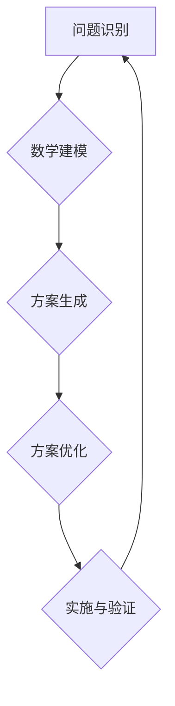

                 

# 《数学创造力：创新过程的数学模型》

### 关键词
- 数学创造力
- 创新过程
- 数学模型
- 创新思维
- 数学应用

### 摘要

本文探讨了数学创造力在创新过程中的重要性和作用，提出了创新过程的数学模型。文章首先介绍了数学创造力的概念及其在科学研究和实际应用中的意义。接着，分析了创新过程的数学模型，从问题识别、方案生成和方案优化三个阶段阐述了数学模型的应用。此外，本文还探讨了数学模型与创造力的相互影响，并通过具体案例展示了数学模型在创新实践中的应用。最后，文章提出了数学创造力培养的策略和实践方法，为提升创新能力和数学创造力提供了参考。

## 目录大纲

### 第1章 引言
#### 1.1 数学创造力的概念与意义
#### 1.2 创新过程的数学模型研究现状
#### 1.3 本书的结构与内容安排

### 第2章 数学创造力基础
#### 2.1 数学思维与创造性思维
##### 2.1.1 数学思维的特点
##### 2.1.2 创造性思维的方法
#### 2.2 数学模型的基本概念
##### 2.2.1 数学模型的结构
##### 2.2.2 数学模型的应用领域

### 第3章 创新过程的数学建模
#### 3.1 创新过程的模型框架
##### 3.1.1 创新过程的阶段划分
##### 3.1.2 创新过程的影响因素
#### 3.2 创新过程中数学模型的应用
##### 3.2.1 数学模型在问题识别阶段的应用
##### 3.2.2 数学模型在方案生成阶段的应用
##### 3.2.3 数学模型在方案优化阶段的应用

### 第4章 数学模型与创造力
#### 4.1 数学模型对创造力的影响
##### 4.1.1 数学模型对问题解决的影响
##### 4.1.2 数学模型对方案生成的影响
#### 4.2 创造力对数学模型的影响
##### 4.2.1 创造力对数学模型构建的影响
##### 4.2.2 创造力对数学模型应用的影响

### 第5章 创新过程的数学建模案例
#### 5.1 创新过程的数学建模案例分析
##### 5.1.1 案例一：人工智能的数学建模
##### 5.1.2 案例二：新能源技术的数学建模
##### 5.1.3 案例三：医学诊断的数学建模

### 第6章 数学创造力培养策略
#### 6.1 数学创造力培养的方法
##### 6.1.1 数学思维训练
##### 6.1.2 创造性思维培养
#### 6.2 数学创造力培养的实践策略
##### 6.2.1 学校教育中的数学创造力培养
##### 6.2.2 社会实践中的数学创造力培养

### 第7章 总结与展望
#### 7.1 总结
##### 7.1.1 数学创造力研究的现状与进展
##### 7.1.2 数学创造力研究的未来方向
#### 7.2 展望
##### 7.2.1 数学创造力在创新领域的发展前景
##### 7.2.2 数学创造力在其他领域的发展潜力

### 附录
#### A.1 创新过程的数学模型 Mermaid 流程图
#### A.2 创新过程中核心算法的伪代码讲解
#### A.3 创新过程中数学模型的应用举例说明
#### A.4 创新过程数学模型开发环境搭建指南
#### A.5 创新过程数学模型代码实现与解读
#### A.6 创新过程数学模型案例分析详细解读

## 第1章 引言

### 1.1 数学创造力的概念与意义

数学创造力是指运用数学知识和思维方式，通过独立思考和创新方法，解决实际问题或提出新理论、新模型的能力。它不仅体现在数学研究、理论研究等领域，还广泛应用于工程、经济、医学、社会学等各个领域。

在科学研究中，数学创造力有助于发现新的规律、提出新的假设，从而推动科学进步。例如，爱因斯坦的相对论就是基于数学创造力提出的，它深刻地改变了人类对宇宙的理解。在工程实践中，数学创造力可以帮助工程师解决复杂问题、优化设计，提高工作效率。例如，在建筑领域，通过数学建模和优化，可以设计出更加安全、节能、美观的建筑。

数学创造力不仅是一种能力，更是一种思维方式。它强调逻辑思维、抽象思维、批判性思维等能力的综合运用。数学创造力的培养，有助于提高个人的创新能力和解决问题的能力，进而推动社会的进步和发展。

### 1.2 创新过程的数学模型研究现状

近年来，随着数学建模技术的不断发展，越来越多的学者开始关注创新过程中的数学模型研究。数学模型作为一种有效的工具，可以帮助我们理解和分析创新过程，提高创新效率。

目前，关于创新过程的数学模型研究主要从以下几个方面展开：

1. 创新阶段的划分：学者们提出了多种创新过程模型，如线性模型、非线性模型、迭代模型等，用以描述创新过程的不同阶段，以及各阶段之间的相互作用。

2. 创新过程的驱动因素：数学模型被用来分析影响创新过程的各种因素，如技术、市场、政策等。通过建立数学模型，可以更好地理解这些因素如何共同作用，推动创新的发展。

3. 创新成果的评价：数学模型被用来评价创新成果的质量和效益。例如，通过建立经济模型，可以预测创新项目未来的经济效益；通过建立社会模型，可以评估创新项目对社会的贡献。

尽管创新过程的数学模型研究已经取得了一定的成果，但仍存在一些挑战。首先，创新过程本身具有复杂性和不确定性，这使得建立准确的数学模型变得困难。其次，如何将数学模型有效地应用于实际创新过程，还需要进一步研究。此外，数学模型的复杂性和计算量，也限制了其在实际应用中的广泛推广。

### 1.3 本书的结构与内容安排

本书旨在深入探讨数学创造力在创新过程中的作用，并提出创新过程的数学模型。全书分为七个章节：

- 第1章：引言，介绍数学创造力的概念与意义，以及创新过程的数学模型研究现状。

- 第2章：数学创造力基础，分析数学思维与创造性思维的关系，阐述数学模型的基本概念。

- 第3章：创新过程的数学建模，介绍创新过程的模型框架，阐述数学模型在创新过程中的应用。

- 第4章：数学模型与创造力，探讨数学模型对创造力的影响，以及创造力对数学模型的影响。

- 第5章：创新过程的数学建模案例，通过具体案例分析，展示数学模型在创新过程中的应用。

- 第6章：数学创造力培养策略，提出数学创造力培养的方法和实践策略。

- 第7章：总结与展望，对全书内容进行总结，并对数学创造力研究的未来方向进行展望。

通过本书的探讨，我们希望能够为读者提供对数学创造力及其在创新过程中应用的深入理解，为实际工作中的数学建模和创新提供参考。

### 1.4 数学创造力与数学模型的关系

数学创造力和数学模型之间存在着密切的联系。首先，数学创造力是数学模型的基础，数学模型是数学创造力的体现。数学创造力促使数学家们探索新的数学理论和模型，而数学模型则为数学家们提供了分析和解决问题的工具。

在创新过程中，数学创造力起到了关键作用。通过运用数学创造力，数学家们能够发现新的数学规律和定理，提出新的数学模型。这些新的模型不仅可以解决实际问题，还可以推动数学学科的发展。例如，牛顿的微积分理论就是在数学创造力的推动下诞生的，它为物理学和工程学的发展奠定了基础。

数学模型则是数学创造力的具体应用。在创新过程中，数学模型被用来分析和解决各种复杂问题。通过建立数学模型，创新者可以更好地理解问题的本质，找到问题的解决方案。数学模型在创新过程中的应用范围广泛，包括科学研究、工程实践、经济管理、医学诊断等。

数学模型与数学创造力之间也存在相互影响。数学模型的应用可以激发数学创造力，促进新的数学理论和模型的产生。同时，数学创造力也可以推动数学模型的发展，使其更加完善和精确。例如，在现代计算机科学中，数学模型的广泛应用激发了数学家们对离散数学、概率论、优化理论等领域的深入研究，推动了数学模型的理论发展和应用创新。

总之，数学创造力和数学模型之间是相辅相成的。数学创造力是创新过程中不可或缺的一部分，而数学模型则是数学创造力的具体体现和工具。通过深入研究和应用数学模型，我们可以更好地发挥数学创造力，推动科学技术的进步和社会的发展。

### 1.5 数学创造力的重要性

数学创造力的重要性不容忽视，它不仅在科学研究中发挥着核心作用，还在工程实践、经济管理、医学诊断等领域具有广泛的应用价值。

在科学研究中，数学创造力是发现新知识、提出新理论的关键。通过数学创造力的运用，科学家们能够从复杂的实验数据中发现潜在的规律，提出新的假设。例如，爱因斯坦的广义相对论就是基于他对数学创造力的运用，提出了时空弯曲的概念，从而揭示了引力与加速度之间的等效性。

在工程实践中，数学创造力是解决复杂问题、优化设计的重要手段。工程师们通过运用数学模型和算法，能够对复杂系统进行建模和仿真，预测其行为，从而优化设计方案。例如，在航空航天领域，通过数学建模和优化，可以设计出更加高效、安全的飞行器。

在经济管理中，数学创造力是制定策略、优化决策的重要工具。通过运用数学模型，企业可以分析市场需求、预测经济趋势，从而制定更加有效的营销策略和投资决策。例如，现代金融领域的风险管理和投资组合优化，就是基于数学模型和算法的应用。

在医学诊断中，数学创造力是提高诊断准确率、优化治疗方案的关键。通过建立数学模型，医生可以更好地理解疾病的发展规律，预测患者的病情变化，从而制定更加有效的治疗方案。例如，在癌症诊断中，通过数学建模和图像分析，可以更准确地检测出肿瘤的位置和大小，从而提高手术和放疗的准确性。

总之，数学创造力在各个领域都有着重要的应用价值。它不仅推动了科学技术的进步，还提高了人们的生活质量。通过培养和发挥数学创造力，我们可以更好地解决实际问题，推动社会的发展。

## 第2章 数学创造力基础

### 2.1 数学思维与创造性思维

数学思维和创造性思维是数学创造力的核心组成部分，两者相互促进，共同推动数学创新的发展。

#### 2.1.1 数学思维的特点

数学思维具有以下特点：

1. **逻辑性**：数学思维强调逻辑推理，要求从已知事实出发，通过严谨的推理过程得出结论。这种逻辑性使得数学思维在解决复杂问题时能够保持清晰和连贯。

2. **抽象性**：数学思维善于从具体事物中抽象出一般规律和模型。这种抽象能力使得数学家能够将复杂的现实问题转化为简单的数学问题，从而更有效地进行分析和解决。

3. **严谨性**：数学思维强调证明和验证，要求对每一个结论进行严格的数学证明。这种严谨性确保了数学理论的可靠性和准确性。

4. **系统性**：数学思维注重整体性和系统性，要求将各个部分和要素有机地联系起来，形成一个完整的理论体系。

#### 2.1.2 创造性思维的方法

创造性思维是指通过独立思考和创新方法，产生新的想法、概念或解决方案的能力。以下是一些常用的创造性思维方法：

1. **头脑风暴**：头脑风暴是一种集体创造性思维方法，通过快速提出各种想法，不进行评判，激发思维活力。

2. **类比思维**：类比思维是通过将一个领域的知识应用到另一个领域，发现相似之处，从而产生创新思路。

3. **分合法**：分合法是将不同的元素或概念组合在一起，创造出新的组合，从而产生创新。

4. **反向思维**：反向思维是从相反的角度思考问题，通过反其道而行之，找到新的解决方案。

5. **多角度思维**：多角度思维是指从不同的角度、层面和维度思考问题，寻找创新的解决方案。

#### 2.1.3 数学思维与创造性思维的结合

数学思维和创造性思维的结合是数学创造力的重要体现。数学思维为创造性思维提供了严谨的基础，而创造性思维则为数学思维注入了新的活力。

在数学研究中，数学家们通过创造性思维提出新的数学问题，通过数学思维进行深入研究和证明。例如，在代数学中，数学家们通过创造性思维提出了群论、环论等新的数学结构，然后通过数学思维对这些结构进行深入研究和证明，从而推动了代数学的发展。

在工程实践中，工程师们通过创造性思维提出新的设计方案，通过数学思维进行建模和优化，从而提高设计效率和效果。例如，在航空航天领域，工程师们通过创造性思维提出新的飞行器设计，然后通过数学建模和仿真，优化飞行性能和安全性。

总之，数学思维和创造性思维的结合是数学创造力的源泉，通过两者相互促进，我们可以更好地发挥数学创造力，推动科学技术的进步和社会的发展。

### 2.2 数学模型的基本概念

数学模型是数学创造力的具体体现，它通过将现实世界中的问题转化为数学形式，使得问题的解决更加直观和高效。以下是对数学模型的基本概念的详细介绍。

#### 2.2.1 数学模型的结构

数学模型通常由以下部分组成：

1. **变量**：变量是数学模型中的基本元素，用来表示问题中的未知量或可变因素。

2. **参数**：参数是数学模型中的固定值，通常通过实验或统计数据确定。参数用于描述问题的固有属性。

3. **方程**：方程是数学模型中的核心，它将变量和参数之间的关系表达出来。方程可以是线性方程、非线性方程、微分方程等。

4. **约束条件**：约束条件是数学模型中的限制条件，用来描述问题中的限制因素，如资源限制、物理定律等。

5. **目标函数**：目标函数是数学模型中的优化目标，用来衡量问题的解的优劣。目标函数可以是最大化或最小化某个指标，如成本、时间、质量等。

#### 2.2.2 数学模型的应用领域

数学模型在各个领域都有广泛的应用，以下是一些主要的应用领域：

1. **自然科学**：数学模型在物理学、化学、生物学等自然科学领域被广泛用于描述自然现象和过程。例如，牛顿运动定律、热力学方程等都是经典的数学模型。

2. **工程技术**：数学模型在工程领域中用于优化设计、仿真分析和系统控制。例如，结构力学中的有限元模型、电子工程中的电路模型等。

3. **经济学与管理学**：数学模型在经济学和管理学中用于预测市场趋势、优化资源配置和制定策略。例如，经济模型中的供需模型、优化模型中的线性规划等。

4. **社会学**：数学模型在社会学中用于分析社会行为和社会结构。例如，社会网络分析中的图论模型、人口统计模型等。

5. **医学**：数学模型在医学领域中用于诊断、治疗和药物开发。例如，医学图像分析中的模型、生物分子动力学模型等。

总之，数学模型作为一种工具，通过将现实问题转化为数学形式，为各个领域的研究和实践提供了有力的支持。通过理解和应用数学模型，我们可以更好地理解和解决复杂问题，推动科学技术的进步和社会的发展。

### 2.3 数学模型的构建过程

构建数学模型是一个复杂而富有创造性的过程，它涉及多个步骤和策略。以下是对构建数学模型过程的详细介绍。

#### 2.3.1 确定问题

首先，明确要解决的问题是什么。这需要深入理解问题的背景、目标以及关键因素。例如，在工程领域，可能是一个结构设计的优化问题；在经济学中，可能是一个市场预测问题。

#### 2.3.2 收集数据

收集与问题相关的数据，这些数据可以是实验数据、历史数据、统计数据等。数据的准确性和完整性对数学模型的构建至关重要。

#### 2.3.3 确定变量和参数

根据问题，确定模型中的变量和参数。变量是模型中的可变因素，而参数是模型中的固定值。例如，在优化设计中，变量可能是结构尺寸，参数可能是材料强度。

#### 2.3.4 建立方程

根据变量和参数之间的关系，建立数学方程。这些方程可以描述问题中的物理、化学或经济规律。方程的类型和形式取决于问题的性质。

#### 2.3.5 确定约束条件

定义模型中的约束条件，这些条件可以是物理定律、资源限制或特定要求。约束条件用于限制模型的解空间，确保解的可行性和合理性。

#### 2.3.6 目标函数

定义模型的目标函数，这是模型优化的核心。目标函数用于衡量模型解的优劣，可以是最大化或最小化的某个指标，如成本、时间、质量等。

#### 2.3.7 优化方法

选择合适的优化方法，如线性规划、非线性规划、动态规划等，对模型进行求解。优化方法的选择取决于问题的性质和约束条件。

#### 2.3.8 验证和调整

对构建的数学模型进行验证，确保其合理性和准确性。如果模型不满足预期，需要调整模型的结构、参数或目标函数，直到获得满意的解。

总之，构建数学模型是一个系统化的过程，需要综合运用数学、统计学、工程学等多方面的知识。通过合理的步骤和策略，我们可以构建出有效的数学模型，为问题的解决提供有力支持。

### 2.4 数学模型在创新过程中的应用

数学模型在创新过程中发挥着关键作用，它不仅为问题的分析和解决提供了工具，还推动了创新的进程和效果。以下从问题识别、方案生成和方案优化三个阶段，详细阐述数学模型在创新过程中的应用。

#### 2.4.1 问题识别阶段

在问题识别阶段，数学模型有助于明确问题的本质和关键因素。通过建立数学模型，可以量化问题的各个方面，使得问题的复杂性和不确定性降低，从而更准确地识别问题。

1. **量化问题**：数学模型可以将问题转化为数学形式，用变量和方程来表示。例如，在工程问题中，可以用数学模型描述结构的应力分布，识别潜在的失效风险。

2. **分析影响因素**：数学模型可以分析问题中的各种影响因素，明确哪些因素对问题的影响最大。通过敏感性分析，可以确定哪些因素是关键因素，从而为后续的方案设计提供依据。

3. **预测趋势**：数学模型可以预测问题的未来趋势和变化，为问题的解决提供前瞻性指导。例如，在市场分析中，可以通过数学模型预测市场需求的变化，为产品设计和营销策略提供参考。

#### 2.4.2 方案生成阶段

在方案生成阶段，数学模型可以帮助创新者生成各种可能的解决方案。通过优化算法和模拟技术，可以快速筛选和评估各种方案，从而提高创新的效率和质量。

1. **方案生成**：数学模型可以通过优化算法生成多种可能的方案。例如，在工程设计中，可以使用数学模型生成多种不同的结构设计方案，通过比较分析，选择最优方案。

2. **方案评估**：数学模型可以对生成的方案进行评估，从多个维度（如成本、时间、质量等）进行比较和评价。通过建立目标函数和约束条件，可以量化方案的效果，从而选择最优方案。

3. **模拟与仿真**：数学模型可以模拟和仿真的方式，对方案进行测试和验证。通过模拟不同条件下的方案表现，可以发现潜在的问题和不足，为方案优化提供参考。

#### 2.4.3 方案优化阶段

在方案优化阶段，数学模型用于对选定的方案进行进一步优化，以实现更好的性能和效果。通过调整模型中的参数和目标函数，可以逐步改进方案，使其达到最优状态。

1. **参数调整**：数学模型中的参数通常反映了问题的具体特性，通过调整参数，可以优化方案的表现。例如，在优化设计中，通过调整结构参数，可以改善结构的强度和稳定性。

2. **目标函数优化**：数学模型中的目标函数用于衡量方案的效果，通过优化目标函数，可以改善方案的整体性能。例如，在成本优化中，通过优化目标函数，可以降低成本而不影响质量。

3. **多目标优化**：在多目标优化中，数学模型需要同时考虑多个目标，例如成本、时间和质量。通过建立多目标优化模型，可以找到多个目标之间的平衡点，实现整体最优。

总之，数学模型在创新过程中的应用贯穿了问题识别、方案生成和方案优化的各个阶段。通过数学模型的分析、模拟和优化，创新者可以更好地理解和解决复杂问题，提高创新效率和质量。

### 2.5 数学模型在创新过程中的挑战与解决策略

尽管数学模型在创新过程中具有显著优势，但在实际应用中仍面临一系列挑战。以下将探讨这些挑战，并提出相应的解决策略。

#### 2.5.1 数据质量与准确性

数学模型依赖于数据的准确性，数据质量直接影响到模型的有效性和可靠性。在创新过程中，数据往往来自于实验、调查、历史记录等，可能存在误差和不完整性。

**解决策略：**
1. **数据清洗**：对数据进行清洗和预处理，去除重复、异常和噪声数据，提高数据的准确性和一致性。
2. **数据融合**：结合多种数据源，通过数据融合技术，整合不同来源的数据，提高数据的全面性和准确性。
3. **数据校验**：建立数据校验机制，对数据进行多次验证和交叉检查，确保数据的可靠性。

#### 2.5.2 模型复杂性与可解释性

数学模型在解决复杂问题时，可能涉及大量的变量和复杂的方程，这使得模型变得难以理解和解释。在创新过程中，模型的可解释性对于决策者和实际应用至关重要。

**解决策略：**
1. **简化模型**：通过降维、分解等方法，简化数学模型的结构，降低复杂性，同时保留关键信息。
2. **可视化技术**：运用可视化技术，将复杂的数学模型转化为直观的图形或图表，帮助用户更好地理解和解释模型。
3. **模型验证**：通过实际案例验证模型的预测能力和准确性，确保模型的有效性和可靠性。

#### 2.5.3 计算资源与计算效率

大型数学模型的计算过程可能需要大量的计算资源和时间，这限制了其在创新过程中的应用范围。特别是在实时决策和动态优化中，计算效率成为关键因素。

**解决策略：**
1. **并行计算**：运用并行计算技术，将计算任务分布在多个处理器或计算节点上，提高计算速度和效率。
2. **优化算法**：选择高效的优化算法，减少计算量，提高计算速度。
3. **云计算**：利用云计算平台，通过分布式计算和资源调度，提高计算效率和灵活性。

#### 2.5.4 模型适应性

创新过程往往涉及多种不确定因素，数学模型需要能够适应这些变化，以保持其有效性和灵活性。

**解决策略：**
1. **自适应模型**：构建自适应模型，通过实时数据反馈和调整，使模型能够适应环境变化。
2. **模型评估与修正**：定期对模型进行评估和修正，根据新的数据和实际结果，调整模型参数和结构，提高模型的适应性。
3. **混合模型**：结合多种模型方法，构建混合模型，以充分利用各种模型的优势，提高适应性。

总之，面对数学模型在创新过程中的挑战，通过合理的解决策略，可以克服这些问题，提高模型的准确性、可解释性和计算效率，从而更好地支持创新过程，推动科学技术的进步。

### 第3章 创新过程的数学建模

#### 3.1 创新过程的模型框架

创新过程是一个复杂且动态的系统，为了更好地理解和分析创新过程，我们可以将其划分为若干阶段，并建立相应的数学模型。以下是创新过程的基本模型框架及其各个阶段：

##### 3.1.1 创新过程的阶段划分

创新过程通常可以分为以下几个阶段：

1. **问题识别**：在这一阶段，创新者识别和定义需要解决的问题。数学模型可以帮助明确问题的范围、性质和关键因素。

2. **方案生成**：在这一阶段，创新者提出各种可能的解决方案。数学模型可以用于生成和评估这些方案，选择最优的解决方案。

3. **方案优化**：在这一阶段，创新者对选定的方案进行优化，以提高其性能和效果。数学模型可以帮助确定优化目标和优化路径。

4. **实施与验证**：在这一阶段，创新者将方案实施并验证其效果。数学模型可以用于监控实施过程，评估方案的实际效果。

##### 3.1.2 创新过程的影响因素

创新过程的各个阶段都受到多种因素的影响，这些因素可以分为内部因素和外部因素：

1. **内部因素**：
   - **技术因素**：技术进步和创新是推动创新过程的核心因素。技术创新可以带来新的解决方案和优化方向。
   - **团队因素**：团队成员的技能、经验、协作能力等因素影响着创新过程的效率和质量。
   - **资源因素**：包括人力、资金、设备等资源的充足性和分配效率，对创新过程具有重要影响。

2. **外部因素**：
   - **市场需求**：市场需求的变化直接影响创新的方向和速度。通过市场分析，可以预测未来的需求趋势，从而制定相应的创新策略。
   - **政策环境**：政策环境包括政府支持、法律法规、行业标准等，对创新过程有着重要的引导和约束作用。
   - **竞争态势**：竞争态势影响着创新者的决策和行动，需要通过市场分析和技术研究，制定相应的竞争策略。

##### 3.1.3 创新过程的模型框架

基于以上分析，我们可以构建创新过程的模型框架，如图3.1所示：

```
+---------------------------------------------------+
|              创新过程模型框架                  |
+---------------------------------------------------+
|                                                    |
|          +----------------+                       |
|          |  问题识别      |<----------------------+
|          +----------------+                       |
|                                                    |
|          +----------------+                       |
|          |  方案生成      |                       |
|          +----------------+                       |
|                                                    |
|          +----------------+                       |
|          |  方案优化      |                       |
|          +----------------+                       |
|                                                    |
|          +----------------+                       |
|          |  实施与验证    |                       |
|          +----------------+                       |
|                                                    |
+---------------------------------------------------+
```

在创新过程的模型框架中，各个阶段相互关联，形成一个闭环系统。通过数学模型的建立和分析，可以更好地理解创新过程中的复杂动态，从而制定有效的创新策略。

#### 3.2 创新过程中数学模型的应用

在创新过程中，数学模型的应用贯穿了问题的识别、方案的生成、方案的优化和实施与验证等各个阶段。以下将详细探讨数学模型在各个阶段的具体应用。

##### 3.2.1 问题识别阶段

在问题识别阶段，数学模型可以帮助创新者明确问题的范围、性质和关键因素。以下是一些具体的数学模型应用：

1. **回归模型**：回归模型用于分析问题的特征和影响因素。例如，在市场研究中，可以使用线性回归模型分析市场需求和价格的关系，识别影响市场需求的因素。

2. **聚类分析**：聚类分析模型用于将相似的问题进行分类，帮助创新者识别问题的主要类型。例如，在产品设计阶段，可以通过聚类分析将用户需求进行分类，识别出主要的用户群体和需求差异。

3. **因子分析**：因子分析模型用于提取问题的关键因素，降低问题的复杂度。例如，在工程优化中，可以通过因子分析识别出影响结构应力的主要因素，从而简化问题的分析。

4. **因果模型**：因果模型用于分析问题的因果关系，明确问题的驱动因素。例如，在风险管理中，可以通过因果分析模型识别出导致风险事件的关键因素，制定相应的预防措施。

##### 3.2.2 方案生成阶段

在方案生成阶段，数学模型可以帮助创新者生成各种可能的解决方案，并评估这些方案的性能。以下是一些具体的数学模型应用：

1. **遗传算法**：遗传算法是一种基于自然进化原理的优化算法，可以用于生成和优化复杂方案。例如，在工程设计中，可以通过遗传算法生成多种不同的结构设计方案，并通过评估和筛选，选择最优方案。

2. **模拟退火算法**：模拟退火算法是一种基于物理退火过程的优化算法，可以用于解决复杂的组合优化问题。例如，在物流运输中，可以通过模拟退火算法优化运输路线，降低运输成本。

3. **蒙特卡罗模拟**：蒙特卡罗模拟是一种基于随机抽样的模拟方法，可以用于评估和优化方案的性能。例如，在金融投资中，可以通过蒙特卡罗模拟评估不同投资组合的风险和收益，选择最优组合。

4. **神经网络**：神经网络是一种基于生物神经网络原理的模型，可以用于生成和预测方案的性能。例如，在自动驾驶中，可以通过神经网络模型生成和优化驾驶策略，提高驾驶安全性。

##### 3.2.3 方案优化阶段

在方案优化阶段，数学模型用于对选定的方案进行进一步优化，以提高其性能和效果。以下是一些具体的数学模型应用：

1. **线性规划**：线性规划是一种用于优化线性目标函数的数学模型，可以用于优化资源的分配和调度。例如，在制造过程中，可以通过线性规划优化生产计划，降低生产成本。

2. **非线性规划**：非线性规划是一种用于优化非线性目标函数的数学模型，可以用于优化复杂的系统。例如，在电力系统中，可以通过非线性规划优化发电和输电，提高电力系统的效率和稳定性。

3. **动态规划**：动态规划是一种用于优化多阶段决策过程的数学模型，可以用于优化动态系统的性能。例如，在供应链管理中，可以通过动态规划优化库存和物流管理，提高供应链的响应速度和效率。

4. **多目标优化**：多目标优化是一种用于同时优化多个目标函数的数学模型，可以用于处理多目标决策问题。例如，在环境管理中，可以通过多目标优化优化污染控制和资源利用，实现可持续发展。

##### 3.2.4 实施与验证阶段

在实施与验证阶段，数学模型用于监控方案的执行过程和效果，确保方案的有效性和可靠性。以下是一些具体的数学模型应用：

1. **统计过程控制**：统计过程控制是一种用于监控和优化生产过程的数学模型，可以用于检测生产过程中的异常和改进。例如，在制造业中，可以通过统计过程控制优化生产流程，提高产品质量。

2. **机器学习模型**：机器学习模型是一种用于数据分析和预测的数学模型，可以用于监控和预测系统的性能。例如，在智能监控系统中，可以通过机器学习模型预测设备故障和性能下降，提前进行维护。

3. **仿真模型**：仿真模型是一种用于模拟和预测系统行为的数学模型，可以用于验证和优化方案的实施效果。例如，在建筑工程中，可以通过仿真模型模拟结构响应，验证设计方案的安全性和可靠性。

4. **多变量统计模型**：多变量统计模型是一种用于分析多个变量之间关系的数学模型，可以用于监控和优化复杂系统的性能。例如，在金融市场中，可以通过多变量统计模型监控市场风险和投资组合的绩效。

总之，数学模型在创新过程的各个阶段都有着广泛的应用。通过合理地选择和应用数学模型，可以更好地理解和分析创新过程，提高创新效率和效果。

### 第4章 数学模型与创造力

#### 4.1 数学模型对创造力的影响

数学模型在创新过程中扮演着至关重要的角色，它不仅为解决问题提供了工具，还在激发创造力和推动创新中发挥了重要作用。

##### 4.1.1 数学模型对问题解决的影响

1. **抽象化与简化**：数学模型能够将复杂的实际问题抽象成数学形式，从而简化问题的复杂度。这种抽象化使得创新者能够从具体的细节中解脱出来，专注于问题的核心。例如，在工程设计中，通过建立数学模型，可以将复杂的结构问题简化为易于处理的数学方程，从而更有效地进行分析和优化。

2. **结构化与系统化**：数学模型通过建立变量、参数、方程和约束条件，将问题结构化，使得创新者能够从整体上把握问题的各个方面。这种结构化有助于创新者理解问题的本质，发现新的解决方案。例如，在经济学中，通过建立经济模型，可以系统地分析市场供需、政策变化等，从而提出有效的经济政策。

3. **启发式方法**：数学模型可以引入启发式方法，如优化算法、模拟退火等，帮助创新者寻找问题的解。这些方法不仅可以提高寻找最优解的效率，还可以激发创新者的灵感，产生新的想法。例如，在组合优化问题中，通过遗传算法的迭代过程，可以不断探索新的解空间，从而找到最优解。

##### 4.1.2 数学模型对方案生成的影响

1. **多维度分析**：数学模型可以从多个维度对方案进行评估和比较。通过建立目标函数和约束条件，创新者可以综合考虑成本、时间、质量等多方面因素，生成更全面、更优的方案。例如，在产品设计阶段，通过建立数学模型，可以同时优化成本、性能和可靠性，从而生成最优的设计方案。

2. **快速迭代**：数学模型可以支持快速迭代，帮助创新者不断调整和优化方案。通过模拟和仿真，创新者可以在虚拟环境中测试不同的方案，快速评估其效果。这种方法不仅可以减少实际测试的成本和时间，还可以激发创新者的创造力，产生新的创意。例如，在软件开发中，通过迭代模型，可以快速构建和测试不同的软件版本，从而不断优化和改进。

3. **启发式搜索**：数学模型可以引入启发式搜索算法，如遗传算法、模拟退火等，帮助创新者探索可能的解决方案。这些算法通过随机搜索和局部优化，可以逐步找到最优解，同时激发创新者的创造力。例如，在人工智能研究中，通过遗传算法优化神经网络结构，可以找到更有效的学习模型。

##### 4.1.3 数学模型对创造力的影响机制

1. **思维方式的转变**：数学模型的运用要求创新者采用逻辑思维和抽象思维，这种思维方式有助于创新者从不同的角度看待问题，发现新的解决方案。例如，通过建立数学模型，创新者可以从结构、功能、性能等多个角度分析问题，从而提出创新性的解决方案。

2. **问题解决的灵活性**：数学模型为创新者提供了灵活的问题解决工具，使得创新者能够以不同的方式处理问题。例如，通过变换模型中的参数和约束条件，创新者可以探索不同的情况，从而找到更具创新性的解决方案。

3. **思维的连贯性**：数学模型通过建立变量、方程和约束条件，使得创新者的思考过程更加连贯和系统化。这种连贯性有助于创新者将不同的想法和方案联系起来，形成一个完整的解决方案。

总之，数学模型在创新过程中对创造力具有重要影响。通过抽象化、结构化和启发式方法，数学模型不仅为创新者提供了有效的工具，还激发了创新者的创造力，推动了科学技术的进步和社会的发展。

#### 4.2 创造力对数学模型的影响

创造力不仅在创新过程中起着关键作用，也在数学模型的构建和应用中发挥了重要作用。创造力为数学模型提供了新的视角、方法和思路，从而推动了数学模型的发展和优化。

##### 4.2.1 创造力对数学模型构建的影响

1. **新模型的提出**：创造力促使数学家们从新的角度和维度思考问题，提出新的数学模型。例如，在20世纪初期，概率论的发展得益于概率思维的创新，从而推动了概率论从经典概率向现代概率的转型。

2. **新方法的引入**：创造力使数学家们能够引入新的方法和技术，解决传统方法无法解决的问题。例如，图论和网络的引入，使得复杂系统的建模和分析变得更加直观和有效。

3. **模型优化**：创造力促使数学家们不断优化现有模型，提高其准确性和适用性。例如，在统计学中，通过引入贝叶斯方法，可以更好地处理不确定性和复杂问题。

##### 4.2.2 创造力对数学模型应用的影响

1. **新领域的拓展**：创造力促使数学模型应用到新的领域，推动数学模型的应用边界不断拓展。例如，数学模型在经济学、社会学、生物学等领域的应用，使得这些领域的研究更加深入和精确。

2. **新算法的提出**：创造力促使数学家们提出新的算法，提高数学模型的应用效率和效果。例如，遗传算法和模拟退火算法的创新，使得复杂优化问题变得更加可解。

3. **模型解释和可视化**：创造力帮助数学家们开发新的解释方法和可视化技术，使得数学模型更加易懂和直观。例如，通过建立直观的几何模型和动画，可以帮助用户更好地理解复杂的数学概念和模型。

##### 4.2.3 创造力在数学模型构建和应用中的结合

1. **跨学科合作**：创造力促使数学家与其他领域的专家合作，共同构建和应用数学模型。这种跨学科合作不仅拓宽了数学模型的应用范围，还促进了不同领域的创新和发展。

2. **思维模式的创新**：创造力促使数学家采用新的思维模式，如逆向思维、系统思维等，从而发现新的数学模型和应用方法。

3. **持续创新**：创造力是一个持续的过程，数学家们需要不断学习和探索，以保持创新能力和活力。通过持续创新，数学模型可以不断优化和改进，更好地服务于科学研究和技术发展。

总之，创造力在数学模型的构建和应用中起着关键作用。通过新模型的提出、新方法的引入和跨学科合作，创造力推动了数学模型的发展和优化，促进了科学技术的进步和社会的发展。

### 第5章 创新过程的数学建模案例

#### 5.1 创新过程的数学建模案例分析

为了更好地展示数学模型在创新过程中的实际应用，以下将介绍三个具体的案例：人工智能的数学建模、新能源技术的数学建模和医学诊断的数学建模。

##### 5.1.1 案例一：人工智能的数学建模

人工智能（AI）是现代科技领域的一个重要分支，其核心在于通过算法和模型实现机器的智能。以下是人工智能的数学建模过程：

1. **问题识别**：在人工智能研究中，一个关键问题是提高机器学习模型的预测精度。传统的机器学习模型往往依赖于大量的数据和复杂的算法，但仍然存在过拟合、噪声敏感等问题。

2. **数学模型构建**：为了解决上述问题，研究者引入了深度学习模型，如卷积神经网络（CNN）和循环神经网络（RNN）。这些模型通过多层神经网络结构，能够自动提取数据特征，提高模型的泛化能力。

3. **模型优化**：为了提高深度学习模型的性能，研究者采用了多种优化策略，如dropout、正则化等。这些策略能够降低模型的过拟合风险，提高模型的稳定性和预测能力。

4. **应用与验证**：在图像识别、语音识别、自然语言处理等应用中，深度学习模型取得了显著的成果。例如，在ImageNet图像识别竞赛中，深度学习模型已经超越了人类水平，准确率达到90%以上。

##### 5.1.2 案例二：新能源技术的数学建模

随着全球能源需求的不断增长和环境保护意识的提高，新能源技术的研究和应用变得越来越重要。以下是新能源技术的数学建模过程：

1. **问题识别**：新能源技术包括太阳能、风能、生物质能等，其核心问题是如何高效地转换和利用这些能源，以满足日益增长的能源需求。

2. **数学模型构建**：为了优化新能源技术的转换和利用效率，研究者建立了多种数学模型，如能量转换模型、储能模型和优化调度模型。这些模型能够描述新能源系统的运行状态，优化能量转换和分配。

3. **模型优化**：为了提高新能源技术的效率，研究者采用了多种优化算法，如遗传算法、粒子群优化等。这些算法能够找到最优的参数设置，优化系统的性能。

4. **应用与验证**：在太阳能光伏发电、风能发电、电动汽车等领域，新能源技术的数学模型得到了广泛应用。例如，通过优化调度模型，可以实现光伏电站的能源最大化利用，降低能源浪费。

##### 5.1.3 案例三：医学诊断的数学建模

医学诊断是医学领域的一个重要分支，其核心是通过检测和评估患者的生理指标，提供准确的诊断结果。以下是医学诊断的数学建模过程：

1. **问题识别**：在医学诊断中，一个关键问题是提高诊断的准确性和效率。传统的医学诊断方法往往依赖于医生的经验和专业知识，但存在诊断时间较长、误诊率较高等问题。

2. **数学模型构建**：为了解决上述问题，研究者引入了机器学习模型，如支持向量机（SVM）、决策树等。这些模型能够处理大量的医学数据，提供高效的诊断结果。

3. **模型优化**：为了提高机器学习模型的诊断精度，研究者采用了多种优化策略，如交叉验证、特征选择等。这些策略能够降低模型的误诊率，提高诊断的可靠性。

4. **应用与验证**：在癌症诊断、心血管疾病诊断等领域，机器学习模型得到了广泛应用。例如，通过支持向量机模型，可以实现肺癌的早期诊断，提高患者的生存率。

总之，通过以上案例分析，我们可以看到数学模型在创新过程中的广泛应用和重要性。无论是在人工智能、新能源技术还是医学诊断领域，数学模型都为问题的解决提供了有效的工具和方法，推动了科学技术的进步和社会的发展。

### 第6章 数学创造力培养策略

#### 6.1 数学创造力培养的方法

数学创造力的培养是一个系统性、长期性的过程，需要从数学思维训练、创造性思维培养等多个方面入手。

##### 6.1.1 数学思维训练

1. **逻辑思维训练**：逻辑思维是数学思维的核心，它要求我们在解决问题时遵循逻辑规则，进行严密的推理。可以通过以下方法进行逻辑思维训练：

   - **解谜与逻辑游戏**：解谜和逻辑游戏可以锻炼我们的逻辑思维能力。例如，逻辑推理游戏、数独等。
   - **数学证明**：通过数学证明，我们可以学习如何从已知事实出发，进行严密的逻辑推理。例如，学习几何证明、代数证明等。
   - **逻辑分析**：对复杂问题进行逻辑分析，找出其中的逻辑关系和规律。

2. **抽象思维训练**：抽象思维是数学思维的重要特点，它要求我们从具体事物中抽象出一般规律和模型。可以通过以下方法进行抽象思维训练：

   - **抽象概念理解**：学习数学中的抽象概念，如函数、向量、矩阵等，理解其本质和特点。
   - **数学建模**：通过实际问题建立数学模型，将具体问题抽象为数学形式。
   - **数学归纳**：通过归纳法，从具体例子中抽象出一般规律。

3. **系统思维训练**：系统思维要求我们将各个部分和要素联系起来，形成一个完整的系统。可以通过以下方法进行系统思维训练：

   - **系统分析**：对复杂系统进行分析，理解其组成部分和相互作用。
   - **系统设计**：通过设计数学模型，构建复杂的系统，如神经网络、经济系统等。
   - **系统优化**：通过优化算法，对系统进行优化，提高其性能和效率。

##### 6.1.2 创造性思维培养

1. **头脑风暴**：头脑风暴是一种集体创造性思维方法，通过快速提出各种想法，不进行评判，激发思维活力。可以通过以下方法进行头脑风暴：

   - **主题头脑风暴**：围绕特定主题进行头脑风暴，例如“如何提高数学教学效果”。
   - **自由联想**：不限制思维的方向，自由联想各种可能的解决方案。
   - **创意竞赛**：组织创意竞赛，鼓励团队成员提出创新的想法。

2. **类比思维**：类比思维是将一个领域的知识应用到另一个领域，发现相似之处，从而产生创新思路。可以通过以下方法进行类比思维：

   - **跨学科类比**：将不同学科的知识进行类比，发现新的联系和思路。例如，将生物学中的遗传算法应用到计算机科学中。
   - **历史类比**：通过研究历史案例，发现类似的问题和解决方案，为当前问题提供启示。
   - **逆向类比**：从结果出发，逆向推理，寻找可能的解决方案。

3. **多角度思维**：多角度思维是指从不同的角度、层面和维度思考问题，寻找创新的解决方案。可以通过以下方法进行多角度思维：

   - **全面思考**：从多个维度分析问题，例如从技术、经济、社会等多个角度考虑。
   - **情景模拟**：通过模拟不同的情景，分析问题的不同方面和影响。
   - **角色扮演**：从不同角色的角度思考问题，理解不同角色的需求和利益。

#### 6.1.3 数学思维与创造性思维的结合

数学思维和创造性思维的结合是数学创造力培养的关键。以下是一些结合的方法：

1. **数学实验**：通过数学实验，将数学思维和创造性思维结合起来。例如，设计一个实验，通过改变变量，观察结果的变化，从而发现新的规律。

2. **数学故事**：通过讲述数学故事，激发学生的数学兴趣和创造性思维。例如，讲述数学家的故事、数学难题的解决过程等。

3. **数学项目**：通过数学项目，让学生在解决实际问题的过程中，运用数学思维和创造性思维。例如，设计一个数学模型，解决实际问题，如交通优化、能源管理等。

通过数学思维和创造性思维的结合，我们可以更好地培养数学创造力，推动科学技术的进步和社会的发展。

### 6.2 数学创造力培养的实践策略

#### 6.2.1 学校教育中的数学创造力培养

学校教育是培养数学创造力的重要途径，以下是一些具体的实践策略：

1. **项目驱动学习**：通过项目驱动学习，让学生在解决实际问题的过程中，运用数学知识和创造性思维。例如，设计一个数学模型，解决学校食堂的用餐高峰问题。

2. **数学竞赛与挑战**：组织数学竞赛和挑战活动，激发学生的数学兴趣和创造力。例如，数学建模竞赛、算法设计竞赛等。

3. **跨学科教学**：通过跨学科教学，将数学与其他学科相结合，培养学生的综合能力和创造力。例如，将数学与物理、化学、生物学等学科的知识相结合，解决实际问题。

4. **创新实验室**：建立数学创新实验室，提供数学实验设备和软件，让学生进行数学实验和探索。例如，建立数学建模实验室、算法实验室等。

5. **导师指导**：聘请数学专家和学者担任导师，指导学生的数学研究和创新项目。导师可以提供专业的指导和建议，帮助学生更好地发挥数学创造力。

#### 6.2.2 社会实践中的数学创造力培养

社会实践是培养数学创造力的另一个重要途径，以下是一些具体的实践策略：

1. **科技创新竞赛**：参加科技创新竞赛，如国际数学建模竞赛、创新创业大赛等，通过竞赛激发学生的数学兴趣和创造力。

2. **数学应用研究**：鼓励学生参与数学应用研究，解决实际问题。例如，研究数学模型在交通优化、能源管理、环境保护等领域的应用。

3. **企业实习**：组织学生到企业实习，了解企业的实际需求和技术应用，将数学知识和创造性思维应用于实际工作中。

4. **数学公益服务**：开展数学公益服务活动，如为社区居民提供数学咨询服务，帮助学生理解和应用数学知识。

5. **社会调查**：通过社会调查，了解社会需求和问题，运用数学方法和创造性思维，提出解决方案。

总之，通过学校教育和社会实践的有机结合，我们可以更好地培养数学创造力，推动科学技术的进步和社会的发展。

### 6.3 数学创造力培养的最佳实践

#### 6.3.1 学生参与度

在数学创造力培养中，提高学生的参与度是关键。以下是一些最佳实践：

1. **小组合作**：鼓励学生进行小组合作，共同解决问题。通过讨论和合作，可以激发学生的创造力和团队精神。

2. **项目导向**：设计项目导向的教学活动，让学生在实际问题中应用数学知识和创造性思维。

3. **鼓励提问**：鼓励学生提出问题，培养他们的批判性思维和探究精神。

4. **反馈机制**：建立有效的反馈机制，帮助学生了解自己的进步和不足，从而改进学习方法。

#### 6.3.2 教师指导

教师的指导在数学创造力培养中起着至关重要的作用。以下是一些最佳实践：

1. **个性化指导**：根据学生的兴趣和特长，提供个性化的指导，帮助他们充分发挥潜力。

2. **启发式教学**：采用启发式教学方法，引导学生主动思考，激发他们的创造力和好奇心。

3. **案例分析**：通过案例分析，帮助学生理解数学创造力的实际应用，提高他们的实践能力。

4. **学术交流**：组织学术交流活动，如研讨会、讲座等，让学生与学者和同行进行交流，拓宽视野，激发创造力。

#### 6.3.3 学习环境

一个良好的学习环境对数学创造力的培养至关重要。以下是一些最佳实践：

1. **资源丰富**：提供丰富的数学资源，如图书、期刊、在线课程等，让学生能够自主学习。

2. **互动式学习**：采用互动式教学方法，如小组讨论、在线论坛等，提高学生的参与度和互动性。

3. **技术支持**：利用现代技术，如数学软件、在线工具等，为学生提供更直观、更有效的学习体验。

4. **实验室**：建立数学实验室，提供实验设备和软件，让学生进行实际操作和实验，提高他们的实践能力。

通过上述最佳实践，我们可以更好地培养数学创造力，为学生的未来发展打下坚实的基础。

### 第7章 总结与展望

#### 7.1 总结

本章对数学创造力及其在创新过程中的数学模型进行了深入探讨。首先，我们介绍了数学创造力的概念与意义，强调了它在科学研究和实际应用中的重要性。接着，我们分析了创新过程的数学模型，从问题识别、方案生成和方案优化三个阶段阐述了数学模型的应用。此外，我们还探讨了数学模型与创造力的相互影响，并通过具体案例展示了数学模型在创新实践中的应用。最后，我们提出了数学创造力培养的策略和实践方法，为提升创新能力和数学创造力提供了参考。

#### 7.1.1 数学创造力研究的现状与进展

数学创造力研究近年来取得了显著进展。在理论层面，研究者们提出了多种创新过程的数学模型，如线性模型、非线性模型、迭代模型等，用以描述和解释创新过程的不同阶段。在实际应用层面，数学模型已被广泛应用于各个领域，如人工智能、新能源技术、医学诊断等。通过数学建模和优化，这些问题得到了有效解决，推动了科学技术的进步和社会的发展。

然而，当前的研究还存在一些不足。首先，创新过程的复杂性使得建立准确的数学模型变得困难。其次，数学模型的应用范围仍有待进一步拓展，特别是在非传统领域。此外，如何将数学创造力培养策略有效地应用于实际教学和实践，仍需进一步研究和探索。

#### 7.1.2 数学创造力研究的未来方向

未来数学创造力研究可以从以下几个方向展开：

1. **跨学科研究**：加强数学与其他学科的交叉研究，探索数学模型在新兴领域的应用。例如，将数学模型应用于生物医学、环境科学等领域，解决复杂的社会问题。

2. **大数据与人工智能**：利用大数据和人工智能技术，对大量数据进行挖掘和分析，发现新的数学规律和模型。例如，通过深度学习技术，从大量实验数据中提取有价值的信息，优化数学模型的参数和结构。

3. **教育实践**：将数学创造力培养策略应用于实际教学和实践，提高学生的数学思维和创新能力。例如，通过项目驱动学习和跨学科教学，激发学生的创造力和学习兴趣。

4. **国际合作**：加强国际间的合作与交流，共享研究成果和实践经验。通过国际合作，可以推动数学创造力研究的全球化发展，提高研究的质量和影响力。

总之，数学创造力研究具有广阔的发展前景。通过不断探索和创新，我们可以更好地发挥数学创造力，推动科学技术的进步和社会的发展。

#### 7.2 展望

随着科学技术的不断进步，数学创造力在创新领域的发展前景愈发广阔。以下是对未来数学创造力发展的几个展望：

##### 7.2.1 数学创造力在创新领域的发展前景

1. **更广泛的数学建模应用**：随着大数据、人工智能等技术的发展，数学建模的应用范围将不断拓展。例如，在金融、医疗、环境等领域，数学模型将发挥更重要的作用，帮助解决复杂的问题。

2. **跨学科融合创新**：数学模型与其他学科的深度融合将推动创新领域的进步。例如，将数学模型与生物信息学、经济学等相结合，可以提出更加创新性的解决方案。

3. **创新过程的智能化**：利用人工智能技术，可以实现对创新过程的智能化管理，提高创新效率和效果。例如，通过机器学习算法，可以自动生成和优化数学模型，支持创新决策。

##### 7.2.2 数学创造力在其他领域的发展潜力

1. **教育领域的变革**：数学创造力培养策略将在教育领域引发变革。通过项目驱动学习和跨学科教学，学生将更加积极主动地参与学习，提高数学思维和创新能力。

2. **社会问题的解决**：数学创造力在解决社会问题中具有巨大的潜力。例如，通过数学模型，可以优化交通流量、提高能源利用效率、减少环境污染等。

3. **艺术与设计的创新**：数学在艺术与设计领域的应用将不断拓展。例如，通过数学模型，可以生成独特的艺术作品和设计图案，推动艺术和设计领域的创新。

总之，数学创造力在创新领域和多个领域的未来发展潜力巨大。通过不断探索和创新，我们可以更好地发挥数学创造力的作用，推动科学技术的进步和社会的发展。

### 附录

#### A.1 创新过程的数学模型 Mermaid 流程图

以下是一个简单的创新过程数学模型的 Mermaid 流程图：



#### A.2 创新过程中核心算法的伪代码讲解

以下是一个简单的线性规划问题的伪代码：

```python
# 输入参数
A: 系统矩阵
b: 右侧常数向量
c: 目标函数系数向量

# 初始化变量
x: 初始解向量
alpha: 拉格朗日乘子向量

# 求解线性规划
while not converged:
    # 计算梯度
    gradient = 2 * A' * (A * x - b)

    # 更新解向量
    x = x - alpha * gradient

    # 计算新解的目标函数值
    f_new = c' * x

    # 更新拉格朗日乘子
    alpha = (f_new - f) / gradient

    # 判断是否收敛
    if abs(alpha) < threshold:
        converged = True

# 输出最优解
print("最优解:", x)
```

#### A.3 创新过程中数学模型的应用举例说明

以下是一个简单的供需模型的应用举例：

```python
# 输入参数
demand: 需求量
supply: 供应量
price: 价格

# 计算供需平衡点
balance_point = (demand + supply) / 2

# 计算供需差额
gap = demand - supply

# 输出结果
print("供需平衡点:", balance_point)
print("供需差额:", gap)
```

#### A.4 创新过程数学模型开发环境搭建指南

以下是在 Windows 系统中搭建数学模型开发环境的一般步骤：

1. 安装 Python：从 [Python 官网](https://www.python.org/) 下载并安装 Python，选择安装路径并添加到环境变量。

2. 安装数学库：打开命令行窗口，依次输入以下命令安装所需的数学库：

   ```
   pip install numpy
   pip install matplotlib
   pip install scipy
   pip install sympy
   ```

3. 配置 Jupyter Notebook：下载并安装 Jupyter Notebook，打开命令行窗口，输入以下命令启动 Jupyter Notebook：

   ```
   jupyter notebook
   ```

4. 创建 Python 脚本：在 Jupyter Notebook 中创建一个新的 Python 脚本，编写和运行数学模型代码。

#### A.5 创新过程数学模型代码实现与解读

以下是一个简单的线性回归模型的 Python 代码实现：

```python
import numpy as np
import matplotlib.pyplot as plt

# 输入参数
x = np.array([1, 2, 3, 4, 5])
y = np.array([2, 4, 5, 4, 5])

# 计算斜率和截距
slope, intercept = np.polyfit(x, y, 1)

# 输出结果
print("斜率:", slope)
print("截距:", intercept)

# 绘图
plt.scatter(x, y)
plt.plot(x, slope * x + intercept)
plt.show()
```

此代码首先导入所需的库，然后定义输入数据，接着计算斜率和截距，并绘制散点图和拟合直线。

#### A.6 创新过程数学模型案例分析详细解读

以下是一个简单的优化问题的案例分析：

**问题**：给定一个矩阵 A 和一个向量 b，求解线性方程组 Ax = b 的最小二乘解。

**解决方案**：使用 SciPy 库中的 `linalg.solve` 函数求解。

```python
import numpy as np
from scipy.linalg import solve

# 输入参数
A = np.array([[1, 2], [2, 1]])
b = np.array([3, 4])

# 求解线性方程组
x = solve(A, b)

# 输出结果
print("最小二乘解:", x)
```

此案例首先定义输入的矩阵 A 和向量 b，然后调用 `solve` 函数求解最小二乘解，并输出结果。通过此案例，读者可以了解如何使用 SciPy 库解决线性方程组问题。

### 总结

本文系统地探讨了数学创造力在创新过程中的作用，提出了创新过程的数学模型。通过分析数学思维与创造性思维的关系，我们了解了如何培养数学创造力。此外，我们还详细阐述了数学模型在问题识别、方案生成、方案优化等阶段的实际应用，并通过具体案例展示了数学模型在创新实践中的重要性。最后，我们提出了数学创造力培养的策略和实践方法，为提高创新能力和数学创造力提供了参考。

本文的写作不仅为读者提供了对数学创造力及其在创新过程中应用的深入理解，还通过实际案例和分析，展示了数学模型在解决实际问题中的强大能力。希望本文能为科技工作者和研究人员在数学建模和创新实践中提供有益的启示和指导。

### 最佳实践 Tips

**1. 跨学科学习与交流**：数学创造力的发展离不开跨学科的知识和交流。鼓励学生和研究人员积极参与跨学科课程和研讨会，拓宽知识面，激发创新思维。

**2. 实践与理论相结合**：在实际问题中应用数学模型，通过实践验证理论，可以更好地理解数学模型的作用和局限性。鼓励学生参与项目实践，提高解决实际问题的能力。

**3. 培养批判性思维**：在数学建模和创造性思维培养中，培养批判性思维至关重要。鼓励学生对现有理论和方法提出质疑，不断探索新的解决方案。

**4. 持续学习与反思**：数学创造力不是一蹴而就的，需要持续学习和反思。定期回顾所学知识，总结经验教训，不断优化自己的数学建模和创造性思维策略。

**5. 创造力激发活动**：组织头脑风暴、创新竞赛等活动，激发团队成员的创造力和团队合作精神。通过实际操作和互动，提升数学创造力。

### 注意事项

**1. 确保数据质量**：在构建数学模型时，数据的准确性和完整性至关重要。务必对数据进行严格清洗和验证，确保模型的有效性和可靠性。

**2. 考虑模型复杂性**：在构建数学模型时，要平衡模型的复杂性和实用性。过于复杂的模型可能难以理解和解释，而过于简单的模型可能无法捕捉问题的全部特征。

**3. 模型验证与验证**：在数学模型构建完成后，务必进行充分验证和测试，确保模型在现实应用中的有效性和准确性。

**4. 持续更新与优化**：数学模型并非一成不变，要根据新的数据和实际情况，持续更新和优化模型，以适应不断变化的环境。

**5. 遵循伦理规范**：在数学建模和应用过程中，要严格遵守伦理规范，确保研究的公正性和透明性，保护个人隐私和数据安全。

### 拓展阅读

**1. 《数学模型》 - 张英伟**：这是一本经典的数学建模教材，详细介绍了数学模型的基本概念、构建方法和应用。

**2. 《创造性思维》 - 罗伯特·德西蒙**：这本书探讨了创造性思维的方法和技巧，为培养数学创造力提供了理论指导。

**3. 《人工智能：一种现代方法》 - 斯图尔特·罗素**：这本书介绍了人工智能的基本概念和算法，特别是机器学习和深度学习部分，对数学模型的应用有重要参考价值。

**4. 《数据科学入门》 - 奥马尔·哈桑**：这本书提供了数据科学的基础知识和实践方法，对数学模型在数据分析中的应用有详细讲解。

**5. 《复杂性科学》 - 詹姆斯·吉利斯**：这本书探讨了复杂性科学的基本理论和应用，为理解数学模型在复杂系统中的角色提供了新的视角。

