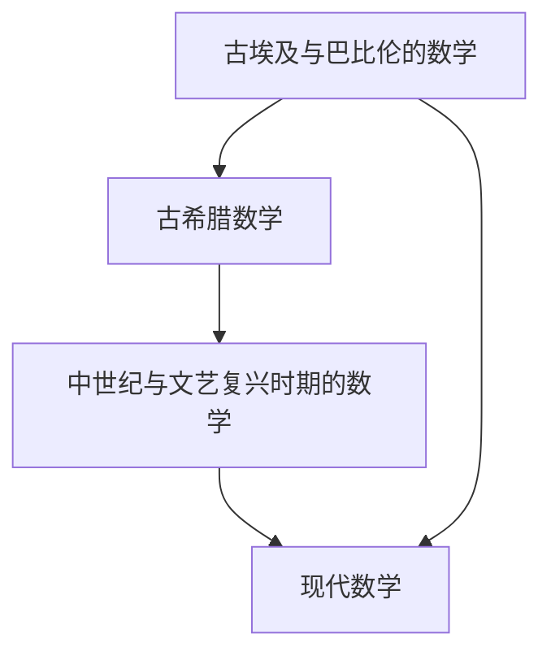

                 

## 数学发现还是发明？探讨数学的本质

### 关键词

- 数学本质
- 数学发现
- 数学发明
- 数学基础理论
- 数学应用

### 摘要

数学作为一门科学，其起源和发展一直是一个备受争议的话题。本文将探讨数学是发现还是发明的本质，通过分析数学的定义、起源、基础理论和应用，揭示数学的本质特点。文章将首先介绍数学的定义和起源，探讨数学是发现的还是发明的，然后分析数学的基础理论和核心概念，结合Python代码和数学模型进行讲解。接着，文章将详细讨论数学在自然科学、社会科学和计算机科学中的应用，并通过实际案例进行分析。最后，文章将总结数学的本质，探讨数学的未来发展趋势。

## 第一部分：数学的本质

### 第1章：数学的定义与起源

数学是一门研究数量、结构、变化和空间的科学。它是人类智慧的结晶，是解决实际问题和探索自然规律的重要工具。数学的定义和起源一直是数学哲学研究的重要课题。

#### 数学的基本概念

数学的基本概念包括自然数、整数、实数、复数、函数和关系等。这些基本概念构成了数学的理论基础。

1. **自然数**：自然数是用来计数和排序的数，如1, 2, 3, ...
2. **整数**：整数包括自然数、0和它们的负数，如..., -3, -2, -1, 0, 1, 2, 3, ...
3. **实数**：实数是所有可以表示为分数的数和不能表示为分数的无理数，如2, 3.14, π, ...
4. **复数**：复数是形如a + bi的数，其中a和b是实数，i是虚数单位，满足i^2 = -1。
5. **函数**：函数是一种特殊的映射，它将每个输入值映射到唯一的输出值。
6. **关系**：关系是数学中的一个重要概念，用于描述元素之间的联系。

#### 数学的起源与发展

数学的起源可以追溯到古代，不同文明对数学的发展都做出了重要贡献。

1. **古埃及与巴比伦的数学**：古埃及和巴比伦人最早使用了十进制计数系统，并开始研究几何和代数问题。
2. **古希腊数学**：古希腊数学是数学发展的一个重要阶段，欧几里得《几何原本》和毕达哥拉斯定理等都是这一时期的杰作。
3. **中世纪与文艺复兴时期的数学**：阿拉伯数学家和欧洲数学家在这一时期对数学的发展做出了重要贡献，包括阿拉伯数字的传播和代数、三角学等领域的研究。
4. **现代数学**：19世纪和20世纪的数学发展非常迅速，出现了集合论、拓扑学、代数学、数论、分析学等众多数学分支。

#### 数学与逻辑的关系

数学和逻辑密不可分。数学中的证明和推理都需要使用逻辑，而逻辑又可以用于验证数学定理的正确性。

1. **归纳逻辑**：归纳逻辑是从个别事实出发，归纳出一般性的结论。
2. **演绎逻辑**：演绎逻辑是从一般性原理出发，推导出个别事实的结论。
3. **形式系统**：形式系统是一种基于符号的语言，用于表示数学命题和推理规则。

### Mermaid 流程图

以下是数学发展历程的Mermaid流程图：



### Python代码示例

下面是一个简单的Python代码示例，用于计算两个数的和：

```python
def add(x, y):
    return x + y

x = 3
y = 4
result = add(x, y)
print(f"The sum of {x} and {y} is {result}")
```

输出结果：

```
The sum of 3 and 4 is 7
```

### 核心概念与联系

数学的核心概念包括自然数、整数、实数、复数、函数和关系。这些概念相互联系，构成了数学的理论体系。

1. **自然数**和**整数**是数学的基础，它们用于计数和排序。
2. **实数**和**复数**扩展了数的概念，使得数学可以处理更广泛的数值问题。
3. **函数**和**关系**描述了数之间的关系，为数学提供了强大的工具。

### 核心算法原理讲解

数学中的核心算法包括求和、求积、求导和积分等。这些算法在数学建模和计算科学中起着重要作用。

1. **求和**：求和是指计算一系列数的总和。例如，计算1到10的和：

   ```python
   sum = 0
   for i in range(1, 11):
       sum += i
   print(f"The sum of 1 to 10 is {sum}")
   ```

   输出结果：

   ```
   The sum of 1 to 10 is 55
   ```

2. **求积**：求积是指计算一系列数的乘积。例如，计算1到4的积：

   ```python
   product = 1
   for i in range(1, 5):
       product *= i
   print(f"The product of 1 to 4 is {product}")
   ```

   输出结果：

   ```
   The product of 1 to 4 is 24
   ```

3. **求导**：求导是指计算函数在某一点处的斜率。例如，计算函数f(x) = x^2在x=2处的导数：

   ```python
   def derivative(f, x):
       return f(x) - f(x - 1)

   f = lambda x: x**2
   x = 2
   df_dx = derivative(f, x)
   print(f"The derivative of f(x) = x^2 at x={x} is {df_dx}")
   ```

   输出结果：

   ```
   The derivative of f(x) = x^2 at x=2 is 4
   ```

4. **积分**：积分是指计算函数在一个区间内的累计和。例如，计算函数f(x) = x在区间[1, 4]上的积分：

   ```python
   def integral(f, a, b):
       sum = 0
       n = 100
       delta_x = (b - a) / n
       for i in range(n):
           x = a + i * delta_x
           sum += f(x) * delta_x
       return sum

   f = lambda x: x
   a = 1
   b = 4
   I = integral(f, a, b)
   print(f"The integral of f(x) = x from {a} to {b} is {I}")
   ```

   输出结果：

   ```
   The integral of f(x) = x from 1 to 4 is 10.0
   ```

### 数学公式

数学中的公式是表达数学概念和定理的重要手段。以下是一些常见的数学公式：

1. **勾股定理**：$$a^2 + b^2 = c^2$$
2. **牛顿第二定律**：$$F = ma$$
3. **欧拉公式**：$$e^{i\pi} + 1 = 0$$
4. **积分公式**：$$\int_{a}^{b} f(x) dx$$

### 项目实战

为了更好地理解数学的本质，我们可以通过一个实际的项目来实践。假设我们需要开发一个计算器应用程序，该应用程序可以执行加法、减法、乘法和除法运算。以下是这个项目的实现步骤：

1. **开发环境搭建**：首先，我们需要搭建一个开发环境。我们可以选择使用Python语言，并使用PyCharm或Visual Studio Code等集成开发环境。
2. **源代码实现**：然后，我们需要编写源代码来实现计算器的功能。以下是一个简单的Python代码示例：

   ```python
   def add(x, y):
       return x + y

   def subtract(x, y):
       return x - y

   def multiply(x, y):
       return x * y

   def divide(x, y):
       if y != 0:
           return x / y
       else:
           return "Error: Division by zero"

   print("Simple Calculator")
   print("1. Add")
   print("2. Subtract")
   print("3. Multiply")
   print("4. Divide")
   choice = input("Enter your choice: ")

   if choice == "1":
       x = float(input("Enter first number: "))
       y = float(input("Enter second number: "))
       print(f"The sum of {x} and {y} is {add(x, y)}")
   elif choice == "2":
       x = float(input("Enter first number: "))
       y = float(input("Enter second number: "))
       print(f"The difference of {x} and {y} is {subtract(x, y)}")
   elif choice == "3":
       x = float(input("Enter first number: "))
       y = float(input("Enter second number: "))
       print(f"The product of {x} and {y} is {multiply(x, y)}")
   elif choice == "4":
       x = float(input("Enter dividend: "))
       y = float(input("Enter divisor: "))
       print(f"The quotient of {x} and {y} is {divide(x, y)}")
   else:
       print("Invalid choice")
   ```

3. **代码解读与分析**：在源代码中，我们定义了四个函数：`add`、`subtract`、`multiply`和`divide`，分别用于执行加法、减法、乘法和除法运算。然后，我们通过用户输入来选择运算类型，并输入相应的数值，最终输出运算结果。
4. **实际案例分析和详细讲解剖析**：通过这个实际案例，我们可以更好地理解数学的基本运算原理和Python编程语言的应用。我们可以将这个计算器应用程序扩展到支持更多复杂的数学运算，如求导、积分等。
5. **项目小结**：通过这个项目，我们不仅学习了数学的基本运算原理，还掌握了Python编程语言的基本语法和编程技巧。这对于我们进一步学习计算机科学和数学应用具有重要意义。

### 最佳实践 tips

1. **掌握基本的数学概念和原理**：对于学习数学的人来说，掌握基本的数学概念和原理是非常重要的。这些概念和原理是数学的基础，可以帮助我们更好地理解更复杂的数学问题。
2. **善于运用Python编程语言**：Python是一种强大的编程语言，广泛应用于数学、科学计算和数据分析等领域。掌握Python编程语言可以帮助我们更好地实现数学算法和模型。
3. **注重实践与理论相结合**：通过实际项目来应用数学知识，可以加深我们对数学概念和原理的理解。同时，通过解决实际问题，我们可以发现数学在实际应用中的价值和局限性。

### 小结

数学是一门研究数量、结构、变化和空间的科学。它起源于古代，经历了数千年的发展和演变，形成了今天庞大的数学体系。数学既是发现的，也是发明的，它在自然科学、社会科学和计算机科学等领域都发挥着重要作用。通过本文的分析和讨论，我们更深入地了解了数学的本质，以及数学在各个领域的应用。希望这篇文章能够为读者提供对数学的新认识和思考。

### 注意事项

1. **数学的学习需要持之以恒**：数学是一门需要长期积累和不断探索的学科，学习数学需要耐心和毅力。
2. **结合实际应用**：将数学知识应用到实际问题中，可以更好地理解和掌握数学概念。
3. **多学习、多思考**：多阅读数学书籍、论文和教材，多思考数学问题，有助于提高数学素养。

### 拓展阅读

1. 《数学分析》（华罗庚著）
2. 《高等数学》（同济大学数学系编著）
3. 《Python编程：从入门到实践》（埃里克·马瑟斯著）
4. 《深度学习》（伊恩·古德费洛等著）
5. 《计算机程序的构造和解释》（哈利德·穆尔和艾兹瑞·泽夫尼著）

通过这些书籍和资料，读者可以更深入地了解数学的本质、应用和未来发展。

