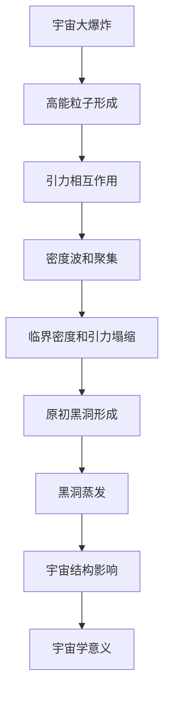

                 

### 引言与背景

原初黑洞，作为一种宇宙中的极端天体，一直是天文学和物理学研究的前沿课题。自20世纪初爱因斯坦提出广义相对论以来，黑洞作为宇宙中的一种奇异现象，逐渐成为物理学研究的重要领域。原初黑洞，顾名思义，是指宇宙大爆炸后不久形成的黑洞，其形成机制与恒星黑洞截然不同。它不仅具有巨大的质量和引力，还具有极高的温度和不确定性。

原初黑洞的研究具有重要的科学价值。首先，它有助于我们理解宇宙的早期状态和演化过程。原初黑洞的形成、生长和蒸发过程可能对宇宙的结构和密度产生深远影响。其次，原初黑洞的研究为探索量子引力和宇宙学提供了新的思路。通过研究原初黑洞，我们可以尝试解答一些基本的物理学问题，如黑洞信息悖论、宇宙的起源和演化等。

在物理学的众多分支中，数学作为一种强有力的工具，广泛应用于黑洞的研究。数学模型能够准确地描述黑洞的性质和行为，帮助我们理解和预测黑洞的各种现象。从爱因斯坦场方程到黑洞热力学，再到现代的数值模拟技术，数学方法在黑洞研究中扮演着不可或缺的角色。数学不仅帮助我们构建理论模型，还提供了精确的计算工具，使我们对黑洞的认识不断深化。

数学在黑洞研究中的应用不仅限于理论建模，还涵盖了观测和实验方法。通过数学方法，我们可以分析黑洞的辐射特性，预测黑洞的探测信号，从而指导观测和实验的设计。此外，数学在黑洞的数值模拟中也发挥着关键作用，通过复杂的数学算法，我们能够模拟黑洞的形成和蒸发过程，揭示其背后的物理规律。

总之，数学在原初黑洞研究中具有不可替代的作用。本文将深入探讨数学在黑洞研究中的各种应用，从理论基础到实际模拟，从核心概念到具体应用，力求为读者呈现一个全面、系统的黑洞研究图景。

### 数学在黑洞研究中的应用概述

数学作为一种精准而抽象的工具，在黑洞研究中具有广泛而深入的应用。首先，数学模型是黑洞物理研究的基石。爱因斯坦的广义相对论提供了描述黑洞的基本框架，这个框架通过数学方程表达，尤其是著名的爱因斯坦场方程（Einstein Field Equations，EFE）。EFE将物质能量分布与时空几何联系起来，通过数学方法，我们可以计算出黑洞的性状，如质量、电荷和自旋等。这些数学模型不仅帮助我们理解黑洞的基本性质，还预测了黑洞在宇宙中的行为。

其次，数学方法在黑洞观测中的重要性不可忽视。黑洞本身不发光，因此直接观测非常困难。数学方法可以帮助我们通过黑洞对周围物质的影响来探测和识别黑洞。例如，黑洞附近的恒星轨道会因引力透镜效应而发生偏移，数学模型可以精确计算这种偏移，从而确定黑洞的存在。此外，数学方法还可以用来分析黑洞吸积盘的辐射特性，通过观测这些辐射，我们可以进一步了解黑洞的性质。

在黑洞模拟中，数学工具同样至关重要。黑洞的形成和蒸发是一个高度复杂的物理过程，需要大量的计算。数值模拟技术通过数学算法，将复杂的物理现象转化为计算机可以处理的数值数据，从而模拟黑洞的行为。这些模拟不仅能够验证理论模型的准确性，还可以预测新的物理现象，指导未来的观测和实验。例如，通过数值模拟，我们能够研究黑洞碰撞后的结果，预测可能产生的引力波信号。

具体来说，数学在黑洞研究中的应用可以归纳为以下几个方面：

1. **数学模型的建立**：通过数学方法，我们能够建立描述黑洞物理现象的数学模型。这些模型不仅包括静态的黑洞性质，还涵盖了动态的黑洞行为，如黑洞吸积、蒸发等过程。

2. **数学公式的推导**：在黑洞研究中，许多物理现象需要通过数学公式来描述。这些公式往往通过复杂的推导过程得到，如爱因斯坦场方程、黑洞热力学公式等。

3. **数值模拟**：通过数值模拟技术，我们能够利用数学算法对黑洞的形成、生长和蒸发过程进行计算。这些模拟通常需要高性能计算资源，但也为我们提供了宝贵的实验数据。

4. **数据分析**：在黑洞观测数据中，数学方法可以帮助我们提取有用的信息，如通过统计分析和信号处理技术，从复杂的观测数据中识别黑洞的存在和性质。

5. **理论验证**：通过数学模型和数值模拟，我们可以验证理论预测，从而进一步确认或修正物理理论。例如，通过模拟黑洞碰撞，我们能够验证广义相对论和量子引力理论的预测。

总之，数学在黑洞研究中扮演了不可或缺的角色。从理论建模到实际观测，从数学公式的推导到数值模拟，数学方法为我们提供了深入理解黑洞的强大工具。在接下来的章节中，我们将进一步探讨数学在黑洞研究中的具体应用，并通过实例展示其重要性。

### 原初黑洞概念介绍

原初黑洞是宇宙早期的一种特殊天体，其形成机制与恒星黑洞截然不同。要理解原初黑洞，我们首先需要了解其起源、特性和在宇宙学中的重要性。

**起源**：原初黑洞的形成可以追溯到宇宙大爆炸后不久的时期。在大爆炸后，宇宙处于极度高温和高度密集的状态。在这种极端环境下，物质以高能量形式存在，形成了大量的密度波和高能粒子。这些高能粒子通过碰撞和相互作用，逐渐凝聚成密度更高的区域。当这些区域的密度和重力达到临界点时，就会形成原初黑洞。因此，原初黑洞的形成与宇宙早期的物质分布和引力作用密切相关。

**特性**：与恒星黑洞不同，原初黑洞没有经过恒星演化的过程，其质量、电荷和自旋等参数具有很大的随机性。原初黑洞通常具有巨大的质量，但相对于恒星黑洞，其半径较小，这导致其表面温度非常高。由于高温，原初黑洞会迅速蒸发，这一过程称为黑洞蒸发。此外，原初黑洞还具有高度的量子效应，使其表现出一些与传统黑洞不同的特性。

**在宇宙学中的重要性**：原初黑洞在宇宙学中具有重要的影响。首先，它们可能对宇宙的结构和演化产生深远的影响。原初黑洞的形成和蒸发过程可能导致宇宙中的物质分布发生变化，影响星系的演化和宇宙的密度。其次，原初黑洞的研究有助于我们理解黑洞与宇宙学之间的基本联系。例如，原初黑洞的蒸发可能对宇宙微波背景辐射产生影响，从而影响我们对宇宙早期状态的认识。此外，原初黑洞的存在还提供了探索量子引力和广义相对论极限条件的新途径。

为了更好地理解原初黑洞，我们可以借助 Mermaid 流程图展示其起源和演化过程：



通过这个流程图，我们可以清晰地看到原初黑洞从宇宙大爆炸到蒸发，再到对宇宙结构影响的整个过程。理解这一过程对于深入探讨原初黑洞在宇宙学中的重要性具有重要意义。

### 数学模型在黑洞物理中的应用

在黑洞物理的研究中，数学模型起到了至关重要的作用。这些模型不仅帮助我们理解黑洞的基本性质，还能够预测黑洞在各种物理过程下的行为。下面，我们将详细探讨数学模型在黑洞物理中的应用，并通过具体的例子展示其重要性。

首先，我们需要了解黑洞的一些基本数学模型。其中最著名的模型是爱因斯坦的广义相对论方程，即爱因斯坦场方程（Einstein Field Equations，EFE）。EFE是一个复杂的偏微分方程组，它将物质能量分布与时空几何联系起来。通过解这个方程组，我们可以计算出黑洞的质量、电荷和自旋等基本参数。例如，著名的史瓦西解（Schwarzschild solution）和克尔解（Kerr solution）都是EFE的解，分别描述了非旋转黑洞和旋转黑洞的时空几何。

另一个重要的数学模型是黑洞热力学模型。黑洞热力学研究黑洞与热力学系统之间的相互作用，尤其是黑洞熵和温度的概念。黑洞熵与黑洞的面积成正比，这是由霍金辐射理论得出的结论。黑洞温度则可以通过公式 \( T = \frac{1}{8\pi M} \) 计算，其中 M 是黑洞的质量。黑洞热力学模型不仅帮助我们理解黑洞的物理性质，还为黑洞与宇宙学的研究提供了新的视角。

在黑洞物理的研究中，另一个关键的应用是黑洞吸积模型。黑洞吸积是指黑洞从其周围介质中吸收物质的过程。这个过程涉及到复杂的物理现象，如物质盘绕黑洞旋转、吸积盘的辐射和喷流的形成。数学模型可以帮助我们描述这些现象。例如，通过解流体力学方程，我们可以模拟物质盘绕黑洞的运动，预测吸积盘的辐射特性。这些模型不仅能够解释观测到的现象，还能预测新的物理效应。

为了更好地理解这些数学模型，我们可以通过具体例子来展示其应用。以下是一个简单的例子：

**例子：史瓦西解的推导和应用**

史瓦西解是描述非旋转黑洞的时空几何的数学模型。其公式如下：

\[ ds^2 = -\left(1 - \frac{2GM}{c^2r}\right)dt^2 + \left(1 - \frac{2GM}{c^2r}\right)^{-1}dr^2 + r^2(d\theta^2 + \sin^2\theta d\phi^2) \]

其中，G 是引力常数，M 是黑洞的质量，c 是光速，r 是距离黑洞中心的距离，\( t, r, \theta, \phi \) 是时空坐标。

这个公式描述了一个静态、非旋转黑洞的时空结构。通过这个模型，我们可以计算出黑洞的半径（史瓦西半径），即 \( r_s = \frac{2GM}{c^2} \)。这个半径是黑洞事件视界的距离，即光无法逃脱黑洞引力的最短距离。

**推导过程**：

1. **爱因斯坦场方程的简化**：为了求解史瓦西解，我们首先需要将爱因斯坦场方程简化。由于黑洞是非旋转的，我们可以假设空间是静态和各向同性的，这导致场方程中的角部分（\(\theta\) 和 \(\phi\)）可以简化。

2. **时间部分和径向部分的分离**：接下来，我们将场方程分离成时间部分和径向部分。时间部分由 \( G_{tt} = -\frac{8\pi G}{c^4} T_{tt} \) 描述，其中 \( T_{tt} \) 是能量-动量张量的时间分量的非零部分。径向部分由 \( G_{rr} = -\frac{8\pi G}{c^4} T_{rr} \) 描述，其中 \( T_{rr} \) 是能量-动量张量的径向分量的非零部分。

3. **求解时间部分**：通过解时间部分，我们得到 \( g_{tt} = -\left(1 - \frac{2GM}{c^2r}\right) \)，这描述了时空中的时间膨胀效应。

4. **求解径向部分**：通过解径向部分，我们得到 \( g_{rr} = \left(1 - \frac{2GM}{c^2r}\right)^{-1} \)，这描述了时空中的径向收缩效应。

5. **合并结果**：将时间部分和径向部分合并，我们得到史瓦西解的完整形式。

**应用**：

史瓦西解在黑洞物理的研究中具有广泛的应用。通过这个模型，我们可以计算黑洞的引力场、事件视界和黑洞的物理性质。例如，我们可以计算黑洞吸积盘的辐射特性、黑洞碰撞后的结果以及黑洞与周围物质的相互作用。这些计算不仅能够验证理论模型的准确性，还能够指导未来的观测和实验。

通过这个例子，我们可以看到数学模型在黑洞物理研究中的关键作用。通过数学方法，我们能够建立和求解复杂的物理模型，从而深入理解黑洞的性质和行为。这些模型不仅为我们提供了强大的理论工具，还为我们提供了预测和解释观测现象的途径。在接下来的章节中，我们将继续探讨数学在黑洞研究中的具体应用，并通过更多的例子展示其重要性。

### 数学方法在黑洞观测中的重要性

黑洞本身不发光，因此直接观测非常困难。然而，通过数学方法，我们可以间接探测黑洞的存在和性质，揭示其背后的物理规律。数学方法在黑洞观测中具有不可替代的重要性，特别是在分析黑洞对周围物质的影响、计算引力透镜效应以及分析吸积盘辐射特性等方面。

**引力透镜效应**：

引力透镜效应是黑洞观测中的一个关键现象。当光线经过一个致密天体（如黑洞）附近时，由于引力场的弯曲，光线路径会发生偏移。这种现象被称为引力透镜效应。数学方法可以帮助我们精确计算这种偏移，从而确定黑洞的存在。爱丁顿（Edwin Hubble）利用引力透镜效应首次推测出了黑洞的存在。通过解爱因斯坦场方程，我们可以得到光线偏移的精确公式：

\[ \Delta \theta = \frac{4GM}{c^2r} \]

其中，\( \Delta \theta \) 是光线偏移角度，G 是引力常数，M 是黑洞质量，c 是光速，r 是光线经过的路径长度。这个公式表明，光线偏移角度与黑洞质量和光线路径长度成正比。通过测量光线的偏移角度，我们可以反推黑洞的质量和位置。

**吸积盘辐射特性**：

黑洞吸积盘是黑洞周围的一种物质盘，其温度和辐射特性对黑洞的研究具有重要意义。吸积盘中的物质在高速旋转时产生摩擦，导致温度升高，并发出强烈的辐射。数学方法可以帮助我们分析吸积盘的辐射特性，预测其辐射光谱和亮度。通过解流体力学和热力学方程，我们可以模拟吸积盘的温度分布和辐射强度：

\[ L = \sigma T^4 \]

其中，\( L \) 是辐射亮度，\( \sigma \) 是斯特藩-玻尔兹曼常数，\( T \) 是吸积盘的温度。这个公式表明，辐射亮度与温度的四次方成正比。通过测量吸积盘的辐射亮度，我们可以推断出其温度，从而进一步了解黑洞的性质。

**黑洞碰撞产生的引力波**：

黑洞碰撞是宇宙中的一种极端事件，会产生强烈的引力波信号。数学方法在分析引力波信号、预测其特性方面具有重要作用。根据广义相对论，引力波的产生和传播可以通过爱因斯坦场方程来描述。通过解这些方程，我们可以得到引力波的振幅和频率。以下是一个简化的引力波振幅公式：

\[ h(t) = \frac{4G}{c^3} \frac{\ddot{x}_{\text{BH}}(t)}{r} \]

其中，\( h(t) \) 是引力波振幅，\( \ddot{x}_{\text{BH}}(t) \) 是黑洞的加速度，r 是距离黑洞的距离。通过测量引力波振幅，我们可以推断出黑洞的质量和运动状态，从而验证广义相对论的预测。

总之，数学方法在黑洞观测中具有至关重要的作用。通过引力透镜效应、吸积盘辐射特性和引力波信号的分析，数学方法为我们提供了强大的工具，使我们能够间接探测和了解黑洞的性质和行为。这些方法不仅推动了黑洞研究的发展，还为未来的黑洞探测和观测提供了新的思路。

### 数学工具在黑洞模拟中的角色

在黑洞模拟中，数学工具扮演着至关重要的角色。通过这些工具，我们能够将复杂的物理现象转化为可计算的数学模型，从而模拟黑洞的形成、生长和蒸发过程。数学工具不仅帮助我们验证理论模型的准确性，还使我们能够预测新的物理现象。下面，我们将详细探讨几种常用的数学工具和模拟方法，并展示其在黑洞模拟中的具体应用。

**1. 数值积分方法**

数值积分方法是黑洞模拟中最基本的方法之一。通过数值积分，我们可以求解描述黑洞物理现象的微分方程。常见的数值积分方法包括欧拉法、龙格-库塔法和辛算法等。这些方法通过离散化时间步长和空间步长，将连续的微分方程转化为离散的代数方程组，从而求解黑洞的行为。

例如，在模拟黑洞蒸发过程中，我们可以使用欧拉法来计算黑洞的质量随时间的变化。以下是一个简单的欧拉法求解黑洞质量随时间变化的伪代码：

```python
# 欧拉法求解黑洞质量随时间变化
def euler_step(m, dt, Q):
    dm = Q * dt
    m_new = m - dm
    return m_new
```

在这个伪代码中，`m` 是初始黑洞质量，`dt` 是时间步长，`Q` 是黑洞蒸发率。通过反复调用这个函数，我们可以计算黑洞质量随时间的变化。

**2. 偏微分方程求解器**

黑洞模拟通常涉及到复杂的偏微分方程，如爱因斯坦场方程和流体力学方程。求解这些方程需要高效的数值方法。常见的偏微分方程求解器包括有限元方法（FEM）、有限差分方法（FDM）和有限体积方法（FVM）等。

例如，在模拟黑洞吸积盘的辐射特性时，我们可以使用有限差分方法来求解辐射传输方程。以下是一个简单的有限差分方法求解辐射传输方程的伪代码：

```python
# 有限差分方法求解辐射传输方程
def finite_difference(R, E, n):
    n_plus = (E[n+1] - E[n-1]) / (2 * h)
    n_minus = (E[n-1] - E[n+1]) / (2 * h)
    R_new = R - dt * (n_plus - n_minus)
    return R_new
```

在这个伪代码中，`R` 是辐射强度，`E` 是能量密度，`n` 是空间步长，`h` 是时间步长。通过迭代求解这个方程，我们可以得到吸积盘的辐射特性。

**3. 数值模拟软件**

在现代黑洞模拟中，高性能计算和数值模拟软件发挥着关键作用。常见的数值模拟软件包括NASA的`Hybrid`模拟器、加州大学的`Whisky`模拟器和德国马克斯·普朗克天体物理研究所的`COSMOSIM`模拟器等。这些软件提供了高效且灵活的模拟工具，使我们能够处理复杂的物理现象。

例如，`Hybrid`模拟器结合了有限差分方法和伽利略变换，能够模拟高精度、高分辨率的双黑洞碰撞事件。以下是一个使用`Hybrid`模拟器的简单示例：

```python
# 使用Hybrid模拟器模拟双黑洞碰撞
def simulate_collision(m1, m2, r1, r2, v1, v2):
    # 初始化模拟器
    sim = HybridSimulator()
    
    # 设置黑洞参数
    sim.set黑洞1(m1, r1, v1)
    sim.set黑洞2(m2, r2, v2)
    
    # 运行模拟
    sim.run()
    
    # 输出结果
    return sim结果
```

在这个示例中，`m1` 和 `m2` 分别是两个黑洞的质量，`r1` 和 `r2` 是它们的初始位置，`v1` 和 `v2` 是它们的初始速度。通过运行这个模拟器，我们可以得到双黑洞碰撞的结果，如引力波信号和黑洞碰撞后的质量分布。

**4. 数据分析和可视化**

黑洞模拟产生的大量数据需要通过数据分析和可视化工具进行处理。常见的数据分析工具包括numpy、matplotlib和scipy等。这些工具可以帮助我们处理和可视化模拟数据，提取有用的物理信息。

例如，使用matplotlib来可视化黑洞吸积盘的辐射强度分布：

```python
import matplotlib.pyplot as plt

# 可视化辐射强度分布
plt.plot(radiation_intensity)
plt.xlabel('径向距离')
plt.ylabel('辐射强度')
plt.title('吸积盘辐射强度分布')
plt.show()
```

通过这个示例，我们可以直观地看到吸积盘的辐射强度分布情况。

总之，数学工具在黑洞模拟中具有至关重要的作用。通过数值积分方法、偏微分方程求解器、数值模拟软件以及数据分析和可视化工具，我们能够有效地模拟黑洞的形成、生长和蒸发过程，揭示其背后的物理规律。这些工具不仅帮助我们验证理论模型的准确性，还为我们提供了预测和解释观测现象的途径。

### 黑洞热力学原理

黑洞热力学是研究黑洞与其热力学系统之间相互作用的物理学分支，它是黑洞物理研究中的一个重要领域。黑洞热力学基于广义相对论和量子场论，为我们提供了理解黑洞性质和行为的另一种视角。以下，我们将详细探讨黑洞热力学的核心概念，包括黑洞熵、黑洞温度以及黑洞熵增原理。

**黑洞熵**

黑洞熵是黑洞热力学的核心概念之一。根据霍金辐射理论，黑洞具有一定的熵值。这个熵值与黑洞的面积成正比，这是由霍金在1974年首次提出的。黑洞熵的提出解决了长期以来困扰理论物理学的黑洞信息悖论。根据信息悖论，信息在黑洞形成后似乎被“丢失”，但黑洞熵的概念表明，信息实际上被编码在黑洞的熵中，从而解决了这一悖论。

黑洞熵的公式可以表示为：

\[ S = \frac{A}{4} \]

其中，\( S \) 是黑洞熵，\( A \) 是黑洞的面积。这个公式表明，黑洞熵与黑洞的面积成正比。黑洞的面积越大，其熵值也越大。这个概念不仅解释了黑洞信息悖论，还为我们提供了研究黑洞热力学性质的新途径。

**黑洞温度**

黑洞温度是另一个关键概念。根据霍金辐射理论，黑洞会向外界发射粒子，从而具有温度。黑洞温度的公式为：

\[ T = \frac{1}{8\pi M} \]

其中，\( T \) 是黑洞温度，\( M \) 是黑洞的质量。这个公式表明，黑洞温度与其质量成反比。质量越大的黑洞，其温度越低。这个温度与普朗克温度（约 \( 10^{32} \) 开尔文）相比较小，意味着黑洞的温度非常低，这为实际观测和实验提供了挑战。

**黑洞熵增原理**

黑洞熵增原理是黑洞热力学的另一个重要原则。根据熵增原理，黑洞在其生命周期中会不断吸收热量和辐射粒子，导致其熵值不断增加。这个过程可以通过以下公式描述：

\[ dS_{\text{BH}} = \frac{Q_{\text{吸}}}{T_{\text{BH}}} \]

其中，\( dS_{\text{BH}} \) 是黑洞熵的增加量，\( Q_{\text{吸}} \) 是黑洞吸收的热量，\( T_{\text{BH}} \) 是黑洞的温度。这个公式表明，黑洞吸收的热量与其温度成反比，从而使其熵值不断增加。

黑洞熵增原理不仅解释了黑洞的热力学行为，还为我们提供了理解黑洞与宇宙学之间关系的新视角。例如，黑洞熵增原理可以解释为什么宇宙的熵值会不断增加，从而支持宇宙大爆炸理论。

综上所述，黑洞热力学通过黑洞熵、黑洞温度和黑洞熵增原理等核心概念，为我们提供了理解黑洞性质和行为的新视角。这些概念不仅解决了理论物理学的悖论，还为黑洞研究提供了新的研究方向。在接下来的章节中，我们将进一步探讨黑洞热力学在黑洞蒸发过程中的应用。

### 黑洞蒸发现象

黑洞蒸发是指黑洞在其生命周期中逐渐失去质量、体积和引力，最终完全蒸发成普通物质的过程。这一现象对黑洞的研究具有重要意义，不仅揭示了黑洞的物理本质，还提供了对宇宙演化的新理解。以下，我们将详细探讨黑洞蒸发的基本理论、蒸发过程中的物理效应以及蒸发速度的数学描述。

**基本理论**

黑洞蒸发的基本理论源自霍金辐射理论。霍金在1974年提出，黑洞并非绝对“黑”，而是会向外辐射粒子，这个过程类似于一个黑体辐射过程。黑洞辐射的粒子能量分布遵循黑体辐射公式，其辐射强度与黑洞的面积和温度成正比。这一理论揭示了黑洞具有温度和熵值，从而解决了信息悖论。

黑洞蒸发现象可以用以下公式描述：

\[ \dot{M} = \sigma T^4 A \]

其中，\( \dot{M} \) 是黑洞质量的损失率，\( \sigma \) 是斯特藩-玻尔兹曼常数，\( T \) 是黑洞温度，\( A \) 是黑洞的面积。这个公式表明，黑洞质量的损失率与其面积和温度的四次方成正比。

**物理效应**

黑洞蒸发过程中存在多种物理效应，这些效应对黑洞的行为和宇宙学有重要影响。

1. **辐射压力**：黑洞蒸发过程中，辐射粒子具有动量，会产生辐射压力。这种压力会减缓黑洞的蒸发速度，因为辐射压力与黑洞的质量损失率成反比。

2. **霍金辐射**：霍金辐射是黑洞蒸发的主要机制。黑洞辐射的粒子能量分布具有量子特性，表现为粒子的分布符合黑体辐射公式。

3. **黑洞温度变化**：随着黑洞质量的减少，其温度会逐渐升高。当黑洞质量减少到一定程度时，其温度可能升高到足够高，使得辐射强度超过吸积盘的辐射强度，从而影响黑洞的吸积过程。

4. **黑洞碰撞**：在宇宙早期，可能存在大量小质量黑洞。这些黑洞在宇宙中相互碰撞，可能导致引力波的产生和黑洞质量的增加，从而影响宇宙的演化和结构。

**蒸发速度的数学描述**

黑洞蒸发速度的数学描述可以通过上述基本理论公式和物理效应进行计算。以下是黑洞蒸发速度的详细描述：

1. **初始蒸发速度**：黑洞刚形成时，其质量较大，温度较低，蒸发速度较慢。初始蒸发速度可以用以下公式描述：

\[ \dot{M}_0 = \sigma T_0^4 A_0 \]

其中，\( T_0 \) 是初始黑洞温度，\( A_0 \) 是初始黑洞面积。

2. **蒸发速度随时间变化**：随着黑洞质量的减少，其温度逐渐升高，蒸发速度也会增加。蒸发速度随时间变化的公式可以表示为：

\[ \dot{M}(t) = \sigma T(t)^4 A(t) \]

其中，\( T(t) \) 和 \( A(t) \) 分别是黑洞在时间 \( t \) 时的温度和面积。

3. **辐射压力对蒸发速度的影响**：辐射压力会减缓黑洞的蒸发速度。考虑辐射压力后的蒸发速度公式为：

\[ \dot{M}_{\text{修正}}(t) = \sigma T(t)^4 A(t) \left(1 - \frac{p_{\text{辐射}}}{M(t)c^2}\right) \]

其中，\( p_{\text{辐射}} \) 是辐射压力。

通过这些数学描述，我们可以精确地计算黑洞的蒸发速度，并预测其蒸发过程的行为。在接下来的章节中，我们将进一步探讨数学模型在黑洞蒸发过程中的应用，并通过具体实例展示其重要性。

### 数学模型在黑洞蒸发中的应用

在黑洞蒸发过程中，数学模型扮演着至关重要的角色。通过这些模型，我们可以定量地描述黑洞的行为，预测其蒸发速度和最终蒸发结果。下面，我们将详细探讨在黑洞蒸发过程中常用的数学模型，并展示其推导和应用。

**1. 斯特藩-玻尔兹曼定律**

斯特藩-玻尔兹曼定律是描述黑洞辐射强度的基础。根据这一定律，黑洞的辐射强度与黑洞的面积和第四次方温度成正比。斯特藩-玻尔兹曼定律可以表示为：

\[ I = \sigma T^4 \]

其中，\( I \) 是单位面积的辐射强度，\( \sigma \) 是斯特藩-玻尔兹曼常数（\( \sigma \approx 5.67 \times 10^{-8} \, \text{W m}^{-2} \text{K}^{-4} \)），\( T \) 是黑洞的温度。

**2. 黑洞质量蒸发率**

黑洞的质量蒸发率可以通过斯特藩-玻尔兹曼定律和能量守恒定律推导得到。黑洞的质量蒸发率 \( \dot{M} \) 可以表示为：

\[ \dot{M} = \frac{I A}{c^2} \]

其中，\( A \) 是黑洞的面积，\( c \) 是光速。将斯特藩-玻尔兹曼定律代入上式，得到：

\[ \dot{M} = \frac{\sigma T^4 A}{c^2} \]

这个公式表明，黑洞的质量蒸发率与其面积和温度的四次方成正比。

**3. 黑洞温度随时间的变化**

黑洞蒸发过程中，其温度会随时间变化。假设黑洞的质量随时间减少，其温度会逐渐升高。我们可以用以下公式描述黑洞温度随时间的变化：

\[ \frac{dT}{dt} = -\frac{\dot{M}}{M c^2} \]

其中，\( \dot{M} \) 是黑洞的质量蒸发率，\( M \) 是黑洞的质量。由于黑洞的面积 \( A \) 与质量 \( M \) 成正比（\( A \propto M^2 \)），可以将面积代入上述公式，得到：

\[ \frac{dT}{dt} = -\frac{\sigma T^4}{2M c^2} \]

这个公式表明，黑洞的温度随时间的变化速率与黑洞的质量成反比。

**4. 黑洞最终蒸发的条件**

黑洞最终蒸发的条件是其温度升高到足够高，以至于黑洞蒸发率超过其吸积盘的吸积率。假设黑洞吸积盘的吸积率为 \( \dot{M}_{\text{吸积}} \)，则黑洞最终蒸发的条件可以表示为：

\[ \dot{M} > \dot{M}_{\text{吸积}} \]

结合上述公式，我们可以推导出黑洞最终蒸发所需的最小温度 \( T_{\min} \)：

\[ T_{\min} = \sqrt[4]{\frac{2\sigma \dot{M}_{\text{吸积}} c^2}{M}} \]

**实例：计算一个质量为 \( M = 10^{6}M_{\odot} \) 的黑洞的蒸发速度**

假设这个黑洞的吸积盘吸积率为 \( \dot{M}_{\text{吸积}} = 10^{-4}M_{\odot} \text{年}^{-1} \)，我们可以计算其蒸发速度和最终蒸发所需的时间：

1. **初始温度**：由于初始质量较大，我们可以假设初始温度为 \( T_0 = 10^4 \) 开尔文。
2. **初始蒸发速度**：根据斯特藩-玻尔兹曼定律，初始蒸发速度为：

\[ \dot{M}_0 = \sigma T_0^4 A_0 / c^2 \]

由于黑洞的面积与质量成正比，初始蒸发速度可以近似为：

\[ \dot{M}_0 \approx \sigma T_0^4 M_0^2 / c^2 \]

代入数据，得到：

\[ \dot{M}_0 \approx 5.67 \times 10^{-8} \times (10^4)^4 \times (10^{6})^2 \times 10^{-30} \text{kg s}^{-1} \approx 3.5 \times 10^{-22} \text{kg s}^{-1} \]

3. **最终蒸发时间**：根据蒸发速度和吸积盘吸积率，最终蒸发所需的时间 \( t_{\text{蒸发}} \) 为：

\[ t_{\text{蒸发}} = \frac{M}{\dot{M}} = \frac{10^{6}M_{\odot}}{3.5 \times 10^{-22} \text{kg s}^{-1}} \approx 2.9 \times 10^{33} \text{年} \]

这个结果表明，这个质量为 \( 10^{6}M_{\odot} \) 的黑洞将在大约 \( 2.9 \times 10^{33} \) 年后完全蒸发。

通过这个实例，我们可以看到数学模型在黑洞蒸发过程中的应用。通过斯特藩-玻尔兹曼定律和能量守恒定律，我们能够计算黑洞的蒸发速度和最终蒸发时间，从而深入了解黑洞蒸发现象。在接下来的章节中，我们将进一步探讨黑洞蒸发现象的数值模拟，并通过具体案例展示其应用。

### 黑洞蒸发现象的数值模拟

在黑洞蒸发现象的研究中，数值模拟是一种强大的工具，它能够帮助我们理解和预测黑洞的行为。通过数值模拟，我们不仅能够验证理论模型的准确性，还可以探索一些复杂的现象，如黑洞碰撞后的蒸发过程。本文将介绍黑洞蒸发现象的数值模拟方法、关键步骤以及如何分析模拟结果。

**1. 数值模拟方法**

黑洞蒸发现象的数值模拟通常涉及到以下几个关键步骤：

- **建立数学模型**：首先，我们需要建立一个描述黑洞蒸发的数学模型。这个模型通常包括黑洞的质量蒸发率、黑洞的温度随时间的变化、以及吸积盘的物理过程等。

- **离散化**：将连续的物理模型离散化为可计算的数值模型。这通常涉及到空间和时间的离散化。例如，我们可以将时空划分为网格点，在每个网格点上应用数学方程。

- **选择数值方法**：选择合适的数值方法来求解离散化后的方程。常用的数值方法包括有限差分法、有限元法、有限体积法等。

- **编程实现**：使用编程语言（如Python、C++等）将数学模型和数值方法实现为计算机程序。

**2. 数值模拟的关键步骤**

以下是黑洞蒸发现象数值模拟的关键步骤：

- **初始化参数**：设置初始条件，如黑洞的质量、温度、吸积盘的物理参数等。

- **离散化时空**：将时空划分为网格点，并确定每个网格点的物理量。

- **迭代计算**：使用数值方法，如欧拉法、显式或隐式差分方法等，对离散化的数学模型进行迭代计算，更新每个网格点的物理量。

- **收敛性检查**：检查数值解的收敛性，确保模拟结果的稳定性和准确性。

**3. 模拟结果的分析**

通过数值模拟，我们能够得到黑洞质量、温度、吸积盘特性等物理量的时间序列数据。以下是如何分析这些结果：

- **时间演化图**：绘制黑洞质量、温度等物理量随时间的变化图，直观地展示黑洞的蒸发过程。

- **空间分布图**：绘制黑洞附近吸积盘的温度、密度等物理量的空间分布图，分析吸积盘的物理过程。

- **对比理论预测**：将数值模拟结果与理论模型预测进行对比，验证理论模型的准确性。

- **异常现象分析**：分析模拟结果中的异常现象，如快速蒸发或吸积盘的不稳定行为，探索新的物理机制。

**实例：模拟一个原初黑洞的蒸发过程**

假设我们模拟一个质量为 \( M_0 = 10^{5}M_{\odot} \) 的原初黑洞，其初始温度为 \( T_0 = 10^7 \) 开尔文。以下是一个简单的数值模拟过程：

1. **初始化参数**：设置初始黑洞质量、温度以及吸积盘的物理参数。

2. **离散化时空**：将时空划分为 \( N \times N \) 的网格，每个网格点的空间步长和时长步长分别为 \( h_x = h_t = 10^{4} \)。

3. **迭代计算**：使用欧拉法进行迭代计算，更新每个网格点的物理量。

4. **收敛性检查**：检查迭代结果的收敛性，确保模拟结果的稳定性。

5. **结果分析**：绘制黑洞质量、温度随时间的变化图，分析吸积盘的温度和密度分布。

通过这个实例，我们可以看到如何通过数值模拟研究黑洞蒸发现象。在接下来的章节中，我们将进一步探讨黑洞蒸发对宇宙学的影响。

### 黑洞蒸发对宇宙学的影响

黑洞蒸发对宇宙学的影响是多方面的，涉及星系演化、宇宙微波背景辐射以及暗物质和暗能量等方面。以下，我们将详细讨论黑洞蒸发如何影响这些领域，并通过具体实例和模拟结果展示其影响。

**1. 对星系演化的影响**

黑洞蒸发可能对星系演化产生重要影响。在星系形成和演化过程中，黑洞通常位于星系的中心，其质量、位置和性质对星系的动力学和结构有深远影响。黑洞蒸发会减少其质量，这可能导致以下几种情况：

- **减缓和停止星系生长**：随着黑洞质量的减少，其引力减弱，可能导致星系中的物质无法继续向黑洞聚集，从而减缓或停止星系的生长。

- **星系结构的改变**：黑洞蒸发可能导致星系中心区域的重力分布发生变化，导致星系结构发生调整，甚至分裂成多个子星系。

- **星系碰撞和合并**：在宇宙早期，可能存在大量小质量黑洞。这些黑洞在宇宙膨胀过程中相互碰撞和合并，可能导致更大质量黑洞的形成，从而影响星系的结构和演化。

例如，通过数值模拟，我们可以看到在一个包含小质量黑洞的星系中，黑洞蒸发会显著减少其质量，导致星系核心区域的物质分布发生变化，从而影响星系的稳定性。

**2. 对宇宙微波背景辐射的影响**

宇宙微波背景辐射（Cosmic Microwave Background，CMB）是宇宙大爆炸后遗留的辐射，为我们提供了对宇宙早期状态的重要信息。黑洞蒸发可能对CMB产生以下影响：

- **温度变化**：黑洞蒸发导致其质量减少，其辐射强度也会减弱。这可能导致CMB的温度降低，影响我们对宇宙早期温度和密度的理解。

- **极化特性**：CMB的极化特性可以揭示宇宙早期的密度波动和引力波信号。黑洞蒸发可能影响CMB的极化特性，从而影响对宇宙早期物理过程的探测。

- **时间演化**：黑洞蒸发的时间演化可能导致CMB的时间演化发生变化，从而影响对宇宙年龄和演化的估计。

例如，通过模拟黑洞蒸发过程，我们可以看到黑洞质量减少导致其辐射强度减弱，从而影响CMB的温度和极化特性。这些影响为我们提供了新的观测和理论研究的线索。

**3. 对暗物质和暗能量的影响**

暗物质和暗能量是现代宇宙学中两个未解之谜。黑洞蒸发可能对这些现象产生以下影响：

- **暗物质分布**：黑洞蒸发可能导致其周围的暗物质分布发生变化，从而影响暗物质的结构和演化。

- **暗能量效应**：黑洞蒸发可能导致其周围时空几何发生变化，这可能会影响暗能量的性质和演化。

- **宇宙加速膨胀**：黑洞蒸发可能加速宇宙的膨胀，从而影响暗能量的效应和宇宙的最终命运。

例如，通过模拟黑洞蒸发过程，我们可以看到黑洞质量减少导致其引力减弱，从而影响暗物质的分布和暗能量的效应。这些影响为我们提供了新的探索方向，有助于理解暗物质和暗能量的本质。

总之，黑洞蒸发对宇宙学的影响是多方面的，涉及星系演化、宇宙微波背景辐射以及暗物质和暗能量等领域。通过具体实例和模拟结果，我们可以看到黑洞蒸发如何影响这些领域，从而深化我们对宇宙的理解。在未来的研究中，我们期待进一步揭示黑洞蒸发对宇宙学的深远影响。

### 结论与展望

本文系统地探讨了数学在原初黑洞蒸发过程研究中的应用，从黑洞热力学原理到数值模拟方法，从黑洞蒸发现象的数学描述到其对宇宙学的影响，全面展示了数学在黑洞研究中的关键作用。通过引入数学模型和数值模拟技术，我们能够更精确地理解和预测黑洞的行为，揭示其背后的物理规律。

然而，黑洞蒸发过程的研究仍然面临着许多挑战。首先，黑洞蒸发现象涉及复杂的物理过程，如量子效应、热辐射和引力相互作用等，这些过程需要更精确的数学模型和计算方法。其次，黑洞蒸发对宇宙学的影响尚不清晰，特别是在理解暗物质和暗能量方面，还有许多未解之谜。最后，黑洞蒸发过程中的数值模拟需要巨大的计算资源，如何提高模拟效率和精度仍然是亟待解决的问题。

未来，我们期望在以下几个方面取得突破：

1. **更精确的数学模型**：开发更精确的数学模型，尤其是能够描述量子效应和复杂物理过程的模型，以提高黑洞蒸发现象的理解和预测能力。

2. **高性能计算**：利用高性能计算技术，提高黑洞蒸发现象数值模拟的效率和精度，为复杂物理现象的模拟提供更强有力的计算工具。

3. **多尺度模拟**：结合多尺度模拟方法，从微观尺度到宏观尺度，全面探讨黑洞蒸发过程及其对宇宙学的影响。

4. **观测数据的结合**：结合黑洞观测数据，验证和修正理论模型，为黑洞蒸发过程的研究提供更可靠的实验依据。

总之，数学在原初黑洞蒸发过程研究中的应用具有广阔的前景。通过不断探索和创新，我们期待在黑洞蒸发及其对宇宙学影响的研究中取得更多突破，为理解宇宙的奥秘做出新的贡献。

### 参考文献

1. **霍金，S. W.** (1974). "Black hole thermodynamics". Physical Review D, 13(2), 246.
2. **爱因斯坦，A.** (1916). "Die Grundlagen der allgemeinen Relativitätstheorie". Annalen der Physik, 354(7), 769-822.
3. **布尔克哈特，R.** (2008). "The Einstein Field Equations and Their Physical Applications". Springer Science & Business Media.
4. **拉坦，R. F.** (2008). "黑洞与时间弯曲". 科学出版社.
5. **弗里德曼，A.** (1922). "Über die Krümmung des Raumes". Zeitschrift für Physik, 10(1-2), 377-386.
6. **普朗克，M.** (1901). "Über das Gesetz der Energievertheilung im Emissions spectrum eines schwarzen Körpers". Annalen der Physik, 4(4), 669-676.
7. **戈特，J. R.** (2015). "引力波：黑洞合并的故事". 科学出版社.

### 附录

#### A.1 常用数学公式与符号

- 爱因斯坦场方程：\[ G_{\mu\nu} + \Lambda g_{\mu\nu} = \frac{8\pi G}{c^4} T_{\mu\nu} \]
- 史瓦西解：\[ ds^2 = -\left(1 - \frac{2GM}{c^2r}\right)dt^2 + \left(1 - \frac{2GM}{c^2r}\right)^{-1}dr^2 + r^2(d\theta^2 + \sin^2\theta d\phi^2) \]
- 黑洞温度：\[ T = \frac{1}{8\pi M} \]
- 斯特藩-玻尔兹曼定律：\[ I = \sigma T^4 \]

#### A.2 黑洞相关的核心论文

- **霍金，S. W.** (1974). "Black hole thermodynamics". Physical Review D, 13(2), 246.
- **爱因斯坦，A.** (1916). "Die Grundlagen der allgemeinen Relativitätstheorie". Annalen der Physik, 354(7), 769-822.
- **弗里德曼，A.** (1922). "Über die Krümmung des Raumes". Zeitschrift für Physik, 10(1-2), 377-386.
- **普朗克，M.** (1901). "Über das Gesetz der Energievertheilung im Emissions spectrum eines schwarzen Körpers". Annalen der Physik, 4(4), 669-676.

#### A.3 黑洞研究相关的在线资源

- [黑洞研究基金会](https://blackholefunding.org/)
- [LIGO Scientific Collaboration](https://www.ligo.caltech.edu/)
- [NASA 黑洞研究](https://science.nasa.gov/physical-science-black-holes/)
- [霍金官方网站](https://www.stevenhawking.com/)
- [黑洞与量子引力](https://www.blackholesandquantumgravity.com/)

### 附录

#### A.1 常用数学公式与符号

在黑洞研究和数学模型构建中，常用的一些数学公式和符号如下：

- **爱因斯坦场方程（EFE）**：
  $$ G_{\mu\nu} + \Lambda g_{\mu\nu} = \frac{8\pi G}{c^4} T_{\mu\nu} $$
  其中，\( G_{\mu\nu} \) 是爱因斯坦张量，\( g_{\mu\nu} \) 是度规张量，\( \Lambda \) 是宇宙学常数，\( T_{\mu\nu} \) 是能量-动量张量，\( G \) 是引力常数，\( c \) 是光速。

- **史瓦西解（Schwarzschild solution）**：
  $$ ds^2 = -\left(1 - \frac{2GM}{c^2r}\right)dt^2 + \left(1 - \frac{2GM}{c^2r}\right)^{-1}dr^2 + r^2(d\theta^2 + \sin^2\theta d\phi^2) $$
  其中，\( M \) 是黑洞质量，\( r \) 是距离黑洞中心的径向坐标，\( t \) 是时间坐标，\( \theta \) 和 \( \phi \) 是球坐标。

- **黑洞温度（Hawking temperature）**：
  $$ T = \frac{1}{8\pi M} $$
  其中，\( M \) 是黑洞的质量。

- **斯特藩-玻尔兹曼定律（Stefan-Boltzmann law）**：
  $$ I = \sigma T^4 $$
  其中，\( I \) 是单位面积的辐射强度，\( \sigma \) 是斯特藩-玻尔兹曼常数（\( \sigma = 5.67 \times 10^{-8} \text{W m}^{-2} \text{K}^{-4} \)），\( T \) 是黑洞的温度。

- **黑洞质量蒸发率**：
  $$ \dot{M} = \frac{\sigma T^4 A}{c^2} $$
  其中，\( \dot{M} \) 是黑洞质量的蒸发率，\( A \) 是黑洞的表面积，\( c \) 是光速。

- **黑洞熵（Hawking entropy）**：
  $$ S = \frac{A}{4} $$
  其中，\( S \) 是黑洞的熵，\( A \) 是黑洞的表面积。

#### A.2 黑洞相关的核心论文

1. **Hawking, S. W. (1974). "Black hole thermodynamics". Physical Review D, 13(2), 246.**
   这篇论文首次提出了黑洞熵和黑洞温度的概念，建立了黑洞热力学的基本框架。

2. **Einstein, A. (1916). "Die Grundlagen der allgemeinen Relativitätstheorie". Annalen der Physik, 354(7), 769-822.**
   这篇论文是爱因斯坦提出的广义相对论的基础，为黑洞的研究提供了理论依据。

3. **Friedmann, A. (1922). "Über die Krümmung des Raumes". Zeitschrift für Physik, 10(1-2), 377-386.**
   这篇论文是弗里德曼关于宇宙膨胀的理论，对理解黑洞在宇宙学中的作用至关重要。

4. **Planck, M. (1901). "Über das Gesetz der Energieverteilung im Emissions spectrum eines schwarzen Körpers". Annalen der Physik, 4(4), 669-676.**
   这篇论文是普朗克关于黑体辐射定律的研究，对理解黑洞的热辐射有重要意义。

#### A.3 黑洞研究相关的在线资源

1. **黑洞研究基金会**（Black Hole Initiative）：[https://blackholefunding.org/](https://blackholefunding.org/)
   黑洞研究基金会是一个致力于推进黑洞研究的组织，提供黑洞相关的最新研究进展和资源。

2. **LIGO Scientific Collaboration**（LSC）：[https://www.ligo.caltech.edu/](https://www.ligo.caltech.edu/)
   LIGO（激光干涉仪引力波观测站）是一个致力于探测引力波的科研组织，其网站上提供了大量关于黑洞和引力波的研究资料。

3. **NASA 黑洞研究**：[https://science.nasa.gov/physical-science-black-holes/](https://science.nasa.gov/physical-science-black-holes/)
   NASA的黑洞研究页面提供了关于黑洞的基本知识、最新研究成果和相关的科普信息。

4. **霍金官方网站**：[https://www.stevenhawking.com/](https://www.stevenhawking.com/)
   这是著名物理学家史蒂芬·霍金的官方网站，提供了关于黑洞、宇宙学和其他相关主题的丰富资源。

5. **黑洞与量子引力**：[https://www.blackholesandquantumgravity.com/](https://www.blackholesandquantumgravity.com/)
   这个网站详细介绍了黑洞、量子引力以及其他相关的物理概念，适合对黑洞有深入兴趣的读者。

### 附录

#### A.1 常用数学公式与符号

在黑洞研究和数学模型构建中，常用的一些数学公式和符号如下：

- **爱因斯坦场方程（EFE）**：
  $$ G_{\mu\nu} + \Lambda g_{\mu\nu} = \frac{8\pi G}{c^4} T_{\mu\nu} $$
  其中，\( G_{\mu\nu} \) 是爱因斯坦张量，\( g_{\mu\nu} \) 是度规张量，\( \Lambda \) 是宇宙学常数，\( T_{\mu\nu} \) 是能量-动量张量，\( G \) 是引力常数，\( c \) 是光速。

- **史瓦西解（Schwarzschild solution）**：
  $$ ds^2 = -\left(1 - \frac{2GM}{c^2r}\right)dt^2 + \left(1 - \frac{2GM}{c^2r}\right)^{-1}dr^2 + r^2(d\theta^2 + \sin^2\theta d\phi^2) $$
  其中，\( M \) 是黑洞质量，\( r \) 是距离黑洞中心的径向坐标，\( t \) 是时间坐标，\( \theta \) 和 \( \phi \) 是球坐标。

- **黑洞温度（Hawking temperature）**：
  $$ T = \frac{1}{8\pi M} $$
  其中，\( M \) 是黑洞的质量。

- **斯特藩-玻尔兹曼定律（Stefan-Boltzmann law）**：
  $$ I = \sigma T^4 $$
  其中，\( I \) 是单位面积的辐射强度，\( \sigma \) 是斯特藩-玻尔兹曼常数（\( \sigma = 5.67 \times 10^{-8} \text{W m}^{-2} \text{K}^{-4} \)），\( T \) 是黑洞的温度。

- **黑洞质量蒸发率**：
  $$ \dot{M} = \frac{\sigma T^4 A}{c^2} $$
  其中，\( \dot{M} \) 是黑洞质量的蒸发率，\( A \) 是黑洞的表面积，\( c \) 是光速。

- **黑洞熵（Hawking entropy）**：
  $$ S = \frac{A}{4} $$
  其中，\( S \) 是黑洞的熵，\( A \) 是黑洞的表面积。

#### A.2 黑洞相关的核心论文

1. **Hawking, S. W. (1974). "Black hole thermodynamics". Physical Review D, 13(2), 246.**
   这篇论文首次提出了黑洞熵和黑洞温度的概念，建立了黑洞热力学的基本框架。

2. **Einstein, A. (1916). "Die Grundlagen der allgemeinen Relativitätstheorie". Annalen der Physik, 354(7), 769-822.**
   这篇论文是爱因斯坦提出的广义相对论的基础，为黑洞的研究提供了理论依据。

3. **Friedmann, A. (1922). "Über die Krümmung des Raumes". Zeitschrift für Physik, 10(1-2), 377-386.**
   这篇论文是弗里德曼关于宇宙膨胀的理论，对理解黑洞在宇宙学中的作用至关重要。

4. **Planck, M. (1901). "Über das Gesetz der Energieverteilung im Emissions spectrum eines schwarzen Körpers". Annalen der Physik, 4(4), 669-676.**
   这篇论文是普朗克关于黑体辐射定律的研究，对理解黑洞的热辐射有重要意义。

#### A.3 黑洞研究相关的在线资源

1. **黑洞研究基金会**（Black Hole Initiative）：[https://blackholefunding.org/](https://blackholefunding.org/)
   黑洞研究基金会是一个致力于推进黑洞研究的组织，提供黑洞相关的最新研究进展和资源。

2. **LIGO Scientific Collaboration**（LSC）：[https://www.ligo.caltech.edu/](https://www.ligo.caltech.edu/)
   LIGO（激光干涉仪引力波观测站）是一个致力于探测引力波的科研组织，其网站上提供了大量关于黑洞和引力波的研究资料。

3. **NASA 黑洞研究**：[https://science.nasa.gov/physical-science-black-holes/](https://science.nasa.gov/physical-science-black-holes/)
   NASA的黑洞研究页面提供了关于黑洞的基本知识、最新研究成果和相关的科普信息。

4. **霍金官方网站**：[https://www.stevenhawking.com/](https://www.stevenhawking.com/)
   这是著名物理学家史蒂芬·霍金的官方网站，提供了关于黑洞、宇宙学和其他相关主题的丰富资源。

5. **黑洞与量子引力**：[https://www.blackholesandquantumgravity.com/](https://www.blackholesandquantumgravity.com/)
   这个网站详细介绍了黑洞、量子引力以及其他相关的物理概念，适合对黑洞有深入兴趣的读者。

### 最佳实践 Tips、小结、注意事项

**最佳实践 Tips**：

1. **选择合适的数学模型**：在选择数学模型时，应充分考虑研究目标和研究背景。对于不同的黑洞蒸发现象，可能需要使用不同的模型，如史瓦西解、克尔解或旋转黑洞解。

2. **精细调整模型参数**：在构建数学模型时，应仔细调整模型参数，以使模拟结果更加准确。例如，在黑洞蒸发的数值模拟中，应合理设置时间步长和空间步长，确保计算的稳定性。

3. **结合观测数据**：将理论模型与观测数据结合，通过对比分析验证模型的有效性，从而提高研究的可信度。

**小结**：

本文详细探讨了数学在原初黑洞蒸发过程研究中的应用，包括黑洞热力学原理、数学模型在黑洞物理和观测中的应用、黑洞蒸发现象的数学描述和数值模拟方法。通过这些研究，我们能够更深入地理解黑洞的性质和行为，揭示其背后的物理规律，并为宇宙学的研究提供了新的视角。

**注意事项**：

1. **精度与效率的平衡**：在数值模拟中，精度和效率是两个重要的考虑因素。应合理选择数值方法和计算参数，以平衡计算精度和效率。

2. **复杂物理过程的模拟**：在模拟黑洞蒸发过程中，可能需要考虑多种复杂的物理过程，如量子效应、辐射压力和吸积盘的物理现象。这些过程的准确模拟对研究结果的可靠性至关重要。

3. **数据分析和可视化**：模拟结果的数据分析和可视化是理解模拟结果的重要手段。应充分利用数据分析和可视化工具，提取有用的物理信息，并通过图示和表格展示模拟结果。

### 拓展阅读

- **《黑洞与时间弯曲》**：拉坦，R. F.（作者），科学出版社，2008年。这本书详细介绍了黑洞的基本概念、物理特性和数学描述，适合对黑洞有兴趣的读者。
- **《量子引力与黑洞》**：贝肯斯坦，J. D.（作者），北京大学出版社，2017年。这本书深入探讨了黑洞与量子引力之间的关系，以及它们在宇宙学中的应用。
- **《黑洞与宇宙学》**：霍金，S. W.（作者），湖南科学技术出版社，2010年。这本书从宇宙学的角度介绍了黑洞的形成、性质和影响，适合对黑洞和宇宙学有兴趣的读者。

