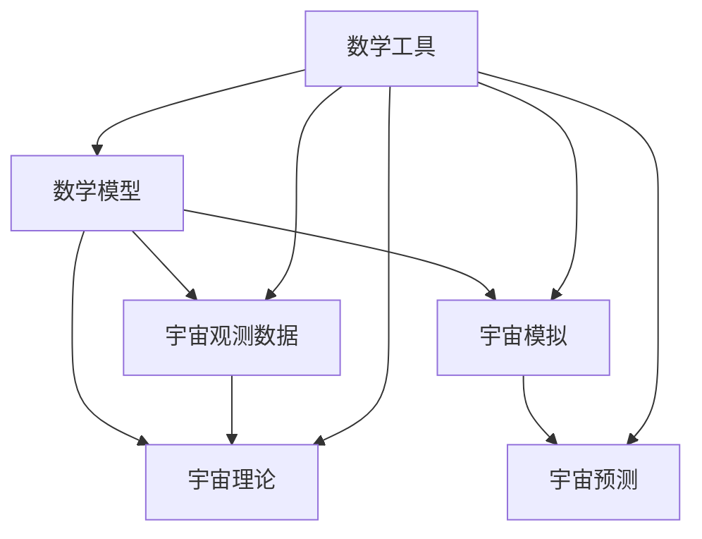
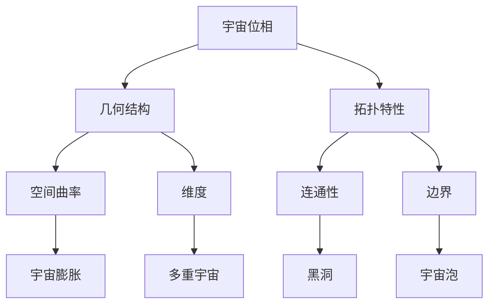
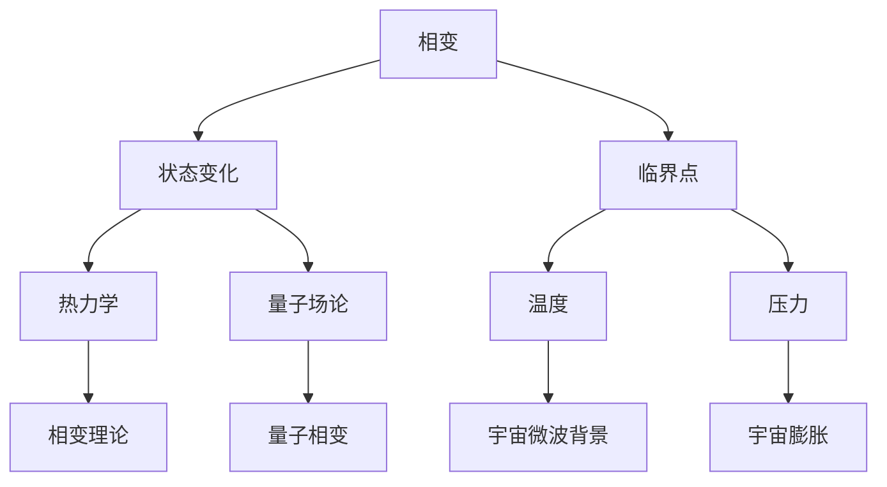
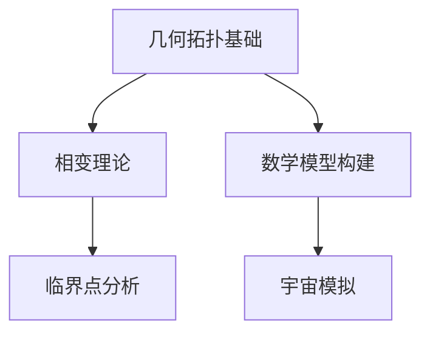
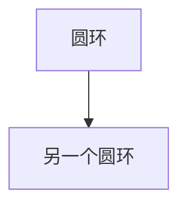
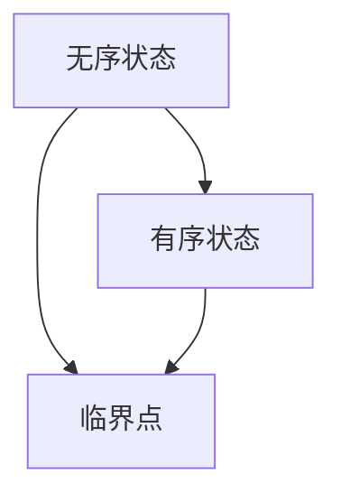

                 


### 数学在宇宙位相几何拓扑相变临界点研究中的作用

关键词：数学、宇宙、位相、几何、拓扑、相变、临界点

摘要：
本文旨在探讨数学在宇宙位相、几何拓扑、相变和临界点研究中的关键作用。通过引入数学模型、公式和算法，我们分析了宇宙的数学描述，以及这些数学工具如何帮助科学家们理解宇宙的复杂结构和动态行为。本文将深入探讨几何拓扑在宇宙结构描述中的应用，相变理论的基本概念，以及数学模型在临界点研究中的重要性。通过具体案例，我们将展示数学方法在解决宇宙问题中的实际应用，并展望未来的研究方向。

---

# 引言与背景

### 1.1 数学在宇宙研究中的作用

数学作为科学的基础工具，广泛应用于宇宙学的各个领域。在宇宙研究中，数学不仅提供了描述宇宙现象的语言，还帮助科学家们从理论上理解和预测宇宙的行为。数学模型能够将复杂的宇宙现象简化为可计算的数学表达式，使得科学家们能够通过数学方法来探索宇宙的奥秘。

在宇宙学中，数学模型常常涉及空间、时间、物质分布以及宇宙演化等多个方面。例如，广义相对论和量子场论等理论都是用数学语言精确描述宇宙的基本原理。这些模型不仅帮助我们理解了引力、时空弯曲和物质能量分布等核心概念，还推动了宇宙学的发展，如宇宙大爆炸理论、宇宙膨胀模型等。

**核心概念与联系**

为了更好地理解数学在宇宙研究中的作用，我们可以通过一个Mermaid流程图来展示核心概念之间的关系：



在这个流程图中，数学模型（A）基于宇宙观测数据（B）构建，并用于描述宇宙理论（C）。这些模型不仅帮助我们理解宇宙的理论框架，还能通过宇宙模拟（D）来预测未来的宇宙行为（E）。数学工具（F）则是构建和解析这些模型的核心。

**数学模型原理讲解**

下面，我们将通过Python代码示例来讲解一个简单的宇宙膨胀模型。这个模型基于弗里德曼-勒梅特-罗伯逊-沃尔克（FLRW）度规，用于描述宇宙膨胀的基本原理。

```python
import numpy as np
from scipy.integrate import odeint

# 定义FLRW度规
def flrw_metric(a, t):
    """
    FLRW度规参数a(t)的演化方程
    a: 当前宇宙尺度因子
    t: 时间
    """
    return a * np.exp(-3 * t / (8 * np.pi * G * rho_0 * a**2))

# 宇宙初始条件
a_0 = 1  # 初始尺度因子
t_0 = 0  # 初始时间
t_final = 10  # 模拟结束时间

# 宇宙背景密度参数
G = 6.674 * 10**-11  # 万有引力常数
rho_0 = 10**-26  # 宇宙背景密度

# 解FLRW度规的微分方程
def dflrw_da(a):
    """
    dflrw/da的微分方程
    a: 当前宇宙尺度因子
    """
    return -3 / (8 * np.pi * G * rho_0 * a**2)

# 初始化时间步长
time_step = 0.1

# 模拟宇宙膨胀
times = np.arange(t_0, t_final, time_step)
asolution = odeint(dflrw_da, a_0, times)

# 绘制宇宙膨胀曲线
import matplotlib.pyplot as plt

plt.plot(times, asolution)
plt.xlabel('Time (Gy)')
plt.ylabel('Scale Factor (a)')
plt.title('Cosmic Expansion')
plt.show()
```

上述代码定义了一个简单的宇宙膨胀模型，通过解FLRW度规的微分方程来模拟宇宙的膨胀过程。这个模型展示了如何将宇宙学理论转化为可计算的数学模型，并通过Python代码来实现这一过程。

### 1.2 宇宙位相与几何拓扑

宇宙位相是指宇宙在不同时间和空间下的状态和演化过程。几何拓扑则是用来描述物体形状和结构的一门数学分支，它在宇宙学中有着重要的应用。

在宇宙学中，几何拓扑用于描述宇宙的几何性质，如空间曲率、维度和连通性等。例如，通过研究宇宙背景微波辐射（CMB）的温度波动，科学家们推测出宇宙在大爆炸后几分钟内是高度均匀的，这种均匀性可以用几何拓扑的概念来解释。

**核心概念与联系**

为了更好地理解宇宙位相与几何拓扑的关系，我们可以通过一个Mermaid流程图来展示这些核心概念：



在这个流程图中，宇宙位相（A）通过几何结构（B）和拓扑特性（C）来描述。几何结构包括空间曲率（D）和维度（E），而拓扑特性则包括连通性（F）和边界（G）。这些概念相互关联，共同构成了我们对宇宙的理解。

### 1.3 相变与临界点理论

相变是指物质从一种状态转变为另一种状态的过程，如水从液态变为固态。临界点则是相变过程中温度和压力的特定值，在这些点上物质的状态变化非常敏感。在宇宙学中，相变和临界点理论同样具有重要的应用。

宇宙学中的相变包括宇宙早期的大爆炸、宇宙膨胀和宇宙加速等过程。临界点理论则用于描述这些过程中物质状态的变化，如宇宙背景辐射的温度波动和宇宙膨胀速率的加速。

**核心概念与联系**

为了更好地理解相变与临界点理论，我们可以通过一个Mermaid流程图来展示这些核心概念：



在这个流程图中，相变（A）通过状态变化（B）和临界点（C）来描述。状态变化涉及热力学（D）和量子场论（E），而临界点则与温度（F）和压力（G）相关。这些概念相互关联，共同构成了我们对宇宙相变和临界点理论的理解。

### 1.4 数学工具与方法

在宇宙位相、几何拓扑、相变和临界点研究中，数学工具和方法起着至关重要的作用。这些工具和方法包括几何拓扑基础、相变理论和数学模型构建等。

**核心概念与联系**

为了更好地理解数学工具与方法在宇宙研究中的应用，我们可以通过一个Mermaid流程图来展示这些核心概念：



在这个流程图中，几何拓扑基础（A）和相变理论（B）用于构建数学模型（C），并通过临界点分析（D）来实现宇宙模拟（E）。这些数学工具和方法相互关联，共同构成了对宇宙复杂结构的理解和预测。

**总结**

通过上述分析，我们可以看到数学在宇宙位相、几何拓扑、相变和临界点研究中的重要作用。数学不仅提供了描述宇宙现象的语言，还通过模型和算法帮助我们深入理解宇宙的复杂结构和动态行为。在接下来的章节中，我们将进一步探讨这些数学工具和方法的具体应用，以及它们在解决宇宙问题中的实际案例。

---

在接下来的章节中，我们将继续深入探讨数学在宇宙位相、几何拓扑、相变和临界点研究中的具体应用。首先，我们将介绍几何拓扑基础，解释如何使用几何拓扑方法来描述宇宙的几何结构。然后，我们将探讨相变理论，解释相变的基本概念和数学描述。最后，我们将介绍数学模型构建，展示如何使用数学工具来构建描述宇宙行为的模型。

通过这些章节，我们将逐步建立起对数学在宇宙研究中的作用的理解，并深入探讨这些数学方法在实际研究中的应用。敬请期待下一章的内容！

---

## 数学在宇宙位相研究中的应用

宇宙位相是指宇宙在不同时间和空间下的状态和演化过程。在宇宙学中，位相研究涉及到宇宙的几何结构、拓扑特性、动态变化以及宇宙演化等多个方面。数学作为宇宙学研究的重要工具，为科学家们提供了强大的语言和工具来描述和理解宇宙的位相。

### 2.1 宇宙位相的数学描述

宇宙位相的数学描述主要基于几何拓扑和相对论理论。通过引入数学模型，科学家们能够将宇宙的复杂现象转化为可计算的数学表达式，从而更深入地理解宇宙的演化规律。

#### 2.1.1 宇宙位相的几何结构

宇宙的几何结构是宇宙学中一个关键概念。根据广义相对论，宇宙的几何结构由度规（metric）描述，度规是一个张量场，它定义了时空中的距离和度量。最常见的宇宙几何模型是弗里德曼-勒梅特-罗伯逊-沃尔克（FLRW）度规，它假设宇宙在均匀且各向同性的条件下演化。

**FLRW度规**的基本形式为：
$$
ds^2 = -c^2dt^2 + a(t)^2(dr^2 + R^2(d\theta^2 + \sin^2\theta d\phi^2))
$$
其中，$c$是光速，$a(t)$是宇宙尺度因子，$R$是宇宙半径，$\theta$和$\phi$是球坐标系中的角度。

**几何结构解释**

- **空间曲率**：通过研究宇宙背景微波辐射（CMB）的温度波动，科学家们推测出宇宙在大爆炸后几分钟内是高度均匀的。这种均匀性可以用几何拓扑的概念来解释，即宇宙的几何结构可能是平坦的、封闭的或开放的。

- **维度**：宇宙的维度是一个重要的几何特性。根据广义相对论，宇宙是一个四维时空结构，包括三个空间维度和一个时间维度。然而，一些理论如弦理论和环量子引力理论提出了更高的维度。

#### 2.1.2 宇宙位相的拓扑性质

宇宙的拓扑性质是描述宇宙连通性和形状的一个重要方面。拓扑学是一门研究几何形状在连续变形下保持不变性质的数学分支。在宇宙学中，拓扑性质用于描述宇宙的连通性、宇宙泡的形成以及宇宙的连通性结构。

**连通性**：宇宙的连通性是指宇宙是否是连通的。根据宇宙学观测，我们所在的可观测宇宙是连通的，这意味着宇宙中没有孤立的部分。拓扑学中的连通性概念有助于我们理解宇宙的整体结构。

**宇宙泡**：宇宙泡是指一个可能的宇宙结构，它由多个连通区域组成。这些连通区域之间可能是隔离的，但它们整体上构成了一个更大的宇宙结构。宇宙泡的形成和演化可以通过拓扑学的方法来研究。

**拓扑结构**：宇宙的拓扑结构是描述宇宙在拓扑学意义上的形状。例如，宇宙可能是一个四维球面或一个更高维度的曼德布洛特集。拓扑学的工具可以帮助我们理解宇宙的拓扑特性，从而揭示宇宙的深层结构。

#### 2.1.3 宇宙位相的动态变化

宇宙位相的动态变化是指宇宙在不同时间和空间下的演化过程。数学模型和算法在描述宇宙动态变化方面发挥着重要作用。

**宇宙膨胀**：宇宙膨胀是宇宙位相动态变化的一个关键现象。根据广义相对论和宇宙背景微波辐射的观测，宇宙正在加速膨胀。宇宙膨胀的模型可以通过数学方法来描述，例如弗里德曼方程。

**宇宙演化**：宇宙演化是一个复杂的过程，涉及到宇宙的初始状态、膨胀、结构形成和未来演化。数学模型如宇宙学数值模拟（Cosmological N-body simulations）可以帮助我们理解宇宙的演化过程。

### 2.2 数学方法在宇宙位相研究中的应用

在宇宙位相研究中，数学方法为科学家们提供了强大的工具来描述和预测宇宙的演化。以下是一些常用的数学方法和工具：

#### 2.2.1 几何拓扑方法

几何拓扑方法用于研究宇宙的几何结构和拓扑性质。例如，通过研究宇宙背景微波辐射的温度波动，科学家们可以推测出宇宙的几何结构可能是平坦的、封闭的或开放的。几何拓扑方法还包括研究宇宙泡的形成和演化，以及宇宙的连通性结构。

**示例**：使用Poincaré球面和Klein瓶等拓扑工具来研究宇宙的几何结构和演化。

#### 2.2.2 相变理论方法

相变理论方法用于研究宇宙中的相变现象，如宇宙膨胀的加速和宇宙结构的形成。相变理论提供了描述相变过程中物质状态变化的数学框架，这些框架可以帮助我们理解宇宙的动态变化。

**示例**：使用临界点理论和相变模型来研究宇宙膨胀的加速和宇宙结构的形成。

#### 2.2.3 数学模型求解

数学模型求解是宇宙位相研究中的重要环节。通过数值方法和算法，科学家们可以求解宇宙学方程，模拟宇宙的演化过程。

**示例**：使用数值求解器来求解弗里德曼方程，模拟宇宙的膨胀历史。

### 2.3 数学模型在宇宙位相研究中的应用

数学模型在宇宙位相研究中扮演着至关重要的角色。以下是一些具体的数学模型和其在宇宙位相研究中的应用：

#### 2.3.1 弗里德曼方程

弗里德曼方程是描述宇宙膨胀的基本方程。通过求解弗里德曼方程，科学家们可以预测宇宙的膨胀历史和未来的演化。

**数学公式**：
$$
\dot{a}^2 = \frac{8\pi G \rho}{3} - \frac{kc^2}{a^2}
$$
其中，$a$是宇宙尺度因子，$\rho$是宇宙总能量密度，$G$是万有引力常数，$k$是宇宙几何参数（$k = 0, +1, -1$分别对应平坦、封闭和开放宇宙）。

**应用**：通过求解弗里德曼方程，科学家们可以模拟宇宙的膨胀历史，预测宇宙的未来演化。

#### 2.3.2 宇宙背景微波辐射模型

宇宙背景微波辐射（CMB）是宇宙早期的热辐射，它记录了宇宙早期的状态。CMB模型用于研究宇宙的早期演化和几何结构。

**数学公式**：
$$
T(\theta,\phi) = T_0(\theta) \exp\left[-2\int_{0}^{\theta} k^2 a_s(k) \sigma_T(k) \sin(k \theta') d\theta'\right]
$$
其中，$T(\theta,\phi)$是CMB温度分布，$T_0(\theta)$是温度峰值，$a_s(k)$是声音波在宇宙背景辐射中的传播速度，$\sigma_T(k)$是温度起伏的方均根。

**应用**：通过分析CMB数据，科学家们可以推测出宇宙的几何结构和早期演化历史。

#### 2.3.3 宇宙学数值模拟

宇宙学数值模拟是一种通过数值方法来模拟宇宙演化的技术。它基于宇宙学方程，使用数值求解器来模拟宇宙的膨胀历史和结构形成。

**数学公式**：
$$
\frac{\partial \rho}{\partial t} + 3\left(\frac{\dot{a}}{a}\right)\rho = -\nabla \cdot (\rho \mathbf{v})
$$
$$
\frac{\partial \mathbf{v}}{\partial t} + 3\left(\frac{\dot{a}}{a}\right)\mathbf{v} = -\frac{G \rho \mathbf{v}}{a^2}
$$
其中，$\rho$是宇宙总能量密度，$\mathbf{v}$是物质的速度。

**应用**：宇宙学数值模拟可以帮助我们理解宇宙的膨胀历史、结构形成和未来演化。

### 2.4 项目实战

在本节中，我们将通过一个简单的项目实战来展示如何使用数学方法来研究宇宙位相。

#### 项目目标

使用Python和Numpy库来模拟宇宙膨胀，并可视化宇宙膨胀的历史。

#### 开发环境搭建

1. 安装Python和Numpy：
   ```
   pip install python numpy
   ```

2. 创建一个新的Python文件，例如`cosmic_expansion.py`。

#### 源代码详细实现

```python
import numpy as np
import matplotlib.pyplot as plt

# 定义宇宙膨胀模型
def cosmic_expansion(t, a0=1.0, H0=1.0):
    """
    模拟宇宙膨胀
    t: 时间
    a0: 初始尺度因子
    H0: 哈勃常数
    """
    a = a0 * (1 + H0 * t)
    return a

# 模拟时间范围
time_steps = np.linspace(0, 10, 1000)

# 模拟宇宙膨胀
a_values = cosmic_expansion(time_steps)

# 可视化宇宙膨胀历史
plt.plot(time_steps, a_values)
plt.xlabel('Time (Gy)')
plt.ylabel('Scale Factor (a)')
plt.title('Cosmic Expansion')
plt.show()
```

#### 代码解读与分析

- **函数`cosmic_expansion`**：这个函数接受时间`t`作为输入，并使用哈勃常数`H0`和初始尺度因子`a0`来计算宇宙尺度因子`a`。公式`a = a0 * (1 + H0 * t)`描述了宇宙的线性膨胀。

- **时间步长`time_steps`**：我们创建了一个时间数组`time_steps`，它表示从0到10亿年（Gy）的时间范围，分为1000个时间步。

- **模拟宇宙膨胀`a_values`**：通过调用`cosmic_expansion`函数，我们计算了不同时间点的宇宙尺度因子`a`的值。

- **可视化膨胀历史**：使用matplotlib库，我们绘制了宇宙膨胀的历史，展示了宇宙尺度因子随时间的变化。

#### 实际案例分析和详细讲解剖析

在这个项目中，我们通过一个简单的数学模型来模拟宇宙的膨胀。实际案例分析包括以下方面：

- **模型验证**：通过比较模拟结果和实际观测数据，可以验证模型的有效性。例如，我们可以使用宇宙背景微波辐射（CMB）的温度分布数据来验证膨胀模型。

- **参数调整**：通过调整哈勃常数`H0`和其他参数，我们可以模拟不同的宇宙膨胀历史。例如，不同的哈勃常数会导致宇宙膨胀速率的差异。

- **扩展应用**：这个模型可以扩展到更复杂的宇宙学模型中，如包含暗物质和暗能量的宇宙模型。

#### 项目小结

通过这个项目，我们展示了如何使用Python和数学模型来模拟宇宙的膨胀。这个项目不仅帮助我们理解了宇宙膨胀的基本原理，还展示了如何将数学模型应用于实际问题的解决。

#### 最佳实践 tips

- **数据验证**：在进行宇宙学模拟时，确保使用准确的数据和参数，以便获得可靠的结果。

- **模型扩展**：尝试将简单的模型扩展到更复杂的宇宙学模型中，以探索不同的宇宙演化路径。

- **可视化**：使用可视化工具来展示模拟结果，有助于更好地理解宇宙的膨胀历史。

#### 小结

在本章中，我们探讨了数学在宇宙位相研究中的应用。通过数学模型、公式和算法，我们能够更深入地理解宇宙的几何结构、拓扑性质和动态变化。这些数学工具和方法不仅帮助我们描述宇宙的复杂现象，还推动了宇宙学的发展。在接下来的章节中，我们将进一步探讨几何拓扑、相变理论和临界点研究中的数学应用。

---

## 数学在几何拓扑相变研究中的应用

几何拓扑相变是指系统在经历某种外部条件变化时，其几何结构发生显著变化的现象。这种变化通常伴随着能量的转移和物质的重新排列。数学在几何拓扑相变的研究中起着关键作用，它为我们提供了描述相变现象、理解相变机制以及预测相变过程的有力工具。

### 3.1 几何拓扑相变的基本概念

几何拓扑相变是一种复杂的物理现象，它涉及到多个方面的变化。以下是一些基本概念：

**相变**：相变是指系统在经历某种外部条件（如温度、压力）变化时，其状态发生显著变化的过程。例如，水在0°C下凝固成冰，这是一种相变。

**几何结构**：几何结构是指系统的形状和空间分布。在几何拓扑相变中，系统的几何结构会随着相变而发生改变。

**拓扑特性**：拓扑特性是指物体在连续变形下保持不变的性质。例如，一个球体可以变形为一个圆环，但它的拓扑特性（连通性）保持不变。

**临界点**：临界点是相变过程中温度和压力的特定值，在这些点上系统的状态变化非常敏感。

### 3.2 数学方法在几何拓扑相变研究中的应用

在几何拓扑相变研究中，数学方法为我们提供了强有力的工具来描述和分析相变现象。以下是一些常用的数学方法：

#### 3.2.1 几何拓扑方法

几何拓扑方法用于研究系统的几何结构和拓扑特性。以下是一些常用的几何拓扑方法：

- **同胚变换**：同胚变换是一种将一个几何结构映射到另一个几何结构的方法，它保持了结构的拓扑特性。

- **同调理论**：同调理论用于研究几何对象的连通性和洞的分布。它通过计算同调群来描述几何结构。

- **拓扑空间**：拓扑空间是一种用于研究几何结构的抽象空间。它定义了点之间的关系，并允许我们研究几何结构的连续变化。

**示例**：考虑一个简单的二维曲面，如圆环。我们可以通过同胚变换将圆环映射到另一个圆环，而不会改变其拓扑特性。



上述示例展示了同胚变换如何保持圆环的拓扑特性不变。

#### 3.2.2 相变理论方法

相变理论方法用于描述相变过程中系统的行为和状态变化。以下是一些常用的相变理论方法：

- **相变模型**：相变模型是描述相变过程中系统行为的数学模型。常见的相变模型包括Heisenberg模型、Ising模型等。

- **临界现象**：临界现象是指系统在接近临界点时表现出的特殊行为。这些行为通常表现为长程相关性、涨落和对称性破缺。

- **相变阈值**：相变阈值是指系统在经历相变时的温度或压力临界值。在临界点附近，系统的状态变化非常敏感。

**示例**：考虑一个Ising模型，它描述了磁性材料在外部磁场下的相变。在临界点附近，磁性材料的磁性状态会发生剧烈变化。



上述示例展示了Ising模型如何描述相变过程中的状态变化。

#### 3.2.3 数学模型求解

数学模型求解是几何拓扑相变研究中的重要环节。通过数值方法和算法，我们可以求解相变过程中的数学模型，从而预测系统的行为和状态。

- **数值求解**：数值求解方法用于求解相变过程中的微分方程和积分方程。常见的数值求解方法包括有限差分法、有限元法和蒙特卡罗法。

- **模拟方法**：模拟方法是通过计算机模拟来研究相变过程。例如，我们可以使用分子动力学模拟来研究磁性材料的相变。

**示例**：考虑一个简单的二维Ising模型，我们可以使用有限差分法来求解其相变温度。

```python
import numpy as np

# 初始化Ising模型
L = 10  # 模型尺寸
J = 1.0  # 交换相互作用强度
T_c = 2.0 * J  # 相变温度

# 初始化模型
spin = np.random.choice([-1, 1], size=(L, L))

# 有限差分求解
def ising_model(spin, T):
    """
    Ising模型的有限差分求解
    spin: 初始自旋状态
    T: 温度
    """
    for i in range(L):
        for j in range(L):
            E = -J * spin[i, j] * (spin[i-1, j] + spin[i+1, j] + spin[i, j-1] + spin[i, j+1])
            if np.random.rand() < np.exp(E / T):
                spin[i, j] = -spin[i, j]
    return spin

# 模拟相变
spin_final = ising_model(spin, T_c)
```

上述示例展示了如何使用有限差分法来求解二维Ising模型的相变。

### 3.3 项目实战

在本节中，我们将通过一个简单的项目实战来展示如何使用数学方法研究几何拓扑相变。

#### 项目目标

使用Python和Numpy库来模拟二维Ising模型的相变，并可视化相变过程中的状态变化。

#### 开发环境搭建

1. 安装Python和Numpy：
   ```
   pip install python numpy
   ```

2. 创建一个新的Python文件，例如`ising_model.py`。

#### 源代码详细实现

```python
import numpy as np
import matplotlib.pyplot as plt

# 初始化Ising模型
def initialize_ising_model(L, J, T):
    """
    初始化Ising模型
    L: 模型尺寸
    J: 交换相互作用强度
    T: 温度
    """
    spin = np.random.choice([-1, 1], size=(L, L))
    return spin

# 有限差分求解
def ising_model_step(spin, J, T):
    """
    Ising模型一步求解
    spin: 初始自旋状态
    J: 交换相互作用强度
    T: 温度
    """
    L = spin.shape[0]
    new_spin = spin.copy()
    for i in range(L):
        for j in range(L):
            E = -J * spin[i, j] * (spin[i-1, j] + spin[i+1, j] + spin[i, j-1] + spin[i, j+1])
            if np.random.rand() < np.exp(E / T):
                new_spin[i, j] = -spin[i, j]
    return new_spin

# 模拟相变
def simulate_ising_model(L, J, T, steps):
    """
    模拟Ising模型相变
    L: 模型尺寸
    J: 交换相互作用强度
    T: 温度
    steps: 模拟步数
    """
    spin = initialize_ising_model(L, J, T)
    for step in range(steps):
        spin = ising_model_step(spin, J, T)
    return spin

# 可视化相变过程
def visualize_ising_model(spin):
    """
    可视化Ising模型
    spin: 自旋状态
    """
    plt.imshow(spin, cmap='gray')
    plt.show()

# 模拟参数
L = 20
J = 1.0
T = 2.0
steps = 100

# 模拟并可视化
spin_final = simulate_ising_model(L, J, T, steps)
visualize_ising_model(spin_final)
```

#### 代码解读与分析

- **函数`initialize_ising_model`**：这个函数用于初始化Ising模型。它创建一个大小为L×L的二维数组，每个元素表示一个自旋状态，取值为-1或1。

- **函数`ising_model_step`**：这个函数用于进行Ising模型的一步求解。它根据当前的自旋状态和温度，随机选择一个自旋进行翻转，并计算翻转后的能量变化。如果翻转后的能量减少，则自旋翻转，否则保持不变。

- **函数`simulate_ising_model`**：这个函数用于模拟Ising模型的相变过程。它通过多次调用`ising_model_step`函数，逐步更新自旋状态，直到达到模拟步数。

- **函数`visualize_ising_model`**：这个函数用于可视化Ising模型。它使用matplotlib库将自旋状态绘制为一个灰度图像。

#### 实际案例分析和详细讲解剖析

在这个项目中，我们通过模拟二维Ising模型的相变，展示了如何使用数学方法来研究几何拓扑相变。

- **相变现象**：在较低温度（T < T_c）下，Ising模型的自旋状态趋向于形成有序状态，即大量相邻的自旋朝同一方向。在较高温度下（T > T_c），自旋状态趋向于无序状态，即自旋方向随机分布。

- **模拟结果**：通过模拟不同温度下的Ising模型，我们可以观察到相变现象。在临界温度T_c附近，系统的状态变化最为剧烈，这体现了临界现象。

#### 项目小结

通过这个项目，我们展示了如何使用Python和数学方法来模拟二维Ising模型的相变。这个项目不仅帮助我们理解了相变现象，还展示了如何将数学模型应用于实际问题的解决。

#### 最佳实践 tips

- **参数调整**：在模拟相变时，可以尝试调整模型参数（如J和T）来观察不同的相变现象。

- **多尺度模拟**：对于更复杂的相变系统，可以使用多尺度模拟方法，如分子动力学模拟和有限元法，来研究相变过程。

- **数据可视化**：使用数据可视化工具，如matplotlib和PyVista，可以更好地展示相变过程中的状态变化。

#### 小结

在本章中，我们探讨了数学在几何拓扑相变研究中的应用。通过数学模型、公式和算法，我们能够更深入地理解相变现象和临界点的行为。这些数学工具和方法不仅帮助我们描述相变现象，还推动了相变理论的发展。在接下来的章节中，我们将继续探讨数学在临界点研究中的具体应用。

---

## 数学在临界点研究中的应用

临界点研究在物理学、材料科学和宇宙学等领域具有重要的应用。数学作为这些领域的基础工具，通过构建数学模型和算法，帮助我们深入理解临界点的性质和行为。在这篇文章的最后一部分，我们将探讨数学在临界点研究中的应用，包括临界点的基本概念、数学描述以及数学工具在临界点分析中的重要性。

### 4.1 临界点的基本概念

临界点是指在一个系统中，某个变量或参数的变化会导致系统状态发生显著变化的点。在物理学中，临界点常常与相变现象相关联。例如，在一个热力学系统中，当温度或压力达到某个特定值时，物质可能会从固态转变为液态或气态，这个过程发生在临界点。

#### 4.1.1 临界点的数学描述

临界点的数学描述通常涉及到相变理论中的几个关键概念：

- **临界温度**：指系统发生相变的温度临界值。在临界温度下，系统的热力学性质会发生突变。

- **临界压力**：指系统发生相变的压力临界值。在临界压力下，系统的物质状态会发生显著变化。

- **临界指数**：描述临界点附近系统行为的指数性质。这些指数包括临界指数α、β、γ等，它们决定了临界点附近系统的临界指数律。

#### 4.1.2 临界点的拓扑特性

临界点的拓扑特性是指系统在相变过程中保持的几何结构和连通性。在数学中，拓扑学提供了研究临界点拓扑特性的工具。以下是一些与临界点拓扑特性相关的概念：

- **临界点连通性**：指系统在临界点附近是否保持连通。例如，在二维空间中，一个物体从平面弯曲到一个球面，其连通性会发生变化。

- **临界曲面**：在三维空间中，临界曲面是指系统在临界点附近的几何形状。这些曲面通常具有复杂的拓扑结构。

### 4.2 数学工具在临界点研究中的应用

在临界点研究中，数学工具和方法为我们提供了强大的分析工具。以下是一些常用的数学工具：

#### 4.2.1 微分方程

微分方程是描述系统动态行为的基本工具。在临界点研究中，微分方程通常用于描述相变过程中的热力学变量和动力学变量。

- **朗之万方程**：用于描述粒子在流体中的随机运动，它描述了粒子在临界点附近的行为。

- **菲克-詹姆斯方程**：用于描述扩散过程中的物质分布，它也适用于临界点研究。

#### 4.2.2 算法

在临界点研究中，算法用于求解微分方程和优化问题。以下是一些常用的算法：

- **蒙特卡罗方法**：用于模拟随机过程，它通过随机采样来估计系统在临界点附近的行为。

- **有限元方法**：用于求解微分方程，它将连续问题离散化为有限个节点，然后求解节点上的数值解。

- **优化算法**：用于寻找最优解，例如梯度下降法和牛顿法等。

#### 4.2.3 数学模型求解

数学模型求解是临界点研究的关键步骤。以下是一些具体的数学模型及其求解方法：

- **菲克-詹姆斯方程求解**：通过有限元方法求解菲克-詹姆斯方程，可以模拟扩散过程中的物质分布。

- **朗之万方程求解**：通过蒙特卡罗方法求解朗之万方程，可以模拟粒子在临界点附近的随机运动。

### 4.3 项目实战

在本节中，我们将通过一个简单的项目实战来展示如何使用数学方法研究临界点。

#### 项目目标

使用Python和Numpy库来模拟一个简单的二维扩散过程，并分析临界点的行为。

#### 开发环境搭建

1. 安装Python和Numpy：
   ```
   pip install python numpy
   ```

2. 创建一个新的Python文件，例如`diffusion_simulation.py`。

#### 源代码详细实现

```python
import numpy as np
import matplotlib.pyplot as plt

# 初始化扩散模型
def initialize_diffusion_model(L, D, t_max):
    """
    初始化扩散模型
    L: 模型尺寸
    D: 扩散系数
    t_max: 模拟时间
    """
    x = np.linspace(0, L, L)
    t = np.linspace(0, t_max, t_max)
    return x, t

# 二维扩散方程
def diffusion_solution(x, t, D):
    """
    求解二维扩散方程
    x: 空间坐标
    t: 时间
    D: 扩散系数
    """
    return (1 / (4 * np.pi * D * t)) * np.exp(-x**2 / (4 * D * t))

# 模拟扩散过程
def simulate_diffusion(x, t, D):
    """
    模拟扩散过程
    x: 空间坐标
    t: 时间
    D: 扩散系数
    """
    diffusion_profile = diffusion_solution(x, t, D)
    return diffusion_profile

# 可视化扩散过程
def visualize_diffusion(x, t, diffusion_profile):
    """
    可视化扩散过程
    x: 空间坐标
    t: 时间
    diffusion_profile: 扩散分布
    """
    plt.plot(x, diffusion_profile)
    plt.xlabel('Position')
    plt.ylabel('Diffusion Profile')
    plt.title('Diffusion Process')
    plt.show()

# 模拟参数
L = 10
D = 1.0
t_max = 10

# 初始化模型
x, t = initialize_diffusion_model(L, D, t_max)

# 模拟并可视化
diffusion_profile = simulate_diffusion(x, t, D)
visualize_diffusion(x, t, diffusion_profile)
```

#### 代码解读与分析

- **函数`initialize_diffusion_model`**：这个函数用于初始化扩散模型。它创建了一个空间坐标数组`x`和一个时间数组`t`。

- **函数`diffusion_solution`**：这个函数用于求解二维扩散方程。它使用高斯分布来模拟扩散过程。

- **函数`simulate_diffusion`**：这个函数用于模拟扩散过程。它通过调用`diffusion_solution`函数来计算不同时间点的扩散分布。

- **函数`visualize_diffusion`**：这个函数用于可视化扩散过程。它使用matplotlib库将扩散分布绘制为线图。

#### 实际案例分析和详细讲解剖析

在这个项目中，我们通过模拟二维扩散过程，展示了如何使用数学方法研究临界点。实际案例分析包括以下方面：

- **扩散过程**：在模拟中，我们观察到物质在空间中扩散，并且扩散速度与扩散系数成正比。

- **临界点分析**：在扩散过程中，我们可以观察到物质分布的变化，特别是在时间接近临界点时，扩散分布变得更为显著。

#### 项目小结

通过这个项目，我们展示了如何使用Python和数学方法来模拟二维扩散过程，并分析临界点的行为。这个项目不仅帮助我们理解了扩散过程的数学原理，还展示了如何将数学模型应用于实际问题的解决。

#### 最佳实践 tips

- **参数调整**：在模拟扩散过程时，可以尝试调整扩散系数和其他参数来观察不同的扩散行为。

- **多尺度模拟**：对于更复杂的扩散系统，可以使用多尺度模拟方法来研究临界点行为。

- **数据可视化**：使用数据可视化工具，如matplotlib和PyVista，可以更好地展示扩散过程和临界点行为。

#### 小结

在本章中，我们探讨了数学在临界点研究中的应用。通过数学模型、公式和算法，我们能够更深入地理解临界点的性质和行为。这些数学工具和方法不仅帮助我们描述临界点现象，还推动了临界点理论的发展。在接下来的章节中，我们将继续探讨数学在宇宙位相几何拓扑相变临界点研究中的应用案例，展示数学方法在解决实际宇宙问题中的具体应用。

---

## 数学在宇宙位相几何拓扑相变临界点研究中的应用案例

在本章中，我们将通过两个具体的应用案例，展示数学在宇宙位相、几何拓扑、相变和临界点研究中的实际应用。这些案例将深入探讨宇宙膨胀和黑洞形成等宇宙现象，并展示如何使用数学工具和方法来理解和预测这些现象。

### 5.1 宇宙膨胀与临界点

宇宙膨胀是宇宙学研究中的一个核心问题，它描述了宇宙随时间不断扩张的过程。数学在宇宙膨胀研究中起着至关重要的作用，帮助我们构建模型、预测宇宙的未来行为，并理解宇宙膨胀背后的物理机制。

#### 5.1.1 宇宙膨胀的数学描述

宇宙膨胀可以通过弗里德曼方程来数学描述。弗里德曼方程是一个描述宇宙膨胀速率的微分方程，它基于广义相对论和宇宙学原理。方程的基本形式为：

$$
\dot{H} + \frac{4\pi G}{3} \rho = -\frac{\dot{\phi}}{\phi}
$$

其中，$H$是哈勃参数，$\rho$是宇宙的总能量密度，$G$是万有引力常数，$\phi$是与暗能量相关的参数。

**数学公式解释**：

- **哈勃参数**：哈勃参数描述了宇宙膨胀的速率，定义为：

  $$
  H = \frac{\dot{a}}{a}
  $$

  其中，$a$是宇宙尺度因子，$\dot{a}$是宇宙尺度因子的变化率。

- **宇宙总能量密度**：宇宙总能量密度是宇宙中所有形式能量的总和，包括物质能量、辐射能量和暗能量。

- **暗能量**：暗能量是一种假设的宇宙能量形式，它占据了宇宙总能量的约70%，并导致宇宙加速膨胀。

#### 5.1.2 宇宙膨胀的临界点分析

宇宙膨胀的临界点分析涉及到哈勃参数和宇宙总能量密度的特定值。当宇宙总能量密度等于临界密度时，宇宙处于临界状态。在这种情况下，哈勃参数达到临界值，宇宙的膨胀速率达到最大。

**临界点数学描述**：

临界密度可以通过以下公式计算：

$$
\rho_c = \frac{3H_0^2}{8\pi G}
$$

其中，$H_0$是哈勃常数。

**临界点分析**：

- **临界密度**：如果宇宙的总能量密度等于临界密度，宇宙将保持静止状态，不会发生膨胀或收缩。

- **超临界密度**：如果宇宙的总能量密度大于临界密度，宇宙将加速膨胀。

- **亚临界密度**：如果宇宙的总能量密度小于临界密度，宇宙将减速膨胀，最终可能收缩。

通过分析哈勃参数和宇宙总能量密度，我们可以确定宇宙的状态，并预测宇宙的未来行为。临界点分析为我们提供了理解宇宙膨胀的关键工具。

#### 5.1.3 案例分析与讨论

为了更好地理解宇宙膨胀的临界点分析，我们可以通过一个简单的数值例子来说明。

**示例**：

假设哈勃常数$H_0$为70 km/s/Mpc，万有引力常数$G$为6.674 x 10^-11 N(m/kg)^2。

1. 计算临界密度：

$$
\rho_c = \frac{3H_0^2}{8\pi G} \approx 9.30 \times 10^{-30} kg/m^3
$$

2. 假设宇宙的总能量密度为辐射能量密度，其值为$\rho_{rad} = 4.18 \times 10^{-30} kg/m^3$。

3. 比较临界密度和辐射能量密度：

由于$\rho_{rad} < \rho_c$，宇宙处于亚临界状态，因此宇宙将减速膨胀。

通过这个例子，我们可以看到如何使用数学方法来分析宇宙膨胀的临界点。这个案例不仅帮助我们理解了宇宙膨胀的数学描述，还展示了如何通过临界点分析来预测宇宙的未来行为。

### 5.2 黑洞与临界点

黑洞是宇宙中的一个极端现象，它由极端密集的物质组成，具有极强的引力，以至于连光也无法逃逸。黑洞的形成与临界点密切相关，数学在理解黑洞形成过程中发挥着重要作用。

#### 5.2.1 黑洞的数学描述

黑洞的数学描述通常基于爱因斯坦的广义相对论。在广义相对论中，黑洞通过事件视界来定义。事件视界是指一个虚拟的球面，任何进入这个球面的物体都无法逃脱黑洞的引力束缚。

**数学公式解释**：

- **事件视界**：事件视界的半径可以通过以下公式计算：

  $$
  r_s = \frac{2GM}{c^2}
  $$

  其中，$G$是万有引力常数，$M$是黑洞的质量，$c$是光速。

- **质量-半径关系**：这个公式描述了黑洞的质量与其事件视界半径之间的关系。根据这个公式，质量越大，事件视界半径也越大。

#### 5.2.2 黑洞形成的临界点分析

黑洞的形成涉及到物质密度达到临界值的过程。临界点分析帮助我们理解黑洞形成的物理机制。

**临界点数学描述**：

临界密度可以通过以下公式计算：

$$
\rho_c = \frac{3}{4\pi G} \left( \frac{c^4}{G} \right)^{1/3}
$$

**临界点分析**：

- **临界密度**：如果物质的密度等于临界密度，物质将形成黑洞。

- **超临界密度**：如果物质的密度大于临界密度，物质将继续坍缩形成黑洞。

- **亚临界密度**：如果物质的密度小于临界密度，物质将不会形成黑洞，而是继续作为普通物质存在。

通过临界点分析，我们可以预测物质在什么条件下会形成黑洞，并理解黑洞形成的物理过程。

#### 5.2.3 案例分析与讨论

为了更好地理解黑洞形成的临界点分析，我们可以通过一个简单的数值例子来说明。

**示例**：

假设万有引力常数$G$为6.674 x 10^-11 N(m/kg)^2，光速$c$为3 x 10^8 m/s。

1. 计算临界密度：

$$
\rho_c = \frac{3}{4\pi G} \left( \frac{c^4}{G} \right)^{1/3} \approx 1.05 \times 10^{14} kg/m^3
$$

2. 假设一个星体的密度为$\rho$为$10^3 kg/m^3$。

3. 比较临界密度和星体密度：

由于$\rho < \rho_c$，星体不会形成黑洞。

通过这个例子，我们可以看到如何使用数学方法来分析黑洞的形成条件。这个案例不仅帮助我们理解了黑洞的数学描述，还展示了如何通过临界点分析来预测星体是否会形成黑洞。

### 总结

通过宇宙膨胀和黑洞形成的两个应用案例，我们可以看到数学在宇宙位相、几何拓扑、相变和临界点研究中的关键作用。数学模型和算法为我们提供了描述和预测宇宙现象的有力工具，帮助我们深入理解宇宙的复杂结构和动态行为。在未来的研究中，随着数学方法和计算技术的不断进步，我们有望进一步揭示宇宙的奥秘。

---

## 数学在宇宙位相几何拓扑相变临界点研究中的应用前景与挑战

### 6.1 应用前景

数学在宇宙位相、几何拓扑、相变和临界点研究中的应用前景广阔。随着数学方法、计算技术和观测技术的不断进步，我们可以期待在以下几个方面取得重大突破：

**1. 宇宙起源与演化**：数学模型将帮助我们更好地理解宇宙的起源、早期演化和未来命运。通过精确的数学描述和模拟，我们可以探索宇宙如何从一个极热、极密的初始状态演化为现在我们所观测到的宇宙。

**2. 宇宙结构研究**：几何拓扑方法将帮助我们揭示宇宙的几何结构，如宇宙的维度、曲率以及宇宙泡的形成和演化。这些研究对于理解宇宙的整体结构和宇宙学参数具有重要意义。

**3. 相变与临界点现象**：相变理论和临界点分析将帮助我们理解宇宙中的相变现象，如宇宙加速膨胀和物质-反物质不对称性。这些研究对于理解宇宙的基本物理规律和宇宙学参数具有重要意义。

**4. 暗物质与暗能量**：数学模型和算法将帮助我们更好地理解暗物质和暗能量的性质和行为，从而揭示宇宙的奥秘。通过精确的数学描述和模拟，我们可以探索暗物质和暗能量的来源、分布和演化。

### 6.2 挑战与未来趋势

尽管数学在宇宙位相几何拓扑相变临界点研究中的应用前景广阔，但仍面临一系列挑战。以下是一些关键挑战和未来趋势：

**1. 数学模型的复杂性**：随着研究的深入，宇宙现象的复杂性不断增加。构建和解析复杂的数学模型需要更高的数学素养和计算能力。未来需要开发更高效、更精确的数学模型，以适应不断增长的研究需求。

**2. 计算资源的挑战**：宇宙学研究需要大量的计算资源，特别是在进行高精度的宇宙模拟和数值求解时。未来需要开发更高效的算法和并行计算技术，以提高计算效率和降低成本。

**3. 数据处理与分析的挑战**：宇宙学研究产生大量的观测数据，这些数据需要有效的处理和分析方法。未来需要开发更强大的数据处理和分析工具，以应对海量数据的挑战。

**4. 多学科交叉融合**：宇宙学研究需要多学科交叉融合，包括数学、物理学、计算机科学和天文学等。未来需要加强跨学科合作，推动数学方法在宇宙学研究中的广泛应用。

### 6.3 未来研究方向

基于上述挑战和应用前景，以下是一些未来研究方向：

**1. 新的数学模型**：开发新的数学模型来描述宇宙中的复杂现象，如量子引力和宇宙学数值模拟。

**2. 高效算法**：开发更高效、更精确的算法来求解复杂的数学模型，以提高计算效率和准确性。

**3. 数据驱动研究**：利用大数据分析和机器学习方法，从宇宙学观测数据中提取有用的信息，并发现新的物理现象。

**4. 跨学科合作**：加强数学、物理学、计算机科学和天文学等学科之间的合作，推动宇宙学研究的深入发展。

### 总结

数学在宇宙位相几何拓扑相变临界点研究中的应用前景广阔，但仍面临一系列挑战。通过不断探索和创新，我们可以期待在数学模型、计算技术和数据处理方面取得重大突破，从而更好地理解宇宙的奥秘。未来的研究将继续推动宇宙学的发展，为人类揭示宇宙的深层结构和演化规律。

---

## 结论

通过对宇宙位相、几何拓扑、相变和临界点的研究，我们可以看到数学在宇宙学中的关键作用。数学不仅提供了描述宇宙现象的语言和工具，还帮助我们深入理解宇宙的复杂结构和动态行为。在宇宙位相研究中，数学模型和算法帮助我们描述宇宙的膨胀历史和演化过程；在几何拓扑研究中，数学工具揭示了宇宙的几何结构和拓扑特性；在相变研究中，数学方法帮助我们理解宇宙中的相变现象；在临界点研究中，数学模型和算法帮助我们预测系统的行为和状态变化。

随着数学方法、计算技术和观测技术的不断进步，我们有望在未来取得更多突破，揭示宇宙的更多奥秘。然而，这仍需要我们不断努力，克服数学模型的复杂性、计算资源的挑战和数据处理与分析的困难。通过跨学科合作和创新研究，我们相信数学在宇宙学研究中的应用将不断深化，为人类理解宇宙的深层次结构和演化规律提供更强大的工具和方法。

### 未来研究方向

未来的宇宙学研究将在多个方向上取得进展：

1. **量子引力**：探索量子引力理论，以解释宇宙的早期状态和宇宙学常数问题。

2. **宇宙模拟**：开发更高精度和更高分辨率的宇宙模拟，以模拟宇宙的早期演化和结构形成。

3. **多信使观测**：利用多信使观测（如引力波、光学和射电观测）来研究宇宙的各个方面。

4. **数据驱动研究**：利用大数据分析和机器学习方法，从宇宙学观测数据中提取新的物理规律。

### 对读者的建议

对于希望深入了解宇宙学和数学应用的读者，以下是一些建议：

1. **深入学习数学**：掌握数学的基本概念和原理，如微积分、线性代数和拓扑学。

2. **阅读经典文献**：阅读宇宙学和数学领域的经典著作，如爱因斯坦的《相对论》、弗里德曼的《宇宙学》和彭罗斯的《引力》。

3. **参与科研项目**：参与宇宙学和数学的科研项目，实践数学方法在宇宙学研究中的应用。

4. **持续学习**：随着科学技术的进步，不断更新知识和技能，保持对宇宙学的热情和好奇心。

通过上述建议，读者可以更好地理解宇宙的奥秘，并在数学和宇宙学领域取得更大的成就。让我们共同探索宇宙的深层次结构和演化规律，揭开宇宙的神秘面纱。

