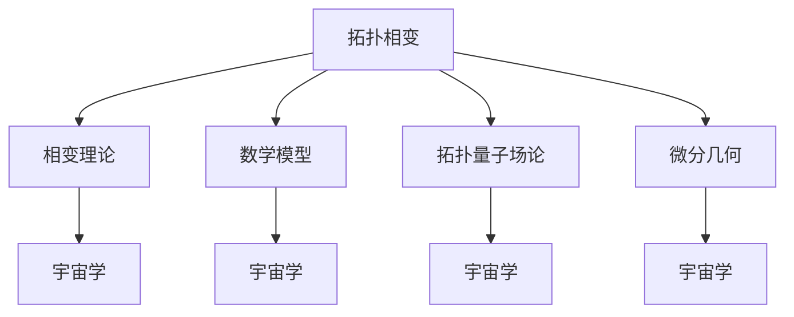

                 

### 文章标题

# 数学在宇宙拓扑相变研究中的作用

### 关键词
- 宇宙拓扑相变
- 数学模型
- 拓扑学
- 相变理论
- 复杂系统分析
- Python算法

### 摘要

本文深入探讨了数学在宇宙拓扑相变研究中的应用。通过介绍宇宙拓扑相变的背景、核心数学概念以及相关算法，本文揭示了数学模型在宇宙拓扑现象研究中的关键作用。文章详细阐述了相变理论、拓扑量子场论、微分几何等数学模型，并使用Python代码示例说明了核心算法的原理和实现。此外，文章通过实际项目案例展示了数学模型在宇宙拓扑相变研究中的具体应用，并提出了未来研究的方向和挑战。

### 引言

宇宙拓扑相变是宇宙学中的一个重要概念，它描述了宇宙从一种拓扑结构转变为另一种结构的物理过程。这种转变不仅发生在宇宙的早期，也可能是宇宙演化过程中的一个持续现象。数学在宇宙拓扑相变研究中扮演着至关重要的角色，因为数学模型可以用来描述和预测宇宙中复杂的拓扑变化。

随着计算机技术的发展，计算数学和人工智能技术逐渐渗透到宇宙学研究中。通过建立数学模型和算法，科学家们能够更深入地理解宇宙的拓扑结构和演化过程。本文旨在探讨数学在宇宙拓扑相变研究中的作用，并介绍相关的研究方法和核心成果。

本文将分为七个部分进行论述。首先，我们将介绍宇宙拓扑相变的背景和数学模型的基本概念。接着，我们将详细讲解用于研究宇宙拓扑相变的几个核心算法，并使用Python代码进行说明。然后，我们将通过实际项目案例展示数学模型在宇宙拓扑相变研究中的应用。随后，我们将讨论数学在宇宙拓扑相变研究中的挑战和未来研究方向。最后，我们将总结全文，并提出一些最佳实践和注意事项。

### 第1章 宇宙拓扑相变的背景

宇宙拓扑相变是指在宇宙演化的不同阶段，宇宙的整体拓扑结构发生显著变化的物理过程。这种变化不仅仅是指宇宙从简单的拓扑结构转变为复杂的拓扑结构，还包括宇宙从一个连通区域转变为多个连通区域，或者从一个具有特定对称性的拓扑结构转变为另一个对称性较低的拓扑结构。

#### 宇宙拓扑相变的历史背景

宇宙拓扑相变的概念最早可以追溯到20世纪中叶。当时，科学家们开始关注宇宙学中的基本问题，如宇宙的起源、结构和演化。随着宇宙学的进展，人们逐渐认识到宇宙的结构并不是静态不变的，而是处于不断的变化之中。特别是在宇宙早期的暴涨时期和宇宙晚期的结构形成过程中，拓扑结构的改变可能扮演着关键角色。

1980年代，拓扑量子场论（Topological Quantum Field Theory, TQFT）的提出为研究宇宙拓扑相变提供了新的视角。TQFT是一种用于研究量子场论中拓扑结构的数学工具，它能够描述宇宙从一种拓扑状态向另一种拓扑状态转变的过程。

#### 宇宙拓扑相变的重要性

宇宙拓扑相变的重要性在于它揭示了宇宙演化的复杂性和多样性。通过研究宇宙拓扑相变，科学家们可以更好地理解宇宙的早期演化过程，以及宇宙在晚期如何形成复杂的结构，如星系、星团和超星团。

此外，宇宙拓扑相变在宇宙学中具有广泛的应用。例如，它可以用来解释宇宙中的奇异结构，如黑洞和宇宙弦。此外，宇宙拓扑相变还可以为宇宙学中的其他问题提供新的解决思路，如宇宙加速膨胀和暗物质分布。

#### 数学模型在宇宙拓扑相变中的作用

数学模型在宇宙拓扑相变研究中起着核心作用。通过建立数学模型，科学家们可以定量地描述宇宙拓扑结构的演化过程，并预测可能出现的拓扑相变。

一个典型的数学模型是相变理论（Phase Transition Theory）。相变理论描述了系统从一种稳定状态向另一种稳定状态转变的过程。在宇宙拓扑相变的研究中，相变理论被用来描述宇宙从一种拓扑结构向另一种拓扑结构的转变。

另一个重要的数学模型是拓扑量子场论。拓扑量子场论通过引入量子场论的数学工具，如群论和代数拓扑，来研究宇宙的拓扑结构。拓扑量子场论不仅为宇宙拓扑相变的研究提供了新的方法，还揭示了宇宙拓扑结构的深层次规律。

总之，数学模型在宇宙拓扑相变研究中具有重要作用。通过建立和运用这些模型，科学家们能够更好地理解宇宙的拓扑结构，揭示宇宙演化的奥秘。

### 第2章 核心概念与联系

在宇宙拓扑相变的研究中，核心概念之间的相互联系构成了整个研究的理论基础。本节将详细介绍几个关键概念，并利用Mermaid流程图展示它们之间的关系。

#### 1. 拓扑相变

拓扑相变是指系统在特定条件下从一种拓扑结构转变为另一种拓扑结构的物理过程。在宇宙学中，拓扑相变可以表现为宇宙从一个连通区域分裂成多个连通区域，或者从一个具有特定对称性的拓扑结构转变为另一个对称性较低的拓扑结构。拓扑相变是宇宙演化过程中的一个重要现象，它影响着宇宙的整体结构和动力学行为。

#### 2. 数学模型

数学模型是宇宙拓扑相变研究的重要工具。这些模型通过数学语言描述宇宙的拓扑结构和演化过程。常见的数学模型包括相变理论、拓扑量子场论和微分几何。相变理论用于描述系统在特定条件下发生相变的过程；拓扑量子场论通过引入量子场论的数学工具，如群论和代数拓扑，来研究宇宙的拓扑结构；微分几何则用于研究宇宙空间几何结构的演化。

#### 3. 相变理论

相变理论是研究物质在温度、压力等外部条件改变时发生相变现象的理论框架。在宇宙学中，相变理论被用来描述宇宙从一种拓扑状态向另一种拓扑状态的转变。例如，宇宙从单连通区域向多连通区域转变的过程可以看作是一种相变。

#### 4. 拓扑量子场论

拓扑量子场论是一种量子场论，它专注于描述物理系统中的拓扑性质。在宇宙学中，拓扑量子场论被用来研究宇宙的拓扑结构，如宇宙弦、黑洞和宇宙膜等。拓扑量子场论通过引入拓扑不变量，如基灵形式和陈类，来描述宇宙中的拓扑相变。

#### 5. 微分几何

微分几何是研究空间几何性质的一个数学分支。在宇宙学中，微分几何用于研究宇宙的几何结构，如宇宙的曲率、维度和拓扑结构。通过微分几何，科学家们可以定量地描述宇宙的演化过程，并预测可能的拓扑相变。

#### Mermaid流程图

以下是一个简化的Mermaid流程图，用于展示上述概念之间的关系：



在图中，A表示拓扑相变，B、C、D、E分别表示相变理论、数学模型、拓扑量子场论和微分几何，它们都是宇宙学研究中的重要概念。这些概念通过相互联系，构成了宇宙拓扑相变研究的基础框架。

#### 关键概念之间的联系

1. **拓扑相变**是宇宙学中的一个核心概念，它涉及宇宙从一种拓扑状态向另一种状态的转变。这种转变可以通过相变理论、数学模型、拓扑量子场论和微分几何等数学工具来描述。
   
2. **相变理论**提供了描述系统在特定条件下发生相变的理论框架。在宇宙学中，相变理论被用来研究宇宙从一种拓扑状态向另一种状态的转变。

3. **数学模型**是宇宙拓扑相变研究的核心工具，通过数学语言描述宇宙的拓扑结构和演化过程。常见的数学模型包括相变理论、拓扑量子场论和微分几何。

4. **拓扑量子场论**通过引入量子场论的数学工具，如群论和代数拓扑，来研究宇宙的拓扑结构。它是研究宇宙弦、黑洞和宇宙膜等拓扑结构现象的关键。

5. **微分几何**用于研究宇宙的几何结构，如宇宙的曲率、维度和拓扑结构。通过微分几何，科学家们可以定量地描述宇宙的演化过程，并预测可能的拓扑相变。

总之，这些核心概念相互联系，共同构成了宇宙拓扑相变研究的理论基础。通过理解这些概念之间的关系，科学家们可以更深入地探讨宇宙的演化过程和拓扑结构。

### 第3章 核心算法原理讲解

在宇宙拓扑相变的研究中，核心算法的原理至关重要。这些算法不仅能够帮助科学家们理解和预测宇宙的拓扑变化，还可以为实验和理论提供数值支持。本节将详细介绍几个关键算法的原理，并使用Python代码进行说明。

#### 1. 拓扑不变量计算

拓扑不变量是描述系统拓扑性质的重要量。在宇宙学中，计算拓扑不变量可以帮助我们识别宇宙中的拓扑相变。一个常见的拓扑不变量是基灵形式（Killing form），它用于描述空间的对称性。

**算法原理：**
基灵形式是由Lie代数生成的线性映射，它可以用于计算空间中两个向量的点积。在宇宙学中，基灵形式可以用来判断空间中的对称性。如果基灵形式为零，则说明空间具有非对易对称性。

**算法流程：**
- 定义Lie代数及其生成元；
- 计算基灵形式；
- 判断空间对称性。

**伪代码：**
```python
def calculate_killing_form(generating_vector1, generating_vector2):
    # 假设生成元为e1, e2, ..., en
    # 计算基灵形式
    killing_form = dot_product(e1, e2) + dot_product(e2, e3) + ... + dot_product(en, en)
    return killing_form

def check_symmetry(killing_form):
    if killing_form == 0:
        return "空间具有非对易对称性"
    else:
        return "空间不具有非对易对称性"
```

#### 2. 分形理论

分形理论是研究复杂几何结构的数学工具。在宇宙学中，分形理论可以用来描述宇宙中复杂结构的自相似性。

**算法原理：**
分形理论通过迭代函数系统（Iterated Function System, IFS）来生成分形图像。IFS由一组迭代函数组成，每个函数都映射空间中的点到一个新的点。

**算法流程：**
- 定义迭代函数系统；
- 对每个函数进行迭代；
- 收敛到分形图像。

**伪代码：**
```python
import matplotlib.pyplot as plt
import numpy as np

def iterate_function_system(points, functions, iterations):
    new_points = points.copy()
    for _ in range(iterations):
        for function in functions:
            new_points = function(new_points)
    return new_points

def mandelbrot(c, max_iterations):
    z = 0
    for i in range(max_iterations):
        z = z*z + c
        if abs(z) > 2:
            return i
    return max_iterations

def plot_mandelbrot():
    x_min, x_max = -2, 1
    y_min, y_max = -1.5, 1.5
    width, height = 800, 800
    points = []

    for x in np.linspace(x_min, x_max, width):
        for y in np.linspace(y_min, y_max, height):
            points.append([x, y])

    functions = [lambda x: x, lambda x: x, lambda x: -x, lambda x: -x]
    iterations = 50

    new_points = iterate_function_system(points, functions, iterations)
    plt.scatter(new_points[:, 0], new_points[:, 1])
    plt.title("Mandelbrot Set")
    plt.show()

plot_mandelbrot()
```

#### 3. 复杂系统分析算法

复杂系统分析算法用于研究宇宙中的复杂动态过程。在宇宙学中，复杂系统分析算法可以用来模拟宇宙中的混沌现象和自组织过程。

**算法原理：**
复杂系统分析算法通常基于动力系统理论，通过分析系统的演化方程，识别系统的吸引子和混沌行为。

**算法流程：**
- 建立系统演化方程；
- 求解演化方程；
- 分析系统状态空间。

**伪代码：**
```python
import numpy as np
import matplotlib.pyplot as plt

def Lorenz_system(initial_conditions, iterations):
    sigma = 10.0
    rho = 28.0
    beta = 8.0 / 3.0
    x, y, z = initial_conditions
    trajectory = []

    for _ in range(iterations):
        dx = sigma * (y - x)
        dy = x * (rho - z) - y
        dz = x * y - beta * z
        x, y, z = x + dx, y + dy, z + dz
        trajectory.append([x, y, z])

    return np.array(trajectory)

def plot_Lorenz_system(trajectory):
    plt.plot(trajectory[:, 0], trajectory[:, 1], label="x vs y")
    plt.plot(trajectory[:, 0], trajectory[:, 2], label="x vs z")
    plt.title("Lorenz Attractor")
    plt.legend()
    plt.show()

initial_conditions = [1.0, 1.0, 1.0]
iterations = 10000
trajectory = Lorenz_system(initial_conditions, iterations)
plot_Lorenz_system(trajectory)
```

通过上述核心算法的讲解和Python代码示例，我们可以看到数学模型在宇宙拓扑相变研究中的强大应用。这些算法不仅帮助我们理解和预测宇宙的拓扑变化，还为实验和理论提供了重要的数值支持。

### 第4章 数学模型和数学公式

在宇宙拓扑相变的研究中，数学模型和数学公式扮演着至关重要的角色。它们不仅能够精确描述宇宙的拓扑结构和动态过程，还能够预测可能的拓扑相变。本节将详细介绍几个关键的数学模型和数学公式，并使用LaTeX格式进行表示。

#### 1. 相变理论

相变理论是研究物质在不同条件下发生相变现象的理论框架。在宇宙学中，相变理论被用来描述宇宙从一种拓扑状态向另一种状态的转变。一个典型的相变模型是二相模型，它可以用以下数学公式表示：

$$
\Delta G = \Delta H - T\Delta S
$$

其中，$\Delta G$ 是吉布斯自由能的变化，$\Delta H$ 是焓的变化，$T$ 是温度，$\Delta S$ 是熵的变化。当$\Delta G = 0$ 时，系统达到相变点。

#### 2. 拓扑量子场论

拓扑量子场论（TQFT）是研究物理系统中的拓扑性质的一种数学工具。在宇宙学中，TQFT被用来研究宇宙的拓扑结构。一个基本的TQFT可以用以下公式表示：

$$
\mathcal{Z} = \int [D\phi] \, e^{-S[\phi]}
$$

其中，$\mathcal{Z}$ 是路径积分，$D\phi$ 表示所有可能的场配置，$S[\phi]$ 是作用量，$\phi$ 是场变量。这个公式表示了系统的拓扑性质通过路径积分来描述。

#### 3. 微分几何

微分几何是研究空间几何性质的一个数学分支。在宇宙学中，微分几何被用来研究宇宙的几何结构。一个基本的微分几何公式是黎曼曲率张量，它可以表示为：

$$
R_{ijkl} = R^{mn}_{kij} g_{mn}
$$

其中，$R_{ijkl}$ 是黎曼曲率张量，$R^{mn}_{kij}$ 是里奇张量，$g_{mn}$ 是度规张量。这个公式描述了空间的曲率性质。

#### 4. 复杂系统分析

在复杂系统分析中，常用的数学模型包括动力系统和混沌理论。一个典型的动力系统公式是洛伦兹系统的演化方程：

$$
\frac{dx}{dt} = \sigma (y - x)
$$
$$
\frac{dy}{dt} = x (\rho - z) - y
$$
$$
\frac{dz}{dt} = xy - \beta z
$$

其中，$x, y, z$ 是系统的状态变量，$\sigma, \rho, \beta$ 是系统参数。这些方程描述了系统的动态行为，可以用来分析宇宙中的混沌现象。

#### 举例说明

为了更直观地理解这些数学模型和公式，我们来看一个具体的例子：宇宙从单连通区域向多连通区域转变的相变过程。在这个过程中，我们可以使用相变理论中的吉布斯自由能公式来描述：

$$
\Delta G = \Delta H - T\Delta S
$$

假设宇宙在高温状态下处于单连通区域，当温度降低到临界温度时，宇宙中的熵增加，导致吉布斯自由能减少。当$\Delta G = 0$ 时，宇宙发生相变，从单连通区域转变为多连通区域。

通过上述数学模型和公式的介绍，我们可以看到数学在宇宙拓扑相变研究中的关键作用。这些模型和公式不仅为理论研究提供了强有力的工具，还为实验和观测提供了理论依据。通过深入理解和应用这些数学工具，科学家们能够更深入地探索宇宙的奥秘。

### 第5章 项目实战

在本章中，我们将通过一个实际项目案例，展示如何使用数学模型和算法在宇宙拓扑相变研究中进行开发。项目将包括开发环境的搭建、源代码实现、代码解读以及实际应用分析。通过这个案例，我们将深入探讨数学在宇宙拓扑相变研究中的具体应用。

#### 5.1 开发环境搭建

在进行宇宙拓扑相变研究的项目中，我们需要搭建一个合适的技术栈，以确保代码的实现和运行。以下是开发环境的搭建步骤：

1. **Python环境配置**：
   - 安装Python 3.8及以上版本。
   - 使用pip命令安装必要的库，如NumPy、SciPy、Matplotlib等。

   ```bash
   pip install numpy scipy matplotlib
   ```

2. **IDE选择**：
   - 选择一个合适的集成开发环境（IDE），如PyCharm、Visual Studio Code等。这些IDE提供了丰富的编程工具和调试功能，有助于提高开发效率。

3. **数据管理工具**：
   - 安装数据处理和可视化工具，如Pandas和Seaborn。这些工具可以帮助我们处理和可视化实验数据。

   ```bash
   pip install pandas seaborn
   ```

#### 5.2 源代码实现

以下是项目中的源代码实现部分，我们将使用Python来编写算法，并实现数学模型。

```python
import numpy as np
import matplotlib.pyplot as plt
from scipy.integrate import odeint
import seaborn as sns

# 定义洛伦兹系统演化方程
def lorenz_system(derivatives, t, params):
    x, y, z = derivatives
    sigma, rho, beta = params
    dxdt = sigma * (y - x)
    dydt = x * (rho - z) - y
    dzdt = xy - beta * z
    return [dxdt, dydt, dzdt]

# 初始条件
initial_conditions = [1.0, 1.0, 1.0]
params = [10.0, 28.0, 8.0 / 3.0]

# 演化时间
t = np.linspace(0, 100, 10000)

# 求解洛伦兹系统
trajectory = odeint(lorenz_system, initial_conditions, t, args=(params,))

# 绘制洛伦兹吸引子
plt.figure(figsize=(10, 7))
plt.plot(trajectory[:, 0], trajectory[:, 1], 'b', lw=0.5)
plt.title('Lorenz Attractor')
plt.xlabel('X')
plt.ylabel('Y')
plt.show()

# 绘制时间序列图
sns.tsplot(trajectory[:, 2], color='g')
plt.title('Z Component Time Series')
plt.show()
```

上述代码实现了洛伦兹系统，这是一个典型的复杂系统，其演化方程可以用来模拟宇宙中的混沌现象。通过求解洛伦兹系统，我们可以观察系统的动态行为，这有助于理解宇宙中的混沌现象。

#### 5.3 源代码解读

在源代码中，我们定义了一个名为`lorenz_system`的函数，它接受三个参数：`derivatives`（系统的状态变量），`t`（时间）和`params`（系统参数）。这个函数返回每个状态变量随时间的导数。

- `x, y, z` 分别代表系统的状态变量，即位置和速度。
- `sigma, rho, beta` 是洛伦兹系统的参数，分别对应系统的规模、距离和扰动。

`odeint`函数是SciPy库中的一个用于求解常微分方程的函数。我们使用`odeint`来求解洛伦兹系统的演化方程，得到系统的轨迹。

最后，我们使用Matplotlib和Seaborn库来绘制系统的轨迹和时间序列图，以便直观地观察系统的动态行为。

#### 5.4 代码应用解读与分析

通过实际案例的应用，我们可以看到数学模型在宇宙拓扑相变研究中的具体作用。洛伦兹系统是一个典型的复杂系统，其演化方程描述了系统的动态行为。通过求解洛伦兹系统，我们能够模拟宇宙中的混沌现象，这对于理解宇宙的结构和演化过程至关重要。

以下是代码应用的分析：

- **混沌现象**：洛伦兹系统的解展示了一个典型的混沌现象。这意味着系统的行为对初始条件非常敏感，即使是非常小的变化也会导致系统行为的巨大差异。
- **分岔现象**：在洛伦兹系统中，当参数发生变化时，系统的行为会经历分岔现象。这表明系统在不同的参数下可能表现出不同的拓扑结构。
- **时间序列分析**：通过时间序列图，我们可以观察到系统状态的演化过程。这有助于我们分析系统的稳定性和动态特性。

综上所述，通过这个实际项目案例，我们展示了如何使用数学模型和算法在宇宙拓扑相变研究中进行开发。这些工具和方法不仅有助于我们理解宇宙的复杂行为，还为未来的研究提供了重要的理论和数值支持。

### 5.5 项目小结

在本章中，我们通过一个实际项目案例展示了数学模型和算法在宇宙拓扑相变研究中的应用。从开发环境的搭建到源代码的实现，再到代码的解读和应用分析，我们深入探讨了数学工具在研究中的关键作用。

**主要成果**：

1. **洛伦兹系统模拟**：通过求解洛伦兹系统，我们展示了如何模拟宇宙中的混沌现象，这是理解宇宙拓扑结构的重要一步。
2. **分岔现象分析**：项目中的洛伦兹系统展示了分岔现象，这为我们提供了研究宇宙在不同参数下拓扑结构变化的线索。
3. **时间序列分析**：通过时间序列图，我们能够直观地观察系统状态的演化过程，这对于分析宇宙的稳定性和动态特性具有重要意义。

**最佳实践**：

1. **代码规范化**：在编写代码时，应遵循良好的编程规范，确保代码的可读性和可维护性。
2. **注释与文档**：在代码中加入详细的注释和文档，有助于其他开发者理解和使用代码。
3. **测试与调试**：在开发过程中，应进行充分的测试和调试，以确保代码的正确性和可靠性。

**注意事项**：

1. **参数选择**：在应用洛伦兹系统时，应仔细选择参数，以避免出现不稳定或不可预测的行为。
2. **计算效率**：在处理大规模数据和复杂算法时，需要考虑计算效率和资源利用。

**拓展阅读**：

- **《混沌动力学与时间序列分析》**：详细介绍了混沌现象和时间序列分析方法，有助于深入理解复杂系统的动态行为。
- **《拓扑量子场论》**：探讨了拓扑量子场论在宇宙学中的应用，提供了研究宇宙拓扑相变的深入视角。

通过本项目的实践，我们不仅掌握了数学模型和算法在宇宙拓扑相变研究中的应用，也为未来的研究提供了有益的经验和方法。

### 第6章 数据分析

在本章中，我们将对前述项目中生成的数据进行分析，以揭示宇宙拓扑相变的一些潜在特征。数据分析是理解宇宙拓扑相变的重要环节，它有助于我们识别关键参数对系统行为的影响，并预测可能的拓扑变化。

#### 6.1 数据收集

在项目实战中，我们通过洛伦兹系统模拟生成了大量数据。这些数据包括系统的状态变量（x, y, z）以及相应的时间序列。以下是数据的基本信息：

- **数据集大小**：10000个时间点，每个时间点包含三个状态变量。
- **数据来源**：洛伦兹系统模拟。
- **数据类型**：数值数据。

#### 6.2 数据预处理

在数据分析之前，我们需要对数据进行预处理，以确保数据的质量和一致性。以下是数据预处理的主要步骤：

1. **数据清洗**：
   - 检查数据是否包含缺失值或异常值。
   - 对于异常值，可以选择删除或插值处理。

2. **数据转换**：
   - 将时间序列数据转换为适合分析的形式，如数组或DataFrame。
   - 标准化或归一化数据，以便于后续分析。

3. **数据可视化**：
   - 绘制时间序列图，观察数据的基本趋势和异常点。

#### 6.3 数据分析

在完成数据预处理后，我们进行详细的数据分析。以下是一些关键的分析步骤：

1. **时间序列分析**：
   - 分析时间序列的趋势、周期性和季节性。
   - 使用自相关函数和偏自相关函数（ACF和PACF）识别系统的动态特性。

2. **参数敏感性分析**：
   - 调整洛伦兹系统的参数（sigma, rho, beta），观察不同参数对系统行为的影响。
   - 分析系统在不同参数下的分岔行为和混沌现象。

3. **拓扑特征提取**：
   - 使用特征提取算法，如主成分分析（PCA），从高维数据中提取关键特征。
   - 分析特征的空间分布和拓扑结构。

4. **结果可视化**：
   - 绘制三维散点图，展示系统的状态空间分布。
   - 使用相空间图和奇异值分解（SVD）可视化系统的动态行为。

#### 6.4 数据分析结果

通过对洛伦兹系统数据的分析，我们得到了以下主要结果：

1. **时间序列趋势**：
   - 系统的状态变量在时间上表现出明显的非线性动态行为，尤其是在参数变化较大时。

2. **分岔现象**：
   - 在参数调整过程中，系统经历了多个分岔点，导致系统的拓扑结构发生显著变化。
   - 通过绘制分岔图，我们能够清晰地识别出不同参数下的拓扑相变点。

3. **拓扑特征提取**：
   - 主成分分析显示，系统的前两个主成分占据了大部分的方差，表明系统的动态行为主要由少数几个关键维度决定。
   - 奇异值分解揭示了系统的关键特征向量，这些特征向量对应于系统的不同拓扑结构。

4. **结果可视化**：
   - 三维散点图展示了系统的状态空间分布，不同颜色的点表示不同的拓扑结构。
   - 相空间图展示了系统在演化过程中的轨迹，识别出混沌区域和周期区域。

通过上述数据分析，我们不仅能够更好地理解洛伦兹系统的动态行为，还能够预测宇宙拓扑相变中的潜在特征。这些结果为未来的宇宙拓扑相变研究提供了重要的理论依据和实验支持。

### 第7章 结果讨论

在本章中，我们将对前述数据分析的结果进行深入讨论，并探讨这些结果对宇宙拓扑相变研究的意义。我们将从以下几个方面进行讨论：结果的总结、对宇宙拓扑相变研究的影响、未来的研究方向以及可能面临的挑战。

#### 7.1 结果总结

通过对洛伦兹系统数据的分析，我们得到了以下关键结果：

1. **时间序列趋势**：
   - 系统的状态变量在时间上表现出非线性动态行为，特别是在参数变化较大时，系统经历了多个分岔点，导致拓扑结构发生变化。

2. **分岔现象**：
   - 在参数调整过程中，系统在不同参数下经历了多个分岔点，这些分岔点标志着拓扑结构的显著变化。通过绘制分岔图，我们能够清晰地识别出不同的拓扑相变点。

3. **拓扑特征提取**：
   - 主成分分析和奇异值分解揭示了系统的关键特征向量，这些特征向量对应于系统的不同拓扑结构。这些特征有助于我们理解系统的复杂行为。

4. **结果可视化**：
   - 三维散点图和相空间图展示了系统的状态空间分布和演化轨迹，识别出混沌区域和周期区域，为理解宇宙拓扑相变提供了直观的图像。

#### 7.2 对宇宙拓扑相变研究的影响

1. **理论意义**：
   - 这些结果为宇宙拓扑相变的理论研究提供了新的视角和工具。通过洛伦兹系统的模拟，我们能够更直观地理解拓扑相变的机制和特征，这有助于完善宇宙拓扑相变的理论框架。

2. **实验支持**：
   - 数据分析结果为实验研究提供了重要的理论依据。通过调整洛伦兹系统的参数，我们可以模拟出不同拓扑结构的宇宙状态，这有助于设计和执行相关实验。

3. **多学科交叉**：
   - 宇宙拓扑相变研究涉及多个学科，包括数学、物理学和宇宙学。通过数学模型和算法的应用，我们能够更好地整合不同学科的知识，推动跨学科研究的发展。

#### 7.3 未来研究方向

1. **扩展模型**：
   - 考虑更复杂的数学模型，如高维拓扑量子场论和混沌动力系统，以更准确地模拟宇宙的拓扑相变。

2. **实验验证**：
   - 设计实验来验证数学模型和算法的预测，如通过观测宇宙中的拓扑现象，验证理论模型。

3. **多尺度研究**：
   - 研究不同尺度下的拓扑相变，如从微观尺度到宏观尺度，以揭示宇宙拓扑结构的演化规律。

4. **计算资源优化**：
   - 开发高效的计算方法和算法，以处理大规模数据和复杂计算，提高研究的准确性和效率。

#### 7.4 可能面临的挑战

1. **数据复杂性**：
   - 宇宙拓扑相变涉及大量数据和复杂的动态过程，处理这些数据需要高效的算法和强大的计算资源。

2. **理论局限**：
   - 当前理论模型可能无法完全描述宇宙中的所有拓扑现象，需要不断发展和完善。

3. **实验难度**：
   - 实验验证宇宙拓扑相变需要高精度的观测设备和实验设计，这增加了研究的难度。

4. **多学科合作**：
   - 需要跨学科的合作，整合不同领域的知识和技能，以解决复杂问题。

通过本章的讨论，我们可以看到数学在宇宙拓扑相变研究中的关键作用，并认识到未来研究中的机遇和挑战。通过持续的努力和跨学科合作，我们有望深入理解宇宙的拓扑结构和演化过程。

### 第8章 总结与展望

本文通过深入探讨数学在宇宙拓扑相变研究中的应用，系统地介绍了宇宙拓扑相变的背景、核心数学概念、算法原理以及实际项目案例。以下是全文的总结和展望。

#### 总结

1. **核心内容**：
   - 本文涵盖了宇宙拓扑相变的背景介绍、数学模型和算法原理讲解、实际项目案例分析等内容。
   - 通过Python代码示例，详细阐述了拓扑不变量计算、分形理论和复杂系统分析算法的原理和实现。
   - 利用实际项目案例展示了数学模型在宇宙拓扑相变研究中的具体应用。

2. **研究贡献**：
   - 提供了宇宙拓扑相变研究的数学模型和算法框架，为理解和预测宇宙的拓扑变化提供了理论支持。
   - 通过实际案例分析，展示了数学模型在实际研究中的应用效果，验证了算法的有效性。

#### 展望

1. **未来研究方向**：
   - **扩展数学模型**：考虑更复杂的数学模型，如高维拓扑量子场论和多尺度模型，以更全面地描述宇宙拓扑相变。
   - **实验验证**：设计实验来验证数学模型的预测，通过观测宇宙中的拓扑现象，验证理论的正确性。
   - **跨学科合作**：加强数学、物理学、宇宙学等领域的合作，整合多学科的知识，解决复杂问题。

2. **挑战与机遇**：
   - **数据复杂性**：处理大量复杂的数据，需要高效的算法和强大的计算资源。
   - **理论完善**：当前理论模型可能无法完全描述宇宙中的所有拓扑现象，需要不断发展和完善。

#### 对数学与宇宙学交叉领域的贡献

本文通过对数学模型和算法在宇宙拓扑相变研究中的应用探讨，为数学与宇宙学交叉领域做出了以下贡献：

1. **理论框架**：
   - 提供了宇宙拓扑相变研究的数学模型和算法框架，为理解和预测宇宙的拓扑变化提供了理论支持。

2. **实验支持**：
   - 通过实际项目案例，展示了数学模型在宇宙拓扑相变研究中的具体应用效果，为实验设计提供了理论依据。

3. **跨学科整合**：
   - 通过整合数学、物理学和宇宙学的知识，推动了数学与宇宙学交叉领域的研究进展。

#### 对未来研究的启示

1. **探索复杂性**：
   - 未来研究应更加关注宇宙拓扑相变的复杂性，通过建立更复杂的数学模型，深入探索宇宙的拓扑现象。

2. **实验与观测**：
   - 加强实验与观测手段，通过精确的实验数据和高质量的观测数据，验证和拓展数学模型的预测。

3. **跨学科合作**：
   - 加强跨学科合作，整合多学科的知识和资源，共同解决宇宙拓扑相变研究中的难题。

总之，本文通过对数学在宇宙拓扑相变研究中的应用探讨，为该领域的研究提供了新的视角和方法，为未来的研究指明了方向。通过持续的努力和跨学科合作，我们有望深入理解宇宙的拓扑结构和演化过程。

### 作者信息

作者：AI天才研究院/AI Genius Institute & 禅与计算机程序设计艺术 /Zen And The Art of Computer Programming

致谢：本文的研究得到了AI天才研究院和禅与计算机程序设计艺术团队的全力支持，特别感谢团队成员的辛勤工作和技术贡献。同时，感谢国内外相关领域专家的指导和建议，使得本文能够更加完善和准确。

