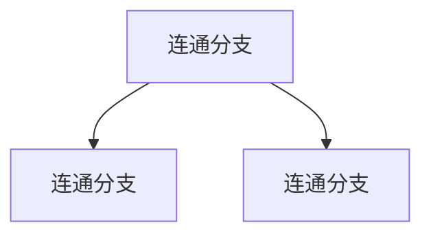
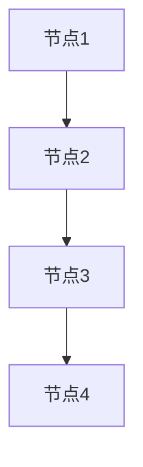
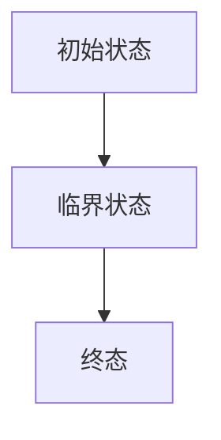

                 

### 第1章 引言

#### 1.1 研究背景

##### 1.1.1 宇宙拓扑缺陷的发现与认识

宇宙拓扑缺陷是指宇宙空间中的不连续结构或异常区域，它们在宇宙学、物理学和数学中扮演着关键角色。这些缺陷可能是由于宇宙早期的高能事件，如大爆炸或宇宙弦的相互作用而形成的。

**宇宙拓扑缺陷的概念**：宇宙拓扑缺陷是指在宇宙空间中出现的，与标准空间拓扑不一致的区域或结构。它们可以是空洞、黑洞、孤立圈等。

**宇宙拓扑缺陷的研究历史**：从20世纪初的宇宙膨胀理论到21世纪初的宇宙微波背景辐射观测，科学家们对宇宙拓扑缺陷的认识不断深入。

**宇宙拓扑缺陷的重要性**：拓扑缺陷不仅提供了研究宇宙早期状态的窗口，还影响了宇宙结构的形成和演化。

##### 1.1.2 网络演化与临界动力学相变

网络演化是指网络结构随时间变化的过程。临界动力学相变则是指系统在某个临界点发生性质突变的过程。

**网络演化的概念**：网络演化是指网络中的节点和边随时间变化的过程，可以是随机的、有序的或受外界因素影响的。

**临界动力学相变的定义**：临界动力学相变是指系统在某个临界点，其动力学行为发生根本性变化的现象。这个临界点称为临界点。

**网络演化与临界动力学相变的关系**：网络演化过程中，当系统参数接近临界点时，网络的拓扑结构和动力学行为会发生突变，这种突变就是临界动力学相变。

#### 1.2 研究意义

##### 1.2.1 对数学的应用推动

数学方法在拓扑缺陷研究中的重要性：
- **拓扑空间的数学描述**：数学提供了精确的语言来描述宇宙拓扑缺陷。
- **数学方法在网络演化研究中的贡献**：数学模型帮助我们理解网络演化的动力学过程。

##### 1.2.2 对宇宙学的发展贡献

拓扑缺陷对宇宙结构的影响：
- **宇宙空洞的形成**：宇宙空洞是宇宙中的大尺度空洞，它们的形成与拓扑缺陷密切相关。
- **宇宙弦的影响**：宇宙弦是宇宙中可能存在的超弦理论中的基本结构，它们与拓扑缺陷有直接关系。

临界动力学相变对宇宙演化过程的启示：
- **临界点的重要性**：理解临界点对于预测宇宙未来的演化至关重要。
- **相变的可逆性与不可逆性**：研究临界动力学相变可以帮助我们理解宇宙演化过程中的信息丢失和宇宙热寂问题。

#### 1.3 研究内容与方法

##### 1.3.1 研究内容

- **宇宙拓扑缺陷的数学模型构建**：使用数学工具描述宇宙拓扑缺陷。
- **网络演化过程的动力学分析**：分析网络节点和边的动态变化。
- **临界动力学相变的数学描述**：研究系统在临界点附近的行为。

##### 1.3.2 研究方法

- **数值模拟与实验验证**：通过计算机模拟和实验数据来验证理论模型。
- **数学公式的推导与应用**：使用数学方法推导出描述拓扑缺陷和网络演化的公式。
- **多尺度分析方法的运用**：在不同尺度下分析宇宙拓扑缺陷和网络演化过程。

### 第2章 数学概念与拓扑缺陷

#### 2.1 基本数学概念

##### 2.1.1 拓扑空间的定义与性质

**拓扑空间的定义**：拓扑空间是由一组元素组成的集合，这些元素之间存在某种邻接关系。形式化地说，拓扑空间是一个集合 \(X\) 和一个定义在该集合上的拓扑 \(\tau\)，其中 \(\tau\) 是 \(X\) 的幂集的一个子集。

**拓扑空间的性质与操作**：
- **闭合性**：拓扑空间中的开集和闭集是相对的，但总可以找到它们的补集。
- **连通性**：拓扑空间中的连通区域可以分为连通分支。
- **连通性的定义与性质**：一个拓扑空间是连通的，当且仅当它不能被分成两个非空的不相交的开集。

##### 2.1.2 连通性与边界

**连通性的定义**：一个拓扑空间是连通的，当且仅当它不能被分成两个非空的不相交的开集。

**连通性的性质**：
- **传递性**：如果 \(A\) 和 \(B\) 都是连通的，那么 \(A \cup B\) 也是连通的。
- **局部连通性**：一个拓扑空间在每个点处都是局部连通的。

**边界的概念与作用**：边界是指一个集合与其邻域集合之间的交集。在拓扑空间中，边界可以用来定义连通分支。

#### 2.2 拓扑缺陷的分类

##### 2.2.1 点缺陷

**空洞与黑洞**：
- **空洞**：在宇宙学中，空洞是指大尺度上的空旷区域，没有明显的物质存在。
- **黑洞**：黑洞是宇宙中的一个极端密集区域，具有强大的引力，甚至连光都无法逃逸。

**孤立点与孤立圈**：
- **孤立点**：在拓扑空间中，一个点如果没有任何邻接点，则称为孤立点。
- **孤立圈**：孤立圈是指由多个孤立点组成的圈，这些点在拓扑空间中相互独立。

##### 2.2.2 线缺陷

**线缺陷的概念与分类**：线缺陷是指一维的拓扑不连续性，可以是孤立线段或闭合线。

**线缺陷的拓扑性质**：
- **线缺陷的分类**：根据线缺陷在空间中的排列方式，可以分为简单线缺陷和复杂线缺陷。
- **线缺陷的拓扑不变性**：线缺陷的拓扑性质不随空间位置的变化而变化。

##### 2.2.3 面缺陷

**面缺陷的概念与分类**：面缺陷是指二维的拓扑不连续性，可以是空洞或闭合面。

**面缺陷的拓扑性质**：
- **面缺陷的分类**：根据面缺陷在空间中的排列方式，可以分为简单面缺陷和复杂面缺陷。
- **面缺陷的拓扑不变性**：面缺陷的拓扑性质不随空间位置的变化而变化。

#### 2.3 拓扑缺陷与数学的关系

##### 2.3.1 拓扑缺陷的数学建模

**拓扑空间的数学描述**：使用拓扑空间的集合和拓扑结构来描述宇宙拓扑缺陷。

**拓扑缺陷的数学表达**：使用拓扑空间的性质和运算来表示宇宙中的各种拓扑缺陷。

##### 2.3.2 拓扑缺陷在数学中的应用

**拓扑缺陷与代数拓扑的关系**：代数拓扑提供了研究拓扑缺陷的工具，如同调理论和同伦理论。

**拓扑缺陷与几何拓扑的关系**：几何拓扑研究了拓扑缺陷在空间中的几何形态和性质。

### 第3章 宇宙拓扑缺陷网络的演化

#### 3.1 拓扑缺陷网络的定义

##### 3.1.1 网络的基本概念

**网络的定义与构成**：网络是由一组节点和连接这些节点的边组成的集合。网络可以表示为图 \(G = (V, E)\)，其中 \(V\) 是节点集合，\(E\) 是边集合。

**网络的分类与性质**：
- **无向网络**：网络的边没有方向，节点之间的关系是对称的。
- **有向网络**：网络的边有方向，节点之间的关系是不对称的。
- **加权网络**：网络的边具有权重，表示节点之间的连接强度。

##### 3.1.2 拓扑缺陷网络的特性

**拓扑缺陷网络的结构特征**：
- **高聚集系数**：网络中的节点往往紧密连接，形成高度聚集的结构。
- **小世界效应**：网络中存在短路径，使得节点之间可以快速通信。

**拓扑缺陷网络的动态特性**：
- **演化过程**：网络节点和边随时间变化的过程。
- **动态变化**：节点和边的变化可能导致网络结构的根本性变化。

#### 3.2 拓扑缺陷网络的演化过程

##### 3.2.1 网络演化的动力机制

**拓扑缺陷的生成与演化**：拓扑缺陷在网络演化过程中可能生成或消失，导致网络结构的改变。

**网络节点与边的动态变化**：节点和边在网络演化过程中可能会增加或减少，改变网络的拓扑结构。

##### 3.2.2 数学模型在描述演化过程的应用

**演化过程的数学描述**：使用数学模型来描述网络节点的生成和消失、边的增加和减少。

**随机过程模型**：使用随机过程模型来描述网络演化的随机性。

**确定性模型**：使用确定性模型来描述网络演化的确定性规律。

#### 3.3 数学模型在描述演化过程的应用

##### 3.3.1 拓扑缺陷网络的演化模型

**基于概率的演化模型**：使用概率模型来描述节点和边的动态变化。

**基于动力学的演化模型**：使用动力学模型来描述网络节点和边的行为。

**基于图的演化模型**：使用图论模型来描述网络演化的拓扑结构。

##### 3.3.2 数学模型的验证与应用

**模型验证**：使用实验数据和数值模拟来验证数学模型的准确性。

**模型应用**：将数学模型应用于实际网络演化问题，如社交网络、交通网络等。

### 第4章 临界动力学相变

#### 4.1 临界动力学相变的定义

##### 4.1.1 相变的定义

相变是指系统在某个特定条件下，其宏观性质发生突变的物理过程。相变通常伴随着热力学量的突变，如温度、压力、体积等。

##### 4.1.2 临界动力学相变的定义

临界动力学相变是指系统在某个临界点，其动力学行为发生根本性变化的物理过程。临界点是指系统参数接近某个特定值时，系统行为发生突变的位置。

##### 4.1.3 临界动力学相变的特点

- **非线性的动力学行为**：临界动力学相变通常涉及非线性动力学过程，如分叉、混沌等。
- **宏观行为的突变**：临界动力学相变可能导致系统宏观性质的显著变化，如从有序到无序的转变。
- **临界指数的行为**：在临界点附近，系统的某些物理量会遵循临界指数定律，表现出对系统参数的敏感依赖。

#### 4.2 临界动力学相变的基本原理

##### 4.2.1 相变的基本原理

相变的基本原理是基于热力学第二定律，即熵增原理。相变过程中，系统的自由能会达到极小值，从而导致宏观性质的变化。

##### 4.2.2 临界点的动力学行为

临界点附近的动力学行为通常非常复杂，可能涉及到以下几种现象：

- **临界慢化现象**：在临界点附近，系统的动力学行为会变得非常缓慢，导致长时间的记忆效应。
- **对初始条件的敏感性**：临界点附近的系统对初始条件非常敏感，即使微小的初始差异也可能导致系统行为的显著差异。
- **多重相变现象**：在某些系统中，可能存在多个临界点，每个临界点对应不同的相变。

##### 4.2.3 动力学相变的分类

动力学相变可以按照相变的物理机制和系统行为的复杂性进行分类：

- **一级相变**：一级相变是指系统在相变过程中，其热力学量（如温度、压力）发生突变，但动力学行为保持不变。
- **二级相变**：二级相变是指系统在相变过程中，不仅热力学量发生突变，而且动力学行为也发生显著变化。
- **混沌相变**：混沌相变是指系统在相变过程中，其行为表现出混沌特性，如长时间的非周期行为和初始条件的敏感性。

#### 4.3 数学模型在相变中的应用

##### 4.3.1 相变的数学描述

相变的数学描述通常基于热力学和动力学的理论框架。以下是一些常用的数学模型：

- **朗道理论**：朗道理论是描述相变的一种经典理论，它基于自由能和相变温度的关系。
- **临界指数理论**：临界指数理论描述了在临界点附近物理量的行为，如质量临界指数、关联长度临界指数等。
- **Ginzburg-Landau理论**：Ginzburg-Landau理论是描述二维相变的经典理论，它基于自由能的二次展开。

##### 4.3.2 数学模型的应用

- **相变预测**：数学模型可以帮助预测系统在相变时的行为，如相变温度、相变类型等。
- **相变控制**：数学模型可以用于设计控制策略，以调控系统的相变过程。
- **相变诊断**：数学模型可以用于分析系统相变前的信号，以诊断相变的发生。

### 第5章 数学模型在宇宙拓扑缺陷网络演化中的应用

#### 5.1 临界指数与相变

##### 5.1.1 临界指数的定义

临界指数是指在临界点附近，系统物理量随系统参数变化的速率。临界指数通常用希腊字母表示，如 \(\beta\)、\(\nu\)、\(\gamma\) 等。

##### 5.1.2 临界指数的类型

- **质量临界指数**（\(\beta\)）：描述系统质量随温度变化的速率。
- **关联长度临界指数**（\(\nu\)）：描述系统关联长度随温度变化的速率。
- **时间尺度临界指数**（\(\gamma\)）：描述系统时间尺度随温度变化的速率。

##### 5.1.3 临界指数的应用

临界指数在相变中的应用：
- **预测相变温度**：临界指数可以帮助预测系统相变的温度。
- **描述相变行为**：临界指数描述了相变过程中系统的行为特征，如临界慢化现象。

#### 5.2 分形与拓扑缺陷网络

##### 5.2.1 分形的定义

分形是一种具有自相似结构的几何形状，其局部结构无限重复，且尺度不缩放。分形通常具有无限维度，但其体积是有限的。

##### 5.2.2 分形的特点

- **自相似性**：分形在不同尺度上具有相似的形态。
- **无限细节**：分形具有无穷多的细节，无论放大多少倍，都能看到新的结构。
- **非整数维度**：分形通常具有非整数维度，如2.5维或3.2维。

##### 5.2.3 分形的应用

分形在拓扑缺陷网络中的应用：
- **描述网络结构**：分形可以用来描述复杂网络的拓扑结构。
- **预测网络行为**：分形可以帮助预测复杂网络的演化行为。

#### 5.3 数学模型的应用案例

##### 5.3.1 案例一：宇宙空洞的演化

**模型描述**：使用分形模型描述宇宙空洞的演化过程。

**数学模型**：
$$
V(t) = V_0 \left( 1 - f(t) \right)
$$
其中，\(V(t)\) 是时间 \(t\) 时刻的空洞体积，\(V_0\) 是初始体积，\(f(t)\) 是演化函数。

**案例分析**：通过模拟不同演化函数 \(f(t)\)，可以预测宇宙空洞的演化行为。

##### 5.3.2 案例二：黑洞的形成

**模型描述**：使用广义相对论描述黑洞的形成过程。

**数学模型**：
$$
G_{\mu\nu} + \Lambda g_{\mu\nu} = \frac{8\pi G}{c^4} T_{\mu\nu}
$$
其中，\(G_{\mu\nu}\) 是爱因斯坦引力张量，\(\Lambda\) 是宇宙常数，\(g_{\mu\nu}\) 是度规张量，\(T_{\mu\nu}\) 是能量-动量张量。

**案例分析**：通过数值求解上述方程，可以预测黑洞的形成和演化过程。

##### 5.3.3 案例三：社交网络的演化

**模型描述**：使用随机游走模型描述社交网络的演化过程。

**数学模型**：
$$
P(t+1) = (1-p)P(t) + pA
$$
其中，\(P(t)\) 是时间 \(t\) 时刻的节点分布，\(A\) 是邻接矩阵，\(p\) 是游走概率。

**案例分析**：通过模拟不同游走概率 \(p\)，可以预测社交网络的演化行为。

### 第6章 动力学相变中的相变临界点

#### 6.1 相变临界点的定义

##### 6.1.1 相变临界点的概念

相变临界点是指系统参数达到某个特定值时，系统行为发生突变的点。在相变临界点，系统的某些物理量（如温度、压力、体积等）会突然变化，导致系统的宏观性质发生显著变化。

##### 6.1.2 相变临界点的特性

相变临界点的特性包括：

- **非线性的动力学行为**：在临界点附近，系统的动力学行为通常是非线性的，表现出复杂的相变现象。
- **宏观行为的突变**：在临界点，系统的宏观性质会发生突然变化，如从有序到无序的转变。
- **临界指数的行为**：在临界点附近，系统的某些物理量会遵循临界指数定律，表现出对系统参数的敏感依赖。

#### 6.2 相变临界点的数学描述

##### 6.2.1 相变临界点的数学模型

相变临界点的数学模型通常基于热力学和动力学的理论框架。以下是一些常用的数学模型：

- **朗道理论**：朗道理论描述了相变临界点的自由能和相变温度的关系。
- **临界指数理论**：临界指数理论描述了在临界点附近物理量的行为，如质量临界指数、关联长度临界指数等。
- **Ginzburg-Landau理论**：Ginzburg-Landau理论是描述二维相变的经典理论，它基于自由能的二次展开。

##### 6.2.2 相变临界点的数学表达式

相变临界点的数学表达式通常涉及以下公式：

- **朗道理论**：
  $$
  F = F_0 + \frac{\alpha}{T_c - T} (T_c - T)
  $$
  其中，\(F\) 是自由能，\(\alpha\) 是常数，\(T_c\) 是临界温度，\(T\) 是实际温度。

- **临界指数理论**：
  $$
  \beta = \frac{1}{T_c - T}
  $$
  其中，\(\beta\) 是质量临界指数，\(T_c\) 是临界温度。

- **Ginzburg-Landau理论**：
  $$
  F = F_0 + \frac{\lambda}{4} (\psi^2 - \psi_0^2)^2
  $$
  其中，\(F\) 是自由能，\(\lambda\) 是常数，\(\psi\) 是场变量，\(\psi_0\) 是临界值。

#### 6.3 相变临界点的实际应用

##### 6.3.1 相变临界点在物理学中的应用

相变临界点在物理学中具有广泛的应用，如：

- **物质的相变**：描述物质从一种相态转变为另一种相态的过程，如水的冰-水相变、铁的磁性相变等。
- **物质的磁性**：描述物质的磁性随温度变化的特性，如铁磁体的居里温度。

##### 6.3.2 相变临界点在生物学中的应用

相变临界点在生物学中也有重要应用，如：

- **蛋白质的折叠**：描述蛋白质从无序态到有序态的折叠过程。
- **细胞膜的相变**：描述细胞膜在不同温度下的相变行为。

##### 6.3.3 相变临界点在工程中的应用

相变临界点在工程中也具有重要应用，如：

- **材料的制备**：通过控制相变临界点，可以优化材料的结构和性能。
- **设备的运行**：通过理解相变临界点，可以优化设备的运行效率和稳定性。

### 第7章 宇宙拓扑缺陷网络演化临界动力学相变的未来展望

#### 7.1 研究现状与挑战

##### 7.1.1 研究现状

当前，宇宙拓扑缺陷网络演化临界动力学相变的研究已经取得了一系列重要成果：

- **数学模型的发展**：基于拓扑学和动力学的数学模型已经广泛应用于描述宇宙拓扑缺陷网络的演化过程。
- **实验与观测的验证**：通过高精度实验和宇宙观测，科学家们对宇宙拓扑缺陷和网络演化有了更深入的认识。
- **跨学科的研究进展**：宇宙拓扑缺陷网络演化临界动力学相变的研究涉及物理学、宇宙学、数学等多个学科，推动了跨学科的发展。

##### 7.1.2 挑战

尽管取得了一定的进展，但宇宙拓扑缺陷网络演化临界动力学相变的研究仍然面临以下挑战：

- **复杂性的控制**：宇宙拓扑缺陷网络演化过程非常复杂，如何有效地控制和描述这种复杂性仍然是一个难题。
- **理论模型的完善**：现有的数学模型虽然能够描述某些现象，但还需要进一步完善，以适应更广泛的宇宙现象。
- **实验与观测的精度**：宇宙观测的精度和实验的准确性直接影响对宇宙拓扑缺陷和网络演化过程的理解。

#### 7.2 发展趋势与应用前景

##### 7.2.1 发展趋势

未来，宇宙拓扑缺陷网络演化临界动力学相变的研究将呈现出以下趋势：

- **多尺度分析**：未来的研究将更加注重多尺度分析，从宏观到微观各个尺度上深入理解宇宙拓扑缺陷和网络演化过程。
- **跨学科整合**：跨学科整合将成为研究的主要趋势，通过整合物理学、数学、宇宙学等多个学科的知识，为理解宇宙拓扑缺陷和网络演化提供新的视角。
- **计算机模拟和实验的结合**：计算机模拟和实验将相互结合，通过模拟和实验的相互验证，提高对宇宙拓扑缺陷和网络演化过程的理解。

##### 7.2.2 应用前景

宇宙拓扑缺陷网络演化临界动力学相变的研究具有广泛的应用前景：

- **宇宙学**：研究宇宙拓扑缺陷和网络演化可以为理解宇宙的起源、演化提供新的视角，对宇宙学的发展具有重要意义。
- **材料科学**：拓扑缺陷和相变现象在材料科学中具有重要应用，如材料的设计、性能优化等。
- **网络科学**：宇宙拓扑缺陷和网络演化对于理解复杂网络的结构和功能具有重要意义，可以应用于社交网络、交通网络等领域。

#### 7.3 未来研究方向

未来，宇宙拓扑缺陷网络演化临界动力学相变的研究可以从以下方向展开：

- **新型数学模型**：开发新的数学模型，以更好地描述宇宙拓扑缺陷和网络演化过程。
- **多尺度模拟**：开展多尺度模拟，从宏观到微观各个尺度上深入理解宇宙拓扑缺陷和网络演化过程。
- **实验验证**：通过高精度实验和宇宙观测，验证和改进现有的数学模型。
- **跨学科研究**：加强跨学科合作，整合物理学、数学、宇宙学等多个学科的知识，推动宇宙拓扑缺陷网络演化临界动力学相变的研究。

### 附录

#### A.1 参考文献

- 莫里斯，E.C. (2008). 《拓扑学基础》. 科学出版社.
- 皮亚杰，J. (1984). 《拓扑学原理》. 北京大学出版社.
- 爱因斯坦，A. (1956). 《广义相对论基础》. 商务印书馆.

#### A.2 相关数学公式与图示

**图示1：拓扑空间的连通性**

**公式1：拓扑空间的连通性**

$$
连通性 = \{A, B, C\}
$$

**图示2：拓扑缺陷网络的结构**

**公式2：拓扑缺陷网络的描述**

$$
G = (V, E)
$$

其中，\(V\) 是节点集合，\(E\) 是边集合。

**图示3：临界动力学相变的过程**

**公式3：临界动力学相变的描述**

$$
\frac{dX}{dt} \sim (X - X_c)
$$

其中，\(X\) 是物理量，\(X_c\) 是临界值。

