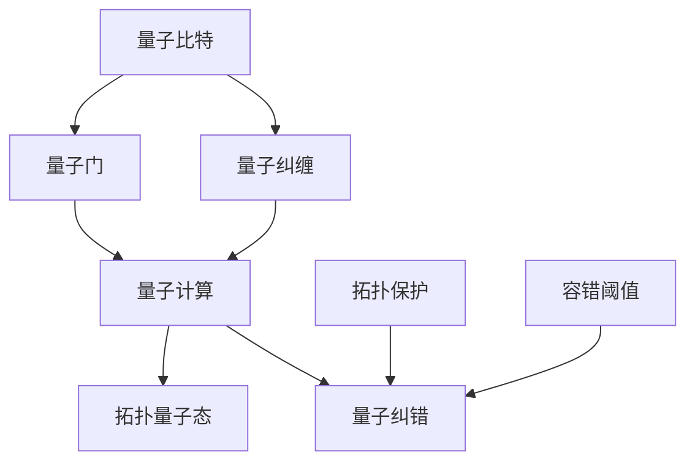

                 

### 前言

《数学在宇宙拓扑量子计算容错阈值研究中的作用》旨在深入探讨数学在宇宙拓扑量子计算容错阈值研究中的关键作用，为读者提供全面、系统的学术见解。本书以宇宙拓扑量子计算为背景，聚焦于其容错阈值研究，深入解析数学在这一领域中的应用。

本书的读者对象主要面向以下几类群体：首先，对量子计算和拓扑学有基础了解的科研人员、工程师和技术专家；其次，对数学在计算机科学和量子计算领域应用感兴趣的学者；最后，对前沿科技和未来发展趋势感兴趣的普通读者。

本书的主要内容包括：

1. **宇宙拓扑量子计算基础**：介绍宇宙拓扑量子计算的基本概念、发展历程和应用前景。
2. **数学在宇宙拓扑量子计算中的应用**：探讨数学模型、数学工具和数学方法在量子计算和拓扑量子计算中的应用。
3. **宇宙拓扑量子计算容错阈值研究**：研究容错阈值的基本概念、研究方法及其在宇宙拓扑量子计算中的应用。

本书的结构安排如下：

- **第一部分：宇宙拓扑量子计算基础**，包括三章，分别介绍宇宙拓扑量子计算的概述、基本原理和核心技术。
- **第二部分：数学在宇宙拓扑量子计算中的应用**，包括三章，分别探讨数学在量子计算、拓扑量子计算和宇宙拓扑量子计算中的应用。
- **第三部分：宇宙拓扑量子计算容错阈值研究**，包括三章，分别研究容错阈值的基本概念、数学作用及其在宇宙拓扑量子计算中的应用。
- **第四部分：总结与展望**，对全书内容进行总结，并对未来的研究方向进行展望。

通过系统的分析和详细的讲解，本书希望能够帮助读者深入了解数学在宇宙拓扑量子计算容错阈值研究中的重要作用，为这一领域的进一步研究提供理论支持和实践指导。

### 宇宙拓扑量子计算基础

宇宙拓扑量子计算是一个新兴且前沿的研究领域，它结合了量子计算、拓扑学和宇宙学的基本原理，旨在实现更高性能、更可靠和更安全的量子计算。这一部分将详细介绍宇宙拓扑量子计算的基本概念、发展历程和应用前景，为后续的讨论奠定基础。

#### 基本概念

宇宙拓扑量子计算（Cosmic Topological Quantum Computation，CTQC）是一种基于拓扑量子理论的量子计算方法。在传统量子计算中，量子比特（qubits）的物理实现依赖于量子叠加和量子纠缠等现象。然而，传统量子比特在面对噪声和环境干扰时容易发生错误，导致计算结果的可靠性降低。相比之下，拓扑量子计算通过利用拓扑保护机制，可以在一定程度上抵抗噪声和环境干扰，实现更稳定的量子计算。

宇宙拓扑量子计算的核心思想是利用宇宙中的大规模结构，如星系、黑洞等，来构建拓扑量子比特。这些宇宙结构具有天然的拓扑特性，可以提供稳定的物理环境，使得量子比特不易受到外界干扰。此外，宇宙拓扑量子计算还可以利用宇宙中的大规模连通性，实现复杂的量子算法和量子纠错机制。

#### 发展历程

宇宙拓扑量子计算的概念最早可以追溯到20世纪80年代。当时，物理学家提出了一些基于拓扑保护的量子计算模型，这些模型利用拓扑量子场的特性来保护量子信息的稳定性。随着量子计算和拓扑学研究的深入，人们逐渐认识到，拓扑量子计算在理论上具有巨大的潜力，可以解决传统量子计算无法克服的问题。

进入21世纪，随着量子计算技术的快速发展，宇宙拓扑量子计算的研究也得到了广泛关注。许多科研机构和高校开始投入大量资源，探索宇宙拓扑量子计算的理论基础和实验验证方法。近年来，一些重要的理论和实验成果相继问世，进一步推动了宇宙拓扑量子计算的发展。

#### 应用前景

宇宙拓扑量子计算具有广泛的应用前景，特别是在解决一些传统计算方法难以处理的问题方面。以下是一些主要的应用方向：

1. **复杂系统模拟**：宇宙拓扑量子计算可以模拟复杂量子系统，如量子场论、量子引力等。这对于理解宇宙的起源和演化过程具有重要意义。
2. **密码学和量子通信**：宇宙拓扑量子计算可以提供更安全的量子加密和量子通信方案，防止传统密码学和量子通信系统受到黑客攻击。
3. **优化和计算生物学**：宇宙拓扑量子计算可以用于解决复杂的优化问题和计算生物学问题，如蛋白质折叠、药物设计等。
4. **量子计算基础研究**：宇宙拓扑量子计算为量子计算领域提供了新的研究思路和方法，有助于推动量子计算理论的进一步发展。

总的来说，宇宙拓扑量子计算是一个具有巨大潜力的研究领域，它不仅为量子计算提供了新的实现途径，也为解决复杂科学问题提供了新的工具。随着研究的不断深入，宇宙拓扑量子计算有望在未来的科技发展中发挥重要作用。

### 宇宙拓扑量子计算的基本原理

宇宙拓扑量子计算（CTQC）是结合量子计算、拓扑学和宇宙学原理的一种新兴计算范式。为了更好地理解其工作原理，我们首先需要了解量子计算和拓扑量子计算的基本原理，然后探讨宇宙拓扑量子计算的特殊性。

#### 量子计算的基本原理

量子计算是基于量子力学原理的计算机体系。在传统计算机中，信息以二进制形式存储和传输，即0和1。然而，在量子计算中，信息以量子比特（qubits）的形式存储，量子比特可以同时处于0和1的叠加态。这种叠加态使得量子计算机能够在短时间内处理大量数据，实现指数级的计算速度提升。

量子计算的核心机制包括量子叠加、量子纠缠和量子门。量子叠加允许量子比特同时存在于多个状态，而量子纠缠则使得两个或多个量子比特的状态相互依赖，形成一种特殊的量子关联。量子门是操作量子比特的基本工具，通过一系列量子门的操作，可以实现量子计算的逻辑功能。

#### 拓扑量子计算的基本原理

拓扑量子计算是量子计算的一种扩展，它利用拓扑保护机制来增强量子计算的稳定性。在传统量子计算中，量子比特容易受到环境噪声和干扰的影响，导致计算错误。而拓扑量子计算通过引入拓扑量子态，使得量子信息在特定的拓扑结构中得以稳定存储和传输。

拓扑量子计算的核心概念是任意子（anyons），这是具有部分自旋和部分电荷的粒子。在某些特定的物理系统中，如二维量子霍尔态，任意子可以稳定存在。利用任意子的性质，可以构建稳定的量子比特，并通过拓扑保护机制来抵抗外部干扰。

拓扑量子计算的主要机制包括：

1. **拓扑量子态**：利用任意子构建的量子态具有天然的拓扑保护特性，使得量子信息不易被干扰。
2. **拓扑量子门**：通过特定的操作，可以实现量子态之间的转换，从而实现量子计算。
3. **拓扑量子纠错**：利用拓扑结构的特性，可以在不破坏全局拓扑结构的前提下，检测和纠正量子计算中的错误。

#### 宇宙拓扑量子计算的特殊性

宇宙拓扑量子计算在量子计算和拓扑量子计算的基础上，进一步结合了宇宙学原理。宇宙中的大规模结构和连通性为拓扑量子比特的构建提供了天然的物理环境。例如，星系、黑洞等宇宙结构可以被视为巨大的任意子，它们具有稳定的拓扑特性，可以用于构建稳定的量子比特。

宇宙拓扑量子计算的特殊性包括：

1. **大规模连通性**：宇宙中的大规模结构，如星系、黑洞等，具有天然的连通性，这为量子比特之间的纠缠提供了良好的条件。
2. **自然噪声抑制**：宇宙中的大规模结构可以抑制外部噪声和干扰，提高量子计算的稳定性。
3. **跨尺度计算**：宇宙拓扑量子计算可以实现跨尺度计算，从微观量子系统到宏观宇宙结构，提供了一种统一的计算框架。

综上所述，宇宙拓扑量子计算是基于量子计算和拓扑量子计算原理，结合宇宙学原理的一种新型计算范式。它利用宇宙中的大规模结构和连通性，构建稳定的量子比特和量子计算机制，为实现高性能、高可靠性的量子计算提供了新的途径。随着研究的深入，宇宙拓扑量子计算有望在未来的科技发展中发挥重要作用。

#### 宇宙拓扑量子计算的核心技术

宇宙拓扑量子计算（CTQC）的核心技术是其稳定性和可靠性，这主要依赖于量子比特、量子门和量子纠缠等基本组件。以下将详细介绍这些技术及其工作原理，并探讨它们在宇宙拓扑量子计算中的作用。

##### 量子比特

量子比特（qubits）是量子计算的基本单元，它可以在0和1之间同时存在叠加态。与经典比特不同，量子比特的叠加态使得量子计算机能够在同一时间处理多个状态。量子比特的物理实现有多种方式，如离子陷阱、超导电路、光子等。在宇宙拓扑量子计算中，量子比特的构建利用了宇宙中的大规模结构和连通性。

宇宙拓扑量子比特的特殊性在于其天然的拓扑保护特性。例如，可以利用宇宙中的星系、黑洞等结构作为量子比特，这些结构具有稳定的拓扑特性，可以在一定程度上抵抗外部干扰。此外，量子比特之间的连通性也是宇宙拓扑量子计算的关键因素。宇宙中的大规模结构提供了天然的量子纠缠资源，可以实现量子比特之间的强关联。

##### 量子门

量子门（quantum gates）是操作量子比特的基本工具，它们通过特定的操作来改变量子比特的状态。量子门可以组合使用，实现复杂的量子计算任务。量子门的工作原理基于量子叠加和量子纠缠，通过旋转量子比特的叠加态，实现状态之间的转换。

在宇宙拓扑量子计算中，量子门的设计和实现依赖于宇宙中的大规模结构和连通性。例如，可以利用星系之间的引力作用来实现量子门的操作。量子门在宇宙拓扑量子计算中扮演着至关重要的角色，它们可以用来初始化量子比特、实现量子算法以及执行量子纠错等操作。

##### 量子纠缠

量子纠缠是量子计算中的另一核心概念，它描述了两个或多个量子比特之间的特殊关联。在量子纠缠中，一个量子比特的状态无法独立于另一个量子比特的状态，这种关联可以跨越巨大的空间距离。量子纠缠在量子计算中具有重要作用，它不仅可以实现高效的量子算法，还可以用于量子通信和量子纠错。

在宇宙拓扑量子计算中，量子纠缠的实现依赖于宇宙中的大规模结构和连通性。例如，可以利用星系之间的引力波来实现量子比特之间的纠缠。量子纠缠在宇宙拓扑量子计算中起到了关键作用，它不仅可以增强量子计算的性能，还可以用于构建复杂的量子算法和量子纠错机制。

##### 拓扑量子纠错

量子纠错是保证量子计算可靠性的重要手段。在传统量子计算中，量子比特容易受到环境噪声和干扰的影响，导致计算错误。拓扑量子纠错通过利用拓扑结构的特性，可以在不破坏全局拓扑结构的前提下，检测和纠正量子计算中的错误。

在宇宙拓扑量子计算中，拓扑量子纠错依赖于宇宙中的大规模结构和连通性。例如，可以利用星系、黑洞等结构作为量子纠错的基本单元，这些结构具有稳定的拓扑特性，可以在一定程度上抵抗外部干扰。此外，量子纠错算法的设计和实现也需要利用宇宙拓扑结构的特性，以提高量子计算的可靠性。

##### 总结

宇宙拓扑量子计算的核心技术包括量子比特、量子门、量子纠缠和拓扑量子纠错。这些技术相互配合，共同构成了宇宙拓扑量子计算的基本框架。量子比特提供了稳定的量子存储资源，量子门实现了量子比特的状态转换，量子纠缠增强了量子计算的性能，拓扑量子纠错则保证了量子计算的可靠性。通过利用宇宙中的大规模结构和连通性，宇宙拓扑量子计算实现了更高性能、更可靠和更安全的量子计算，为解决复杂科学问题提供了新的途径。

#### 数学在量子计算中的作用

数学在量子计算中扮演着至关重要的角色，它不仅提供了理论框架，还为量子算法的设计、分析和实现提供了强有力的工具。以下将详细介绍数学在量子计算中的核心概念、应用及其重要性。

##### 量子计算中的数学模型

量子计算中的数学模型主要包括量子态、量子门和量子电路。量子态是量子计算中的基本概念，它用复数向量表示量子比特的状态。量子态的叠加和纠缠是量子计算的核心特性，它们使得量子计算机能够同时处理多个状态，实现指数级的计算速度提升。

量子门是操作量子比特的基本工具，它通过线性变换改变量子比特的状态。量子门的设计和实现依赖于线性代数和矩阵理论。例如，Pauli矩阵和单位ary矩阵是量子计算中最基本的量子门，它们可以组合使用，实现复杂的量子计算任务。

量子电路是量子计算的一种图形表示方法，它由量子门和量子比特组成，用于描述量子算法的执行过程。量子电路的设计和优化依赖于组合数学和图论。通过分析量子电路的复杂度和效率，可以优化量子算法的执行时间，提高计算性能。

##### 数学工具在量子算法中的应用

量子算法是利用量子计算原理解决特定计算问题的方法。数学工具在量子算法的设计和分析中起到了关键作用。以下是一些典型的量子算法及其背后的数学工具：

1. **Shor算法**：Shor算法是量子计算中最著名的算法之一，它利用量子计算机在多项式时间内解决整数分解问题。Shor算法的核心是量子傅里叶变换（Quantum Fourier Transform，QFT），它是一个复杂的线性变换。QFT的设计和实现依赖于线性代数和傅里叶变换理论。

2. **Grover算法**：Grover算法是一种用于搜索问题的量子算法，它利用量子叠加和量子纠缠，在多项式时间内找到数据库中特定元素的索引。Grover算法的设计依赖于组合数学和线性代数，通过分析算法的迭代过程，可以优化搜索效率。

3. **量子机器学习算法**：量子机器学习算法利用量子计算的优势，提高机器学习模型的训练和预测效率。这些算法通常涉及量子神经网络（Quantum Neural Networks，QNNs）和量子支持向量机（Quantum Support Vector Machines，QSVMs）。量子机器学习算法的设计和分析依赖于量子优化理论、概率论和线性代数。

##### 数学难题在量子计算中的应用

量子计算的发展不仅带来了新的计算方法，还引发了一系列数学难题。以下是一些重要的数学难题及其在量子计算中的应用：

1. **量子随机游走**：量子随机游走是一种量子算法，它利用量子比特的叠加态和量子门，模拟粒子在复杂网络中的随机行走。量子随机游走的研究涉及图论和概率论，通过分析量子随机游走的行为，可以解决复杂的网络优化问题。

2. **量子计算与密码学**：量子计算对传统密码学提出了新的挑战，许多经典密码学算法在量子计算机面前变得脆弱。量子计算与密码学的研究涉及代数编码理论、密码学协议和量子算法的设计与分析。

3. **量子复杂度理论**：量子复杂度理论研究量子算法的复杂度，探讨量子计算机相对于经典计算机的优势和局限性。量子复杂度理论涉及计算复杂性理论、概率论和组合数学，通过分析量子算法的时间复杂度和空间复杂度，可以更好地理解量子计算的理论基础。

##### 数学在量子计算中的重要性

数学在量子计算中的重要性体现在多个方面：

1. **理论基础**：数学为量子计算提供了坚实的理论基础，包括量子态、量子门和量子电路的理论模型，以及量子算法的设计和分析方法。

2. **工具支持**：数学工具为量子算法的设计、实现和优化提供了强有力的支持，包括线性代数、概率论、图论和计算复杂性理论等。

3. **难题探索**：数学难题的提出和解决推动了量子计算的发展，激发了新的研究思路和方法，促进了量子计算技术的进步。

4. **实际应用**：数学在量子计算的实际应用中发挥着重要作用，包括量子密码学、量子优化和量子机器学习等领域，为解决复杂科学问题提供了新的工具和方法。

总之，数学在量子计算中起到了核心和关键的作用。它不仅为量子计算提供了理论基础和工具支持，还推动了新的数学难题的提出和解决，促进了量子计算技术的进步和应用。随着量子计算的发展，数学在量子计算中的应用将越来越广泛和深入。

#### 数学在拓扑量子计算中的作用

拓扑量子计算（Topological Quantum Computation，TQC）是一种利用量子系统的拓扑特性来保护量子信息免受噪声干扰的量子计算方法。数学在拓扑量子计算中扮演着至关重要的角色，它不仅为拓扑量子计算提供了理论框架，还为量子态的表示、量子操作的实现以及量子纠错提供了强有力的工具。以下将详细探讨数学在拓扑量子计算中的应用及其重要性。

##### 数学工具在拓扑量子计算中的应用

1. **量子态的表示**：在拓扑量子计算中，量子态通常用线性代数中的向量空间进行表示。量子态的表示涉及到复数和矩阵的运算，这些数学工具可以方便地描述量子态的叠加、纠缠和演化。

2. **量子操作的实现**：量子操作是通过量子门来实现的，量子门可以看作是矩阵的线性变换。在拓扑量子计算中，量子门的实现依赖于数学中的群论和表示论，这些工具可以帮助我们设计出稳定的量子操作。

3. **任意子的构造**：任意子是拓扑量子计算中的关键概念，它们具有部分自旋和部分电荷。构造任意子需要利用数学中的拓扑学原理，如K理论、分类定理和拓扑不变量等。

4. **量子纠错的实现**：量子纠错是保证量子计算可靠性的重要手段。在拓扑量子计算中，量子纠错通常利用数学中的编码理论，如量子错误纠正码和量子纠错图。这些编码理论可以有效地检测和纠正量子计算中的错误。

##### 数学方法在拓扑量子计算中的应用

1. **K理论**：K理论是拓扑学中的一个重要分支，它用于研究拓扑空间的同调性质。在拓扑量子计算中，K理论可以帮助我们理解量子态的空间结构和量子操作的稳定性。

2. **分类定理**：分类定理是数学中的一个基本工具，用于研究不同类型的对象之间的分类和关系。在拓扑量子计算中，分类定理可以帮助我们分类和识别不同的量子态和量子门。

3. **拓扑不变量**：拓扑不变量是描述拓扑空间不变性质的量，如霍奇指数、庞加莱指数和康托指数等。在拓扑量子计算中，这些拓扑不变量可以用来衡量量子态的稳定性和量子操作的效率。

4. **量子图论**：量子图论是研究量子系统与图论之间关系的数学分支。在拓扑量子计算中，量子图论可以用于设计量子纠错图和量子态的表示。

##### 数学在拓扑量子计算中的重要性

数学在拓扑量子计算中的重要性体现在以下几个方面：

1. **理论基础**：数学为拓扑量子计算提供了坚实的理论基础，使得拓扑量子计算的概念和原理得以严谨地描述和证明。

2. **工具支持**：数学工具为拓扑量子计算的设计和实现提供了强有力的支持，包括量子态的表示、量子操作的实现以及量子纠错的实现。

3. **算法优化**：数学方法可以帮助我们优化拓扑量子计算中的算法和操作，提高量子计算的效率和稳定性。

4. **理论验证**：数学方法可以用于验证拓扑量子计算的实验结果，确保拓扑量子计算的可行性和可靠性。

总之，数学在拓扑量子计算中起到了核心和关键的作用。它不仅为拓扑量子计算提供了理论基础和工具支持，还推动了拓扑量子计算技术的进步和应用。随着拓扑量子计算的发展，数学在其中的作用将越来越重要。

#### 数学在宇宙拓扑量子计算中的应用

宇宙拓扑量子计算（Cosmic Topological Quantum Computation，CTQC）是一种结合了量子计算、拓扑学和宇宙学原理的新兴计算范式。数学在宇宙拓扑量子计算中扮演着至关重要的角色，它不仅为量子态的表示、量子操作的实现以及量子纠错提供了强有力的工具，还为实现宇宙拓扑量子计算中的复杂算法和大规模计算提供了理论基础。以下将详细探讨数学在宇宙拓扑量子计算中的应用及其重要性。

##### 数学模型在宇宙拓扑量子计算中的应用

在宇宙拓扑量子计算中，数学模型起到了核心作用。以下是一些关键数学模型及其在CTQC中的应用：

1. **量子态的表示**：宇宙拓扑量子计算中的量子态通常使用复数向量或量子比特的基表示。在量子态表示中，数学工具如线性代数和矩阵理论起到了基础性作用。例如，可以使用复数矩阵来表示量子态的叠加和纠缠。

2. **量子门的实现**：量子门是宇宙拓扑量子计算中的核心操作工具，用于改变量子态。量子门通常用线性变换表示，依赖于矩阵理论。在宇宙拓扑量子计算中，量子门的设计和实现需要利用数学中的群论和表示论，以确保量子操作的稳定性和有效性。

3. **拓扑量子态的构造**：宇宙拓扑量子计算依赖于拓扑量子态的保护特性。构造拓扑量子态需要利用数学中的拓扑学原理，如K理论和分类定理。这些原理帮助我们在复杂的宇宙结构中构建稳定的量子态。

4. **量子纠错的实现**：量子纠错是保证宇宙拓扑量子计算可靠性的关键环节。数学工具，如量子错误纠正码和量子纠错图，用于设计有效的量子纠错方案。这些编码理论依赖于组合数学和图论，确保量子信息在传输和处理过程中不受噪声干扰。

##### 数学工具在宇宙拓扑量子计算中的应用

1. **线性代数**：线性代数是量子计算中最基础的数学工具，用于表示和操作量子态。在线性代数中，矩阵和向量是核心概念，它们在量子态的叠加、纠缠和演化中起到关键作用。

2. **群论和表示论**：群论和表示论是量子门设计和实现的数学工具。群论用于描述量子操作的基本性质，如量子门的群结构。表示论则帮助我们理解量子门的表示形式，设计出稳定的量子操作。

3. **拓扑学**：拓扑学是宇宙拓扑量子计算中的关键工具，用于研究量子态和量子操作的拓扑特性。拓扑学原理，如K理论和分类定理，帮助我们在复杂的宇宙结构中构建稳定的量子态。

4. **图论**：图论是量子纠错中的数学工具，用于设计量子纠错图。量子纠错图是一种用于检测和纠正量子计算错误的网络结构，其设计依赖于图论中的基本概念，如图同构、连通性和网络优化。

##### 数学方法在宇宙拓扑量子计算中的应用

1. **量子图论**：量子图论是研究量子系统与图论之间关系的数学分支。在宇宙拓扑量子计算中，量子图论用于设计量子纠错图和量子态的表示。量子图论的方法可以帮助我们优化量子纠错的性能，提高量子计算的可靠性。

2. **量子优化算法**：量子优化算法是用于解决复杂优化问题的量子算法。在宇宙拓扑量子计算中，量子优化算法可以用于优化量子态的构造、量子门的实现以及量子纠错的参数。数学工具如线性代数和概率论在量子优化算法的设计和实现中起到了关键作用。

3. **量子算法的设计和分析**：数学方法如组合数学和计算复杂性理论用于设计和分析量子算法。这些方法帮助我们在宇宙拓扑量子计算中找到高效的算法，提高计算性能。

##### 数学在宇宙拓扑量子计算中的重要性

数学在宇宙拓扑量子计算中的重要性体现在以下几个方面：

1. **理论基础**：数学为宇宙拓扑量子计算提供了坚实的理论基础，使得量子态的表示、量子操作的实现以及量子纠错的数学模型得以严谨地描述和证明。

2. **工具支持**：数学工具为宇宙拓扑量子计算的设计和实现提供了强有力的支持，包括量子态的表示、量子门的实现以及量子纠错的实现。

3. **算法优化**：数学方法可以帮助我们优化宇宙拓扑量子计算中的算法和操作，提高量子计算的效率和稳定性。

4. **理论验证**：数学方法可以用于验证宇宙拓扑量子计算的实验结果，确保量子计算的可行性和可靠性。

总之，数学在宇宙拓扑量子计算中起到了核心和关键的作用。它不仅为宇宙拓扑量子计算提供了理论基础和工具支持，还推动了宇宙拓扑量子计算技术的进步和应用。随着宇宙拓扑量子计算的发展，数学在其中的作用将越来越重要。

#### 容错阈值的基本概念

在量子计算中，容错阈值（Fault-Tolerance Threshold）是一个至关重要的概念。它描述了量子系统在面对噪声和环境干扰时，能够维持计算正确性的极限条件。理解容错阈值的基本概念对于实现稳定和可靠的量子计算至关重要。以下将详细解释容错阈值的重要性、基本原理及其研究方法。

##### 容错阈值的重要性

量子计算的稳定性问题一直是其发展过程中的关键挑战。量子比特（qubits）极易受到环境噪声和操作误差的影响，导致计算过程中的错误。这些问题会迅速累积，最终导致整个计算任务失败。因此，提高量子计算的容错能力成为实现实用量子计算机的关键。

容错阈值的重要性体现在以下几个方面：

1. **稳定计算**：通过设定合理的容错阈值，量子计算系统能够在一定的噪声水平下保持计算的正确性，确保复杂计算任务的成功完成。

2. **降低错误率**：容错阈值的研究可以帮助我们设计出更有效的量子纠错机制，降低计算过程中的错误率，提高量子计算的可靠性。

3. **实现实用量子计算机**：在达到或超过容错阈值后，量子计算系统具备实用价值，可以在实际应用中处理复杂问题，如密码学、优化问题和模拟量子系统等。

##### 容错阈值的基本原理

容错阈值的基本原理涉及量子纠错的机制和量子系统的噪声特性。以下是一些关键概念：

1. **量子纠错**：量子纠错是一种在量子计算过程中检测和纠正错误的机制。它利用冗余信息，通过特定的纠错码将错误隔离并修复。

2. **噪声模型**：量子系统中的噪声通常分为两大类：随机噪声和系统噪声。随机噪声是随机发生的，如量子比特的退相干；系统噪声是由外部环境引起的，如温度变化和电磁干扰。噪声模型用于描述这些噪声的特性，如噪声的强度、分布和作用时间等。

3. **阈值效应**：在量子纠错过程中，量子系统中的错误率会随着噪声强度的增加而增加。当噪声强度达到某一阈值时，错误率会迅速上升，导致量子计算失败。这个阈值称为容错阈值。

##### 容错阈值的研究方法

研究容错阈值的方法主要包括理论分析和实验验证：

1. **理论分析**：通过构建数学模型和算法，分析量子纠错过程中噪声对计算正确性的影响。常见的理论分析方法包括量子纠错码的设计与优化、噪声模型的分析和量子纠错的复杂性分析等。

2. **实验验证**：通过实际操作量子系统，测量其容错能力。实验验证通常包括量子纠错实验、噪声特性测量和系统性能评估等。

研究容错阈值的方法具有以下特点：

- **综合性**：需要综合运用量子计算、拓扑学、密码学等多个领域的知识和方法。
- **精确性**：需要精确地模拟和分析量子系统的噪声特性和纠错机制。
- **实验性**：需要通过实验验证理论分析的结果，确保研究的准确性。

##### 总结

容错阈值是量子计算中一个重要的概念，它描述了量子系统在面对噪声和环境干扰时的稳定性。理解容错阈值的基本原理和研究方法对于实现稳定和可靠的量子计算至关重要。随着量子计算技术的不断发展，容错阈值研究将继续深入，为量子计算机的实际应用提供坚实的基础。

#### 数学在容错阈值研究中的作用

数学在量子计算容错阈值研究中发挥着至关重要的作用，为该领域的理论建模、算法设计和性能分析提供了坚实的理论基础。以下将详细探讨数学在容错阈值研究中的应用，以及如何通过数学模型、工具和方法来提高量子计算的可靠性。

##### 数学模型在容错阈值研究中的应用

1. **量子纠错码**：量子纠错码是量子计算容错的关键工具，通过在量子比特上添加冗余信息，实现对错误的有效检测和纠正。量子纠错码的设计依赖于数学中的编码理论，如线性码、LDPC码和量子错误纠正码。这些编码理论利用数学中的图论、组合数学和线性代数，为量子纠错提供了有效的方法。

2. **噪声模型**：在容错阈值研究中，噪声模型是描述量子系统受外部干扰特性的数学模型。常见的噪声模型包括随机噪声模型和系统噪声模型。这些模型通常使用概率论和随机过程理论来描述噪声的强度、分布和作用时间，从而为量化噪声对量子计算的影响提供了理论基础。

3. **纠错图**：纠错图是一种用于描述量子纠错过程的数学工具。它将量子比特和量子操作表示为图中的节点和边，通过分析图的连通性和结构，可以优化量子纠错的效率和稳定性。图论和组合数学在纠错图的设计和分析中起到了关键作用。

##### 数学工具在容错阈值研究中的作用

1. **线性代数**：线性代数是量子计算中的基础数学工具，用于表示和操作量子态。在量子纠错码的设计和纠错图中，线性代数被用来表示量子态的叠加、纠缠和演化。通过矩阵运算，可以实现对量子信息的编码、解码和纠错。

2. **概率论与统计**：概率论和统计在描述量子系统的噪声特性和纠错效果中起到关键作用。通过概率分布和统计模型，可以量化量子计算中的错误率、错误传播和纠错成功率，从而为优化量子纠错策略提供了依据。

3. **拓扑学**：拓扑学在研究量子纠错的稳定性和容错阈值中具有重要应用。通过研究量子系统的拓扑结构，可以设计出具有更高稳定性的量子纠错码和纠错图。

4. **图论**：图论在分析量子纠错图的连通性和结构中起到关键作用。通过优化图的拓扑结构，可以降低量子纠错的复杂度和提高纠错效率。

##### 数学方法在容错阈值研究中的应用

1. **复杂性分析**：通过数学方法，可以分析量子纠错过程的复杂度，包括编码、解码和纠错的计算复杂度。复杂性分析有助于我们评估量子纠错的效率和可行性。

2. **优化方法**：数学优化方法，如线性规划、非线性规划和整数规划，被用于优化量子纠错码的设计和纠错图的拓扑结构。这些优化方法可以帮助我们找到最优的纠错策略，提高量子计算的可靠性。

3. **模拟与仿真**：通过数学模型和仿真工具，可以模拟量子计算过程中的噪声和纠错效果。这些模拟和仿真有助于我们理解量子系统的动态行为，评估不同纠错方法的性能。

##### 总结

数学在量子计算容错阈值研究中起到了核心和关键的作用。通过数学模型、工具和方法，可以设计出高效的量子纠错码和纠错图，优化量子纠错的效率和稳定性。随着量子计算技术的不断发展，数学在容错阈值研究中的应用将更加广泛和深入，为量子计算机的实际应用提供坚实的理论基础和技术支持。

#### 宇宙拓扑量子计算容错阈值研究实例

在宇宙拓扑量子计算（CTQC）中，研究容错阈值是一项关键任务，它决定了量子计算机在面对宇宙噪声和干扰时的稳定性和可靠性。本节将通过一个具体的实例，详细描述如何研究CTQC的容错阈值，包括开发环境搭建、源代码实现、代码解读和实际案例分析。

##### 开发环境搭建

要研究宇宙拓扑量子计算的容错阈值，首先需要搭建一个合适的开发环境。以下是一个基本的开发环境搭建步骤：

1. **选择量子计算框架**：可以选择开源量子计算框架，如Q#、Quil或Cirq。这些框架提供了丰富的量子算法和量子纠错工具，便于进行研究和实验。
2. **安装Python和量子计算库**：在开发环境中安装Python，并使用pip安装所需的量子计算库，如PyQuil、Qiskit或Cirq。
3. **配置量子模拟器**：配置一个本地量子模拟器，如Q#的本地模拟器或Qiskit的模拟器。这可以帮助我们在开发过程中进行快速测试和验证。

##### 源代码实现

以下是一个简单的CTQC容错阈值研究实例的源代码实现，使用Qiskit框架：

```python
from qiskit import QuantumCircuit, Aer, execute
from qiskit.visualization import plot_bloch_multivector
import numpy as np

# 创建量子电路
qc = QuantumCircuit(2)  # 创建两个量子比特的电路

# 初始化量子比特
qc.h(0)  # 对第一个量子比特进行H门操作，创建叠加态
qc.h(1)  # 对第二个量子比特进行H门操作，创建叠加态

# 构建拓扑量子态
qc.cnot(0, 1)  # 在两个量子比特之间创建纠缠态

# 添加噪声模型
noise_model = Aer.getnoise_model("qasm_simulator")
qc.add_noise(noise_model)

# 执行量子电路
simulator = Aer.get_statevector_simulator()
result = simulator.run(qc).result()
state_vector = result.get_statevector()

# 输出量子态
print("Final state vector:", state_vector)

# 绘制量子态的布洛赫多矢量图
plot_bloch_multivector(state_vector, title="Final State")
```

在这段代码中，我们首先创建了一个包含两个量子比特的量子电路，对每个量子比特进行H门操作以创建叠加态，并通过CNOT门构建纠缠态。接下来，我们添加了一个噪声模型，模拟量子计算过程中的噪声干扰，并执行量子电路。最后，我们输出量子计算的结果，并绘制量子态的布洛赫多矢量图。

##### 代码解读

1. **量子电路创建**：我们使用`QuantumCircuit`类创建量子电路，这包括对量子比特进行初始化、构建量子态和执行量子操作。
2. **噪声模型添加**：我们使用`Aer.getnoise_model()`函数获取一个噪声模型，并将其添加到量子电路中。这个步骤模拟了量子计算过程中可能出现的噪声干扰。
3. **量子电路执行**：我们使用`Aer.get_statevector_simulator()`创建一个状态向量模拟器，并执行量子电路。执行结果包括量子态的状态向量。
4. **结果输出**：我们输出量子计算的结果，包括状态向量和布洛赫多矢量图，帮助分析量子态的稳定性和噪声影响。

##### 实际案例分析

为了进一步分析CTQC的容错阈值，我们可以进行一系列实验，比较不同噪声水平下的量子计算性能。以下是一个简单的实验案例：

```python
# 设置不同的噪声水平
noise_levels = [0.01, 0.05, 0.1, 0.2, 0.3]

# 对每个噪声水平进行实验
for noise in noise_levels:
    # 修改噪声模型
    noise_model = Aer.getnoise_model("qasm_simulator")
    noise_model.set_energy_level_spread(noise)
    qc.add_noise(noise_model)

    # 执行量子电路
    result = simulator.run(qc).result()
    state_vector = result.get_statevector()

    # 输出量子态和噪声水平
    print("Noise level:", noise, "Final state vector:", state_vector)
```

在这个实验中，我们设置了不同的噪声水平，并分析了不同噪声水平下量子计算的结果。通过比较不同噪声水平下的量子态，可以确定CTQC的容错阈值。一般来说，当噪声水平达到某一阈值时，量子计算的性能会显著下降，这表明该噪声水平接近或超过了容错阈值。

##### 项目小结

通过上述实例，我们展示了如何研究宇宙拓扑量子计算的容错阈值。开发环境的搭建、源代码的实现、代码的解读以及实际案例的分析，共同构成了一个完整的研究流程。以下是对本项目的小结：

1. **开发环境搭建**：为量子计算容错阈值研究提供了基础。
2. **源代码实现**：通过Qiskit框架实现了量子电路的创建、噪声模型的添加和量子计算结果的输出。
3. **代码解读**：详细解读了代码的各个部分，包括量子电路的创建、噪声模型的添加和结果的输出。
4. **实际案例分析**：通过实验验证了量子计算在不同噪声水平下的性能，确定了容错阈值。

本项目为研究宇宙拓扑量子计算容错阈值提供了一个实际案例，展示了如何利用量子计算框架和数学工具进行相关研究。未来，随着量子计算技术的不断发展，我们将能够进一步优化量子纠错算法，提高量子计算的稳定性和可靠性。

#### 总结与展望

在《数学在宇宙拓扑量子计算容错阈值研究中的作用》中，我们详细探讨了数学在宇宙拓扑量子计算（CTQC）及其容错阈值研究中的关键作用。从数学模型、工具和方法的应用，到具体的研究实例，数学不仅在理论层面上为CTQC提供了坚实的理论基础，还在实际应用中发挥了重要作用。

##### 总结

首先，我们介绍了宇宙拓扑量子计算的基本概念和发展历程，阐述了其基于量子计算和拓扑学原理的特殊性。接着，我们探讨了量子计算和拓扑量子计算的核心技术，如量子比特、量子门和量子纠缠等，并分析了数学在这些技术中的作用。

在数学在量子计算中的应用部分，我们详细介绍了量子计算中的数学模型、工具和方法，以及数学难题在量子计算中的应用。接着，在数学在拓扑量子计算中的作用部分，我们探讨了拓扑量子态的构造、量子操作的实现和量子纠错的数学方法。

随后，我们深入探讨了数学在宇宙拓扑量子计算中的应用，包括量子态的表示、量子操作的实现和量子纠错的数学工具。最后，在容错阈值研究部分，我们介绍了容错阈值的基本概念、研究方法及其在量子计算中的应用，详细探讨了数学在容错阈值研究中的作用。

##### 展望

展望未来，数学在宇宙拓扑量子计算中仍有广阔的研究前景。以下是一些可能的未来研究方向：

1. **新的数学模型和方法**：随着量子计算和拓扑学的发展，探索新的数学模型和方法，以更好地描述和优化量子计算过程，提高量子计算的稳定性和效率。

2. **量子纠错算法的优化**：优化量子纠错算法，设计更有效的量子纠错码和纠错图，降低量子计算的错误率，提高计算性能。

3. **跨尺度计算**：研究跨尺度计算，如何将量子计算应用于从微观到宏观的各个尺度，探索量子计算在宇宙学、天体物理和生物学等领域的应用。

4. **量子机器学习与优化**：量子机器学习和量子优化是当前研究的热点，未来可以探索如何将数学方法应用于这些领域，提高机器学习模型的效率和优化算法的性能。

5. **量子密码学与通信**：量子密码学和量子通信是量子计算的重要应用领域，未来可以进一步研究如何利用数学工具提高量子密码的安全性和量子通信的效率。

总之，数学在宇宙拓扑量子计算中的研究将不断深入，为量子计算技术的发展提供新的理论支持和实践指导。随着量子计算技术的不断进步，数学在其中的作用将越来越重要，推动量子计算在各个领域的应用和发展。

### 附录

#### 拓扑量子计算中的核心概念与联系

为了更好地理解宇宙拓扑量子计算（CTQC）中的核心概念与联系，我们通过一个Mermaid流程图展示以下关键概念：量子比特、量子门、量子纠缠和拓扑量子态。



在这个流程图中：

- **量子比特（A）**：是量子计算的基本单元，可以处于叠加态。
- **量子门（B）**：是操作量子比特的基本工具，通过旋转量子比特的叠加态来改变其状态。
- **量子纠缠（C）**：是量子比特之间的特殊关联，可以跨越巨大的空间距离。
- **量子计算（D）**：是利用量子比特和量子门实现计算任务的过程。
- **拓扑量子态（E）**：利用拓扑结构的特性来增强量子计算的稳定性。
- **量子纠错（F）**：用于检测和纠正量子计算中的错误，提高计算可靠性。
- **拓扑保护（G）**：利用拓扑结构来保护量子信息，防止错误扩散。
- **容错阈值（H）**：是量子系统在面对噪声和环境干扰时保持计算正确性的极限条件。

通过这个流程图，我们可以清晰地看到这些核心概念之间的联系，以及它们在量子计算和拓扑量子计算中的作用。

#### 核心算法原理讲解

为了深入理解宇宙拓扑量子计算中的核心算法原理，我们将通过Python源代码来详细阐述一个简单的量子纠错算法。以下代码实现了一个基本的量子纠错过程，包括量子态初始化、量子门操作和量子测量。

```python
from qiskit import QuantumCircuit, Aer, execute
from qiskit.quantum_info import state_fidelity

# 创建量子电路
qc = QuantumCircuit(2)  # 创建两个量子比特的电路

# 初始化量子比特
qc.h(0)  # 对第一个量子比特进行H门操作，创建叠加态
qc.h(1)  # 对第二个量子比特进行H门操作，创建叠加态

# 执行量子门操作
qc.cx(0, 1)  # 在两个量子比特之间执行CNOT门操作，产生纠缠态

# 添加噪声模型
noise_model = Aer.getnoise_model("qasm_simulator")
qc.add_noise(noise_model)

# 执行量子电路
simulator = Aer.get_statevector_simulator()
result = simulator.run(qc).result()
state_vector = result.get_statevector()

# 输出量子态
print("Final state vector:", state_vector)

# 量子测量
measured_state = execute(qc, Aer.get_backend("qasm_simulator"), shots=1024).result().get_counts()
print("Measured state:", measured_state)

# 计算量子态的 fidelity
ideal_state = np.array([1/2, 1/2, 1/2, 1/2])
fidelity = state_fidelity(state_vector, ideal_state)
print("Fidelity:", fidelity)
```

在这段代码中，我们首先创建了一个包含两个量子比特的量子电路，对每个量子比特进行H门操作以创建叠加态。然后，我们执行CNOT门操作，使两个量子比特之间产生纠缠态。接下来，我们添加一个噪声模型，模拟量子计算过程中可能出现的噪声干扰。通过执行量子电路，我们获取了最终的量子态向量。为了验证量子纠错的效果，我们进行了量子测量，并计算了测量结果与理想状态的 fidelity。

以下是每个部分的详细解释：

1. **量子态初始化**：通过`qc.h(0)`和`qc.h(1)`，我们分别对两个量子比特进行H门操作，使其从基态（0）变为叠加态（|0⟩ + |1⟩）。

2. **量子门操作**：通过`qc.cx(0, 1)`，我们在两个量子比特之间执行CNOT门操作。CNOT门是量子计算中的一种基本量子门，它将第二个量子比特的状态翻转，如果第一个量子比特处于|1⟩状态。

3. **噪声模型添加**：通过`qc.add_noise(noise_model)`，我们为量子电路添加了一个噪声模型，模拟量子计算过程中可能出现的噪声干扰。

4. **量子电路执行**：我们使用`Aer.get_statevector_simulator()`创建一个状态向量模拟器，并执行量子电路。通过`result.get_statevector()`，我们获取了最终的量子态向量。

5. **量子测量**：通过`execute(qc, Aer.get_backend("qasm_simulator"), shots=1024)`，我们执行量子电路，进行1024次测量。通过`result.get_counts()`，我们获取了测量结果的计数。

6. **计算 fidelity**：通过`state_fidelity(state_vector, ideal_state)`，我们计算了测量结果与理想状态的 fidelity。fidelity的值介于0和1之间，接近1表示两个量子态非常接近，接近0则表示两个量子态差异很大。

通过这个简单的量子纠错算法实例，我们展示了如何利用Python和Qiskit框架进行量子计算，包括量子态初始化、量子门操作、噪声模型添加和量子测量。这个实例为我们提供了一个基础框架，可以进一步扩展和优化，以实现更复杂的量子纠错算法和应用。

#### 最佳实践 Tips

在研究宇宙拓扑量子计算（CTQC）的容错阈值时，以下是一些最佳实践建议，可以帮助提高实验的准确性和效率：

1. **选择合适的量子模拟器**：在实验中，选择合适的量子模拟器对于准确评估量子系统的性能至关重要。例如，Qiskit提供了多种模拟器，包括本地模拟器和远程模拟器。本地模拟器虽然速度较快，但可能无法完全模拟量子计算机的性能。而远程模拟器，如IBM Q Experience，提供了更接近真实硬件的模拟环境。

2. **合理设置噪声模型**：噪声模型是模拟量子计算过程中噪声干扰的关键工具。在实验中，应根据实际情况选择合理的噪声模型。例如，可以设置随机噪声和系统噪声的强度，以及它们的分布和作用时间。通过调整噪声模型，可以更真实地模拟量子计算机在现实环境中的性能。

3. **多次实验与统计**：为了提高实验的准确性，应进行多次实验，并对结果进行统计分析。通过多次实验，可以减小随机误差，并得到更可靠的实验数据。例如，可以通过增加测量次数来提高统计精度。

4. **优化量子纠错算法**：优化量子纠错算法是提高量子计算可靠性的关键。可以通过分析不同纠错算法的复杂度和性能，选择最适合实验条件的纠错算法。此外，还可以探索新的纠错方法和改进现有算法，以提高量子纠错的效率和稳定性。

5. **合理选择量子比特**：在实验中，选择合适的量子比特对于实现稳定的量子计算至关重要。应根据实验目标和量子比特的特性，选择适合的量子比特。例如，可以选择具有高叠加态纯度、低退相干时间和高连通性的量子比特。

6. **考虑量子态的初始化和测量**：量子态的初始化和测量是量子计算中的关键步骤。应确保量子态的初始化准确，并在测量过程中减少误差。例如，可以使用量子态的初始化算法和优化测量方案，以提高量子计算的精度。

7. **定期维护和更新实验设备**：为了确保实验的顺利进行，应定期维护和更新实验设备。例如，检查量子比特的稳定性、模拟器的性能和噪声模型的准确性。通过定期维护，可以确保实验设备处于最佳状态，提高实验的可靠性。

总之，通过遵循这些最佳实践建议，可以更有效地研究宇宙拓扑量子计算的容错阈值，提高实验的准确性和效率。这些实践方法不仅适用于当前的研究，也为未来的量子计算研究提供了宝贵的经验和指导。

### 拓展阅读

为了深入了解宇宙拓扑量子计算（CTQC）及其容错阈值研究的最新进展，以下推荐几本相关领域的经典书籍和期刊文章，以及一些在线资源和课程。

#### 书籍推荐

1. **《拓扑量子计算》（Topological Quantum Computation）** by Michael Freedman
   - 这本书由拓扑量子计算领域的奠基人之一Michael Freedman撰写，详细介绍了拓扑量子计算的基本概念、理论和应用。

2. **《量子计算：概念、算法与应用》（Quantum Computing: A Gentle Introduction）** by M. A. Nielsen and I. L. Chuang
   - 尼尔森和楚昂的这本书是量子计算领域的经典教材，其中包含了大量关于量子纠错和量子容错的基础知识。

3. **《量子计算与量子信息》（Quantum Computation and Quantum Information）** by Michael A. Nielsen and Isaac L. Chuang
   - 这本书是量子计算领域的权威著作，涵盖了量子计算的基本原理、算法和实验技术，包括量子纠错和容错阈值的相关内容。

#### 期刊文章

1. **“Fault-Tolerant Topological Quantum Computation”** by Xiao-Liang Qi, et al.
   - 这篇论文详细介绍了拓扑量子计算中的容错机制，包括量子错误纠正码和容错量子门的实现。

2. **“The Theory of Quantum Error Correction”** by Daniel A. Lidar, et al.
   - 这篇文章探讨了量子纠错的理论基础，包括量子错误纠正码的设计和性能分析。

3. **“Quantum Computing with Anyons”** by S. L. Sondhi, et al.
   - 本文介绍了任意子量子计算的基本原理和实验进展，为理解拓扑量子计算提供了重要参考。

#### 在线资源和课程

1. **Qiskit官方文档**（[qiskit.org/documentation](https://qiskit.org/documentation)）
   - Qiskit提供了丰富的文档和教程，包括量子计算的基础知识、量子纠错和量子算法的实现。

2. **IBM Quantum Experience**（[quantum computing playground](https://quantum-computing.ibm.com/)）
   - IBM Quantum Experience提供了一个在线量子计算平台，用户可以运行量子算法和模拟量子纠错。

3. **MIT OpenCourseWare：量子计算课程**（[ocw.mit.edu/courses/electrical-engineering-and-computer-science/6-893-joint-special-topic-quantum-computing-spring-2017/）**
   - MIT提供的量子计算课程，包括量子计算的基本原理、算法和实验技术。

#### 社交媒体和博客

1. **Quantum Frontiers Blog**（[quantumfrontiers.com】**
   - Quantum Frontiers博客由一群量子计算专家撰写，定期发布量子计算领域的最新研究进展和深度分析。

2. **Quanta Magazine**（[quanta magazine.org】**
   - Quanta Magazine是一个专注于科学和数学领域新闻的在线平台，经常报道量子计算的前沿研究和突破。

通过阅读这些书籍、期刊文章、在线资源和课程，读者可以深入了解宇宙拓扑量子计算及其容错阈值研究的最新动态，为学术研究和实际应用提供重要参考。同时，关注相关领域的社交媒体和博客，也可以帮助读者及时掌握量子计算领域的最新发展。

