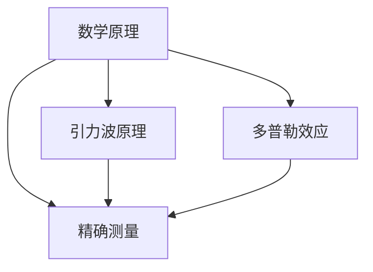

                 

### 设计目录大纲的步骤

为了设计一篇高质量的、逻辑清晰的、结构紧凑的技术博客文章《数学在引力波多普勒效应精确测量中的关键作用》，我们需要遵循以下步骤：

#### 1. 理解书名与主题

首先，我们需要深入理解书名和主题。《数学在引力波多普勒效应精确测量中的关键作用》这一标题涵盖了以下几个关键概念：

- **数学**：作为一门基础科学，数学在科学研究和技术应用中扮演着至关重要的角色。
- **引力波**：是爱因斯坦广义相对论的预测，由质量巨大的天体（如黑洞和恒星）产生，并通过空间传播。
- **多普勒效应**：是波动现象的一种表现，当波源或观察者移动时，会引起波的频率变化。
- **精确测量**：在高精度科学研究中，精确测量是至关重要的，尤其是在引力波探测领域。

#### 2. 确定核心概念与联系

核心概念之间的联系构成了文章的框架。我们需要明确这些概念之间的关系，并确定它们在文章中的逻辑顺序：

- **数学原理**：包括线性代数、微积分和统计学等基础数学工具，用于描述和解析引力波与多普勒效应。
- **引力波原理**：基于广义相对论，描述引力波的起源、传播和探测。
- **多普勒效应**：解释频率变化的原因，并在天文学中用于测量天体运动。
- **精确测量**：涉及具体的测量技术和数据处理方法，用于从引力波信号中提取有用信息。

为了直观地展现这些概念之间的关系，我们可以使用Mermaid流程图来构建它们之间的联系：

#### 3. 构建1级目录

在明确了核心概念和它们之间的联系后，我们可以开始构建1级目录。1级目录通常包含文章的主要章节，它们应该覆盖所有关键内容，并且结构清晰：

- **引言**：介绍文章背景、目的和结构。
- **数学基础**：详细讨论用于描述引力波和多普勒效应的数学工具。
- **引力波原理**：解释引力波的基本概念和探测方法。
- **多普勒效应**：探讨多普勒效应的原理及其在天文学中的应用。
- **精确测量方法**：描述测量过程、技术和数据处理方法。
- **案例分析**：通过具体案例展示数学原理在实际测量中的应用。
- **结论与展望**：总结主要发现，讨论未来研究方向和挑战。

#### 4. 细化2级目录

对于每一个1级目录下的章节，我们需要进一步细化，构建2级目录。这有助于更具体地组织内容，使文章更加系统化：

- **数学基础**：
  - 线性代数基础
  - 微积分基础
  - 统计学基础

- **引力波原理**：
  - 广义相对论基础
  - 波动方程

- **多普勒效应**：
  - 多普勒效应原理
  - 多普勒效应与引力波

- **精确测量方法**：
  - 测量设备与技术
  - 数据处理与分析

#### 5. 细化3级目录

在2级目录的基础上，我们还可以进一步细化，构建3级目录。3级目录用于更细致地分解每个章节的内容，确保文章内容详尽且逻辑连贯：

- **数学基础**：
  - 线性代数基础：
    - 矩阵与向量
    - 线性方程组
    - 特征值与特征向量
  - 微积分基础：
    - 极限与导数
    - 积分与微分方程
    - 多元微积分
  - 统计学基础：
    - 随机变量与概率分布
    - 估计与假设检验
    - 误差分析与数据处理

- **引力波原理**：
  - 广义相对论基础：
    - 洛伦兹变换
    - 空间时间弯曲
    - 引力波的产生与传播

- **多普勒效应**：
  - 多普勒效应原理：
    - 多普勒频移公式
    - 天文学中的多普勒效应

- **精确测量方法**：
  - 测量设备与技术：
    - 激光干涉仪
    - 天文望远镜
    - 信号处理技术
  - 数据处理与分析：
    - 数据预处理
    - 误差分析与校正
    - 模型拟合与参数估计

#### 6. 设计核心算法原理讲解

在文章中，我们需要详细讲解用于精确测量的核心算法原理。这通常包括：

- **伪代码描述**：用伪代码展示算法的基本结构。
- **数学模型和公式**：推导和解释关键公式，确保读者理解其数学原理。
- **举例说明**：使用简单的例子来展示如何应用这些算法。

#### 7. 设计项目实战

为了增强文章的实际应用性，我们可以设计一个项目实战部分，包括：

- **开发环境搭建**：介绍所需的工具和设置。
- **源代码实现**：展示关键代码段和实现细节。
- **代码解读与分析**：解释代码的逻辑和性能优化。
- **实际案例分析和详细讲解剖析**：通过具体案例展示算法的实际应用。

#### 8. 整合与校对

在完成所有章节的撰写后，我们需要对目录大纲进行整合与校对：

- 确保所有章节内容逻辑连贯、完整。
- 避免冗余、简洁明了。
- 校对格式，确保使用markdown格式。

#### 9. 最终确认

在完成整合和校对后，我们需要最终确认：

- 目录大纲总字数控制在10000～12000字左右。
- 确认目录大纲的完整性与合理性。

通过以上步骤，我们可以设计出一篇既有深度又具有实用价值的技术博客文章，全面探讨数学在引力波多普勒效应精确测量中的关键作用。

