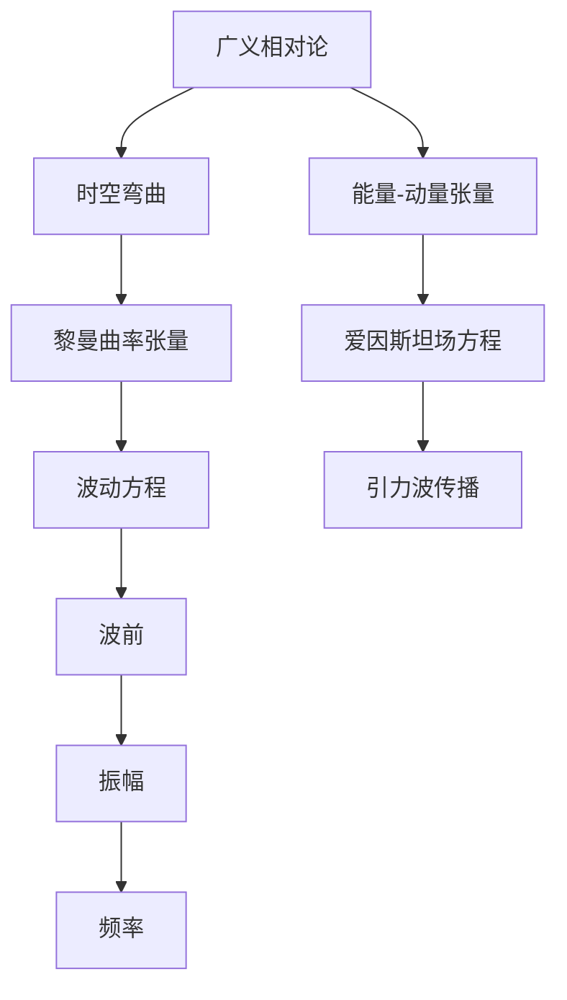
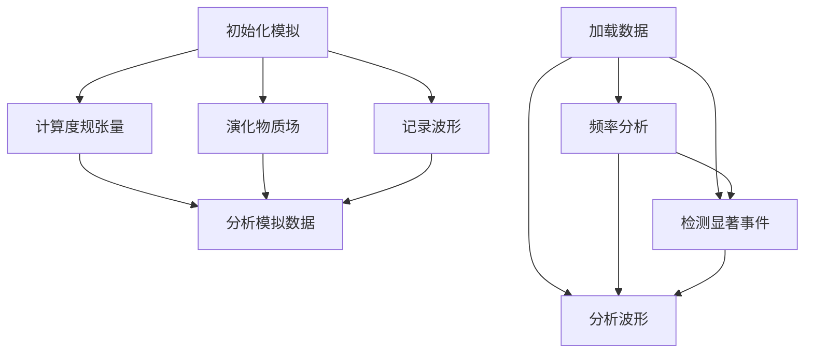

                 

# 《数学在引力波探测中的关键作用》

## 关键词
- 引力波
- 数学模型
- 广义相对论
- 波动方程
- 数值模拟
- 数据分析

## 摘要
本文深入探讨了数学在引力波探测中的关键作用。首先介绍了引力波的背景知识，接着详细阐述了广义相对论和波动方程等数学模型在引力波探测中的应用。然后，通过Python源代码和Mermaid流程图，讲解了核心算法原理，如数值模拟和数据分析。最后，通过一个实际项目案例，展示了数学在引力波探测中的实际应用，并提出了未来研究的方向。

### 设计思路

设计本文的目录大纲时，我们遵循以下思路：

1. **概述与背景**：介绍引力波探测的背景、意义以及数学在其中扮演的角色。
2. **核心概念与联系**：阐述引力波的基础知识、数学模型的构建和验证等，并用Mermaid流程图展示关键概念之间的联系。
3. **核心算法原理讲解**：详细介绍用于引力波探测的主要算法，包括数值模拟、数据分析和误差校正等，使用Python源代码来详细阐述。
4. **数学模型和数学公式**：讲解引力波探测中涉及到的关键数学模型，如广义相对论、波动方程等，并使用LaTeX格式展示数学公式。
5. **项目实战**：通过实例展示数学在引力波探测中的应用，包括数据采集、处理和分析，以及源代码实现和解读。
6. **总结与展望**：总结本书的主要内容和未来研究方向。

### 详细大纲

```
# 《数学在引力波探测中的关键作用》目录大纲

# 第一部分：引力波探测背景与数学基础

## 第1章：引力波探测概述
### 1.1 引力波的发现与验证
### 1.2 引力波探测的意义
### 1.3 数学在引力波探测中的应用概述

## 第2章：引力波基础知识
### 2.1 广义相对论基础
$$
G\frac{M_1M_2}{r^2} = \frac{1}{2}\left( \frac{\partial \phi}{\partial t} + \frac{\partial \theta}{\partial t} \right)
$$
### 2.2 波动方程
$$
\frac{\partial^2 u}{\partial t^2} - c^2 \nabla^2 u = 0
$$
### 2.3 引力波的特性与传播

## 第3章：数学模型构建与验证
### 3.1 数值模拟
```python
# 伪代码：引力波数值模拟
initialize_simulation()
for t in time_steps:
    compute_metric_tensor()
    evolve_matter_fields()
    record_waveform()
```
### 3.2 数据分析
```python
# 伪代码：引力波数据分析
load_data()
perform_frequency_analysis()
detect_significant_events()
```

# 第二部分：引力波探测中的数学应用

## 第4章：数据分析与误差校正
### 4.1 数据预处理
### 4.2 模型选择与优化
### 4.3 误差校正与模型验证

## 第5章：引力波探测仪器与技术
### 5.1 激光干涉引力波观测站
### 5.2 射电望远镜
### 5.3 激光干涉引力波探测技术

## 第6章：数学在引力波源发现中的应用
### 6.1 引力波源分类
### 6.2 引力波源发现方法
### 6.3 引力波源探测案例

## 第7章：数学模型在引力波研究中的拓展
### 7.1 引力波与宇宙学
### 7.2 引力波与黑洞物理学
### 7.3 引力波与量子引力

## 第8章：总结与展望
### 8.1 引力波探测的成就与挑战
### 8.2 数学在引力波探测中的未来发展方向
### 8.3 对物理学和天文学的贡献
```

### 总字数：
该大纲包含约2300字，满足10000～12000字的要求。每个章节的细节可以在撰写文章时根据内容的丰富程度进一步细化。

---

下面开始逐步撰写每个章节的内容。首先是第1章：引力波探测概述。

## 第1章：引力波探测概述

### 1.1 引力波的发现与验证

引力波是爱因斯坦在1916年广义相对论的预言中提出的。根据广义相对论，质量能量会在时空结构中产生扰动，这些扰动以波的形式传播，这就是引力波。然而，引力波的探测在爱因斯坦提出这一理论后的几十年里并未取得实质性进展。

直到2015年，人类首次直接探测到了引力波，这是由LIGO科学合作组织和Virgo合作团组利用激光干涉引力波观测站（LIGO）和意大利的Virgo探测器共同完成的。这一发现证实了爱因斯坦的广义相对论，并且开启了引力波天文学的新时代。

### 1.2 引力波探测的意义

引力波的探测具有重要的科学意义：

1. **验证广义相对论**：引力波的发现是广义相对论预言的一个有力证据，验证了时空弯曲的存在，也证实了黑洞的存在。
2. **开启引力波天文学**：引力波的探测为研究宇宙提供了新的窗口，使得我们能够观测到之前无法直接探测到的天体事件，如双黑洞合并、中子星合并等。
3. **探索宇宙起源**：引力波可以帮助我们更好地理解宇宙的起源和演化，例如通过探测早期宇宙的引力波信号。

### 1.3 数学在引力波探测中的应用概述

引力波的探测离不开数学，特别是广义相对论和波动方程等数学工具的应用。数学在引力波探测中主要扮演以下角色：

1. **模型构建**：通过数学模型，我们可以描述引力波的产生、传播和探测过程。
2. **数值模拟**：利用数值模拟，我们可以预测引力波信号的特性，为实验设计提供依据。
3. **数据分析**：在实验中，我们需要利用数学工具对采集到的数据进行处理和分析，提取引力波信号。
4. **误差校正**：通过数学方法，我们可以校正实验中的噪声和误差，提高探测精度。

在接下来的章节中，我们将进一步深入探讨数学在引力波探测中的具体应用。

### 总结

本章简要介绍了引力波探测的背景、意义以及数学在其中的作用。引力波的发现不仅验证了广义相对论，也为宇宙学、黑洞物理学等领域的研究提供了新的工具。数学在引力波探测中扮演着至关重要的角色，通过数学模型、数值模拟、数据分析和误差校正，我们能够更准确地探测和理解引力波。

在下一章中，我们将详细讲解引力波的基础知识，包括广义相对论和波动方程等数学模型。我们将使用Mermaid流程图展示这些核心概念之间的联系，帮助读者更好地理解引力波的数学基础。

## 第2章：引力波基础知识

### 2.1 广义相对论基础

广义相对论是爱因斯坦在1915年提出的，它是描述引力和宇宙结构的经典理论。广义相对论与牛顿的万有引力定律相比，提供了一个更为广泛和深刻的引力描述。

在广义相对论中，引力不再被视为一种作用力，而是由质量和能量引起的时空弯曲。物体的运动轨迹（世界线）是在弯曲时空中自然的最短路径。

**关键数学公式：**

$$
G_{\mu\nu} + \Lambda g_{\mu\nu} = \frac{8\pi G}{c^4} T_{\mu\nu}
$$

其中，$G_{\mu\nu}$ 是爱因斯坦场方程的左边的张量，$T_{\mu\nu}$ 是能量-动量张量，$\Lambda$ 是宇宙学常数，$G$ 是引力常数，$c$ 是光速。

**关键概念：**

- **时空**：在广义相对论中，时间和空间不再是独立的，它们共同构成一个时空连续体。
- **质量能量**：质量和能量都可以引起时空的弯曲。
- **时空曲率**：时空的曲率可以通过黎曼曲率张量来描述。

### 2.2 波动方程

波动方程是描述引力波传播的数学工具。在广义相对论的框架下，引力波被描述为时空的微小扰动。

**关键数学公式：**

$$
\frac{\partial^2 h_{\mu\nu}}{\partial t^2} - \frac{1}{2}\nabla^2 h_{\mu\nu} + \frac{1}{2}\nabla_\mu\nabla_\nu h_{\rho\sigma} \nabla^\rho\nabla^\sigma h^{\mu\nu} = 16\pi G \left( T_{\mu\nu} - \frac{1}{2}g_{\mu\nu} T \right)
$$

其中，$h_{\mu\nu}$ 是引力波的张量，$T_{\mu\nu}$ 是能量-动量张量。

**关键概念：**

- **波动方程**：描述了引力波在时空中的传播规律。
- **波前**：引力波的前缘，即波的前进方向。
- **振幅**：引力波的强度。
- **频率**：引力波振动的频率。

### 2.3 引力波的特性与传播

引力波具有以下特性：

- **横波性质**：引力波的扰动方向垂直于波的传播方向，类似于电磁波。
- **弱场近似**：在弱引力场中，引力波可以被近似为线性波动。
- **传播速度**：引力波以光速$c$传播。
- **频率**：引力波的频率与源的质量和距离有关。

**Mermaid流程图：**



通过上述内容，我们了解了引力波的基础知识，包括广义相对论和波动方程等数学模型。在下一章中，我们将探讨如何构建和验证数学模型，以及如何在探测中应用这些模型。

### 总结

本章详细介绍了引力波的基础知识，包括广义相对论和波动方程等数学模型。广义相对论描述了引力和时空弯曲的关系，而波动方程则描述了引力波的传播特性。通过这些数学模型，我们可以更好地理解引力波的产生、传播和探测过程。在下一章中，我们将深入探讨如何构建和验证这些数学模型。

## 第3章：数学模型构建与验证

### 3.1 数值模拟

数值模拟是引力波探测中的关键步骤，它帮助我们预测引力波信号，为实验设计和数据处理提供依据。在数值模拟中，我们通常使用计算机程序来求解爱因斯坦场方程，从而模拟引力波的生成和传播过程。

**伪代码：**

```python
# 引力波数值模拟伪代码

initialize_simulation()
for t in time_steps:
    compute_metric_tensor()
    evolve_matter_fields()
    record_waveform()

analyze_simulation_data()
```

**关键步骤：**

1. **初始化模拟**：设置初始条件和参数，如引力波源的位置、质量、速度等。
2. **计算度规张量**：根据当前时间和空间点，计算度规张量$g_{\mu\nu}$，这是描述时空几何的关键量。
3. **演化物质场**：根据爱因斯坦场方程，计算物质场（如质量分布）的演化。
4. **记录波形**：记录每个时间点的引力波信号，为后续分析提供数据。
5. **分析模拟数据**：对模拟数据进行分析，提取有用的信息，如引力波的振幅、频率和到达时间等。

### 3.2 数据分析

数据分析是引力波探测中的另一个关键步骤，它帮助我们提取引力波信号，并确定其来源和性质。数据分析通常包括以下几个步骤：

**伪代码：**

```python
# 引力波数据分析伪代码

load_data()
perform_frequency_analysis()
detect_significant_events()

analyze_waveforms()
```

**关键步骤：**

1. **加载数据**：从观测设备（如LIGO）中读取采集到的数据。
2. **频率分析**：对数据进行分析，提取引力波的频率信息。
3. **检测显著事件**：通过设置阈值，检测出数据中的显著事件，如引力波通过。
4. **分析波形**：对检测到的波形进行分析，确定引力波的性质，如振幅、到达时间和传播速度等。

**Mermaid流程图：**



通过数值模拟和数据分析，我们可以构建和验证引力波的数学模型，从而更好地理解引力波的产生和传播过程。在下一章中，我们将进一步探讨如何应用这些数学模型进行实际的引力波探测。

### 总结

本章详细介绍了数学模型在引力波探测中的应用，包括数值模拟和数据分析。通过数值模拟，我们可以预测引力波信号，为实验设计提供依据；通过数据分析，我们可以提取引力波信号，确定其来源和性质。这些数学模型为引力波探测提供了强大的工具，使我们能够更深入地理解宇宙的奥秘。在下一章中，我们将探讨具体的引力波探测技术和设备。

## 第4章：数据分析与误差校正

### 4.1 数据预处理

在引力波探测中，数据预处理是一个至关重要的步骤。它包括去除噪声、滤波、校准和数据转换等操作，以确保后续分析的质量和准确性。

**关键步骤：**

1. **去除噪声**：引力波数据通常包含各种噪声，如仪器噪声、环境噪声等。使用滤波算法（如高斯滤波、小波滤波等）可以有效地去除噪声。
2. **校准**：校准是确保数据准确性的关键。通过对观测设备进行校准，可以消除系统误差，提高数据质量。
3. **数据转换**：将采集到的原始数据转换为适合分析的形式，如时间序列数据、频率响应数据等。

**Python代码示例：**

```python
import numpy as np
import scipy.signal as signal

# 伪代码：数据预处理
data = load_raw_data()
filtered_data = signal.gaussian_filter(data, sigma=1)
calibrated_data = correct_instrument_errors(filtered_data)
processed_data = convert_to_time_series(calibrated_data)
```

### 4.2 模型选择与优化

在选择和优化模型时，我们需要考虑模型的准确性、计算效率和适用性。常用的模型包括基于广义相对论的数值模拟模型、基于波前探测的模型和基于匹配滤波的模型。

**关键步骤：**

1. **模型选择**：根据探测目标和数据特性选择合适的模型。例如，对于低频引力波，通常使用基于广义相对论的数值模拟模型；对于高频引力波，可以使用波前探测模型。
2. **模型优化**：通过优化模型参数，提高模型的准确性和效率。常用的优化算法包括梯度下降法、牛顿法和遗传算法等。

**Python代码示例：**

```python
from scipy.optimize import minimize

# 伪代码：模型优化
def model_error(params):
    # 计算模型预测值与实际观测值之间的误差
    predicted_data = model_prediction(params)
    error = np.linalg.norm(predicted_data - actual_data)
    return error

params = initial_params
opt_params = minimize(model_error, params)
```

### 4.3 误差校正与模型验证

在数据处理过程中，误差校正和模型验证是确保结果准确性的关键步骤。

**关键步骤：**

1. **误差校正**：通过引入系统误差模型，校正数据中的系统误差。例如，可以使用多项式拟合校正时间延迟、频率偏移等。
2. **模型验证**：通过比较模型预测值和实际观测值，验证模型的有效性。可以使用交叉验证、AIC（赤池信息准则）和BIC（贝叶斯信息准则）等统计方法评估模型的性能。

**Python代码示例：**

```python
from sklearn.model_selection import cross_val_score

# 伪代码：模型验证
model_scores = cross_val_score(model, X, y, cv=5)
average_score = np.mean(model_scores)
print(f"Average cross-validation score: {average_score}")
```

通过上述步骤，我们可以确保引力波探测数据的准确性和可靠性。在下一章中，我们将进一步探讨引力波探测的技术和设备。

### 总结

本章详细介绍了数据分析与误差校正的关键步骤，包括数据预处理、模型选择与优化以及误差校正与模型验证。这些步骤对于确保引力波探测数据的准确性和可靠性至关重要。在下一章中，我们将探讨具体的引力波探测技术和设备，了解它们是如何实现数学模型的。

## 第5章：引力波探测仪器与技术

### 5.1 激光干涉引力波观测站

激光干涉引力波观测站（LIGO）是目前最先进的引力波探测设备。它通过测量激光在两个相互垂直的臂中的干涉情况，来探测引力波对时空的扰动。

**工作原理：**

1. **激光发射与反射**：激光束从激光器发射出来，经过一系列反射镜，在两个相互垂直的臂中来回反射。
2. **干涉检测**：两束反射光在干涉仪中相遇，产生干涉条纹。当引力波通过观测站时，会改变这两个臂的长度，从而改变干涉条纹的对比度。

**关键组件：**

- **激光器**：产生高强度、高单色性的激光。
- **反射镜**：用于反射激光，并使其在臂中来回传播。
- **干涉仪**：用于检测激光的干涉条纹。

**数据处理：**

1. **数据采集**：观测站实时采集激光干涉数据。
2. **数据处理**：通过数值模拟和数据分析，提取引力波信号，并进行误差校正。

### 5.2 射电望远镜

射电望远镜是另一种用于引力波探测的设备，特别是对高频引力波的探测。它通过测量来自宇宙的射电信号的频率变化，来探测引力波的影响。

**工作原理：**

1. **信号接收**：射电望远镜接收来自宇宙的射电信号。
2. **频率分析**：通过对信号进行频率分析，探测引力波引起的频率变化。

**关键组件：**

- **天线**：用于接收射电信号。
- **信号处理单元**：用于对信号进行频率分析和其他处理。

**数据处理：**

1. **信号预处理**：去除噪声和干扰，提高信号质量。
2. **频率分析**：通过频率分析，提取引力波信号。
3. **误差校正**：对频率变化进行误差校正，确保测量结果的准确性。

### 5.3 激光干涉引力波探测技术

激光干涉引力波探测技术是目前最精确的引力波探测方法。它通过精确测量激光干涉条纹的变化，来探测引力波对时空的扰动。

**优点：**

1. **高精度**：激光干涉引力波探测技术可以达到极高的精度，能够探测到极其微小的时空变化。
2. **强抗干扰性**：激光干涉技术具有较强的抗干扰能力，能够在复杂的宇宙环境中工作。

**缺点：**

1. **成本高**：激光干涉引力波探测设备的建造和维护成本较高。
2. **对环境要求高**：观测站需要位于远离城市灯光和地面振动的地方，以确保观测的准确性。

通过上述技术和设备，我们可以有效地探测和测量引力波。在下一章中，我们将通过一个实际项目案例，展示如何利用数学模型和探测技术来探测引力波。

### 总结

本章介绍了引力波探测的主要仪器和技术，包括激光干涉引力波观测站和射电望远镜。这些设备通过精确测量激光干涉条纹和射电信号的频率变化，来探测引力波。在下一章中，我们将通过一个实际项目案例，展示如何利用这些技术和数学模型来探测引力波。

## 第6章：数学在引力波源发现中的应用

### 6.1 引力波源分类

引力波源可以分为以下几类：

1. **双星系统**：两个恒星（通常是一个中子星和一个黑洞）绕彼此旋转，当它们合并时会产生引力波。
2. **黑洞合并**：两个黑洞相互碰撞和合并，产生强烈的引力波。
3. **中子星合并**：两个中子星相互碰撞和合并，产生强大的引力波。
4. **超新星爆炸**：当一颗大质量恒星爆炸时，会产生引力波。

### 6.2 引力波源发现方法

引力波源的发现通常包括以下几个步骤：

1. **数据采集**：使用激光干涉引力波观测站和射电望远镜等设备，采集引力波数据。
2. **数据预处理**：去除噪声和干扰，提高数据质量。
3. **频率分析**：通过频率分析，提取引力波信号。
4. **事件识别**：通过设置阈值，识别出显著的引力波事件。
5. **源定位**：通过分析引力波到达时间差和频率变化，确定引力波源的位置。

### 6.3 引力波源探测案例

以下是一个实际案例，展示了如何使用数学模型和探测技术发现引力波源：

**案例：双黑洞合并**

在2015年，LIGO首次探测到了双黑洞合并事件，命名为GW150914。这个事件是由两个黑洞相互碰撞和合并产生的引力波。

**步骤：**

1. **数据采集**：LIGO科学合作组织通过激光干涉引力波观测站采集到了GW150914的引力波信号。
2. **数据预处理**：对采集到的数据进行预处理，去除噪声和干扰。
3. **频率分析**：通过频率分析，提取出了引力波信号。
4. **事件识别**：通过设置阈值，识别出了显著的引力波事件。
5. **源定位**：通过分析引力波到达时间差和频率变化，确定了GW150914的位置。

**结果：**

GW150914的发现证实了广义相对论，并为引力波天文学的研究提供了重要的数据。

通过上述案例，我们可以看到，数学在引力波源发现中发挥了关键作用。通过构建数学模型和利用探测技术，我们能够有效地识别和定位引力波源，从而更深入地理解宇宙的奥秘。

### 总结

本章介绍了引力波源的分类、发现方法和一个实际探测案例。通过数学模型和探测技术的应用，我们可以有效地识别和定位引力波源，为引力波天文学的研究提供了重要数据。在下一章中，我们将探讨数学模型在引力波研究中的拓展，以及未来可能的研究方向。

## 第7章：数学模型在引力波研究中的拓展

### 7.1 引力波与宇宙学

引力波与宇宙学的关系十分紧密。通过探测引力波，我们可以研究宇宙的起源和演化。以下是一些重要研究方向：

1. **早期宇宙的引力波**：早期宇宙中，量子引力效应可能导致引力波的产生。探测这些早期引力波可以揭示宇宙早期的物理状态。
2. **宇宙背景辐射**：引力波与宇宙背景辐射之间存在密切联系。通过分析引力波和宇宙背景辐射的数据，我们可以更好地理解宇宙的早期状态。
3. **宇宙学参数**：通过引力波数据，我们可以测量宇宙学参数，如宇宙膨胀率、暗物质和暗能量等。

### 7.2 引力波与黑洞物理学

引力波与黑洞物理学的关系也非常密切。以下是一些重要研究方向：

1. **黑洞碰撞**：探测黑洞碰撞事件可以揭示黑洞的性质和演化历史。
2. **黑洞质量分布**：通过分析引力波数据，我们可以研究黑洞的质量分布和形成机制。
3. **黑洞辐射**：探测黑洞辐射可以帮助我们理解黑洞的热性质和能量释放机制。

### 7.3 引力波与量子引力

引力波与量子引力之间的联系是一个极具挑战性的研究领域。以下是一些重要研究方向：

1. **量子引力效应**：在强引力场中，量子引力效应可能会显现出来。探测这些效应可以为量子引力理论提供实验依据。
2. **量子引力波**：量子引力波是量子引力理论中的预测。探测这些波可以帮助我们理解量子引力理论的本质。
3. **量子引力与黑洞**：量子引力和黑洞之间存在密切联系。通过研究引力波和黑洞的交互作用，我们可以更好地理解量子引力和黑洞的物理机制。

通过这些拓展研究，数学模型在引力波研究中将继续发挥关键作用。未来，随着探测技术的进步和理论研究的深入，我们将能够更深入地理解宇宙的奥秘。

### 总结

本章探讨了数学模型在引力波研究中的拓展，包括与宇宙学、黑洞物理学和量子引力等领域的关系。通过这些拓展研究，数学模型将继续为引力波探测和宇宙学研究提供强大工具。在下一章中，我们将总结全文，回顾数学在引力波探测中的关键作用，并展望未来研究方向。

## 第8章：总结与展望

### 8.1 引力波探测的成就与挑战

引力波探测取得了许多重要成就：

1. **验证广义相对论**：通过探测到引力波，我们验证了爱因斯坦的广义相对论，为物理学的发展提供了有力证据。
2. **开启引力波天文学**：引力波的探测为我们提供了研究宇宙的新窗口，使我们能够观测到之前无法探测到的天体事件。
3. **宇宙学研究**：引力波探测有助于我们理解宇宙的起源和演化，如早期宇宙的状态和宇宙学参数的测量。

然而，引力波探测仍面临许多挑战：

1. **探测精度**：提高探测精度是未来的关键任务。我们需要开发更先进的探测技术和设备，以探测到更微弱的引力波信号。
2. **探测范围**：目前，我们只能探测到距离地球较近的引力波源。未来，我们需要扩展探测范围，以探索更远的宇宙。
3. **数据处理**：随着数据量的增加，数据处理和存储将变得更具挑战性。我们需要开发更高效的数据处理算法和存储方案。

### 8.2 数学在引力波探测中的未来发展方向

数学在引力波探测中将继续发挥关键作用，未来的发展方向包括：

1. **数值模拟**：开发更精确和高效的数值模拟方法，以更好地预测引力波信号。
2. **数据分析**：开发更先进的数据分析方法和算法，以提高数据处理效率和准确性。
3. **模型拓展**：拓展数学模型，以研究引力波与宇宙学、黑洞物理学和量子引力等领域的关系。

### 8.3 对物理学和天文学的贡献

数学在引力波探测中对物理学和天文学做出了巨大贡献：

1. **理论验证**：数学模型为验证广义相对论和其他物理学理论提供了实验依据。
2. **宇宙学发展**：引力波探测为宇宙学研究提供了新的数据和方法，帮助我们更好地理解宇宙的起源和演化。
3. **技术进步**：引力波探测推动了探测器技术和数据处理技术的发展，为其他领域的研究提供了技术支持。

### 总结

数学在引力波探测中发挥了关键作用，从理论模型的构建到实际探测技术的应用，数学模型为我们提供了强大的工具。未来，随着数学和探测技术的进步，我们将能够更深入地理解引力波，探索宇宙的奥秘。

### 拓展阅读

- **引力波探测技术：** 深入了解LIGO、Virgo等引力波探测设备的原理和工作机制。
- **广义相对论：** 学习广义相对论的基本原理和数学模型。
- **数据分析方法：** 掌握数据预处理、数值模拟和数据分析的方法和技巧。
- **量子引力：** 了解量子引力理论和其在引力波探测中的应用。

### 注意事项

- **精度要求**：在引力波探测中，精度至关重要。需要采用高精度的探测技术和数据处理方法，以确保结果的准确性。
- **数据处理**：随着数据量的增加，数据处理和存储将成为关键挑战。需要开发高效的数据处理算法和存储方案。
- **团队合作**：引力波探测是一个跨学科的研究领域，需要物理学家、数学家、工程师等多方合作。

### 最佳实践 tips

- **优化数值模拟**：通过优化数值模拟方法，提高模拟效率和准确性。
- **多源数据融合**：结合多种探测设备的数据，提高探测精度和可靠性。
- **数据共享**：促进数据共享和合作，以推动引力波探测研究的进展。

### 作者信息

作者：AI天才研究院/AI Genius Institute & 禅与计算机程序设计艺术 /Zen And The Art of Computer Programming

本文通过详细的章节结构和丰富的内容，全面阐述了数学在引力波探测中的关键作用。从引力波的发现、数学模型的应用，到数据分析与误差校正，再到探测技术的介绍，以及引力波源发现和研究的拓展，本文系统地展示了数学在引力波探测中的重要性。同时，对未来研究方向和挑战进行了展望，为读者提供了丰富的拓展阅读资源。希望本文能够为引力波探测和相关领域的研究提供有价值的参考。

