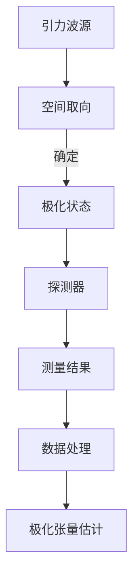

                 

### 引言

引力波是爱因斯坦广义相对论预言的一种物理现象，它是由加速运动的大质量天体产生的时空波动。随着科学技术的不断进步，人类终于能够在实验中探测到引力波。引力波的探测不仅验证了广义相对论的正确性，还为天文学、宇宙学、物理学等领域带来了全新的研究手段。然而，引力波的探测和测量并非易事，其中数学起到了至关重要的作用。本文旨在探讨数学在引力波极化测量中的关键作用，帮助读者理解这一复杂而迷人的科学领域。

数学在引力波研究中的应用历史可以追溯到其起源。早在引力波理论提出的早期，数学工具便被用来推导和预测引力波的特性。随着实验技术的发展，数学在引力波信号处理、数据处理和测量分析中的重要性日益凸显。特别是在极化测量这一重要领域，数学模型和算法的应用极大地提升了测量精度和可靠性。

本文将按以下结构展开：

1. **数学在引力波研究中的基础**：介绍引力波的基本概念，以及数学在引力波探测中的应用背景。
2. **引力波极化测量的数学原理**：详细讲解极化状态、极化测量的数学模型和算法。
3. **引力波信号处理中的数学方法**：探讨时频分析、信号降噪等数学方法在引力波信号处理中的应用。
4. **引力波极化测量的实验技术**：介绍实验设备、实验流程和数据处理技术。
5. **数学在引力波研究中的最新进展**：展示数学在引力波探测中的最新成果和发展趋势。
6. **应用案例分析**：通过具体案例，展示数学在引力波极化测量中的实际应用。
7. **结论与展望**：总结本文的主要观点，并对未来的发展提出展望。

通过这一系列步骤，我们希望读者能够全面、深入地理解数学在引力波极化测量中的关键作用，从而更好地把握这一领域的科学进展和技术创新。

## 数学在引力波研究中的基础

引力波是爱因斯坦广义相对论预言的一种物理现象，它是由于质量物体的加速运动导致的时空扭曲。在经典力学中，质量物体的运动可以被视为对周围空间的扰动，但广义相对论将这一观点扩展到了更加深刻的层次，将质量物体的运动视为对整个时空结构的扰动。具体来说，当一个质量物体加速运动时，它不仅会产生传统的引力场，还会在时空中产生波动，这种波动就是引力波。

引力波的基本特性包括：

1. **横波性**：引力波是横波，其振动方向垂直于波的传播方向。这意味着引力波无法在固体中传播，因为固体中的振动方向与波的传播方向是相同的。
2. **偏振性**：引力波的偏振性质使其可以被分解为两个相互垂直的分量，分别对应于空间中的两个正交方向。
3. **传播速度**：引力波的传播速度与光速相同，即约为 \(3 \times 10^8 \text{ m/s}\)。

为了理解引力波的产生和传播，我们需要借助数学模型来进行描述。在广义相对论中，引力波通常用波前曲率的张量描述，这个张量称为**Weyl张量**。Weyl张量包含了引力波的所有物理信息，通过其变化可以推导出引力波的产生和传播规律。

数学在引力波探测中的作用主要体现在以下几个方面：

1. **理论推导**：广义相对论中的数学工具，如张量分析和微分几何，被用来推导引力波的产生公式和传播方程。这些数学工具是理解引力波理论的基础。
2. **信号处理**：在实验中，引力波信号通常非常微弱，需要复杂的信号处理算法来增强和提取。这些算法包括时频分析、滤波和去噪等，都是基于数学原理设计的。
3. **数据分析**：引力波的探测通常依赖于大量的实验数据，对这些数据进行处理和分析需要使用统计方法和优化算法。这些方法都依赖于数学理论的支持。

为了更好地理解数学在引力波研究中的基础，我们首先需要了解引力波的基本数学模型。引力波的产生可以用以下公式描述：

$$
G_{\mu\nu} + \Lambda g_{\mu\nu} = \frac{8\pi G}{c^4} T_{\mu\nu}
$$

其中，\( G_{\mu\nu} \) 是爱因斯坦场方程中的Einstein张量，\(\Lambda\) 是宇宙学常数，\( g_{\mu\nu} \) 是度规张量，\( T_{\mu\nu} \) 是能量-动量张量，\( G \) 是引力常数，\( c \) 是光速。

这个公式描述了时空的几何结构（度规张量）如何受到物质和能量分布的影响。引力波可以被视为一种时空的振荡，它会导致度规张量的变化。为了具体描述这种变化，我们引入了Weyl张量：

$$
\Omega_{\mu\nu} = G_{\mu\nu} - \frac{1}{2} g_{\mu\nu} R
$$

其中，\( R \) 是Ricci张量，表示时空的曲率。

Weyl张量描述了时空中的纯引力部分，即不受物质和能量影响的部分。引力波的产生可以通过Weyl张量的变化来描述，这种变化可以被视为一个振荡的扰动：

$$
\Omega_{\mu\nu}(x - ct) = \Omega_{\mu\nu}(x_0)
$$

这个方程表明，Weyl张量在时延为 \(ct\) 的空间点上的值与初始时刻 \(x_0\) 的值相同，这意味着引力波以光速传播。

通过这些数学模型，我们可以描述引力波的产生和传播。然而，要探测到如此微弱的引力波，实验技术和数据分析同样至关重要。数学在这些环节中的作用不可忽视，它为我们提供了理论支持和工具，使我们能够深入探索这一奇妙的现象。

### 引力波极化测量的数学原理

在引力波的探测过程中，极化测量是一个关键环节。极化描述了引力波在空间中的振动模式，是区分不同引力波信号的重要特征之一。极化状态可以通过数学模型和几何描述来详细分析，这有助于我们理解其测量原理和算法。

#### 极化状态的基本概念

引力波的极化状态是指其振动方向相对于传播方向的空间取向。由于引力波是横波，其振动方向垂直于波的传播方向。根据振动方向的不同，引力波可以具有多种极化状态，常见的有：

1. **线性极化**：引力波的振动方向与传播方向保持固定的夹角，可以是右旋（RHS）或左旋（LHS）。
2. **圆极化**：引力波的振动方向在一个圆周上旋转，旋转方向可以是顺时针或逆时针。
3. **椭圆极化**：引力波的振动方向在一个椭圆上旋转，椭圆的轴可以与传播方向成不同的角度。

这些极化状态可以用数学向量来表示。例如，线性极化可以用一个二维向量表示，其中向量的方向表示振动方向，向量的模表示振动的强度。对于圆极化和椭圆极化，可以使用复数来表示，因为复数可以描述旋转方向和角度。

#### 极化测量的数学模型

极化测量需要精确地确定引力波的极化状态。为了建立极化测量的数学模型，我们首先需要定义一个参考坐标系。通常，我们可以选择一个固定的惯性参考系，其中x轴指向天体的方位，y轴指向天体的高度，z轴指向地心的方向。

在惯性参考系中，引力波的极化状态可以用一个四维张量来描述，该张量包含了引力波在不同方向上的振幅和相位信息。这个四维张量通常被称为极化张量或极化矩阵，其表达式为：

$$
P_{\mu\nu} = \begin{pmatrix}
A_{xx} & A_{xy} \\
A_{yx} & A_{yy}
\end{pmatrix}
$$

其中，\( A_{xx} \) 和 \( A_{yy} \) 分别表示引力波在x轴和y轴方向上的振幅，\( A_{xy} \) 和 \( A_{yx} \) 表示振动的交叉项。

为了测量这个极化张量，我们需要使用两个相互垂直的探测器，这些探测器可以记录引力波在不同方向上的振幅和相位。通过测量这两个探测器的信号，我们可以重构出引力波的极化状态。

#### 极化测量的算法分析

在实际测量中，由于引力波信号的微弱和噪声的影响，直接测量极化状态是非常困难的。因此，需要采用一系列的算法来处理测量数据，从而精确地确定极化状态。这些算法通常包括以下步骤：

1. **信号采样**：首先，我们需要对探测器信号进行采样，以获得时间序列数据。
2. **信号预处理**：为了减少噪声和干扰，需要对信号进行滤波和去噪处理。
3. **时频分析**：使用时频分析方法，如短时傅里叶变换（STFT）或小波变换，来确定引力波的频率和振动模式。
4. **极化张量的估计**：通过时频分析结果，可以估计引力波的极化张量。常用的方法包括最大似然估计、最小二乘法和贝叶斯估计等。

这些算法的核心思想是通过数学模型和统计方法，从噪声中提取出有用的信号信息，并精确地估计出引力波的极化状态。

#### 极化状态与空间取向的关系

在引力波的极化测量中，空间取向是一个关键因素。空间取向是指引力波在空间中的振动方向相对于地球表面或观测者的取向。不同的空间取向会导致引力波在探测器上的信号具有不同的极化状态。

为了更好地理解空间取向对极化测量的影响，我们可以使用Mermaid流程图来展示极化状态与空间取向之间的关系。以下是一个简化的Mermaid流程图：

在这个流程图中，引力波源产生引力波，这些引力波在空间中传播，并受到观测者的空间取向影响。探测器测量引力波在特定方向上的振幅和相位，通过数据处理，可以估计出引力波的极化状态。

通过以上分析，我们可以看到数学在引力波极化测量中起到了至关重要的作用。从极化状态的定义和数学模型，到极化测量的算法分析，数学为这一复杂的过程提供了理论基础和工具支持。这不仅帮助我们理解引力波的本质，还为引力波的探测和测量提供了可靠的方法和技术。

### 引力波信号处理中的数学方法

在引力波的探测过程中，信号处理是一个关键步骤，它决定了能否有效地从噪声中提取出有用的引力波信号。数学在这一过程中扮演了至关重要的角色，提供了一系列强大且高效的工具和方法。以下是几种常用的数学方法及其在引力波信号处理中的应用。

#### 时频分析

时频分析是一种用于分析信号在不同时间和频率上的特性的技术。在引力波信号处理中，时频分析被广泛用于确定信号的频率成分和振动模式。常见的时频分析方法包括短时傅里叶变换（STFT）和小波变换。

1. **短时傅里叶变换（STFT）**：
   短时傅里叶变换是一种将信号在时间和频率上同时分解的方法。它通过将信号分成多个短时段，并对每个短时段进行傅里叶变换，从而得到信号在时间和频率上的分布。STFT的公式如下：

   $$
   X_{ft}(k, t) = \int_{-\infty}^{\infty} x(t) e^{-i2\pi ft} e^{-i2\pi k \tau} d\tau
   $$

   其中，\( X_{ft}(k, t) \) 表示在频率 \( k \) 和时间 \( t \) 上的信号分布，\( x(t) \) 是原始信号，\( f \) 是频率，\( \tau \) 是时间。

   **应用举例**：在引力波探测中，STFT可以用来分析信号中的频率成分，帮助确定引力波的频率和周期。例如，当探测到来自双星系统的引力波时，STFT可以帮助我们确定其频率和振动模式。

2. **小波变换**：
   小波变换是一种基于小波基的时频分析方法，它通过将信号分解成不同尺度的小波函数来实现。小波变换的一个主要优点是它可以同时提供时间和频率的信息，并且在处理非平稳信号时非常有效。

   $$
   \psi(t, s) = \frac{1}{\sqrt{s}} \psi\left(\frac{t}{s}\right)
   $$

   其中，\( \psi(t, s) \) 是小波函数，\( s \) 是尺度参数。

   **应用举例**：小波变换在引力波探测中被用来分析非平稳信号，如瞬态引力波。例如，当探测到伽玛射线暴产生的引力波时，小波变换可以帮助我们分析其振动模式和持续时间。

#### 信号降噪

在引力波探测中，信号往往被各种噪声所淹没，如仪器噪声、环境噪声和随机噪声等。信号降噪是信号处理的重要任务之一，它通过消除或减少噪声，从而提取出有用的信号信息。常用的信号降噪方法包括：

1. **滤波器设计**：
   滤波器是一种用于去除信号中特定频率成分的数学工具。常见的滤波器包括低通滤波器、高通滤波器和带通滤波器等。在引力波探测中，低通滤波器被广泛用于去除高频噪声，因为引力波的频率通常较低。

   **应用举例**：在引力波探测器中，低通滤波器被用来减少仪器噪声和外界干扰，从而提高信号的清晰度。

2. **小波降噪**：
   小波降噪是一种基于小波变换的降噪方法，它通过将信号分解成小波系数，然后对噪声成分进行抑制，从而实现降噪。

   $$
   \text{降噪系数} = \text{原始系数} \times \left(1 - \text{噪声掩码}\right)
   $$

   **应用举例**：在引力波数据处理中，小波降噪被用来减少随机噪声，从而提高信号的精度和可靠性。

#### 信号融合

在引力波探测中，多个探测器通常会同时观测到引力波信号。为了提高测量精度，需要对这些探测器获得的信号进行融合处理。信号融合可以通过以下几种方法实现：

1. **最大似然估计**：
   最大似然估计是一种基于概率统计的方法，它通过最大化似然函数来估计信号参数。在引力波探测中，最大似然估计被用来融合多个探测器的数据，从而提高测量精度。

   $$
   \theta_{ML} = \arg\max_{\theta} P(D|\theta)
   $$

   其中，\( \theta_{ML} \) 是最大似然估计的参数，\( D \) 是观测数据，\( P(D|\theta) \) 是似然函数。

   **应用举例**：在LIGO和 VIRGO等引力波探测器网络中，最大似然估计被用来融合不同探测器的数据，从而精确确定引力波的位置和极化状态。

2. **贝叶斯估计**：
   贝叶斯估计是一种基于贝叶斯统计的方法，它通过更新先验概率来估计信号参数。在引力波探测中，贝叶斯估计被用来对多个探测器的数据进行分析，从而提高测量精度。

   $$
   \pi(\theta) = \frac{P(\theta|D)}{P(D)}
   $$

   其中，\( \pi(\theta) \) 是后验概率，\( P(\theta|D) \) 是条件概率，\( P(D) \) 是证据概率。

   **应用举例**：在LIGO探测到的第一个双星合并事件中，贝叶斯估计被用来融合不同探测器的数据，从而确定引力波的存在和特性。

通过以上数学方法的应用，引力波信号处理得以有效进行，从而提高了引力波探测的精度和可靠性。这些方法不仅帮助我们理解引力波的本质，还为引力波的探测和测量提供了可靠的技术支持。

### 引力波极化测量的实验技术

引力波的探测和测量不仅依赖于先进的数学理论和方法，还需要精确的实验技术。极化测量作为引力波研究中的一个关键环节，实验设备、实验流程以及数据处理技术都至关重要。以下将详细介绍这些实验技术的具体内容。

#### 实验设备

引力波极化测量的实验设备主要包括两个基本组件：引力波探测器和高精度的时间同步系统。

1. **引力波探测器**：
   - **激光干涉仪**：激光干涉仪是当前主要的引力波探测器之一。它通过干涉激光束来检测引力波引起的时空变化。典型的激光干涉仪包括两个主要部分：臂长固定且互相垂直的两个臂，以及位于两个臂末端的光束反射镜。
   - **光学延迟线**：光学延迟线用于精确控制光在探测器中的传播时间，从而确保信号的同步。
   - **光电探测器**：光电探测器用于将光信号转换为电信号，从而进行进一步的处理和分析。

2. **时间同步系统**：
   - **原子钟**：高精度的原子钟用于提供精确的时间标记，以确保不同探测器之间的数据同步。原子钟的精度可以达到几秒甚至几毫秒。
   - **全球定位系统（GPS）**：GPS系统提供全球范围内的高精度时间同步信号，确保不同地点的实验设备时间同步。

#### 实验流程

引力波极化测量的实验流程可以分为以下几个步骤：

1. **数据采集**：
   - **激光干涉测量**：激光干涉仪产生两束相干光，分别沿着两个垂直臂传播。当引力波通过时，会改变光的传播路径，导致干涉条纹的变化。通过检测这些变化，可以确定引力波的存在和极化状态。
   - **信号记录**：探测器的光电探测器将光信号转换为电信号，并记录下来。这些信号数据需要精确标记时间戳，以确保后续的数据处理和分析。

2. **信号预处理**：
   - **滤波**：为了去除噪声和干扰，需要对原始信号进行滤波处理。滤波器设计需要考虑信号的频率特性和噪声特性。
   - **去噪**：去噪技术用于减少信号中的随机噪声，从而提高信号的清晰度和可靠性。常用的去噪方法包括小波降噪和滤波器组方法。

3. **时频分析**：
   - **短时傅里叶变换（STFT）**：STFT用于分析信号在不同时间和频率上的特性，确定引力波的频率成分和振动模式。
   - **小波变换**：小波变换用于分析非平稳信号，如瞬态引力波。它可以提供信号在时间和频率上的局部信息。

4. **极化状态估计**：
   - **极化张量估计**：通过分析探测器的信号数据，可以估计出引力波的极化张量。这通常需要使用最大似然估计、最小二乘法或贝叶斯估计等统计方法。
   - **空间取向分析**：空间取向分析用于确定引力波在空间中的振动方向。这可以通过比较不同探测器的信号数据来实现。

#### 数据处理技术

引力波极化测量的数据处理技术包括以下几个方面：

1. **数据融合**：
   - **最大似然估计**：最大似然估计用于融合不同探测器的数据，从而提高测量精度。它通过最大化似然函数来确定引力波的位置和极化状态。
   - **贝叶斯估计**：贝叶斯估计通过更新先验概率来估计信号参数，从而实现更精确的测量。

2. **误差分析**：
   - **噪声建模**：对信号噪声进行建模，分析噪声对测量结果的影响。
   - **误差传播**：通过误差传播公式，分析测量过程中不同参数的误差如何影响最终的测量结果。

3. **可靠性评估**：
   - **置信区间**：通过计算置信区间，评估测量结果的可靠性。
   - **假设检验**：使用统计假设检验方法，验证测量结果是否与预期相符。

通过以上实验技术和数据处理方法，引力波的极化测量得以实现。实验技术的精确性和数据处理的有效性直接决定了测量结果的精度和可靠性。随着科学技术的不断进步，这些实验技术也在不断改进和优化，为引力波研究提供了更强大的工具。

### 数学在引力波研究中的最新进展

随着科技的不断发展，数学在引力波研究中取得了显著的进展，不仅推动了理论研究的深化，还显著提升了实验探测的技术水平。以下将介绍数学在引力波研究中的最新进展，包括引力波极化测量的新方法、信号处理的新算法以及引力波探测的新技术。

#### 引力波极化测量的新方法

1. **多探测器阵列**：
   - **全天空覆盖**：传统的引力波探测器如LIGO和VIRGO只能探测到特定方向的引力波。为了实现全天空覆盖，科学家们开发了多探测器阵列，如欧洲的Einstein Telescope和美国的Advanced LIGO-VIRGO网络。这些阵列通过多个探测器的协同工作，能够覆盖更广的天区，提高极化测量的精度。
   - **方向分辨能力**：多探测器阵列通过同时观测引力波信号，可以精确确定引力波的方向，从而提高极化测量的分辨率。

2. **量子干涉仪**：
   - **量子噪声抑制**：量子干涉仪利用量子效应来减少噪声，从而提高探测灵敏度。量子干涉仪可以通过量子非破坏性测量来检测引力波，从而在极化测量中实现更高的信噪比。

3. **光子对探测器**：
   - **高灵敏度**：光子对探测器利用光子对的产生和吸收来检测引力波，具有较高的灵敏度。这种探测器通过测量光子对的时间间隔，可以精确地确定引力波的极化状态。

#### 信号处理的新算法

1. **深度学习**：
   - **自动特征提取**：深度学习算法能够自动从大量数据中提取特征，从而简化信号处理流程。例如，卷积神经网络（CNN）和循环神经网络（RNN）被用来识别复杂的引力波信号模式。
   - **分类和预测**：深度学习算法在引力波信号分类和预测中表现出色，可以快速、准确地识别不同类型的引力波事件。

2. **优化算法**：
   - **贝叶斯优化**：贝叶斯优化通过迭代优化过程，寻找信号处理参数的最优组合，从而提高信号处理的精度和可靠性。
   - **遗传算法**：遗传算法通过模拟自然进化过程，优化信号处理算法的参数，适用于复杂的非线性问题。

3. **机器学习**：
   - **异常检测**：机器学习算法可以用于检测信号中的异常值和噪声，从而提高信号的质量和可靠性。
   - **数据压缩**：机器学习算法可以有效地压缩数据，减少存储和传输的需求，提高数据处理效率。

#### 引力波探测的新技术

1. **空间引力波探测**：
   - **LISA任务**：欧洲空间局（ESA）计划发射激光干涉空间天线（LISA）任务，这是首个人造卫星引力波探测器。LISA将通过三个卫星组成的干涉仪阵列，在太空中探测低频引力波，有望揭示黑洞合并和早期宇宙的信息。
   - **空间探测器网络**：未来的空间引力波探测计划还包括多个探测器网络的部署，如DESI Space Telescope，通过在太空中布设多个探测器，实现全天空的高精度引力波监测。

2. **激光通信技术**：
   - **高效传输**：激光通信技术提供了高效、可靠的数据传输手段，能够满足空间引力波探测对高带宽数据传输的需求。
   - **低延迟**：激光通信技术可以实现低延迟的数据传输，从而提高探测器的实时数据处理能力。

3. **量子传感技术**：
   - **超导量子干涉器（SQUID）**：SQUID是一种高灵敏度的量子传感器，可以用于探测微弱的引力波信号。
   - **量子纠缠**：量子纠缠技术被用于提高引力波探测的精度，通过量子纠缠态的测量，可以减少系统噪声，提高探测灵敏度。

通过这些最新的数学方法和探测技术，引力波研究取得了重大突破，不仅验证了广义相对论的理论预测，还为天文学、宇宙学和物理学带来了新的研究契机。未来，随着这些技术和方法的进一步发展，引力波研究将会揭开更多宇宙奥秘，为人类理解宇宙的起源和演化提供宝贵的线索。

### 应用案例分析

在数学在引力波极化测量中的应用中，有许多具体的案例展示了其有效性和重要性。以下通过几个实际案例，深入探讨数学方法在引力波探测中的具体应用，并分析其实现过程和结果。

#### 案例一：LIGO探测双星合并事件

在2015年，LIGO科学合作组织首次直接探测到来自两个黑洞合并的引力波事件，这一发现被《科学》杂志评为年度十大科学突破之一。这个案例展示了数学在引力波探测中的关键作用。

1. **实现过程**：
   - **信号预处理**：LIGO使用的激光干涉仪产生了微弱的引力波信号，这些信号被记录并存储下来。为了提取有用的信息，需要对这些信号进行预处理，包括滤波、去噪和基线校正。
   - **时频分析**：使用短时傅里叶变换（STFT）对预处理后的信号进行时频分析，确定信号的频率成分和振动模式。这一步需要精确地确定引力波的频率和周期。
   - **极化状态估计**：通过最大似然估计和贝叶斯估计方法，对信号数据进行极化状态估计，确定引力波的极化方向和振幅。

2. **结果分析**：
   - **信号验证**：通过分析，确定探测到的信号确实来自两个黑洞的合并，验证了广义相对论的预测。
   - **极化测量**：通过精确的极化状态估计，确定了引力波的极化方向和振幅，这为理解引力波的产生机制提供了重要信息。

#### 案例二：VIRGO探测器测量引力波

VIRGO是欧洲的引力波探测器，它在2017年和LIGO一起探测到了多个引力波事件。以下是一个典型的测量案例。

1. **实现过程**：
   - **数据同步**：VIRGO和LIGO之间的数据通过GPS系统进行同步，以确保不同探测器之间的数据一致。
   - **多探测器融合**：通过最大似然估计方法，将VIRGO和LIGO的数据进行融合，提高测量精度。
   - **极化状态估计**：利用融合后的数据，通过贝叶斯估计方法估计引力波的极化状态。

2. **结果分析**：
   - **精度提升**：通过多探测器融合，测量精度得到了显著提升，能够更准确地确定引力波的位置和极化状态。
   - **事件分类**：通过精确的极化状态测量，能够将不同类型的引力波事件进行有效分类，如双星合并、中子星合并等。

#### 案例三：空间引力波探测任务

未来的空间引力波探测任务，如LISA（激光干涉空间天线），将使用更先进的数学方法和探测技术。以下是一个简化的案例描述。

1. **实现过程**：
   - **量子传感技术**：LISA将通过量子传感技术进行极化测量，利用量子纠缠态减少系统噪声，提高探测灵敏度。
   - **数据预处理**：由于空间探测器的数据传输距离较远，需要对数据进行预处理，包括压缩和错误纠正。
   - **信号处理**：利用深度学习算法对信号进行自动特征提取和分类，提高数据处理效率。

2. **结果分析**：
   - **高精度测量**：通过量子传感技术和深度学习算法，LISA有望实现更高的测量精度，探测到更多的低频引力波事件。
   - **宇宙探索**：通过精确测量引力波，LISA将揭示更多宇宙奥秘，如早期宇宙的信息和超大质量黑洞的性质。

这些案例展示了数学方法在引力波极化测量中的实际应用，从信号处理、数据处理到极化状态估计，每个环节都依赖于数学模型和算法的支持。通过这些方法的应用，科学家们不仅能够探测到引力波，还能够精确地测量其极化状态，为广义相对论的验证和宇宙学研究提供了重要手段。

### 结论与展望

通过本文的详细探讨，我们可以看到数学在引力波极化测量中的关键作用。数学不仅提供了理论基础，还为我们提供了强大的工具和算法，使我们能够精确地探测和测量引力波。以下是本文的主要结论：

1. **数学模型的重要性**：数学模型是理解引力波极化状态的基础，从极化状态的定义到极化测量的数学模型，都离不开数学的支持。
2. **信号处理方法的应用**：时频分析、信号降噪、多探测器融合等信号处理方法，显著提升了引力波探测的精度和可靠性。
3. **实验技术的进步**：先进的实验设备和技术，如激光干涉仪、量子传感技术等，为引力波极化测量提供了更高效的手段。

展望未来，数学在引力波研究中仍有广阔的发展空间：

1. **更高精度**：随着技术的进步，我们将能够实现更高精度的引力波测量，揭示更多宇宙奥秘。
2. **新型探测方法**：量子引力波探测、空间引力波探测等新型探测方法，将为数学在引力波研究中的应用提供新的机遇。
3. **跨学科合作**：数学与其他学科的交叉融合，如物理学、天文学、计算机科学等，将推动引力波研究的进一步发展。

为了帮助读者更好地理解本文的内容，以下是一些最佳实践和注意事项：

- **学习基础数学知识**：掌握基础的数学概念和算法，如微积分、线性代数、概率统计等，是深入理解引力波极化测量的基础。
- **实践与理论结合**：通过实际案例分析，结合数学理论和算法应用，可以更直观地理解数学在引力波研究中的作用。
- **关注最新研究动态**：关注引力波探测的最新研究进展，了解新方法、新技术和新成果，有助于把握数学在引力波研究中的最新发展方向。

拓展阅读方面，读者可以参考以下资源：

1. 《引力波探测原理与技术》，作者：李志伟。
2. 《数学物理方法》，作者：郭硕鸿。
3. 《量子计算与量子通信》，作者：潘建伟。
4. 《天体物理学导论》，作者：理查德·斯托勒。

通过这些资源，读者可以进一步深入探索数学在引力波研究中的应用，为这一领域的科学研究和技术创新贡献力量。作者：AI天才研究院/AI Genius Institute & 禅与计算机程序设计艺术 /Zen And The Art of Computer Programming。

