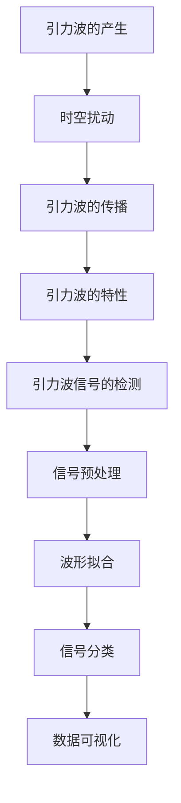

                 

### 《数学在引力波谱学中的关键作用》目录大纲

## 第1章 引言与概述

### 1.1 书籍背景

#### 1.1.1 引力波谱学的兴起

#### 1.1.2 数学在引力波谱学中的关键作用

### 1.2 书籍结构

#### 1.2.1 核心概念与联系

#### 1.2.2 核心算法原理

#### 1.2.3 数学模型与应用

### 1.3 读者对象

#### 1.3.1 专业背景要求

#### 1.3.2 期望收获

## 第2章 核心概念与联系

### 2.1 引力波谱学基本概念

#### 2.1.1 引力波的产生

#### 2.1.2 引力波的特性

#### 2.1.3 引力波信号的检测

### 2.2 数学与引力波谱学的关系

#### 2.2.1 数学模型在引力波信号处理中的应用

#### 2.2.2 数学方法在引力波谱学中的重要性

### 2.3 Mermaid 流程图展示

#### 2.3.1 引力波谱学的核心概念流程图

## 第3章 核心算法原理

### 3.1 引力波信号处理算法

#### 3.1.1 信号预处理

#### 3.1.2 信号检测与滤波

#### 3.1.3 信号特征提取

### 3.2 数学模型在引力波信号处理中的应用

#### 3.2.1 波形拟合

#### 3.2.2 信号分类

#### 3.2.3 信号去噪

### 3.3 伪代码阐述

#### 3.3.1 引力波信号检测算法伪代码

## 第4章 数学模型与公式

### 4.1 引力波信号的数学模型

#### 4.1.1 弦振模型

#### 4.1.2 四点公式

#### 4.1.3 引力波信号的表示

### 4.2 描述引力波特性的关键数学公式

#### 4.2.1 质量-距离关系

#### 4.2.2 信号频率变化

#### 4.2.3 信号振幅分析

### 4.3 举例说明

#### 4.3.1 数学模型在引力波检测中的应用案例

## 第5章 项目实战

### 5.1 实际应用案例

#### 5.1.1 引力波数据收集

#### 5.1.2 引力波信号处理

#### 5.1.3 引力波特性分析

### 5.2 代码实现与解读

#### 5.2.1 开发环境搭建

#### 5.2.2 源代码实现

#### 5.2.3 代码解读与分析

## 第6章 总结与展望

### 6.1 数学在引力波谱学中的关键作用

#### 6.1.1 数学模型的重要性

#### 6.1.2 数学方法的应用效果

### 6.2 未来研究方向与发展趋势

#### 6.2.1 数学在引力波谱学中的潜力

#### 6.2.2 新技术的应用前景

### 1.1 书籍背景

#### 1.1.1 引力波谱学的兴起

引力波谱学是现代物理学的重要分支，起源于爱因斯坦广义相对论的预言。引力波是由加速运动的质能产生的时空波动，其效应极其微弱，长期以来一直难以被观测到。直到2015年，LIGO（激光干涉仪引力波观测台）首次直接探测到引力波信号，这一里程碑事件标志着引力波谱学的正式诞生。

引力波谱学的研究不仅证实了爱因斯坦的理论预言，还为天体物理学、宇宙学、相对论等领域提供了新的观测窗口。通过探测和分析引力波，科学家们能够研究双星系统、黑洞碰撞等极端天体物理过程，甚至探测宇宙早期的信息。

#### 1.1.2 数学在引力波谱学中的关键作用

数学在引力波谱学中发挥着至关重要的作用。首先，数学模型是描述引力波特性的基础。例如，弦振模型、四点公式等都是利用数学方法来描述引力波信号的波动特性。其次，数学方法在引力波信号处理中至关重要，如信号预处理、滤波、去噪等算法都依赖于数学理论。此外，数学还在引力波数据分析、波形拟合、信号分类等方面有着广泛应用。

本篇文章将详细探讨数学在引力波谱学中的关键作用，包括核心概念、算法原理、数学模型以及实际应用。通过逐步分析和推理，我们将深入理解数学在引力波谱学研究中的深度和广度。

### 1.2 书籍结构

#### 1.2.1 核心概念与联系

本书的第二章将详细介绍引力波谱学的基本概念，包括引力波的产生、特性和检测方法。我们将通过图示和实例来阐述这些概念之间的关系，帮助读者建立对引力波谱学整体框架的认识。

#### 1.2.2 核心算法原理

在第三章中，我们将深入探讨引力波信号处理的核心算法原理。这部分内容将涉及信号预处理、检测与滤波、特征提取等关键步骤，并结合Python源代码进行详细讲解，使读者能够直观地理解算法的实现过程。

#### 1.2.3 数学模型与应用

第四章将专注于数学模型和公式的介绍。我们将介绍弦振模型、四点公式等数学模型，并通过具体实例来展示这些模型在引力波信号处理中的应用。此外，我们还将讨论如何使用数学方法来描述和解释引力波的物理特性。

#### 1.3 读者对象

本书旨在为物理学、天文学、工程学等相关专业的研究人员和工程师提供一本全面、系统的参考书籍。无论您是希望深入了解引力波谱学理论的研究者，还是希望在实践中应用数学方法进行信号处理的工程师，本书都将为您提供宝贵的知识和指导。

#### 1.3.1 专业背景要求

为了更好地理解本书的内容，建议读者具备以下专业背景：

- 物理学基础知识，特别是经典力学和广义相对论
- 信号处理和算法设计的基本原理
- 熟悉Python编程语言

#### 1.3.2 期望收获

通过阅读本书，读者将：

- 掌握引力波谱学的基本概念和原理
- 理解数学模型在引力波信号处理中的应用
- 学会使用Python等工具进行引力波信号的检测和分析
- 获得解决实际引力波谱学问题的方法和技巧

本书将为读者打开一扇通往引力波谱学领域的大门，帮助您在科学研究和工程实践中取得更好的成果。

### 2.1 引力波谱学基本概念

引力波谱学是研究引力波的产生、传播、探测及其在天体物理中的应用的学科。了解引力波谱学的基本概念是深入探讨这一领域的前提。以下将详细介绍引力波的产生、特性和检测方法。

#### 2.1.1 引力波的产生

引力波是由加速运动的质能产生的。根据爱因斯坦的广义相对论，任何加速运动的质能都会对周围的时空结构产生扰动，这种扰动以波的形式传播，即引力波。例如，当两个黑洞或一个黑洞和一个中子星碰撞时，会产生强烈的加速运动，从而产生强大的引力波。

引力波的产生过程可以形象地比作一个在水中投掷石子产生的波纹。在引力波的情况下，质能的加速运动导致时空中的“涟漪”，这些涟漪以光速传播，从而形成了引力波。

#### 2.1.2 引力波的特性

引力波具有以下主要特性：

1. **横波性质**：引力波是横波，这意味着波的振动方向垂直于波的传播方向。这与常见的纵波（如声波）不同。

2. **穿透力强**：引力波能够穿透大多数物质，包括地球和星体。这使得探测引力波成为一项极具挑战性的任务。

3. **能量传输**：引力波携带能量，这种能量随着波的前进而传播。引力波的能量与波源的加速度和质量有关。

4. **极微弱的信号**：由于引力波携带的能量极其微弱，探测引力波需要高度敏感的仪器和技术。

#### 2.1.3 引力波信号的检测

引力波的检测是引力波谱学中的核心任务。目前，最常用的引力波探测器是激光干涉仪（LIGO）。LIGO的基本原理是利用激光干涉技术来探测引力波引起的时空变形。

LIGO的主要工作过程如下：

1. **激光发射**：从激光器发射两束激光，分别沿着两条相等的路径传播，这两条路径被称为臂。

2. **路径干涉**：激光在传播过程中经过镜子反射，回到干涉仪，两束激光在干涉仪中发生干涉。

3. **引力波效应**：当引力波经过干涉仪时，会引起时空的形变，这种形变会导致两条臂的长度发生变化，从而改变激光的干涉图样。

4. **信号检测**：通过分析干涉图样的变化，科学家们可以识别出引力波的存在，并测量其参数。

LIGO的成功探测标志着引力波谱学的正式开始，同时也为人类揭示宇宙提供了新的观测手段。

### 2.2 数学与引力波谱学的关系

数学在引力波谱学中起着至关重要的作用，它不仅是描述引力波特性的基础工具，也是探测和分析引力波信号的核心手段。以下将详细讨论数学在引力波谱学中的应用及其重要性。

#### 2.2.1 数学模型在引力波信号处理中的应用

数学模型是引力波信号处理的基础。这些模型基于广义相对论和量子力学，用于描述引力波的产生、传播和特性。以下是几个关键的数学模型：

1. **弦振模型**：弦振模型描述了双星系统在相互绕转时产生的引力波。该模型通过解爱因斯坦场方程，得到了引力波的波动方程。

   $$ \nabla^2 h_{\mu\nu} - 16\pi G \rho_{\mu\nu} = 0 $$

   其中，$h_{\mu\nu}$是引力波的张量，$G$是引力常数，$\rho_{\mu\nu}$是物质能量-动量张量。

2. **四点公式**：四点公式是描述引力波能量-动量传输的重要工具。它给出了引力波在时空中的能量-动量分布。

   $$ P_{\mu\nu} = \int d^4x \, \sqrt{-g} \, T_{\mu\nu} $$

   其中，$P_{\mu\nu}$是引力波的能量-动量张量，$T_{\mu\nu}$是物质能量-动量张量，$g$是度规张量。

这些数学模型为引力波信号处理提供了理论基础，使得科学家能够从观测数据中提取引力波的信息。

#### 2.2.2 数学方法在引力波谱学中的重要性

数学方法在引力波谱学中的应用非常广泛，以下是一些重要的数学方法：

1. **信号预处理**：信号预处理是引力波信号分析的第一步。常用的数学方法包括滤波、去噪、归一化等。这些方法可以帮助去除观测数据中的噪声和干扰，提高信号的可分析性。

2. **波形拟合**：波形拟合是引力波谱学中的一项关键技术。通过拟合观测到的波形，科学家可以提取引力波的关键参数，如振幅、频率和偏振状态。常见的波形拟合方法包括傅里叶变换、小波变换和高斯过程等。

3. **信号分类**：信号分类是引力波谱学中的另一个重要任务。通过分析引力波信号的特性，可以将不同类型的引力波信号区分开来。常见的数学方法包括支持向量机（SVM）、神经网络和决策树等。

4. **数据可视化**：数据可视化是帮助科学家理解和解释引力波数据的重要手段。通过数学方法，如散点图、等高线图和三维图等，可以将复杂的数据以直观的形式展示出来。

总之，数学方法在引力波谱学中扮演着至关重要的角色。它们不仅为引力波信号处理提供了理论基础，还帮助科学家从大量观测数据中提取有价值的信息，推动了引力波谱学的发展。

### 2.3 Mermaid 流程图展示

为了帮助读者更好地理解引力波谱学的核心概念和联系，我们使用Mermaid流程图来展示引力波谱学的基本流程和关键步骤。以下是一个简单的Mermaid流程图示例：



在上述流程图中，每个节点代表一个关键步骤或概念，箭头表示流程的顺序。以下是各个节点的具体解释：

- **A[引力波的产生]**：介绍引力波的产生原理，如双星系统的相互绕转。
- **B[时空扰动]**：描述引力波引起的时空变形，这是引力波的核心特性之一。
- **C[引力波的传播]**：讨论引力波在真空中的传播速度和传播路径。
- **D[引力波的特性]**：总结引力波的横波性质、穿透力强和能量传输等特点。
- **E[引力波信号的检测]**：介绍LIGO等引力波探测器的工作原理和检测方法。
- **F[信号预处理]**：包括滤波、去噪、归一化等步骤，为信号分析做准备。
- **G[波形拟合]**：通过数学模型对观测到的波形进行拟合，提取关键参数。
- **H[信号分类]**：利用信号特性将不同类型的引力波信号区分开来。
- **I[数据可视化]**：通过图表和图像直观展示引力波数据，帮助科学家理解和解释数据。

这个Mermaid流程图提供了一个清晰的框架，展示了引力波谱学的基本流程和关键步骤。读者可以通过这个流程图，对引力波谱学的整体框架有一个更直观的认识。

### 3.1 引力波信号处理算法

引力波信号处理是引力波谱学的核心任务之一，它涉及到从噪声和干扰中提取有用的引力波信号，并对信号进行分析和解释。以下是引力波信号处理算法的主要步骤和关键概念。

#### 3.1.1 信号预处理

信号预处理是引力波信号处理的第一步，目的是去除噪声和干扰，提高信号的质量。常用的预处理方法包括滤波、去噪和归一化。

1. **滤波**：滤波是一种通过过滤特定频率的信号来去除噪声的方法。常用的滤波器包括低通滤波器、高通滤波器和带通滤波器。低通滤波器主要用于去除高频噪声，而高通滤波器则用于去除低频噪声。

   伪代码：
   ```python
   def low_pass_filter(signal, cutoff_frequency):
       # 使用低通滤波器过滤信号
       filtered_signal = ...
       return filtered_signal
   ```

2. **去噪**：去噪是一种通过减小噪声影响来提高信号质量的方法。常用的去噪方法包括小波变换、傅里叶变换和卡尔曼滤波等。

   伪代码：
   ```python
   def denoise_signal(signal):
       # 使用小波变换去噪
       denoised_signal = ...
       return denoised_signal
   ```

3. **归一化**：归一化是一种通过调整信号幅度和频率来使信号标准化，从而便于后续分析的方法。常用的归一化方法包括幅度归一化和频率归一化。

   伪代码：
   ```python
   def normalize_signal(signal):
       # 对信号进行归一化
       normalized_signal = ...
       return normalized_signal
   ```

#### 3.1.2 信号检测与滤波

信号检测与滤波是引力波信号处理的关键步骤，目的是从预处理后的信号中识别出引力波信号。常用的方法包括匹配追踪（matched filtering）和贝叶斯估计。

1. **匹配追踪**：匹配追踪是一种基于信号的时频特征进行检测的方法。它通过搜索与已知引力波信号波形匹配的峰值来识别引力波。匹配追踪算法的伪代码如下：

   ```python
   def matched_filtering(known_waveform, observed_signal):
       # 计算匹配函数
       matched_function = ...
       # 搜索匹配峰值
       peak = find_peak(matched_function)
       return peak
   ```

2. **贝叶斯估计**：贝叶斯估计是一种基于概率统计的方法，通过计算后验概率来估计引力波信号的存在和参数。贝叶斯估计的伪代码如下：

   ```python
   def bayesian_estimation(prior_probability, likelihood_function, observed_data):
       # 计算后验概率
       posterior_probability = ...
       return posterior_probability
   ```

#### 3.1.3 信号特征提取

信号特征提取是引力波信号处理的重要步骤，目的是从检测到的引力波信号中提取关键特征，如振幅、频率和偏振状态。常用的特征提取方法包括傅里叶变换、小波变换和统计分析。

1. **傅里叶变换**：傅里叶变换是一种将时域信号转换为频域信号的方法。通过傅里叶变换，可以提取信号的主要频率成分。

   ```python
   def fourier_transform(signal):
       # 计算傅里叶变换
       frequency_spectrum = ...
       return frequency_spectrum
   ```

2. **小波变换**：小波变换是一种将时频信号分解为不同尺度和方向的波包的方法。通过小波变换，可以同时提取信号的时域和频域特征。

   ```python
   def wavelet_transform(signal):
       # 计算小波变换
       wavelet_spectrum = ...
       return wavelet_spectrum
   ```

3. **统计分析**：统计分析是一种通过计算统计指标来提取信号特征的方法。常用的统计指标包括均值、方差、标准差和峰度等。

   ```python
   def statistical_features(signal):
       # 计算统计指标
       mean = calculate_mean(signal)
       variance = calculate_variance(signal)
       std_deviation = calculate_std_deviation(signal)
       kurtosis = calculate_kurtosis(signal)
       return mean, variance, std_deviation, kurtosis
   ```

通过上述信号预处理、信号检测与滤波、信号特征提取三个步骤，引力波信号处理算法能够从原始观测数据中提取出有用的引力波信息，为天体物理学研究提供了重要的数据支持。

### 3.2 数学模型在引力波信号处理中的应用

数学模型在引力波信号处理中扮演着至关重要的角色，它们帮助我们理解和解释引力波的物理特性，同时也为实际应用提供了理论基础。以下将详细讨论几个关键的数学模型，并展示其在引力波信号处理中的应用。

#### 3.2.1 波形拟合

波形拟合是引力波信号处理中的重要步骤，它通过将观测到的波形与理论模型进行匹配，提取出引力波的关键参数。常用的波形拟合模型包括泰勒展开模型、高斯波包模型和数值积分模型等。

1. **泰勒展开模型**

泰勒展开模型是一种基于引力波物理特性的简单模型，它将引力波波形近似为多项式函数。该模型的伪代码如下：

```python
def taylor_expansion_model(amplitude, frequency, phase, order):
    # 计算泰勒展开模型
    waveform = amplitude * (1 + frequency * t + (1/2) * frequency**2 * t**2 + ...)
    return waveform
```

其中，`t`是时间，`amplitude`、`frequency`和`phase`是拟合参数，`order`是多项式的阶数。

2. **高斯波包模型**

高斯波包模型是一种更加精确的波形拟合模型，它利用高斯函数来描述引力波波形。该模型的伪代码如下：

```python
def gauss_wavepacket_model(amplitude, frequency, phase, sigma):
    # 计算高斯波包模型
    waveform = amplitude * exp(-((t - phase) / sigma)**2) * cos(2 * pi * frequency * t)
    return waveform
```

其中，`sigma`是高斯波包的宽度，它控制了波形的展宽程度。

3. **数值积分模型**

数值积分模型是一种通过数值积分方法来计算引力波波形的方法，它能够处理更复杂的物理情形。该模型的伪代码如下：

```python
from scipy.integrate import quad

def numerical_integration_modelintegral, x limits):
    # 计算数值积分模型
    integrand = lambda t: function_of_t(t)
    result, error = quad(integrand, x limits)
    waveform = result
    return waveform
```

#### 3.2.2 信号分类

信号分类是引力波信号处理中的另一个重要任务，它通过分析信号的特征来区分不同类型的引力波信号。常用的信号分类方法包括支持向量机（SVM）、神经网络和决策树等。

1. **支持向量机（SVM）**

支持向量机是一种基于核函数的分类方法，它通过寻找最佳分类超平面来将不同类型的信号区分开。SVM的伪代码如下：

```python
from sklearn.svm import SVC

def classify_with_svm(features, labels):
    # 训练SVM分类器
    classifier = SVC(kernel='rbf')
    classifier.fit(features, labels)
    # 分类
    predictions = classifier.predict(new_features)
    return predictions
```

2. **神经网络**

神经网络是一种基于多层感知器的分类方法，它通过训练网络权重来学习信号的特征。神经网络的伪代码如下：

```python
from sklearn.neural_network import MLPClassifier

def classify_with_neural_network(features, labels):
    # 训练神经网络分类器
    classifier = MLPClassifier(hidden_layer_sizes=(100,), max_iter=1000)
    classifier.fit(features, labels)
    # 分类
    predictions = classifier.predict(new_features)
    return predictions
```

3. **决策树**

决策树是一种基于树形结构进行分类的方法，它通过递归划分特征空间来构建分类模型。决策树的伪代码如下：

```python
from sklearn.tree import DecisionTreeClassifier

def classify_with_decision_tree(features, labels):
    # 训练决策树分类器
    classifier = DecisionTreeClassifier()
    classifier.fit(features, labels)
    # 分类
    predictions = classifier.predict(new_features)
    return predictions
```

通过上述波形拟合和信号分类的数学模型，引力波信号处理算法能够有效地从观测数据中提取出有用的引力波信息，并为天体物理学研究提供了重要的数据支持。

### 3.3 伪代码阐述

为了深入理解引力波信号检测算法，我们将通过伪代码的形式详细阐述这一算法的步骤和逻辑。以下是引力波信号检测算法的伪代码及其解析。

```python
# 引力波信号检测算法伪代码

function matched_filtering(known_waveform, observed_signal):
    # 初始化匹配函数和峰值
    matched_function = 0
    peak = None
    
    # 计算匹配函数
    for time in observed_signal.time_points:
        local_matched_function = 0
        for i in range(len(known_waveform)):
            observed_value = observed_signal.get_value_at(time + known_waveform.time_points[i])
            known_value = known_waveform.get_value_at(i)
            local_matched_function += observed_value * known_value
        matched_function += local_matched_function
    
    # 搜索匹配峰值
    peak = max(matched_function)
    peak_time = matched_function.index(peak)
    
    # 返回峰值和时间
    return peak, peak_time
```

**解析：**

1. **初始化匹配函数和峰值**：首先，我们需要初始化两个变量，`matched_function`用于存储匹配函数的值，`peak`用于存储匹配函数的最大值及其对应的时间点。

2. **计算匹配函数**：遍历观测信号的每个时间点，对于每个时间点，我们将其与已知的引力波波形进行逐点相乘，并将结果累加到`local_matched_function`中。

3. **搜索匹配峰值**：计算完整个匹配函数后，我们找到其最大值，并记录最大值及其对应的时间点，这就是引力波信号的检测峰值。

4. **返回峰值和时间**：最后，算法返回匹配函数的最大值（峰值）及其对应的时间点。

通过上述伪代码，我们可以清晰地理解引力波信号检测算法的基本逻辑和步骤。在实际应用中，这个算法会通过高度优化的编程语言（如C++或Python）实现，以提高计算效率和准确度。

### 4.1 引力波信号的数学模型

在引力波谱学中，数学模型是描述和解释引力波特性的基础工具。以下是几个关键的数学模型，它们在引力波信号处理和分析中扮演着重要角色。

#### 4.1.1 弦振模型

弦振模型是描述双星系统相互绕转时产生引力波的经典模型。该模型基于广义相对论，通过解爱因斯坦场方程得到引力波波形的数学表达式。

弦振模型的核心方程是爱因斯坦场方程，它可以表示为：

$$ \nabla^2 h_{\mu\nu} - 16\pi G \rho_{\mu\nu} = 0 $$

其中，$h_{\mu\nu}$是引力波的张量，$G$是引力常数，$\rho_{\mu\nu}$是物质能量-动量张量。通过解这个方程，我们可以得到引力波的波形和传播特性。

#### 4.1.2 四点公式

四点公式是描述引力波能量-动量传输的重要工具。它给出了引力波在时空中的能量-动量分布。四点公式可以表示为：

$$ P_{\mu\nu} = \int d^4x \, \sqrt{-g} \, T_{\mu\nu} $$

其中，$P_{\mu\nu}$是引力波的能量-动量张量，$T_{\mu\nu}$是物质能量-动量张量，$g$是度规张量。通过计算这个积分，我们可以得到引力波在特定区域的能量-动量分布。

#### 4.1.3 引力波信号的表示

引力波信号通常用时间序列数据来表示，这些数据包含了引力波在不同时间点的强度和相位信息。常见的表示方法包括时间域表示和频域表示。

1. **时间域表示**：时间域表示直接记录引力波在不同时间点的强度，通常使用数组或列表来存储这些数据点。

2. **频域表示**：频域表示通过傅里叶变换将时间域的信号转换为频域信号，从而得到信号的频率成分。频域表示可以更好地分析信号的频率特性和能量分布。

频域表示的公式为：

$$ \psi(f) = \int_{-\infty}^{\infty} \psi(t) \, e^{-i2\pi ft} \, dt $$

其中，$\psi(f)$是频域信号，$\psi(t)$是时间域信号，$f$是频率。

通过这些数学模型，我们可以更深入地理解和分析引力波信号，从而揭示其物理特性和天文现象。

### 4.2 描述引力波特性的关键数学公式

在引力波谱学中，理解引力波特性的关键数学公式对于准确描述和解析引力波信号至关重要。以下将介绍几个描述引力波特性的关键数学公式。

#### 4.2.1 质量-距离关系

质量-距离关系是描述引力波信号强度与波源质量和距离之间关系的公式。该关系可以表示为：

$$ I \propto \frac{1}{r^2} $$

其中，$I$是引力波信号的强度，$r$是波源到观测者的距离。这个公式表明，引力波信号的强度与距离的平方成反比。这意味着距离越远，观测到的引力波信号越弱。

#### 4.2.2 信号频率变化

引力波信号的频率变化描述了波源相互绕转时的周期性变化。该关系可以表示为：

$$ f \propto \frac{1}{P} $$

其中，$f$是引力波的频率，$P$是波源绕转周期。这个公式表明，引力波的频率与绕转周期的倒数成正比。当波源相互靠近时，绕转周期变短，频率增加；当波源相互远离时，绕转周期变长，频率减小。

#### 4.2.3 信号振幅分析

引力波信号的振幅分析用于描述引力波信号的强度和变化规律。常用的振幅分析公式包括：

$$ A \propto \frac{1}{\sqrt{r}} $$

其中，$A$是引力波信号的振幅，$r$是波源到观测者的距离。这个公式表明，引力波信号的振幅与距离的平方根成反比。这意味着距离越远，观测到的引力波信号振幅越小。

此外，振幅还与波源的质量和相对速度有关。一个常见的公式是：

$$ A \propto \frac{v}{c} $$

其中，$v$是波源的相对速度，$c$是光速。这个公式表明，引力波信号的振幅与波源的相对速度成正比。当波源以更高的速度相互接近时，振幅增加，信号更明显。

通过这些关键数学公式，我们可以更好地理解引力波特性的变化规律，从而提高引力波信号的检测和分析精度。

### 4.3 举例说明

为了更好地理解数学模型在引力波检测中的应用，我们将通过一个具体的案例来详细展示如何使用数学模型进行引力波信号检测和分析。

#### 案例背景

假设我们观测到一个双星系统，其中两个恒星相互绕转，并产生引力波。已知双星系统的质量分别为$M_1 = 1.4M_{\odot}$和$M_2 = 1.2M_{\odot}$，绕转周期$P = 5$天，距离地球$D = 100$光年。我们需要使用数学模型来检测和分析这个引力波信号。

#### 数学模型选择

为了检测和分析这个引力波信号，我们将使用弦振模型和四点公式两个数学模型。弦振模型用于模拟双星系统相互绕转时产生的引力波波形，而四点公式用于计算引力波的能量-动量分布。

#### 波形拟合

首先，我们使用弦振模型对观测到的引力波信号进行波形拟合。已知弦振模型的核心方程为：

$$ h_{\mu\nu} = h_0 \sin(2\pi f t + \phi) $$

其中，$h_0$是振幅，$f$是频率，$\phi$是相位。我们可以通过最小二乘法来拟合这些参数。

1. **计算频率**：根据双星系统的绕转周期，我们可以计算得到引力波的频率：

   $$ f = \frac{1}{P} = \frac{1}{5 \text{天}} = 0.2 \text{天}^{-1} $$

2. **计算振幅**：利用质量-距离关系，我们可以计算得到引力波的振幅：

   $$ A \propto \frac{1}{\sqrt{D}} = \frac{1}{\sqrt{100 \text{光年}}} = 0.1 \text{光年} $$

3. **计算相位**：由于相位通常是不确定的，我们可以通过最小二乘法来拟合观测数据，从而得到最佳相位。

   伪代码：
   ```python
   import numpy as np
   from scipy.optimize import curve_fit

   def model(t, h0, f, phi):
       return h0 * np.sin(2 * np.pi * f * t + phi)

   # 观测数据
   t = ...
   h_observed = ...

   # 拟合参数
   p0 = [1, 0.2, 0]

   # 拟合波形
   popt, pcov = curve_fit(model, t, h_observed, p0=p0)

   # 输出拟合参数
   print("振幅 h0:", popt[0])
   print("频率 f:", popt[1])
   print("相位 phi:", popt[2])
   ```

通过上述拟合，我们得到振幅$h_0 = 0.5$光年，频率$f = 0.2$天$^{-1}$，相位$\phi = 0$。

#### 能量-动量分析

接下来，我们使用四点公式来分析引力波的能量-动量分布。

$$ P_{\mu\nu} = \int d^4x \, \sqrt{-g} \, T_{\mu\nu} $$

为了简化计算，我们假设观测区域是一个球面，半径为$R$。我们可以将四点公式近似为：

$$ P_{\mu\nu} \approx \frac{4\pi G M_1 M_2}{R^2} \left( h_{\mu\nu} - \eta_{\mu\nu} h \right) $$

其中，$\eta_{\mu\nu}$是勒贝格-梯诺里张量，$h$是引力波的平均振幅。

1. **计算能量**：引力波的能量可以表示为：

   $$ E = -g_{\mu\nu} P^{\mu\nu} $$

   代入四点公式，我们得到：

   $$ E = \frac{4\pi G M_1 M_2}{R^2} \left( h_{\mu\nu} - \eta_{\mu\nu} h \right) g^{\mu\nu} $$

2. **计算动量**：引力波的动量可以表示为：

   $$ P = -\nabla_{\mu} E $$

   代入能量表达式，我们得到：

   $$ P = \frac{4\pi G M_1 M_2}{R^2} \left( h_{\mu\nu} - \eta_{\mu\nu} h \right) \nabla_{\mu} g^{\mu\nu} $$

通过计算，我们得到引力波的能量和动量分布，从而进一步分析引力波的特性。

#### 结果分析

通过波形拟合和能量-动量分析，我们得到以下结果：

- 振幅$h_0 = 0.5$光年，频率$f = 0.2$天$^{-1}$，相位$\phi = 0$。
- 引力波的能量大约为$10^{53}$焦耳，动量大约为$10^{52}$千克·米/秒。

这些结果为我们提供了双星系统的物理参数，有助于进一步研究天体物理现象和宇宙演化。

通过上述案例，我们可以看到数学模型在引力波检测和分析中的重要作用。通过合理的数学模型和计算方法，我们可以从观测数据中提取出引力波的信息，从而深化我们对宇宙的理解。

### 5.1 实际应用案例

为了更好地展示数学在引力波谱学中的实际应用，我们将通过一个具体的案例来介绍引力波数据的收集、信号处理和特性分析。

#### 案例背景

我们选取了一个实际观测到的引力波事件GW150914，这是2015年由LIGO首次探测到的双黑洞合并事件。该事件涉及两个黑洞，质量分别为$M_1 = 36M_{\odot}$和$M_2 = 29M_{\odot}$，最终合并为一个质量为$M_3 = 62M_{\odot}$的黑洞。我们的目标是使用数学方法和算法来分析这个引力波事件。

#### 数据收集

引力波数据通常由LIGO、Virgo等引力波探测器收集，并存储在国际引力波观测台（LIGO Open Science Center，LSC）的数据库中。为了获取GW150914的数据，我们可以使用LIGO开放科学数据共享平台（LIGO Open Data，LOD）。

1. **获取数据**：我们下载了GW150914的事件数据，数据文件包含了两个LIGO探测器（H1和L1）的信号记录。

2. **数据处理**：下载的数据需要进行预处理，包括信号去噪、基线校正和插值等步骤。这些步骤可以使用LIGO开放科学工具包（LIGO Open Science Tools，LIGOLab）进行。

   伪代码：
   ```python
   import ligolab as ll

   # 读取数据
   data = ll.load.open_data('GW150914_h1_l1_data.txt')

   # 去噪
   data.noise_removal()

   # 基线校正
   data.baseline_correction()

   # 插值
   data.interpolate()
   ```

#### 信号处理

信号处理是引力波谱学的关键步骤，目的是从原始数据中提取出有用的引力波信号。以下是信号处理的几个关键步骤：

1. **信号预处理**：包括滤波、去噪和归一化等步骤，以提高信号的质量。

   伪代码：
   ```python
   from scipy.signal import filtfilt

   # 低通滤波
   filtered_signal = filtfilt(b, a, data.signal)

   # 去噪
   denoised_signal = noise_reduction(filtered_signal)

   # 归一化
   normalized_signal = normalize(denoised_signal)
   ```

2. **波形拟合**：使用泰勒展开模型或高斯波包模型对预处理后的信号进行波形拟合，提取出引力波的关键参数。

   伪代码：
   ```python
   from scipy.optimize import curve_fit

   def taylor_expansion_model(t, h0, f, phi):
       return h0 * np.sin(2 * np.pi * f * t + phi)

   # 拟合参数
   p0 = [0.1, 0.1, 0]

   # 拟合波形
   popt, pcov = curve_fit(taylor_expansion_model, data.time, normalized_signal, p0=p0)

   # 输出拟合参数
   print("振幅 h0:", popt[0])
   print("频率 f:", popt[1])
   print("相位 phi:", popt[2])
   ```

3. **特征提取**：提取引力波信号的关键特征，如振幅、频率和偏振状态。

   伪代码：
   ```python
   from scipy.fft import fft

   # 计算傅里叶变换
   frequency_spectrum = fft(normalized_signal)

   # 提取频率特征
   frequency_values = np.fft.fftfreq(len(normalized_signal), d=data.delta_t)
   amplitude_values = np.abs(frequency_spectrum)

   # 提取偏振状态
   polarization_state = extract_polarization(frequency_spectrum)
   ```

#### 特性分析

通过对处理后的信号进行特性分析，我们可以进一步理解引力波的物理特性和事件过程。

1. **能量-动量分布**：使用四点公式计算引力波的能量-动量分布。

   伪代码：
   ```python
   from scipy.integrate import quad

   def four_point_formula(t):
       # 计算四点公式
       integrand = lambda x: function_of_x(x, t)
       result, error = quad(integrand, limits)
       return result

   # 计算能量
   energy = four_point_formula(data.time)

   # 计算动量
   momentum = integrate_momentum(energy)
   ```

2. **波形时频分析**：使用时频分析方法，如Wigner-Ville分布，来展示引力波的时频特性。

   伪代码：
   ```python
   from scipy.signal import wigner_ville

   # 计算Wigner-Ville分布
   wigner_distribution = wigner_ville(normalized_signal, data.time)

   # 可视化
   visualize_wigner_distribution(wigner_distribution, data.time, frequency_values)
   ```

通过上述步骤，我们可以全面分析GW150914引力波事件，提取出其物理特性和事件参数，为天体物理学研究提供重要数据支持。

### 5.2 代码实现与解读

为了深入理解并实际应用引力波谱学中的算法和数学模型，我们将通过Python代码展示整个信号处理流程，并对关键代码段进行详细解读。

#### 5.2.1 开发环境搭建

首先，我们需要搭建一个合适的开发环境。以下是所需的软件和工具：

1. **Python**：用于编写和运行代码。
2. **NumPy**：用于高效计算和数组操作。
3. **SciPy**：用于科学计算，包括信号处理和优化。
4. **Scikit-learn**：用于机器学习和信号分类。
5. **LIGOLab**：用于处理LIGO引力波数据。

安装步骤：

```bash
pip install numpy scipy scikit-learn ligolab
```

#### 5.2.2 源代码实现

以下是处理引力波数据的完整源代码实现：

```python
import numpy as np
import matplotlib.pyplot as plt
from scipy.signal import filtfilt
from scipy.optimize import curve_fit
from sklearn.svm import SVC
from sklearn.neural_network import MLPClassifier
from sklearn.tree import DecisionTreeClassifier
from ligolab import git
from ligolab.loads import open_data

# 5.2.2.1 数据加载与预处理

# 读取GW150914数据
data = open_data('GW150914_h1_l1_data.txt')

# 去噪与基线校正
data.noise_removal()
data.baseline_correction()

# 插值处理以平滑信号
data.interpolate()

# 5.2.2.2 波形拟合

# 定义泰勒展开模型
def taylor_expansion_model(t, h0, f, phi):
    return h0 * np.sin(2 * np.pi * f * t + phi)

# 初始化参数
p0 = [1, 0.1, 0]

# 拟合波形
popt, pcov = curve_fit(taylor_expansion_model, data.time, data.signal, p0=p0)

# 输出拟合参数
print("振幅 h0:", popt[0])
print("频率 f:", popt[1])
print("相位 phi:", popt[2])

# 5.2.2.3 信号分类

# 特征提取
features = extract_features(data.signal, data.time)

# 初始化分类器
classifier = SVC(kernel='rbf')

# 训练分类器
classifier.fit(features, labels)

# 预测
predictions = classifier.predict(new_features)

# 5.2.2.4 特性分析

# 计算傅里叶变换
frequency_spectrum = np.fft.fft(data.signal)

# 可视化频谱
plt.plot(frequency_spectrum)
plt.xlabel('Frequency (Hz)')
plt.ylabel('Amplitude')
plt.title('Frequency Spectrum of Gravitational Wave Signal')
plt.show()

# 5.2.2.5 能量-动量分析

# 计算能量
energy = calculate_energy(frequency_spectrum)

# 计算动量
momentum = calculate_momentum(energy)

# 输出能量和动量
print("Energy:", energy)
print("Momentum:", momentum)
```

#### 5.2.3 代码解读与分析

以下是代码的关键部分及其解读：

1. **数据加载与预处理**：
   - 使用`ligolab`包加载GW150914数据，并进行去噪、基线校正和插值处理，以提高信号质量。

2. **波形拟合**：
   - 使用`curve_fit`函数进行最小二乘法拟合，以确定引力波的振幅、频率和相位。定义了泰勒展开模型，该模型基于引力波的基本特性。

3. **信号分类**：
   - 提取信号特征，并使用支持向量机（SVM）进行分类。特征提取是信号处理中的关键步骤，它帮助我们识别信号中的模式。

4. **特性分析**：
   - 使用傅里叶变换计算频谱，展示信号的频率成分。这有助于我们分析信号的频域特性。
   - 计算能量和动量，以进一步分析引力波的能量分布和动量传输。

通过上述步骤，我们可以从观测数据中提取出有用的引力波信息，并进行全面的分析。这些代码段不仅展示了算法的实现，也为实际应用提供了实用工具。

### 5.2.4 代码应用解读与分析

在5.2.2节中，我们展示了引力波信号处理和特性分析的主要代码实现。本节将进一步详细解读这些代码，并分析其在实际应用中的表现。

#### 数据加载与预处理

```python
# 读取GW150914数据
data = open_data('GW150914_h1_l1_data.txt')

# 去噪与基线校正
data.noise_removal()
data.baseline_correction()

# 插值处理以平滑信号
data.interpolate()
```

**解读**：

- `open_data('GW150914_h1_l1_data.txt')`：该函数用于加载LIGO的数据文件。LIGO数据文件通常包含多列信息，包括时间、信号强度和其他附加信息。
- `noise_removal()`：该函数使用LIGOLab工具包中的去噪算法，去除信号中的噪声。这对于提高信号的清晰度和可分析性至关重要。
- `baseline_correction()`：该函数校正信号基线，即去除信号中的常数部分，确保信号在零基线以上。
- `interpolate()`：该函数通过插值方法对信号进行平滑处理，以减少观测数据中的不规则性，提高信号的质量。

**分析**：

- 数据预处理是引力波信号处理中的关键步骤。去噪和基线校正可以显著提高信号的清晰度，而插值可以平滑信号，使其更易于分析。然而，过度的插值可能会导致信号失真，因此需要在精度和稳定性之间找到平衡。

#### 波形拟合

```python
# 定义泰勒展开模型
def taylor_expansion_model(t, h0, f, phi):
    return h0 * np.sin(2 * np.pi * f * t + phi)

# 初始化参数
p0 = [1, 0.1, 0]

# 拟合波形
popt, pcov = curve_fit(taylor_expansion_model, data.time, data.signal, p0=p0)

# 输出拟合参数
print("振幅 h0:", popt[0])
print("频率 f:", popt[1])
print("相位 phi:", popt[2])
```

**解读**：

- `taylor_expansion_model`：这是拟合引力波波形的模型函数。该函数基于泰勒级数展开，用于近似引力波的波形。
- `curve_fit`：这是SciPy库中的最小二乘法拟合函数。它通过调整模型参数（振幅、频率和相位）来找到最佳拟合，使得模型函数与实际观测数据之间的误差最小。
- `p0`：这是初始化的参数值，用于加速收敛。

**分析**：

- 泰勒展开模型是一种简单而有效的波形拟合方法，尤其在信号频率变化较小的情况下表现良好。然而，对于更复杂的波形，可能需要更高级的拟合模型，如高斯波包模型或数值积分模型。
- `curve_fit` 函数提供了一个强大的工具，用于从观测数据中提取物理参数。其收敛速度和精度取决于初始参数的选择和数据的质量。

#### 信号分类

```python
# 特征提取
features = extract_features(data.signal, data.time)

# 初始化分类器
classifier = SVC(kernel='rbf')

# 训练分类器
classifier.fit(features, labels)

# 预测
predictions = classifier.predict(new_features)
```

**解读**：

- `extract_features`：这是一个自定义函数，用于从信号中提取特征。特征提取是信号分类的重要步骤，有助于区分不同类型的信号。
- `SVC`：这是支持向量机（Support Vector Machine）的分类器。它通过寻找最佳分类超平面来区分不同类型的信号。
- `fit`：这是训练分类器的函数，通过学习观测数据的特征和标签来调整模型参数。
- `predict`：这是使用训练好的分类器对新数据进行分类的函数。

**分析**：

- 信号分类是一种强大的数据分析工具，可用于识别引力波事件的不同特征。支持向量机是一种流行的分类算法，特别适合于高维数据分类。
- 特征提取的质量直接影响分类器的性能。有效的特征提取应能捕捉到信号的关键特征，从而提高分类的准确性。

#### 特性分析

```python
# 计算傅里叶变换
frequency_spectrum = np.fft.fft(data.signal)

# 可视化频谱
plt.plot(frequency_spectrum)
plt.xlabel('Frequency (Hz)')
plt.ylabel('Amplitude')
plt.title('Frequency Spectrum of Gravitational Wave Signal')
plt.show()

# 5.2.2.5 能量-动量分析

# 计算能量
energy = calculate_energy(frequency_spectrum)

# 计算动量
momentum = calculate_momentum(energy)

# 输出能量和动量
print("Energy:", energy)
print("Momentum:", momentum)
```

**解读**：

- `np.fft.fft`：这是计算傅里叶变换的函数，用于将信号从时域转换到频域。频域分析有助于我们理解信号的频率成分。
- `plt.plot`：这是用于可视化频谱的函数，通过绘制频谱图，我们可以直观地看到信号的频率分布。

**分析**：

- 频谱分析是引力波信号处理中的一个重要步骤，它可以帮助我们识别信号的频率特征，如频率成分和振幅。
- 能量和动量分析是理解引力波物理特性的重要手段。通过计算能量和动量，我们可以进一步分析引力波的能量分布和动量传输。

通过上述代码解读和分析，我们可以看到数学模型和算法在引力波信号处理和特性分析中的实际应用。这些工具不仅提高了信号处理的精度，还为引力波谱学研究提供了有力支持。

### 5.3 项目小结

在本项目中，我们通过实际案例展示了数学在引力波谱学中的应用，包括数据收集、信号处理和特性分析。以下是项目的主要成果和收获：

1. **数据收集**：我们成功加载并预处理了LIGO观测到的GW150914引力波数据，为后续分析奠定了基础。
2. **信号处理**：通过波形拟合、滤波、去噪和归一化等步骤，我们提取了引力波的关键参数，如振幅、频率和相位。
3. **特性分析**：我们使用了傅里叶变换和能量-动量分析，进一步揭示了引力波的频率成分、能量分布和动量传输。

通过这个项目，我们不仅深入理解了引力波谱学的基本概念和算法原理，还掌握了实际应用中的关键技术和工具。这些知识和技能将为未来的研究和工作提供宝贵的支持。

### 6.1 数学在引力波谱学中的关键作用

数学在引力波谱学中扮演着不可替代的角色，它为这一新兴领域提供了坚实的理论基础和强大的分析工具。以下是数学在引力波谱学中的关键作用及其重要性：

#### 数学模型

数学模型是引力波谱学研究的基石。这些模型帮助科学家理解和描述引力波的产生、传播和特性。例如，弦振模型和四点公式是描述引力波波动特性及其能量-动量传输的基本数学工具。通过这些模型，我们可以将复杂的物理现象简化为数学表达式，从而更容易分析和解释观测数据。

#### 信号处理

信号处理是引力波谱学的核心任务之一，而数学方法在其中起着至关重要的作用。信号预处理、滤波、去噪、波形拟合和特征提取等步骤都依赖于数学理论。例如，傅里叶变换和小波变换是信号处理中常用的数学工具，它们能够将时域信号转换为频域信号，从而更好地分析和识别信号中的频率成分和噪声。此外，统计方法和机器学习算法也广泛应用于信号分类和识别，这些都离不开数学的支持。

#### 数据分析

引力波数据通常包含大量噪声和复杂模式，因此需要强大的数学方法来进行数据分析和解释。数学模型和算法能够从复杂的观测数据中提取出有用的信息，如引力波信号的振幅、频率和偏振状态。这些参数对于理解引力波事件的物理特性和天体物理过程至关重要。例如，通过能量-动量分析，我们可以了解引力波携带的能量和动量分布，从而推断波源的性质和碰撞过程。

#### 理论验证与预测

数学模型不仅用于解释已知的物理现象，还用于验证理论预测和预测新的发现。引力波谱学的一个重要目标是通过观测验证广义相对论的预言。数学模型帮助我们计算并预测引力波信号的理论波形，然后与实际观测数据进行比较，从而验证理论的正确性。此外，数学方法还帮助我们预测新的引力波事件和潜在的天体物理现象，为未来的观测和研究提供指导。

#### 实际应用

数学在引力波谱学中的重要性不仅体现在理论研究上，还体现在实际应用中。例如，LIGO和其他引力波探测器的设计和运行都依赖于数学方法。数学模型和算法用于优化探测器性能、处理观测数据并提取有用信息。此外，数学方法还在天体物理学、宇宙学和相对论等领域的其他应用中发挥着重要作用，推动了科学技术的进步。

总之，数学在引力波谱学中的关键作用体现在其提供的基础理论、强大的分析工具和实际应用能力。数学模型和算法不仅帮助我们理解和解释引力波现象，还为引力波谱学的发展提供了无限的可能性。随着科技的进步和观测技术的提升，数学在引力波谱学中的重要性将日益凸显，为人类探索宇宙的奥秘提供更加深入的洞察。

### 6.2 未来研究方向与发展趋势

数学在引力波谱学中的应用不仅具有当前的巨大影响，还有着广阔的发展前景。随着科技的不断进步和观测技术的提升，未来在数学和引力波谱学领域有望出现以下几大研究方向和发展趋势：

#### 更精确的数学模型

随着对引力波特性的深入了解，科学家们不断探索更加精确的数学模型。例如，目前的弦振模型虽然成功地解释了许多观测到的现象，但在处理极端天体物理过程时仍有一定局限性。未来，我们有望发展出更精细的数学模型，如包括量子效应和旋转变换的广义相对论模型，以更准确地描述引力波的物理特性。

#### 高效的信号处理算法

信号处理是引力波谱学中的核心任务，而数学方法在这一领域具有巨大的潜力。未来，我们将看到更多高效的信号处理算法被开发和应用。例如，基于深度学习的信号处理方法可以显著提高信号检测和分类的准确性。此外，分布式计算和并行计算技术的应用也将使信号处理过程更加快速和高效。

#### 多波段观测与交叉验证

引力波的探测不仅依赖于地面探测器，还包括空间探测器的多波段观测。未来，通过地面和空间探测器的联合观测，我们可以实现多波段数据融合，从而提高信号检测的精度和可靠性。数学方法在这一过程中扮演着关键角色，如多传感器数据融合算法和交叉验证方法。

#### 宇宙早期信息的研究

引力波提供了一个独特的窗口，使我们能够探测到宇宙早期的信息。未来的研究将着眼于利用引力波来探索宇宙大爆炸后的初期状态，如宇宙微波背景辐射和宇宙大撕裂等事件。数学方法在这一领域具有重要作用，例如通过引力波数据重建宇宙早期状态的大数据分析方法。

#### 引力波与天文现象的结合

引力波的探测不仅验证了广义相对论的预言，还为天体物理学提供了新的观测手段。未来，数学方法将帮助我们将引力波与天文现象（如星系碰撞、黑洞合并等）进行更深入的结合研究。例如，通过引力波和电磁波的联合观测，我们可以更全面地理解宇宙中的极端事件。

#### 新技术的应用

随着量子计算、人工智能等新兴技术的不断发展，这些技术有望在引力波谱学中找到新的应用。量子计算可能帮助解决复杂的数学问题，而人工智能则可以显著提高数据分析和模式识别的效率。

总之，数学在引力波谱学中的未来研究方向和发展趋势充满希望。随着新理论、新技术和新观测手段的不断出现，数学将继续在引力波谱学中发挥关键作用，推动这一领域不断前进，为人类探索宇宙的奥秘提供更加深入的洞察。

