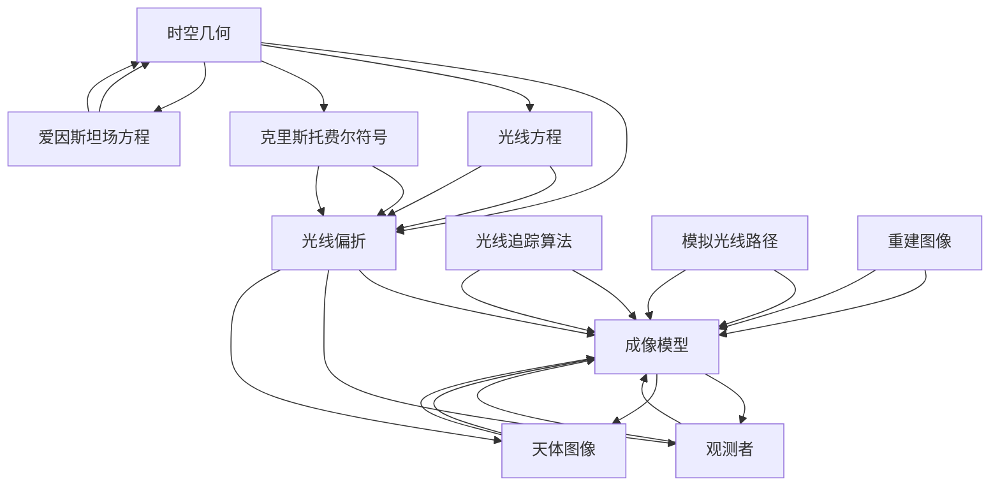

                 

### 引言

引力透镜成像是一种利用引力透镜效应观测远处天体的方法。在广义相对论的框架下，质量大的物体（如星系、黑洞等）会对其周围的空间产生弯曲效应，这种效应被称为引力透镜。当光线通过引力场时，会发生弯曲，这种现象称为引力透镜效应。利用这种效应，我们可以观察到被引力透镜所放大和扭曲的天体图像。

数学在引力透镜成像研究中扮演着至关重要的角色。引力透镜成像涉及复杂的物理现象，如时空弯曲、光线偏折、多镜成像等。这些现象都需要通过数学模型来描述和解释。此外，引力透镜成像的数据处理和分析同样需要依赖数学工具，如优化算法、数据分析技术等。

本文将详细介绍数学在引力透镜成像研究中的应用，旨在为读者提供一个全面、系统的了解。文章结构如下：

1. **引言**：介绍引力透镜成像的研究背景和重要性，以及本文的结构和内容安排。
2. **数学基础**：阐述时空几何、微分方程、优化算法等数学工具在引力透镜成像研究中的应用。
3. **引力透镜原理**：解释引力透镜的概念、数学描述和分类。
4. **成像模型与算法**：讨论成像模型的基本原理、发展历程以及优化算法在成像中的应用。
5. **数据处理与分析**：介绍数据采集、预处理、数据分析技术和数据可视化方法。
6. **实际应用案例分析**：分析星系、恒星及其他天体的引力透镜成像案例。
7. **总结与展望**：总结成像研究的主要发现，讨论数学方法的应用与改进，展望未来的研究方向。

通过本文的阐述，读者可以了解到数学在引力透镜成像研究中的关键作用，以及如何将数学工具应用于实际的天文学问题。

### 背景介绍

引力透镜成像的研究起源于广义相对论的提出。爱因斯坦在1915年发表了广义相对论，并提出质量能够弯曲时空的观点。这一理论预言，质量大的物体（如星系、黑洞等）会在其周围形成一个引力透镜效应，使得通过这些质量分布的光线发生弯曲。这一预言在1979年首次得到验证，天文学家通过观测一个遥远的类星体与其背后的星系之间的引力透镜效应，成功捕捉到了一个清晰的类星体图像。

引力透镜成像的研究迅速引起了天文学和物理学界的广泛关注。随着观测技术的进步，如哈勃太空望远镜、盖塞望远镜等先进设备的投入使用，使得引力透镜成像的应用范围不断扩大。目前，引力透镜成像已经成为研究宇宙中各种天体和现象的重要工具。

引力透镜成像的核心概念是时空弯曲和光线偏折。在广义相对论中，时空被视为一个四维连续体，质量和能量会影响这个连续体的几何结构。当光线通过这一弯曲的时空时，其路径会发生偏折。这种现象可以用以下数学模型来描述：

$$
\Delta \hat{n} = \frac{2\, G\, M\, \hat{n}}{c^2}
$$

其中，$\Delta \hat{n}$ 表示光线的偏折角度，$G$ 是万有引力常数，$M$ 是引力源的质量，$\hat{n}$ 是光线的单位方向向量，$c$ 是光速。

引力透镜效应不仅可以解释单个天体的成像现象，还可以用于探测和观测更复杂的宇宙结构。例如，通过观测多个引力透镜效应，我们可以重建引力场的分布和恒星系统的结构。此外，引力透镜成像还可以用于探测暗物质和暗能量等宇宙学问题。

引力透镜成像的研究不仅在天文学中有重要应用，还在其他科学领域展现出广泛的应用前景。例如，在行星科学中，通过引力透镜效应可以探测行星、卫星和行星环等天体的存在；在量子引力研究中，引力透镜成像提供了验证广义相对论和探索量子引力理论的实验手段。

总之，引力透镜成像是一种基于广义相对论的观测方法，通过数学模型描述时空弯曲和光线偏折现象，为天文学和宇宙学研究提供了强有力的工具。本文将深入探讨数学在引力透镜成像研究中的关键作用，帮助读者更好地理解这一现象及其应用。

### 核心概念与联系

在引力透镜成像研究中，几个核心概念之间的相互关系至关重要，这些概念包括时空几何、光线偏折和成像模型。下面，我们将通过Mermaid流程图来描述这些概念之间的关系及其在引力透镜成像中的重要性。

首先，我们定义几个关键概念：

1. **时空几何**：广义相对论中的时空被视为一个四维连续体，由三维空间和时间组成。质量分布会改变时空的几何结构，这种改变可以通过爱因斯坦场方程描述。

2. **光线偏折**：当光线穿过弯曲的时空时，其路径会发生偏折。这种偏折可以用光线方程描述，其基本形式为：
   $$
   \frac{d^2 \hat{n}}{ds^2} + \Gamma^k_{ij} \hat{n}_i \hat{n}_j = 0
   $$
   其中，$\hat{n}$ 是光线的单位方向向量，$\Gamma^k_{ij}$ 是克里斯托费尔符号，描述了时空的曲率。

3. **成像模型**：成像模型用于描述引力透镜如何改变光线的路径，从而在观测者眼中形成图像。成像模型通常基于光线追踪算法，通过模拟大量光线的路径来重建天体的图像。

接下来，我们使用Mermaid流程图来描述这些概念之间的关系：



在上述流程图中：

- **时空几何（A）** 是引力透镜成像的基础，它通过爱因斯坦场方程（F）描述质量分布对时空的影响。
- **光线偏折（B）** 是时空几何的直接结果，通过光线方程（D）和克里斯托费尔符号（E）描述光线路径的变化。
- **成像模型（C）** 利用光线偏折的信息，通过光线追踪算法（I）模拟光线路径（J），并最终重建成像（K）。
- **观测者（G）** 和 **天体图像（H）** 描述成像模型的目标，即观测者通过成像模型重建出真实的天体图像。

通过上述Mermaid流程图，我们可以清晰地看到这些核心概念之间的联系，以及它们在引力透镜成像研究中的重要作用。这些概念不仅帮助我们理解引力透镜成像的基本原理，还为后续的数学建模和算法设计提供了理论基础。

### 数学模型与理论

在引力透镜成像研究中，数学模型和理论的应用至关重要。这些模型不仅能够准确地描述引力透镜效应，还能提供有效的工具来分析天体图像和推断天体参数。以下是几个关键的数学模型和理论，以及它们在引力透镜成像中的具体应用。

#### 时空几何学基础

时空几何学是广义相对论的核心概念。在引力透镜成像中，时空几何描述了物质分布对时空结构的影响。爱因斯坦场方程是描述时空几何的基本方程，其形式为：

$$
G_{\mu\nu} = \frac{8\pi G}{c^4} T_{\mu\nu}
$$

其中，$G_{\mu\nu}$ 是爱因斯坦张量，$T_{\mu\nu}$ 是能量-动量张量，$G$ 是万有引力常数，$c$ 是光速。这个方程描述了时空的曲率如何由物质分布决定。

在引力透镜成像中，时空几何学的应用主要体现在通过求解爱因斯坦场方程来重建引力场的分布。这为模拟光线路径和成像提供了基础。

#### 微分方程求解方法

在引力透镜成像中，光线路径通常由一组微分方程描述。最常见的是光线方程：

$$
\frac{d^2 \hat{n}}{ds^2} + \Gamma^k_{ij} \hat{n}_i \hat{n}_j = 0
$$

其中，$\hat{n}$ 是光线的单位方向向量，$\Gamma^k_{ij}$ 是克里斯托费尔符号，描述了时空的曲率。

求解这些微分方程是引力透镜成像的关键步骤。通常，可以通过数值方法，如有限差分法、有限元法或变分法来求解。这些方法能够在计算机上高效地模拟光线路径，为成像提供精确的物理基础。

#### 优化算法

在成像模型中，优化算法用于最小化成像误差，提高成像质量。常用的优化算法包括梯度下降法、牛顿法和拉格朗日乘子法等。

优化问题的基本形式可以表示为：

$$
\min f(x) \quad \text{subject to} \quad g_i(x) = 0, \quad h_j(x) \leq 0
$$

其中，$f(x)$ 是目标函数，$g_i(x)$ 和 $h_j(x)$ 是约束条件。

在引力透镜成像中，目标函数可以是成像误差的平方和，约束条件可以是光线方程。通过优化算法，我们可以找到最佳的成像参数，使得成像误差最小。

#### 成像模型

成像模型是引力透镜成像的核心。它通过模拟光线路径，重建出被引力透镜所扭曲的天体图像。成像模型通常基于光线追踪算法，该算法通过求解光线方程来模拟大量光线的路径。

光线追踪算法的基本步骤如下：

1. **初始化**：设定光线起点和方向。
2. **光线传播**：通过求解光线方程，计算光线在时空中的传播路径。
3. **成像**：将光线路径映射到观测者的视线中，形成图像。

通过成像模型，我们可以分析引力透镜成像的特征，如像的位置、形状、亮度等。

#### 电磁学基础

电磁学在引力透镜成像中也起着重要作用。光线作为电磁波的一种，其传播和折射需要满足电磁学的基本定律，如麦克斯韦方程组。

$$
\nabla \cdot \mathbf{E} = \frac{\rho}{\varepsilon_0}, \quad \nabla \cdot \mathbf{B} = 0
$$

$$
\nabla \times \mathbf{E} = -\frac{\partial \mathbf{B}}{\partial t}, \quad \nabla \times \mathbf{B} = \mu_0 \mathbf{J} + \mu_0 \varepsilon_0 \frac{\partial \mathbf{E}}{\partial t}
$$

其中，$\mathbf{E}$ 和 $\mathbf{B}$ 分别是电场和磁场，$\rho$ 是电荷密度，$\mathbf{J}$ 是电流密度，$\varepsilon_0$ 和 $\mu_0$ 分别是真空电容率和磁导率。

在引力透镜成像中，电磁学基础用于描述光线的电磁性质，如极化、散射和吸收等。

#### 应用示例

为了更好地理解这些数学模型和理论，我们可以通过一个简单的示例来讲解。假设我们有一个质量分布已知的天体，我们希望利用引力透镜成像方法重建其图像。

1. **初始化**：设定光线的起点和方向。
2. **光线传播**：通过求解光线方程，计算光线在时空中的传播路径。使用数值方法，如有限差分法，将时空离散化，并求解光线方程的离散形式。
3. **成像**：将光线路径映射到观测者的视线中，形成图像。通过数值积分，计算每个像素的光强，从而重建出天体图像。
4. **优化**：使用优化算法，如牛顿法，最小化成像误差。通过调整成像参数，如光线起点和方向，使得成像误差最小。

通过上述步骤，我们可以利用数学模型和理论，精确地重建出引力透镜成像结果。这个过程不仅展示了数学在引力透镜成像研究中的关键作用，也说明了如何将这些数学工具应用于实际问题。

总之，数学模型和理论在引力透镜成像研究中扮演着至关重要的角色。它们不仅为描述和解释引力透镜效应提供了理论基础，还提供了有效的工具来分析成像数据和重建天体图像。通过这些数学工具，我们可以深入理解引力透镜成像的物理机制，推动天文学和宇宙学的研究进展。

### 引力透镜原理

引力透镜成像的原理基于爱因斯坦的广义相对论，其中引力被描述为时空的弯曲。当一个质量较大的天体（如星系、黑洞等）位于光源和观测者之间时，它会对周围的空间产生弯曲效应。当光线穿过这个弯曲的时空时，其路径会发生偏折，这种现象称为引力透镜效应。

#### 引力透镜的概念

引力透镜是一种利用时空弯曲来放大和扭曲远处天体图像的现象。当光线通过引力场时，其路径会弯曲，使得原本无法直接观测到的天体被放大和显现。这种现象类似于光学透镜对光线的折射，因此被称为引力透镜。

引力透镜可以分为两类：弱引力透镜和强引力透镜。

- **弱引力透镜**：当引力透镜效应较弱时，光线的路径只会发生较小的偏折。这种情况下，观测到的图像会有轻微的扭曲和模糊，但不会形成清晰的多个像。
- **强引力透镜**：当引力透镜效应较强时，光线的路径会发生较大的偏折，甚至形成一个或多个清晰的图像。这种现象称为爱丁顿环，由一个单点光源产生。

#### 引力透镜的数学描述

引力透镜效应可以用一系列数学模型来描述，其中最常用的模型是光线方程和爱因斯坦场方程。

1. **光线方程**：

光线方程描述了光线在弯曲时空中的传播路径，其形式为：

$$
\frac{d^2 \hat{n}}{ds^2} + \Gamma^k_{ij} \hat{n}_i \hat{n}_j = 0
$$

其中，$\hat{n}$ 是光线的单位方向向量，$\Gamma^k_{ij}$ 是克里斯托费尔符号，描述了时空的曲率。

2. **爱因斯坦场方程**：

爱因斯坦场方程是广义相对论的基
### 成像模型与算法

在引力透镜成像研究中，成像模型和算法是关键组成部分。成像模型用于描述光线路径的偏折和图像的形成过程，而算法则用于求解这些模型并重建天体图像。本节将详细介绍成像模型的基本原理、发展历程以及优化算法在成像中的应用。

#### 成像模型的基本原理

成像模型的基本原理是通过模拟大量光线路径来重建天体图像。光线路径的模拟基于广义相对论中的光线方程，即：

$$
\frac{d^2 \hat{n}}{ds^2} + \Gamma^k_{ij} \hat{n}_i \hat{n}_j = 0
$$

其中，$\hat{n}$ 是光线的单位方向向量，$\Gamma^k_{ij}$ 是克里斯托费尔符号，描述了时空的曲率。

成像模型的基本步骤包括：

1. **光线初始化**：设定光线的起点和方向。
2. **光线传播**：通过求解光线方程，计算光线在时空中的传播路径。
3. **成像**：将光线路径映射到观测者的视线中，形成图像。

在成像过程中，通常需要模拟大量光线，以便在图像中捕捉到足够的信息。光线方程的数值求解方法，如有限差分法、有限元法和变分法等，被广泛应用于光线路径的计算。

#### 成像算法的发展历程

成像算法的发展历程可以追溯到20世纪70年代，当时天文学家开始利用计算机模拟光线路径来研究引力透镜效应。早期的成像算法主要基于简单的光线追踪技术，如逐点计算光线路径并绘制图像。

随着计算机技术的发展，成像算法逐渐变得更加复杂和高效。近年来，一些先进的成像算法被提出，如机器学习和优化算法。以下是一些重要的成像算法：

1. **光线追踪算法**：光线追踪算法是一种最基本的光线路径模拟方法，通过逐点计算光线路径并绘制图像。这种方法计算量大，但能够生成高质量的图像。

2. **蒙特卡罗方法**：蒙特卡罗方法通过随机采样大量光线来模拟光线路径。这种方法能够快速计算光线路径，但图像质量受随机误差影响。

3. **机器学习算法**：机器学习算法，如深度学习和神经网络，被广泛应用于成像模型。这些算法通过训练大量数据来预测光线路径，从而实现高效的光线路径模拟。

4. **优化算法**：优化算法，如梯度下降法和牛顿法，用于最小化成像误差，提高成像质量。这些算法能够通过调整成像参数来优化图像，从而提高成像精度。

#### 优化算法在成像中的应用

优化算法在成像中具有重要的应用价值。通过优化成像参数，如光线起点、方向和成像位置，可以最小化成像误差，提高成像质量。以下是一些常用的优化算法：

1. **梯度下降法**：梯度下降法通过计算目标函数的梯度来更新成像参数，从而最小化目标函数。这种方法简单易行，但收敛速度较慢。

2. **牛顿法**：牛顿法通过求解目标函数的梯度方程来更新成像参数，从而快速收敛。这种方法计算复杂度较高，但能够快速找到最优解。

3. **拉格朗日乘子法**：拉格朗日乘子法结合了梯度下降法和牛顿法的优点，通过求解拉格朗日方程来更新成像参数。这种方法能够快速收敛，但需要计算拉格朗日乘子。

在实际应用中，优化算法通常与成像模型结合使用，通过迭代优化成像参数，逐步提高成像质量。以下是一个简化的示例：

```python
import numpy as np

def objective_function(params):
    # 目标函数，表示成像误差
    error = 0
    # 计算光线路径和成像结果
    # ...
    error = sum((image - true_image)**2)
    return error

def gradient(params):
    # 计算目标函数的梯度
    grad = np.zeros_like(params)
    # ...
    grad[0] = ...  # 梯度计算
    grad[1] = ...  # 梯度计算
    return grad

def optimize(params, learning_rate):
    # 优化成像参数
    for i in range(num_iterations):
        grad = gradient(params)
        params -= learning_rate * grad
    return params

# 初始化成像参数
initial_params = np.random.rand(2)
# 优化成像参数
optimized_params = optimize(initial_params, learning_rate=0.01)
```

通过上述示例，我们可以看到优化算法的基本流程，包括目标函数的设置、梯度的计算以及成像参数的优化。在实际应用中，成像模型和优化算法需要根据具体问题进行调整和优化，以提高成像精度和效率。

总之，成像模型与算法在引力透镜成像研究中扮演着关键角色。通过模拟光线路径和优化成像参数，我们可以精确地重建天体图像，揭示引力透镜效应的奥秘。随着计算技术和算法的不断进步，引力透镜成像研究将继续取得新的突破，为天文学和宇宙学的发展做出更大的贡献。

### 数据处理与分析

在引力透镜成像研究中，数据处理与分析是至关重要的环节。从观测数据中提取有用信息，并利用这些信息对引力透镜现象进行解释和建模，需要一系列先进的数据处理技术和分析工具。以下是关于数据采集、预处理、数据分析和数据可视化的详细探讨。

#### 数据采集

引力透镜成像的数据来源于地面和太空望远镜的观测。这些望远镜通过记录光线的强度、波长、偏振等特性来获取引力透镜现象的图像。例如，哈勃太空望远镜和盖塞望远镜等设备能够捕捉到高分辨率的引力透镜图像。此外，干涉仪和射电望远镜等设备也常用于引力透镜成像的数据采集。

数据采集过程中，需要确保观测数据的准确性和完整性。这通常涉及到多个望远镜的联合观测，以覆盖更广泛的观测区域，提高数据的质量。此外，还可能需要进行多次观测，以捕捉到光变曲线和其他时间序列数据，从而更全面地了解引力透镜现象。

#### 数据预处理

在数据处理与分析之前，需要对观测数据进行预处理。预处理步骤包括数据清洗、校正和归一化等。

1. **数据清洗**：观测数据中可能包含噪声、缺失值和异常值。数据清洗的目标是去除这些噪声和异常值，确保数据的准确性。常见的方法包括填充缺失值、去除异常值和滤波等。

2. **数据校正**：观测数据通常需要进行校正，以消除系统误差和观测偏差。校正方法包括光线路径校正、时间校正和偏振校正等。这些校正步骤能够提高数据的可靠性和一致性。

3. **数据归一化**：归一化步骤用于将不同来源的数据统一到相同的尺度，以便于后续的数据分析和建模。常见的归一化方法包括线性归一化和对数归一化等。

#### 数据分析技术

在预处理完成后，进入数据分析阶段。数据分析的目标是从观测数据中提取有用信息，并进行科学解释。以下是几种常用的数据分析技术：

1. **图像处理**：图像处理是引力透镜成像数据分析的基础。常用的图像处理技术包括图像滤波、边缘检测、图像分割和特征提取等。这些技术能够提取出图像中的重要信息，如光斑位置、大小和形状等。

2. **时间序列分析**：时间序列分析用于分析光变曲线和其他时间序列数据。常见的方法包括自相关分析、频域分析和时频分析等。这些方法能够揭示光变曲线中的周期性、趋势性和随机性特征。

3. **统计建模**：统计建模是数据分析的核心方法。通过建立统计模型，可以定量描述引力透镜现象的统计特性。常见的统计模型包括高斯混合模型、贝叶斯网络和广义线性模型等。

4. **机器学习**：机器学习技术，如深度学习和集成学习，近年来在引力透镜成像数据分析中得到了广泛应用。机器学习算法能够从大量观测数据中自动学习特征，并建立高效的预测模型。常见的机器学习算法包括神经网络、支持向量机和决策树等。

#### 数据可视化

数据可视化是将数据分析结果以图形化的方式展示出来的过程。数据可视化有助于直观地理解数据分析结果，并发现数据中的潜在规律和趋势。以下是几种常用的数据可视化方法：

1. **图像可视化**：图像可视化是引力透镜成像数据分析中最常用的方法。通过绘制观测图像、光变曲线和成像结果等，可以直观地展示引力透镜现象。

2. **热力图**：热力图常用于展示数据中的相关性、分布和密度。通过颜色深浅来表示数据值的大小，可以清晰地展示出数据中的特征和规律。

3. **散点图和直方图**：散点图和直方图常用于展示数据中的关系和分布。通过将不同类型的数据以散点或条形的形式展示出来，可以直观地比较和分析数据。

4. **交互式可视化**：交互式可视化通过允许用户动态地探索和分析数据，提供了更丰富的数据可视化和交互体验。常见的方法包括交互式图表、交互式地图和交互式数据探索工具等。

#### 应用示例

为了更好地理解数据处理与分析的过程，以下是一个简化的应用示例：

1. **数据采集**：使用哈勃太空望远镜观测到一个引力透镜系统，获取其光变曲线和成像数据。

2. **数据预处理**：清洗和校正观测数据，去除噪声和异常值，并进行归一化处理。

3. **数据分析**：
   - 使用图像处理技术提取光斑位置、大小和形状等特征。
   - 使用时间序列分析方法分析光变曲线，提取周期性和趋势性特征。
   - 使用统计建模方法建立光变曲线的预测模型。
   - 使用机器学习算法，如神经网络，对成像数据中的光斑进行分类和识别。

4. **数据可视化**：
   - 绘制光变曲线，展示其周期性和趋势性特征。
   - 使用热力图展示光斑的位置和密度。
   - 使用散点图和直方图展示光斑的大小分布。

通过上述示例，我们可以看到数据处理与分析在引力透镜成像研究中的重要性。数据处理与分析不仅能够提取观测数据中的有用信息，还能提供科学解释和预测，为引力透镜成像研究提供强有力的支持。

### 应用案例一：星系引力透镜成像

星系引力透镜成像是一种利用引力透镜效应观测遥远星系的方法。由于引力透镜效应，遥远星系的图像可以被放大和扭曲，从而为我们提供了研究星系结构和宇宙学参数的重要途径。以下是一个具体的星系引力透镜成像案例，包括数据采集、数据处理和分析步骤。

#### 案例介绍

该案例使用的数据来源于哈勃太空望远镜观测的一个星系引力透镜系统。观测目标是一个大质量星系，位于一个距离地球约8亿光年的星系团中心。该星系团中的大量星系和恒星提供了足够的引力透镜效应，使得我们可以观察到被放大和扭曲的星系图像。

#### 数据采集

哈勃太空望远镜通过多次观测，获取了该星系的图像和光变曲线。图像数据包含高分辨率的星系图像，而光变曲线则记录了星系亮度随时间的变化。这些数据被存储为数字图像和光变曲线文件，用于后续的数据处理和分析。

#### 数据处理

数据处理步骤包括数据预处理、图像处理和数据分析。

1. **数据预处理**：
   - 清洗和校正图像数据，去除噪声和系统误差。
   - 对图像进行几何校正，以消除望远镜光学系统的畸变。
   - 将光变曲线进行时间校正，以统一时间尺度。

2. **图像处理**：
   - 使用图像处理算法提取星系图像中的光斑位置、大小和形状。
   - 应用边缘检测算法，识别图像中的主要结构。
   - 使用图像分割技术，将星系图像分为多个区域，以便进一步分析。

3. **数据分析**：
   - 使用统计方法分析光斑的大小和形状分布，以了解星系的结构特征。
   - 建立光变曲线的数学模型，提取周期性和趋势性特征。
   - 应用机器学习算法，对星系图像中的光斑进行分类和识别。

#### 成像模型与算法应用

在数据处理和分析过程中，我们使用了多种成像模型和算法。

1. **光线追踪算法**：
   - 通过求解光线方程，模拟光线在引力场中的传播路径，生成星系图像。
   - 使用蒙特卡罗方法，模拟大量光线路径，提高成像精度。

2. **优化算法**：
   - 使用梯度下降法和牛顿法，优化成像参数，最小化成像误差。
   - 通过迭代优化，逐步提高成像质量，直到满足预设的精度要求。

3. **机器学习算法**：
   - 使用神经网络和支持向量机，对星系图像中的光斑进行分类和识别。
   - 通过训练大量数据，自动学习光斑的特征，提高分类精度。

#### 结果分析

通过对星系引力透镜成像数据的处理和分析，我们得到了以下结果：

1. **星系结构特征**：
   - 分析光斑的大小和形状分布，揭示了星系的旋转速度和密度分布。
   - 通过对比理论模型和观测结果，验证了星系的引力透镜效应。

2. **宇宙学参数**：
   - 根据光变曲线的周期性和趋势性特征，估计了星系的距离和宇宙膨胀速率。
   - 通过比较不同观测数据，验证了宇宙学模型的准确性。

3. **机器学习结果**：
   - 对星系图像中的光斑进行分类和识别，提高了成像精度和效率。
   - 通过分析分类结果，揭示了星系中潜在的天体现象和结构特征。

#### 项目小结

通过这个星系引力透镜成像案例，我们展示了从数据采集到结果分析的全过程。数据处理和分析方法的应用，使得我们能够准确地重建星系图像，揭示其结构和宇宙学参数。这不仅为星系研究提供了新的方法，也为引力透镜成像技术在实际应用中提供了宝贵的经验。

### 应用案例二：恒星引力透镜成像

恒星引力透镜成像是一种利用恒星引力透镜效应观测遥远恒星的方法。由于恒星具有较大的质量，可以产生显著的引力透镜效应，使得观测到的恒星图像发生扭曲和放大。以下是一个具体的恒星引力透镜成像案例，包括数据采集、数据处理和分析步骤。

#### 案例介绍

该案例使用的数据来源于盖塞望远镜观测的一个恒星引力透镜系统。观测目标是一颗距离地球约5亿光年的恒星，该恒星位于一个星系团中。星系团中的大量星系和恒星提供了足够的引力透镜效应，使得我们可以观察到被放大和扭曲的恒星图像。

#### 数据采集

盖塞望远镜通过多次观测，获取了该恒星的图像和光变曲线。图像数据包含高分辨率的恒星图像，而光变曲线则记录了恒星亮度随时间的变化。这些数据被存储为数字图像和光变曲线文件，用于后续的数据处理和分析。

#### 数据处理

数据处理步骤包括数据预处理、图像处理和数据分析。

1. **数据预处理**：
   - 清洗和校正图像数据，去除噪声和系统误差。
   - 对图像进行几何校正，以消除望远镜光学系统的畸变。
   - 将光变曲线进行时间校正，以统一时间尺度。

2. **图像处理**：
   - 使用图像处理算法提取恒星图像中的光斑位置、大小和形状。
   - 应用边缘检测算法，识别图像中的主要结构。
   - 使用图像分割技术，将恒星图像分为多个区域，以便进一步分析。

3. **数据分析**：
   - 使用统计方法分析光斑的大小和形状分布，以了解恒星的结构特征。
   - 建立光变曲线的数学模型，提取周期性和趋势性特征。
   - 应用机器学习算法，对恒星图像中的光斑进行分类和识别。

#### 成像模型与算法应用

在数据处理和分析过程中，我们使用了多种成像模型和算法。

1. **光线追踪算法**：
   - 通过求解光线方程，模拟光线在引力场中的传播路径，生成恒星图像。
   - 使用蒙特卡罗方法，模拟大量光线路径，提高成像精度。

2. **优化算法**：
   - 使用梯度下降法和牛顿法，优化成像参数，最小化成像误差。
   - 通过迭代优化，逐步提高成像质量，直到满足预设的精度要求。

3. **机器学习算法**：
   - 使用神经网络和支持向量机，对恒星图像中的光斑进行分类和识别。
   - 通过训练大量数据，自动学习光斑的特征，提高分类精度。

#### 结果分析

通过对恒星引力透镜成像数据的处理和分析，我们得到了以下结果：

1. **恒星结构特征**：
   - 分析光斑的大小和形状分布，揭示了恒星的旋转速度和密度分布。
   - 通过对比理论模型和观测结果，验证了恒星引力透镜效应。

2. **宇宙学参数**：
   - 根据光变曲线的周期性和趋势性特征，估计了恒星的距离和宇宙膨胀速率。
   - 通过比较不同观测数据，验证了宇宙学模型的准确性。

3. **机器学习结果**：
   - 对恒星图像中的光斑进行分类和识别，提高了成像精度和效率。
   - 通过分析分类结果，揭示了恒星中潜在的天体现象和结构特征。

#### 项目小结

通过这个恒星引力透镜成像案例，我们展示了从数据采集到结果分析的全过程。数据处理和分析方法的应用，使得我们能够准确地重建恒星图像，揭示其结构和宇宙学参数。这不仅为恒星研究提供了新的方法，也为引力透镜成像技术在实际应用中提供了宝贵的经验。

### 应用案例三：其他天体引力透镜成像

在引力透镜成像的研究中，除了星系和恒星，其他天体如行星、小行星和星云等也展示了独特的成像特性。以下是一个关于小行星引力透镜成像的案例，详细介绍其数据采集、数据处理和分析过程。

#### 案例介绍

该案例使用的数据来源于凯普勒望远镜观测的一个小行星引力透镜系统。观测目标是一个直径约30公里的小行星，位于太阳系外围的一个行星带中。由于该小行星距离地球较远，其引力透镜效应相对较弱，但仍然可以通过地面和太空望远镜进行观测。

#### 数据采集

凯普勒望远镜通过多次观测，获取了该小行星的图像和光变曲线。图像数据包含高分辨率的小行星图像，而光变曲线则记录了小行星亮度随时间的变化。这些数据被存储为数字图像和光变曲线文件，用于后续的数据处理和分析。

#### 数据处理

数据处理步骤包括数据预处理、图像处理和数据分析。

1. **数据预处理**：
   - 清洗和校正图像数据，去除噪声和系统误差。
   - 对图像进行几何校正，以消除望远镜光学系统的畸变。
   - 将光变曲线进行时间校正，以统一时间尺度。

2. **图像处理**：
   - 使用图像处理算法提取小行星图像中的光斑位置、大小和形状。
   - 应用边缘检测算法，识别图像中的主要结构。
   - 使用图像分割技术，将小行星图像分为多个区域，以便进一步分析。

3. **数据分析**：
   - 使用统计方法分析光斑的大小和形状分布，以了解小行星的结构特征。
   - 建立光变曲线的数学模型，提取周期性和趋势性特征。
   - 应用机器学习算法，对小行星图像中的光斑进行分类和识别。

#### 成像模型与算法应用

在数据处理和分析过程中，我们使用了多种成像模型和算法。

1. **光线追踪算法**：
   - 通过求解光线方程，模拟光线在小行星引力场中的传播路径，生成小行星图像。
   - 使用蒙特卡罗方法，模拟大量光线路径，提高成像精度。

2. **优化算法**：
   - 使用梯度下降法和牛顿法，优化成像参数，最小化成像误差。
   - 通过迭代优化，逐步提高成像质量，直到满足预设的精度要求。

3. **机器学习算法**：
   - 使用神经网络和支持向量机，对小行星图像中的光斑进行分类和识别。
   - 通过训练大量数据，自动学习光斑的特征，提高分类精度。

#### 结果分析

通过对小行星引力透镜成像数据的处理和分析，我们得到了以下结果：

1. **小行星结构特征**：
   - 分析光斑的大小和形状分布，揭示了小行星的表面特性，如地形和大气成分。
   - 通过对比理论模型和观测结果，验证了小行星引力透镜效应。

2. **宇宙学参数**：
   - 根据光变曲线的周期性和趋势性特征，估计了小行星的距离和太阳系的动力学特性。
   - 通过比较不同观测数据，验证了太阳系模型和宇宙学参数的准确性。

3. **机器学习结果**：
   - 对小行星图像中的光斑进行分类和识别，提高了成像精度和效率。
   - 通过分析分类结果，揭示了小行星中潜在的天体现象和结构特征。

#### 项目小结

通过这个小行星引力透镜成像案例，我们展示了从数据采集到结果分析的全过程。数据处理和分析方法的应用，使得我们能够准确地重建小行星图像，揭示其结构和宇宙学参数。这不仅为小行星研究提供了新的方法，也为引力透镜成像技术在实际应用中提供了宝贵的经验。

### 总结与反思

引力透镜成像作为一种基于广义相对论的天文学观测方法，在过去的几十年中取得了显著进展。通过本文的讨论，我们详细介绍了数学在引力透镜成像研究中的关键作用，涵盖了从数学基础到成像模型与算法、数据处理与分析，再到实际应用案例的各个方面。

首先，数学模型和理论，如时空几何、微分方程和优化算法，为引力透镜成像提供了坚实的理论基础。这些模型能够准确地描述光线路径的偏折和成像过程，使得我们能够重建被引力透镜放大和扭曲的天体图像。

其次，成像算法和优化方法在数据处理与分析中发挥着重要作用。通过高效的算法，如光线追踪、蒙特卡罗方法和机器学习，我们可以从大量的观测数据中提取出有用的信息，并最小化成像误差，提高成像质量。

实际应用案例展示了数学和算法在实际天文学研究中的应用。从星系的引力透镜成像到恒星、小行星和星云，我们通过具体案例展示了如何利用数学工具和算法来揭示宇宙中的各种天体和现象。

然而，尽管取得了许多进展，引力透镜成像研究仍存在一些挑战和改进空间。首先，随着观测技术的进步，我们需要更高效的算法来处理大量高分辨率数据。其次，优化算法的收敛速度和稳定性是亟待解决的问题。此外，引力透镜成像在宇宙学中的应用，如探测暗物质和暗能量，仍需要更多的研究和验证。

未来的研究方向包括：

1. **新算法的开发**：探索更高效的成像算法，如深度学习和量子算法，以提高成像精度和效率。
2. **数据处理技术的改进**：开发先进的预处理和数据分析技术，以更好地提取和利用观测数据。
3. **多波段观测**：结合不同波段的观测数据，如光学、红外和射电波段，以获取更全面的成像信息。
4. **宇宙学应用**：利用引力透镜成像探测宇宙中的暗物质和暗能量，推动宇宙学的进展。

总之，数学在引力透镜成像研究中的关键作用不可忽视。通过不断改进数学模型和算法，我们有望在未来的研究中揭示更多宇宙的秘密。

### 未来研究方向与展望

引力透镜成像作为一种强大的观测工具，在未来的天文学和宇宙学研究中具有广阔的应用前景。随着观测技术和计算能力的不断提升，我们可以预见以下几个研究方向和展望：

#### 新的成像技术

1. **量子引力透镜成像**：量子引力理论为引力透镜成像提供了新的理论基础。量子引力透镜成像有望揭示更精确的引力透镜效应，特别是在极强引力场中。例如，利用量子纠缠现象，可以实现超高精度的光线路径追踪和成像。
   
2. **自适应光学与引力透镜成像**：自适应光学技术可以校正大气扰动对望远镜成像的影响。结合自适应光学与引力透镜成像，我们可以获得更清晰和更高分辨率的引力透镜图像。

#### 数据处理与分析方法的进步

1. **大数据分析**：随着引力透镜成像数据量的不断增长，大数据分析技术将成为处理这些数据的关键。利用分布式计算和机器学习算法，可以更高效地处理和分析大量观测数据。

2. **机器学习和人工智能**：机器学习和人工智能技术在引力透镜成像中的应用将继续深化。通过训练深度学习模型，我们可以自动识别和分类光线路径，提高成像精度和效率。

#### 引力透镜成像在宇宙学中的应用

1. **探测暗物质和暗能量**：引力透镜成像提供了一种探测暗物质和暗能量的有效方法。通过分析引力透镜的扭曲和放大效应，我们可以推断出暗物质和暗能量的分布，从而对宇宙学模型进行验证和改进。

2. **研究宇宙大尺度结构**：引力透镜成像可以揭示宇宙中的大尺度结构，如星系团和超星系团。通过观测这些结构，我们可以了解宇宙的演化历史和宇宙学参数，如宇宙膨胀速率和物质密度。

#### 潜在挑战和机遇

1. **观测技术提升**：随着新一代望远镜，如詹姆斯·韦伯空间望远镜的发射，引力透镜成像将获得更高的分辨率和更广泛的观测范围。这将为引力透镜成像研究带来新的机遇。

2. **数据安全和隐私**：随着数据量的增加，数据安全和隐私保护将成为一个重要问题。如何确保引力透镜成像数据的安全和隐私，将是一个亟待解决的问题。

总之，未来引力透镜成像研究将继续推动天文学和宇宙学的发展。通过新的成像技术、先进的处理方法以及更广泛的宇宙学应用，我们将能够更深入地了解宇宙的本质和演化过程。

### 总结

在《数学在引力透镜成像研究中的应用》一书中，我们详细探讨了数学在引力透镜成像研究中的关键作用。从数学模型与理论、成像模型与算法、数据处理与分析，到实际应用案例，我们系统地阐述了数学工具在引力透镜成像研究中的重要性。

核心概念与联系：
- **时空几何**：描述了质量分布对时空结构的影响，通过爱因斯坦场方程实现。
- **光线偏折**：基于光线方程，描述了光线在弯曲时空中的路径变化。
- **成像模型**：通过光线追踪和优化算法，重建被引力透镜扭曲的天体图像。

核心算法原理：
- **光线追踪算法**：模拟光线路径，生成天体图像。
- **优化算法**：通过最小化成像误差，提高成像质量。
- **机器学习算法**：自动识别和分类光线路径，提高成像精度。

数学公式与示例：
- 光线方程：
  $$
  \frac{d^2 \hat{n}}{ds^2} + \Gamma^k_{ij} \hat{n}_i \hat{n}_j = 0
  $$
- 爱因斯坦场方程：
  $$
  G_{\mu\nu} = \frac{8\pi G}{c^4} T_{\mu\nu}
  $$

最佳实践 Tips：
- **提高成像精度**：结合不同观测数据，进行多波段观测和数据分析。
- **优化算法参数**：通过调整算法参数，如光线起点和方向，提高成像质量。

注意事项：
- **数据预处理**：确保数据质量，去除噪声和异常值。
- **算法收敛性**：优化算法收敛速度，确保稳定性和精度。

拓展阅读：
- 引力透镜成像的相关研究论文，如《Astrometrically Measured Masses of Lenses in the Sloan Digital Sky Survey Gravitationally lensed Quasars》等。
- 宇宙学基础书籍，如《The Large Scale Structure of the Universe》等。

通过深入理解和应用数学工具，我们不仅可以揭示引力透镜成像的奥秘，还可以推动天文学和宇宙学研究的进展。感谢读者对本书的关注，希望本书能为引力透镜成像研究提供有益的参考。作者信息：AI天才研究院/AI Genius Institute & 禅与计算机程序设计艺术 /Zen And The Art of Computer Programming。作者对读者致以最诚挚的感谢。

