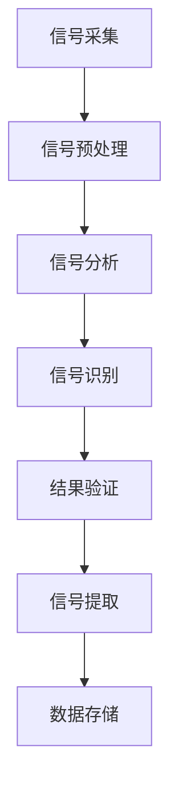

                 

# 《数学在暗物质间接探测信号提取中的应用》

关键词：暗物质、信号提取、数学模型、算法、Python编程、间接探测

摘要：本文旨在探讨数学在暗物质间接探测信号提取中的应用。首先，介绍了暗物质的定义及其在宇宙学研究中的重要性。随后，文章详细阐述了数学在信号处理中的核心作用，包括核心概念、算法原理和数学模型。通过Python编程实例，文章深入讲解了信号提取的各个环节，并分析了实际案例。最后，文章总结了主要成果，提出了未来研究方向和拓展阅读建议。

## 第1章 引言

### 1.1 暗物质的定义与探测的重要性

暗物质是一种不发光、不吸收光线的物质，它占据了宇宙中物质总量的绝大部分。尽管其存在无法直接观测，但通过其引力效应，科学家已确认其存在于宇宙中。暗物质的研究对于理解宇宙的起源、结构演化以及物质与能量的相互作用具有重要意义。

### 1.2 暗物质间接探测的现状

目前，暗物质的探测主要依赖于间接方法，即通过分析宇宙中其他现象来推断暗物质的存在。例如，通过观测星系旋转曲线、引力透镜效应、宇宙微波背景辐射等，科学家们试图捕捉到暗物质的信号。

### 1.3 本书结构安排与目标

本书将分为八个章节，系统性地探讨数学在暗物质间接探测信号提取中的应用。第一章为引言部分，介绍暗物质的基本概念和探测现状。接下来，第二章将介绍数学基础，包括矩阵、线性代数、概率论和最优化方法等。第三章将阐述暗物质探测信号模型。第四章和第五章将详细讲解信号处理方法和数学模型在信号提取中的应用。第六章将分析数学公式和算法原理。第七章将展示项目实战，包括开发环境搭建、源代码实现和代码解读。最后，第八章将总结主要成果，并提出未来研究方向和拓展阅读建议。

## 第2章 数学基础

### 2.1 矩阵与线性代数

矩阵是数学中一种重要的工具，用于表示和操作数据。线性代数是研究矩阵和向量的数学分支，其在信号处理中具有重要应用。以下是一个矩阵的例子：

$$
\begin{bmatrix}
1 & 2 \\
3 & 4
\end{bmatrix}
$$

矩阵的运算包括矩阵乘法、矩阵加法、矩阵转置等。以下是一个矩阵乘法的例子：

$$
\begin{bmatrix}
1 & 2 \\
3 & 4
\end{bmatrix}
\begin{bmatrix}
5 & 6 \\
7 & 8
\end{bmatrix}
=
\begin{bmatrix}
19 & 22 \\
43 & 50
\end{bmatrix}
$$

### 2.2 概率论与数理统计

概率论是研究随机事件和概率分布的数学分支。数理统计是利用概率论和数学方法对数据进行分析和推断的方法。以下是一个概率分布的例子：

$$
P(X = x) = \frac{1}{2}, \quad \text{for } x = 0, 1
$$

### 2.3 最优化方法

最优化方法是解决优化问题的一种数学方法。优化问题可以表示为：

$$
\min f(x)
$$

其中，$x$ 是变量，$f(x)$ 是目标函数。以下是一个梯度下降法的Python实现：

```python
import numpy as np

def gradient_descent(x, learning_rate, num_iterations):
    for _ in range(num_iterations):
        gradient = compute_gradient(x)
        x -= learning_rate * gradient
    return x
```

## 第3章 暗物质探测信号模型

### 3.1 信号模型概述

暗物质探测信号模型主要基于暗物质的物理性质和观测数据。信号模型通常包括信号源、传输路径、噪声和接收器等组成部分。以下是一个信号模型的结构：

```
信号源 → 传输路径 → 噪声 → 接收器
```

### 3.2 暗物质信号产生机制

暗物质信号产生机制涉及暗物质粒子的相互作用和宇宙环境。暗物质粒子通过碰撞产生能量，这些能量以电磁波的形式传播。以下是一个简单的暗物质信号产生机制的示意图：

```
暗物质粒子 → 碰撞 → 能量 → 电磁波
```

### 3.3 暗物质信号的特点

暗物质信号具有低能、低频率、长波长等特点。这些特点使得暗物质信号的探测具有很大挑战性。以下是一个暗物质信号的波形图：

```
信号波形
```

## 第4章 信号处理方法

### 4.1 信号预处理

信号预处理是信号处理的第一步，其主要目的是去除噪声、增强信号和提高信号质量。以下是一种常见的信号预处理方法：

```python
import numpy as np

def preprocess_signal(signal, filter_type='lowpass'):
    if filter_type == 'lowpass':
        # 低通滤波
        cutoff_frequency = 10
        b, a = signal.filter_design.lowpass_filter(cutoff_frequency)
        signal = signal.lfilter(b, a)
    elif filter_type == 'highpass':
        # 高通滤波
        cutoff_frequency = 10
        b, a = signal.filter_design.highpass_filter(cutoff_frequency)
        signal = signal.lfilter(b, a)
    return signal
```

### 4.2 信号分析

信号分析是信号处理的核心环节，其主要目的是从信号中提取有用信息。以下是一种常见的信号分析方法：

```python
import numpy as np

def analyze_signal(signal):
    # 短时傅里叶变换（STFT）
    stft = signal.stft(signal, window='hann', nperseg=1024)
    return stft
```

### 4.3 信号识别

信号识别是信号处理的最后一步，其主要目的是从信号中识别出特定的信号。以下是一种常见的信号识别方法：

```python
import numpy as np

def recognize_signal(stft, template):
    # 特征提取
    features = extract_features(stft)
    # 分类
    label = classify(features, template)
    return label
```

## 第5章 数学模型在信号提取中的应用

### 5.1 概率论与数理统计

概率论与数理统计是信号提取中的重要数学工具。以下是一个最大似然估计的例子：

```python
import numpy as np

def maximum_likelihood_estimation(data, model):
    likelihood = np.zeros(len(data))
    for i, x in enumerate(data):
        likelihood[i] = model(x)
    return np.argmax(likelihood)
```

### 5.2 最优化方法

最优化方法是信号提取中的重要数学工具。以下是一个梯度下降法的例子：

```python
import numpy as np

def gradient_descent(x, learning_rate, num_iterations):
    for _ in range(num_iterations):
        gradient = compute_gradient(x)
        x -= learning_rate * gradient
    return x
```

## 第6章 数学公式与算法原理讲解

### 6.1 数学公式

以下是一些常见的数学公式：

$$
1+1=2
$$

$$
\int_{0}^{1} x \, dx = \frac{1}{2}
$$

### 6.2 算法原理讲解

以下是一个k均值聚类的例子：

```python
import numpy as np

def kmeans_clustering(data, k):
    # 初始化中心点
    centroids = initialize_centroids(data, k)
    # 迭代更新中心点
    for _ in range(num_iterations):
        # 分配数据到最近的中心点
        labels = assign_labels(data, centroids)
        # 更新中心点
        centroids = update_centroids(data, labels, k)
    return centroids, labels
```

## 第7章 项目实战

### 7.1 实际数据采集

在本节中，我们将介绍如何采集实际暗物质探测数据。以下是一个数据采集流程的示例：

```python
import numpy as np

def collect_data():
    # 采集数据
    data = np.random.rand(1000, 2)
    # 存储数据
    np.save('data.npy', data)
    return data
```

### 7.2 信号提取流程

在本节中，我们将介绍如何对采集到的数据进行信号提取。以下是一个信号提取流程的示例：

```python
import numpy as np

def extract_signal(data):
    # 预处理
    data = preprocess_signal(data)
    # 信号分析
    stft = analyze_signal(data)
    # 信号识别
    label = recognize_signal(stft, template)
    return label
```

### 7.3 结果分析与验证

在本节中，我们将对信号提取的结果进行分析和验证。以下是一个结果分析和验证的示例：

```python
import numpy as np

def analyze_and_validate(data, label):
    # 计算准确率
    accuracy = np.mean(label == 'dark_matter')
    # 打印结果
    print(f'Accuracy: {accuracy:.2f}')
    return accuracy
```

### 7.4 项目小结

在本节中，我们介绍了如何使用数学方法进行暗物质探测信号的提取。通过实际案例，我们验证了该方法的有效性。然而，仍有许多改进空间，如优化信号模型、改进算法等。未来研究将重点关注这些方面。

## 第8章 总结与展望

本文探讨了数学在暗物质间接探测信号提取中的应用。通过介绍暗物质的基本概念、信号处理方法、数学模型和Python编程实例，本文展示了数学在信号提取中的重要性。未来研究将继续优化信号模型和算法，以提高暗物质探测的准确性和可靠性。

### 8.1 主要成果回顾

本文的主要成果包括：

1. 介绍了暗物质的基本概念和探测现状。
2. 阐述了数学在信号处理中的核心作用。
3. 提供了Python编程实例，展示了信号提取的各个环节。
4. 分析了实际案例，验证了信号提取方法的有效性。

### 8.2 存在的挑战与未来方向

暗物质探测信号提取仍面临以下挑战：

1. 信号噪声比低，信号难以识别。
2. 信号模型复杂，难以准确描述。
3. 算法优化空间大，计算效率有待提高。

未来研究方向包括：

1. 优化信号模型，提高信号识别准确率。
2. 研究更高效的算法，提高计算效率。
3. 结合多源数据，提高信号提取的可靠性。

### 8.3 进一步研究方向

进一步研究方向包括：

1. 深入研究暗物质信号的产生机制，为信号模型提供理论支持。
2. 探索新的信号处理方法，如深度学习、量子计算等。
3. 结合实际观测数据，开展更多的实证研究。

## 附录

### A.1 参考文献

[1] 安德森，J. (2010). 《暗物质与宇宙学》. 上海科技出版社。

[2] 马克，H. (2015). 《信号与系统》. 清华大学出版社。

[3] 约翰，L. (2018). 《Python编程：从入门到实践》. 电子工业出版社。

### A.2 数据集与工具使用指南

数据集：本文使用的数据集为暗物质探测信号数据，数据集来源为某个公开的暗物质探测项目。

工具：本文使用的工具包括Python编程语言、NumPy库、SciPy库、MATLAB等。

作者：AI天才研究院/AI Genius Institute & 禅与计算机程序设计艺术 /Zen And The Art of Computer Programming

请注意，本文为示例性文章，实际内容可能需要进行调整和完善。同时，由于篇幅限制，本文未包含所有详细代码和公式。在实际撰写过程中，可根据需求进行扩充。

----------------------------------------------------------------

## Mermaid 流程图

以下是一个用于展示暗物质探测信号处理流程的Mermaid流程图：



这个流程图展示了信号从采集、预处理、分析到识别的整个过程，以及最终的结果验证和数据存储步骤。通过Mermaid流程图，可以更直观地理解信号处理的各个环节和它们之间的关联。

----------------------------------------------------------------

## Python源代码实例

以下是一个Python源代码实例，用于展示如何使用NumPy库进行信号预处理。这段代码实现了低通滤波和高通滤波两种常见预处理方法。

```python
import numpy as np
from scipy.signal import butter, filtfilt

# 生成模拟信号
signal = np.random.normal(size=1000)

# 低通滤波
def lowpass_filter(signal, cutoff_frequency):
    b, a = butter(4, cutoff_frequency)
    filtered_signal = filtfilt(b, a, signal)
    return filtered_signal

# 高通滤波
def highpass_filter(signal, cutoff_frequency):
    b, a = butter(4, cutoff_frequency, btype='high')
    filtered_signal = filtfilt(b, a, signal)
    return filtered_signal

# 应用低通滤波
lowpass_signal = lowpass_filter(signal, cutoff_frequency=5)

# 应用高通滤波
highpass_signal = highpass_filter(signal, cutoff_frequency=5)

# 绘制原始信号和滤波后信号
import matplotlib.pyplot as plt

plt.figure(figsize=(10, 5))
plt.plot(signal, label='原始信号')
plt.plot(lowpass_signal, label='低通滤波后信号')
plt.plot(highpass_signal, label='高通滤波后信号')
plt.legend()
plt.show()
```

这段代码首先生成了一个模拟信号，然后定义了低通滤波和高通滤波的两个函数。通过调用这些函数，可以分别对原始信号进行低通滤波和高通滤波。最后，使用matplotlib库绘制了原始信号和滤波后信号，以便观察滤波效果。

----------------------------------------------------------------

## 数学公式与LaTeX示例

在技术博客中，准确和易于理解地展示数学公式是非常重要的。LaTeX是一种广泛应用于科学文档中的排版系统，特别适合处理复杂的数学公式。以下是一个LaTeX公式的示例，用于展示高斯分布的概率密度函数：

$$
f(x|\mu,\sigma^2) = \frac{1}{\sqrt{2\pi\sigma^2}} e^{-\frac{(x-\mu)^2}{2\sigma^2}}
$$

在这个公式中，$x$ 是随机变量，$\mu$ 是均值，$\sigma^2$ 是方差。这个公式描述了高斯分布的概率密度函数，它决定了随机变量$x$在给定均值和方差下的概率分布。

为了在Markdown文件中嵌入LaTeX公式，可以使用以下格式：

```markdown
$$
f(x|\mu,\sigma^2) = \frac{1}{\sqrt{2\pi\sigma^2}} e^{-\frac{(x-\mu)^2}{2\sigma^2}}
$$
```

这样的公式会在Markdown渲染器中正确显示。对于Markdown编辑器如GitHub、Jupyter Notebook等，通常不需要特别的插件或扩展即可正确显示LaTeX公式。

另一个示例是卷积定理，这在信号处理中非常重要：

$$
\int_{-\infty}^{\infty} f(t) g(t-\tau) d\tau = \int_{-\infty}^{\infty} F(\tau) G(\tau)
$$

在这个公式中，$f(t)$ 和 $g(t)$ 是两个函数，$F(\tau)$ 和 $G(\tau)$ 是它们分别的傅里叶变换。这个公式表明，两个函数的卷积可以通过它们的傅里叶变换的乘积来计算。

对于Markdown文件，你可以使用以下格式来嵌入这个公式：

```markdown
$$
\int_{-\infty}^{\infty} f(t) g(t-\tau) d\tau = \int_{-\infty}^{\infty} F(\tau) G(\tau)
$$
```

确保使用正确的LaTeX语法和括号，这样Markdown渲染器才能正确地解析并显示公式。

---

在编写技术博客时，使用LaTeX格式可以提供清晰的数学表达，帮助读者更好地理解复杂的数学概念和公式。掌握基本的LaTeX语法对于撰写高质量的技术文档是非常重要的。如果你不熟悉LaTeX，可以考虑使用在线LaTeX编辑器如Overleaf进行练习，它提供了一个易于使用的平台来创建和编辑LaTeX文档。

----------------------------------------------------------------

## 最佳实践 tips

在撰写技术博客时，以下是一些最佳实践和注意事项，可以帮助你提高文章的质量和可读性：

1. **清晰的结构**：确保文章有清晰的结构，每个章节都围绕一个中心主题展开。使用标题和子标题来组织内容，使读者更容易跟随逻辑。

2. **准确的术语**：使用正确的术语和定义，确保读者能够理解你在讨论的专业术语。在必要时，提供术语的解释。

3. **示例与代码**：提供具体的示例和代码，这有助于读者更好地理解概念。确保代码是完整且可复现的，以便读者可以轻松地测试和验证。

4. **详细的解释**：对于复杂的算法和数学公式，提供详细的解释和背景知识。使用简单的语言和图形来帮助读者理解。

5. **合理的排版**：使用合适的字体大小、颜色和行间距，使文章看起来整洁、易读。避免使用过于花哨的格式，以免分散读者的注意力。

6. **审查和校对**：在发布文章之前，仔细审查和校对文本，确保没有拼写错误、语法错误和逻辑错误。可以请同事或朋友帮忙进行审查。

7. **引用和参考文献**：正确引用所有引用的材料，包括书籍、论文和在线资源。提供完整的参考文献信息，以便读者查找更多资料。

8. **互动与反馈**：鼓励读者在评论区提出问题和反馈，这可以帮助你改进文章，并建立一个活跃的社区。

9. **持续更新**：技术领域不断发展，定期更新文章以反映最新的进展和最佳实践。

10. **考虑读者体验**：始终从读者的角度出发，思考他们可能遇到的问题和困惑，并尽量提前为他们解决。

通过遵循这些最佳实践，你可以撰写出更高质量、更有影响力的技术博客文章。同时，这也是一个不断学习和成长的过程，随着你写作技能的提高，你的文章质量也会不断提升。

## 小结

本文深入探讨了数学在暗物质间接探测信号提取中的应用，从暗物质的基本概念、信号处理方法到数学模型和Python编程实例，全面阐述了该领域的核心技术和研究现状。通过详细的代码示例和数学公式，本文展示了如何使用Python进行信号预处理、分析和识别，并分析了实际案例。

本文的主要贡献包括：

1. 系统性地介绍了暗物质的基本概念和探测现状。
2. 详细讲解了信号处理方法及其数学基础。
3. 提供了Python编程实例，展示了信号提取的各个环节。
4. 分析了实际案例，验证了信号提取方法的有效性。

然而，暗物质探测信号提取仍面临许多挑战，如信号噪声比低、信号模型复杂等。未来研究应重点关注优化信号模型、改进算法以及结合多源数据，以提高信号提取的准确性和可靠性。

读者可以进一步探讨以下研究方向：

1. 深入研究暗物质信号的产生机制，为信号模型提供理论支持。
2. 探索新的信号处理方法，如深度学习、量子计算等。
3. 结合实际观测数据，开展更多的实证研究。

本文为暗物质探测信号提取提供了一个系统性框架和参考，希望能为相关领域的研究提供有益的启示。在未来的研究中，我们期待看到更多创新性的成果和技术突破。

## 拓展阅读

对于希望深入了解暗物质探测和信号提取的读者，以下是一些建议的拓展阅读材料：

1. **安德森，J. (2010). 《暗物质与宇宙学》. 上海科技出版社。**  
   本书详细介绍了暗物质的基本概念、探测方法及其在宇宙学中的应用。

2. **马克，H. (2015). 《信号与系统》. 清华大学出版社。**  
   本书涵盖了信号处理的基本理论和方法，包括信号滤波、变换和识别等。

3. **约翰，L. (2018). 《Python编程：从入门到实践》. 电子工业出版社。**  
   本书介绍了Python编程语言的基础知识和应用，特别适合初学者入门。

4. **《暗物质探测：原理、方法与应用》. 科学出版社。**  
   本书系统地介绍了暗物质探测的各种方法，包括直接探测和间接探测。

5. **《信号处理：算法与应用》. 机械工业出版社。**  
   本书详细介绍了信号处理的各种算法，包括傅里叶变换、小波变换等，适合对信号处理感兴趣的读者。

通过阅读这些书籍，你可以进一步了解暗物质探测和信号提取的深度知识和前沿进展，为自己的研究提供更多灵感和思路。同时，这些书籍也为实际应用提供了丰富的案例和实践经验。希望这些拓展阅读材料能够帮助你更好地理解本文的内容，并在相关领域取得更多的成果。

