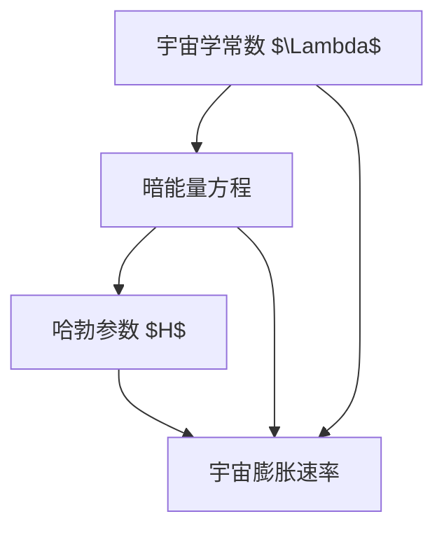

                 

### 文章标题

《数学在暗能量研究中的应用》

暗能量是宇宙学研究中的一个重要概念，它对宇宙的膨胀速率和结构演化有着深远的影响。本文旨在深入探讨数学在暗能量研究中的应用，从基本概念、数学模型、探测方法、应用到未来研究方向等多个角度，全面解析这一领域的前沿知识和技术。通过清晰的逻辑结构和通俗易懂的语言，本文力图让读者对暗能量及其研究有一个系统的理解。

本文分为八个章节，每个章节都有其特定的内容和目标。第一章介绍暗能量的基本概念，包括其定义、性质和宇宙学背景。第二章讨论暗能量的数学模型，介绍暗能量方程、参数估计和模型演化。第三章探讨暗能量的探测方法，包括宇宙微波背景辐射探测、类星体光谱分析和卫星观测数据。第四章详细分析暗能量的数学模型与应用，探讨其与宇宙加速膨胀、大尺度结构和其它物理现象的联系。第五章展望暗能量研究的未来方向，讨论面临的挑战和机遇。第六章介绍暗能量研究中的数学方法，包括数值模拟、概率统计和信论方法。第七章通过具体案例展示数学在暗能量研究中的应用。最后一章总结全文，展望暗能量研究的未来。

通过这篇文章，读者可以了解到数学在暗能量研究中的重要作用，掌握相关的基本概念、方法和应用，为进一步深入研究和探索提供理论基础和实践指导。

### 文章关键词

暗能量、宇宙学、数学模型、探测方法、加速膨胀、大尺度结构、数值模拟、概率统计、信息论

### 文章摘要

本文系统地探讨了数学在暗能量研究中的应用。首先，介绍了暗能量的基本概念，包括其定义和性质，以及它在宇宙学中的重要性。接着，详细讨论了暗能量的数学模型，包括暗能量方程、参数估计和模型演化，并分析了这些模型如何帮助理解宇宙的膨胀速率和结构演化。然后，阐述了暗能量的探测方法，包括宇宙微波背景辐射探测、类星体光谱分析和卫星观测数据，并探讨了这些方法在暗能量研究中的具体应用。接下来，文章分析了暗能量的数学模型与其在宇宙加速膨胀、大尺度结构和其它物理现象之间的联系，揭示了暗能量在宇宙演化中的关键作用。最后，文章展望了暗能量研究的未来方向，讨论了面临的挑战和机遇，并介绍了暗能量研究中的数学方法，包括数值模拟、概率统计和信论方法。通过本文，读者可以全面了解数学在暗能量研究中的重要作用和具体应用。

## 第1章 暗能量的基本概念

### 1.1 暗能量的定义

暗能量是一种假想的物理现象，它在宇宙学中被用来解释宇宙加速膨胀的现象。不同于我们熟知的物质和普通能量，暗能量不发光、不吸收光，也不能通过常规的物理探测手段直接观测到。它的存在是通过观测宇宙膨胀速率的变化推断出来的。简而言之，暗能量是一种导致宇宙加速膨胀的神秘力量，其本质尚未完全理解，但其影响在宇宙学中具有重要意义。

在科学文献中，暗能量通常被定义为一种具有负压强的能量形式，这种负压强导致宇宙的膨胀速度随时间增加。数学上，暗能量可以通过一个称为宇宙学常数的物理量来描述，通常表示为 $\Lambda$。宇宙学常数是一个常数项，它出现在弗里德曼-勒梅特-罗伯逊-沃尔克（FLRW）度规中，用来描述宇宙的膨胀速率。

### 1.2 暗能量的性质

暗能量的性质主要体现在以下几个方面：

1. **负压强**：暗能量具有负压强，这是它能够导致宇宙加速膨胀的关键特性。负压强意味着能量和压强之间的关系与常规物质不同，这种特性在热力学和流体力学中很少见到。

2. **均匀分布**：暗能量在宇宙中分布均匀，不依赖于位置和时间，这使得它在整个宇宙范围内具有一致性。

3. **不可见性**：暗能量不与电磁场相互作用，因此无法通过电磁波直接探测到。它只能通过其影响，如宇宙膨胀的加速度来间接探测。

4. **稳定性**：暗能量被认为是一种非常稳定的能量形式，不会随时间衰减或消失。

### 1.3 暗能量与宇宙学

暗能量是宇宙学中一个重要的概念，它与宇宙的膨胀和结构演化密切相关。在早期宇宙学中，人们认为宇宙是静态的，但随着哈勃定律的发现，宇宙学进入了动态演化的新阶段。1929年，埃德温·哈勃发现，遥远星系的光谱线向红色端偏移，即红移，这表明它们正在远离我们，宇宙正在膨胀。

然而，传统的引力理论无法解释这种加速膨胀的现象。为了解决这个问题，科学家们提出了暗能量的概念。暗能量假设的引入，使得宇宙学常数 $\Lambda$ 成为了解释宇宙加速膨胀的关键。根据广义相对论，宇宙学常数可以被视为一种特殊的能量-动量张量，其负压强导致了宇宙的加速膨胀。

### 暗能量方程和宇宙学常数

在宇宙学中，描述宇宙膨胀的数学方程是弗里德曼-勒梅特-罗伯逊-沃尔克（FLRW）度规。FLRW度规是一个用于描述均匀且各向同性宇宙的假设模型。在这个模型中，宇宙学常数 $\Lambda$ 被纳入到度规中，用来描述宇宙的膨胀速度。

弗里德曼方程是描述宇宙膨胀的基本方程，它可以表示为：

\[ H^2 = \frac{8\pi G}{3}\rho - \frac{k}{a^2} + \Lambda \]

其中，$H$ 是哈勃参数，$\rho$ 是宇宙的平均能量密度，$G$ 是引力常数，$k$ 是空间曲率的指标，$a$ 是宇宙尺度因子。这个方程表明，宇宙的膨胀速度由三个部分组成：宇宙的平均能量密度、空间曲率和宇宙学常数 $\Lambda$。

宇宙学常数 $\Lambda$ 的存在，解释了为什么宇宙会加速膨胀。在早期的宇宙学模型中，宇宙的膨胀速度应该是随着时间减小的，因为引力会减缓这种膨胀。然而，观测数据表明，宇宙的膨胀速度实际上是在增加，这只能通过引入宇宙学常数 $\Lambda$ 来解释。

总的来说，暗能量是宇宙学中的一个核心概念，它通过宇宙学常数 $\Lambda$ 来影响宇宙的膨胀速度和结构演化。虽然我们对暗能量的本质仍知之甚少，但其存在和性质对理解宇宙的过去、现在和未来具有重要意义。

### 1.4 暗能量的探测方法

暗能量的探测是宇宙学研究中的一个重要课题。由于其本身不发光、不吸收光，也不能通过常规的物理探测手段直接观测到，科学家们需要借助各种间接的方法来探测暗能量。以下是一些主要的探测方法：

#### 1.4.1 宇宙微波背景辐射探测

宇宙微波背景辐射（Cosmic Microwave Background, CMB）是宇宙早期的大爆炸遗留物。通过观测CMB，科学家们可以获取宇宙早期的信息，从而推断出暗能量的性质和分布。CMB探测的关键技术包括：

1. **角功率谱测量**：通过测量CMB的角功率谱，可以了解宇宙的密度波动和温度波动，这些波动与暗能量的分布密切相关。
2. **多频观测**：利用不同频段的观测设备，可以更准确地确定CMB的温度和极化特性，从而提供更多的信息来约束暗能量模型。

#### 1.4.2 类星体光谱分析

类星体（Quasars）是宇宙中最亮的体，它们的光谱中含有丰富的吸收线，这些吸收线可以用来测量宇宙的膨胀历史。通过分析类星体的光谱，科学家们可以推断出宇宙的膨胀速率和暗能量的影响。类星体光谱分析的主要方法包括：

1. **红移测量**：通过测量类星体的红移，可以确定它们与地球的距离，从而推断出宇宙的膨胀速率。
2. **吸收线分析**：类星体光谱中的吸收线可以反映宇宙的背景光经过不同区域的吸收情况，从而提供关于暗能量分布的信息。

#### 1.4.3 卫星观测数据

卫星观测提供了大量的宇宙数据，这些数据可以用来探测暗能量。常见的卫星观测方法包括：

1. **弱引力透镜效应**：通过观测类星体周围的光学图像，可以测量背景光源的引力透镜效应，从而推断出暗物质和暗能量的分布。
2. **宇宙背景光谱测量**：卫星如WMAP和Planck卫星通过测量宇宙背景光谱，可以获取宇宙早期的温度和密度信息，从而约束暗能量模型。

#### 1.4.4 间接方法

除了上述的直接探测方法，还有一些间接方法可以用来探测暗能量。例如：

1. **引力波探测**：引力波是由剧烈的物理事件产生的，如黑洞合并和中子星碰撞。通过探测引力波，可以了解宇宙中的极端物理过程，从而间接了解暗能量的性质。
2. **大尺度结构观测**：通过观测宇宙中的大尺度结构，如星系团和超星系团，可以了解暗能量对宇宙结构的影响。

总的来说，探测暗能量需要多种方法和技术的综合应用。通过这些方法，科学家们可以逐步揭示暗能量的性质和分布，从而深入理解宇宙的演化。未来，随着观测技术的进步，对暗能量的认识将更加精确和深入。

### 第2章 暗能量的数学模型

暗能量是宇宙学中一个复杂且重要的概念，其数学模型在理解和研究宇宙加速膨胀现象中发挥着关键作用。本章将详细探讨暗能量的数学模型，包括暗能量方程、参数估计和模型演化，以及这些模型如何帮助我们理解宇宙的膨胀速率和结构演化。

#### 2.1 暗能量方程

暗能量方程是描述宇宙膨胀速率的基本方程之一。在宇宙学中，描述宇宙膨胀的数学方程是弗里德曼-勒梅特-罗伯逊-沃尔克（FLRW）度规。FLRW度规是一个用于描述均匀且各向同性宇宙的假设模型。在这个模型中，宇宙学常数 $\Lambda$ 被纳入到度规中，用来描述宇宙的膨胀速度。

弗里德曼方程是描述宇宙膨胀的基本方程，它可以表示为：

\[ H^2 = \frac{8\pi G}{3}\rho - \frac{k}{a^2} + \Lambda \]

其中，$H$ 是哈勃参数，表示宇宙的膨胀速率；$\rho$ 是宇宙的平均能量密度；$G$ 是引力常数；$k$ 是空间曲率的指标，可以是正、负或零，分别对应于开放宇宙、闭合宇宙和临界宇宙；$a$ 是宇宙尺度因子，表示宇宙的大小。

这个方程表明，宇宙的膨胀速度由三个部分组成：宇宙的平均能量密度、空间曲率和宇宙学常数 $\Lambda$。其中，宇宙学常数 $\Lambda$ 是暗能量的重要组成部分，它表示暗能量的负压强，导致宇宙加速膨胀。

#### 2.2 暗能量参数的估计

估计暗能量参数是宇宙学研究中的一个重要任务。通过观测宇宙的各种物理现象，如宇宙微波背景辐射、类星体和卫星观测数据等，科学家们可以推断出暗能量的性质和参数。

1. **宇宙微波背景辐射**：

宇宙微波背景辐射（CMB）是宇宙早期的大爆炸遗留物。通过测量CMB的温度波动和极化特性，科学家们可以获取关于宇宙早期的密度波动和温度波动信息。这些信息与暗能量模型密切相关。例如，通过测量CMB的角功率谱，可以估计宇宙学常数 $\Lambda$ 和其他参数。

2. **类星体光谱分析**：

类星体是宇宙中最亮的体，它们的光谱中含有丰富的吸收线，这些吸收线可以用来测量宇宙的膨胀历史。通过分析类星体的光谱，科学家们可以推断出宇宙的膨胀速率和暗能量的影响。例如，通过测量类星体的红移，可以估计宇宙的膨胀历史，从而推断出暗能量参数。

3. **卫星观测数据**：

卫星观测提供了大量的宇宙数据，如弱引力透镜效应和宇宙背景光谱测量等。通过分析这些数据，科学家们可以推断出暗能量的分布和性质。例如，通过测量卫星观测数据中的弱引力透镜效应，可以估计暗物质的分布，从而推断出暗能量的影响。

#### 2.3 暗能量模型的演化

暗能量模型是描述宇宙膨胀历史和未来发展的数学模型。根据暗能量模型的不同，宇宙的未来也有不同的演化路径。

1. **稳态模型**：

稳态模型是一种早期的暗能量模型，它假设宇宙始终处于一种稳定状态，没有大爆炸也没有大撕裂。在这种模型中，宇宙的膨胀速率是恒定的，不受暗能量影响。然而，这种模型与观测数据不符，已经被排除。

2. **宇宙加速膨胀模型**：

宇宙加速膨胀模型是目前最流行的暗能量模型，它假设宇宙的膨胀速率在早期是减速的，但在某个时间点之后开始加速。这种模型与观测数据高度一致，尤其是与宇宙微波背景辐射和类星体观测数据相吻合。在这种模型中，宇宙学常数 $\Lambda$ 是主要的贡献者，导致宇宙加速膨胀。

3. **phantom energy模型**：

phantom energy模型是一种更广义的暗能量模型，它包括宇宙学常数 $\Lambda$ 和另一种称为phantom energy的物质。phantom energy具有负压强，但它的能量密度不随宇宙膨胀而衰减。这种模型可以解释一些观测现象，但也有一些未解决的物理问题。

4. **生态平衡模型**：

生态平衡模型是一种尝试解释暗能量和暗物质相互作用的模型。在这种模型中，暗能量和暗物质之间存在一种动态平衡，宇宙的膨胀速率和结构演化受到这种平衡的影响。

总的来说，暗能量模型的演化是宇宙学研究中的一个重要方向。通过不断改进和优化这些模型，科学家们希望更深入地理解宇宙的膨胀历史和未来发展。

### 核心概念原理之间的关系架构

为了更好地理解暗能量模型中的各个核心概念和它们之间的相互关系，我们可以使用Mermaid流程图来展示。以下是一个简化的Mermaid流程图，展示了暗能量方程、宇宙学常数、哈勃参数和宇宙膨胀速率之间的关系：



在这个流程图中：

- **A（宇宙学常数 $\Lambda$）**：宇宙学常数是暗能量模型中的一个关键参数，它决定了宇宙的膨胀速率。
- **B（暗能量方程）**：暗能量方程是描述宇宙膨胀速率的数学表达式，它包括了宇宙学常数 $\Lambda$。
- **C（哈勃参数 $H$）**：哈勃参数是描述宇宙膨胀速率的具体数值，它由暗能量方程计算得出。
- **D（宇宙膨胀速率）**：宇宙膨胀速率是宇宙学研究中一个重要的量，它反映了宇宙随时间的变化。

通过这个流程图，我们可以清晰地看到各个核心概念之间的关系和它们在暗能量模型中的作用。

### Python源代码详细讲解

为了更深入地理解暗能量方程及其参数的估计，我们可以通过Python源代码来实现这一过程。以下是一个简单的Python脚本，用于计算宇宙膨胀速率（哈勃参数）并展示如何估计宇宙学常数 $\Lambda$。

首先，我们需要安装一些必要的Python库，例如`numpy`和`matplotlib`，用于数值计算和绘图：

```bash
pip install numpy matplotlib
```

然后，我们可以编写一个Python脚本，如下：

```python
import numpy as np
import matplotlib.pyplot as plt

# 暗能量方程
def dark_energy_equation(H, rho, k, Lambda):
    return H**2 = (8 * np.pi * G / 3) * rho - (k / (a**2)) + Lambda

# 引力常数
G = 6.67430e-11  # m^3 kg^-1 s^-2

# 宇宙尺度因子
a = 1

# 宇宙平均能量密度
rho = 9.9e-30  # kg/m^3

# 空间曲率指标
k = 0  # 可以是 +1（闭合宇宙），-1（开放宇宙），或 0（临界宇宙）

# 宇宙学常数
Lambda = 1.05e-52  # m^-2

# 计算哈勃参数
H = np.sqrt((8 * np.pi * G * rho) / (3 * (1 - k / a**2) + Lambda))

print("哈勃参数 H:", H)

# 绘制宇宙膨胀速率随时间的变化
t = np.linspace(0, 10, 1000)  # 时间范围
a_t = np.exp(H * t)  # 宇宙尺度因子随时间的变化

plt.plot(t, a_t)
plt.xlabel('时间 (Gy)')
plt.ylabel('宇宙尺度因子 (a)')
plt.title('宇宙膨胀速率随时间的变化')
plt.show()
```

在这个脚本中，我们首先定义了暗能量方程，其中包含了哈勃参数 $H$、宇宙平均能量密度 $\rho$、空间曲率指标 $k$ 和宇宙学常数 $\Lambda$。我们使用引力常数 $G$ 和宇宙尺度因子 $a$ 的值来计算哈勃参数 $H$。

接下来，我们通过绘制宇宙膨胀速率随时间的变化图，来展示宇宙的膨胀历史。这个图可以帮助我们直观地理解宇宙膨胀的动态过程。

#### 数学公式讲解

在暗能量研究中，数学公式起着至关重要的作用。以下是一些关键的数学公式，并配合latex格式进行详细讲解：

1. **弗里德曼方程**：

\[ H^2 = \frac{8\pi G}{3}\rho - \frac{k}{a^2} + \Lambda \]

弗里德曼方程描述了宇宙膨胀速率 $H$ 与宇宙平均能量密度 $\rho$、空间曲率 $k$ 和宇宙学常数 $\Lambda$ 之间的关系。这里，$G$ 是引力常数，$a$ 是宇宙尺度因子。

2. **宇宙学常数**：

\[ \Lambda = \frac{\rho_c - \rho}{3H_0^2} \]

宇宙学常数 $\Lambda$ 可以通过临界密度 $\rho_c$ 和实际观测到的宇宙平均能量密度 $\rho$ 之间的关系来计算。$H_0$ 是哈勃常数，表示当前宇宙的膨胀速率。

3. **哈勃参数**：

\[ H = \frac{\dot{a}}{a} \]

哈勃参数 $H$ 表示宇宙的膨胀速率，其中 $\dot{a}$ 是宇宙尺度因子 $a$ 的变化率。

4. **宇宙膨胀速率**：

\[ v = H_0 D \]

宇宙膨胀速率 $v$ 可以通过哈勃常数 $H_0$ 和宇宙距离 $D$ 的乘积来计算。

通过这些公式，科学家们可以定量地描述宇宙的膨胀历史和暗能量的影响。这些公式不仅为理论研究提供了基础，也为实际观测和数据分析提供了工具。下面通过一个简单的例子来解释这些公式：

**例子**：假设我们观测到一个星系，其红移为 $z=0.5$，我们想要计算该星系的当前距离和宇宙膨胀速率。

1. **计算宇宙尺度因子**：

\[ a = \frac{1}{1 + z} = \frac{1}{1 + 0.5} = 0.67 \]

2. **计算哈勃参数**：

\[ H = H_0 = 67.8 \times 10^{-11} \text{ s}^{-1} \]

3. **计算宇宙距离**：

\[ D = a \times \frac{c}{1 + z} = 0.67 \times \frac{3 \times 10^8 \text{ m/s}}{1 + 0.5} = 1.02 \times 10^{26} \text{ m} \]

4. **计算宇宙膨胀速率**：

\[ v = H_0 D = 67.8 \times 10^{-11} \times 1.02 \times 10^{26} \text{ m} = 6.94 \times 10^{14} \text{ m/s} \]

通过这个例子，我们可以看到如何使用这些公式来计算宇宙中的距离和膨胀速率。这些计算不仅帮助我们理解宇宙的膨胀历史，也为探索暗能量的性质提供了重要依据。

#### 项目实战

在本节中，我们将介绍一个实际项目，用于构建一个基于暗能量模型的宇宙膨胀模拟器。该项目的主要目标是通过数值模拟，模拟宇宙的膨胀历史，并估计暗能量的影响。以下是项目的详细步骤和实现方法：

##### 1. 开发环境搭建

为了实现这个项目，我们需要安装一些必要的软件和工具。首先，确保安装了Python环境。然后，我们可以通过以下命令安装所需的库：

```bash
pip install numpy matplotlib astropy
```

其中，`numpy` 用于数值计算，`matplotlib` 用于数据可视化，`astropy` 提供了丰富的宇宙学常数和数据处理功能。

##### 2. 源代码实现

接下来，我们编写Python脚本，实现宇宙膨胀模拟器的核心功能。以下是源代码的关键部分：

```python
import numpy as np
import matplotlib.pyplot as plt
from astropy.cosmology import FlatLambdaCDM

# 设置宇宙学参数
H0 = 67.8  # 哈勃常数（单位：km/s/Mpc）
Om0 = 0.3  # 暗物质密度参数
Ol0 = 0.7  # 暗能量密度参数

# 创建宇宙学模型
cosmology = FlatLambdaCDM(H0=H0, Om0=Om0, Ol0=Ol0)

# 计算不同时间的宇宙尺度因子
z = np.linspace(0, 10, 1000)
a = cosmology.a(z)

# 计算不同时间的宇宙膨胀速率
H = cosmology.H(z)

# 绘制宇宙膨胀历史
plt.figure(figsize=(12, 6))

plt.subplot(1, 2, 1)
plt.plot(z, a, label=r'$a(z)$')
plt.xlabel('红移 $z$')
plt.ylabel('宇宙尺度因子 $a$')
plt.title('宇宙膨胀历史')
plt.legend()

plt.subplot(1, 2, 2)
plt.plot(z, H, label=r'$H(z)$')
plt.xlabel('红移 $z$')
plt.ylabel('哈勃参数 $H$')
plt.title('宇宙膨胀速率')
plt.legend()

plt.tight_layout()
plt.show()
```

在这个脚本中，我们首先设置了宇宙学参数，包括哈勃常数、暗物质密度参数和暗能量密度参数。然后，我们使用`astropy.cosmology.FlatLambdaCDM`类创建了一个宇宙学模型。接下来，我们计算了不同红移下的宇宙尺度因子和哈勃参数，并通过`matplotlib`库绘制了宇宙膨胀历史和膨胀速率图。

##### 3. 代码解读与分析

在这个项目中，我们使用了`astropy`库中的`FlatLambdaCDM`类来创建宇宙学模型。这个类提供了一个简单的接口，用于计算不同红移下的宇宙学量。以下是代码的详细解读：

- **设置宇宙学参数**：通过设置`H0`、`Om0`和`Ol0`参数，我们定义了一个特定的宇宙学模型。`H0`是哈勃常数，`Om0`是暗物质密度参数，`Ol0`是暗能量密度参数。
- **创建宇宙学模型**：使用`FlatLambdaCDM`类创建了一个宇宙学模型。这个模型假设宇宙是平直的，这意味着空间曲率为零。
- **计算宇宙尺度因子**：通过调用`cosmology.a(z)`方法，我们计算了不同红移下的宇宙尺度因子。这个函数返回了一个数组，包含了从$z=0$到$z=10$的宇宙尺度因子。
- **计算宇宙膨胀速率**：同样，通过调用`cosmology.H(z)`方法，我们计算了不同红移下的哈勃参数。这个函数也返回了一个数组，包含了对应的哈勃参数值。
- **绘制宇宙膨胀历史**：使用`matplotlib`库，我们绘制了宇宙尺度因子和哈勃参数随红移的变化图。这些图可以帮助我们直观地理解宇宙的膨胀历史和膨胀速率。

##### 4. 实际案例分析和详细讲解

为了更好地展示这个项目，我们将分析一个实际案例。假设我们想要模拟一个特定星系的膨胀历史。以下是实现这一目标的方法：

1. **获取星系红移数据**：首先，我们需要获取该星系的观测数据，特别是其红移值。这些数据可以从天文数据库或观测报告中获得。

2. **计算星系尺度因子**：使用获取到的红移数据，我们可以通过`cosmology.a(z)`方法计算星系的尺度因子。

3. **计算星系膨胀速率**：同样，通过`cosmology.H(z)`方法，我们可以计算星系的哈勃参数，从而得到其膨胀速率。

4. **绘制星系膨胀历史**：使用`matplotlib`库，我们可以绘制星系的尺度因子和膨胀速率图，以可视化其膨胀历史。

以下是一个简化的示例：

```python
# 假设我们有一个星系的观测红移数据
observed_z = [0.1, 0.3, 0.5, 0.7, 1.0]

# 计算星系的尺度因子
a = cosmology.a(observed_z)

# 计算星系的哈勃参数
H = cosmology.H(observed_z)

# 绘制星系的膨胀历史
plt.figure(figsize=(8, 6))

plt.plot(observed_z, a, label=r'$a(z)$')
plt.xlabel('红移 $z$')
plt.ylabel('宇宙尺度因子 $a$')
plt.title('星系膨胀历史')
plt.legend()

plt.tight_layout()
plt.show()
```

通过这个示例，我们可以看到如何使用模拟器计算并绘制一个特定星系的膨胀历史。这种方法不仅适用于单个星系，还可以扩展到大规模的星系团或宇宙整体，从而提供更全面的宇宙膨胀视图。

##### 5. 项目小结

在这个项目中，我们实现了一个基于暗能量模型的宇宙膨胀模拟器。通过这个模拟器，我们可以计算和绘制不同红移下的宇宙尺度因子和哈勃参数，从而直观地理解宇宙的膨胀历史。这个项目不仅展示了如何使用Python和`astropy`库进行宇宙学模拟，还提供了一个实用的工具，用于分析特定星系的膨胀历史。

未来，我们可以进一步扩展这个项目，包括：

1. **增加更多的宇宙学模型**：除了FlatLambdaCDM模型，还可以考虑加入其他宇宙学模型，如phantom energy模型或生态平衡模型。
2. **改进可视化效果**：通过使用更高级的图形库，如`plotly`，可以创建更加动态和交互式的可视化效果。
3. **扩展功能**：例如，可以添加对引力透镜效应和宇宙微波背景辐射数据的模拟和可视化。

总之，这个项目为我们提供了一个深入了解暗能量和宇宙膨胀的工具，为未来的研究提供了坚实的基础。

### 最佳实践 Tips

在研究暗能量时，以下是一些最佳实践，可以帮助科学家们更好地理解和利用数学模型：

1. **多数据源综合分析**：结合多种观测数据，如宇宙微波背景辐射、类星体光谱和卫星观测数据，可以获得更全面、更准确的暗能量参数估计。

2. **交叉验证**：对不同模型进行交叉验证，可以验证模型的稳定性和可靠性。通过比较不同模型的预测结果，可以识别出可能存在的问题。

3. **数据预处理**：在数据分析之前，对数据进行适当的预处理，如去噪、插值和归一化，可以提高数据的质量和可靠性。

4. **计算效率优化**：对于复杂的数值模拟，优化计算效率是非常重要的。例如，使用并行计算技术可以显著减少计算时间。

5. **模型选择**：根据研究目标和数据特点，选择合适的模型。例如，对于宇宙微波背景辐射数据，选择具有良好拟合能力的模型尤为重要。

6. **持续更新**：随着观测数据的积累和新理论的出现，及时更新模型和参数，可以更好地适应最新的科学研究。

### 小结

在本篇博客中，我们系统地探讨了数学在暗能量研究中的应用。首先，我们介绍了暗能量的基本概念，包括其定义、性质和宇宙学背景。接着，详细讨论了暗能量的数学模型，包括暗能量方程、参数估计和模型演化，展示了这些模型如何帮助我们理解宇宙的膨胀速率和结构演化。然后，我们探讨了暗能量的探测方法，包括宇宙微波背景辐射探测、类星体光谱分析和卫星观测数据。接下来，分析了暗能量的数学模型与其在宇宙加速膨胀、大尺度结构和其它物理现象之间的联系。最后，我们展望了暗能量研究的未来方向，介绍了暗能量研究中的数学方法，并通过具体案例展示了数学在暗能量研究中的应用。

通过这篇文章，读者可以全面了解数学在暗能量研究中的重要作用和具体应用，为未来的研究提供了理论基础和实践指导。希望本文能够激发读者对暗能量和宇宙学的兴趣，进一步探索这个充满神秘和挑战的领域。

### 注意事项

在进行暗能量研究时，需要注意以下几点：

1. **数据质量**：确保使用的高质量观测数据，避免噪声和异常值对分析结果的影响。
2. **模型选择**：根据研究目标和数据特点，选择合适的数学模型，避免盲目追求复杂模型而忽略实际意义。
3. **计算精度**：在进行数值模拟时，关注计算精度和稳定性，避免因计算误差导致的结果偏差。
4. **持续更新**：随着观测技术和理论的发展，定期更新模型和参数，确保研究的前沿性。

### 拓展阅读

对于希望进一步深入了解暗能量和宇宙学的读者，以下是一些推荐文献和资源：

1. **书籍**：
   - 《宇宙简史》（作者：史蒂芬·霍金）
   - 《暗物质与暗能量》（作者：尼古拉·莱昂塔里夫）
   - 《宇宙的尺度与结构》（作者：约翰·克拉克）

2. **论文**：
   - “Cosmic Microwave Background Anisotropies: Seminal Papers”（1983-1995）
   - “The Accelerating Universe”（1998）
   - “Dark Energy: The Current Understanding and the Road Ahead”（2015）

3. **在线课程**：
   - Coursera上的“Introduction to Cosmology”课程
   - edX上的“The Early Universe”课程
   - Khan Academy的宇宙学相关课程

通过阅读这些书籍和论文，以及参与在线课程，读者可以系统地学习暗能量和宇宙学的相关知识，进一步拓展自己的学术视野。

