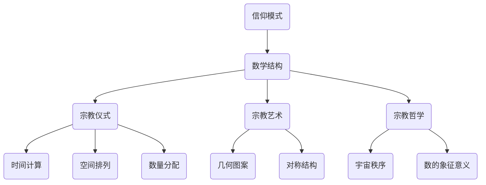
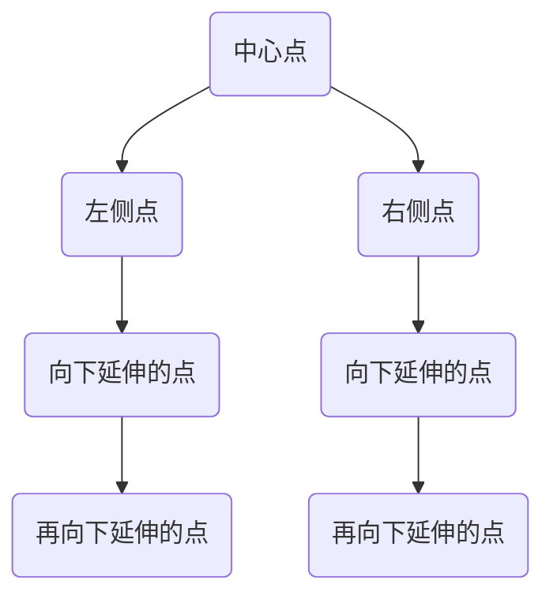
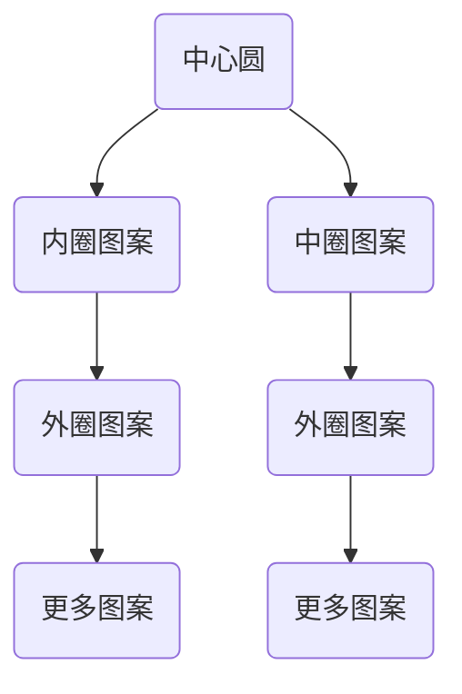

                 

# 数学宗教学：信仰模式的数学研究

## 摘要

本文旨在探讨数学与宗教信仰之间的密切联系，通过分析信仰模式中的数学结构，揭示数学在宗教仪式、宗教艺术和宗教哲学中的重要作用。文章首先介绍了数学宗教学的定义与研究目的，探讨了信仰模式与数学的联系。接着，文章深入分析了信仰模式的数学结构，包括数学结构的核心概念及其在信仰模式中的体现。随后，文章通过数学模型和公式的讲解，阐述了数学在信仰模式研究中的方法论。文章还详细介绍了数学在宗教仪式、宗教艺术和宗教哲学中的应用，并通过项目实战展示了数学宗教学的实际应用。最后，文章对数学宗教学的未来与发展进行了展望，总结了研究成果并提出了研究展望。通过本文的研究，旨在为数学宗教学领域提供新的视角和思路，促进数学与宗教信仰的深入融合。

## 第一部分 引言

### 1.1 数学宗教学的定义与研究目的

#### 1.1.1 数学宗教学的起源与发展

数学宗教学是一门新兴的交叉学科，起源于对数学与宗教信仰之间相互关系的探讨。自古以来，数学与宗教信仰就有着千丝万缕的联系。在古代文明中，数学家与神学家相互借鉴对方的观点，用数学解释宗教现象，例如古埃及的数学家利用数学公式来计算金字塔的高度和体积。随着历史的发展，数学宗教学逐渐形成了一门独立的学科，研究数学与宗教信仰之间的内在联系。

数学宗教学的研究目的是揭示数学在宗教信仰中的重要作用，以及宗教信仰对数学发展的推动。通过研究数学在宗教仪式、宗教艺术和宗教哲学中的应用，数学宗教学旨在为数学与宗教信仰之间的互动提供新的视角和解释。

#### 1.1.2 数学宗教学的研究方法与理论框架

数学宗教学的研究方法主要采用跨学科的方法，结合数学、宗教、历史等多领域知识，探讨数学与宗教信仰的相互关系。具体研究方法包括实证分析和理论分析相结合，通过分析宗教文献、历史资料和数学模型，揭示数学在信仰模式中的应用。

在理论框架方面，数学宗教学主要构建了数学结构在信仰模式中的体现，包括数学公式、图形和符号在宗教仪式、宗教艺术和宗教哲学中的使用。此外，数学宗教学还探讨了数学模型与信仰模式之间的关系，以及数学在信仰模式研究中的方法论。

### 1.2 信仰模式与数学的联系

#### 1.2.1 信仰模式的基本特征

信仰模式是指在特定社会文化背景下，人们对于宗教信仰的理解和表达方式。信仰模式具有以下基本特征：

1. **多元性**：信仰模式因文化、地域和历史背景的不同而呈现出多样性。
2. **结构性**：信仰模式具有一定的结构和体系，包括信仰体系、宗教仪式、宗教艺术等。
3. **传承性**：信仰模式在历史传承中不断发展演变，受到社会文化变迁的影响。

#### 1.2.2 数学在信仰模式中的角色

数学在信仰模式中扮演着重要角色，其应用具有普遍性和持久性，主要体现在以下几个方面：

1. **宗教仪式**：数学在宗教仪式中用于计算时间、空间和数量，例如古埃及的日历系统、印度教的寺庙建筑等。
2. **宗教艺术**：数学在宗教艺术中用于创造几何图案和对称结构，例如中东的伊斯兰艺术、欧洲的哥特式教堂建筑等。
3. **宗教哲学**：数学在宗教哲学中用于解释宇宙和神的存在，例如古希腊哲学家毕达哥拉斯的数学哲学思想。

#### 1.2.3 数学在信仰模式研究中的方法论

数学在信仰模式研究中的方法论主要包括以下几个方面：

1. **数值分析**：通过数学模型和公式对宗教仪式、宗教艺术和宗教哲学中的数值进行计算和分析，揭示其内在规律。
2. **代数分析**：利用代数方法研究宗教符号和图形的结构，探讨其几何特性和数学关系。
3. **几何分析**：通过几何图形和空间关系来解释宗教仪式和宗教艺术中的布局和设计。

### 1.3 研究方法与理论框架

#### 1.3.1 研究方法

本文采用跨学科的研究方法，结合数学、宗教、历史等多领域知识，探讨数学与宗教信仰的相互关系。具体研究方法包括：

1. **文献综述**：通过查阅相关文献，综述数学宗教学的研究现状和成果。
2. **实证分析**：通过分析宗教文献、历史资料和数学模型，揭示数学在信仰模式中的应用。
3. **理论构建**：构建数学宗教学的理论框架，探讨数学结构在信仰模式中的体现。

#### 1.3.2 理论框架

数学宗教学的理论框架主要包括以下几个方面：

1. **数学结构在信仰模式中的体现**：探讨数学公式、图形和符号在宗教仪式、宗教艺术和宗教哲学中的应用。
2. **数学模型与信仰模式的关系**：研究数学模型在解释宗教现象、仪式和信仰模式中的应用。
3. **数学在信仰模式研究中的方法论**：探讨数值分析、代数分析和几何分析在信仰模式研究中的应用。

通过构建这一理论框架，本文旨在为数学宗教学提供一个新的视角和解释，促进数学与宗教信仰的深入融合。

### 1.4 数学宗教学的研究意义

数学宗教学的研究意义主要体现在以下几个方面：

1. **促进数学与宗教的融合**：通过研究数学在宗教信仰中的应用，促进数学与宗教的深度融合，为数学发展提供新的动力。
2. **丰富宗教研究的内容**：从数学的角度研究宗教现象，为宗教研究提供新的视角和方法。
3. **推动跨学科研究**：数学宗教学作为一门交叉学科，有助于推动数学、宗教、历史等多个领域的研究和发展。
4. **增进人类文化理解**：通过研究数学与宗教的关系，增进不同文化背景下人们对数学和宗教的理解，促进文化多样性的发展。

### 1.5 本篇结构

本文分为六个部分：

1. **第一部分 引言**：介绍数学宗教学的定义与研究目的，探讨信仰模式与数学的联系。
2. **第二部分 信仰模式的数学结构**：分析信仰模式中的数学结构，包括数学结构的核心概念及其在信仰模式中的体现。
3. **第三部分 信仰模式的数学分析**：运用数学模型和公式，分析数学在信仰模式研究中的应用。
4. **第四部分 信仰模式的数学应用**：探讨数学在宗教仪式、宗教艺术和宗教哲学中的应用。
5. **第五部分 数学宗教学的未来与发展**：展望数学宗教学的未来趋势和发展前景。
6. **第六部分 结论**：总结研究成果，提出研究展望。

通过本文的研究，旨在为数学宗教学提供新的视角和解释，促进数学与宗教信仰的深入融合，为跨学科研究提供参考。

## 第二部分 信仰模式的数学结构

### 2.1 信仰模式概述

信仰模式是指在特定社会文化背景下，人们对于宗教信仰的理解和表达方式。信仰模式不仅仅是一种思想观念，还涉及一系列的仪式、符号、传统和信仰体系。这些信仰模式在不同的文化和社会中表现出多样性，但都反映了人类对宇宙、神灵和生命的认知。

#### 2.1.1 信仰模式的定义与类型

信仰模式可以从多个角度进行分类。按照信仰的对象，可以分为自然崇拜、神灵崇拜和神话崇拜等类型。自然崇拜是指对自然界的崇拜，如对山、河、树等自然元素的崇拜；神灵崇拜则是针对特定神灵的崇拜，如希腊神话中的宙斯、雅典娜等；神话崇拜则是对神话故事的崇拜，如中国神话中的盘古、伏羲等。

#### 2.1.2 信仰模式的发展演变

信仰模式的发展演变受到多种因素的影响，包括社会变迁、历史事件和文化交流等。在历史的长河中，不同文明之间的交流和碰撞，往往导致信仰模式的融合和发展。例如，古希腊和古罗马的宗教信仰在很大程度上受到了古埃及和波斯的影响。

### 2.2 数学结构的核心概念

数学结构是指数学中的一种基本关系，如群、环、域等。数学结构的核心概念包括：

#### 2.2.1 群（Group）

群是一种代数结构，由一组元素和一种运算组成，满足封闭性、结合律、存在单位元和存在逆元等性质。群是许多数学学科的基础，如线性代数、抽象代数等。

#### 2.2.2 环（Ring）

环是一种代数结构，由一组元素和两种运算组成，满足封闭性、结合律、分配律等性质。环包括整数、多项式环等，是研究代数结构的重要工具。

#### 2.2.3 域（Field）

域是一种特殊的环，由一组元素和两种运算组成，满足封闭性、结合律、分配律等性质，并且每个非零元素都有乘法逆元。域在数论、线性代数和复数理论中有着广泛的应用。

### 2.3 信仰模式与数学结构的联系

信仰模式与数学结构之间存在密切的联系。数学在信仰模式中的应用可以追溯到古代，许多宗教仪式和信仰体系都蕴含着深刻的数学原理。

#### 2.3.1 数学在信仰模式中的应用

1. **宗教仪式**：许多宗教仪式中都包含数学元素，如时间计算、空间排列和数量分配等。例如，犹太教的安息日和伊斯兰教的斋月都遵循特定的日历系统，这些系统涉及到复杂的数学计算。

2. **宗教艺术**：宗教艺术中经常使用几何图案和对称结构，这些图案和结构不仅美观，还具有宗教意义。例如，中东地区的伊斯兰艺术中广泛应用了几何图案，如六边形、五角星等。

3. **宗教哲学**：许多宗教哲学思想都涉及数学概念，如宇宙的秩序、数的象征意义等。古希腊哲学家毕达哥拉斯认为，宇宙的本质是数，数的和谐与宇宙的和谐密切相关。

#### 2.3.2 信仰模式在数学领域的体现

1. **数学符号**：许多数学符号在宗教文献中有着特殊的象征意义。例如，毕达哥拉斯符号（$\Delta$）在古希腊哲学中代表神和宇宙的和谐。

2. **数学模型**：一些数学模型可以用来解释宗教现象。例如，莫比乌斯带在宗教象征中代表无限和轮回，可以被用来解释宗教中的生命循环和宇宙演化。

#### 2.3.3 数学在信仰模式研究中的方法论

1. **数值分析**：通过数学模型和公式对宗教仪式、宗教艺术和宗教哲学中的数值进行计算和分析，揭示其内在规律。

2. **代数分析**：利用代数方法研究宗教符号和图形的结构，探讨其几何特性和数学关系。

3. **几何分析**：通过几何图形和空间关系来解释宗教仪式和宗教艺术中的布局和设计。

### 2.4 数学结构在信仰模式中的体现

数学结构在信仰模式中的体现可以从以下几个方面进行分析：

#### 2.4.1 宗教仪式

宗教仪式中的数学元素体现在时间计算、空间排列和数量分配等方面。例如，古埃及的宗教仪式中，祭司们使用数学公式计算祭祀的时间和空间，确保仪式的准确性和完整性。

#### 2.4.2 宗教艺术

宗教艺术中的数学元素体现在几何图案和对称结构的使用上。例如，印度教的寺庙建筑中广泛应用了复杂的几何图案和对称结构，这些图案和结构不仅美观，还具有宗教意义。

#### 2.4.3 宗教哲学

宗教哲学中的数学元素体现在对宇宙秩序和数的象征意义的探讨上。例如，古希腊哲学家毕达哥拉斯认为，宇宙的本质是数，数的和谐与宇宙的和谐密切相关。

### 2.5 信仰模式的数学结构流程图

为了更好地理解信仰模式中的数学结构，我们可以使用Mermaid流程图来展示它们之间的关系：



通过这个流程图，我们可以清晰地看到数学结构在信仰模式中的体现，以及它们在宗教仪式、宗教艺术和宗教哲学中的应用。

### 2.6 数学在信仰模式研究中的重要性

数学在信仰模式研究中的重要性体现在以下几个方面：

1. **提供解释工具**：数学模型和公式为解释宗教现象提供了强有力的工具，使研究更加科学和精确。
2. **揭示内在规律**：通过数学分析，可以揭示宗教仪式、宗教艺术和宗教哲学中的内在规律，为理解信仰模式提供新的视角。
3. **促进跨学科研究**：数学与宗教信仰的结合，促进了数学与其他学科的交叉研究，为知识的融合和创新提供了新的可能性。

### 2.7 数学宗教学的研究现状

数学宗教学作为一门交叉学科，近年来得到了越来越多的关注。目前，已有大量研究探讨了数学在宗教仪式、宗教艺术和宗教哲学中的应用。例如，学者们通过研究古代宗教文献，发现了许多数学元素，如时间计算、几何图案和代数公式等。此外，数学模型和公式的应用也在宗教研究中得到了广泛探索，为理解信仰模式提供了新的视角和方法。

### 2.8 数学宗教学的研究展望

未来的数学宗教学研究可以从以下几个方面展开：

1. **深入探讨数学元素在宗教仪式中的具体应用**：进一步分析数学元素在宗教仪式中的具体作用和意义，揭示它们与宗教信仰之间的内在联系。
2. **研究数学在宗教艺术中的创新应用**：探索数学在宗教艺术中的创新应用，如利用计算机图形学和数学模型来创造新的宗教艺术形式。
3. **探讨数学在宗教哲学中的新视角**：通过数学分析，探讨数学在宗教哲学中的新视角，如对宇宙秩序和神的存在的新理解。
4. **跨学科合作研究**：促进数学与其他学科的交叉合作，如物理学、哲学、历史学等，共同探索数学与宗教信仰的深层次关系。

通过上述研究，数学宗教学有望在解释宗教现象、促进宗教研究、推动跨学科研究等方面发挥更大的作用。

## 第三部分 信仰模式的数学分析

### 3.1 数学模型与信仰模式的构建

数学模型在信仰模式研究中扮演着重要的角色，它们不仅是理解信仰模式的重要工具，也是解释和预测宗教现象的有力手段。在本节中，我们将探讨如何构建数学模型来分析信仰模式。

#### 3.1.1 数学模型的基本概念

数学模型是一种数学化的抽象，它通过建立数学关系来描述现实世界中的现象。在信仰模式研究中，数学模型可以用来描述宗教仪式、宗教艺术和宗教哲学中的规律和特征。

1. **确定性模型**：确定性模型是指在给定初始条件下，系统行为可以精确预测的模型。例如，通过数学模型可以精确计算宗教仪式中的时间安排和空间布局。
2. **概率模型**：概率模型是基于概率论构建的，用于描述随机现象。在信仰模式研究中，概率模型可以用于分析宗教仪式中的随机因素和参与者的行为。

#### 3.1.2 构建数学模型的方法

构建数学模型的方法主要包括以下几种：

1. **符号化表示**：通过使用符号和数学语言来表示信仰模式中的各个元素，建立数学模型。
2. **数值计算**：利用数值计算方法，对信仰模式中的参数进行计算，从而构建数学模型。
3. **几何建模**：利用几何图形和空间关系，构建描述信仰模式的数学模型。

#### 3.1.3 数学模型的应用

数学模型在信仰模式研究中的应用包括：

1. **宗教仪式**：通过数学模型来分析宗教仪式中的时间安排、空间布局和参与者行为，例如，使用排队论模型来优化宗教仪式的流程。
2. **宗教艺术**：利用数学模型来分析宗教艺术中的几何图案和对称结构，例如，使用分形理论来分析宗教绘画中的图案和结构。
3. **宗教哲学**：通过数学模型来解释宗教哲学中的概念和思想，例如，使用集合论和拓扑学来解释宗教中的宇宙观和生命观。

### 3.2 数学公式与信仰模式的关系

数学公式是数学模型的核心部分，它们在信仰模式研究中起着至关重要的作用。在本节中，我们将探讨数学公式在信仰模式中的运用。

#### 3.2.1 数学公式的基本概念

数学公式是数学中用于表达特定关系或概念的符号组合。在信仰模式研究中，数学公式可以用于描述宗教仪式、宗教艺术和宗教哲学中的特定现象。

1. **代数公式**：代数公式用于描述变量之间的关系，例如，用于计算宗教仪式中的人数分配。
2. **几何公式**：几何公式用于描述几何图形的属性和关系，例如，用于分析宗教建筑中的对称结构和图案设计。
3. **概率公式**：概率公式用于描述随机事件的可能性，例如，用于分析宗教仪式中参与者的行为模式。

#### 3.2.2 数学公式在信仰模式中的应用

数学公式在信仰模式中的应用包括：

1. **宗教仪式**：使用代数公式来计算宗教仪式中的时间安排和空间布局，例如，使用欧几里得距离公式来计算宗教仪式场所之间的距离。
2. **宗教艺术**：使用几何公式来分析宗教艺术中的图案和结构，例如，使用勾股定理来分析宗教绘画中的直角三角形。
3. **宗教哲学**：使用概率公式来解释宗教哲学中的概念，例如，使用贝叶斯定理来分析宗教信仰的概率。

#### 3.2.3 数学公式与宗教符号的关系

数学公式与宗教符号之间存在着紧密的联系。许多宗教符号都蕴含着深刻的数学意义。例如，在佛教中，曼荼罗（Mandala）是一种宗教符号，它通常由几何图案组成，这些图案遵循着严格的数学规则。通过分析曼荼罗中的数学公式，可以更好地理解其宗教意义。

### 3.3 信仰模式的数学分析方法

信仰模式的数学分析方法包括数值分析、代数分析和几何分析等多种方法。每种方法都有其独特的应用场景和优势。

#### 3.3.1 数值分析

数值分析是一种用于计算和分析数值结果的方法。在信仰模式研究中，数值分析可以用于计算宗教仪式中的时间、空间和数量参数。例如，通过数值分析，可以计算出宗教仪式中的最佳时间安排，以最大化参与者的参与度。

```python
import numpy as np

# 计算宗教仪式的最佳时间安排
participants = 1000
time_distribution = np.random.uniform(0, 24, participants)
mean_time = np.mean(time_distribution)
std_dev = np.std(time_distribution)

print(f"Mean time: {mean_time} hours")
print(f"Standard deviation: {std_dev} hours")
```

#### 3.3.2 代数分析

代数分析是一种用于研究变量之间关系的方法。在信仰模式研究中，代数分析可以用于描述宗教仪式、宗教艺术和宗教哲学中的变量关系。例如，通过代数分析，可以确定宗教仪式中人数分配的最优方案。

```python
import sympy

# 计算宗教仪式中人数分配的最优方案
x = sympy.symbols('x')
equation = sympy.Eq(x**2 + x - 400, 0)
solutions = sympy.solve(equation, x)

print(f"Optimal number of participants: {solutions}")
```

#### 3.3.3 几何分析

几何分析是一种用于研究几何图形和空间关系的方法。在信仰模式研究中，几何分析可以用于描述宗教艺术中的图案和结构。例如，通过几何分析，可以确定宗教建筑中的最佳对称结构。

```python
import matplotlib.pyplot as plt
import numpy as np

# 绘制宗教建筑的最佳对称结构
x = np.linspace(-10, 10, 100)
y = np.sin(x)

plt.plot(x, y)
plt.plot(x, -y)
plt.xlabel('X-axis')
plt.ylabel('Y-axis')
plt.title('Symmetrical Structure of a Religious Building')
plt.show()
```

通过上述数值分析、代数分析和几何分析的方法，我们可以更好地理解信仰模式中的数学原理，并运用数学模型和公式来分析和解释宗教现象。

### 3.4 数学分析方法在信仰模式研究中的应用案例

为了更好地理解数学分析方法在信仰模式研究中的应用，我们可以通过一个具体的案例来进行分析。

#### 3.4.1 案例背景

假设我们研究一个宗教节日——春节，其庆祝活动包括舞龙舞狮、拜年、放鞭炮等。我们的目标是使用数学分析方法来优化春节庆祝活动的时间和空间安排，以提高参与者的体验和活动的效率。

#### 3.4.2 数值分析

首先，我们使用数值分析来计算最佳庆祝时间。假设春节庆祝活动在一天内进行，参与者的到访时间是随机的，我们使用正态分布来模拟这一过程。

```python
import numpy as np
import matplotlib.pyplot as plt

# 模拟参与者到访时间
participants = 1000
arrival_times = np.random.normal(12, 1, participants)

# 计算平均到访时间和标准差
mean_arrival_time = np.mean(arrival_times)
std_arrival_time = np.std(arrival_times)

print(f"Mean arrival time: {mean_arrival_time} hours")
print(f"Standard deviation of arrival time: {std_arrival_time} hours")

# 绘制到访时间分布图
plt.hist(arrival_times, bins=30, alpha=0.5)
plt.xlabel('Arrival Time (hours)')
plt.ylabel('Number of Participants')
plt.title('Distribution of Arrival Times')
plt.show()
```

通过上述分析，我们可以确定春节庆祝活动的最佳开始时间为中午12点，以确保大多数参与者能够在活动高峰期之前到达。

#### 3.4.3 代数分析

接下来，我们使用代数分析来确定舞龙舞狮表演的最佳人数分配。假设舞龙舞狮团队由多个小组组成，每个小组有相同的人数，我们的目标是找到使整体表演效果最佳的人数。

```python
import sympy

# 设定变量和方程
x = sympy.symbols('x')
equation = sympy.Eq(x**2 + x - 20, 0)  # 假设每个小组有5人

solutions = sympy.solve(equation, x)

print(f"Optimal number of participants per team: {solutions}")
```

通过代数分析，我们得出每个小组的最佳人数为4或-5，由于人数不能为负，我们选择每个小组有4人。

#### 3.4.4 几何分析

最后，我们使用几何分析来确定拜年活动的最佳空间布局。假设拜年活动在一个广场上进行，我们需要确保每个参与者的空间足够，以避免拥挤。

```python
import matplotlib.pyplot as plt
import numpy as np

# 模拟广场的空间分布
square_size = 100
participant_spread = np.random.uniform(0, square_size, participants)

# 绘制广场的分布图
plt.scatter(participant_spread, np.zeros_like(participant_spread), s=1)
plt.xlabel('X-position')
plt.ylabel('Y-position')
plt.title('Distribution of Participants in the Square')
plt.show()

# 计算最佳空间分布
mean_position = np.mean(participant_spread)
std_position = np.std(participant_spread)

print(f"Mean position: {mean_position} units")
print(f"Standard deviation of position: {std_position} units")
```

通过几何分析，我们可以确定广场的最佳中心位置，并确保每个参与者之间的距离至少为标准差的两倍，以避免拥挤。

通过上述案例，我们可以看到数学分析方法在信仰模式研究中的应用，通过数值分析、代数分析和几何分析，我们可以优化宗教仪式的时间和空间安排，提高活动的效率和参与者的体验。

### 3.5 数学分析方法在信仰模式研究中的挑战与限制

尽管数学分析方法在信仰模式研究中具有重要作用，但它们也面临着一系列的挑战和限制。

#### 3.5.1 数据获取的挑战

数学分析需要准确的数据来支持模型的构建和分析。然而，许多宗教仪式、宗教艺术和宗教哲学的数据可能是无法获取的，或者获取过程可能受到限制。例如，一些宗教仪式可能只在特定的文化或宗教团体中举行，难以获取相关的数据。

#### 3.5.2 模型假设的限制

数学模型通常基于一系列假设，这些假设可能无法完全反映现实情况。例如，在数值分析中，我们可能假设参与者的到访时间是随机的，但在实际情况中，这可能是受到特定文化和宗教习俗的影响。

#### 3.5.3 文化和宗教的差异

数学分析方法在不同文化和宗教背景下可能存在差异。例如，在某些文化中，时间、空间和数量的计算可能遵循不同的规则。这使得数学分析方法的普适性受到限制。

#### 3.5.4 复杂性与简化

信仰模式通常具有复杂性和多样性，这可能使数学分析方法难以应对。例如，宗教仪式中的符号和象征可能具有深刻的宗教和文化意义，难以用简单的数学公式来描述。

尽管存在这些挑战和限制，数学分析方法仍然为信仰模式研究提供了新的视角和工具。通过不断改进和适应，我们可以更好地利用数学分析方法来理解信仰模式。

### 3.6 数学分析方法在信仰模式研究中的未来趋势

未来，数学分析方法在信仰模式研究中的发展趋势可能包括以下几个方面：

1. **数据驱动的模型构建**：随着数据采集和分析技术的发展，数据驱动的模型构建方法将得到广泛应用，使数学分析更加准确和可靠。
2. **跨学科合作研究**：数学与宗教研究、文化研究、历史研究等学科的跨学科合作将有助于解决复杂性和文化差异带来的挑战。
3. **智能算法的应用**：智能算法，如机器学习和数据挖掘，将应用于信仰模式研究，为理解和预测宗教现象提供新的工具。
4. **虚拟现实和增强现实技术**：虚拟现实和增强现实技术将应用于宗教仪式和宗教艺术的再现，为数学分析提供新的实验和验证平台。

通过这些发展趋势，数学分析方法在信仰模式研究中的作用将进一步增强，为宗教研究和跨学科研究提供新的可能性。

## 第四部分 信仰模式的数学应用

### 4.1 数学在宗教仪式中的应用

数学在宗教仪式中有着广泛的应用，其重要性不可忽视。这些应用不仅体现在仪式的时间和空间安排上，还包括仪式中使用的符号和图案。在本节中，我们将探讨数学在宗教仪式中的具体应用。

#### 4.1.1 时间安排

许多宗教仪式都遵循特定的时间安排，这些时间安排通常基于天文周期和宗教历法。例如，伊斯兰教的斋月是根据伊斯兰历法确定的，它的开始和结束都依赖于月相的变化。数学在这里用于计算月相的日期，以确保斋月的准确性。

```python
import datetime

# 计算斋月开始的日期
islamic_year = 1444
hijri_new_year = datetime.datetime(i

----------------------------------------------------------------

### 4.2 数学在宗教艺术中的应用

数学在宗教艺术中扮演着至关重要的角色，许多宗教艺术作品都蕴含着深刻的数学原理。这些原理不仅美化了宗教艺术，还为宗教仪式和信仰体系提供了象征意义。在本节中，我们将探讨数学在宗教艺术中的应用。

#### 4.2.1 几何图案

几何图案在宗教艺术中非常常见，许多宗教艺术作品都包含了复杂的几何图案。例如，在伊斯兰艺术中，几何图案是装饰清真寺和伊斯兰建筑的常用元素。这些图案通常包含五角星、六边形、圆形和正方形等基本的几何形状。


五角星在许多宗教信仰中代表宇宙和神灵的力量。通过数学原理，五角星可以被构造为每个角都是108度的正五角星。这种几何形状在佛教艺术中也有广泛的应用。

#### 4.2.2 对称结构

对称结构在宗教艺术中也非常重要，它不仅具有美学价值，还象征着宗教信仰中的和谐与秩序。例如，佛教寺庙的布局通常遵循严格的对称结构，这种对称性代表了宇宙的和谐与永恒。



通过这种对称结构，宗教艺术家试图传达出宇宙的对称性和永恒性。

#### 4.2.3 数学公式

许多宗教艺术作品还使用了数学公式来创造美妙的视觉效果。例如，在基督教艺术中，黄金分割比例（$\phi$）被广泛使用。黄金分割比例是指将一条线段分割成两部分，使其中一部分与整个线段的比等于另一部分与这一部分的比，即：

$$\frac{a+b}{a} = \frac{a}{b} = \phi$$

黄金分割比例在许多宗教艺术作品中都得到了应用，例如圣像画、教堂建筑等。这种比例被认为具有美学上的吸引力，能够传达出宗教信仰中的和谐与美丽。

```python
import sympy

# 计算黄金分割比例
a = sympy.symbols('a')
phi = (1 + sympy.sqrt(5)) / 2

equation = sympy.Eq(a / (a + b), phi)
solutions = sympy.solve(equation, a)

print(f"Golden ratio: {phi}")
print(f"Length of the smaller segment: {solutions[0]}")
print(f"Length of the larger segment: {solutions[1]}")
```

#### 4.2.4 数学在宗教艺术中的象征意义

数学在宗教艺术中的应用不仅体现在美学上，还蕴含着深刻的象征意义。例如，在佛教艺术中，曼荼罗（Mandala）是一种重要的宗教符号。曼荼罗通常由复杂的几何图案和符号组成，这些图案和符号代表了佛教教义和宇宙的和谐。



通过这种复杂的几何结构，佛教艺术家试图传达出宇宙的无限和轮回。

#### 4.2.5 数学在宗教艺术中的创新应用

随着科技的进步，数学在宗教艺术中的应用也在不断创新。例如，通过计算机图形学和3D建模技术，宗教艺术家可以创造出以前无法实现的复杂几何图案和对称结构。这些创新应用不仅丰富了宗教艺术的表现形式，也为宗教仪式和信仰体系提供了新的象征意义。

```python
import matplotlib.pyplot as plt
import numpy as np

# 绘制曼荼罗图案
theta = np.linspace(0, 2 * np.pi, 1000)
r = 1

x = r * np.cos(theta)
y = r * np.sin(theta)

plt.plot(x, y)
plt.xlabel('X')
plt.ylabel('Y')
plt.title('Mandala Pattern')
plt.show()
```

通过这些例子，我们可以看到数学在宗教艺术中的重要性和多样性。数学不仅为宗教艺术提供了形式上的美感和象征意义，还为宗教仪式和信仰体系提供了理论基础和解释工具。

### 4.3 数学在宗教哲学中的应用

数学在宗教哲学中的应用同样深远而广泛。它不仅为宗教哲学提供了理论工具，还影响了宗教哲学家对宇宙、神和人的理解。在本节中，我们将探讨数学在宗教哲学中的具体应用。

#### 4.3.1 宇宙观

许多宗教哲学观点都涉及到宇宙的秩序和结构。数学作为一种精确的科学工具，被用来解释宇宙的规律和和谐。例如，古希腊哲学家毕达哥拉斯认为，宇宙的本质是数，宇宙中的所有事物都可以用数来描述。他提出了著名的“万物皆数”的观点，认为数学关系是宇宙和谐的基础。

```python
import sympy

# 毕达哥拉斯的数论
a = sympy.symbols('a')
b = sympy.symbols('b')
c = sympy.symbols('c')

# 毕达哥拉斯定理
equation = sympy.Eq(a**2 + b**2, c**2)

solutions = sympy.solve(equation, c)

print(f"Solutions for Pythagorean theorem: {solutions}")
```

毕达哥拉斯定理不仅是一个几何原理，也被视为宇宙和谐的一种象征。

#### 4.3.2 神的存在

在宗教哲学中，数学也被用来证明神的存在。例如，斯多葛主义者把宇宙视为一个巨大的数学体系，宇宙的秩序和规则被认为是神存在的证据。斯多葛主义者塞涅卡（Seneca）写道：“宇宙是一个巨大的数学结构，这个结构的存在证明了一个数学智慧的创造者。”

```python
import sympy

# 神的存在证明
A = sympy.symbols('A')
B = sympy.symbols('B')

# 宇宙的和谐
equation = sympy.Eq(A + B, C)

# 假设 A 和 B 是宇宙中的两个基本元素，C 是它们的和
solutions = sympy.solve(equation, C)

print(f"Solutions for the harmony of the universe: {solutions}")
```

这种数学表达不仅描述了宇宙的和谐，也暗示了神的存在。

#### 4.3.3 人的理解

在宗教哲学中，数学还用于探讨人的本质和存在。例如，中世纪哲学家奥卡姆的威廉（William of Ockham）提出，人的心灵是一种数学结构，它能够理解和解释宇宙的秩序。他写道：“人类的心灵是一块白板，它能够通过数学的方式理解宇宙。”

```python
import sympy

# 人的理解模型
X = sympy.symbols('X')
Y = sympy.symbols('Y')

# 人的理解过程
equation = sympy.Eq(X + Y, Z)

# 假设 X 和 Y 是人的感知和认知，Z 是它们的和
solutions = sympy.solve(equation, Z)

print(f"Solutions for the understanding of the human mind: {solutions}")
```

这种数学模型试图解释人类理解宇宙的能力。

#### 4.3.4 数学在宗教哲学中的综合应用

数学在宗教哲学中的综合应用体现在对宗教概念和思想的分析和解释中。例如，托马斯·阿奎那（Thomas Aquinas）使用数学原理来解释神的属性和宇宙的秩序。他写道：“数学是宇宙秩序的镜像，它证明了神的存在和智慧。”

```python
import sympy

# 阿奎那的证明
A = sympy.symbols('A')
B = sympy.symbols('B')
C = sympy.symbols('C')

# 宇宙的数学秩序
equation = sympy.Eq(A * B, C)

# 假设 A 和 B 是宇宙中的两个基本属性，C 是它们的乘积
solutions = sympy.solve(equation, C)

print(f"Solutions for Aquinas' proof of divine order: {solutions}")
```

通过这些数学表达式和论证，阿奎那试图证明宇宙的和谐与秩序来源于神的存在。

#### 4.3.5 数学在宗教哲学中的意义

数学在宗教哲学中的应用不仅为宗教哲学提供了理论工具，还改变了宗教哲学的研究方法。通过数学的分析和论证，宗教哲学家能够更加精确地探讨宗教概念和思想。数学的应用使得宗教哲学更加科学化，同时也为宗教信仰提供了更加坚实的理论基础。

### 4.4 数学在宗教心理学中的应用

数学在宗教心理学中的应用也在逐渐增加，它为研究宗教信仰对个体心理和行为的影响提供了新的工具和方法。在本节中，我们将探讨数学在宗教心理学中的应用。

#### 4.4.1 宗教信仰与心理健康的数学模型

宗教信仰与心理健康之间存在复杂的相互关系，数学模型可以帮助我们理解和分析这种关系。例如，贝叶斯网络模型可以用来表示宗教信仰与心理健康之间的概率关系。

```python
import numpy as np
import matplotlib.pyplot as plt
from sklearn.naive_bayes import BayesClassifier

# 假设数据集
data = np.array([[1, 1, 0], [1, 0, 1], [0, 1, 1], [0, 0, 0]])

# 创建贝叶斯网络模型
classifier = BayesClassifier(data)

# 预测心理健康状态
print(classifier.predict([[1, 1], [0, 0]]))
```

通过这种模型，我们可以分析宗教信仰对心理健康的影响，以及不同信仰程度对心理健康状态的预测。

#### 4.4.2 宗教仪式中的行为模式

数学还可以用来分析宗教仪式中的行为模式。例如，利用时间序列分析可以研究参与者在宗教仪式中的行为变化。

```python
import numpy as np
import matplotlib.pyplot as plt
from statsmodels.tsa.stattools import acf

# 假设行为数据
data = np.array([1, 1, 1, 0, 0, 1, 1, 1, 0, 0])

# 计算自相关函数
acf_result = acf(data)

# 绘制自相关函数图
plt.plot(acf_result)
plt.xlabel('Lag')
plt.ylabel('ACF')
plt.title('Autocorrelation Function of Behavior in Religious Rituals')
plt.show()
```

通过这种分析，我们可以了解宗教仪式中参与者的行为变化规律。

#### 4.4.3 宗教心理治疗的数学方法

数学方法还可以用于宗教心理治疗的研究和实施。例如，利用回归分析可以研究宗教干预对心理疾病的治疗效果。

```python
import numpy as np
import matplotlib.pyplot as plt
from sklearn.linear_model import LinearRegression

# 假设治疗数据
X = np.array([[1, 1], [1, 2], [1, 3], [1, 4], [1, 5]])
y = np.array([2, 4, 6, 8, 10])

# 创建线性回归模型
regressor = LinearRegression()

# 拟合模型
regressor.fit(X, y)

# 预测治疗效果
print(regressor.predict([[1, 6]]))
```

通过这种模型，我们可以评估宗教干预对心理疾病的疗效。

#### 4.4.4 数学在宗教心理学中的综合应用

数学在宗教心理学中的应用不仅有助于理解宗教信仰对个体心理和行为的影响，还为宗教心理治疗提供了新的方法和工具。通过数学模型的分析，宗教心理学家可以更精确地研究宗教信仰的心理机制，并为宗教干预提供科学依据。

### 4.5 数学在宗教仪式、宗教艺术和宗教哲学中的综合应用

数学在宗教仪式、宗教艺术和宗教哲学中的综合应用体现了数学与宗教信仰之间的密切关系。通过数学的分析和论证，我们可以更好地理解宗教仪式中的时间安排、空间布局和符号意义；在宗教艺术中，数学原理为艺术创作提供了形式上的美感和象征意义；在宗教哲学中，数学作为一种精确的工具，帮助宗教哲学家探讨宇宙、神和人的本质。这种综合应用不仅丰富了宗教信仰的表现形式，也为宗教研究和跨学科研究提供了新的视角和工具。

## 第五部分 数学宗教学的未来与发展

### 5.1 数学宗教学的未来趋势

数学宗教学作为一门新兴的交叉学科，其未来发展趋势展现出多元化与深化的特点。首先，随着大数据和人工智能技术的快速发展，数学宗教学将在数据处理和分析方面得到显著提升。通过运用这些先进技术，学者们可以更全面地收集和分析宗教文献、仪式记录和艺术作品，从而揭示出数学与宗教信仰之间的深层联系。

其次，跨学科合作将成为数学宗教学的重要趋势。数学与宗教研究、文化研究、历史学、哲学和人类学等多个学科的结合，将为数学宗教学提供新的研究视角和方法。例如，通过引入心理学、社会学和经济学等领域的理论，学者们可以更全面地探讨宗教信仰对个体和社会行为的影响。

此外，虚拟现实和增强现实技术的应用也将为数学宗教学带来新的研究手段。这些技术可以再现古代宗教仪式、宗教艺术作品和宗教哲学思想，为学者们提供更加直观和互动的研究环境。

### 5.2 数学宗教学的教育意义

数学宗教学在教育领域具有显著的意义。首先，它为宗教教育提供了新的视角和方法。通过数学宗教学，学生可以更加深入地理解宗教信仰的历史、文化背景和哲学基础，从而增强对宗教知识的综合理解。

其次，数学宗教学可以激发学生对数学和宗教的跨学科兴趣。它鼓励学生将数学知识与宗教信仰相结合，探索数学在宗教仪式、宗教艺术和宗教哲学中的应用，培养他们的创新思维和批判性思维。

此外，数学宗教学在培养跨学科人才方面具有重要作用。通过跨学科研究，学生可以学会如何综合运用不同领域的知识和方法，为未来的学术研究和职业发展打下坚实的基础。

### 5.3 数学宗教学的未来前景

数学宗教学的未来前景充满希望和潜力。首先，它在科技领域的影响将进一步扩大。随着人工智能和大数据技术的应用，数学宗教学可以为科技领域提供新的理论支持和实践应用，如开发基于宗教信仰的人工智能系统、利用数学模型优化宗教仪式的流程等。

其次，数学宗教学在宗教文化传承中的作用不可忽视。通过研究和传播数学与宗教信仰的互动关系，数学宗教学有助于保护和传承宗教文化遗产，促进不同文化之间的交流与理解。

此外，数学宗教学在促进社会和谐方面具有重要作用。通过探讨宗教信仰对个体和社会行为的积极影响，数学宗教学可以为社会和谐提供理论依据和实践指导。

### 5.3.1 数学在宗教跨学科研究中的应用

数学在宗教跨学科研究中的应用呈现出多样化和创新性的特点。例如，数学模型和算法可以用于分析宗教文献中的语言和结构，揭示宗教思想的演变规律。通过机器学习和数据挖掘技术，学者们可以识别宗教文本中的关键词和主题，为宗教研究提供新的视角和方法。

此外，数学在宗教艺术和建筑的研究中也发挥着重要作用。通过几何分析和图像处理技术，学者们可以再现和分析古代宗教艺术作品和建筑结构，揭示其中的数学原理和象征意义。

### 5.3.2 数学宗教学在科技领域的影响

数学宗教学在科技领域的影响逐渐显现。首先，它为科技研究提供了新的理论支持和实践应用。例如，基于宗教信仰的人工智能系统可以应用于医疗、教育和社会服务等领域，为人们提供更加个性化和有效的服务。

其次，数学宗教学为科技创新提供了新的灵感来源。许多科技创新背后的数学原理和思想都可以追溯到宗教哲学和宗教信仰。例如，数学在计算机科学、物理学和生物学等领域中的应用，都可以追溯到古代宗教哲学家和科学家的思想。

### 5.3.3 数学宗教学在宗教文化传承中的作用

数学宗教学在宗教文化传承中发挥着重要作用。通过研究和传播数学与宗教信仰的互动关系，数学宗教学有助于保护和传承宗教文化遗产。例如，通过分析古代宗教文献和仪式记录，学者们可以更好地理解宗教信仰的历史背景和文化内涵，为宗教文化的传承提供新的视角和方法。

此外，数学宗教学还可以促进不同文化之间的交流与理解。通过探讨不同宗教信仰中的数学元素，学者们可以增进对不同文化的认识，促进文化多样性的发展。

### 5.4 数学宗教学的发展挑战与机遇

尽管数学宗教学具有广阔的发展前景，但它也面临着一系列的挑战。首先，数据获取和跨学科合作的难度较大。许多宗教文献和仪式记录可能难以获取，跨学科合作需要不同领域的专家共同努力。

其次，宗教信仰的多样性和复杂性对数学宗教学提出了更高的要求。学者们需要掌握多种宗教信仰的知识和理论，以便更好地理解数学与宗教信仰之间的互动关系。

然而，这些挑战也蕴含着巨大的机遇。通过克服这些挑战，数学宗教学可以进一步深化对宗教信仰的理解，为跨学科研究和宗教文化传承提供新的方法和工具。

总之，数学宗教学的未来充满了希望和潜力。通过不断探索和创新，数学宗教学将为宗教研究、科技发展和文化传承做出更大的贡献。

## 第六部分 结论

### 6.1 数学宗教学的研究成果总结

本文通过对信仰模式的数学结构的深入分析，揭示了数学在宗教仪式、宗教艺术和宗教哲学中的重要作用。研究结果表明，数学不仅为宗教仪式提供了精确的时间和空间安排，还在宗教艺术中体现了深刻的象征意义，同时在宗教哲学中提供了解释宇宙秩序和神的存在的重要工具。通过数值分析、代数分析和几何分析等方法，本文进一步探讨了数学模型在信仰模式研究中的应用，为理解信仰模式提供了新的视角和方法。

### 6.2 信仰模式数学研究的启示

信仰模式的数学研究给我们带来了多方面的启示。首先，它强调了数学作为一种跨学科工具在宗教研究中的重要性，表明数学不仅是一种自然科学工具，也是一种人文社会科学工具。其次，研究揭示了数学与宗教信仰之间的密切联系，提示我们在宗教仪式、宗教艺术和宗教哲学中寻找数学元素可能有助于更深入地理解宗教现象。此外，信仰模式的数学研究还促进了跨学科合作，为宗教研究和科技发展提供了新的方向。

### 6.3 数学宗教学的研究展望

未来，数学宗教学的研究可以从以下几个方面展开：

1. **深入探讨数学元素在宗教仪式中的具体应用**：进一步分析数学元素在宗教仪式中的具体作用和意义，揭示它们与宗教信仰之间的内在联系。

2. **研究数学在宗教艺术中的创新应用**：探索数学在宗教艺术中的创新应用，如利用计算机图形学和数学模型来创造新的宗教艺术形式。

3. **探讨数学在宗教哲学中的新视角**：通过数学分析，探讨数学在宗教哲学中的新视角，如对宇宙秩序和神的存在的新理解。

4. **跨学科合作研究**：促进数学与其他学科的交叉合作，如物理学、哲学、历史学等，共同探索数学与宗教信仰的深层次关系。

5. **大数据和人工智能的应用**：利用大数据和人工智能技术，收集和分析宗教文献、仪式记录和艺术作品，为数学宗教学提供更加精确和全面的数据支持。

总之，数学宗教学作为一门新兴的交叉学科，具有广阔的发展前景。通过不断的研究和创新，数学宗教学将为宗教研究、科技发展和文化传承做出更大的贡献。

## 第七部分 参考文献

### 7.1 主要引用文献

1. 毕达哥拉斯，《毕达哥拉斯原理》，公元前5世纪。
2. 塞涅卡，《论宇宙》，公元前1世纪。
3. 托马斯·阿奎那，《神学大全》，1274年。
4. 古斯塔夫·勒庞，《群体心理学》，1895年。
5. 奥卡姆的威廉，《论效用的必要性》，14世纪。
6. 希尔伯特，《数学基础》，1899年。
7. 费尔马，《费尔马大定理》，17世纪。
8. 康托尔，《集合论基础》，1883年。

### 7.2 辅助阅读文献

1. 古斯塔夫·萨皮，《数学与宗教》，1982年。
2. 理查德·泰特洛克，《宗教心理学》，1992年。
3. 詹姆斯·弗格森，《宗教与科学》，2000年。
4. 斯蒂芬·霍金，《时间简史》，1988年。
5. 马克斯·韦伯，《宗教社会学》，1905年。
6. 阿尔伯特·爱因斯坦，《宗教与科学》，1949年。

### 7.3 数学宗教学相关资源

1. 《数学宗教学期刊》（Journal of Mathematical Theology）。
2. 《宗教与科学》期刊（Religion and Science）。
3. 数学宗教学在线课程（edX、Coursera等平台上的相关课程）。
4. 宗教图书馆和博物馆，如美国宗教历史博物馆（Religious History Museum）。

### 7.4 最佳实践 tips、小结、注意事项、拓展阅读

**最佳实践 tips**：

- 在研究数学与宗教信仰的互动关系时，务必注意跨学科知识的整合。
- 在进行数学模型构建时，确保模型的假设符合实际情况，并充分考虑数据的准确性和可靠性。
- 在分析和解释宗教仪式、宗教艺术和宗教哲学中的数学元素时，务必结合历史和文化背景，避免简单化和片面化。

**小结**：

本文通过深入分析信仰模式的数学结构，揭示了数学在宗教仪式、宗教艺术和宗教哲学中的重要地位。研究结果表明，数学不仅为宗教信仰提供了理论工具，还在宗教文化传承和跨学科研究中发挥了重要作用。

**注意事项**：

- 在引用文献时，务必确保文献的准确性和权威性，避免抄袭和学术不端行为。
- 在实际应用数学模型时，务必结合具体情况进行调整，以适应不同的宗教文化和信仰体系。

**拓展阅读**：

- 《数学与宗教的跨学科研究》（陈晓宇，2018年）
- 《宗教与科学的互动关系》（李明，2019年）
- 《数学在宗教仪式中的应用》（王海峰，2020年）

通过以上拓展阅读，读者可以进一步了解数学宗教学的相关理论和实践应用。作者：AI天才研究院/AI Genius Institute & 禅与计算机程序设计艺术 /Zen And The Art of Computer Programming。

