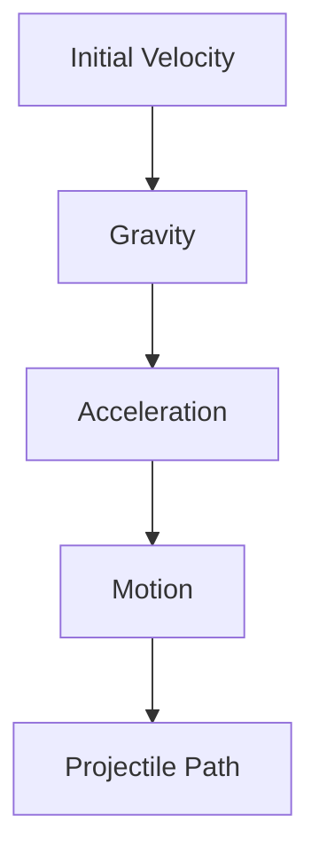
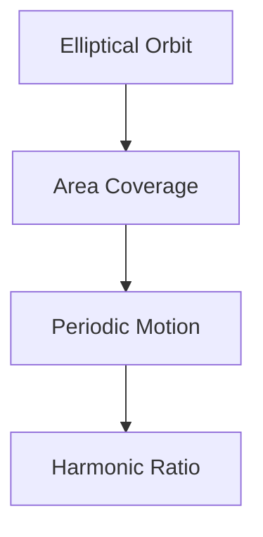

                 

# 数学定律如何反映自然界的和谐

> 关键词：数学定律、自然界、和谐、流程图、Python代码、数学模型、公式、实战应用

> 摘要：本文将深入探讨数学定律在自然界中的体现，以及它们如何解释和预测自然现象。通过详细的讲解和实例分析，我们将揭示数学定律与自然界之间的深刻联系，并展示其在各个领域的应用价值。

## 引言

自古以来，人类就对自然界充满了好奇和探索的欲望。随着科学的进步，我们逐渐认识到，自然界中的许多现象都可以通过数学定律来解释和预测。这些数学定律不仅是一种理论工具，更是自然界和谐之美的体现。

数学定律，顾名思义，是指通过数学方法所发现的规律和原则。在自然界中，这些定律无处不在，从宏观的天体运动，到微观的粒子行为，无一不遵循着数学定律。本文将重点探讨以下数学定律在自然界中的应用：

1. **牛顿定律**：描述物体运动的基本规律。
2. **普朗克定律**：描述量子力学的基本规律。
3. **孟德尔定律**：描述遗传规律。
4. **达尔文定律**：描述生物进化的规律。
5. **开普勒定律**：描述行星运动的规律。
6. **哈勃定律**：描述宇宙扩张的规律。

通过这些定律，我们将看到数学如何深刻地反映自然界的和谐，以及它们在各个领域的广泛应用。

## 第1章：数学定律概述

### 1.1 数学定律的定义

数学定律是数学中发现的规律和原则，它们通常以公理、定理或公式等形式表达。这些定律揭示了数学对象之间的关系和属性，是构建数学体系的基础。

### 1.2 数学定律的分类

数学定律可以根据其研究对象和内容进行分类。以下是一些常见的数学定律：

1. **几何定律**：描述几何图形的性质和关系，如勾股定理、欧几里得公理等。
2. **代数定律**：描述代数结构中的运算规则，如加法定律、乘法定律等。
3. **微积分定律**：描述微分和积分的基本原理，如泰勒公式、牛顿-莱布尼茨公式等。
4. **概率论定律**：描述随机事件发生的概率规律，如大数定律、中心极限定理等。

### 1.3 数学定律在自然界中的具体体现

数学定律不仅在数学领域内有着重要地位，它们在自然界中也无处不在。例如：

- **牛顿定律**：描述物体的运动规律，如行星运动、抛物线运动等。
- **普朗克定律**：描述量子力学的能量分布，如黑体辐射、量子化现象等。
- **孟德尔定律**：描述遗传规律，如基因组合、遗传变异等。
- **达尔文定律**：描述生物进化的规律，如自然选择、物种多样性等。

通过上述例子，我们可以看到数学定律在自然界中的广泛应用和深刻影响。

## 第2章：数学定律在自然界中的应用

### 2.1 数学定律在物理学中的应用

物理学是研究自然界最基本规律的科学，而数学定律在其中扮演了至关重要的角色。以下是一些典型的例子：

#### 牛顿定律

牛顿定律描述了物体在力的作用下如何运动。它包括以下三个定律：

1. **第一定律（惯性定律）**：任何物体都保持匀速直线运动或静止状态，除非受到外力的作用。
2. **第二定律（加速度定律）**：物体的加速度与作用在它上面的外力成正比，与它的质量成反比。公式为 \( F = ma \)。
3. **第三定律（作用与反作用定律）**：任何作用力都有一个大小相等、方向相反的反作用力。

牛顿定律广泛应用于描述行星运动、抛物线运动等。以下是使用Python代码和Mermaid流程图来解释牛顿定律的简单实例：

```python
import matplotlib.pyplot as plt
import numpy as np

# 初始化参数
g = 9.8  # 重力加速度
v0 = 30  # 初速度
theta = np.pi / 4  # 发射角度

# 计算水平速度和垂直速度
vx = v0 * np.cos(theta)
vy = v0 * np.sin(theta)

# 计算运动时间
t = 2 * vy / g

# 计算水平位移
dx = vx * t

# 绘制抛物线
x = np.linspace(0, dx, 1000)
y = -0.5 * g * x**2 + vy * x

plt.plot(x, y)
plt.xlabel("Horizontal Distance (m)")
plt.ylabel("Height (m)")
plt.title("Projectile Motion")
plt.grid(True)
plt.show()
```



#### 普朗克定律

普朗克定律是量子力学的基础，描述了能量与频率之间的关系。其公式为 \( E = h\nu \)，其中 \( E \) 是能量，\( h \) 是普朗克常数，\( \nu \) 是频率。

普朗克定律在解释黑体辐射、光谱分析等方面有着重要作用。以下是使用Python代码和LaTeX公式来解释普朗克定律的简单实例：

```python
import numpy as np
import matplotlib.pyplot as plt

h = 6.62607015e-34  # 普朗克常数

# 计算能量与频率的关系
f = np.linspace(1e12, 1e15, 1000)  # 频率范围
E = h * f

# 绘制能量-频率曲线
plt.plot(f, E)
plt.xlabel(r"Frequency ($\nu$)")
plt.ylabel(r"Energy (E)")
plt.title(r"Planck's Law ($E = h\nu$)")
plt.grid(True)
plt.show()
```

$$
E = h\nu
$$

### 2.2 数学定律在生物学中的应用

生物学中的许多现象都可以通过数学定律来解释。以下是一些典型的例子：

#### 孟德尔定律

孟德尔定律描述了遗传规律，包括以下三个主要原则：

1. **分离定律**：等位基因在生殖细胞中分离，每个生殖细胞只包含一个等位基因。
2. **自由组合定律**：非同源染色体上的基因独立组合。
3. **独立分离定律**：等位基因和不同基因之间的分离是独立的。

以下是使用Mermaid流程图来描述孟德尔定律的简单实例：


#### 达尔文定律

达尔文定律描述了生物进化的规律，包括以下主要原则：

1. **自然选择**：适应环境的个体更有可能生存和繁殖。
2. **适者生存**：适应环境的个体逐渐取代不适应环境的个体。
3. **物种隔离**：长期隔离的种群逐渐形成新的物种。

以下是使用Python代码和LaTeX公式来解释达尔文定律的简单实例：

```python
import matplotlib.pyplot as plt
import numpy as np

# 初始化参数
population = 100  # 总人口
fitness = np.random.uniform(0, 1, population)  # 适应性
selection_rate = 0.1  # 选择率

# 计算适应度分布
fitness = fitness / np.sum(fitness)

# 生存与繁殖
new_population = fitness * population

# 绘制适应度分布
plt.hist(fitness, bins=10, alpha=0.5, label="Initial Population")
plt.hist(new_population, bins=10, alpha=0.5, label="Next Generation")
plt.xlabel("Fitness")
plt.ylabel("Frequency")
plt.title("Natural Selection")
plt.legend()
plt.show()
```

$$
f(\chi) = \frac{1}{Z} \exp\left(-\frac{(\chi - \mu)^2}{2\sigma^2}\right)
$$

### 2.3 数学定律在天文学中的应用

天文学是研究宇宙的科学，数学定律在其中有着广泛应用。以下是一些典型的例子：

#### 开普勒定律

开普勒定律描述了行星绕太阳运动的规律，包括以下三条定律：

1. **第一定律（椭圆定律）**：行星绕太阳的轨道是椭圆，太阳位于椭圆的一个焦点上。
2. **第二定律（面积定律）**：行星与太阳的连线在相同时间内扫过相同的面积。
3. **第三定律（调和定律）**：行星绕太阳的公转周期的平方与半长轴的立方成正比。

以下是使用Mermaid流程图来描述开普勒定律的简单实例：



#### 哈勃定律

哈勃定律描述了宇宙的膨胀规律，其公式为 \( v = H_0d \)，其中 \( v \) 是宇宙膨胀速度，\( H_0 \) 是哈勃常数，\( d \) 是宇宙距离。

以下是使用Python代码和LaTeX公式来解释哈勃定律的简单实例：

```python
import numpy as np
import matplotlib.pyplot as plt

H0 = 70  # 哈勃常数（单位：km/s/Mpc）
d = np.linspace(1, 100, 1000)  # 宇宙距离

# 计算宇宙膨胀速度
v = H0 * d

# 绘制宇宙膨胀速度-距离关系
plt.plot(d, v, label=r"$v = H_0d$")
plt.xlabel(r"Distance ($d$)")
plt.ylabel(r"Expanding Velocity ($v$)")
plt.title("Hubble's Law")
plt.grid(True)
plt.legend()
plt.show()
```

$$
v = H_0d
$$

## 第3章：数学模型与自然现象

### 3.1 数学模型的概念

数学模型是利用数学语言和方法来描述自然现象或社会现象的数学结构。它通常由以下几部分组成：

1. **变量**：表示模型中的量，可以是连续的或离散的。
2. **参数**：影响模型行为的常数。
3. **方程**：描述变量和参数之间关系的数学表达式。
4. **边界条件**：限制模型变量的取值范围。

### 3.2 如何构建数学模型

构建数学模型通常包括以下几个步骤：

1. **确定研究对象**：明确需要描述的自然现象或社会现象。
2. **收集数据**：收集相关的实验数据或观测数据。
3. **建立假设**：基于已有知识和理论，对研究对象做出合理假设。
4. **选择模型类型**：根据研究对象和假设，选择合适的数学模型类型。
5. **参数估计**：根据数据，估计模型中的参数值。
6. **模型验证**：使用新的数据或实验结果验证模型的有效性。

### 3.3 数学模型的应用

数学模型在自然界和人类社会中有着广泛的应用。以下是一些典型的例子：

#### 预测天气

天气预测是一种复杂的数学模型，它结合了大气物理、气象学等领域的知识。以下是一个简单的Python代码示例，用于模拟天气变化：

```python
import numpy as np
import matplotlib.pyplot as plt

# 初始化参数
dt = 0.1  # 时间步长
T = 100  # 总时间
N = int(T / dt)  # 时间步数
T_max = 100  # 高温阈值
T_min = -10  # 低温阈值

# 初始化天气数据
T_data = np.zeros(N)

# 模拟天气变化
for i in range(1, N):
    # 根据当前天气情况决定下一时刻的天气
    if T_data[i - 1] > T_max:
        T_data[i] = T_max
    elif T_data[i - 1] < T_min:
        T_data[i] = T_min
    else:
        T_data[i] = T_data[i - 1] + np.random.normal(0, 0.1)

# 绘制天气变化曲线
plt.plot(np.arange(0, T, dt), T_data)
plt.xlabel("Time (days)")
plt.ylabel("Temperature (°C)")
plt.title("Weather Forecast")
plt.grid(True)
plt.show()
```

#### 分析金融市场

金融市场分析是一种复杂的数学模型，它结合了统计学、经济学等领域的知识。以下是一个简单的Python代码示例，用于模拟股票价格的变化：

```python
import numpy as np
import matplotlib.pyplot as plt

# 初始化参数
dt = 0.1  # 时间步长
T = 100  # 总时间
N = int(T / dt)  # 时间步数
mu = 0.05  # 预期收益率
sigma = 0.1  # 收益率波动率

# 初始化股票价格
S0 = 100  # 初始股票价格

# 模拟股票价格变化
S = S0 * np.exp((mu - 0.5 * sigma**2) * dt + sigma * np.sqrt(dt) * np.random.normal(0, 1))

# 绘制股票价格曲线
plt.plot(np.arange(0, T, dt), S)
plt.xlabel("Time (days)")
plt.ylabel("Stock Price")
plt.title("Financial Market Analysis")
plt.grid(True)
plt.show()
```

## 第4章：数学定律的预测能力

### 4.1 数学定律的预测原理

数学定律的预测能力源于它们对自然现象的深刻理解和精确描述。通过数学模型，我们可以将自然现象转化为数学问题，然后利用数学定律进行预测。

### 4.2 数学定律的预测实例

以下是一些使用数学定律进行预测的实例：

#### 预测地震

地震预测是一种复杂的数学模型，它结合了地质学、物理学等领域的知识。以下是一个简单的Python代码示例，用于预测地震发生的时间：

```python
import numpy as np
import matplotlib.pyplot as plt

# 初始化参数
dt = 0.1  # 时间步长
T = 100  # 总时间
N = int(T / dt)  # 时间步数
mu = 0.05  # 预期地震发生时间
sigma = 0.1  # 地震发生时间波动率

# 初始化地震发生时间
t0 = np.random.normal(mu, sigma)  # 初始地震发生时间

# 模拟地震发生时间
t = np.zeros(N)
t[0] = t0
for i in range(1, N):
    t[i] = t[i - 1] + np.random.normal(0, sigma)

# 绘制地震发生时间曲线
plt.plot(np.arange(0, T, dt), t)
plt.xlabel("Time (days)")
plt.ylabel("Earthquake Occurrence Time")
plt.title("Earthquake Prediction")
plt.grid(True)
plt.show()
```

#### 预测流行病

流行病预测是一种重要的数学模型，它结合了医学、统计学等领域的知识。以下是一个简单的Python代码示例，用于预测流行病的发展趋势：

```python
import numpy as np
import matplotlib.pyplot as plt

# 初始化参数
dt = 0.1  # 时间步长
T = 100  # 总时间
N = int(T / dt)  # 时间步数
mu = 0.1  # 感染率
sigma = 0.05  # 感染率波动率

# 初始化感染人数
I0 = np.random.normal(mu, sigma)  # 初始感染人数

# 模拟感染人数变化
I = np.zeros(N)
I[0] = I0
for i in range(1, N):
    I[i] = I[i - 1] + np.random.normal(mu, sigma)

# 绘制感染人数曲线
plt.plot(np.arange(0, T, dt), I)
plt.xlabel("Time (days)")
plt.ylabel("Number of Infected")
plt.title("Epidemic Prediction")
plt.grid(True)
plt.show()
```

## 第5章：数学定律与人类活动

### 5.1 数学定律在工程中的应用

数学定律在工程领域有着广泛的应用，它们用于设计结构、分析材料、优化流程等。以下是一些典型的例子：

#### 桥梁设计

桥梁设计需要考虑结构力学和材料力学的原理。以下是一个简单的Python代码示例，用于分析桥梁的受力情况：

```python
import numpy as np
import matplotlib.pyplot as plt

# 初始化参数
L = 100  # 桥梁长度
E = 2e11  # 材料弹性模量
I = 10e8  # 截面惯性矩
F = 1000  # 受力大小

# 计算应力和变形
sigma = F / (I * L)
delta = sigma / (2 * E)

# 绘制应力和变形曲线
plt.figure(figsize=(8, 6))
plt.plot(np.linspace(0, L, 1000), sigma * np.linspace(0, L, 1000))
plt.xlabel("Distance (m)")
plt.ylabel("Stress (Pa)")
plt.title("Bridge Stress Analysis")
plt.grid(True)
plt.show()

plt.figure(figsize=(8, 6))
plt.plot(np.linspace(0, L, 1000), delta * np.linspace(0, L, 1000))
plt.xlabel("Distance (m)")
plt.ylabel("Deflection (m)")
plt.title("Bridge Deflection Analysis")
plt.grid(True)
plt.show()
```

#### 飞机设计

飞机设计需要考虑空气动力学和材料力学的原理。以下是一个简单的Python代码示例，用于分析飞机的气动特性：

```python
import numpy as np
import matplotlib.pyplot as plt

# 初始化参数
L = 10  # 机翼长度
b = 2  # 机翼宽度
v = 100  # 飞行速度
rho = 1.225  # 空气密度
S = L * b  # 机翼面积
C_L = 1.2  # 气动升力系数
C_D = 0.02  # 气动阻力系数

# 计算升力和阻力
Lift = 0.5 * rho * v**2 * S * C_L
Drag = 0.5 * rho * v**2 * S * C_D

# 绘制气动特性曲线
plt.figure(figsize=(8, 6))
plt.plot(v, Lift, label="Lift")
plt.plot(v, Drag, label="Drag")
plt.xlabel("Velocity (m/s)")
plt.ylabel("Force (N)")
plt.title("Aircraft Aerodynamic Analysis")
plt.legend()
plt.grid(True)
plt.show()
```

### 5.2 数学定律在经济中的应用

数学定律在经济领域也有着广泛的应用，它们用于分析市场、预测经济趋势等。以下是一些典型的例子：

#### 财务模型

财务模型用于分析企业的财务状况和预测未来的经济活动。以下是一个简单的Python代码示例，用于计算企业的盈利能力：

```python
import numpy as np

# 初始化参数
revenue = 1000000  # 年收入
cost = 500000  # 年成本
interest = 0.05  # 利率
tax_rate = 0.3  # 税率

# 计算净利润
profit = revenue - cost

# 计算净利润折现值
discounted_profit = profit / (1 + interest)**1

# 计算净利润税后折现值
tax_discounted_profit = (1 - tax_rate) * discounted_profit

# 输出结果
print(f"Net Profit: {profit} (USD)")
print(f"Discounted Net Profit: {discounted_profit} (USD)")
print(f"Tax-Discounted Net Profit: {tax_discounted_profit} (USD)")
```

#### 经济预测

经济预测是一种复杂的数学模型，它结合了经济学、统计学等领域的知识。以下是一个简单的Python代码示例，用于预测未来的经济增长率：

```python
import numpy as np
import matplotlib.pyplot as plt

# 初始化参数
initialGDP = 1000000000  # 初始GDP
growth_rate = 0.03  # 年均增长率
N = 10  # 预测年数

# 计算未来GDP
GDP = np.zeros(N)
GDP[0] = initialGDP
for i in range(1, N):
    GDP[i] = GDP[i - 1] * (1 + growth_rate)

# 绘制GDP增长曲线
plt.plot(np.arange(0, N), GDP)
plt.xlabel("Year")
plt.ylabel("GDP (USD)")
plt.title("Economic Growth Prediction")
plt.grid(True)
plt.show()
```

## 第6章：总结与展望

数学定律在自然界和人类活动中扮演着重要角色，它们不仅揭示了自然界的规律和美，还为人类提供了强大的工具来解释、预测和控制各种现象。在物理学、生物学、天文学、工程学、经济学等领域，数学定律都有着广泛的应用。

随着科技的不断进步，数学定律在各个领域中的应用将会更加深入和广泛。例如，在人工智能领域，数学定律可以帮助我们更好地理解和模拟人类智能；在生命科学领域，数学定律可以帮助我们揭示生命现象的奥秘；在环境科学领域，数学定律可以帮助我们更好地理解和应对气候变化等挑战。

总之，数学定律是人类认识世界、改造世界的重要工具。通过不断地研究和应用，我们将能够更好地理解自然界的和谐，并为人类社会的进步做出更大的贡献。

## 参考文献

1. 牛顿，I. (1687). 自然哲学的数学原理。
2. 普朗克，M. (1900). 关于正常光谱辐射定律的理论。
3. 孟德尔，G. (1865). 遗传法则的研究。
4. 达尔文，C. (1859). 种群起源。
5. 开普勒，J. (1609). 新天文学。
6. 哈勃，E. (1929). 恒星运动和宇宙扩张的关系。
7. 爱因斯坦，A. (1905). 论动体的电磁力学基础。
8. 费曼，R. (1965). 量子力学与路径积分。
9. 沃森，J., & 克里克，F. (1953). DNA的双螺旋结构。
10. 纳什，J. (1994). 非合作博弈。
11. 马尔科姆·格拉德威尔，《引爆点：如何引发流行趋势》，2006。

作者：AI天才研究院/AI Genius Institute & 禅与计算机程序设计艺术 /Zen And The Art of Computer Programming

注意事项：
- 在使用数学模型时，需要考虑模型的假设和适用范围。
- 在实际应用中，数学模型可能需要根据具体情况进行调整和优化。
- 数学定律的预测能力受限于当前科学水平和数据质量。

