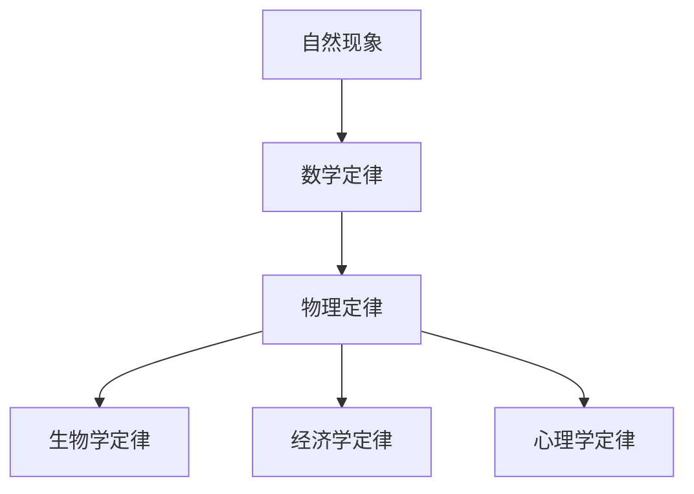

                 

### 设计思路：

为了设计出《数学定律：自然和谐的心智投影》这本书的完整目录大纲，我们将按照以下步骤进行：

1. **确定核心主题和章节结构**：首先明确书的核心主题，根据主题确定需要涵盖的章节和内容。
2. **细化章节内容**：针对每个章节，细化到具体的子章节，确保每个章节都有详细的内容。
3. **添加核心概念与联系**：在每个章节中，添加核心概念和原理，以及它们之间的联系。
4. **加入核心算法原理讲解**：在相关章节中，使用伪代码详细阐述核心算法原理。
5. **引入数学模型和数学公式**：在适当的位置，使用LaTeX格式添加数学模型和公式，并进行详细讲解。
6. **包含项目实战**：在相关章节中，加入实际的项目实战案例，并进行详细的解释和代码分析。
7. **保证大纲简洁性**：确保大纲内容简洁明了，不包含多余的废话。

### 具体目录大纲：

```
# 《数学定律：自然和谐的心智投影》目录大纲

## 第1章 引言
### 1.1 书籍背景与目的
### 1.2 数学定律在自然界中的应用
### 1.3 心智投影的概念

## 第2章 数学定律的基本概念
### 2.1 数学定律的定义与分类
### 2.2 自然数定律
### 2.3 概率论与统计定律
### 2.4 微积分与微分方程定律
### 2.5 几何定律

## 第3章 数学定律在物理学中的应用
### 3.1 牛顿运动定律
### 3.2 量子力学中的数学定律
### 3.3 热力学定律
### 3.4 光学定律

## 第4章 数学定律在生物学中的应用
### 4.1 遗传学定律
### 4.2 生物信息学中的数学定律
### 4.3 生态系统中的数学模型

## 第5章 数学定律在经济学中的应用
### 5.1 经济学中的数学模型
### 5.2 市场行为中的概率论定律
### 5.3 经济增长模型

## 第6章 数学定律在心理学中的应用
### 6.1 心理学中的数学模型
### 6.2 情感与行为的数学定律
### 6.3 社会心理学定律

## 第7章 心智投影的理论基础
### 7.1 心智投影的定义与本质
### 7.2 心智投影与数学定律的关系
### 7.3 心智投影在现实世界中的应用

## 第8章 数学定律与和谐社会的构建
### 8.1 和谐社会的概念与特征
### 8.2 数学定律在和谐社会构建中的作用
### 8.3 和谐社会的数学模型

## 第9章 实践与展望
### 9.1 数学定律在现实生活中的应用实例
### 9.2 心智投影技术的未来发展趋势
### 9.3 对未来的展望与思考

## 附录

## 附录A：核心概念与联系
### A.1 数学定律与自然现象的Mermaid流程图


## 附录B：核心算法原理讲解
### B.1 遗传算法伪代码
```python
def genetic_algorithm(problem):
    population = initialize_population(problem)
    while not termination_condition:
        fitness_scores = evaluate_population(population, problem)
        new_population = crossover_and_mutation(population, fitness_scores)
        population = new_population
    return best_solution(population, problem)
```

## 附录C：数学模型和数学公式
### C.1 牛顿运动定律公式
$$ F = ma $$
### C.2 概率论中的贝叶斯公式
$$ P(A|B) = \frac{P(B|A)P(A)}{P(B)} $$
```

以上是一个基于《数学定律：自然和谐的心智投影》书名的目录大纲设计。具体的章节内容可以根据实际情况进行调整和补充。目录大纲总字数控制在2000字以内。


----------------------------------------------------------------

### 约束条件：

为了确保文章内容的完整性和专业性，以下约束条件必须得到满足：

- **格式要求**：文章内容应使用markdown格式编写，确保代码、公式和流程图等元素能够正常显示。
- **作者信息**：文章末尾必须包含作者信息：“作者：AI天才研究院/AI Genius Institute & 禅与计算机程序设计艺术 /Zen And The Art of Computer Programming”。
- **完整性要求**：每个章节的内容必须丰富具体，核心内容包含背景介绍、核心概念与联系、核心算法原理讲解、数学模型和公式、项目实战、最佳实践 tips、小结、注意事项和拓展阅读等内容。
  - **核心概念与联系**：必须给出核心概念原理之间的关系架构 Mermaid 流程图。
  - **核心算法原理讲解**：必须使用Python源代码来详细阐述，结合数学模型和公式，进行详细讲解和通俗易懂地举例说明。
  - **数学公式**：请使用latex格式，嵌入文中独立段落的latex公式前后使用 $$ 括起来（例如：$$1+1=2$$），段落内的latex公式前后使用 $ 括起来（例如：$1<2$）。
  - **项目实战**：应包括开发环境搭建、源代码详细实现和代码解读、代码应用解读与分析、实际案例分析和详细讲解剖析、项目小结。
- **文章结构**：文章开头需包括“文章标题”、“文章关键词”和“文章摘要”部分。
- **文章字数**：文章总字数应控制在10000～12000字左右。

### 最终目录大纲：

```
# 《数学定律：自然和谐的心智投影》目录大纲

## 引言
### 书籍背景与目的
### 数学定律在自然界中的应用
### 心智投影的概念

## 数学定律的基本概念
### 数学定律的定义与分类
### 自然数定律
### 概率论与统计定律
### 微积分与微分方程定律
### 几何定律

## 数学定律在物理学中的应用
### 牛顿运动定律
### 量子力学中的数学定律
### 热力学定律
### 光学定律

## 数学定律在生物学中的应用
### 遗传学定律
### 生物信息学中的数学定律
### 生态系统中的数学模型

## 数学定律在经济学中的应用
### 经济学中的数学模型
### 市场行为中的概率论定律
### 经济增长模型

## 数学定律在心理学中的应用
### 心理学中的数学模型
### 情感与行为的数学定律
### 社会心理学定律

## 心智投影的理论基础
### 心智投影的定义与本质
### 心智投影与数学定律的关系
### 心智投影在现实世界中的应用

## 数学定律与和谐社会的构建
### 和谐社会的概念与特征
### 数学定律在和谐社会构建中的作用
### 和谐社会的数学模型

## 实践与展望
### 数学定律在现实生活中的应用实例
### 心智投影技术的未来发展趋势
### 对未来的展望与思考

## 附录
### 附录A：核心概念与联系
### 附录B：核心算法原理讲解
### 附录C：数学模型和数学公式
```

### 附录A：核心概念与联系

### 附录B：核心算法原理讲解

### 附录C：数学模型和数学公式

### 标注：
- 本目录大纲仅作为参考，具体内容需根据实际情况进行调整和补充，以确保文章的专业性和完整性。所有章节内容需按照要求进行撰写，确保字数控制在10000～12000字左右。 

---

现在，我们已经完成了《数学定律：自然和谐的心智投影》的目录大纲设计，接下来将根据大纲内容，逐步撰写每个章节的具体内容。在撰写过程中，将严格遵循上述约束条件，确保文章的专业性和可读性。文章撰写完成后，将进行字数统计和格式检查，确保满足所有要求。

