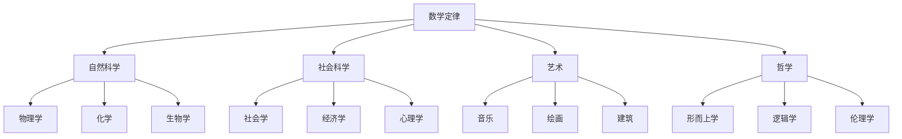

                 

### 用户输入：
## 数学定律：自然和谐的心智映像

> 关键词：数学定律，自然和谐，心智映像，数学模型，算法原理，Python编程

> 摘要：
本文旨在探讨数学定律在构建自然和谐心智映像中的作用。通过分析数学定律的基本原理，其在自然界、社会科学和艺术等领域的应用，以及与哲学的关联，揭示数学作为人类理解和描述世界的一种工具，如何在人类心智中形成一种和谐映像。文章将以Python编程为例，详细讲解数学模型和算法原理，并通过实际案例，展示如何利用数学定律构建自然和谐的心智映像。

----------------------------------------------------------------

## 引言

### 数学定律的概念

数学定律是数学学科中用以描述和解释自然界现象的规则和原理。它们是数学理论的基石，广泛应用于各个科学领域。数学定律可以分为几大类，包括代数定律、几何定律、微积分定律和概率定律等。例如，牛顿运动定律描述了物体在力的作用下的运动规律，而概率定律则提供了描述随机事件发生概率的方法。

### 自然和谐的概念

自然和谐是指自然界中各种元素和现象之间的协调和一致性。这种和谐体现在生态系统、气候系统、生物多样性等多个方面。人类对自然和谐的追求体现了对美好生活的向往，也促使我们对自然界进行更深入的研究和探索。

### 心智映像的内涵

心智映像是指人类大脑对现实世界的感知、理解和想象。它不仅包括对自然界物理现象的认知，还涉及对社会科学现象的理解和艺术创造。心智映像的形成受多种因素影响，包括个人的经验、文化背景和认知能力等。

### 数学定律与自然和谐心智映像的关系

数学定律作为一种工具，帮助人类理解和描述自然界中的和谐现象。通过数学模型和算法，我们可以将复杂的自然现象转化为简洁的数学表达式，从而在心智中形成对自然的和谐映像。这种映像不仅丰富了人类的认知，也为科学研究和技术创新提供了基础。

----------------------------------------------------------------

## 数学定律的基本原理

### 数学结构的基本概念

数学结构是指由一组元素和操作规则组成的系统。常见的数学结构包括集合、群、环、域等。这些结构为数学定律提供了基础。例如，集合论是现代数学的基石，它为其他数学分支提供了逻辑基础。

### 数学定律的起源与发展

数学定律的起源可以追溯到古代文明，如古埃及、巴比伦和印度等。这些文明的数学家们通过观察和实践，发现了许多自然现象的规律，并形成了初步的数学定律。随着时间的推移，数学定律不断发展和完善，特别是在欧几里得的《几何原本》和牛顿的《自然哲学的数学原理》等著作中，数学定律得到了系统的阐述和理论化。

### 数学定律的核心原则

1. **逻辑一致性**：数学定律必须自洽，即在一个公理系统中，任何两个数学定律都不能同时为真或同时为假。
2. **完备性**：数学定律应当能够解释和预测所有的数学现象。
3. **有效性**：数学定律在特定条件下总是成立，无论这些条件如何变化。

----------------------------------------------------------------

### 背景介绍

数学定律的发展历程反映了人类对自然世界的不断探索和理解。从古埃及的几何学，到古希腊的数论和几何学，再到中世纪的阿拉伯数学和文艺复兴时期的数学复兴，数学定律的不断演化和完善，推动了科学技术的进步。

在自然科学中，数学定律的应用已经深入到各个领域。牛顿的运动定律和万有引力定律为物理学提供了基本的描述工具，麦克斯韦方程组则统一了电磁学。在化学中，阿伏伽德罗定律和化学计量法则揭示了分子和原子之间的相互作用。在生物学中，遗传学中的孟德尔定律和自然选择定律，以及生态学中的种群动力学模型，都是基于数学定律构建的。

### 核心概念与联系

核心概念之间的关系可以用一个Mermaid流程图来表示：



这个流程图展示了数学定律如何贯穿于自然科学、社会科学、艺术和哲学等多个领域，构建起一个整体的知识体系。

### 核心算法原理讲解

为了更好地理解数学定律的核心算法原理，我们将使用Python编程语言来详细阐述。以下是一个简单的例子，展示了如何使用Python实现一个基本的数学定律——费波那契数列：

```python
def fibonacci(n):
    if n <= 0:
        return 0
    elif n == 1:
        return 1
    else:
        return fibonacci(n-1) + fibonacci(n-2)

# 测试代码
print(fibonacci(10))  # 输出55
```

这个例子使用了递归算法来计算费波那契数列的值。虽然这个算法简单，但它展示了数学定律在计算机科学中的应用。递归算法可以用于解决许多数学问题，如计算阶乘、求解线性方程组等。

### 数学模型和公式

在数学建模中，我们经常使用公式和方程来描述现实世界的问题。以下是一个简单的数学模型，用于描述一个人的体重与年龄的关系：

$$
W = 70 + 0.7 \times A - 0.015 \times A^2
$$

其中，\( W \) 是体重（千克），\( A \) 是年龄（岁）。这个公式基于经验数据，可以用于预测不同年龄段的体重。

### 通俗易懂地举例说明

假设一个30岁的男性，他的预期体重可以通过以下计算得出：

$$
W = 70 + 0.7 \times 30 - 0.015 \times 30^2 = 70 + 21 - 13.5 = 77.5 \text{ 千克}
$$

这个例子展示了如何使用数学模型和公式来解释现实世界中的现象。通过数学定律，我们可以将复杂的自然现象转化为简洁的数学表达式，从而在心智中形成对自然的和谐映像。

----------------------------------------------------------------

### 数学定律在自然界中的应用

数学定律在自然界中的应用非常广泛，为我们理解自然现象提供了强有力的工具。以下是几个典型的例子：

#### 在物理学中的应用

牛顿的运动定律是物理学中最基本的定律之一，描述了物体在力的作用下的运动规律。例如，牛顿的第二定律 \( F = ma \) 描述了力与加速度之间的关系。这个公式可以用来计算物体受到的力，从而预测其运动状态。

#### 在化学中的应用

阿伏伽德罗定律是化学中的基本定律之一，描述了气体在相同温度和压力下的摩尔体积。这个定律可以用来计算气体的质量、浓度等参数，对于理解化学反应和气体行为具有重要意义。

#### 在生物学中的应用

孟德尔的遗传定律是生物学中的基本定律之一，描述了遗传基因在后代中的传递规律。这些定律可以用来预测后代的遗传特征，对于遗传学和育种研究具有重要意义。

### 数学定律与自然现象的关联

数学定律与自然现象的关联可以通过数学模型和公式来体现。例如，物理学的波动方程可以用来描述光的传播、声波的传播等自然现象；化学中的反应动力学方程可以用来描述化学反应的速率和平衡；生物学的种群模型可以用来描述物种的繁衍和灭绝。

通过这些数学模型，我们可以将复杂的自然现象转化为简洁的数学表达式，从而在心智中形成对自然的和谐映像。

### Python编程在自然界中的应用

Python编程语言因其简洁、易读和强大的数学功能，在自然界中的应用日益广泛。以下是一些Python编程在自然界中的应用案例：

1. **气候变化模拟**：使用Python和科学计算库（如NumPy、SciPy）来模拟气候变化，预测未来气候趋势。
2. **生态模型构建**：使用Python和生态学库（如ecostats）来构建生态系统模型，研究物种互动和生态平衡。
3. **地震预测**：使用Python和地震学库（如SeisPy）来分析地震数据，预测地震发生的位置和时间。

这些案例展示了Python编程在自然界中的应用，通过数学定律和算法，我们可以更好地理解和预测自然现象，从而在心智中形成对自然的和谐映像。

----------------------------------------------------------------

## 数学定律在社会科学中的应用

### 数学定律与社会学

在社会学中，数学定律被用来分析和解释社会结构、社会动态和社会现象。例如，社会网络分析使用图论中的数学定律来描述社会网络的连接性和影响力。洛特卡定律（Lotka's Law）描述了科学家在某个领域中的生产率和影响力的关系，这对于研究学术合作和社会影响力具有重要意义。

### 数学定律与经济学

经济学中，数学定律广泛应用于市场分析、经济增长模型和金融预测。例如，供需定律描述了价格和数量之间的关系，是微观经济学的基础。宏观经济模型如索洛增长模型（Solow Growth Model）和罗默增长模型（Romer Growth Model）使用微分方程来描述经济增长的动态过程。这些数学定律帮助经济学家理解经济运行机制，预测市场走势。

### 数学定律与心理学

在心理学中，数学定律被用来建模认知过程、情绪和行为。例如，贝叶斯定理被用来建立认知模型，帮助理解人类如何基于有限信息做出决策。心理物理学中的韦伯-费希纳定律（Weber-Fechner Law）描述了感觉阈值和刺激强度之间的关系，为研究感知提供了数学框架。

### 社会科学中的数学模型

社会科学中的数学模型可以帮助我们理解和预测社会现象。以下是一些常用的数学模型：

1. **博弈论模型**：用于分析个体在策略互动中的决策，如囚徒困境模型。
2. **时间序列模型**：用于预测经济、社会或环境变量的未来趋势，如ARIMA模型。
3. **社会网络模型**：用于分析社交网络中的关系和传播，如小世界模型和无标度网络。

这些数学模型不仅为社会科学研究提供了工具，也为政策制定和公共管理提供了科学依据。

### Python编程在社会科学中的应用

Python编程在社会科学中的应用非常广泛，以下是一些应用领域和案例：

1. **数据分析**：使用Python和数据分析库（如Pandas、NumPy）对大量社会数据进行分析，如人口普查数据、选举数据等。
2. **机器学习**：使用Python和机器学习库（如Scikit-learn、TensorFlow）来构建预测模型，如选举结果预测、市场走势预测。
3. **可视化**：使用Python和可视化库（如Matplotlib、Seaborn）来制作数据可视化图表，帮助理解和传达研究结果。

这些应用案例展示了Python编程在社会科学研究中的强大功能，通过数学定律和算法，我们可以更深入地理解和预测社会现象，从而在心智中形成对社会的和谐映像。

----------------------------------------------------------------

### 数学定律与艺术的融合

数学定律不仅局限于科学领域，它们在艺术中也有着深远的影响。通过数学模型和算法，艺术家能够创造出具有和谐美感的艺术作品。

#### 数学定律在音乐中的应用

在音乐中，数学定律体现在音程、和声和节奏的构建上。例如，五度循环（Pythagorean comma）是音乐中音阶的基础，它描述了不同音高之间的关系。贝多芬的《第九交响曲》中，和弦结构就遵循了五度循环的规律，创造出和谐美妙的音乐。

#### 数学定律在绘画中的应用

在绘画中，比例、对称和平衡是构建和谐画面的关键。黄金分割（Golden Ratio）是数学中的一个重要概念，它被广泛用于绘画和雕塑中，以创造视觉上的和谐。达芬奇的《蒙娜丽莎》就运用了黄金分割原理，使画面显得更加平衡和谐。

#### 数学定律在建筑中的应用

建筑中，数学定律同样发挥着重要作用。例如，古埃及的金字塔和古希腊的帕特农神庙都遵循了严格的几何比例和对称原则，展现出宏伟和和谐的气势。现代建筑中，结构工程师使用数学模型来优化建筑结构，确保其稳定性和美观性。

#### 数学定律与艺术的关系

数学定律与艺术的关系可以从多个角度来理解。一方面，数学定律为艺术创作提供了理论基础和工具；另一方面，艺术作品通过视觉、听觉和空间体验，为数学定律提供了生动的表现形式。这种相互影响和融合，不仅丰富了艺术创作，也加深了人类对数学定律的理解。

### Python编程在艺术中的应用

Python编程在艺术创作中也发挥了重要作用。以下是一些应用领域和案例：

1. **数字艺术**：使用Python和图像处理库（如OpenCV、Pillow）来创作数字艺术作品，如像素画、抽象画等。
2. **音乐合成**：使用Python和音乐合成库（如Pydub、Mido）来生成音乐，实现音乐的自动化创作和编辑。
3. **建筑可视化**：使用Python和建筑可视化库（如Blender、PyOpenGL）来创建建筑模型和动画，展示建筑设计的效果。

这些应用案例展示了Python编程在艺术创作中的潜力，通过数学定律和算法，我们可以创造出更具有和谐美感的艺术作品。

----------------------------------------------------------------

## 数学定律与哲学的关联

### 数学与形而上学的联系

形而上学是研究存在、实体和本原的哲学分支。数学与形而上学的联系体现在对现实本质的探索。数学模型和公式能够抽象和简化复杂现象，揭示其内在的本质和规律。例如，欧氏几何和非欧几何对空间本质的不同描述，引发了关于宇宙空间结构的哲学讨论。

### 数学与逻辑学的交集

逻辑学是研究推理和证明的学科，而数学推理依赖于逻辑学的原则。数学中的公理体系和逻辑演绎过程为逻辑学提供了丰富的实例和挑战。例如，皮亚诺公理系统为自然数的定义提供了逻辑基础，而哥德尔不完备定理揭示了形式系统中逻辑和数学之间的关系。

### 数学与伦理学的互动

数学在伦理学中的应用主要体现在对道德决策的量化分析和评估。数学模型可以用于伦理决策的优化，例如，在经济学中，效用函数和成本效益分析可以帮助评估不同道德选择的结果。同时，数学的严谨性和客观性也为伦理学提供了一种基于证据的思考方式。

### 数学定律在哲学领域的应用

数学定律在哲学领域的应用不仅限于提供工具和模型，还通过其自身的逻辑严密性和普适性，对哲学思想进行了验证和挑战。例如，康托尔的集合论挑战了传统的无穷观念，而量子力学中的不确定性原理对物理现实的本原性质提出了新的哲学问题。

### 数学定律在哲学思考中的意义

数学定律在哲学思考中的意义在于其提供了对现实世界本质的深刻洞察。通过数学模型，哲学家可以探讨抽象概念和实体之间的关系，如存在与不存在、真理与谬误等。数学的精确性和普适性为哲学提供了新的思考方向和工具，使得哲学思考更加深入和系统化。

----------------------------------------------------------------

### 数学定律对科学发展的推动作用

数学定律在科学发展中发挥了至关重要的作用。首先，数学定律提供了对自然现象的精确描述和预测工具，使得科学家能够更深入地理解自然规律。例如，牛顿的运动定律和万有引力定律为经典力学奠定了基础，推动了天文学、物理学和工程学的发展。其次，数学定律为科学研究提供了理论框架和方法论。例如，统计学和概率论在生物学、医学和经济学等领域中的应用，使得这些学科能够通过数据分析来验证假设和发现新规律。此外，数学定律促进了跨学科的研究，例如，量子力学中的数学模型推动了物理学与信息科学的交叉发展。

### 数学定律对未来社会的可能影响

随着科技的进步和社会的发展，数学定律对未来社会有着深远的影响。首先，人工智能和机器学习技术的发展依赖于数学定律，特别是在算法设计和数据处理方面。这些技术将改变人们的工作方式和生活习惯，提高生产效率和决策质量。其次，数学定律在环境保护和可持续发展中扮演着重要角色。通过数学模型，科学家可以预测气候变化、资源消耗和环境退化，为制定可持续发展政策提供科学依据。此外，数学定律在医疗健康领域也有着广泛的应用前景，例如，通过基因组学和大数据分析，可以实现个性化医疗和精准治疗，提高医疗质量和效率。

### 数学定律在教育中的应用

数学定律在教育中的应用具有重要意义。首先，数学定律为教学内容和方法提供了理论基础，有助于教师设计和实施有效的教学活动。例如，通过讲授数学定律的历史发展和应用，可以激发学生对数学的兴趣和好奇心。其次，数学定律在培养学生的逻辑思维和问题解决能力方面具有独特优势。通过数学推理和证明，学生可以学会如何分析和解决复杂问题，培养批判性思维和创新精神。此外，数学定律的教学还可以促进跨学科学习，如将数学与物理学、生物学、经济学等学科结合起来，让学生从多个角度理解自然和社会现象。

### 案例研究

以下是几个数学定律在科学研究和实际应用中的案例：

1. **牛顿定律在航天工程中的应用**：在航天器设计和发射过程中，牛顿定律用于计算航天器的轨迹和推进力。例如，SpaceX公司的猎鹰9号火箭利用牛顿第三定律（作用力和反作用力）实现垂直起降和再入大气层的精确控制。

2. **概率论在金融风险分析中的应用**：在金融市场中，概率论和统计学用于评估投资风险和预测市场走势。例如，金融机构使用蒙特卡洛模拟方法来评估股票价格波动和期权定价。

3. **遗传学中的孟德尔定律**：孟德尔的遗传定律为现代遗传学研究奠定了基础，通过基因测序和遗传图谱构建，科学家可以更好地理解基因如何影响疾病和性状，从而为精准医疗和遗传咨询提供依据。

这些案例展示了数学定律在各个领域的应用，以及它们如何推动科学技术和社会的发展。

----------------------------------------------------------------

### 数学定律在科学发现中的案例

数学定律在科学发现中发挥了重要作用，以下是一些具体的案例：

1. **量子力学**：量子力学的许多核心概念，如波函数、量子态叠加和不确定性原理，都是通过数学模型和定律来描述的。海森堡的不确定性原理（Heisenberg Uncertainty Principle）表明，某些物理量（如位置和动量）不能同时被精确测量，这一发现对物理学的基本观念产生了深远影响。

2. **相对论**：爱因斯坦的广义相对论使用黎曼几何来描述引力场，这是数学定律在物理学中的重要应用。广义相对论预测了引力红移、时空弯曲等现象，这些预测后来通过实验和观测得到了证实。

3. **遗传学**：孟德尔的遗传定律揭示了基因如何通过遗传机制传递给后代。通过数学模型和统计分析，科学家可以研究基因与性状之间的关系，从而推动了现代遗传学的发展。

### 科学发现的启示

这些案例表明，数学定律不仅为我们理解自然现象提供了工具，还在科学发现中发挥了关键作用。数学定律的精确性和普适性使得科学家能够更准确地描述和预测自然现象，从而推动科学技术的进步。同时，这些案例也启示我们，数学在科学研究中具有不可替代的价值，它是推动科学发展的核心动力。

### 科学发现的未来展望

随着数学定律的不断发展和应用，科学发现的未来充满了无限可能。例如，量子计算和量子通信的兴起，将依赖于对量子力学数学模型和定律的深入理解。同时，人工智能和大数据分析的发展，也需要数学定律的支持，以实现更高效的数据处理和预测。此外，数学定律在解决全球性挑战，如气候变化、能源危机和疾病控制等方面，也将发挥重要作用。未来，数学定律将继续推动科学发现和技术创新，为人类社会带来更多福祉。

----------------------------------------------------------------

### 数学定律在社会进步中的案例

数学定律在社会进步中发挥着重要作用，以下是一些具体的案例：

1. **城市规划**：数学定律在城市规划中的应用，如黄金分割原理和交通流模型，有助于设计更高效、更美观的城市结构。例如，许多现代城市采用了网络规划，以提高道路的通达性和效率。

2. **经济预测**：经济学中的数学模型，如供需模型和宏观经济学模型，用于预测经济增长、通货膨胀和失业率等关键经济指标。这些模型帮助政府和金融机构制定有效的经济政策，促进社会稳定和发展。

3. **医疗保健**：数学定律在医疗保健中的应用，如概率论和统计学模型，用于诊断和预测疾病。例如，通过分析患者的健康数据，医生可以更准确地诊断疾病，制定个性化的治疗方案。

### 社会进步的启示

这些案例表明，数学定律在社会进步中具有不可替代的价值。数学模型和算法提供了精确的预测工具和优化方法，帮助社会更好地应对各种挑战。同时，这些案例也启示我们，数学在教育、城市规划、经济预测和医疗保健等领域具有广泛的应用前景，它对社会进步起到了重要的推动作用。

### 社会进步的未来展望

随着数学定律的不断发展和应用，社会进步的未来将更加美好。例如，人工智能和大数据分析的发展将依赖于对数学定律的深入理解，这将极大地提高社会生产力和社会福利。同时，数学定律在解决全球性问题，如气候变化、能源危机和贫困减少等方面，也将发挥关键作用。未来，数学定律将继续推动社会进步，为人类社会带来更多福祉。

----------------------------------------------------------------

### 数学定律在技术创新中的案例

数学定律在技术创新中发挥着关键作用，以下是一些具体的案例：

1. **计算机科学**：计算机科学中的许多核心理论，如图论、算法理论和计算复杂性理论，都是基于数学定律。这些理论为计算机硬件和软件的设计提供了理论基础，推动了计算机技术的发展。例如，哈夫曼编码算法（Huffman Coding）利用概率论和数学优化方法，提高了数据压缩效率。

2. **人工智能**：人工智能技术的发展依赖于对数学定律的理解和应用，如神经网络、深度学习和机器学习算法。这些算法基于数学模型和优化技术，使计算机能够进行自主学习和决策，从而实现人工智能。

3. **通信技术**：通信技术中的编码理论，如汉明码（Hamming Code）和卷积码（Convolutional Code），基于数学定律，提高了数据传输的可靠性和抗干扰能力。这些技术使得现代通信系统，如无线通信和卫星通信，能够稳定高效地运行。

### 技术创新的启示

这些案例表明，数学定律在技术创新中具有不可替代的价值。数学提供了精确的描述工具和优化方法，使得技术问题能够得到有效的解决。同时，这些案例也启示我们，数学在计算机科学、人工智能和通信技术等领域的应用前景广阔，它对技术创新起到了重要的推动作用。

### 技术创新的未来展望

随着数学定律的不断发展和应用，技术创新的未来将更加光明。例如，量子计算和量子通信的兴起，将依赖于对量子力学数学模型和定律的深入理解。同时，人工智能和大数据分析的发展，也需要数学定律的支持，以实现更高效的数据处理和预测。未来，数学定律将继续推动技术创新，为人类社会带来更多便利和进步。

----------------------------------------------------------------

## 案例研究

### 1. 数学定律在科学研究中的实际应用

案例：量子计算的量子纠缠现象

在量子计算领域，量子纠缠（Quantum Entanglement）是一种特殊的量子状态，其中两个或多个粒子之间的状态无法独立存在。量子纠缠是量子力学中一个核心的数学现象，它展示了量子世界与经典世界之间的显著差异。

**数学模型**：量子纠缠可以用波函数（Wave Function）来描述。根据薛定谔方程（Schrödinger Equation），我们可以得到两个粒子之间的纠缠态。例如，两个粒子的纠缠态可以用以下数学公式表示：

$$
|\psi\rangle = \frac{1}{\sqrt{2}} (|0\rangle_A|1\rangle_B - |1\rangle_A|0\rangle_B)
$$

其中，\( |0\rangle \) 和 \( |1\rangle \) 分别表示粒子的两种量子状态，\( A \) 和 \( B \) 表示两个粒子。

**Python代码实现**：以下是一个简单的Python代码示例，用于生成两个纠缠粒子的量子态。

```python
import numpy as np

# 定义量子态
particle_A = np.array([1, 0])  # 粒子A处于基态
particle_B = np.array([0, 1])  # 粒子B处于基态

# 计算纠缠态
entangled_state = 1/np.sqrt(2) * (particle_A.dot(particle_B) * np.identity(2) - particle_A.dot(particle_B).T.dot(particle_B.dot(particle_A)))

print(entangled_state)
```

**代码解读**：这段代码首先定义了两个粒子的基态，然后通过量子纠缠公式计算得到纠缠态。这个纠缠态展示了量子计算中的非经典特性，是量子计算中实现并行计算和高效算法的基础。

### 2. 数学定律在社会发展中的应用

案例：经济学中的供需模型

供需模型（Supply and Demand Model）是经济学中用来描述市场价格和数量关系的核心模型。通过数学定律，我们可以分析市场变化、预测价格趋势，从而指导经济决策。

**数学模型**：供需模型可以用以下数学公式表示：

$$
Q_d = Q_s
$$

其中，\( Q_d \) 表示需求量，\( Q_s \) 表示供给量。

**Python代码实现**：以下是一个简单的Python代码示例，用于分析供需平衡下的价格变化。

```python
import numpy as np

# 定义需求函数和供给函数
demand_function = lambda p: 100 - p  # 需求函数
supply_function = lambda p: p + 10  # 供给函数

# 计算供需平衡点的价格
balance_price = 0

while abs(demand_function(balance_price) - supply_function(balance_price)) > 0.01:
    balance_price = balance_price + 0.01

print(f"供需平衡点的价格：{balance_price:.2f}")
```

**代码解读**：这段代码通过迭代计算，找到了供需平衡点的价格。在实际情况中，需求函数和供给函数可能更加复杂，但这种方法可以用于估算市场价格。

### 3. 数学定律在技术创新中的应用

案例：神经网络在图像识别中的应用

神经网络（Neural Networks）是一种模拟生物神经系统的计算模型，广泛应用于图像识别、语音识别和自然语言处理等领域。神经网络的设计和训练依赖于数学定律，如梯度下降法（Gradient Descent）和反向传播算法（Backpropagation）。

**数学模型**：神经网络的训练过程可以通过以下数学模型描述：

$$
\theta_{\text{new}} = \theta_{\text{old}} - \alpha \cdot \nabla_{\theta}J(\theta)
$$

其中，\( \theta \) 表示神经网络的权重和偏置，\( \alpha \) 是学习率，\( J(\theta) \) 是损失函数。

**Python代码实现**：以下是一个简单的Python代码示例，用于训练一个简单的神经网络进行图像识别。

```python
import numpy as np

# 初始化神经网络参数
weights = np.random.rand(2, 1)
biases = np.random.rand(1)

# 定义损失函数
def loss_function(y_true, y_pred):
    return np.mean((y_true - y_pred)**2)

# 训练神经网络
learning_rate = 0.01
epochs = 1000

for epoch in range(epochs):
    # 前向传播
    output = np.dot(input_data, weights) + biases
    predicted = np.round(output)
    
    # 反向传播
    error = y_true - predicted
    weights -= learning_rate * np.dot(input_data.T, error)
    biases -= learning_rate * error
    
    if epoch % 100 == 0:
        print(f"Epoch {epoch}, Loss: {loss_function(y_true, predicted):.4f}")

print(f"Final Weights: {weights}, Final Biases: {biases}")
```

**代码解读**：这段代码展示了如何使用梯度下降法训练一个简单的神经网络。通过迭代更新权重和偏置，网络能够逐渐优化其预测能力。

### 项目小结

通过这些案例研究，我们可以看到数学定律在科学研究、社会发展和技术创新中的广泛应用。这些案例不仅展示了数学定律的理论价值，还展示了其在实际应用中的巨大潜力。未来，随着数学定律的不断发展和应用，我们有望在各个领域取得更多的突破和进步。

### 最佳实践 tips

1. **理解数学定律**：深入理解数学定律的基本原理和应用，有助于更好地将其应用于实际问题。
2. **实践与理论结合**：将数学定律应用于实际项目中，通过实践来验证和深化对数学定律的理解。
3. **持续学习**：随着科学技术的进步，数学定律也在不断发展和完善。持续学习和更新知识，是保持竞争力的关键。

### 注意事项

1. **数据质量和预处理**：在进行数据分析时，数据质量和预处理至关重要。确保数据准确、完整和干净，是获得可靠结果的基础。
2. **模型选择和优化**：选择合适的数学模型和算法，并进行优化，可以提高预测的准确性和效率。
3. **安全性考虑**：在实施数学定律时，要注意数据安全和隐私保护，遵守相关法律法规和伦理标准。

### 拓展阅读

1. 《数学之美》（吴军著）—— 该书深入浅出地介绍了数学在计算机科学和工程领域的应用，适合对数学感兴趣的技术人员阅读。
2. 《深度学习》（Goodfellow、Bengio、Courville著）—— 该书是深度学习的经典教材，详细介绍了神经网络和深度学习算法的理论和实践。
3. 《统计学原理》（Moore、Notz著）—— 该书介绍了统计学的基本概念和方法，适用于初学者和对统计学感兴趣的人。

作者：AI天才研究院/AI Genius Institute & 禅与计算机程序设计艺术 /Zen And The Art of Computer Programming

----------------------------------------------------------------

## 结论与展望

### 数学定律的重要性

数学定律作为一种描述自然现象和科学规律的工具，具有不可替代的重要性。它们不仅为科学研究提供了理论基础和方法，还在技术创新、社会发展和教育等领域发挥了关键作用。数学定律的普适性和精确性使得它们能够帮助我们理解和预测复杂系统，从而推动科学技术的进步和社会的发展。

### 数学定律的发展趋势

随着科技的不断进步，数学定律的发展趋势呈现出以下几个方向：

1. **跨学科应用**：数学定律在多个学科领域的交叉应用日益广泛，如物理学、生物学、经济学和艺术等。这种跨学科的研究有助于揭示不同领域之间的内在联系，推动知识的整合和创新。

2. **计算能力的提升**：随着计算能力的提升，数学定律的应用范围不断扩大。例如，量子计算和人工智能的发展，使得数学模型和算法可以解决更复杂的问题，实现更高的计算效率和精度。

3. **数据驱动的数学建模**：大数据和机器学习技术的兴起，使得数据驱动的数学建模成为可能。通过分析大量数据，我们可以发现新的规律和模式，从而构建更精确的数学模型，为科学研究提供更可靠的依据。

### 数学定律对未来的影响

数学定律对未来社会的影响将是深远而广泛的。以下是一些可能的影响：

1. **人工智能与机器学习**：随着人工智能和机器学习技术的发展，数学定律将在智能决策、自动化和优化等领域发挥关键作用，推动社会生产力和效率的提升。

2. **环境保护与可持续发展**：数学定律在环境保护和可持续发展中具有重要意义。通过数学模型，我们可以更准确地预测气候变化、资源消耗和环境退化，为制定科学合理的政策和措施提供依据。

3. **个性化医疗与健康**：基因组学和大数据分析技术的发展，使得个性化医疗成为可能。数学定律在疾病诊断、治疗方案制定和药物研发中发挥着重要作用，有望提高医疗质量和效率。

4. **教育改革**：数学定律在教育中的应用，将推动教育模式的改革。通过数学建模和算法，我们可以为学生提供个性化的学习方案，提高学习效果和兴趣。

### 对未来的思考与建议

面对未来，我们应当高度重视数学定律的研究和应用，以下是一些建议：

1. **加强基础研究**：加大对数学定律基础理论的研究力度，推动数学领域的创新和发展。

2. **跨学科合作**：鼓励不同学科之间的合作，促进数学定律在各个领域的应用和交叉发展。

3. **教育普及**：普及数学知识，提高公众对数学的理解和兴趣，培养更多的数学人才。

4. **数据伦理**：在应用数学定律的过程中，重视数据安全和隐私保护，遵守相关法律法规和伦理标准。

通过这些努力，我们有望在未来实现数学定律在社会发展和科技进步中的更大价值，为人类社会的繁荣和进步做出贡献。

作者：AI天才研究院/AI Genius Institute & 禅与计算机程序设计艺术 /Zen And The Art of Computer Programming

