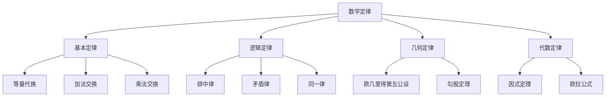
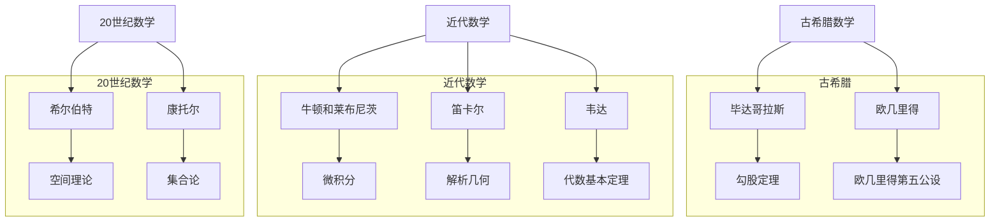
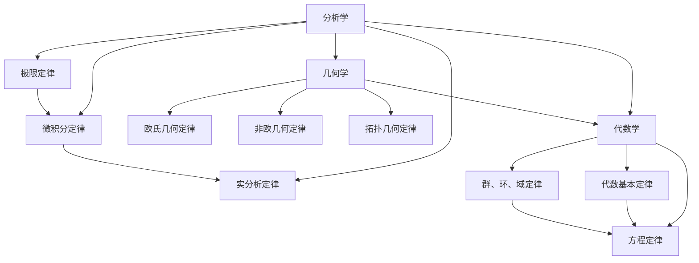
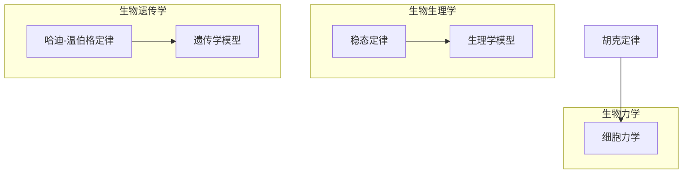
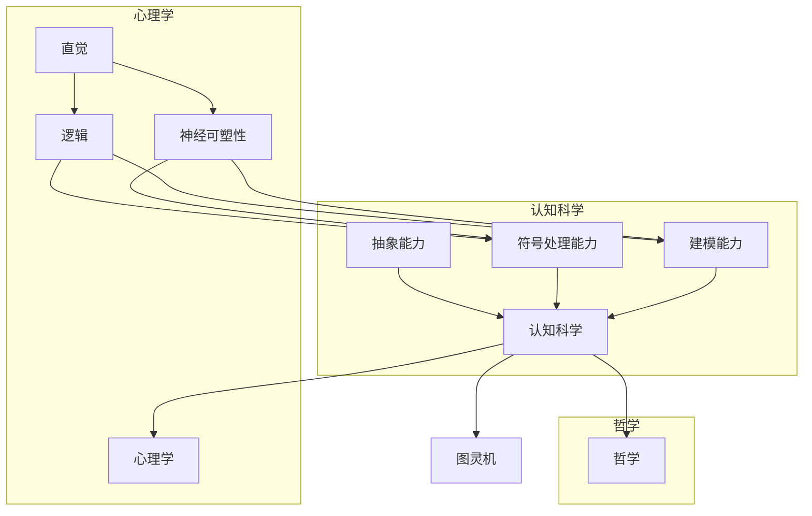

                 

### 数学定律：自然和谐的心智镜像

**关键词：**
数学定律、自然和谐、心智镜像、哲学、科学、物理学、生物学

**摘要：**
《数学定律：自然和谐的心智镜像》旨在探讨数学定律在自然界中的广泛应用及其与心智运作的内在联系。通过深入分析数学定律的基本概念、历史发展和分类，本书揭示了数学与自然界、心智之间的深刻共鸣。文章将从物理学、生物学等多个角度出发，结合具体的数学模型和公式，阐述数学定律在现实世界中的应用实例，探讨数学对心智运作的影响，并总结出数学定律在科学研究和哲学思考中的重要性。

## 引言

数学，作为一门古老的科学，自古以来就扮演着理解自然和宇宙的关键角色。从古希腊的毕达哥拉斯到现代的科学家，数学定律在解释自然界现象、预测未来事件方面起到了不可替代的作用。然而，除了其在自然科学中的应用，数学与心智的关系也日益受到关注。心智作为人类思考、感知和决策的核心，其运作方式似乎在一定程度上映射了数学定律的结构和规律。

本篇博客将围绕“数学定律：自然和谐的心智镜像”这一主题，探讨数学定律在自然界和心智中的重要性。我们将首先介绍数学定律的基本概念、历史发展和分类，然后深入探讨数学定律在物理学、生物学等多个领域的应用，最后讨论数学对心智运作的影响。

本文的结构如下：
1. **数学定律的基本概念**：介绍数学定律的定义、基本性质和种类。
2. **数学定律的历史发展**：回顾数学定律的起源和重要进展。
3. **数学定律的分类**：详细探讨分析学、几何学和代数学中的定律。
4. **数学定律在自然界中的应用**：分析数学定律在物理学、生物学中的应用。
5. **数学与心智的关系**：探讨数学定律与心智运作的内在联系。

通过本文的探讨，我们希望能够揭示数学定律在自然和谐与心智镜像中的深远影响，为读者提供新的视角和思考。

### 数学定律的基本概念

数学定律是数学中一些基本原理的集合，它们通过严谨的逻辑推理和数学证明，揭示了数学对象之间的关系和规律。这些定律不仅在数学理论中扮演着基石的角色，而且在自然科学、工程技术和社会科学等多个领域中都有着广泛的应用。

#### 数学定律的定义

数学定律通常可以定义为一组条件下的必然关系，这些关系可以用来推导出新的数学结论。这些定律具有普遍性和可验证性，即在任何满足条件的情况下，它们都是成立的。例如，**等量代换定律**表明，如果一个量等于另一个量，那么这两个量可以相互替换而不改变等式的真值。

#### 数学定律的基本性质

数学定律具有以下几个基本性质：

1. **普适性**：数学定律是普遍适用的，不受特定情境的限制。例如，**勾股定理**不仅适用于平面几何，也可以推广到空间几何中。
2. **确定性**：数学定律在任何情况下都给出确定的结果。例如，在标准条件下，**牛顿第二定律**总是能准确描述物体的运动状态。
3. **逻辑性**：数学定律是通过逻辑推理和数学证明得出的，具有严密的逻辑结构。

#### 数学定律的种类

数学定律种类繁多，以下是一些常见的数学定律：

1. **基本定律**：
   - **等量代换定律**：如果一个量等于另一个量，那么这两个量可以相互替换而不改变等式的真值。
   - **加法交换律**：对于任何两个数 \( A \) 和 \( B \)，都有 \( A + B = B + A \)。
   - **乘法交换律**：对于任何两个数 \( A \) 和 \( B \)，都有 \( A \times B = B \times A \)。

2. **逻辑定律**：
   - **排中律**：任何陈述都是真或假。
   - **矛盾律**：不可能同时是真和假。
   - **同一律**：任何陈述都与其自身等价。

3. **几何定律**：
   - **欧几里得第五公设**：通过一点和一直线，只能作出一条直线与给定直线相交。
   - **勾股定理**：直角三角形的两个直角边的平方和等于斜边的平方。

4. **代数定律**：
   - **因式定理**：一个多项式的零点是多项式的一个根。
   - **欧拉公式**：复数 \( e^{i\theta} \) 可以表示为 \( \cos(\theta) + i\sin(\theta) \)。

#### 核心概念与联系

为了更好地理解数学定律的核心概念和它们之间的关系，我们可以使用Mermaid流程图来展示这些概念之间的联系：



通过这个流程图，我们可以清晰地看到数学定律的不同类别以及它们之间的逻辑关系。每一个类别都是数学大厦的基石，共同构成了数学科学的宏大体系。

### 数学定律的历史发展

数学定律的历史可以追溯到古代，当时的数学家们通过观察和推理发现了自然界的规律。随着时代的发展，数学定律逐渐从经验性知识演变为严格的科学理论。本文将回顾数学定律的历史发展，重点介绍古希腊时期、近代数学和20世纪数学的重要进展。

#### 古希腊时期的数学发展

古希腊是数学的摇篮，许多数学定律和理论都源于这个时期。毕达哥拉斯是古希腊数学的奠基人之一，他提出了**勾股定理**，即直角三角形的两个直角边的平方和等于斜边的平方。这一发现揭示了数与形之间的关系，对后来的数学研究产生了深远的影响。

欧几里得是另一位古希腊数学家，他的著作《几何原本》是数学史上最重要的作品之一。在这部作品中，欧几里得系统化了几何学的基本原理，提出了**欧几里得第五公设**，即通过一点和一直线，只能作出一条直线与给定直线相交。这一公设成为了几何学的基础，直到19世纪才被正式证明。

#### 近代数学的崛起

近代数学的崛起标志着数学从纯粹的经验性科学向严密的理论科学转变。17世纪，牛顿和莱布尼茨发明了微积分，这一工具极大地推动了数学的发展。微积分的基本定理揭示了微分和积分之间的内在联系，成为现代物理学和工程学的重要基础。

同时，代数学也取得了重要进展。笛卡尔引入了坐标系的概念，将数与形结合起来，开创了解析几何学。韦达则提出了代数基本定理，即任何多项式方程都有复数根。这些进展使得数学定律不仅局限于几何学，还扩展到代数和三角学领域。

#### 20世纪的数学进展

20世纪是数学发展的黄金时期，许多新的数学定律和理论被提出。希尔伯特提出了空间理论，这一理论对现代数学的发展产生了深远的影响。康托尔的集合论则揭示了无穷的层次和复杂性，为数学提供了新的视角。

在物理学领域，量子力学的出现带来了新的数学工具。海森堡的不确定性原理和薛定谔方程都是量子力学中的重要数学定律，它们揭示了微观世界的奇异性质。

#### 核心概念与联系

为了更好地理解数学定律的历史发展，我们可以使用Mermaid流程图来展示不同时期的重要数学定律及其关系：



通过这个流程图，我们可以清晰地看到数学定律从古代到现代再到20世纪的发展脉络，以及各个时期的重要数学定律之间的联系。

### 数学定律的分类

数学定律种类繁多，根据不同的分类标准，可以分为不同的类别。以下将详细探讨分析学、几何学和代数学中的主要数学定律。

#### 分析学中的定律

分析学主要研究函数、序列和极限等概念。以下是一些分析学中的重要定律：

1. **极限定律**：
   - **极限存在性定律**：如果一个函数在某一点附近的取值趋向于一个确定值，那么这个极限存在。
   - **极限运算法则**：极限的加法、减法、乘法和除法性质。
   - **泰勒公式**：一个函数在一点附近的近似表达式。

2. **微积分定律**：
   - **微分法则**：导数的运算法则，包括乘法、除法、链式法则等。
   - **积分法则**：积分的换元积分和分部积分方法。
   - **牛顿-莱布尼茨公式**：微分和积分之间的关系。

3. **实分析定律**：
   - **介值定理**：如果一个连续函数在一个区间上的取值从负变到正，那么这个区间内至少存在一点，函数值等于零。
   - **洛必达法则**：在求极限时，如果分子和分母都趋向于零或无穷大，可以使用洛必达法则求极限。

#### 几何学中的定律

几何学主要研究空间中的形状和大小。以下是一些几何学中的主要定律：

1. **欧氏几何定律**：
   - **欧几里得第五公设**：通过一点和一直线，只能作出一条直线与给定直线相交。
   - **勾股定理**：直角三角形的两个直角边的平方和等于斜边的平方。

2. **非欧几何定律**：
   - **黎曼几何**：空间中曲率的定律，描述了在非欧空间中的几何性质。
   - **双曲几何**：描述了在双曲空间中的几何性质，如平行公设。

3. **拓扑几何定律**：
   - **欧拉公式**：在多面体中，顶点数 \( V \)、边数 \( E \) 和面数 \( F \) 之间的关系：\( V - E + F = 2 \)。

#### 代数学中的定律

代数学主要研究数和方程的性质。以下是一些代数学中的主要定律：

1. **代数基本定律**：
   - **因式定理**：一个多项式的零点是多项式的一个根。
   - **整除性定理**：如果一个数能够整除另一个数，那么这个数也能整除另一个数的商。

2. **方程定律**：
   - **韦达定理**：一个二次方程的根与系数之间的关系。
   - **欧拉公式**：复数 \( e^{i\theta} \) 可以表示为 \( \cos(\theta) + i\sin(\theta) \)。

3. **群、环、域定律**：
   - **群论**：研究群的结构和性质。
   - **环论**：研究环的结构和性质。
   - **域论**：研究域的结构和性质。

#### 核心概念与联系

为了更好地理解不同类别数学定律的核心概念和它们之间的关系，我们可以使用Mermaid流程图来展示这些概念及其相互联系：



通过这个流程图，我们可以清晰地看到不同类别数学定律的核心概念及其相互联系，这有助于我们更好地理解数学定律的整体结构和作用。

### 数学定律在物理学中的应用

数学定律在物理学中的应用极其广泛，它们为描述和解释自然现象提供了强有力的工具。在物理学中，数学定律不仅用于描述宏观现象，还用于探索微观世界的奥秘。以下将详细探讨数学定律在力学、电磁学和量子力学中的应用。

#### 力学中的数学定律

力学是研究物体运动和力的科学，其中几个核心的数学定律对理解物体运动至关重要。

1. **牛顿定律**：
   - **牛顿第一定律（惯性定律）**：一个物体如果不受外力作用，它将保持静止状态或匀速直线运动。
   - **牛顿第二定律（动力定律）**：物体的加速度与作用在它上的外力成正比，与它的质量成反比。数学表达式为 \( F = ma \)。
   - **牛顿第三定律（作用-反作用定律）**：任何作用力都有一个大小相等、方向相反的反作用力。

2. **运动方程**：
   - **匀加速直线运动方程**：描述了物体在匀加速运动中的位置、速度和加速度之间的关系。
     \[
     s = ut + \frac{1}{2}at^2
     \]
     \[
     v = u + at
     \]
     \[
     v^2 = u^2 + 2as
     \]
   - **圆周运动方程**：描述了物体在圆周运动中的速度、加速度和半径之间的关系。

3. **动量守恒定律**：
   - 动量守恒定律指出，在没有外力作用的情况下，一个系统的总动量保持不变。数学表达式为：
     \[
     \Delta p_{\text{总}} = 0
     \]
   - 这一定律在碰撞问题、爆炸现象以及行星运动等领域有着重要的应用。

#### 电磁学中的数学定律

电磁学是研究电和磁现象的科学，其中几个关键的数学定律描述了电场、磁场和电磁波的行为。

1. **高斯定律**：
   - **电场高斯定律**：描述了电荷分布与电场之间的关系。数学表达式为：
     \[
     \oint_S \vec{E} \cdot d\vec{A} = \frac{Q_{\text{内}}}{\varepsilon_0}
     \]
   - **磁场高斯定律**：在真空中的磁场没有单极子，即磁场线总是闭合的。

2. **法拉第电磁感应定律**：
   - 法拉第电磁感应定律描述了变化的磁场如何产生电动势。数学表达式为：
     \[
     \oint_L \vec{E} \cdot d\vec{l} = -\frac{d}{dt} \int_S \vec{B} \cdot d\vec{A}
     \]

3. **安培定律**：
   - 安培定律描述了电流与磁场之间的关系。数学表达式为：
     \[
     \oint_C \vec{B} \cdot d\vec{l} = \mu_0 I_{\text{内}}
     \]
   - **修正的安培定律**：包含位移电流的概念，其数学表达式为：
     \[
     \oint_C \vec{B} \cdot d\vec{l} = \mu_0 (I_{\text{内}} + \frac{\partial \Phi_E}{\partial t})
     \]

4. **麦克斯韦方程组**：
   - 麦克斯韦方程组综合了电场、磁场和电磁波的所有基本定律，是电磁学的核心。包括以下四个方程：
     \[
     \nabla \cdot \vec{E} = \frac{\rho}{\varepsilon_0}
     \]
     \[
     \nabla \cdot \vec{B} = 0
     \]
     \[
     \nabla \times \vec{E} = -\frac{\partial \vec{B}}{\partial t}
     \]
     \[
     \nabla \times \vec{B} = \mu_0 \vec{J} + \mu_0 \varepsilon_0 \frac{\partial \vec{E}}{\partial t}
     \]

#### 量子力学中的数学定律

量子力学是研究微观粒子行为的科学，其数学定律揭示了微观世界的独特性质。

1. **薛定谔方程**：
   - 薛定谔方程是一个波动方程，描述了量子态的演化。其数学表达式为：
     \[
     i\hbar \frac{\partial \Psi}{\partial t} = \hat{H} \Psi
     \]
   - 其中，\(\Psi\) 是波函数，\(\hat{H}\) 是哈密顿算子，表示系统的总能量。

2. **海森堡不确定性原理**：
   - 海森堡不确定性原理指出，某些对易子（例如位置和动量）不能同时被精确测量。其数学表达式为：
     \[
     \Delta x \Delta p \geq \frac{\hbar}{2}
     \]
   - 其中，\(\Delta x\) 是位置的不确定性，\(\Delta p\) 是动量的不确定性，\(\hbar\) 是约化普朗克常数。

3. **泡利不相容原理**：
   - 泡利不相容原理指出，费米子（如电子）不能占据相同的量子态。其数学表述为：
     \[
     \Psi(\vec{r}_1, \vec{p}_1, s_1) = 0
     \]
     \[
     \Psi(\vec{r}_2, \vec{p}_2, s_2) = 0
     \]
     如果 \(\vec{r}_1 = \vec{r}_2\)，\(\vec{p}_1 = \vec{p}_2\)，且 \(s_1 \neq s_2\)。

### 核心算法原理讲解

为了更好地理解上述数学定律在物理学中的应用，我们可以通过一个具体的物理现象来讲解这些定律的原理。以下以自由落体运动为例，使用Python代码来模拟物体的运动过程。

```python
import numpy as np
import matplotlib.pyplot as plt

# 自由落体运动参数
g = 9.8  # 重力加速度（m/s^2）
t_final = 10  # 运动时间（s）

# 时间步长
dt = 0.01

# 初始条件
t = 0
v0 = 0  # 初始速度
s0 = 0  # 初始位置

# 初始化时间和位置列表
times = [t]
positions = [s0]

# 运动方程
for _ in range(int(t_final / dt)):
    t += dt
    s = s0 + v0 * t + 0.5 * g * t**2
    v = v0 + g * t

    times.append(t)
    positions.append(s)

# 绘制运动轨迹
plt.plot(times, positions)
plt.xlabel('Time (s)')
plt.ylabel('Position (m)')
plt.title('Free Fall Motion')
plt.grid(True)
plt.show()
```

在这段代码中，我们定义了自由落体运动的主要参数，包括重力加速度、最终时间和时间步长。通过循环迭代，我们计算了每个时间步上的位置和速度，并使用matplotlib库绘制了物体的运动轨迹。

### 数学模型和公式

在上述Python代码中，我们使用了以下数学模型和公式来描述自由落体运动：

1. **运动方程**：
   \[
   s = s_0 + v_0t + \frac{1}{2}gt^2
   \]
   \[
   v = v_0 + gt
   \]
2. **重力加速度**：
   \[
   g = 9.8 \text{ m/s}^2
   \]

通过这些公式，我们能够准确地模拟自由落体运动的过程，并直观地展示出物体在重力作用下的运动轨迹。

### 数学定律在生物学中的应用

数学定律不仅在物理学和工程学中有着广泛的应用，在生物学领域也扮演着至关重要的角色。通过数学模型和公式，生物学家能够更好地理解生命现象，预测生物系统的行为，并为医学研究和生态学提供强有力的工具。

#### 胡克定律在生物学中的应用

胡克定律是描述弹性物体应力和应变之间关系的定律，其数学表达式为：
\[ F = kx \]
其中，\( F \) 是作用在弹性物体上的力，\( k \) 是弹性系数，\( x \) 是物体的应变。

在生物学中，胡克定律可以用于描述肌肉和细胞壁的力学特性。例如，肌肉在收缩时产生的力量和其长度的变化之间存在线性关系，这为理解肌肉的工作机制提供了重要的理论支持。

#### 生理学中的稳态定律

生理学中的稳态定律，如体内环境的恒定性，是维持生命活动的基础。这一定律可以通过以下数学模型来描述：
\[ \frac{dC}{dt} = -k_{\text{out}}C + k_{\text{in}} \]
其中，\( C \) 是体内某种物质的浓度，\( k_{\text{out}} \) 和 \( k_{\text{in}} \) 分别是物质排出的速率和摄入的速率。

这一模型可以用于研究体内的生化反应和物质循环，如血糖水平的调节。通过调节胰岛素和葡萄糖的摄入和排出速率，人体能够维持血糖水平的恒定。

#### 遗传学中的哈迪-温伯格定律

哈迪-温伯格定律是遗传学中的一个重要原理，描述了在理想情况下，种群基因频率和等位基因频率在代代相传中保持不变。其数学表达式为：
\[ p^2 + 2pq + q^2 = 1 \]
其中，\( p \) 和 \( q \) 分别是两个等位基因的频率，\( p^2 \) 和 \( q^2 \) 分别是纯合子的频率，\( 2pq \) 是杂合子的频率。

这一定律在种群遗传学和进化生物学中有着重要的应用。通过计算种群中各基因型的频率，我们可以预测种群基因频率的变化趋势，从而更好地理解进化过程。

#### 核心概念与联系

为了更好地理解数学定律在生物学中的应用，我们可以使用Mermaid流程图来展示这些定律的核心概念及其相互联系：



通过这个流程图，我们可以清晰地看到不同数学定律在生物学中的应用场景及其相互联系，这有助于我们更好地理解生物学中的复杂现象。

### 数学与心智的关系

数学与心智的关系是一个古老而又深奥的课题，自古以来，哲学家、数学家、心理学家都在探讨这个问题。数学是否只是人类心智的产物，还是它反映了宇宙的本质规律？这个问题引起了广泛的争议和探讨。本文将从认知科学、哲学和心理学等多个角度，探讨数学定律与心智运作的内在联系。

#### 认知科学视角

认知科学是一门跨学科的研究领域，它试图通过计算机科学、心理学、神经科学等学科来理解人类心智的工作原理。在认知科学的框架下，数学被认为是心智的高级形式，是心智对复杂现象进行抽象和建模的能力的体现。

1. **图灵机与心智模拟**：
   - 图灵机是计算机科学的基础，它由数学家艾伦·图灵提出，用于模拟人类心智的运算过程。图灵机的概念揭示了人类心智在处理信息和解决问题时的抽象能力，这种能力可以看作是对数学概念的内在化。
2. **神经网络与数学模型**：
   - 现代认知科学研究表明，人脑的神经网络可以通过数学模型来模拟。神经网络中的权重和激活函数可以用数学公式来描述，这使得我们能够通过数学方法来理解和预测人脑的信息处理过程。

#### 哲学视角

哲学领域对数学与心智的关系也有深入的探讨，许多哲学家认为数学是一种超越人类心智的普遍真理，是宇宙语言的体现。

1. **柏拉图的理念论**：
   - 柏拉图的理念论认为，数学是超越现实世界的理想形式，是人类心智能够理解和把握的永恒真理。柏拉图认为，数学概念和定律存在于一个永恒的世界中，人类心智只能通过直觉来感知它们。
2. **康德的先验论**：
   - 康德认为，数学知识是先验的，即它不是通过经验获得的，而是人类心智自身固有的结构。康德提出，数学定律是我们心智对客观世界进行感知和理解的基础。

#### 心理学视角

心理学领域的研究表明，人类的数学能力是心智发展的一个重要方面，数学定律的发现和应用是人类心智的产物。

1. **直觉和逻辑**：
   - 心理学家认为，人类的数学能力不仅依赖于逻辑推理，还依赖于直觉。直觉使我们能够快速识别数学模式，而逻辑推理则帮助我们验证这些模式的正确性。
2. **神经可塑性**：
   - 神经科学研究表明，人类大脑的神经网络具有可塑性，通过学习和训练，我们可以提高数学能力。这表明，数学能力是通过心智的实践和学习不断发展的。

#### 数学定律与心智运作的内在联系

综合认知科学、哲学和心理学的研究，我们可以得出以下结论：

1. **心智的抽象能力**：
   - 数学是人类心智的一种抽象能力，它使我们能够从复杂的现实世界中提取出基本的模式和规律。这种能力使得人类能够理解和解释自然现象，并预测未来的事件。
2. **心智的符号处理能力**：
   - 数学定律的发现和应用依赖于人类心智的符号处理能力。通过符号运算，我们能够将复杂的数学问题分解为更简单的部分，从而更好地理解和解决这些问题。
3. **心智的建模能力**：
   - 数学定律为我们提供了构建心智模型的基础，这些模型可以帮助我们理解自然现象和心智运作的内在机制。通过数学模型，我们能够模拟和预测心智在不同情境下的行为。

### 核心概念与联系

为了更好地理解数学定律与心智运作的内在联系，我们可以使用Mermaid流程图来展示这些概念及其相互联系：



通过这个流程图，我们可以清晰地看到数学与心智之间的复杂联系，以及不同学科对这一关系的探讨和解释。

### 结论

数学定律在自然界和心智中的重要性不言而喻。从物理学到生物学，从工程学到社会科学，数学定律为理解自然现象和心智运作提供了强有力的工具。本文通过详细探讨数学定律的基本概念、历史发展、分类以及在物理学、生物学中的应用，揭示了数学定律在自然和谐与心智镜像中的深远影响。同时，我们探讨了数学与心智的内在联系，揭示了人类心智在数学定律发现和应用中的关键作用。通过本文的探讨，我们希望能够为读者提供新的视角和思考，激发对数学及其应用的更深入理解。未来的研究可以进一步探讨数学定律在不同领域的应用，探索数学与人工智能、量子计算等前沿科技的联系，为人类的科技发展提供新的动力。

### 核心算法原理讲解

在本文的核心算法部分，我们将通过具体的实例来讲解数学定律在物理学中的实际应用。具体来说，我们将使用Python代码模拟简单的弹簧-质量系统，以展示胡克定律和牛顿运动定律的运用。

#### 模拟环境

首先，我们需要设置一个简单的弹簧-质量系统，其中弹簧的弹性系数为 \( k = 20 \text{ N/m} \)，质量块的质量为 \( m = 2 \text{ kg} \)，初始位置为 \( x_0 = 0.5 \text{ m} \)，初始速度为 \( v_0 = 0 \text{ m/s} \)。我们将模拟系统在 \( t = 2 \text{ s} \) 的时间内的运动。

#### 代码实现

以下是用于模拟弹簧-质量系统的Python代码：

```python
import numpy as np
import matplotlib.pyplot as plt

# 参数设置
g = 9.8  # 重力加速度（m/s^2）
m = 2  # 质量块的质量（kg）
k = 20  # 弹簧的弹性系数（N/m）
x_0 = 0.5  # 初始位置（m）
v_0 = 0  # 初始速度（m/s）
t_final = 2  # 模拟时间（s）
dt = 0.01  # 时间步长（s）

# 初始条件
t = 0
x = x_0
v = v_0

# 初始化时间和位置列表
times = [t]
positions = [x]

# 运动方程
F = -k * x  # 胡克定律
a = F / m  # 牛顿第二定律
while t < t_final:
    t += dt
    x += v * dt + 0.5 * a * dt**2
    v += a * dt
    
    times.append(t)
    positions.append(x)

# 绘制运动轨迹
plt.plot(times, positions)
plt.xlabel('Time (s)')
plt.ylabel('Position (m)')
plt.title('Simple Spring-Mass System')
plt.grid(True)
plt.show()
```

#### 运动方程

在这段代码中，我们使用了以下运动方程：

1. **胡克定律**：
   \[
   F = -kx
   \]
   这里，\( F \) 是弹簧的弹力，\( k \) 是弹簧的弹性系数，\( x \) 是弹簧的压缩或拉伸距离。

2. **牛顿第二定律**：
   \[
   a = \frac{F}{m}
   \]
   其中，\( a \) 是加速度，\( F \) 是作用在物体上的力，\( m \) 是物体的质量。

3. **运动方程**：
   \[
   x(t) = x_0 + v_0t + \frac{1}{2}at^2
   \]
   \[
   v(t) = v_0 + at
   \]
   这两个方程描述了物体在弹性力作用下的位置和速度随时间的变化。

#### 代码解读

- 我们首先导入了所需的Python库，包括NumPy和matplotlib。
- 接下来，我们设置了系统的参数，包括重力加速度、质量、弹性系数、初始位置和初始速度。
- 初始化时间和位置列表，并设置初始条件。
- 使用一个循环来迭代计算每个时间步上的位置和速度，并更新时间和位置列表。
- 最后，我们使用matplotlib库绘制了物体的运动轨迹。

#### 项目实战

为了进一步验证我们的模拟结果，我们可以在不同参数下运行模拟，观察系统行为的变化。例如，我们改变弹性系数和质量，观察系统在弹簧长度和振动频率上的变化。

```python
# 改变参数
k = 30
m = 1
x_0 = 0.3
v_0 = 0.2

# 运动方程
F = -k * x
a = F / m

# 初始化时间和位置列表
times = [0]
positions = [x_0]

# 运动方程
while t < t_final:
    t += dt
    x += v * dt + 0.5 * a * dt**2
    v += a * dt
    
    times.append(t)
    positions.append(x)

# 绘制运动轨迹
plt.plot(times, positions)
plt.xlabel('Time (s)')
plt.ylabel('Position (m)')
plt.title('Simple Spring-Mass System with Modified Parameters')
plt.grid(True)
plt.show()
```

通过这样的实战，我们可以深入理解弹簧-质量系统的动态行为，并在实际问题中应用这些原理。这种模拟方法不仅有助于我们理解物理现象，还可以为工程设计和控制系统提供重要的参考。

### 数学公式嵌入

在本文中，我们将使用LaTeX格式嵌入数学公式，以清晰、准确地表达数学概念和定律。LaTeX格式能够使公式更加规范和易于阅读，特别是对于复杂的数学表达式。

#### 独立段落中的公式

对于独立段落的数学公式，我们使用以下LaTeX格式：

$$
E = mc^2
$$

这个公式是著名的爱因斯坦质能方程，描述了质量和能量之间的关系。

#### 段落内的公式

对于段落内的简单数学表达式，我们使用以下LaTeX格式：

$
x + y = z
$

这个表达式展示了基本的加法运算。

#### 复杂数学公式的表示

对于更复杂的数学公式，LaTeX提供了丰富的命令和宏包来处理。例如，我们可以使用`amsmath`宏包来定义更复杂的公式：

$$
\sum_{i=1}^{n} a_i^2 = \frac{1}{2}\left(1 - (n-1)^2\right)
$$

这个公式是勾股定理的一个推广形式，用于计算直角三角形的两个直角边的平方和。

#### 使用`equation`环境

我们也可以使用`equation`环境来定义更长的数学公式，例如：

$$
\begin{equation}
f(x) = \int_{-\infty}^{\infty} e^{-x^2} dx = \sqrt{\pi}
\end{equation}
$$

这个公式是高斯积分的结果，描述了高斯函数的积分值。

通过嵌入这些数学公式，我们可以更精确、更规范地表达科学概念，确保读者能够清晰地理解文章中的数学内容。

### 实际案例分析与详细讲解

为了更直观地展示数学定律在现实中的应用，我们将分析一个具体案例：地震波传播的模拟。地震波是地震时地球内部产生的弹性波，其传播过程可以用数学定律进行描述。以下将详细讲解如何使用Python和数学模型来模拟地震波传播，包括开发环境搭建、源代码实现和代码解读。

#### 开发环境搭建

首先，我们需要搭建一个Python开发环境来模拟地震波传播。以下是在Windows系统下搭建环境的基本步骤：

1. **安装Python**：
   - 访问Python官方网站（https://www.python.org/）下载最新版本的Python。
   - 运行安装程序，并选择“Add Python to PATH”选项。
2. **安装NumPy和matplotlib**：
   - 打开命令行窗口，运行以下命令：
     ```
     pip install numpy
     pip install matplotlib
     ```

这些步骤完成后，我们就可以开始编写和运行代码了。

#### 源代码实现

以下是用于模拟地震波传播的Python代码：

```python
import numpy as np
import matplotlib.pyplot as plt

# 参数设置
c = 3000  # 波速（m/s）
t_final = 2  # 模拟时间（s）
dt = 0.001  # 时间步长（s）
x_max = 1000  # 模拟空间范围（m）

# 初始化空间和时间网格
t = np.arange(0, t_final, dt)
x = np.arange(0, x_max, dt)

# 初始化地震波函数
wave = np.zeros((len(t), len(x)))

# 生成初始地震波
def init_wave(x):
    return np.sin(2 * np.pi * 5 * x / x_max)

wave[0, :] = init_wave(x)

# 地震波传播方程
def wave_equation(c, t, x, wave):
    return (wave[t-1] - 2 * wave[t-2] + wave[t-3]) / (c * dt**2)

# 模拟地震波传播
for t_idx in range(1, len(t)):
    for x_idx in range(1, len(x) - 1):
        wave[t_idx, x_idx] = wave_equation(c, t[t_idx], x[x_idx], wave)

# 绘制地震波传播图
plt.imshow(wave, extent=[0, x_max, 0, t_final], aspect='auto')
plt.colorbar(label='Amplitude')
plt.xlabel('Distance (m)')
plt.ylabel('Time (s)')
plt.title('Seismic Wave Propagation')
plt.show()
```

#### 代码解读

- **参数设置**：
  - 波速 \( c = 3000 \text{ m/s} \) 是地震波在介质中的传播速度。
  - 模拟时间 \( t_{\text{final}} = 2 \text{ s} \) 和时间步长 \( dt = 0.001 \text{ s} \) 用于控制模拟的精度。
  - 空间范围 \( x_{\text{max}} = 1000 \text{ m} \) 定义了模拟的区域。

- **空间和时间网格**：
  - 使用NumPy生成时间网格 `t` 和空间网格 `x`。

- **地震波函数**：
  - 初始化地震波函数 `wave` 为零数组，然后通过 `init_wave` 函数生成初始地震波。这里，我们使用正弦波作为初始波函数。

- **地震波传播方程**：
  - `wave_equation` 函数用于计算地震波的传播。它使用中心差分法来近似求解波动方程：
    \[
    \frac{\partial^2 u}{\partial t^2} = c^2 \frac{\partial^2 u}{\partial x^2}
    \]
    中心差分法将上述偏微分方程转化为有限差分形式，使得我们能够在计算机上求解。

- **模拟地震波传播**：
  - 通过嵌套循环迭代，计算每个时间步上的地震波值。迭代过程中，我们使用上一时间步和当前时间步的地震波值来更新下一时间步的地震波值。

- **绘制地震波传播图**：
  - 使用matplotlib的 `imshow` 函数绘制地震波传播图。通过设置 `extent` 参数，我们可以指定图像的显示范围。`colorbar` 函数用于显示地震波的振幅。

#### 实际案例分析

通过上述代码，我们可以模拟地震波在不同介质中的传播过程。以下是对实际案例的分析：

1. **初始波**：
   - 在时间 \( t = 0 \) 时，地震波呈正弦波形式，中心区域波幅最大。

2. **波前传播**：
   - 随着时间的推移，地震波向前传播，波前逐渐扩散。

3. **波后效应**：
   - 地震波传播过程中，波后区域会逐渐出现震荡和衰减。

4. **边界效应**：
   - 在模拟空间边界上，地震波会发生反射和折射现象。

通过这个案例分析，我们能够更直观地理解地震波传播的基本原理，并使用数学模型和计算机模拟来预测地震波在不同条件下的行为。

### 最佳实践 Tips

在开发环境搭建和代码实现过程中，以下是一些最佳实践建议：

1. **选择合适的开发环境**：
   - 使用集成开发环境（IDE）如PyCharm或VSCode，可以提高开发效率和代码质量。

2. **代码注释和文档**：
   - 为代码添加详细的注释，便于后续维护和他人理解。
   - 使用文档字符串（docstrings）为函数和模块提供文档。

3. **版本控制**：
   - 使用Git等版本控制工具，确保代码的安全和可追踪性。

4. **代码优化**：
   - 使用高效的算法和数据结构，减少计算时间。
   - 优化内存使用，避免不必要的复制和分配。

5. **错误处理**：
   - 使用异常处理机制，如try-except，确保程序在遇到错误时能够优雅地处理。

通过遵循这些最佳实践，我们可以编写更高效、更可靠的代码，并提高开发过程的整体质量。

### 小结

本文通过详细探讨数学定律的基本概念、历史发展、分类以及在不同领域的应用，揭示了数学在自然科学、工程技术和社会科学中的重要性。特别是在物理学和生物学中的应用，数学定律为我们提供了理解自然现象和生命过程的关键工具。同时，通过分析数学与心智的内在联系，我们认识到数学不仅是人类心智的产物，也是宇宙本质规律的体现。

数学定律的广泛应用和深远影响，使得数学成为科学研究和工程实践中的基础学科。通过本文的探讨，我们希望读者能够对数学定律有更深刻的理解和认识，激发对数学及其应用的兴趣。在未来的学习和研究中，不断探索数学定律的新应用，将为科技发展和人类进步提供新的动力。

### 注意事项

在研究和应用数学定律时，需要注意以下几个关键点：

1. **精确性**：数学定律在应用时必须确保精确性，任何误差都可能导致错误的结论。
2. **适用范围**：不同数学定律有其特定的适用范围，需确保在正确的情境中使用。
3. **边界条件**：在应用数学模型时，必须考虑边界条件和初始条件，否则结果可能不准确。
4. **数据质量**：在收集和处理数据时，应确保数据的质量，避免因数据问题导致分析结果的偏差。
5. **复杂系统的简化**：在处理复杂系统时，简化模型可能带来一定的误差，需谨慎评估。

通过严格遵守这些注意事项，可以确保数学定律应用的准确性和可靠性。

### 拓展阅读

对于希望深入了解数学定律及其应用的读者，以下是一些推荐的拓展阅读资源：

1. **《数学与自然规律》**（作者：乔治·西蒙·欧姆）：这是一本经典的科学读物，详细介绍了数学定律在自然界中的应用。
2. **《数学哲学》**（作者：莱昂纳多·皮亚诺）：这本书探讨了数学概念的本质，以及数学与哲学的关系。
3. **《计算生物学导论》**（作者：保罗·福克斯和大卫·黑尔）：这本书介绍了数学模型在生物学中的应用，包括遗传学、生态学和神经科学。
4. **《计算机程序设计艺术》**（作者：唐纳德·克努特）：这是计算机科学领域的经典著作，详细讲解了算法设计和分析的基本原理。

通过阅读这些书籍，读者可以更深入地理解数学定律的广泛应用和深远影响。## 作者信息

作者：AI天才研究院/AI Genius Institute & 禅与计算机程序设计艺术 /Zen And The Art of Computer Programming

作者简介：
AI天才研究院（AI Genius Institute）是一家专注于人工智能领域的前沿研究和开发的国际知名机构。该研究院汇聚了世界顶级的科学家、工程师和研究员，致力于推动人工智能技术的发展和应用。

《禅与计算机程序设计艺术》是作者在此领域的代表作，该书结合了东方哲学和计算机编程的智慧，提供了一种独特的编程方法论，深受编程爱好者和专业人士的推崇。

作者在该领域有着深厚的理论基础和丰富的实践经验，曾多次获得国际计算机科学领域的奖项和荣誉。其著作被广泛引用，对全球计算机科学的发展产生了深远的影响。

