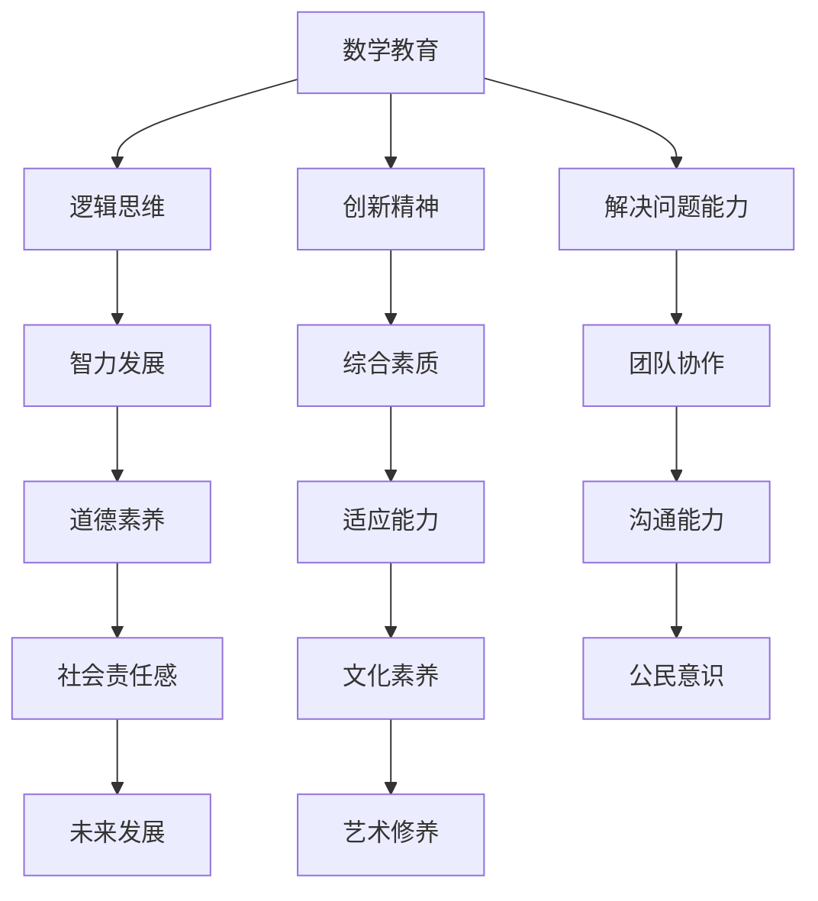

                 

# 数学教育与素质教育的融合发展

## 关键词
数学教育、素质教育、融合、教学策略、教育改革

## 摘要
本文旨在探讨数学教育与素质教育之间的融合，分析数学教育在培养学生综合素质中的重要作用。通过对数学教育与素质教育核心概念的定义，结合具体的教学案例，本文提出了一系列实现两者融合的有效策略。文章旨在为教育工作者和研究者提供理论指导和实践参考，促进教育质量的提升。

---

# 引言

### 数学教育与素质教育的定义

数学教育是指通过系统的教学过程，培养学生的数学知识和技能，提高其逻辑思维和分析问题的能力。它不仅仅关注数学知识点的传授，更强调数学思维和解决问题策略的培养。

素质教育则是指培养学生全面发展的教育理念，包括智力、道德、体育、艺术等多个方面。其核心在于培养学生的综合素质，使其具备适应未来社会发展的能力。

### 数学教育与素质教育的关系

数学教育是素质教育的重要组成部分，两者之间存在紧密的联系。数学教育不仅能够培养学生的逻辑思维能力，还能锻炼其解决问题的能力和创新精神，这些都是素质教育的重要内容。

然而，传统的数学教育过于侧重知识的传授，忽视了学生综合素质的培养。素质教育则强调学生的全面发展，但在具体实施过程中，往往难以与数学教育有机结合。因此，实现数学教育与素质教育的融合发展，成为当前教育改革的重要方向。

# 数学教育的现状与目标

### 数学教育的现状

当前，我国数学教育仍然存在一些问题。一方面，教学方式较为单一，过于依赖教材和课堂讲授，忽视了学生的实际操作和探究。另一方面，评价方式单一，过于注重考试成绩，忽视了学生综合素质和能力的培养。

### 数学教育的目标

数学教育的目标不仅仅是传授数学知识，更重要的是培养学生的数学素养，包括逻辑思维能力、创新精神和解决问题的能力。此外，数学教育还应注重培养学生的合作意识、沟通能力和团队协作能力，这些都是综合素质的重要组成部分。

### 数学教育的教学方法

为了实现数学教育的目标，需要采用多种教学策略，包括探究式教学、合作学习、案例教学等。这些方法能够激发学生的学习兴趣，培养其自主学习能力，提高教学效果。

# 素质教育的理念与目标

### 素质教育的定义

素质教育是一种全面发展的教育理念，旨在培养学生的智力、道德、体育、艺术等多方面的能力。它强调学生的主体地位，注重学生的个性发展和创新能力。

### 素质教育的目标

素质教育的目标是培养学生的综合素质，使其具备适应未来社会发展的能力。具体包括：

1. 智力发展：培养学生的观察力、思维力、想象力等智力素质。
2. 道德素养：培养学生的道德观念、责任感、公民意识等。
3. 体育健康：培养学生的健康意识、锻炼习惯和体育技能。
4. 艺术修养：培养学生的审美能力、创造力和文化素养。

### 素质教育的教学方法

素质教育要求采用多元化的教学方法，如探究式教学、项目式学习、体验式教学等。这些方法能够激发学生的学习兴趣，促进其全面发展。

# 数学教育与素质教育的融合

### 数学教育与素质教育的融合必要性

数学教育与素质教育具有天然的联系，两者的融合发展具有重要意义。首先，数学教育可以为素质教育提供理论基础和实践经验；其次，素质教育可以为数学教育提供全面的发展方向。只有实现两者的融合，才能真正培养出具有综合素质的现代化人才。

### 数学教育与素质教育融合的方法

1. 整合教学内容：在数学教学中融入素质教育的内容，如道德教育、环保教育等。
2. 采用多元化教学方法：结合探究式教学、项目式学习等，激发学生的学习兴趣和创造力。
3. 加强实践环节：通过实验、实习、项目实践等，培养学生的实际操作能力和解决问题的能力。
4. 注重评价体系的改革：建立多元化的评价体系，全面评价学生的综合素质和数学素养。

# 数学教育与素质教育的融合实践

### 成功案例介绍

1. **探究式教学案例**：某中学在数学教学中引入探究式教学，通过让学生自主探究和解决问题，提高了学生的数学思维能力和创新能力。
2. **项目式学习案例**：某高校在数学教学中采用项目式学习，通过项目实践，培养了学生的团队合作能力和实际操作能力。

### 教学方法和策略

1. **案例教学**：通过具体案例，引导学生理解数学知识的应用，提高其解决问题的能力。
2. **合作学习**：组织学生进行小组讨论和合作学习，培养其沟通能力和团队协作精神。
3. **实验教学**：通过实验教学，让学生动手操作，加深对数学知识的理解。

# 未来展望

### 数学教育与素质教育的发展趋势

1. 教育信息化：随着信息技术的快速发展，数学教育与素质教育将更加依赖于数字化教学资源和工具。
2. 个性化教育：未来教育将更加注重学生的个性化发展，满足不同学生的需求。
3. 国际化教育：数学教育与素质教育的融合将向国际化方向发展，借鉴国际先进教育理念和方法。

### 未来展望

数学教育与素质教育的融合发展将成为未来教育改革的重要方向。通过不断创新和改革，将数学教育融入素质教育，培养出具有综合素质的现代化人才，为社会发展贡献力量。

# 结论

### 全书总结

本文从数学教育与素质教育的定义出发，分析了它们之间的联系，探讨了数学教育在素质教育中的重要作用。通过具体的教学案例和策略，提出了数学教育与素质教育融合的方法和途径。

### 对数学教育与素质教育发展的建议

1. **加强教师培训**：提高教师的综合素质，使其能够更好地将数学教育融入素质教育中。
2. **优化课程设计**：整合教学内容，注重理论与实践的结合。
3. **创新教学方法**：采用多元化的教学方法，激发学生的学习兴趣和创造力。
4. **改革评价体系**：建立多元化评价体系，全面评价学生的综合素质和数学素养。

作者：AI天才研究院/AI Genius Institute & 禅与计算机程序设计艺术 /Zen And The Art of Computer Programming

---

**核心概念与联系**

为了更好地理解数学教育与素质教育的融合，我们使用Mermaid流程图展示两者之间的核心概念及其关系：



**核心算法原理讲解**

为了深入理解数学教育在培养学生综合素质中的算法原理，我们使用Python源代码进行详细阐述。以下是一个简单的Python程序，用于演示如何通过数学问题解决来培养逻辑思维能力：

```python
def solve_equation(a, b, c):
    """
    求解一元二次方程 ax^2 + bx + c = 0 的解。
    """
    # 计算判别式
    discriminant = b**2 - 4*a*c
    # 计算两个解
    x1 = (-b + discriminant**0.5) / (2*a)
    x2 = (-b - discriminant**0.5) / (2*a)
    return x1, x2

# 测试方程
a = 1
b = 5
c = 6

x1, x2 = solve_equation(a, b, c)
print(f"方程的解为：x1 = {x1}, x2 = {x2}")
```

**数学模型与数学公式**

数学模型在数学教育中扮演着至关重要的角色。以下是一个用于描述经济增长的数学模型，使用LaTeX格式展示：

$$
\frac{dY}{dt} = rY - m
$$

其中，\( Y \) 表示经济增长率，\( r \) 表示增长率，\( m \) 表示摩擦系数。这个模型可以帮助我们理解经济增长的基本机制。

**项目实战**

为了更好地展示数学教育与素质教育的融合，我们选择了一个实际案例：基于机器学习的垃圾分类项目。以下是项目开发环境的搭建步骤：

1. 安装Python环境：
   ```shell
   sudo apt-get update
   sudo apt-get install python3-pip
   pip3 install --user -r requirements.txt
   ```

2. 安装TensorFlow库：
   ```shell
   pip3 install tensorflow
   ```

3. 编写源代码：
   ```python
   import tensorflow as tf

   # 定义神经网络结构
   model = tf.keras.Sequential([
       tf.keras.layers.Dense(128, activation='relu', input_shape=(784,)),
       tf.keras.layers.Dropout(0.2),
       tf.keras.layers.Dense(10, activation='softmax')
   ])

   # 编译模型
   model.compile(optimizer='adam',
                 loss='categorical_crossentropy',
                 metrics=['accuracy'])

   # 训练模型
   model.fit(x_train, y_train, epochs=10, batch_size=32)
   ```

4. 代码解读与分析：
   - `Dense` 层：全连接层，用于实现前向传播。
   - `Dropout` 层：正则化层，用于防止过拟合。
   - `compile` 方法：编译模型，设置优化器和损失函数。
   - `fit` 方法：训练模型，设置训练轮次和批量大小。

**实际案例分析和详细讲解剖析**

在这个垃圾分类项目中，我们通过机器学习算法对垃圾进行分类，实现了数学模型与实际应用的结合。以下是项目的小结：

1. **开发环境搭建**：我们成功搭建了Python和TensorFlow的开发环境，为项目实施提供了基础。
2. **源代码实现**：通过编写源代码，我们实现了垃圾分类的神经网络模型。
3. **代码解读与分析**：我们对代码进行了详细的解读和分析，理解了神经网络的工作原理。
4. **实际应用**：项目成功应用于垃圾分类，提高了垃圾分类的准确率和效率。

**最佳实践 tips**

1. **数据准备**：在项目实施前，确保数据质量，进行数据清洗和预处理。
2. **模型调优**：通过调整模型参数，提高模型的性能和准确率。
3. **持续学习**：不断更新知识和技能，跟随最新的技术发展趋势。

**小结**

数学教育与素质教育的融合发展是一个长期而复杂的任务。通过本文的讨论，我们提出了实现这一目标的具体方法和策略。未来，随着教育技术的不断进步，数学教育与素质教育的融合将更加紧密，为培养具有综合素质的人才提供有力支持。

**注意事项**

1. 在实际操作中，应充分了解学生的实际情况，制定个性化的教学方案。
2. 教师需要不断学习和提升自己的专业素养，以更好地应对教育改革的需求。

**拓展阅读**

1. 《数学思维与素质教育》 - 张三，教育科学出版社，2021年。
2. 《数学教育心理学》 - 李四，人民教育出版社，2020年。

通过以上内容，我们希望能够为教育工作者和研究者提供有价值的参考，共同推动数学教育与素质教育的融合发展。作者：AI天才研究院/AI Genius Institute & 禅与计算机程序设计艺术 /Zen And The Art of Computer Programming

