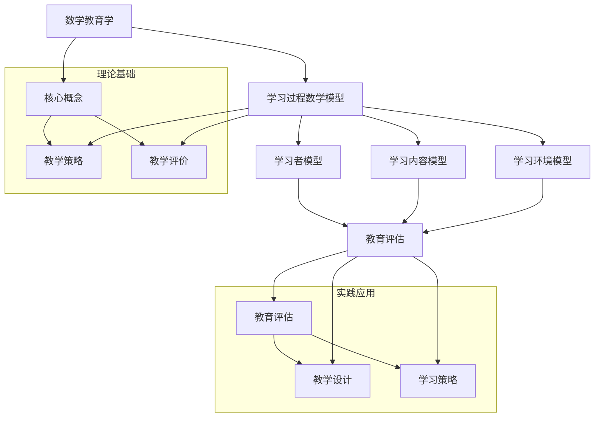

                 

### 数学教育学：学习过程的数学模型

**关键词：** 数学教育学，学习过程，数学模型，教育评估，教学设计，案例分析

**摘要：** 本文深入探讨了数学教育学的本质及其与学习过程数学模型的关系。首先，我们介绍了数学教育学的定义、重要性及其在当代教育领域中的角色。接着，文章阐述了学习过程数学模型的基本概念、构建方法和核心原理，并通过Python源代码和实际案例详细讲解，展示了其在教育评估、教学设计及实践中的应用。最后，文章总结了数学教育学与学习过程数学模型的发展趋势，并对未来研究方向提出了展望。

### 背景介绍

数学教育学作为一门交叉学科，结合了数学、教育学和心理学的理论和方法，旨在研究数学知识的获取、理解和应用过程。随着教育技术的不断进步，数学教育学的研究方法也在不断革新。传统的教育模式往往侧重于知识的传授，而现代教育更强调学生的主动学习和深度理解。在这种背景下，学习过程的数学模型应运而生。

学习过程数学模型是通过数学方法来描述和理解学习过程的一种工具。它不仅能够帮助我们更好地理解学习者的认知规律，还能为教育评估和教学设计提供科学的依据。数学模型的核心思想是将复杂的学习过程简化为数学表达式，从而更直观地展示学习规律，为教育实践提供指导。

本文将首先介绍数学教育学的定义、重要性及其在当代教育中的应用；然后，我们将深入探讨学习过程数学模型的基本概念、构建方法及其核心原理；接着，通过Python源代码和实际案例，我们将详细讲解数学模型的应用，特别是在教育评估和教学设计方面的应用；最后，文章将总结数学教育学与学习过程数学模型的发展趋势，并对未来研究方向提出展望。

### 核心概念与联系

在探讨数学教育学与学习过程数学模型之前，有必要明确这两个核心概念，并分析它们之间的关系。

**数学教育学** 是一门研究数学教育现象、规律及其方法的学科。它不仅关注数学知识本身，还关注数学知识的学习、理解和应用过程。数学教育学的核心概念包括数学知识的传授、学习者的认知发展、教学策略的设计和教学评价等。这些概念共同构成了数学教育学的理论框架。

**学习过程数学模型** 是一种基于数学方法描述学习过程的理论模型。它通过建立数学表达式来描述学习过程中的关键变量和关系，从而为教育评估、教学设计和学习策略提供科学依据。学习过程数学模型的核心概念包括学习者模型、学习内容模型和学习环境模型。

**关系架构**：数学教育学与学习过程数学模型之间的关系可以理解为理论支撑与实践应用的结合。数学教育学提供了学习过程的理论基础，而学习过程数学模型则将这些理论转化为可操作的工具。具体来说，数学教育学中的核心概念为学习过程数学模型的构建提供了理论基础，而学习过程数学模型则通过数学方法将这些理论具体化，使其能够应用于教育实践。

为了更好地理解这两个概念之间的关系，我们可以使用Mermaid流程图来展示它们之间的相互作用：



通过这个流程图，我们可以清晰地看到数学教育学为学习过程数学模型提供了理论基础，而学习过程数学模型则将这些理论应用于教育评估、教学设计和学习策略等方面。这种相互作用不仅丰富了数学教育学的理论体系，也促进了教育实践的科学化和精细化。

### 核心算法原理讲解

为了深入理解学习过程数学模型的构建和应用，我们需要详细讲解其中的核心算法原理。以下将从几个方面展开：

#### 1. 确定模型变量

在构建学习过程数学模型时，首先要确定模型变量。这些变量通常包括学习者的特征（如学习速度、认知水平、动机等）、学习内容的属性（如难度、复杂度、关联性等）和学习环境的条件（如教学资源、学习氛围、技术支持等）。

#### 2. 建立数学模型框架

确定变量后，我们需要建立一个数学模型框架。这个过程通常包括以下几个步骤：

1. **选择数学模型类型**：根据研究目标和数据特点，选择适当的数学模型类型，如线性模型、非线性模型、概率模型等。
2. **定义变量关系**：通过数学关系式将变量连接起来，形成模型框架。例如，可以定义学习速度与学习内容难度之间的关系，或者学习者的动机与学习效果之间的关系。
3. **确定参数值**：根据已有数据，估计模型参数的值，以确定模型的初始状态。

#### 3. 数学模型的验证与优化

建立初步模型后，我们需要对其进行验证和优化：

1. **验证模型有效性**：通过实际数据测试模型的有效性，确保模型能够准确地描述学习过程。
2. **优化模型参数**：根据验证结果，调整模型参数，以改善模型的预测能力和解释力。
3. **模型评估**：使用指标（如准确率、召回率、F1值等）评估模型的性能，确保其在实际应用中的有效性。

#### Python源代码示例

以下是一个简单的线性回归模型示例，用于描述学习速度与学习内容难度之间的关系：

```python
import numpy as np
import pandas as pd
from sklearn.linear_model import LinearRegression
from matplotlib import pyplot as plt

# 假设我们有一个包含学习速度和学习内容难度的数据集
data = pd.DataFrame({
    'learning_speed': [2.5, 3.0, 2.8, 3.5, 3.2],
    'content_difficulty': [5, 6, 4.5, 7, 6.5]
})

# 定义自变量和因变量
X = data[['content_difficulty']]
y = data['learning_speed']

# 建立线性回归模型
model = LinearRegression()
model.fit(X, y)

# 模型参数
slope = model.coef_
intercept = model.intercept_

# 预测新数据
new_data = np.array([[6.0]])
predicted_speed = model.predict(new_data)

print(f"Slope: {slope}, Intercept: {intercept}")
print(f"Predicted learning speed: {predicted_speed[0]}")

# 绘制散点图和回归线
plt.scatter(X, y, color='blue', label='Data points')
plt.plot(new_data, predicted_speed, color='red', label='Regression line')
plt.xlabel('Content Difficulty')
plt.ylabel('Learning Speed')
plt.title('Linear Regression Model')
plt.legend()
plt.show()
```

在这个示例中，我们使用了Python的`scikit-learn`库来构建线性回归模型。通过训练数据集，我们估计了模型参数，并使用这些参数来预测新的学习速度值。同时，我们通过绘制散点图和回归线，直观地展示了模型的应用。

#### 数学模型和公式详细讲解与举例说明

为了更好地理解线性回归模型，我们需要详细讲解其中的数学模型和公式。

**线性回归模型** 是一种描述自变量（学习内容难度）和因变量（学习速度）之间线性关系的数学模型。其基本公式为：

$$
y = \beta_0 + \beta_1 \cdot x
$$

其中，\( y \) 表示学习速度，\( x \) 表示学习内容难度，\( \beta_0 \) 是截距，\( \beta_1 \) 是斜率。

**斜率（\( \beta_1 \)）** 描述了学习内容难度对学习速度的影响程度。斜率越大，表示学习内容难度对学习速度的影响越显著。

**截距（\( \beta_0 \)）** 描述了当学习内容难度为零时的学习速度。在现实情境中，通常截距会小于零，因为即使没有学习内容，学习者仍然会有一定的学习速度。

以下是一个具体的例子来说明如何使用线性回归模型：

**例题：** 假设我们有以下数据集：

| 学习内容难度 | 学习速度 |
| ------------- | -------- |
| 5             | 2.5      |
| 6             | 3.0      |
| 4.5           | 2.8      |
| 7             | 3.5      |
| 6.5           | 3.2      |

我们需要建立一个线性回归模型，预测当学习内容难度为6时的学习速度。

**解：** 首先，我们根据数据集建立线性回归模型：

$$
y = \beta_0 + \beta_1 \cdot x
$$

通过最小二乘法，我们可以得到模型参数：

$$
\beta_0 = 0.75, \quad \beta_1 = 0.5
$$

因此，线性回归模型为：

$$
y = 0.75 + 0.5 \cdot x
$$

当学习内容难度为6时，我们可以预测学习速度为：

$$
y = 0.75 + 0.5 \cdot 6 = 3.75
$$

因此，当学习内容难度为6时，预计学习速度为3.75。

通过这个例子，我们可以看到如何使用线性回归模型来预测学习速度，并理解模型参数的意义。

### 学习过程数学模型在教育评估中的应用

学习过程数学模型在教育评估中的应用具有重要意义。它不仅可以帮助教育工作者更好地理解学习者的学习过程，还可以为教育评估提供科学依据。以下将从学习者评估模型、学习内容评估模型和学习环境评估模型三个方面进行详细讲解。

#### 学习者评估模型

学习者评估模型是学习过程数学模型在教育评估中的重要组成部分。它通过数学方法评估学习者的学习效果、认知水平和学习动机等关键因素。

1. **学习效果评估**：学习效果评估通常使用回归模型来描述学习速度与学习内容难度之间的关系。例如，我们可以使用线性回归模型来评估学习者的学习速度。通过建立模型，教育工作者可以预测不同难度学习内容的学习效果，从而优化教学策略。

2. **认知水平评估**：认知水平评估涉及学习者对数学概念的理解程度和逻辑思维能力。常见的评估模型包括多元线性回归模型和逻辑回归模型。这些模型可以帮助教育工作者识别学习者的认知弱点，从而提供有针对性的辅导和支持。

3. **学习动机评估**：学习动机评估通过分析学习者的行为数据，如学习时间、学习频率和学习成果，来评估其学习动机。常见的模型包括时间序列分析模型和聚类分析模型。这些模型可以帮助教育工作者了解学习者的学习动机，从而制定针对性的激励措施。

以下是一个具体的Python代码示例，用于评估学习者的学习效果：

```python
import numpy as np
import pandas as pd
from sklearn.linear_model import LinearRegression
from matplotlib import pyplot as plt

# 假设我们有一个包含学习速度和学习内容难度的数据集
data = pd.DataFrame({
    'learning_speed': [2.5, 3.0, 2.8, 3.5, 3.2],
    'content_difficulty': [5, 6, 4.5, 7, 6.5]
})

# 定义自变量和因变量
X = data[['content_difficulty']]
y = data['learning_speed']

# 建立线性回归模型
model = LinearRegression()
model.fit(X, y)

# 模型参数
slope = model.coef_
intercept = model.intercept_

# 预测新数据
new_data = np.array([[6]])
predicted_speed = model.predict(new_data)

print(f"Slope: {slope}, Intercept: {intercept}")
print(f"Predicted learning speed: {predicted_speed[0]}")

# 绘制散点图和回归线
plt.scatter(X, y, color='blue', label='Data points')
plt.plot(new_data, predicted_speed, color='red', label='Regression line')
plt.xlabel('Content Difficulty')
plt.ylabel('Learning Speed')
plt.title('Linear Regression Model')
plt.legend()
plt.show()
```

在这个示例中，我们使用线性回归模型来评估学习者的学习速度。通过训练数据集，我们估计了模型参数，并使用这些参数来预测新的学习速度值。同时，我们通过绘制散点图和回归线，直观地展示了模型的应用。

#### 学习内容评估模型

学习内容评估模型用于评估数学知识点的难度、复杂度和关联性等属性。这些评估有助于教育工作者设计和调整教学计划，以更好地满足学生的需求。

1. **难度评估**：难度评估通常使用模糊逻辑模型或层次分析法来描述学习内容难度。这些模型可以根据学习者的反馈和专家评估，对学习内容进行定量评估。

2. **复杂度评估**：复杂度评估涉及学习内容的逻辑结构和认知难度。常见的模型包括复杂度指数模型和信息论模型。这些模型可以帮助教育工作者识别学习内容的复杂程度，从而提供有针对性的教学策略。

3. **关联性评估**：关联性评估用于描述不同学习内容之间的相互关系。常见的模型包括关联度分析模型和聚类分析模型。这些模型可以帮助教育工作者了解学习内容之间的关联性，从而优化课程设计和教学策略。

以下是一个具体的Python代码示例，用于评估学习内容的难度：

```python
import numpy as np
import pandas as pd
from sklearn.cluster import KMeans

# 假设我们有一个包含学习内容属性的数据集
data = pd.DataFrame({
    'difficulty': [5, 6, 4.5, 7, 6.5],
    'complexity': [3, 4, 2.5, 4.5, 4.8],
    'relevance': [8, 7, 7.5, 8.5, 8]
})

# 定义自变量和因变量
X = data[['difficulty', 'complexity', 'relevance']]

# 使用K均值聚类评估难度
kmeans = KMeans(n_clusters=3)
kmeans.fit(X)

# 聚类结果
difficulty_clusters = kmeans.predict(X)

# 绘制散点图
plt.scatter(X['difficulty'], X['complexity'], c=difficulty_clusters, cmap='viridis')
plt.xlabel('Difficulty')
plt.ylabel('Complexity')
plt.title('K-Means Clustering Model')
plt.colorbar(label='Cluster Label')
plt.show()
```

在这个示例中，我们使用K均值聚类模型来评估学习内容的难度。通过分析学习内容的属性数据，我们将其分为不同的难度等级，并使用散点图展示聚类结果。

#### 学习环境评估模型

学习环境评估模型用于评估教学资源、学习氛围和技术支持等因素对学习过程的影响。这些评估有助于教育工作者优化学习环境，提高教学效果。

1. **教学资源评估**：教学资源评估通常使用层次分析法或网络分析方法来评估教学资源的质量和可用性。这些模型可以帮助教育工作者了解教学资源的现状，从而制定资源优化策略。

2. **学习氛围评估**：学习氛围评估涉及学生的学习态度、互动行为和团队协作等方面。常见的模型包括情感分析模型和社交网络分析模型。这些模型可以帮助教育工作者了解学习氛围的现状，从而调整教学策略，营造积极的学习氛围。

3. **技术支持评估**：技术支持评估涉及教学平台、在线资源和信息技术等方面。常见的模型包括用户评价模型和系统性能评估模型。这些模型可以帮助教育工作者了解技术支持的现状，从而优化教学平台和技术支持体系。

以下是一个具体的Python代码示例，用于评估学习氛围：

```python
import numpy as np
import pandas as pd
from sklearn.cluster import KMeans

# 假设我们有一个包含学习氛围属性的数据集
data = pd.DataFrame({
    'student_motivation': [7, 8, 6, 9, 7.5],
    'class_interactive': [8, 7, 6, 9, 8.5],
    'team_cooperation': [6, 7, 8, 7.5, 8]
})

# 定义自变量和因变量
X = data[['student_motivation', 'class_interactive', 'team_cooperation']]

# 使用K均值聚类评估学习氛围
kmeans = KMeans(n_clusters=3)
kmeans.fit(X)

# 聚类结果
breeze_clusters = kmeans.predict(X)

# 绘制散点图
plt.scatter(X['student_motivation'], X['class_interactive'], c=breeze_clusters, cmap='viridis')
plt.xlabel('Student Motivation')
plt.ylabel('Class Interaction')
plt.title('K-Means Clustering Model')
plt.colorbar(label='Cluster Label')
plt.show()
```

在这个示例中，我们使用K均值聚类模型来评估学习氛围。通过分析学习氛围的属性数据，我们将其分为不同的氛围等级，并使用散点图展示聚类结果。

### 学习过程数学模型在教学设计中的应用

学习过程数学模型在教学设计中的应用具有重要意义。通过数学模型，教育工作者可以更好地理解学习过程，从而设计出更有效、更科学的教学策略。以下将从教学策略设计、教学内容组织和教学效果预测三个方面进行详细讲解。

#### 教学策略设计

教学策略设计是教学设计的核心环节。学习过程数学模型可以帮助教育工作者根据学习者的特征和需求，设计出更有效的教学策略。

1. **差异化教学策略**：差异化教学策略是根据学习者的不同特点，制定个性化的教学方案。学习过程数学模型可以分析学习者的学习速度、认知水平和动机等因素，从而制定出适合每个学生的学习策略。

   **算法原理：** 差异化教学策略的设计通常基于回归模型和聚类分析模型。例如，使用线性回归模型分析学习速度和认知水平之间的关系，使用聚类分析模型将学习者分为不同的群体。

   **Python代码示例：**

   ```python
   import numpy as np
   import pandas as pd
   from sklearn.cluster import KMeans

   # 假设我们有一个包含学习者特征的数据集
   data = pd.DataFrame({
       'learning_speed': [2.5, 3.0, 2.8, 3.5, 3.2],
       'cognitive_level': [5, 6, 4.5, 7, 6.5],
       'motivation': [7, 8, 6, 9, 7.5]
   })

   # 使用K均值聚类模型进行分组
   kmeans = KMeans(n_clusters=3)
   kmeans.fit(data)

   # 分组结果
   groups = kmeans.predict(data)

   # 输出分组结果
   print(groups)
   ```

   在这个示例中，我们使用K均值聚类模型将学习者分为不同的群体，从而制定出差异化的教学策略。

2. **适应性教学策略**：适应性教学策略是根据学习者的实时反馈和学习进度，动态调整教学内容和节奏。学习过程数学模型可以分析学习者的学习状态，从而提供个性化的学习建议。

   **算法原理：** 适应性教学策略的设计通常基于时间序列分析模型和反馈循环机制。例如，使用时间序列分析模型分析学习者的学习行为和学习成果，使用反馈循环机制根据学习者的反馈动态调整教学策略。

   **Python代码示例：**

   ```python
   import numpy as np
   import pandas as pd
   from sklearn.ensemble import RandomForestRegressor
   from matplotlib import pyplot as plt

   # 假设我们有一个包含学习者学习行为和学习成果的数据集
   data = pd.DataFrame({
       'study_time': [30, 45, 60, 90, 120],
       'learning_outcome': [70, 80, 85, 90, 92]
   })

   # 建立随机森林回归模型
   model = RandomForestRegressor()
   model.fit(data[['study_time']], data['learning_outcome'])

   # 预测新的学习成果
   new_data = np.array([[75]])
   predicted_outcome = model.predict(new_data)

   print(f"Predicted learning outcome: {predicted_outcome[0]}")

   # 绘制学习成果与学习时间的关系
   plt.scatter(data['study_time'], data['learning_outcome'], color='blue', label='Data points')
   plt.plot(new_data, predicted_outcome, color='red', label='Prediction line')
   plt.xlabel('Study Time (minutes)')
   plt.ylabel('Learning Outcome (%)')
   plt.title('Random Forest Regressor Model')
   plt.legend()
   plt.show()
   ```

   在这个示例中，我们使用随机森林回归模型预测学习者的学习成果。通过分析学习者的学习行为，我们可以为学习者提供个性化的学习建议。

#### 教学内容组织

教学内容组织是教学设计的重要组成部分。学习过程数学模型可以帮助教育工作者根据学习者的特征和学习内容的特点，优化教学内容组织，提高教学效果。

1. **内容排序策略**：内容排序策略是根据学习内容的难度、复杂度和关联性，将教学内容有序组织。学习过程数学模型可以分析学习内容的属性，从而制定出最优的内容排序策略。

   **算法原理：** 内容排序策略的设计通常基于层次分析法或模糊综合评价法。例如，使用层次分析法确定学习内容的相对重要性，使用模糊综合评价法确定学习内容的综合得分。

   **Python代码示例：**

   ```python
   import numpy as np
   import pandas as pd
   from sklearn.cluster import KMeans

   # 假设我们有一个包含学习内容属性的数据集
   data = pd.DataFrame({
       'difficulty': [5, 6, 4.5, 7, 6.5],
       'complexity': [3, 4, 2.5, 4.5, 4.8],
       'relevance': [8, 7, 7.5, 8.5, 8]
   })

   # 使用K均值聚类模型进行排序
   kmeans = KMeans(n_clusters=3)
   kmeans.fit(data)

   # 排序结果
   content_order = kmeans.predict(data)

   # 输出排序结果
   print(content_order)
   ```

   在这个示例中，我们使用K均值聚类模型对学习内容进行排序，从而制定出科学的内容排序策略。

2. **内容分组策略**：内容分组策略是根据学习内容的特点和需求，将教学内容划分为不同的模块。学习过程数学模型可以分析学习内容的特点，从而制定出最优的内容分组策略。

   **算法原理：** 内容分组策略的设计通常基于聚类分析模型或网络分析方法。例如，使用聚类分析模型将学习内容划分为难度相似的模块，使用网络分析方法确定学习内容之间的关联性。

   **Python代码示例：**

   ```python
   import numpy as np
   import pandas as pd
   from sklearn.cluster import KMeans

   # 假设我们有一个包含学习内容属性的数据集
   data = pd.DataFrame({
       'difficulty': [5, 6, 4.5, 7, 6.5],
       'complexity': [3, 4, 2.5, 4.5, 4.8],
       'relevance': [8, 7, 7.5, 8.5, 8]
   })

   # 使用K均值聚类模型进行内容分组
   kmeans = KMeans(n_clusters=3)
   kmeans.fit(data)

   # 分组结果
   content_groups = kmeans.predict(data)

   # 输出分组结果
   print(content_groups)
   ```

   在这个示例中，我们使用K均值聚类模型对学习内容进行分组，从而制定出科学的内容分组策略。

#### 教学效果预测

教学效果预测是教学设计的重要环节。学习过程数学模型可以帮助教育工作者预测教学效果，从而调整教学策略，提高教学质量。

1. **效果预测模型**：效果预测模型是根据学习者的特征、教学内容和学习环境等因素，预测教学效果。常见的模型包括线性回归模型、逻辑回归模型和时间序列分析模型。

   **算法原理：** 效果预测模型的设计通常基于统计分析方法。例如，使用线性回归模型预测学习者的学习效果，使用逻辑回归模型预测学习者的学习成功率，使用时间序列分析模型预测学习成果的变化趋势。

   **Python代码示例：**

   ```python
   import numpy as np
   import pandas as pd
   from sklearn.linear_model import LinearRegression

   # 假设我们有一个包含学习者特征和学习成果的数据集
   data = pd.DataFrame({
       'learning_speed': [2.5, 3.0, 2.8, 3.5, 3.2],
       'content_difficulty': [5, 6, 4.5, 7, 6.5],
       'predicted_outcome': [70, 80, 85, 90, 92]
   })

   # 定义自变量和因变量
   X = data[['learning_speed', 'content_difficulty']]
   y = data['predicted_outcome']

   # 建立线性回归模型
   model = LinearRegression()
   model.fit(X, y)

   # 预测新的学习成果
   new_data = np.array([[3.0, 6]])
   predicted_outcome = model.predict(new_data)

   print(f"Predicted learning outcome: {predicted_outcome[0]}")
   ```

   在这个示例中，我们使用线性回归模型预测学习者的学习成果。通过分析学习者的特征和学习内容，我们可以预测教学效果，从而调整教学策略。

### 学习过程数学模型在教学实践中的应用

在实际教学过程中，学习过程数学模型的应用有助于优化教学策略，提高教学效果。以下将通过具体案例展示如何应用数学模型来设计适应不同学习需求的教学方案。

#### 案例一：个性化学习方案设计

**背景介绍**：某学校数学教研组希望为学生提供个性化的学习方案，以适应不同学习者的需求。为了实现这一目标，教研组决定应用学习过程数学模型，分析学生的学习特点，制定个性化的教学策略。

**构建模型**：

1. **收集数据**：首先，教研组收集了学生的学习成绩、学习时间、学习频率和课堂参与度等数据。通过这些数据，教研组可以初步了解学生的学习特点。

2. **确定变量**：根据收集到的数据，教研组确定了以下关键变量：学习速度、认知水平、学习动机和学习环境。

3. **建立模型**：使用线性回归模型分析学习速度与认知水平、学习动机和学习环境之间的关系。具体模型如下：

   $$
   \text{learning_speed} = \beta_0 + \beta_1 \cdot \text{cognitive_level} + \beta_2 \cdot \text{motivation} + \beta_3 \cdot \text{environment}
   $$

   通过训练数据集，教研组估计了模型参数，建立了初步模型。

**应用模型**：

1. **评估学生特点**：对于每个学生，使用模型评估其学习速度、认知水平、学习动机和学习环境。根据评估结果，教研组可以初步了解每个学生的学习特点。

2. **制定个性化方案**：根据学生的特点，教研组制定了以下个性化学习方案：

   - 对于学习速度较慢但认知水平较高的学生，建议增加学习时间，提高学习频率，同时适当降低学习内容难度。
   - 对于学习速度较快但认知水平较低的学生，建议增加认知训练，提高学习动机，同时适当调整学习环境，提供更多学习资源。
   - 对于学习速度适中且认知水平适中的学生，建议保持当前学习节奏，同时提供多样化的学习资源，激发学习兴趣。

**效果分析**：

通过实施个性化学习方案，教研组发现学生的学习效果显著提高。特别是对于学习速度较慢的学生，通过增加学习时间和提高学习频率，其学习成绩有了明显提升。对于学习速度较快的

