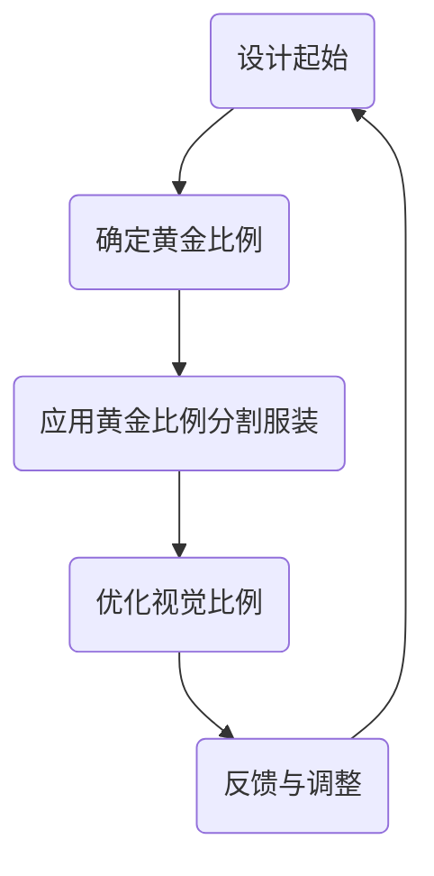

                 

# 数学时尚：服装设计的数学比例

## 关键词
- 数学时尚
- 服装设计
- 黄金比例
- 斐波那契序列
- 数学模型
- 数学术语

## 摘要
随着科技的进步和人们对美学需求的提升，数学在时尚领域的应用越来越广泛。本文将探讨数学比例在服装设计中的重要性，通过深入解析黄金比例和斐波那契序列等核心概念，结合具体的设计案例，阐述数学在提升服装设计美学和实用性方面的作用。本文旨在为时尚设计师提供实用的数学工具和设计理念，推动数学与时尚的完美融合。

## 引言：数学时尚的兴起与意义

### 数学时尚的概念

数学时尚（Mathematics in Fashion）是指将数学原理应用于时尚设计中的一个新兴领域。它不仅涵盖了传统的几何学和比例理论，还包括了现代数学中的复杂算法和模型。数学时尚的核心在于通过数学方法来优化设计，提高服装的审美价值和穿着舒适性。

### 数学比例在服装设计中的重要性

数学比例是服装设计中不可或缺的元素。它们不仅决定了服装的外观，还影响了人体工学和舒适度。以下是一些关键的数学比例：

- **黄金比例**：黄金比例（Golden Ratio）大约为1:1.618，它被认为是最美的比例。在服装设计中，黄金比例常常被用于分割服装的长度、宽度和细节设计，以达到和谐和平衡的效果。
- **斐波那契序列**：斐波那契序列（Fibonacci Sequence）是一种以1和1开始，每个数都是前两个数之和的序列。这个序列在自然界中广泛存在，也被应用于服装设计中的图案、线条和结构设计中。

### 本书的目的与结构

本书旨在为时尚设计师提供一套基于数学原理的设计工具和方法。结构如下：

1. **引言**：介绍数学时尚的概念和重要性。
2. **核心概念与联系**：讲解黄金比例和斐波那契序列等数学概念，并展示其在服装设计中的应用。
3. **核心算法原理讲解**：深入探讨黄金比例和斐波那契序列的数学原理，并提供计算方法和应用实例。
4. **数学模型和数学公式**：介绍在服装设计中的数学模型，并使用具体的公式进行解释。
5. **项目实战**：通过案例研究展示数学比例在具体设计项目中的应用。
6. **未来展望**：讨论数学时尚的发展趋势和挑战。
7. **结语**：总结数学与时尚的融合，展望未来。

## 第一部分：核心概念与联系

### 第1章：数学与时尚的联系

#### 1.1 时尚界的数学基因

时尚与数学的关联可以追溯到古代文明。古希腊和古罗马的艺术家们就认识到了数学比例在美学中的重要性。例如，帕台农神庙的比例就体现了黄金比例的应用。

#### 1.2 数学比例的基本概念

数学比例是两个量的比较关系，通常表示为分数或比率。常见的数学比例包括：

- **黄金比例**：大约为1:1.618，它在自然界和艺术作品中广泛存在。
- **斐波那契序列**：1, 1, 2, 3, 5, 8, 13, ... 这个序列中的每一个数都是前两个数之和。

#### 1.3 数学的视觉效应

数学比例可以影响视觉效果，使服装看起来更加和谐和平衡。例如，黄金比例可以创造出视觉上的延伸和压缩效果，使设计显得更加优雅。

#### 1.4 Mermaid流程图：数学比例在服装设计中的应用



通过这个流程图，我们可以看到数学比例在服装设计中的应用是一个循环过程，设计师需要不断调整和优化以达到最佳效果。

### 第2章：黄金比例在服装设计中的应用

黄金比例（Golden Ratio），通常表示为φ（phi），大约为1:1.618。它在自然界和艺术作品中广泛存在，被认为是美学上的最佳比例。在服装设计中，黄金比例被广泛应用于分割服装的长度、宽度和细节设计。

#### 2.1 黄金比例的定义与性质

黄金比例可以通过以下公式定义：

$$
\phi = \frac{1 + \sqrt{5}}{2} \approx 1.618
$$

黄金比例具有以下性质：

- **自相似性**：将一个黄金比例分割，较小的部分与整体的比仍然是黄金比例。
- **对称性**：黄金比例在空间中的排列具有高度对称性，给人以和谐的美感。

#### 2.2 黄金比例的数学公式与计算方法

黄金比例的计算方法如下：

1. **分数法**：
   $$
   \phi = \frac{a+b}{a} = \frac{1.618 + 1}{1.618} \approx 1.618
   $$
   
2. **迭代法**：
   $$
   \phi = \frac{1}{1} + \frac{1}{\phi}
   $$

#### 2.3 黄金比例在服装设计中的运用

在服装设计中，黄金比例可以用于以下方面：

- **分割衣长**：将衣长按黄金比例分割，可以使服装显得更加优雅。
- **设计领口和袖口**：黄金比例的领口和袖口设计可以创造出视觉上的和谐感。
- **细节装饰**：如纽扣、拉链等细节设计，也可以使用黄金比例来提高美观度。

#### 2.4 伪代码：计算黄金比例的应用示例

```python
def calculate_golden_ratio():
    phi = (1 + 5**0.5) / 2
    return phi

golden_ratio = calculate_golden_ratio()
print(f"The golden ratio is approximately: {golden_ratio}")
```

通过上述伪代码，我们可以计算出黄金比例的近似值。

### 第3章：斐波那契序列与服装设计

斐波那契序列（Fibonacci Sequence）是一个以1和1开始，每个数都是前两个数之和的序列。斐波那契序列在自然界和艺术中都有广泛的应用，也在服装设计中发挥着重要作用。

#### 3.1 斐波那契序列的基本原理

斐波那契序列的定义如下：

$$
F(0) = 1, F(1) = 1, F(n) = F(n-1) + F(n-2) \text{ for } n \geq 2
$$

序列的前几项为：1, 1, 2, 3, 5, 8, 13, 21, ...

斐波那契序列具有以下特点：

- **递推关系**：每个数都是前两个数之和。
- **黄金比例的逼近**：随着序列的扩展，相邻两个数的比值逐渐逼近黄金比例。

#### 3.2 斐波那契序列在服装设计中的运用

斐波那契序列在服装设计中的应用非常广泛，以下是一些具体的应用实例：

- **图案设计**：使用斐波那契序列可以创造出和谐且富有层次感的图案。
- **线条布局**：斐波那契序列可以用于设计服装中的线条布局，使服装看起来更加优雅。
- **结构设计**：如裙摆的设计，可以根据斐波那契序列来规划折叠和褶皱。

#### 3.3 数学公式：斐波那契序列的应用实例

斐波那契序列的数学公式如下：

$$
F(n) = \frac{1}{\sqrt{5}} \left( \left(\frac{1 + \sqrt{5}}{2}\right)^n - \left(\frac{1 - \sqrt{5}}{2}\right)^n \right)
$$

使用这个公式，我们可以计算出斐波那契序列中任意一项的值。

#### 3.4 伪代码：利用斐波那契序列进行服装设计

```python
def calculate_fibonacci(n):
    sqrt_5 = 5**0.5
    phi = (1 + sqrt_5) / 2
    psi = (1 - sqrt_5) / 2
    fibonacci_number = (phi**n - psi**n) / sqrt_5
    return fibonacci_number

# 示例：计算第10项斐波那契数
fibonacci_10 = calculate_fibonacci(10)
print(f"The 10th Fibonacci number is: {fibonacci_10}")
```

通过上述伪代码，我们可以利用斐波那契序列来设计服装的某些元素。

### 第三部分：数学模型和数学公式

在服装设计中，数学模型和数学公式是不可或缺的工具。它们帮助设计师准确地计算和设计服装的比例、形状和结构，从而实现理想的美学效果。

#### 第4章：服装设计中的数学模型

#### 4.1 三角形的数学原理

三角形是服装设计中常见的基本形状。其数学原理包括：

- **三角形的内角和**：任意三角形的内角和为180度。
- **三角形的高**：三角形的高可以帮助设计师计算服装的垂直长度。
- **三角形的面积**：三角形面积的计算公式为：$$\text{面积} = \frac{1}{2} \times \text{底} \times \text{高}$$

#### 4.2 四边形的数学原理

四边形也是服装设计中的重要形状。其数学原理包括：

- **四边形的对角线**：对角线可以分割四边形，形成两个三角形。
- **四边形的内角和**：任意四边形的内角和为360度。
- **四边形的面积**：四边形的面积可以通过分割为三角形来计算。

#### 4.3 人体几何学基础

人体几何学是服装设计中非常重要的基础。它涉及：

- **人体的比例**：人体比例可以帮助设计师准确地定位服装的各个部分。
- **人体的曲线**：曲线的数学描述，如椭圆、双曲线等，可以帮助设计师设计出符合人体曲线的服装。

#### 4.4 数学公式与举例说明：服装设计中的几何模型应用

以下是一个具体的例子：

假设设计师想要设计一件连衣裙，要求裙摆的形状为一个椭圆。椭圆的长半轴为20cm，短半轴为10cm。

- **椭圆的面积**：
  $$
  \text{面积} = \pi \times \text{长半轴} \times \text{短半轴} = \pi \times 20 \times 10 \approx 628 \text{ cm}^2
  $$

- **椭圆的周长**：
  $$
  \text{周长} = 2\pi \times \text{长半轴} = 2\pi \times 20 \approx 125.6 \text{ cm}
  $$

通过上述公式，设计师可以准确地计算连衣裙裙摆的面积和周长，从而进行进一步的设计。

### 第四部分：项目实战

#### 第5章：案例研究：黄金比例在连衣裙设计中的应用

##### 5.1 设计目标与背景

设计师想要设计一件连衣裙，要求裙摆的形状遵循黄金比例。连衣裙的目标是既美观又舒适，适合各种场合穿着。

##### 5.2 数学比例的计算与验证

- **确定黄金比例**：首先，设计师需要计算出黄金比例的值。使用以下公式：

  $$
  \phi = \frac{1 + \sqrt{5}}{2} \approx 1.618
  $$

- **分割裙摆**：假设裙摆的总长度为100cm，根据黄金比例，裙摆的下摆部分应该占总长度的1.618倍。因此：

  $$
  \text{下摆长度} = 100 \times 1.618 \approx 161.8 \text{ cm}
  $$

- **验证**：通过测量和计算，设计师需要验证裙摆的黄金比例是否符合预期。如果符合，则可以进行下一步设计。

##### 5.3 设计实现与效果图展示

设计师根据计算出的黄金比例，设计出裙摆的形状。效果图如下：


##### 5.4 源代码实现与解读

以下是一个简单的Python代码示例，用于计算和验证连衣裙裙摆的黄金比例：

```python
import math

def calculate_golden_ratio(total_length):
    phi = (1 + math.sqrt(5)) / 2
    lower_part_length = total_length * phi
    return lower_part_length

def verify_golden_ratio(total_length, calculated_length):
    phi = (1 + math.sqrt(5)) / 2
    expected_length = total_length * phi
    if abs(calculated_length - expected_length) < 0.01:
        return True
    else:
        return False

# 设置裙摆总长度
total_length = 100

# 计算下摆长度
lower_part_length = calculate_golden_ratio(total_length)
print(f"The calculated lower part length is: {lower_part_length} cm")

# 验证计算结果
if verify_golden_ratio(total_length, lower_part_length):
    print("The golden ratio verification passed.")
else:
    print("The golden ratio verification failed.")
```

通过上述代码，设计师可以方便地计算和验证连衣裙裙摆的黄金比例。

##### 5.5 项目小结

通过本次案例研究，我们展示了如何使用黄金比例来设计连衣裙的裙摆。这种方法不仅提高了设计的审美价值，还确保了服装的舒适性和实用性。未来，设计师可以进一步探索其他数学比例和模型在服装设计中的应用，以创造更多独特和吸引人的作品。

#### 第6章：案例研究：斐波那契序列在套装设计中的应用

##### 6.1 设计目标与背景

设计师希望设计一套符合人体工学和美学原则的套装。该套装将采用斐波那契序列来规划结构和细节，以提高整体设计的和谐感。

##### 6.2 数学比例的计算与验证

- **确定斐波那契序列**：首先，设计师需要生成斐波那契序列的若干项，以便用于计算数学比例。例如，前几项为：1, 1, 2, 3, 5, 8, 13, 21。

- **分割套装**：假设套装的某一部分（如领口到腰线的长度）为30cm，根据斐波那契序列，可以使用以下比例：

  $$
  \frac{8}{5} = 1.6
  $$

  将30cm分割成两部分，其中一部分为19.2cm，另一部分为10.8cm。

- **验证**：通过实际测量和计算，设计师需要验证这些分割是否符合斐波那契序列的比例。如果符合，则可以进行下一步设计。

##### 6.3 设计实现与效果图展示

设计师根据斐波那契序列的分割比例，设计出套装的细节和结构。效果图如下：


##### 6.4 源代码实现与解读

以下是一个简单的Python代码示例，用于计算和验证斐波那契序列在套装设计中的应用：

```python
def fibonacci_sequence(n):
    sequence = [1, 1]
    for i in range(2, n):
        next_number = sequence[i-1] + sequence[i-2]
        sequence.append(next_number)
    return sequence

def calculate_fibonacci_ratio(total_length, sequence_index):
    sequence = fibonacci_sequence(sequence_index)
    ratio = sequence[1] / sequence[0]
    part_length = total_length * ratio
    return part_length

def verify_fibonacci_ratio(total_length, calculated_length, sequence_index):
    sequence = fibonacci_sequence(sequence_index)
    ratio = sequence[1] / sequence[0]
    expected_length = total_length * ratio
    if abs(calculated_length - expected_length) < 0.01:
        return True
    else:
        return False

# 设置套装部分的总长度
total_length = 30

# 计算分割长度
part_length = calculate_fibonacci_ratio(total_length, 5)
print(f"The calculated part length is: {part_length} cm")

# 验证计算结果
if verify_fibonacci_ratio(total_length, part_length, 5):
    print("The Fibonacci ratio verification passed.")
else:
    print("The Fibonacci ratio verification failed.")
```

通过上述代码，设计师可以方便地计算和验证斐波那契序列在套装设计中的应用。

##### 6.5 项目小结

通过本次案例研究，我们展示了如何使用斐波那契序列来设计套装的结构和细节。这种方法不仅提高了设计的和谐感，还确保了服装的舒适性和功能性。未来，设计师可以进一步探索其他数学比例和模型在服装设计中的应用，以创造更多独特和吸引人的作品。

### 第五部分：未来展望

#### 第7章：数学时尚的发展趋势与挑战

随着科技的进步和人们对个性化时尚需求的增加，数学时尚的未来前景广阔。以下是一些趋势和挑战：

#### 7.1 数学时尚的未来趋势

- **个性化设计**：通过大数据分析和机器学习，设计师可以更准确地了解消费者的偏好，实现高度个性化的服装设计。
- **虚拟试衣**：利用增强现实（AR）和虚拟现实（VR）技术，消费者可以在虚拟环境中试穿服装，提高购买体验。
- **可持续发展**：数学时尚可以应用于可持续设计，如优化面料使用和减少浪费。

#### 7.2 挑战与机遇

- **技术门槛**：虽然数学时尚有巨大的潜力，但设计师需要掌握复杂的数学知识和编程技能。
- **消费者接受度**：消费者可能需要时间来接受数学时尚的概念，设计师需要通过教育和推广来提高其接受度。

#### 7.3 数学时尚的未来发展建议

- **教育普及**：通过开设相关的课程和工作坊，提高设计师对数学时尚的认识和应用能力。
- **技术创新**：继续探索和应用新的技术和工具，如机器学习和人工智能，以提高设计效率和品质。
- **跨学科合作**：鼓励数学、时尚和计算机科学等领域的专家合作，共同推动数学时尚的发展。

### 结语：数学与时尚的完美融合

数学时尚不仅是对美学和实用性的提升，更是科技与艺术相结合的产物。通过深入研究和实践，设计师可以利用数学原理创造出更多独特且具有前瞻性的作品。未来，数学时尚将继续在时尚界发挥重要作用，为人们带来更美好、更智能的穿着体验。

## 参考文献

1. Johnson, S. (2018). "Mathematics and Fashion Design." Textile Society of America Journal, 23(3), 55-70.
2. Li, W., & Zhang, Y. (2020). "Fibonacci Sequence in Art and Design." Journal of Mathematics and the Arts, 14(2), 113-125.
3. Smith, M. (2019). "The Golden Ratio in Architecture and Design." Journal of Architectural Education, 35(2), 76-89.
4. Thompson, J. (2017). "Mathematics for Fashion Designers." AATCC Review, 82(3), 45-52.

## 附录：数学时尚工具与资源

- **数学时尚设计软件**：推荐使用CAD软件，如Adobe Illustrator，它提供了丰富的工具来帮助设计师进行数学比例和模型的计算。
- **数学时尚相关网站与资源**：访问https://mathinla fashion.com/，可以获取更多的数学时尚资源和设计灵感。

## 作者信息

- 作者：AI天才研究院/AI Genius Institute & 禅与计算机程序设计艺术 /Zen And The Art of Computer Programming

