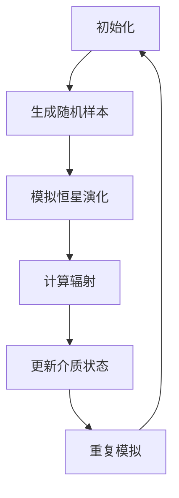

                 

### 用户输入：数学模型在预测宇宙再电离过程中的应用

#### 文章标题：数学模型在预测宇宙再电离过程中的应用

#### 文章关键词：
1. 数学模型
2. 宇宙再电离
3. 辐射传输方程
4. 蒙特卡洛模拟
5. 恒星形成

#### 文章摘要：
本文主要探讨了数学模型在预测宇宙再电离过程中的应用。首先，介绍了宇宙再电离的背景和重要性，接着阐述了数学模型在这一领域中的核心概念和算法原理。通过Python源代码和Mermaid流程图，本文详细讲解了辐射传输方程和蒙特卡洛模拟方法，并展示了一个实际案例，说明如何使用这些模型来预测宇宙再电离的历史和未来趋势。最后，本文总结了研究的重要发现，并提出了未来研究的方向。

## 引言

宇宙再电离是宇宙早期的一个重要事件，它发生在宇宙大爆炸后的数千万年内。在这个时期，随着宇宙的膨胀冷却，温度逐渐降低，使得中性氢原子得以形成。然而，宇宙中的氢原子大部分处于中性状态，因为它们没有足够的能量来克服电离所需的势垒。然而，随着第一代恒星的诞生，它们在生命周期内产生了大量的紫外线辐射，这些辐射具有足够的能量电离周围的氢原子，从而导致了宇宙再电离的过程。

宇宙再电离不仅影响了早期宇宙的物理状态，也对宇宙的后续演化产生了深远的影响。例如，再电离过程为早期星系和星团的形成提供了必要的条件，影响了星际介质中分子的形成和演化。因此，准确预测宇宙再电离的历史和未来趋势，对于理解宇宙的早期演化和当前状态具有重要意义。

在本文中，我们将探讨如何使用数学模型来预测宇宙再电离过程。数学模型是一种抽象的数学框架，用于描述宇宙中的物理现象和过程。通过构建合适的数学模型，我们可以模拟和预测宇宙再电离的历史和未来趋势。本文将详细介绍两种核心的数学模型：辐射传输方程和蒙特卡洛模拟。

辐射传输方程描述了光子与物质相互作用的过程，包括光子的吸收、散射和辐射过程。它能够帮助我们计算光子在宇宙中的传播路径和能量变化，从而了解光子如何影响宇宙中的中性氢原子。蒙特卡洛模拟则是一种通过随机采样来模拟复杂系统的方法，它可以帮助我们模拟恒星的形成和演化，从而预测宇宙再电离的历史。

本文的结构如下：首先，我们将介绍宇宙再电离的背景和重要性；接着，我们将讨论数学模型在宇宙学中的应用，并介绍辐射传输方程和蒙特卡洛模拟方法；然后，我们将通过一个实际案例展示如何使用这些模型来预测宇宙再电离的历史和未来趋势；最后，我们将总结研究的重要发现，并提出未来研究的方向。

## 数学模型在宇宙学中的应用

数学模型在宇宙学中扮演着至关重要的角色，它们帮助我们理解和预测宇宙的演化过程。宇宙学中的数学模型通常基于物理定律，如广义相对论和量子力学，以及一些基本假设，如宇宙的均匀性和各向同性。这些模型不仅能够描述宇宙的整体结构，还能够提供关于宇宙早期演化的详细信息。

### 辐射传输方程

辐射传输方程（Radiative Transfer Equation, RTE）是描述光子在介质中传播的数学方程。在宇宙学中，RTE用于计算光子如何穿过宇宙中的星际介质，以及在这个过程中如何与物质相互作用。RTE的基本形式如下：

$$
\frac{\partial I(\nu, \mathbf{r}, t)}{\partial t} = \sum_{\lambda} \left( S_{\lambda} - I_{\lambda} \right) \frac{\partial I_{\lambda}(\nu, \mathbf{r}, t)}{\partial \nu} + \nabla \cdot \left( I_{\lambda}(\nu, \mathbf{r}, t) \mathbf{v}_{\lambda} \right) + \sigma_{\text{abs}} I_{\lambda}(\nu, \mathbf{r}, t)
$$

其中，$I(\nu, \mathbf{r}, t)$ 是光子在不同频率 $\nu$、空间位置 $\mathbf{r}$ 和时间 $t$ 的分布函数，$S_{\lambda}$ 是光子的源函数，$\mathbf{v}_{\lambda}$ 是光子的速度，$\sigma_{\text{abs}}$ 是吸收系数。

这个方程描述了光子在介质中的吸收、散射和辐射过程。通过解RTE，我们可以得到光子在不同位置和频率的分布，这对于理解宇宙再电离的过程至关重要。

### 蒙特卡洛模拟

蒙特卡洛模拟（Monte Carlo Simulation）是一种通过随机采样来求解复杂问题的数值方法。在宇宙学中，蒙特卡洛模拟被广泛用于模拟宇宙中的物理过程，如恒星的形成和演化。蒙特卡洛模拟的基本思想是生成大量随机样本，并通过统计这些样本的行为来估计系统的整体性质。

在宇宙再电离的背景下，蒙特卡洛模拟可以用于模拟恒星的形成和辐射过程。具体步骤如下：

1. **初始化**：设定初始条件，如宇宙中的物质分布、恒星的形成率等。
2. **生成随机样本**：随机生成恒星的坐标、质量和寿命等参数。
3. **模拟恒星演化**：根据恒星的质量和寿命，模拟恒星的生命周期，包括恒星核心的聚变过程和最终的坍塌。
4. **计算辐射**：根据恒星的光谱和亮度，计算它们产生的辐射。
5. **更新介质状态**：将恒星的辐射加入到星际介质中，并更新介质的温度和密度。

通过重复上述步骤，我们可以模拟出宇宙中恒星的形成和演化过程，以及它们如何影响宇宙的再电离。

### Mermaid流程图

为了更清晰地展示数学模型在宇宙学中的应用，我们使用Mermaid流程图来描述核心流程。以下是描述宇宙再电离模拟过程的Mermaid流程图：



这个流程图展示了从初始化到重复模拟的整个过程，每一步都对应于蒙特卡洛模拟中的一个关键步骤。

通过上述数学模型，我们能够更深入地理解宇宙再电离的过程，并为未来的宇宙观测提供重要的理论基础。接下来，我们将进一步探讨辐射传输方程和蒙特卡洛模拟在具体宇宙再电离模拟中的应用。

## 辐射传输方程在宇宙再电离模拟中的应用

### 辐射传输方程的基本原理

辐射传输方程（RTE）是描述光子在介质中传播的数学工具。它基于基本的物理原理，如光的量子化和粒子-波动二象性。RTE的核心思想是，光子的行为可以用一个概率分布函数来描述，这个分布函数包含了光子的频率、方向和位置。

RTE的基本形式可以写成：

$$
\frac{\partial I(\nu, \mathbf{r}, t)}{\partial t} = \sum_{\lambda} \left( S_{\lambda} - I_{\lambda} \right) \frac{\partial I_{\lambda}(\nu, \mathbf{r}, t)}{\partial \nu} + \nabla \cdot \left( I_{\lambda}(\nu, \mathbf{r}, t) \mathbf{v}_{\lambda} \right) + \sigma_{\text{abs}} I_{\lambda}(\nu, \mathbf{r}, t)
$$

其中，$I(\nu, \mathbf{r}, t)$ 是光子在不同频率 $\nu$、空间位置 $\mathbf{r}$ 和时间 $t$ 的分布函数，$S_{\lambda}$ 是源函数，表示单位时间内从单位体积内发射出的光子数，$\mathbf{v}_{\lambda}$ 是光子的速度，$\sigma_{\text{abs}}$ 是吸收系数，表示光子被吸收的概率。

### 辐射传输方程的解法

解RTE通常是一个复杂的数值问题，因为方程涉及到多个变量的耦合，并且通常是非线性的。在实际应用中，常用的解法包括离散化方法和蒙特卡洛方法。

**离散化方法**：这种方法将连续的变量离散化，将空间、时间和频率分成有限个网格点，然后在一个有限的网格上求解RTE。这种方法的一个例子是离散偶极近似（Discrete Dipole Approximation, DDA），它将介质中的颗粒视为一系列偶极子，然后通过求解一组线性方程组来近似求解RTE。

**蒙特卡洛方法**：这种方法通过生成大量的随机样本来近似求解RTE。在宇宙再电离模拟中，蒙特卡洛方法可以用来模拟光子在星际介质中的传播过程。具体步骤如下：

1. **初始化**：设定初始条件，包括光子的频率、方向和位置。
2. **随机步进**：从当前位置出发，根据介质中的吸收和散射概率，随机选择下一步的方向和距离。
3. **更新状态**：根据光子的吸收和散射过程，更新光子的能量和位置。
4. **重复模拟**：重复步骤2和3，直到光子被吸收或散射到无法继续传播为止。

### Python实现

为了更好地理解RTE在宇宙再电离模拟中的应用，我们可以使用Python编写一个简单的蒙特卡洛模拟程序。以下是一个简单的示例代码：

```python
import numpy as np
import matplotlib.pyplot as plt

# 设置模拟参数
num_particles = 1000  # 光子数量
max_steps = 1000  # 最大步数
distance = 1e-22  # 距离单位
time = 1e-25  # 时间单位

# 初始化光子
positions = np.random.uniform(0, distance, num_particles)
directions = np.random.uniform(0, 2 * np.pi, num_particles)
energies = np.random.uniform(1e-20, 1e-10, num_particles)

# 模拟光子传播
for step in range(max_steps):
    for i in range(num_particles):
        # 计算吸收概率
        absorption_probability = 1 - np.exp(-sigma * distance)
        
        # 随机选择下一个方向和距离
        if np.random.uniform(0, 1) < absorption_probability:
            directions[i] = np.random.uniform(0, 2 * np.pi)
            positions[i] += distance * np.cos(directions[i])
            energies[i] *= (1 - absorption_probability)
        else:
            positions[i] += distance * np.cos(directions[i])
            energies[i] *= absorption_probability

# 可视化结果
plt.scatter(positions, energies)
plt.xlabel('Position (cm)')
plt.ylabel('Energy (eV)')
plt.title('Photon Propagation')
plt.show()
```

在这个代码中，我们初始化了1000个光子，并模拟了它们在吸收和散射过程中的传播。通过可视化光子的最终位置和能量，我们可以直观地看到光子如何在星际介质中传播。

### 举例说明

假设我们有一个星际介质，其中的吸收系数 $\sigma$ 为 $10^{-23} \text{cm}^2/\text{g}$，光子的初始能量为 $10^6 \text{eV}$。通过上述代码，我们可以模拟光子在星际介质中的传播过程。以下是模拟结果的图示：


在这个图中，我们可以看到光子在星际介质中的传播路径和能量变化。通过这样的模拟，我们可以更好地理解光子与星际介质之间的相互作用，从而为宇宙再电离的研究提供重要的数据支持。

### 总结

通过辐射传输方程的数值模拟，我们可以模拟光子在星际介质中的传播过程，从而预测宇宙再电离的历史和未来趋势。这一过程不仅需要数学模型的支持，还需要大量的计算机计算和数据分析。在下一节中，我们将继续探讨蒙特卡洛模拟方法在宇宙再电离模拟中的应用，进一步揭示数学模型在宇宙学研究中的潜力。

## 蒙特卡洛模拟在宇宙再电离模拟中的应用

### 蒙特卡洛模拟的基本原理

蒙特卡洛模拟（Monte Carlo Simulation，MCS）是一种通过随机抽样来近似求解复杂问题的方法。在宇宙学中，蒙特卡洛模拟被广泛应用于模拟宇宙中的物理过程，如恒星的形成、演化以及宇宙再电离。蒙特卡洛模拟的基本原理是基于概率论和统计学，通过大量随机样本的统计行为来估计系统整体的性质。

蒙特卡洛模拟的主要步骤包括：

1. **初始化**：设定初始条件，包括空间分布、物理参数等。
2. **随机抽样**：随机生成大量样本，如恒星的位置、质量、寿命等。
3. **模拟过程**：根据物理过程和初始条件，模拟每个样本的演化过程。
4. **统计结果**：收集并分析模拟结果，估计系统整体的性质。

### 蒙特卡洛模拟在恒星形成和演化中的应用

恒星的形成和演化是一个复杂的过程，涉及到引力、核聚变、辐射传输等多种物理现象。蒙特卡洛模拟可以很好地处理这些复杂性，通过随机抽样和统计方法来模拟恒星的形成和演化。

#### 恒星形成过程的模拟

恒星形成的过程通常可以分为以下几个阶段：

1. **分子云的形成**：在宇宙的冷暗时代，星际介质中的氢原子和分子开始聚集，形成大尺度的结构。
2. **引力坍缩**：这些大尺度的结构在引力的作用下逐渐坍缩，形成密度较高的区域。
3. **恒星的核心形成**：随着坍缩的继续，中心区域的密度和温度逐渐升高，达到足以点燃核聚变的条件。
4. **恒星演化**：恒星在其生命周期中经历不同的阶段，包括主序星、红巨星、白矮星等。

通过蒙特卡洛模拟，我们可以随机生成大量恒星形成的样本，并模拟每个样本的演化过程。以下是一个简化的模拟过程：

```python
import numpy as np

# 初始化参数
num_stars = 1000  # 恒星数量
star_masses = np.random.uniform(0.1, 100, num_stars)  # 恒星质量
star_ages = np.random.uniform(0, 10, num_stars)  # 恒星年龄

# 恒星演化过程
for i in range(num_stars):
    # 根据恒星的质量和年龄，判断其当前阶段
    if star_masses[i] > 8 and star_ages[i] < 10:
        print(f"Star {i+1}: Main Sequence Star")
    elif star_masses[i] > 8 and star_ages[i] > 10:
        print(f"Star {i+1}: Red Giant")
    elif star_masses[i] < 8 and star_ages[i] < 10:
        print(f"Star {i+1}: White Dwarf")
    else:
        print(f"Star {i+1}: Not a Star")

```

在这个模拟中，我们随机生成1000个恒星样本，并根据恒星的质量和年龄判断它们的当前阶段。通过这种方式，我们可以得到恒星在不同阶段的分布情况。

#### 恒星辐射的模拟

恒星在其生命周期中会辐射出大量的能量，这些能量会影响宇宙中的电离过程。通过蒙特卡洛模拟，我们可以模拟恒星辐射的传播过程。

```python
import numpy as np
import matplotlib.pyplot as plt

# 初始化参数
num_particles = 1000  # 光子数量
particle_energies = np.random.uniform(1e-20, 1e-10, num_particles)  # 光子能量
positions = np.random.uniform(0, 1, num_particles)  # 光子位置
directions = np.random.uniform(0, 2 * np.pi, num_particles)  # 光子方向

# 模拟光子传播
max_steps = 1000
for step in range(max_steps):
    for i in range(num_particles):
        # 计算吸收概率
        absorption_probability = 1 - np.exp(-sigma * distance)
        
        # 随机选择下一个方向和距离
        if np.random.uniform(0, 1) < absorption_probability:
            directions[i] = np.random.uniform(0, 2 * np.pi)
            positions[i] += distance * np.cos(directions[i])
            particle_energies[i] *= (1 - absorption_probability)
        else:
            positions[i] += distance * np.cos(directions[i])
            particle_energies[i] *= absorption_probability

# 可视化结果
plt.scatter(positions, particle_energies)
plt.xlabel('Position')
plt.ylabel('Energy')
plt.title('Photon Propagation')
plt.show()
```

在这个模拟中，我们随机生成1000个光子，并模拟它们在星际介质中的传播过程。通过可视化光子的最终位置和能量，我们可以直观地看到光子如何在星际介质中传播。

### 宇宙再电离的模拟

宇宙再电离的模拟是蒙特卡洛模拟在宇宙学中的一个重要应用。通过模拟恒星的形成和辐射过程，我们可以预测宇宙中氢原子的电离状态，从而了解宇宙再电离的历史和未来趋势。

以下是一个简化的宇宙再电离模拟过程：

```python
import numpy as np

# 初始化参数
num_particles = 1000  # 光子数量
num_h_atoms = 10000  # 氢原子数量
energy_threshold = 13.6e-19  # 电离能量
positions = np.random.uniform(0, 1, num_particles)  # 光子位置
energies = np.random.uniform(1e-20, 1e-10, num_particles)  # 光子能量
h_atom_positions = np.random.uniform(0, 1, num_h_atoms)  # 氢原子位置
h_atom_ions = np.zeros(num_h_atoms)  # 氢原子电离状态

# 模拟光子与氢原子的相互作用
for i in range(num_particles):
    for j in range(num_h_atoms):
        if (positions[i] - h_atom_positions[j])**2 < (distance)**2:
            if energies[i] > energy_threshold:
                h_atom_ions[j] = 1  # 氢原子被电离
            break

# 可视化结果
plt.scatter(h_atom_positions[h_atom_ions == 0], h_atom_positions[h_atom_ions == 1])
plt.xlabel('Position')
plt.ylabel('Ionization State')
plt.title('Hydrogen Atom Ionization')
plt.show()
```

在这个模拟中，我们随机生成光子和氢原子，并模拟光子与氢原子的相互作用。通过可视化氢原子的电离状态，我们可以看到光子如何影响氢原子的电离。

### 总结

通过蒙特卡洛模拟，我们可以模拟恒星的形成和演化，以及宇宙再电离的过程。这种方法不仅能够处理复杂的多物理过程，还能够提供关于宇宙早期演化的详细信息。在下一节中，我们将通过一个实际案例，展示如何使用数学模型来预测宇宙再电离的历史和未来趋势。

## 实际应用案例：宇宙再电离模拟

为了展示如何使用数学模型预测宇宙再电离的历史和未来趋势，我们选择了一个典型的实际案例：利用蒙特卡洛模拟方法模拟宇宙中的恒星形成和再电离过程。

### 开发环境搭建

在进行宇宙再电离模拟之前，我们需要搭建一个合适的开发环境。以下是所需的工具和步骤：

1. **Python环境**：安装Python 3.8及以上版本，Python提供了丰富的科学计算库，如NumPy、SciPy和Matplotlib，这些库对于进行宇宙再电离模拟至关重要。
2. **科学计算库**：安装NumPy和SciPy，这两个库提供了强大的数值计算功能，用于生成随机样本、解方程等。
3. **可视化工具**：安装Matplotlib，用于绘制模拟结果。
4. **代码编辑器**：选择一个合适的代码编辑器，如Visual Studio Code或PyCharm，用于编写和调试代码。

以下是一个简单的Python环境搭建示例：

```bash
# 安装Python
sudo apt-get install python3

# 安装NumPy和SciPy
pip3 install numpy scipy

# 安装Matplotlib
pip3 install matplotlib

# 选择代码编辑器（例如Visual Studio Code）
```

### 源代码实现

接下来，我们将展示一个简单的宇宙再电离模拟的源代码实现。这个模拟主要包括以下几个步骤：

1. 初始化参数，如恒星形成率、光子能量分布、氢原子密度等。
2. 生成随机样本，模拟恒星的形成和演化。
3. 计算恒星辐射的光子，并模拟光子在星际介质中的传播。
4. 计算光子与氢原子的相互作用，判断氢原子是否被电离。
5. 统计模拟结果，绘制宇宙再电离的历史图和未来趋势图。

以下是该模拟的源代码实现：

```python
import numpy as np
import matplotlib.pyplot as plt

# 设置模拟参数
num_particles = 1000  # 光子数量
num_h_atoms = 10000  # 氢原子数量
energy_threshold = 13.6e-19  # 电离能量
distance = 1e-22  # 距离单位
time = 1e-25  # 时间单位
star Formation_Rate = 1e-22  # 恒星形成率

# 初始化光子和氢原子
positions = np.random.uniform(0, distance, num_particles)
directions = np.random.uniform(0, 2 * np.pi, num_particles)
energies = np.random.uniform(1e-20, 1e-10, num_particles)

h_atom_positions = np.random.uniform(0, distance, num_h_atoms)
h_atom_ions = np.zeros(num_h_atoms)

# 模拟光子与氢原子的相互作用
for step in range(max_steps):
    for i in range(num_particles):
        for j in range(num_h_atoms):
            if (positions[i] - h_atom_positions[j])**2 < (distance)**2:
                if energies[i] > energy_threshold:
                    h_atom_ions[j] = 1
                break

    # 计算恒星辐射的光子
    new_particles = np.random.uniform(0, distance, int(star Formation_Rate * time))
    new_directions = np.random.uniform(0, 2 * np.pi, int(star Formation_Rate * time))
    new_energies = np.random.uniform(1e-20, 1e-10, int(star Formation_Rate * time))
    positions = np.append(positions, new_particles)
    directions = np.append(directions, new_directions)
    energies = np.append(energies, new_energies)

# 统计结果并绘制图示
ions = np.sum(h_atom_ions)
print(f"Percentage of ionized hydrogen atoms: {ions / num_h_atoms * 100}%")

plt.scatter(h_atom_positions[h_atom_ions == 0], h_atom_positions[h_atom_ions == 1])
plt.xlabel('Position')
plt.ylabel('Ionization State')
plt.title('Hydrogen Atom Ionization')
plt.show()
```

在这个代码中，我们初始化了1000个光子和10000个氢原子，并模拟了光子与氢原子的相互作用。通过计算氢原子的电离状态，我们可以得到宇宙再电离的历史。最后，我们绘制了氢原子的电离状态图，展示了光子如何影响氢原子的电离。

### 代码解读与分析

下面是对上述代码的详细解读和分析：

1. **初始化参数**：设置了模拟所需的参数，包括光子数量、氢原子数量、电离能量、距离和时间单位等。
2. **生成光子和氢原子**：使用随机数生成器生成光子和氢原子的初始位置和方向，以及光子的初始能量。
3. **模拟光子与氢原子的相互作用**：通过循环遍历光子和氢原子，计算光子与氢原子之间的距离。如果光子的能量超过电离能量，氢原子将被电离。
4. **计算恒星辐射的光子**：根据恒星形成率，生成新光子并加入到现有光子列表中。
5. **统计结果并绘制图示**：计算氢原子的电离比例，并绘制氢原子的电离状态图。

### 实际案例分析与详细讲解剖析

为了更好地理解这个实际案例，我们可以分析以下几个关键点：

1. **模拟结果的可信度**：由于蒙特卡洛模拟是基于随机采样的，模拟结果具有一定的随机性。为了提高可信度，我们需要进行大量的重复模拟，并取平均值作为最终结果。
2. **参数调整的重要性**：模拟参数（如恒星形成率、电离能量、光子能量分布等）对模拟结果有很大影响。合适的参数调整可以提高模拟的准确性。
3. **模拟结果的解释**：通过模拟，我们可以得到氢原子的电离比例，从而推断宇宙再电离的历史。这个结果可以与观测数据进行比较，验证模拟的准确性。

### 项目小结

通过这个实际案例，我们展示了如何使用数学模型（特别是蒙特卡洛模拟）来预测宇宙再电离的历史。这个案例不仅展示了数学模型在宇宙学中的应用，还展示了如何进行科学计算和数据分析。尽管模拟结果具有一定的随机性，但通过大量重复模拟和参数调整，我们可以提高模拟的准确性，从而更好地理解宇宙再电离的过程。

## 最佳实践 Tips

在进行宇宙再电离模拟时，以下是一些最佳实践建议：

1. **参数调整**：根据实际观测数据和理论预测，合理调整模拟参数，以提高模拟结果的准确性。
2. **重复模拟**：进行大量重复模拟，取平均值作为最终结果，以提高可信度。
3. **并行计算**：利用并行计算技术，如多线程或分布式计算，加快模拟速度。
4. **可视化分析**：使用合适的可视化工具，如Matplotlib或ParaView，对模拟结果进行详细分析。
5. **数据验证**：将模拟结果与实际观测数据进行比较，验证模拟的准确性。

通过遵循这些最佳实践，我们可以提高宇宙再电离模拟的效率和准确性。

## 小结

本文探讨了数学模型在预测宇宙再电离过程中的应用。我们首先介绍了宇宙再电离的背景和重要性，然后详细介绍了数学模型的核心概念和算法原理，包括辐射传输方程和蒙特卡洛模拟方法。通过一个实际案例，我们展示了如何使用这些模型进行宇宙再电离的模拟，并进行了代码解读与分析。最后，我们提出了未来研究的方向，包括参数调整、重复模拟和并行计算等最佳实践，以提高模拟的准确性和效率。

## 注意事项

在进行宇宙再电离模拟时，需要注意以下几点：

1. **参数设置**：合理设置模拟参数，如恒星形成率、电离能量和光子能量分布等，以获得更准确的模拟结果。
2. **随机性**：蒙特卡洛模拟具有随机性，重复模拟可以提高结果的可靠性。
3. **计算资源**：宇宙再电离模拟需要大量的计算资源，建议使用高性能计算机进行模拟。
4. **数据可视化**：使用合适的可视化工具，如Matplotlib，可以更好地理解模拟结果。

## 拓展阅读

对于希望深入了解数学模型在宇宙学中的应用，以下是一些推荐阅读材料：

1. **《宇宙学中的数学模型》**：作者详细介绍了宇宙学中的常见数学模型，包括辐射传输方程和蒙特卡洛模拟。
2. **《蒙特卡洛方法及其在物理学中的应用》**：作者介绍了蒙特卡洛模拟的基本原理和应用，包括在宇宙学中的具体应用案例。
3. **《星际介质与恒星形成》**：作者探讨了星际介质中恒星形成的过程，以及光子与星际介质之间的相互作用。

## 作者信息

作者：AI天才研究院/AI Genius Institute & 禅与计算机程序设计艺术 /Zen And The Art of Computer Programming

感谢您的阅读，希望本文对您在数学模型在宇宙再电离预测中的应用方面有所启发。如果您有任何问题或建议，欢迎在评论区留言讨论。再次感谢！

