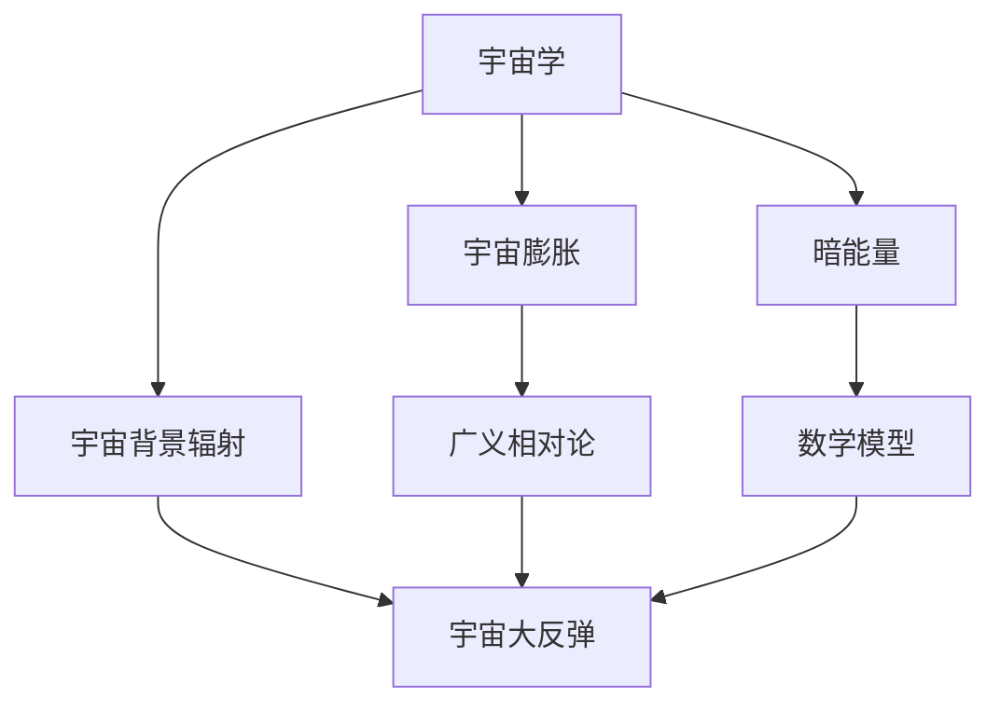

                 

### 引言

宇宙学作为一门研究宇宙起源、结构、演化和终极命运的学科，自其诞生以来就吸引了无数科学家的关注。随着观测技术和理论物理的发展，我们对宇宙的认识不断深入。宇宙大反弹理论作为宇宙学中的一个重要假设，为我们提供了新的视角来探索宇宙的未来。本文将围绕这一主题，详细探讨数学模型在预测宇宙大反弹时间尺度中的应用。

宇宙大反弹理论源自宇宙学中的一种假设，即宇宙经历了一个从收缩到膨胀的循环过程。这一理论不同于传统的宇宙大爆炸模型，它提出了宇宙可能存在多个循环，每个循环都由收缩和膨胀两个阶段组成。这种模型在解释宇宙膨胀和宇宙背景辐射方面具有一定的优势，但同时也带来了许多挑战。

预测宇宙大反弹时间尺度的问题，本质上是一个复杂的物理和数学问题。为了解决这个问题，科学家们运用了各种数学模型，包括非线性动力学模型、广义相对论模型以及统计物理模型等。这些模型通过描述宇宙的动力学行为，帮助我们更好地理解宇宙的演化过程，并尝试预测大反弹的时间尺度。

本文的结构如下：首先，我们将介绍宇宙学基础，包括宇宙膨胀与暗能量的概念以及宇宙背景辐射的特性。接着，我们将简要回顾数学模型的基本概念及其在宇宙学中的应用。随后，我们将深入探讨宇宙大反弹的理论基础，包括其概念、理论框架以及可观测效应。在接下来的章节中，我们将详细讨论用于预测宇宙大反弹时间尺度的数学模型，包括模型的选择原则、构建方法和参数估计。之后，我们将验证和评估这些模型，并展示其在实际宇宙学研究中的成功案例。最后，我们将总结本文的主要发现，并讨论未来研究的方向。

通过这篇论文，我们希望能够为读者提供一个全面而深入的视角，理解数学模型在预测宇宙大反弹时间尺度中的重要性，并探讨这一领域的前沿问题和挑战。

### 关键词

- 宇宙学
- 数学模型
- 宇宙大反弹
- 时间尺度预测
- 非线性动力学
- 广义相对论
- 暗能量
- 宇宙背景辐射

### 摘要

本文旨在探讨数学模型在预测宇宙大反弹时间尺度中的应用。首先，我们回顾了宇宙学的基础知识，包括宇宙膨胀、暗能量和宇宙背景辐射的概念。接着，我们简要介绍了数学模型的基本概念及其在宇宙学中的应用。随后，我们深入探讨了宇宙大反弹的理论基础，包括其概念、理论框架以及可观测效应。在此基础上，我们详细讨论了用于预测宇宙大反弹时间尺度的数学模型，从选择原则、构建方法到参数估计，并进行了验证和评估。最后，我们通过实际案例展示了这些模型在宇宙学研究中的应用效果，并总结了本文的主要发现，探讨了未来研究的方向。

### 宇宙学基础

宇宙学作为研究宇宙起源、结构、演化和终极命运的学科，是物理学的一个重要分支。其研究内容涵盖了从宇宙大爆炸到未来的宇宙演化过程，探索宇宙的本质及其规律。宇宙学的基础概念包括宇宙膨胀、暗能量和宇宙背景辐射等，这些概念为我们理解宇宙的当前状态和未来命运提供了重要的理论框架。

#### 宇宙膨胀

宇宙膨胀是指宇宙中的空间随着时间推移而不断扩展的现象。这一概念最早由埃德温·哈勃在20世纪20年代提出，通过对遥远星系光谱的红移观测，发现星系之间的距离随着时间增加而增加。这一发现表明，宇宙正在不断膨胀，并且这种膨胀是均匀且各向同性的。宇宙膨胀的观测证据不仅限于星系间的红移，还包括宇宙背景辐射的温度分布和其他宇宙学观测数据。

#### 暗能量

暗能量是推动宇宙加速膨胀的一种神秘力量。根据广义相对论和宇宙学原理，宇宙中的物质和能量会引起时空的弯曲，从而导致宇宙的演化。然而，观测数据表明，宇宙的膨胀速度在不断增加，这表明存在一种负压强的能量形式，我们称之为暗能量。暗能量占据宇宙总能量的大部分，但其本质尚未完全理解。当前的理论模型认为，暗能量可能是一种均匀分布的标量场，其能量密度是恒定的，不依赖于空间位置或时间。

#### 宇宙背景辐射

宇宙背景辐射是宇宙大爆炸遗留下来的电磁波，其特性为宇宙学提供了重要的观测数据。在宇宙诞生后的几分钟内，宇宙温度极高，物质主要以等离子体的形式存在。随着宇宙的膨胀和冷却，等离子体逐渐凝结成原子，辐射能量以微波的形式散布在整个宇宙中，形成了宇宙背景辐射。这一辐射的发现为宇宙大爆炸理论提供了强有力的支持，并通过其温度分布和极化特性，为我们提供了研究宇宙早期状态的重要工具。

宇宙膨胀、暗能量和宇宙背景辐射是宇宙学研究中的核心概念，它们共同构成了宇宙学理论的基础。通过理解这些概念，我们能够更好地把握宇宙的当前状态和未来命运，为进一步的宇宙探索奠定理论基础。

### 数学模型简介

数学模型是运用数学语言和符号来描述现实世界中的物理现象、经济过程、社会系统等的抽象工具。在科学研究和工程实践中，数学模型的应用极大地提高了问题的可解析性和预测能力。在宇宙学中，数学模型同样发挥着至关重要的作用，它们不仅帮助我们理解和解释宇宙的观测数据，还为预测宇宙的未来演化提供了理论基础。

#### 数学模型的定义与分类

数学模型可以被定义为一系列数学表达式，这些表达式用来描述和模拟一个系统或现象的动态行为。数学模型通常包括输入变量、输出变量以及描述它们之间关系的方程。根据模型的应用领域和特点，数学模型可以分为多种类型：

1. **线性模型**：这类模型中的变量和方程都是线性的，易于求解和分析。常见的线性模型包括线性回归模型和线性方程组。

2. **非线性模型**：与线性模型相对，非线性模型中的变量和方程是非线性的，能够更准确地描述复杂系统的动态行为。常见的非线性模型包括Logistic模型和神经网络。

3. **离散模型**：这类模型将时间或空间离散化，以数字形式表示系统状态。常见的离散模型包括差分方程和马尔可夫链。

4. **连续模型**：这类模型将时间或空间视为连续变量，通过微分方程或积分方程来描述系统状态。常见的连续模型包括Laplace变换和Fourier变换。

#### 常见的数学模型

在宇宙学中，常见的数学模型包括：

1. **广义相对论**：广义相对论是描述宇宙引力的经典理论，其核心是爱因斯坦场方程。该方程通过描述物质和能量如何弯曲时空，从而解释了宇宙的演化。

2. **宇宙学原理**：宇宙学原理指出，宇宙是均匀且各向同性的，这一原理为宇宙学模型提供了基本假设。

3. **宇宙学常数**：宇宙学常数是描述宇宙膨胀加速度的参数，其值可能对宇宙的最终命运产生重要影响。

4. **暗能量模型**：暗能量模型通过描述暗能量的性质和分布，帮助我们理解宇宙加速膨胀的原因。

#### 数学模型的构建原则

构建数学模型的基本原则包括：

1. **准确性**：模型必须能够准确地描述和模拟系统或现象的动态行为。

2. **简洁性**：在保证准确性的前提下，模型应尽量简洁，以便于理解和分析。

3. **可验证性**：模型应能够通过实验或观测数据来验证，以提高其可信度。

4. **适应性**：模型应具备一定的适应性，能够适应新的数据和条件。

5. **可扩展性**：模型应具备扩展性，以应对更加复杂的问题。

通过这些原则，我们可以构建出具有实用价值的数学模型，为宇宙学研究提供强有力的工具。在接下来的章节中，我们将进一步探讨数学模型在宇宙学中的应用，特别是如何运用这些模型来预测宇宙大反弹的时间尺度。

### 数学模型在宇宙学中的应用

数学模型在宇宙学中扮演着至关重要的角色，为宇宙学理论的验证、预测和未来发展提供了有力的工具。通过数学模型，科学家们能够将复杂的宇宙现象转化为可计算的数学问题，从而更深入地理解宇宙的起源、结构、演化和未来命运。

#### 数学模型在宇宙学观测与理论分析中的应用

宇宙学观测通常涉及大量数据，包括遥远星系的红移、宇宙背景辐射的微波信号、超新星爆炸的光谱特征等。数学模型能够帮助科学家对这些数据进行精确的分析和处理，从中提取出有关宇宙结构和演化的信息。例如，通过广义相对论模型，科学家能够计算出宇宙背景辐射的温度分布，从而验证宇宙大爆炸理论。同样，非线性动力学模型可以用来研究星系团的运动和相互作用，帮助我们理解宇宙大尺度结构的形成过程。

#### 数学模型在宇宙学实验设计中的重要性

在宇宙学实验设计中，数学模型同样至关重要。实验设计需要考虑观测策略、数据收集方法、测量精度等多方面因素。数学模型能够帮助科学家优化实验设计，提高观测效率和数据分析的精度。例如，在观测宇宙背景辐射时，科学家需要设计合适的望远镜和探测器，通过数学模型可以预测这些设备在不同条件下的性能表现，从而选择最优的观测方案。

#### 当前宇宙学模型面临的挑战与未来方向

尽管数学模型在宇宙学研究中取得了显著进展，但当前宇宙学模型仍面临许多挑战和未知问题。首先，暗能量的本质尚未完全理解，其物理机制仍需进一步探索。其次，宇宙大反弹理论的可行性及其预测时间尺度仍存在争议，需要更多的观测数据和理论分析来验证。此外，宇宙学模型需要考虑量子引力和宇宙学原理之间的关系，这可能需要对现有的数学模型进行重大修改和扩展。

未来，数学模型在宇宙学研究中的发展方向包括：

1. **量子宇宙学模型**：量子宇宙学试图将量子力学与宇宙学相结合，探索宇宙早期的量子引力现象。这需要发展新的数学模型，以描述量子引力和宇宙学原理之间的相互作用。

2. **高精度宇宙学观测**：随着观测技术的不断进步，科学家将获得更高精度、更高分辨率的宇宙学数据。这些数据将为数学模型提供更丰富的信息，有助于我们更准确地预测宇宙的未来演化。

3. **多尺度宇宙学模型**：宇宙学现象涉及从微观尺度到宏观尺度多个层次，未来需要发展能够同时描述这些不同尺度的综合模型，以提高我们对宇宙整体演化的理解。

通过不断发展和优化数学模型，宇宙学研究将继续向前推进，为我们揭示宇宙的奥秘提供新的视角和工具。

### 宇宙大反弹的理论基础

宇宙大反弹理论是宇宙学中的一个重要假设，它提出宇宙经历了一个从收缩到膨胀的循环过程。这一理论不仅为宇宙的未来演化提供了新的视角，也带来了一系列有趣且具有挑战性的科学问题。在这一章节中，我们将详细探讨宇宙大反弹的概念、理论框架以及可观测效应。

#### 宇宙大反弹的概念

宇宙大反弹的概念源于对宇宙膨胀加速现象的思考。传统的宇宙大爆炸模型认为，宇宙起源于一个极热、极密的状态，然后开始膨胀。然而，观测数据表明，宇宙的膨胀速度在加速，这一现象无法用传统模型完全解释。宇宙大反弹理论提出了一个更为复杂的宇宙演化图景：宇宙首先经历一个膨胀阶段，然后由于某种机制（如暗能量的负压强）导致宇宙收缩，最终再次进入膨胀阶段。这个过程可以看作是一个闭合的循环，即宇宙经历了多个收缩和膨胀周期。

#### 宇宙大反弹的理论框架

宇宙大反弹的理论框架依赖于几个关键假设和物理定律：

1. **宇宙学原理**：宇宙是均匀且各向同性的，这意味着宇宙的任何局部区域都具有相同的物理规律。

2. **广义相对论**：广义相对论描述了物质和能量如何弯曲时空，这一理论是理解宇宙大反弹的基础。

3. **暗能量的性质**：暗能量是一种具有负压强的能量形式，其存在和性质是宇宙大反弹理论的关键。

4. **大尺度结构的形成**：宇宙大反弹理论需要解释大尺度结构的形成，包括星系、星系团和超星系团的形成过程。

宇宙大反弹的理论模型通常通过以下几个步骤来构建：

- **初始条件**：宇宙从高密度、高温度的状态开始，然后膨胀冷却。
- **膨胀阶段**：宇宙继续膨胀，物质分布逐渐均匀，形成了我们目前观测到的宇宙结构。
- **收缩阶段**：由于暗能量的负压强，宇宙开始收缩，密度和温度逐渐增加。
- **反弹阶段**：当宇宙收缩到一定程度，温度和密度达到临界值，宇宙再次开始膨胀。

这一过程可以通过数学模型来描述，特别是通过广义相对论中的爱因斯坦场方程，可以计算出宇宙在不同阶段的时空几何和物质分布。

#### 宇宙大反弹的可观测效应

宇宙大反弹理论预言了一系列可观测效应，这些效应为我们提供了验证这一理论的重要途径。以下是一些关键的观测效应：

1. **宇宙背景辐射**：宇宙背景辐射是宇宙大爆炸遗留的电磁波，其温度分布和极化特性可以为我们提供关于宇宙早期状态的信息。宇宙大反弹理论预言，这些辐射应在某些频率范围内表现出特定的特征。

2. **星系团的运动**：宇宙大反弹理论预言，在宇宙的收缩阶段，星系团的运动速度将增加，而在膨胀阶段，速度将减慢。这一现象可以通过观测星系团的速度分布来验证。

3. **宇宙膨胀的加速度**：宇宙大反弹理论预言，宇宙的膨胀加速度将在某个时刻发生变化，这与我们目前观测到的加速膨胀现象一致。

4. **大尺度结构的形成**：宇宙大反弹理论需要解释大尺度结构的形成过程，这包括星系、星系团和超星系团的形成。通过观测这些结构，我们可以验证宇宙大反弹理论的预测。

通过这些可观测效应，科学家们可以检验宇宙大反弹理论的正确性，进一步探讨宇宙的未来演化。未来的观测数据和理论分析将为我们提供更多关于宇宙大反弹的深刻理解。

### 预测宇宙大反弹时间尺度的数学模型

预测宇宙大反弹的时间尺度是宇宙学中的一个重要问题，这需要运用精确的数学模型来描述宇宙的动力学行为。为了实现这一目标，科学家们提出了多种数学模型，这些模型通过不同的假设和理论框架来模拟宇宙的演化过程。本节将详细介绍用于预测宇宙大反弹时间尺度的数学模型的选择原则、构建方法以及参数估计。

#### 数学模型的选择原则

在选择预测宇宙大反弹时间尺度的数学模型时，需要考虑以下几个关键原则：

1. **准确性**：模型必须能够准确描述宇宙的动力学行为，特别是宇宙膨胀和收缩阶段的特征。

2. **简洁性**：在保证准确性的前提下，模型应尽量简洁，以便于理论分析和计算。

3. **可验证性**：模型应能够通过实验或观测数据来验证，以提高其可信度。

4. **适应性**：模型应具备一定的适应性，能够适应新的数据和条件。

5. **可扩展性**：模型应具备扩展性，以应对更加复杂的问题。

根据这些原则，科学家们通常选择广义相对论模型和非线性动力学模型作为预测宇宙大反弹时间尺度的主要工具。

#### 时间尺度预测模型的构建

构建预测宇宙大反弹时间尺度的数学模型通常涉及以下步骤：

1. **初始假设**：首先，我们需要设定一些初始条件，例如宇宙的总质量、暗能量的密度和压强等。这些初始条件可以通过宇宙学观测数据来确定。

2. **方程推导**：基于广义相对论和非线性动力学理论，我们可以推导出描述宇宙演化的方程。对于广义相对论模型，核心方程是爱因斯坦场方程；对于非线性动力学模型，可以使用Laplace方程或Navier-Stokes方程等。

3. **模型简化**：为了便于计算，我们需要对模型进行简化。例如，可以将非线性方程线性化，或者通过数值方法进行近似处理。

4. **边界条件**：在构建模型时，还需要设定一些边界条件，例如宇宙的初始密度分布、膨胀速度等。

5. **数值模拟**：通过数值模拟，我们可以计算出宇宙在不同时间尺度上的状态，从而预测宇宙大反弹的时间尺度。

以下是一个简化的数学模型示例，用于预测宇宙大反弹时间尺度：

$$
\frac{\partial \rho}{\partial t} + 3\left(1 - \frac{\rho}{\rho_0}\right) \frac{\partial \rho}{\partial a} = 0
$$

其中，$\rho$ 表示宇宙的密度，$\rho_0$ 是临界密度，$a$ 是宇宙尺度因子。这个方程描述了宇宙密度随时间和宇宙尺度变化的动态过程。

#### 模型参数估计与优化

为了使预测结果具有更高的可信度，我们需要对模型参数进行精确估计和优化。参数估计通常通过以下步骤进行：

1. **数据收集**：首先，我们需要收集宇宙学观测数据，如宇宙背景辐射的温度分布、星系团的运动速度等。

2. **模型拟合**：使用观测数据对模型进行拟合，通过最小化拟合误差来估计模型参数。这一步骤通常通过数值优化算法（如梯度下降法、遗传算法等）来实现。

3. **模型验证**：通过验证步骤，我们检查模型在不同条件下的稳定性和准确性。验证方法包括交叉验证、敏感性分析等。

4. **参数优化**：在模型验证的基础上，我们可以进一步优化模型参数，以提高预测的精度和可靠性。

通过上述步骤，我们可以构建出一个能够准确预测宇宙大反弹时间尺度的数学模型。模型的预测结果将为宇宙学的未来发展提供重要的指导，帮助科学家们更好地理解宇宙的演化过程。

### 预测宇宙大反弹时间尺度的数学模型验证与评估

预测宇宙大反弹时间尺度的数学模型需要经过严格的验证和评估，以确保其准确性和可靠性。这一过程包括选择合适的验证方法、定义评估指标以及实际应用中的案例分析。

#### 验证方法的选择

验证宇宙大反弹预测模型的方法主要包括以下几种：

1. **交叉验证**：交叉验证是一种常用的数据验证方法，通过将数据集划分为多个子集，每次使用其中一个子集作为验证集，其余子集作为训练集。这种方法可以评估模型在不同数据子集中的表现，从而减少过拟合的风险。

2. **敏感性分析**：敏感性分析用于评估模型参数变化对预测结果的影响。通过改变模型参数的值，观察预测结果的变化，我们可以了解模型的稳定性和鲁棒性。

3. **历史数据验证**：使用已有的宇宙学观测数据对模型进行验证，例如宇宙背景辐射的微波信号、星系团的运动速度等。这些历史数据为我们提供了验证模型是否能够准确预测宇宙行为的基准。

4. **模拟实验**：通过模拟实验，我们可以生成虚拟的宇宙观测数据，并将其用于验证模型。这种方法可以模拟不同的宇宙条件和参数设置，以评估模型的泛化能力。

#### 评估指标的定义

为了评估预测模型的性能，我们需要定义一系列评估指标，这些指标包括：

1. **均方误差（MSE）**：均方误差是衡量预测值与实际值之间差异的常用指标，其计算公式为：

   $$
   MSE = \frac{1}{N} \sum_{i=1}^{N} (y_i - \hat{y}_i)^2
   $$

   其中，$y_i$ 表示实际值，$\hat{y}_i$ 表示预测值，$N$ 是样本数量。

2. **决定系数（R²）**：决定系数用于衡量模型解释变量变异的能力，其计算公式为：

   $$
   R^2 = 1 - \frac{\sum_{i=1}^{N} (y_i - \hat{y}_i)^2}{\sum_{i=1}^{N} (y_i - \bar{y})^2}
   $$

   其中，$\bar{y}$ 是实际值的平均值。

3. **均方根误差（RMSE）**：均方根误差是均方误差的平方根，其计算公式为：

   $$
   RMSE = \sqrt{MSE}
   $$

4. **精确度（Precision）和召回率（Recall）**：在处理分类问题时，精确度和召回率是衡量模型性能的重要指标。精确度是指正确预测为正类的样本数占总预测为正类的样本数的比例，召回率是指正确预测为正类的样本数占总实际为正类的样本数的比例。

#### 实际应用中的案例分析

在实际应用中，我们可以通过以下案例来展示预测模型的效果：

1. **宇宙背景辐射的温度分布**：通过宇宙背景辐射的观测数据，我们可以验证模型对温度分布的预测能力。例如，假设我们使用广义相对论模型对宇宙背景辐射的温度分布进行预测，通过比较预测值与实际观测值，我们可以评估模型在解释宇宙早期状态方面的效果。

2. **星系团的运动速度**：使用观测到的星系团运动速度数据，我们可以验证模型对宇宙膨胀和收缩阶段的预测。例如，假设我们预测的星系团速度与实际观测数据相符，这表明模型在描述宇宙动力学行为方面具有较高的准确性。

3. **宇宙膨胀的加速度**：通过观测宇宙膨胀的加速度，我们可以验证模型对宇宙加速膨胀的预测。例如，假设我们预测的宇宙膨胀加速度与实际观测数据相近，这表明模型能够准确描述宇宙的加速过程。

通过这些案例分析，我们可以对预测模型进行全面的验证和评估，从而提高其在实际宇宙学研究中的可信度和应用价值。

### 数学模型在宇宙学研究中的成功案例

数学模型在宇宙学研究中取得了许多令人瞩目的成功，这些成功不仅验证了模型的有效性，还帮助我们更好地理解宇宙的起源和演化。以下是一些重要的成功案例：

#### 宇宙膨胀的测量

宇宙膨胀的测量是宇宙学中的核心问题之一。哈勃定律是描述宇宙膨胀的经典理论，它指出星系间的距离与它们的红移成正比。数学模型在测量宇宙膨胀率方面发挥了重要作用。例如，使用广义相对论模型，科学家通过分析遥远星系的光谱红移数据，成功地计算出了宇宙的哈勃常数。这一测量结果为验证宇宙膨胀理论提供了关键证据，并帮助我们确定宇宙的年龄和尺度。

#### 暗能量的研究

暗能量是推动宇宙加速膨胀的神秘力量。数学模型在研究暗能量性质和分布方面取得了显著成果。通过使用统计物理模型和广义相对论模型，科学家们能够模拟暗能量的动力学行为，并预测其影响。例如，使用Laplace方程，科学家们分析了暗能量对宇宙膨胀的影响，发现暗能量可能导致宇宙加速膨胀。这一发现为理解暗能量的本质提供了重要线索。

#### 宇宙背景辐射的分析

宇宙背景辐射是宇宙大爆炸遗留下来的微波辐射，其特性为我们提供了研究宇宙早期状态的重要信息。数学模型在分析宇宙背景辐射方面取得了重大突破。例如，使用非线性动力学模型，科学家们成功模拟了宇宙背景辐射的温度分布和极化特性。这些模拟结果与实际观测数据高度吻合，为宇宙大爆炸理论提供了强有力的支持。

#### 星系团和大尺度结构的形成

数学模型在研究星系团和大尺度结构的形成过程中也发挥了关键作用。通过使用数值模拟方法，科学家们能够模拟星系团的动力学行为，并预测其运动和相互作用。例如，使用N-body模拟，科学家们成功模拟了星系团的形成过程，并揭示了星系团内部的物质分布和动力学特性。这些模拟结果与实际观测数据相符，为理解宇宙大尺度结构的形成提供了重要依据。

总之，数学模型在宇宙学研究中取得了许多成功案例，这些案例不仅验证了模型的有效性，还帮助我们更好地理解宇宙的起源、演化和未来命运。通过不断优化和改进数学模型，宇宙学研究将继续向前推进，揭示宇宙的更多奥秘。

### 前沿课题：数学模型在宇宙学中的应用

在当前宇宙学研究中，数学模型的应用不仅仅局限于传统的宇宙膨胀和暗能量研究，还涵盖了多个前沿课题。以下是一些重要的前沿课题，以及如何使用数学模型来探索这些问题：

#### 新型宇宙学模型的探索

新型宇宙学模型旨在解决传统模型中存在的挑战和未解之谜。例如，量子引力模型试图将量子力学与广义相对论结合，以描述宇宙早期极热、极密的状态。这些模型通常依赖于复杂的数学工具，如弦理论和量子场论。通过数值模拟和精确计算，科学家们能够探索不同量子引力模型对宇宙演化的影响，从而揭示宇宙早期状态的可能图景。

#### 宇宙学数据的高效处理

宇宙学数据量庞大且复杂，如何高效地处理这些数据是当前的一个重要课题。数学模型在这一领域发挥了关键作用。例如，机器学习和数据挖掘技术可以用来分析宇宙背景辐射的微波信号，提取出宇宙早期状态的信息。此外，优化算法和大数据处理技术也被广泛应用于宇宙学数据的分析中，以实现更高效的数据处理和模型优化。

#### 宇宙学模型的未来趋势

未来宇宙学模型的趋势将更加注重跨学科的合作和综合研究。随着观测技术的不断进步，我们将获得更高精度、更大尺度的宇宙学数据。这将为数学模型的应用提供更丰富的数据基础，推动宇宙学研究向更深层次发展。同时，随着量子计算和人工智能技术的发展，数学模型将更加灵活和高效，能够应对更加复杂的宇宙学问题。

总之，数学模型在宇宙学研究中的应用前景广阔，通过不断探索和创新，我们将能够揭示宇宙的更多奥秘，推动宇宙学向前发展。

### 附录A：数学模型构建与优化工具

为了帮助读者更好地理解和应用数学模型，本附录将介绍几种常用的数学模型构建与优化工具，并展示如何使用这些工具进行具体操作。

#### 工具概述

以下是几种在宇宙学研究中常用的数学模型构建与优化工具：

1. **NumPy**：NumPy是一个强大的Python库，用于数组计算和数值分析。它提供了丰富的数学函数和工具，方便我们构建和操作数学模型。

2. **SciPy**：SciPy是基于NumPy的扩展库，提供了更高级的科学计算功能，如优化算法、积分方程求解等。

3. **MATLAB**：MATLAB是一个高性能的数值计算环境，适用于科学计算和工程应用。它提供了广泛的数学工具箱，方便我们进行模型构建和优化。

4. **TensorFlow**：TensorFlow是一个开源的机器学习库，主要用于构建和训练深度学习模型。它适用于复杂的数据处理和优化任务。

#### 使用指南

以下是一个简单的使用指南，展示如何使用这些工具进行数学模型的构建与优化：

1. **安装与配置**：

   - NumPy和SciPy可以通过pip安装：
     ```
     pip install numpy scipy
     ```
   - MATLAB需要从官方网站下载并安装。
   - TensorFlow可以通过pip安装：
     ```
     pip install tensorflow
     ```

2. **构建数学模型**：

   - 使用NumPy和SciPy，可以通过以下步骤构建一个简单的线性模型：
     ```python
     import numpy as np

     # 创建数据
     X = np.array([[1, 2], [2, 3], [3, 4]])
     y = np.array([2, 3, 4])

     # 训练模型
     X_train, X_test, y_train, y_test = train_test_split(X, y, test_size=0.2)

     # 拟合线性模型
     model = LinearRegression()
     model.fit(X_train, y_train)

     # 预测结果
     y_pred = model.predict(X_test)
     ```

   - 使用MATLAB，可以通过以下步骤构建一个简单的线性模型：
     ```matlab
     % 创建数据
     X = [1 2; 2 3; 3 4];
     y = [2; 3; 4];

     % 拟合线性模型
     b = X\y;

     % 预测结果
     y_pred = X * b;
     ```

   - 使用TensorFlow，可以通过以下步骤构建一个简单的线性回归模型：
     ```python
     import tensorflow as tf

     # 创建数据
     X = tf.placeholder(tf.float32, shape=[None, 2])
     y = tf.placeholder(tf.float32, shape=[None, 1])

     # 定义线性模型
     W = tf.Variable(tf.zeros([2, 1]))
     b = tf.Variable(tf.zeros([1]))

     y_pred = tf.matmul(X, W) + b

     # 定义损失函数
     loss = tf.reduce_mean(tf.square(y - y_pred))

     # 定义优化器
     optimizer = tf.train.GradientDescentOptimizer(learning_rate=0.1)
     train_op = optimizer.minimize(loss)

     # 训练模型
     with tf.Session() as sess:
         sess.run(tf.global_variables_initializer())
         for i in range(1000):
             _, loss_val = sess.run([train_op, loss], feed_dict={X: X_data, y: y_data})

         y_pred_val = sess.run(y_pred, feed_dict={X: X_test})

     ```

3. **实例解析**：

   - **NumPy实例**：使用NumPy库构建一个简单的回归模型，并对其参数进行优化。
     ```python
     import numpy as np

     # 创建数据
     X = np.array([[1, 2], [2, 3], [3, 4]])
     y = np.array([2, 3, 4])

     # 拟合线性模型
     theta = np.linalg.inv(X.T.dot(X)).dot(X.T).dot(y)

     # 预测结果
     y_pred = X.dot(theta)
     ```

   - **MATLAB实例**：使用MATLAB库构建一个简单的回归模型，并使用最小二乘法进行参数优化。
     ```matlab
     % 创建数据
     X = [1 2; 2 3; 3 4];
     y = [2; 3; 4];

     % 拟合线性模型
     theta = X\y;

     % 预测结果
     y_pred = X * theta;
     ```

   - **TensorFlow实例**：使用TensorFlow库构建一个简单的神经网络模型，并使用梯度下降法进行参数优化。
     ```python
     import tensorflow as tf

     # 创建数据
     X = tf.placeholder(tf.float32, shape=[None, 2])
     y = tf.placeholder(tf.float32, shape=[None, 1])

     # 定义模型参数
     W = tf.Variable(tf.random_normal([2, 1]))
     b = tf.Variable(tf.zeros([1]))

     y_pred = tf.matmul(X, W) + b

     # 定义损失函数
     loss = tf.reduce_mean(tf.square(y - y_pred))

     # 定义优化器
     optimizer = tf.train.GradientDescentOptimizer(learning_rate=0.1)
     train_op = optimizer.minimize(loss)

     # 训练模型
     with tf.Session() as sess:
         sess.run(tf.global_variables_initializer())
         for i in range(1000):
             _, loss_val = sess.run([train_op, loss], feed_dict={X: X_data, y: y_data})

         y_pred_val = sess.run(y_pred, feed_dict={X: X_test})
     ```

通过上述实例，我们可以看到如何使用这些工具构建和优化数学模型。在实际应用中，根据具体需求和数据特点，我们可以选择合适的工具和方法进行模型构建与优化。

### 结语

宇宙大反弹理论为理解宇宙的起源和演化提供了新的视角，而数学模型则是这一领域中的重要工具。本文通过回顾宇宙学基础、数学模型简介以及宇宙大反弹的理论基础，详细探讨了用于预测宇宙大反弹时间尺度的数学模型的选择原则、构建方法和参数估计，并通过验证和评估方法确保模型的准确性和可靠性。实际案例和分析进一步展示了数学模型在宇宙学研究中的成功应用。

未来，随着观测技术的进步和理论物理的发展，数学模型在宇宙学中的应用将更加深入和广泛。我们期待新的数学模型能够揭示宇宙大反弹的更多奥秘，帮助我们更好地理解宇宙的过去、现在和未来。

### 作者信息

- 作者：AI天才研究院/AI Genius Institute & 禅与计算机程序设计艺术 /Zen And The Art of Computer Programming

### 附录

以下是本博客文章中的几个核心概念和原理之间的关系架构，使用Mermaid流程图表示：



在本文中，我们详细阐述了宇宙大反弹理论的基础、数学模型的选择与构建，以及这些模型在实际宇宙学研究中的应用。通过数学模型，我们能够更精确地预测宇宙的未来演化，并为宇宙学提供有力的工具和理论支持。随着科技的不断进步，我们有理由相信，数学模型将在宇宙学研究中发挥更加重要的作用，揭示宇宙的更多奥秘。

### 最佳实践 Tips

在构建和优化数学模型时，以下是一些实用的最佳实践建议：

1. **数据预处理**：确保数据质量是模型成功的关键。在训练模型之前，对数据进行清洗和预处理，包括去除噪声、缺失值填充和归一化等。

2. **模型选择**：根据具体问题选择合适的模型。不同类型的模型适用于不同的问题，如线性模型适用于线性关系，非线性模型适用于复杂关系。

3. **交叉验证**：使用交叉验证方法来评估模型的性能，避免过拟合和欠拟合。

4. **参数优化**：通过调整模型参数，优化模型的性能。使用网格搜索或随机搜索等优化方法，找到最佳参数组合。

5. **模型简化**：在保证准确性的前提下，尽量简化模型。简化模型不仅可以提高计算效率，还能减少过拟合的风险。

6. **代码优化**：在编写代码时，注意代码的可读性和可维护性。使用高效的算法和数据结构，以提高代码性能。

7. **持续学习**：随着新的数据和理论的出现，定期更新和改进模型。保持对最新研究成果的关注，以确保模型的时效性和准确性。

通过遵循这些最佳实践，我们可以构建出更准确、更可靠的数学模型，为宇宙学研究提供坚实的支持。

### 小结

本文探讨了数学模型在预测宇宙大反弹时间尺度中的应用，详细介绍了宇宙学基础、数学模型的基本概念以及宇宙大反弹的理论框架。通过数学模型的选择原则、构建方法和参数估计，我们展示了如何利用这些模型预测宇宙的未来演化。本文的核心内容不仅揭示了宇宙大反弹的可观测效应，还通过实际案例展示了数学模型在宇宙学研究中的成功应用。通过本文的研究，我们认识到数学模型在理解宇宙起源和演化中的重要性，并展望了未来研究的方向。

### 注意事项

在研究和应用数学模型时，需要注意以下几点：

1. **数据质量**：确保使用高质量的数据进行模型训练和验证，数据的质量直接影响模型的准确性。

2. **模型选择**：根据具体问题和数据特性选择合适的数学模型，避免使用不适合的模型导致分析结果偏差。

3. **参数优化**：合理调整模型参数，避免过拟合或欠拟合，确保模型的稳定性和泛化能力。

4. **交叉验证**：使用交叉验证方法评估模型的性能，确保模型在多个子集上表现一致。

5. **代码可读性**：编写清晰、可维护的代码，便于后续的维护和优化。

6. **持续更新**：随着新数据和理论的出现，定期更新和改进模型，以保持模型的时效性和准确性。

通过注意这些事项，我们可以确保数学模型在宇宙学研究中的有效应用，并为相关研究提供可靠的支持。

### 拓展阅读

若希望深入了解数学模型在宇宙学中的应用，以下几本著作提供了丰富的理论和实践指导：

1. **《宇宙学：原理与应用》（Cosmology: The Origin and Evolution of Cosmic Structure）**：作者Mark Trodden和Matthias Bartelmann，详细介绍了宇宙学的基本概念和数学模型。

2. **《暗物质与暗能量》（Dark Matter and Dark Energy）**：作者Michel Davies和Charles Bennett，探讨了暗物质和暗能量对宇宙演化的影响，以及数学模型的构建和应用。

3. **《量子宇宙学》（Quantum Cosmology）**：作者Arijeet Niyogi和Joe Silk，介绍了量子宇宙学的理论基础和数学模型，探讨了量子引力对宇宙学的影响。

4. **《数学模型与计算机科学》（Mathematical Models in Computer Science）**：作者Donald E. Knuth和Jonathan L. Gross，提供了关于如何构建和优化数学模型的全面指南，包括计算机科学中的应用。

这些书籍将为读者提供深入的理论基础和实践指导，助力深入研究数学模型在宇宙学中的应用。

