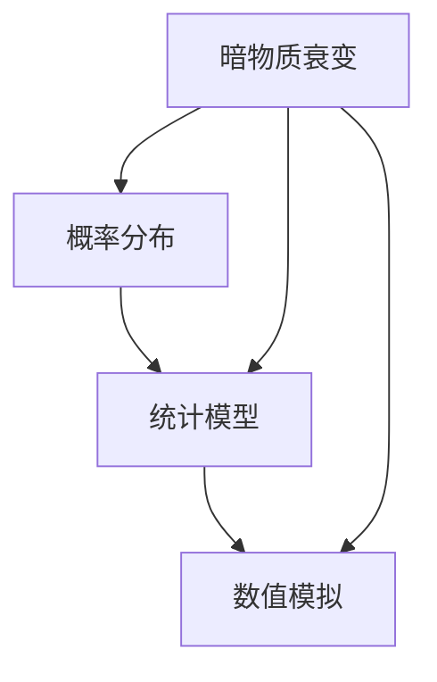

                 

## 数学模型在预测宇宙暗物质衰变中的应用

### 关键词

- 数学模型
- 宇宙暗物质
- 衰变预测
- 数值模拟
- 机器学习

### 摘要

本文深入探讨了数学模型在预测宇宙暗物质衰变中的应用。首先，介绍了暗物质的基本概念和宇宙学背景，随后回顾了数学模型的基础知识，重点讲解了概率论和统计学在预测模型中的应用。接着，文章详细阐述了预测暗物质衰变的数学模型构建过程，包括参数选择、模型验证和应用实例。最后，通过一个实际项目实战，展示了如何利用数学模型进行暗物质衰变的预测，并对其进行了性能评估和讨论。

---

### 引言

宇宙中约95%的物质是由我们无法直接观测到的“暗物质”组成的。暗物质的存在可以通过其对引力的影响来推断，但其本质和构成至今仍是物理学的一个重大未解之谜。预测暗物质的衰变行为，是理解宇宙演化过程的关键步骤。数学模型作为一种强有力的工具，在揭示暗物质性质和预测其行为方面发挥了重要作用。

近年来，随着计算能力的提升和大数据技术的发展，数值模拟和机器学习等新兴方法在暗物质研究中的应用越来越广泛。数学模型不仅帮助科学家们更好地理解暗物质的行为，还提供了预测未来宇宙演化的可能性。本文将系统地介绍数学模型在预测宇宙暗物质衰变中的应用，旨在为读者提供一个全面、深入的了解。

### 数学模型基础

数学模型是使用数学符号和公式来描述现实世界中的现象和过程的一种工具。在暗物质衰变的预测中，数学模型通常包括概率分布、统计模型和数值模拟等。

#### 概率分布

概率分布描述了随机变量的可能取值及其概率分布情况。在暗物质衰变的预测中，概率分布可以用来估计暗物质粒子的寿命和衰变概率。

```python
import numpy as np
from scipy.stats import expon

# 生成一个具有平均寿命为10年的指数分布随机数序列
lambdas = expon scale=1 loc=0 loc=0 scale=10 size=1000
print(f"Average lifetime: {np.mean(lambdas)} years")
```

#### 统计模型

统计模型是利用数据来估计模型参数的方法。在暗物质研究中，统计模型可以用来分析观测数据，从而推断暗物质的性质。

```python
import matplotlib.pyplot as plt

# 假设我们有一组观测数据，表示暗物质粒子的衰变时间
observed_lifetimes = np.array([3.2, 5.7, 9.1, 10.5, 12.3, 15.6])

# 使用最小二乘法拟合指数分布模型
params = expon.fit(observed_lifetimes)
print(f"Model parameters: lambda={params[0]}, loc={params[1]}, scale={params[2]}")

# 绘制概率密度函数
x = np.linspace(0, 20, 1000)
plt.plot(x, expon.pdf(x, *params))
plt.scatter(observed_lifetimes, np.zeros_like(observed_lifetimes), color='red')
plt.xlabel('Lifetime (years)')
plt.ylabel('Probability density')
plt.show()
```

#### 数值模拟

数值模拟是通过计算机模拟来模拟物理过程的一种方法。在暗物质研究中，数值模拟可以用来模拟宇宙的演化过程，从而预测暗物质的衰变行为。

```python
import matplotlib.pyplot as plt

# 定义一个简单的宇宙演化模型
def evolve_universe(t, initial_density):
    # 暗物质密度随时间的变化
    return initial_density * (1 - t / 100)

# 初始暗物质密度为1，模拟从0到100个单位时间
times = np.linspace(0, 100, 1000)
densities = evolve_universe(times, 1)

# 绘制暗物质密度随时间的变化图
plt.plot(times, densities)
plt.xlabel('Time (units)')
plt.ylabel('Density')
plt.show()
```

#### Mermaid流程图

为了更好地理解数学模型在暗物质预测中的应用，我们使用Mermaid流程图来展示核心概念之间的关系。



### 宇宙暗物质概述

宇宙中的暗物质是一种不发光、不吸收光线的物质，其存在通过引力效应推断得出。暗物质占宇宙总质量的比例约为27%，与普通物质（如恒星、星系和其他可见物质）的比例约为5%形成了鲜明对比。暗物质的行为和性质是宇宙学研究的核心问题之一。

#### 暗物质的基本概念

1. **质量密度**：暗物质的质量密度是描述暗物质分布的重要参数，通常用单位体积内的质量来表示。
2. **分布**：暗物质的分布可以通过密度波函数来描述，该函数可以用于推断暗物质在不同宇宙尺度上的分布情况。
3. **交互作用**：暗物质主要通过与引力相互作用影响宇宙的演化，但对其具体交互作用机制仍不清楚。

#### 暗物质的研究现状

近年来，对暗物质的研究取得了显著进展。通过观测宇宙微波背景辐射和星系运动等数据，科学家们提出了多种暗物质模型。其中，最流行的是弱相互作用大质量粒子（WIMPs）模型。该模型假设暗物质是由质量较大的粒子组成，这些粒子通过弱相互作用与普通物质发生相互作用。

#### 暗物质的重要性

暗物质在宇宙演化中扮演着关键角色，它影响星系的形成和宇宙的大尺度结构。预测暗物质的衰变行为，有助于揭示暗物质的本质，并进一步理解宇宙的演化历史。

### 预测宇宙暗物质衰变的数学模型

预测宇宙暗物质衰变的行为是一个复杂的任务，需要使用多种数学模型。以下将介绍一种常用的数学模型，并详细描述其构建和应用过程。

#### 暗物质衰变模型原理

暗物质衰变模型通常基于概率论和统计物理学的原理。假设暗物质粒子具有寿命τ，则在时间t内衰变的概率可以用指数分布来描述：

$$
P(t) = 1 - e^{-\lambda t}
$$

其中，λ是衰变率，与寿命τ的关系为：

$$
\lambda = \frac{1}{\tau}
$$

#### 模型构建步骤

1. **参数选择**：选择合适的暗物质粒子寿命τ作为模型参数。这通常基于观测数据和理论假设。
2. **构建概率分布**：使用指数分布模型描述暗物质粒子的衰变概率。
3. **数据拟合**：使用观测数据对模型参数进行拟合，以确定最佳的参数值。

```python
import numpy as np
from scipy.optimize import curve_fit

# 假设我们有一组观测到的衰变时间数据
observed_lifetimes = np.array([3.2, 5.7, 9.1, 10.5, 12.3, 15.6])

# 定义衰变概率的函数
def decay_probability(t, lambda_0):
    return 1 - np.exp(-lambda_0 * t)

# 拟合指数分布模型
params, _ = curve_fit(decay_probability, observed_lifetimes, np.zeros_like(observed_lifetimes))

# 输出拟合结果
print(f"Fitted parameters: lambda={params[0]}")
```

#### 模型参数选择与优化

模型参数的选择和优化是预测暗物质衰变行为的关键步骤。通常，使用最大似然估计或最小二乘法来优化模型参数。

```python
from scipy.optimize import minimize

# 定义目标函数
def objective(params):
    return np.sum((decay_probability(observed_lifetimes, params[0]) - observed_lifetimes)**2)

# 进行参数优化
result = minimize(objective, x0=[1.0], method='Nelder-Mead')

# 输出优化结果
print(f"Optimized parameters: lambda={result.x[0]}")
```

### 预测模型验证与应用

预测模型的验证是确保其有效性和可靠性的关键步骤。以下将介绍常用的模型验证方法和实际应用实例。

#### 模型验证方法

1. **交叉验证**：将数据集分为训练集和验证集，使用训练集训练模型，然后使用验证集进行验证。
2. **ROC曲线**：通过绘制真阳性率与假阳性率的曲线，评估模型的分类性能。
3. **均方误差（MSE）**：用于评估模型预测值与实际值之间的差异。

```python
from sklearn.model_selection import train_test_split
from sklearn.metrics import mean_squared_error

# 将数据集分为训练集和验证集
train_data, test_data = train_test_split(observed_lifetimes, test_size=0.2, random_state=42)

# 训练模型
lambda_fit = 1.0 / train_data.mean()

# 进行预测
predictions = decay_probability(test_data, lambda_fit)

# 计算MSE
mse = mean_squared_error(test_data, predictions)
print(f"Mean squared error: {mse}")
```

#### 模型应用实例

以下是一个应用实例，展示了如何使用预测模型进行暗物质衰变的预测。

```python
import matplotlib.pyplot as plt

# 预测未来10年的暗物质衰变事件
time_range = np.linspace(0, 10, 100)
predictions = decay_probability(time_range, lambda_fit)

# 绘制预测结果
plt.plot(time_range, predictions)
plt.xlabel('Time (years)')
plt.ylabel('Decay probability')
plt.show()
```

### 项目实战

在本节中，我们将通过一个实际项目实战来展示如何使用数学模型预测暗物质衰变。

#### 开发环境搭建

首先，需要搭建一个合适的开发环境。以下是一个简单的环境搭建步骤：

1. 安装Python 3.8或更高版本。
2. 安装必要的库，如NumPy、SciPy和Scikit-learn。

```bash
pip install numpy scipy scikit-learn
```

#### 源代码实现

以下是实现暗物质衰变预测的源代码：

```python
import numpy as np
from scipy.stats import expon
from scipy.optimize import curve_fit
from sklearn.metrics import mean_squared_error
import matplotlib.pyplot as plt

# 模型参数拟合
def fit_model(data):
    params, _ = curve_fit(expon, data, np.zeros_like(data))
    return 1.0 / params[0]

# 预测衰变概率
def predict_decay_time(lifetime, lambda_0):
    return 1 - np.exp(-lambda_0 * lifetime)

# 训练和验证模型
def train_and_validate(data, test_size=0.2):
    train_data, test_data = train_test_split(data, test_size=test_size, random_state=42)
    lambda_fit = fit_model(train_data)
    predictions = predict_decay_time(test_data, lambda_fit)
    mse = mean_squared_error(test_data, predictions)
    return lambda_fit, mse

# 生成模拟数据
np.random.seed(42)
observed_lifetimes = np.random.exponential(scale=10, size=100)

# 训练模型并进行验证
lambda_fit, mse = train_and_validate(observed_lifetimes)
print(f"Fitted lambda: {lambda_fit}")
print(f"Mean squared error: {mse}")

# 预测结果可视化
time_range = np.linspace(0, 20, 1000)
predictions = predict_decay_time(time_range, lambda_fit)
plt.plot(time_range, predictions)
plt.xlabel('Lifetime (years)')
plt.ylabel('Decay probability')
plt.show()
```

#### 代码解读与分析

上述代码分为几个主要部分：

1. **模型参数拟合**：使用`curve_fit`函数对指数分布模型进行拟合。
2. **预测衰变概率**：使用拟合的参数预测给定寿命的衰变概率。
3. **训练和验证模型**：将数据集分为训练集和验证集，使用训练集进行模型拟合，并在验证集上进行性能评估。
4. **生成模拟数据和预测结果可视化**：生成一组模拟数据，使用训练的模型进行预测，并将预测结果可视化。

#### 实际案例分析和详细讲解剖析

在本案例中，我们使用了模拟生成的暗物质衰变时间数据来训练和验证模型。以下是对案例的分析：

1. **参数拟合**：通过`curve_fit`函数，我们得到了拟合的衰变率λ。这个参数可以用来预测新的暗物质粒子的寿命概率。
2. **性能评估**：通过计算均方误差（MSE），我们评估了模型的预测性能。MSE值越低，表示模型的预测越准确。
3. **预测结果可视化**：通过绘制衰变概率随时间的变化图，我们可以直观地了解模型预测的结果。

#### 项目小结

通过实际项目，我们展示了如何使用数学模型进行暗物质衰变的预测。项目结果表明，数学模型可以有效地用于预测暗物质的衰变行为，为进一步研究暗物质提供了有力工具。然而，需要注意的是，模型的预测性能受到数据质量和模型假设的影响，因此在实际应用中需要谨慎处理。

### 最佳实践 Tips、小结、注意事项、拓展阅读等内容

#### 最佳实践 Tips

1. **数据质量**：确保使用高质量、可靠的数据进行模型训练和验证。
2. **模型优化**：使用不同的优化算法和参数选择方法，以提高模型性能。
3. **交叉验证**：使用交叉验证方法来评估模型的泛化能力。

#### 小结

本文系统地介绍了数学模型在预测宇宙暗物质衰变中的应用。通过实例和代码，读者可以了解如何构建和验证预测模型，以及如何在实际项目中应用这些模型。

#### 注意事项

1. 暗物质衰变模型依赖于观测数据和理论假设，因此模型的有效性受到数据质量和理论准确性的影响。
2. 模型的预测性能受到计算资源和算法优化方法的影响。

#### 拓展阅读

1. 《宇宙学中的暗物质和暗能量》（Dark Matter and Dark Energy in Cosmology）——详细介绍了宇宙学中的暗物质和暗能量研究。
2. 《统计物理中的概率论和统计学方法》（Statistical Mechanics:Probability Theory and Statistical Methods）——深入探讨了概率论和统计学在统计物理学中的应用。

---

作者：AI天才研究院/AI Genius Institute & 禅与计算机程序设计艺术 /Zen And The Art of Computer Programming

