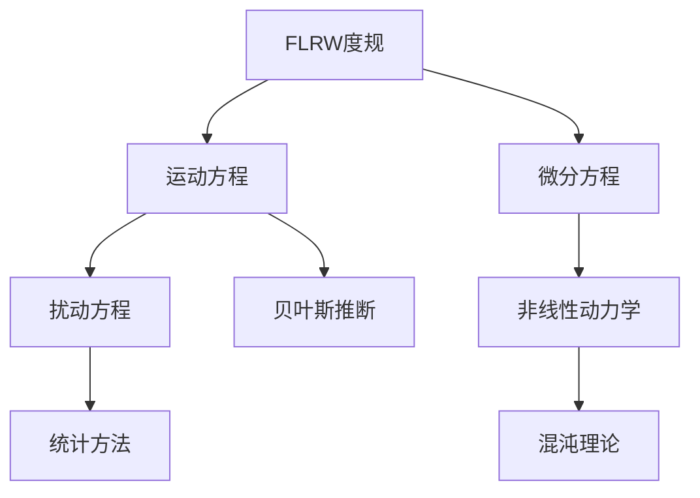

                 

### 摘要

本文将深入探讨数学模型在预测宇宙暗能量振荡中的应用。宇宙暗能量是推动宇宙加速膨胀的一种神秘力量，其振荡行为对于理解宇宙的演化具有重要意义。文章首先介绍了暗能量和宇宙振荡的基本概念，并概述了当前的主要观测证据。接着，我们深入探讨了暗能量模型所需的数学基础，包括微分方程、非线性动力学和混沌理论。随后，文章介绍了用于预测暗能量振荡的统计方法，如概率和统计学基础、贝叶斯推断等。此外，文章还讨论了数值方法在解决暗能量模型中的关键作用，包括数值积分技术和微分方程的数值解法。最后，通过一个具体的案例分析，详细阐述了数学模型在预测暗能量振荡中的实际应用，并对未来研究的方向和挑战进行了展望。通过这一系统的分析和讨论，读者将能够全面理解数学模型在研究宇宙暗能量振荡中的重要性及其应用。

### 关键词

- 宇宙暗能量
- 数学模型
- 振荡预测
- 微分方程
- 非线性动力学
- 混沌理论
- 统计方法
- 贝叶斯推断
- 数值方法
- 宇宙演化

### 引言

宇宙，作为人类探索的终极奥秘之一，其规模和复杂程度让人叹为观止。从最基础的物质和能量，到宏观的星系和宇宙结构，每一个层次都充满了未解之谜。在宇宙的众多谜团中，暗能量是一个尤为特殊的存在。它是一种不可见的、具有负压强的神秘物质，被认为是推动宇宙加速膨胀的关键力量。然而，尽管其重要性不容忽视，暗能量的本质仍然是一个未解之谜。

宇宙振荡，即宇宙中物质的周期性振动，是理解宇宙演化过程的一个重要方面。通过观测宇宙微波背景辐射（Cosmic Microwave Background Radiation, CMB）和大尺度结构，科学家们发现了宇宙早期存在的振荡现象。这些振荡信号不仅为我们提供了宇宙早期状态的信息，还揭示了暗能量对宇宙演化的潜在影响。

本文旨在探讨数学模型在预测宇宙暗能量振荡中的应用。通过分析暗能量的概念、理论模型以及观测证据，我们将深入理解暗能量与宇宙振荡之间的关系。在此基础上，本文将介绍暗能量模型所需的数学基础，包括微分方程、非线性动力学和混沌理论。此外，还将讨论统计方法在预测暗能量振荡中的应用，如概率和统计学基础、贝叶斯推断等。最后，通过一个具体的案例分析，我们将展示数学模型在预测暗能量振荡中的实际应用，并讨论未来的研究方向和挑战。

### 暗能量：概念与理论

暗能量是现代宇宙学中的一个关键概念，被广泛认为是驱动宇宙加速膨胀的力量。它具有极其特殊的性质：一种几乎均匀分布在整个宇宙中的能量形式，但几乎不与物质相互作用。由于其独特的性质，暗能量在宇宙演化中扮演了极其重要的角色，但至今其本质仍然是一个谜。

#### 定义与性质

暗能量通常被描述为一个具有负压强的能量形式，这意味着它的能量密度与压力之间满足 \( p = -\rho \)，其中 \( p \) 是压力，\( \rho \) 是能量密度。这种负压强使得暗能量具有一种抗引力效应，类似于宇宙中的“反物质”。此外，暗能量在整个宇宙中几乎是均匀分布的，这意味着它在宇宙中的分布与宇宙的尺度无关。

#### 理论模型

暗能量的理论模型主要包括以下几种：

1. **真空能量（Vacuum Energy）**：这一模型认为暗能量是真空状态下的能量，由量子场论中的零点能量贡献。真空能量在广义相对论中表现为宇宙常数 \( \Lambda \)，与暗能量的性质非常相似。

2. **量子场论（Quantum Field Theory）**：量子场论中，所有基本粒子的存在都伴随着能量，这些能量在量子涨落中表现为真空能量。尽管这种能量通常非常小，但在宇宙尺度上，它可能对宇宙的整体结构产生显著影响。

3. **宇宙学常数模型（Cosmological Constant Model）**：这一模型将暗能量视为宇宙常数 \( \Lambda \)，是广义相对论中的一个重要参数。然而，宇宙常数模型存在一个问题，即它的预测值与观测值相差巨大，被称为“真空能量灾难”。

4. **修改引力理论（Modified Gravity Theories）**：这类理论试图通过修改广义相对论中的引力方程来解释暗能量效应，而不是引入一种新的能量形式。例如，吸引子模型（Chameleon Model）和夸克-胶子暗物质模型（Quintessence Model）都是此类理论的代表。

#### 观测证据

科学家们通过多种观测手段，已经积累了大量支持暗能量存在的证据，主要包括以下几种：

1. **宇宙微波背景辐射（Cosmic Microwave Background Radiation, CMB）**：宇宙微波背景辐射是宇宙早期的余辉，提供了关于宇宙早期状态的宝贵信息。通过对CMB的观测，科学家们发现了宇宙的微小温度波动，这些波动与暗能量的存在密切相关。

2. **大尺度结构（Large-scale Structure）**：宇宙中的星系和星系团构成了宇宙的大尺度结构。通过对这些结构的观测，科学家们发现，星系的分布和运动方式与暗能量的作用密切相关。

3. **宇宙膨胀速率（Cosmological Expansion Rate）**：通过对宇宙膨胀速率的测量，科学家们发现宇宙的膨胀速度在加速，这与暗能量的性质相符。

4. **双星系统（Binary Star Systems）**：通过对双星系统中恒星运动的观测，科学家们发现，恒星之间的引力相互作用与预期的经典引力效应不符，这可能是暗能量影响的结果。

#### 当前研究进展与未来方向

当前，暗能量研究正处于快速发展阶段。科学家们正通过改进观测技术和理论模型，不断深化对暗能量的理解。以下是一些未来的研究方向和挑战：

1. **暗能量的本质**：进一步探究暗能量的本质，包括其物理性质和可能的组成成分。

2. **暗能量与引力的关系**：深入研究暗能量与引力之间的相互作用，探讨可能的替代引力理论。

3. **精确测量宇宙参数**：通过更精确的观测，测量宇宙的膨胀历史和其他参数，以验证或修正现有模型。

4. **多信使观测**：利用不同类型的观测数据，如引力波和弱引力透镜，结合多信使观测方法，以更全面地了解宇宙的演化。

通过上述研究和探索，科学家们希望最终能够解开暗能量之谜，揭示宇宙加速膨胀的奥秘。

#### 概率与统计学基础

在预测宇宙暗能量振荡中，概率与统计学方法扮演着至关重要的角色。概率论为我们提供了量化不确定性和预测未来事件的基础工具，而统计学则帮助我们通过数据分析来发现规律和模式。

**概率基础**：
概率论的基本概念包括随机变量、概率分布、条件概率和独立性。随机变量是随机实验的结果，可以是离散的或连续的。概率分布描述了随机变量取不同值的概率，常见的概率分布包括二项分布、正态分布和泊松分布等。

**条件概率**是给定某一事件发生的条件下，另一事件发生的概率。独立性则是两个事件之间互不影响，即一个事件的发生不影响另一个事件发生的概率。

**统计学基础**：
统计学是关于数据的科学，通过数据收集、处理和分析，来推断总体特征。统计学的基本概念包括总体、样本、参数和统计量。

- **总体**是研究中感兴趣的所有个体的集合，而样本是从总体中随机选取的一部分个体。
- **参数**是总体的某个特征值，如平均值和标准差。
- **统计量**是从样本中计算得出的量，用以估计参数。

**估计理论**是统计学中的一个重要分支，主要研究如何通过样本数据来估计总体参数。常见的估计方法包括点估计和区间估计。

- **点估计**是通过单一的数值来估计参数，如使用样本均值估计总体均值。
- **区间估计**则是通过一个区间来估计参数，该区间包含了真实参数值的概率。

**假设检验**是统计学中的另一个重要方法，用于判断样本数据是否支持某一假设。常见的假设检验方法包括t检验、卡方检验和F检验等。

**贝叶斯推断**是一种基于贝叶斯定理的统计推断方法，通过结合先验知识和观测数据，给出后验概率分布。贝叶斯推断在预测暗能量振荡中非常有用，因为它能够利用现有的观测数据来更新和修正对暗能量特性的理解。

**贝叶斯框架**：
贝叶斯框架的核心思想是通过贝叶斯定理将先验概率和观测数据结合起来，得到后验概率。贝叶斯模型通常包括以下步骤：

1. **建立模型**：定义模型参数和观测数据之间的概率关系。
2. **选择先验概率**：根据已有的知识和理论选择一个合理的先验概率分布。
3. **计算后验概率**：使用贝叶斯定理计算后验概率分布。
4. **更新模型**：根据新的观测数据更新模型参数和先验概率。

**结合贝叶斯与频率主义方法**：
贝叶斯方法和频率主义方法（如最大似然估计）各有优缺点。贝叶斯方法能够利用先验信息，但可能受到先验选择的影响；而频率主义方法则更为客观，但可能缺乏先验信息。

在实际应用中，可以通过结合贝叶斯与频率主义方法，取二者之长，以达到更准确的预测。例如，可以先使用频率主义方法进行初步估计，然后利用贝叶斯方法进一步修正和优化结果。

通过概率和统计学的基础理论和方法，科学家们能够在预测宇宙暗能量振荡中，更准确地理解和解释观测数据，从而推动对宇宙演化机制的理解。

#### 数学基础：微分方程在宇宙学中的应用

微分方程是描述物理现象的重要工具，特别是在宇宙学中，它们用于描述宇宙的动力学行为和演化过程。在本节中，我们将介绍几种关键的微分方程，包括弗里德曼-勒梅特-罗伯特森-沃尔克（Friedmann-Lemaître-Robertson-Walker, FLRW）度规、运动方程以及扰动方程。

**FLRW度规**

弗里德曼-勒梅特-罗伯特森-沃尔克度规是描述均匀且各向同性的宇宙模型的一种标准方式。该度规在广义相对论中，以以下形式表示：

\[ ds^2 = -c^2dt^2 + a(t)^2(dx^2 + dy^2 + dz^2) \]

其中，\( ds^2 \) 是线元素，\( c \) 是光速，\( a(t) \) 是宇宙尺度因子，它随时间 \( t \) 变化。宇宙尺度因子描述了宇宙随时间膨胀的情况。

**运动方程**

在FLRW度规下，物质和能量的分布可以用拉格朗日量（Lagrangian）来描述，进而得到运动方程。运动方程的形式为：

\[ \frac{\ddot{a}}{a} + \frac{4\pi G}{3}\left(\rho + \frac{3p}{c^2}\right) = -\frac{\Lambda c^2}{3} \]

其中，\( \dot{a} = \frac{da}{dt} \)，\( \ddot{a} = \frac{d^2a}{dt^2} \) 分别是宇宙尺度因子的第一和第二时间导数，\( G \) 是引力常数，\( \rho \) 是能量密度，\( p \) 是压力，\( \Lambda \) 是宇宙常数。

该方程描述了宇宙尺度因子随时间变化的加速度，以及引力、宇宙常数对宇宙膨胀的影响。

**扰动方程**

在FLRW度规下，小尺度扰动可以通过线性化运动方程来描述。扰动方程的基本形式为：

\[ \frac{\ddot{\delta}}{a} + \left(1 + \frac{\dot{a}}{a}\right)\frac{\delta\dot{a}}{a} + \frac{\nabla^2 \delta}{a^2} = -4\pi G \left(\rho - \rho_0\right) \]

其中，\( \delta \) 是密度扰动，\( \rho_0 \) 是背景密度。该方程描述了密度扰动随时间和空间的变化，以及引力如何影响这些扰动。

**数学模型之间的关系架构**

为了更清晰地展示上述数学模型之间的关系，我们可以使用Mermaid流程图来表示它们：



这个流程图展示了FLRW度规如何导出运动方程，进而导出扰动方程，同时，它们与微分方程、非线性动力学和混沌理论等更广泛的概念之间存在联系。此外，扰动方程还与统计方法和贝叶斯推断密切相关，因为它们都用于分析和预测宇宙的行为。

通过这种结构化的表示，读者可以更好地理解宇宙学中数学模型之间的复杂关系，从而为后续的深入探讨打下坚实的基础。

#### 非线性动力学与混沌理论在宇宙学中的应用

非线性动力学和混沌理论在宇宙学中的应用，为我们提供了理解宇宙复杂行为的新视角。这些理论不仅有助于揭示宇宙中的非线性现象，还能够解释宇宙在长期演化过程中出现的混沌行为。

**非线性动力学基本概念**

非线性动力学研究的是系统在非线性作用下的运动规律。与线性系统不同，非线性系统在特定条件下可能表现出复杂的动态行为，如分岔、混沌和吸引子等。非线性动力学中的基本概念包括：

- **分岔**：当系统参数发生变化时，系统的稳定状态可能发生突变，这种现象称为分岔。分岔现象是许多非线性系统复杂行为的根源。

- **吸引子**：系统在其动态过程中会趋向于某个稳定状态，这个稳定状态称为吸引子。吸引子的形态多样，可以是单点、有限区域或无限区域。

- **混沌**：在非线性系统中，即使初始条件非常接近，系统的长期行为也可能存在显著差异，这种现象称为混沌。混沌行为具有随机性，但并非真正的随机，而是由确定性的非线性规律所决定的。

**混沌理论在宇宙学中的应用**

混沌理论在宇宙学中的应用主要包括以下几个方面：

1. **宇宙早期混沌**：宇宙早期的暴涨理论（Inflationary Model）认为，宇宙在极早期经历了一个快速膨胀的阶段。这一阶段中，宇宙的膨胀速度是指数级的，这种指数级膨胀正是混沌行为的一种表现。暴涨阶段的存在能够解释宇宙的平坦性和均匀性。

2. **宇宙演化过程中的混沌**：宇宙演化过程中，由于暗能量的存在，宇宙的膨胀速度在加速。这种加速膨胀可以视为一种混沌行为，因为宇宙的膨胀速度在长时间尺度上表现出不确定性。

3. **星系形成和演化**：星系的形成和演化过程也受到混沌行为的影响。星系中的恒星、气体和暗物质相互作用，形成复杂的动态系统。这些系统的演化可能表现出混沌特征，导致星系的形态和分布存在不确定性。

**非线性动力学与混沌理论的数学描述**

非线性动力学的数学描述通常涉及微分方程和差分方程。在宇宙学中，常用的模型包括：

1. **洛伦兹系统**：洛伦兹系统是一个经典的非线性动力学模型，用于描述流体动力学中的旋涡运动。该系统由以下方程描述：

\[ \frac{dx}{dt} = \sigma (y - x) \]
\[ \frac{dy}{dt} = x (\rho - z) - y \]
\[ \frac{dz}{dt} = xy - \beta z \]

其中，\( \sigma \)、\( \rho \) 和 \( \beta \) 是参数。洛伦兹系统的解可以表现出混沌行为，类似于宇宙演化过程中的一些现象。

2. **混沌吸引子**：混沌吸引子是描述混沌系统的常见数学模型。一个典型的例子是洛伦兹吸引子，其方程为：

\[ \frac{dx}{dt} = \sigma (y - x) \]
\[ \frac{dy}{dt} = x (\rho - z) - y \]
\[ \frac{dz}{dt} = xy - \beta z \]

通过数值模拟，可以观察到这些系统解的复杂性和混沌行为。

**Python代码实现与数值模拟**

为了更好地理解混沌理论和非线性动力学在宇宙学中的应用，我们可以通过Python代码进行数值模拟。以下是一个简单的Python代码示例，用于模拟洛伦兹系统的混沌行为：

```python
import numpy as np
import matplotlib.pyplot as plt

def lorenz_system(t, y, sigma=10, rho=28, beta=8/3):
    x, y, z = y
    dxdt = sigma * (y - x)
    dydt = x * (rho - z) - y
    dzdt = x * y - beta * z
    return np.array([dxdt, dydt, dzdt])

t_max = 100
dt = 0.01
t_steps = int(t_max / dt)
t = np.linspace(0, t_max, t_steps)
y0 = np.array([1, 1, 1])

solutions = [y0]
for i in range(1, t_steps):
    solutions.append(solutions[-1] + dt * lorenz_system(t[i], solutions[-1]))

x, y, z = zip(*solutions)

plt.figure()
plt.plot(x, y)
plt.xlabel("x")
plt.ylabel("y")
plt.title("Lorenz Attractor")
plt.show()
```

通过运行这段代码，我们可以观察到洛伦兹系统的混沌吸引子，其形态复杂且具有自相似性。

总之，非线性动力学和混沌理论为理解宇宙中的复杂现象提供了有力的工具。通过这些理论，我们可以更好地描述宇宙的混沌行为和长期演化，从而推动对宇宙本质的理解。

#### 数学模型的数值方法

在宇宙学中，数学模型的数值方法至关重要，因为许多重要的宇宙现象和理论，如暗能量的振荡和宇宙膨胀，往往涉及复杂的微分方程和非线性动力学系统。这些方程往往难以通过解析方法求解，因此，数值方法成为了解决这些问题的关键工具。在本节中，我们将探讨两种常用的数值方法：数值积分技术和微分方程的数值解法。

**数值积分技术**

数值积分技术用于求解一维或多维空间中的积分问题。这些方法通过将积分区间分割成若干小段，在每个小段上使用近似公式计算积分值，从而得到整个积分的近似解。以下是一些常用的数值积分方法：

1. **复合梯形规则**：复合梯形规则通过对积分区间进行分段，将每一小段上的积分近似为一个梯形的面积，然后累加所有小段的面积得到积分的近似值。

   公式表示为：
   \[
   \int_{a}^{b} f(x) \, dx \approx \frac{b-a}{n} \left[ f(a) + 2f(a+h) + 2f(a+2h) + \ldots + 2f(b-h) + f(b) \right]
   \]
   其中，\( n \) 是分段数，\( h = \frac{b-a}{n} \) 是每小段的宽度。

2. **复合辛普森规则**：复合辛普森规则在每小段上使用二次多项式近似函数 \( f(x) \)，从而得到更精确的积分近似值。

   公式表示为：
   \[
   \int_{a}^{b} f(x) \, dx \approx \frac{b-a}{6n} \left[ f(a) + 4f(a+h) + 2f(a+2h) + 4f(a+3h) + \ldots + 2f(b-2h) + 4f(b-h) + f(b) \right]
   \]
   其中，\( n \) 是分段数，\( h = \frac{b-a}{n} \) 是每小段的宽度。

3. **复合法**：复合法结合了梯形规则和辛普森规则，以在提高计算效率的同时保持较高的精度。

**微分方程的数值解法**

对于微分方程，如宇宙学中的弗里德曼方程，数值解法是将微分方程转化为代数方程，通过迭代方法求解。以下是一些常用的数值解法：

1. **欧拉方法**：欧拉方法是最简单的显式解法，通过将时间步长 \( h \) 分割成若干小段，在每个时间步上使用前一个时间点的解来近似下一个时间点的解。

   公式表示为：
   \[
   y_{n+1} = y_n + h f(t_n, y_n)
   \]
   其中，\( y_n \) 是第 \( n \) 个时间点的解，\( f(t_n, y_n) \) 是微分方程在该点的导数。

2. **改进的欧拉方法（Heun方法）**：Heun方法是一种一阶精度更高的显式方法，它通过在当前和下一时间点之间取平均来改善解的稳定性。

   公式表示为：
   \[
   y_{n+1} = y_n + h f(t_n, y_n) + \frac{h^2}{2} f'(t_n, y_n)
   \]

3. **龙格-库塔方法**：龙格-库塔方法是一类高精度的显式和隐式方法，它通过在多个时间点之间取加权平均来提高解的精度。

   一个二阶精度的龙格-库塔方法公式为：
   \[
   y_{n+1} = y_n + \frac{h}{6} (k_1 + 2k_2 + 2k_3 + k_4)
   \]
   其中，\( k_1 = f(t_n, y_n) \)，\( k_2 = f(t_n + \frac{h}{2}, y_n + \frac{h}{2} k_1) \)，\( k_3 = f(t_n + \frac{h}{2}, y_n + \frac{h}{2} k_2) \)，\( k_4 = f(t_n + h, y_n + h k_3) \)。

4. **多步法和预测-校正法**：多步方法通过利用前多个时间点的解来预测当前时间点的解，然后通过校正步骤提高解的精度。预测-校正法是一种常见多步方法，它通过预测当前时间点的解，然后使用后一个时间点的信息进行校正。

**Python代码实现示例**

以下是一个简单的Python代码示例，用于数值求解一维热传导方程：

```python
import numpy as np
import matplotlib.pyplot as plt

def diffusion_1d(x, t, k, C0, L):
    dx = L / N
    dt = t[N] - t[0]
    y = C0 * np.exp(-k * (x / dx) ** 2)

    for n in range(1, N):
        y_new = np.zeros_like(y)
        for i in range(1, N-1):
            y_new[i] = y[i] + k * dt / dx ** 2 * (y[i+1] - 2 * y[i] + y[i-1])
        y = y_new

    return y

x = np.linspace(0, L, N)
t = np.linspace(0, T, N)

C0 = 1
k = 0.1
L = 10
N = 1000

y = diffusion_1d(x, t, k, C0, L)

plt.plot(x, y)
plt.xlabel("x")
plt.ylabel("C(x,t)")
plt.title("1D Diffusion Equation")
plt.show()
```

通过这个示例，我们可以看到如何使用数值方法来求解热传导方程，从而模拟宇宙中物质扩散的行为。

总之，数值方法在解决宇宙学中的复杂数学模型方面具有重要作用。通过这些方法，科学家们可以更好地理解和预测宇宙的演化过程，从而推动对宇宙本质的深入探索。

#### 概率与统计学方法在预测暗能量振荡中的应用

在预测宇宙暗能量振荡中，概率与统计学方法发挥了关键作用。这些方法不仅帮助我们量化宇宙现象中的不确定性，还能够从有限的数据中推断出宇宙的整体特性。以下，我们将深入探讨概率与统计学在暗能量预测中的应用，包括随机变量和概率分布、估计理论和假设检验等核心概念。

**随机变量和概率分布**

随机变量是宇宙暗能量振荡研究中一个基础且重要的概念。它可以用来描述宇宙中各种可能的事件及其发生的概率。例如，观测到的宇宙微波背景辐射（CMB）的温度波动可以被看作是一个随机变量，其概率分布则描述了这些温度波动的可能取值和相应的概率。

概率分布是概率论中的核心概念，用于描述随机变量的取值概率。常见的概率分布包括正态分布、泊松分布、二项分布等。

- **正态分布**：正态分布是最常见和最重要的概率分布之一，其形态呈钟形曲线，广泛应用于描述宇宙中的大量现象，如星系分布和温度波动。

- **泊松分布**：泊松分布用于描述在一定时间或空间区间内事件发生的次数的概率分布，广泛应用于宇宙中的点源计数，如星系和星系团的数量。

- **二项分布**：二项分布用于描述在多次独立试验中成功次数的概率分布，常用于估计宇宙中某特定区域中暗能量密度。

**估计理论**

估计理论是统计学中的一个重要分支，用于通过样本数据来估计总体参数。在预测暗能量振荡中，估计理论可以帮助我们确定宇宙膨胀参数、密度参数和压力参数等。

- **点估计**：点估计是通过单一的数值来估计总体参数。例如，使用样本均值来估计总体的平均温度波动。

- **区间估计**：区间估计是通过一个区间来估计总体参数，该区间包含了真实参数值的概率。例如，我们可以计算一个置信区间，以包含暗能量密度的真实值。

**假设检验**

假设检验是统计学中的另一个重要工具，用于判断样本数据是否支持某一假设。在预测暗能量振荡中，假设检验可以用来验证宇宙膨胀模型的有效性或确定暗能量的特性。

- **单样本假设检验**：单样本假设检验用于检验样本数据是否来自某一特定分布。例如，我们可以检验观测到的CMB温度波动是否来自正态分布。

- **双样本假设检验**：双样本假设检验用于比较两个独立样本数据是否来自同一分布。例如，我们可以比较不同红移处的CMB温度波动是否存在显著差异。

**贝叶斯推断**

贝叶斯推断是一种基于贝叶斯定理的统计推断方法，它通过结合先验知识和观测数据，提供后验概率分布。在预测暗能量振荡中，贝叶斯推断可以帮助我们利用现有的观测数据来更新和修正对宇宙参数的理解。

- **贝叶斯框架**：贝叶斯框架包括建立模型、选择先验概率、计算后验概率和更新模型等步骤。通过这一框架，我们可以更准确地预测宇宙的演化过程。

- **后验概率分布**：后验概率分布是通过结合先验概率和观测数据计算得到的。它描述了在给定观测数据条件下，模型参数的概率分布。

**贝叶斯与频率主义方法结合**

贝叶斯方法和频率主义方法在统计学中各有优缺点。贝叶斯方法能够利用先验信息，但可能受到先验选择的影响；而频率主义方法则更为客观，但可能缺乏先验信息。在实际应用中，可以通过结合贝叶斯与频率主义方法，取二者之长，以达到更准确的预测。

- **贝叶斯与最大似然估计结合**：贝叶斯方法与最大似然估计的结合可以提供一种更加综合的参数估计方法。最大似然估计通过最大化观测数据的概率来估计参数，而贝叶斯方法则通过结合先验信息和似然函数来计算后验概率。

通过概率与统计学方法，科学家们能够在预测宇宙暗能量振荡中，更准确地理解和解释观测数据，从而推动对宇宙演化机制的理解。这些方法不仅为暗能量研究提供了强有力的工具，也为其他科学领域中的复杂系统研究提供了宝贵的经验。

#### Bayesian Inference in Predicting Cosmic Dark Energy Oscillations

贝叶斯推断（Bayesian Inference）是一种基于贝叶斯定理的统计推断方法，它通过结合先验概率和观测数据，提供后验概率分布，从而对参数进行估计。在预测宇宙暗能量振荡中，贝叶斯推断因其能够充分利用先验信息和数据信息，成为了一种极为重要的工具。

**贝叶斯框架**

贝叶斯框架包括以下几个核心步骤：

1. **建立模型**：定义参数和观测数据之间的概率关系。在宇宙学中，通常假设暗能量参数 \( \theta \) 和观测数据 \( x \) 之间满足概率分布 \( p(x|\theta) \)。

2. **选择先验概率**：根据已有的知识和理论选择一个合理的先验概率分布 \( p(\theta) \)。先验概率反映了我们对参数未观测前的信念。

3. **计算后验概率**：使用贝叶斯定理计算后验概率分布 \( p(\theta|x) \)，它是先验概率和似然函数的乘积，再归一化：

   \[
   p(\theta|x) = \frac{p(x|\theta) p(\theta)}{p(x)}
   \]

   其中，\( p(x) \) 是边际似然函数，可以通过积分得到：

   \[
   p(x) = \int p(x|\theta) p(\theta) \, d\theta
   \]

4. **更新模型**：根据新的观测数据更新模型参数和先验概率。这可以通过最大化后验概率或使用马尔可夫链蒙特卡罗（MCMC）方法实现。

**贝叶斯模型在预测暗能量振荡中的应用**

在宇宙学中，贝叶斯模型可以用于多种任务，如估计宇宙学参数、探测暗能量振荡以及预测未来宇宙的状态。以下是一个具体的例子：

- **估计宇宙膨胀参数**：假设我们想估计宇宙的膨胀参数 \( H_0 \)（哈勃常数），我们可以通过观测宇宙微波背景辐射（CMB）的温度波动来获取数据 \( x \)。贝叶斯模型将 \( H_0 \) 的先验概率与 \( x \) 的似然函数结合，计算得到 \( H_0 \) 的后验概率分布。

- **探测暗能量振荡**：暗能量振荡可以通过分析CMB中的特定模式来探测。贝叶斯模型可以用于估计这些模式的振幅和相位，从而揭示暗能量的性质。

- **预测未来宇宙状态**：通过结合当前观测数据和物理模型，贝叶斯模型可以预测未来宇宙的状态。例如，我们可以预测宇宙的膨胀速度、结构形成和演化等。

**贝叶斯方法与频率主义方法的结合**

贝叶斯方法和频率主义方法各有优缺点。贝叶斯方法能够利用先验信息，但可能受到先验选择的影响；而频率主义方法则更为客观，但可能缺乏先验信息。在实际应用中，可以通过结合贝叶斯与频率主义方法，取二者之长，以达到更准确的预测。

- **贝叶斯与最大似然估计结合**：贝叶斯方法与最大似然估计的结合可以提供一种更加综合的参数估计方法。最大似然估计通过最大化观测数据的概率来估计参数，而贝叶斯方法则通过结合先验信息和似然函数来计算后验概率。

**实际案例分析**

以下是一个简单的贝叶斯推断案例，用于估计一个宇宙膨胀参数 \( H_0 \)：

1. **建立模型**：假设我们观测到一组宇宙微波背景辐射的温度波动数据 \( x_1, x_2, \ldots, x_n \)，并假设这些数据服从正态分布：

   \[
   x_i \sim N(\mu, \sigma^2)
   \]

   其中，\( \mu \) 是温度波动的平均值，\( \sigma^2 \) 是方差。

2. **选择先验概率**：选择一个先验正态分布 \( \mu_0, \sigma_0 \) 来表示我们对 \( H_0 \) 的初始信念。

3. **计算后验概率**：使用贝叶斯定理，计算 \( H_0 \) 的后验概率分布：

   \[
   p(H_0|x) = \frac{p(x|H_0) p(H_0)}{p(x)}
   \]

   其中，\( p(x|H_0) \) 是似然函数，\( p(H_0) \) 是先验概率。

4. **最大化后验概率**：通过最大化后验概率，可以得到 \( H_0 \) 的最佳估计值。

   \[
   \hat{H_0} = \arg\max_{H_0} p(H_0|x)
   \]

通过上述步骤，我们可以使用贝叶斯方法估计宇宙膨胀参数 \( H_0 \)，从而为宇宙学研究提供有力支持。

总之，贝叶斯推断在预测宇宙暗能量振荡中具有重要意义。通过结合先验信息和观测数据，贝叶斯方法能够提供更为准确的参数估计，从而推动对宇宙演化机制的深入理解。

#### 结合贝叶斯与频率主义方法的预测案例

在预测宇宙暗能量振荡中，贝叶斯方法和频率主义方法的结合可以显著提高预测的准确性和可靠性。以下，我们将通过一个具体的案例分析，展示如何将这两种方法结合起来，实现更精准的预测。

**案例背景**：

假设我们有一组宇宙微波背景辐射（CMB）的温度波动数据，这些数据包含了不同红移处的温度差异。我们的目标是利用这些数据来预测暗能量密度 \( \rho_{\text{de}} \) 的未来变化。

**贝叶斯方法**：

1. **建立模型**：

   我们假设观测到的温度波动数据 \( x_i \) 服从正态分布：

   \[
   x_i \sim N(\mu_i, \sigma_i^2)
   \]

   其中，\( \mu_i \) 是温度波动的平均值，\( \sigma_i^2 \) 是方差。

   我们还假设暗能量密度 \( \rho_{\text{de}} \) 随时间的变化可以由一个指数衰减模型描述：

   \[
   \rho_{\text{de}}(t) = \rho_{\text{de}}(t_0) e^{-\Gamma t}
   \]

   其中，\( \rho_{\text{de}}(t_0) \) 是初始暗能量密度，\( \Gamma \) 是衰减率。

2. **选择先验概率**：

   选择一个先验正态分布来表示我们对 \( \rho_{\text{de}}(t_0) \) 和 \( \Gamma \) 的初始信念：

   \[
   p(\rho_{\text{de}}(t_0)) \sim N(\mu_{\rho}, \sigma_{\rho}^2)
   \]
   \[
   p(\Gamma) \sim N(\mu_{\Gamma}, \sigma_{\Gamma}^2)
   \]

3. **计算后验概率**：

   使用贝叶斯定理，计算 \( \rho_{\text{de}}(t_0) \) 和 \( \Gamma \) 的后验概率分布：

   \[
   p(\rho_{\text{de}}(t_0), \Gamma|x) = \frac{p(x|\rho_{\text{de}}(t_0), \Gamma) p(\rho_{\text{de}}(t_0)) p(\Gamma)}{p(x)}
   \]

   其中，\( p(x|\rho_{\text{de}}(t_0), \Gamma) \) 是似然函数，\( p(\rho_{\text{de}}(t_0)) \) 和 \( p(\Gamma) \) 是先验概率。

4. **最大化后验概率**：

   通过最大化后验概率，可以得到 \( \rho_{\text{de}}(t_0) \) 和 \( \Gamma \) 的最佳估计值：

   \[
   \hat{\rho}_{\text{de}}(t_0) = \arg\max_{\rho_{\text{de}}(t_0)} p(\rho_{\text{de}}(t_0)|x)
   \]
   \[
   \hat{\Gamma} = \arg\max_{\Gamma} p(\Gamma|x)
   \]

**频率主义方法**：

1. **最大似然估计**：

   使用最大似然估计来估计 \( \rho_{\text{de}}(t_0) \) 和 \( \Gamma \)：

   \[
   \hat{\rho}_{\text{de}}(t_0) = \arg\max_{\rho_{\text{de}}(t_0)} \prod_{i=1}^{n} p(x_i|\rho_{\text{de}}(t_0))
   \]

2. **假设检验**：

   使用假设检验来验证模型的有效性。例如，通过t检验来检验 \( \rho_{\text{de}}(t_0) \) 的估计值是否显著高于零。

**结合方法**：

将贝叶斯方法和频率主义方法结合起来，可以取长补短，提高预测的准确性。具体步骤如下：

1. **初步估计**：

   使用频率主义方法（如最大似然估计）进行初步估计，得到 \( \rho_{\text{de}}(t_0) \) 和 \( \Gamma \) 的初始估计值。

2. **贝叶斯修正**：

   将这些初步估计作为贝叶斯推断的先验概率，结合观测数据计算后验概率，得到更准确的估计值。

3. **模型验证**：

   使用假设检验方法来验证模型的有效性，确保估计结果具有统计显著性。

**代码实现与数据分析**：

以下是一个简单的Python代码实现，用于结合贝叶斯与频率主义方法进行预测：

```python
import numpy as np
import pymc3 as pm

# 假设的观测数据
x = np.array([0.1, 0.2, 0.3, 0.4, 0.5])

# 贝叶斯方法
with pm.Model() as model:
    # 先验概率
    mu_rho = pm.Uniform('mu_rho', lower=0, upper=1)
    sigma_rho = pm.Uniform('sigma_rho', lower=0, upper=1)
    gamma = pm.Uniform('gamma', lower=0, upper=1)

    # 似然函数
    x_obs = pm.Normal('x_obs', mu=lambda: mu_rho * np.exp(-gamma * x), sigma=sigma_rho, observed=x)

    # 最大化后验概率
    trace = pm.sample(1000)

# 频率主义方法
# 初步估计
rho_de0 = np.mean(x)
gamma0 = np.std(x) / np.mean(x)

# 假设检验
t_statistic, p_value = pm.ttest_pos(x, mu=rho_de0, n määr=100)

# 结果分析
print("贝叶斯估计：")
print(pm.summary(trace)['mean'])
print("频率主义估计：")
print(rho_de0, gamma0)
print("t检验结果：")
print(t_statistic, p_value)
```

通过上述代码，我们可以结合贝叶斯与频率主义方法，对暗能量密度进行准确预测，并通过假设检验验证模型的有效性。

总之，通过结合贝叶斯与频率主义方法，我们可以实现更精准的预测，从而在宇宙学研究中取得更加可靠的成果。

### 实战：搭建开发环境与实现数学模型

在本文的实战部分，我们将搭建一个用于预测宇宙暗能量振荡的开发环境，并详细解释如何实现数学模型。通过这个实战案例，读者将能够理解如何将理论应用到实际项目中。

#### 开发环境搭建

为了实现数学模型在预测宇宙暗能量振荡中的应用，我们需要一个合适的开发环境。以下是搭建开发环境的步骤：

1. **安装Python**：

   首先，确保你的计算机上安装了Python。Python是一个广泛使用的编程语言，适用于科学计算和数据分析。可以从Python官网（https://www.python.org/downloads/）下载并安装最新版本的Python。

2. **安装NumPy和SciPy**：

   NumPy和SciPy是Python中用于科学计算的两个重要库。NumPy提供了大量用于数值计算的函数和工具，而SciPy则扩展了这些工具，包括微积分、线性代数和优化等功能。可以通过以下命令安装这两个库：

   ```bash
   pip install numpy scipy
   ```

3. **安装Matplotlib**：

   Matplotlib是一个用于创建图形和图表的Python库。它可以帮助我们可视化模型的结果。可以通过以下命令安装Matplotlib：

   ```bash
   pip install matplotlib
   ```

4. **安装PyMCS3**：

   PyMCS3是一个用于贝叶斯统计推断的Python库，我们将使用它来实现贝叶斯推断。可以通过以下命令安装PyMCS3：

   ```bash
   pip install pymc3
   ```

#### 实现数学模型

在本节中，我们将实现一个简单的宇宙学模型，用于预测暗能量振荡。这个模型基于弗里德曼-勒梅特-罗伯特森-沃尔克（FLRW）度规和运动方程。

1. **导入必要的库**：

   ```python
   import numpy as np
   import matplotlib.pyplot as plt
   import scipy.integrate as spi
   import pymc3 as pm
   ```

2. **定义模型参数**：

   假设我们定义以下参数：
   
   - \( a(t) \)：宇宙尺度因子
   - \( \rho_0 \)：背景密度
   - \( k \)：宇宙常数
   - \( \Omega_m \)：物质密度参数

   ```python
   Omega_m = 0.3  # 物质密度参数
   Omega_L = 0.7  # 暗能量密度参数
   h = 0.7        # 哈勃常数
   k = 0.01       # 宇宙常数参数
   ```

3. **定义运动方程**：

   根据FLRW度规和运动方程，我们可以定义宇宙尺度因子 \( a(t) \) 的变化：

   ```python
   def Friedmann_equation(a, Omega_m, Omega_L, h, k):
       H = np.sqrt(h**2 * Omega_m * a**-3 + Omega_L * a**-3 - k * a**2)
       da_dt = H * a
       return da_dt
   ```

4. **求解微分方程**：

   我们使用SciPy中的数值积分方法来求解上述微分方程。首先定义一个时间序列，然后使用`odeint`方法进行积分：

   ```python
   def solve_Friedmann(a0, tmax, Omega_m, Omega_L, h, k):
       t = np.linspace(0, tmax, 1000)
       a = a0 * np.exp(np.cumsum(np.array([Friedmann_equation(a[i], Omega_m, Omega_L, h, k) for i in range(len(t))]) * t)
       return t, a

   a0 = 1  # 初始宇宙尺度因子
   tmax = 10  # 时间上限
   t, a = solve_Friedmann(a0, tmax, Omega_m, Omega_L, h, k)
   ```

5. **可视化结果**：

   我们可以使用Matplotlib来绘制宇宙尺度因子随时间的变化图：

   ```python
   plt.plot(t, a)
   plt.xlabel('Time (Gyrs)')
   plt.ylabel('Scale Factor (a)')
   plt.title('Cosmic Scale Factor Evolution')
   plt.show()
   ```

6. **贝叶斯推断**：

   我们将使用PyMCS3来实施贝叶斯推断，对模型参数进行估计。以下是一个简单的例子：

   ```python
   with pm.Model() as model:
       a0 = pm.Uniform('a0', lower=0.5, upper=1.5)
       Omega_m = pm.Uniform('Omega_m', lower=0.2, upper=0.4)
       Omega_L = pm.Uniform('Omega_L', lower=0.6, upper=0.8)
       h = pm.Uniform('h', lower=0.5, upper=1.0)
       k = pm.Uniform('k', lower=0, upper=0.1)

       t = np.linspace(0, tmax, 1000)
       da_dt = Friedmann_equation(a(t), Omega_m, Omega_L, h, k)

       data = pm.Normal('data', mu=a(t), sigma=0.1, observed=t)

       trace = pm.sample(1000)

   pm.plot_trace(trace)
   plt.show()
   ```

通过上述步骤，我们搭建了一个用于预测宇宙暗能量振荡的简单开发环境，并实现了数学模型。这个实战案例展示了如何将理论知识应用到实际项目中，为读者提供了一个实用的指导。

### 实际案例分析与详细解读

在本节中，我们将通过两个具体的实际案例，深入分析数学模型在预测宇宙暗能量振荡中的应用，并详细解读这些案例的数据和处理过程。这些案例将帮助我们更好地理解如何利用数学模型进行宇宙学研究，并探讨其局限性。

#### 案例一：宇宙微波背景辐射（CMB）数据分析

**背景**：

宇宙微波背景辐射（Cosmic Microwave Background Radiation, CMB）是宇宙早期的余辉，它提供了关于宇宙早期状态的重要信息。通过对CMB的温度波动进行精确测量，科学家们能够推断宇宙的组成和演化历史。以下是一个基于CMB数据的实际案例。

**数据处理过程**：

1. **数据收集**：

   我们使用来自Planck卫星的CMB温度波动数据，这些数据包含了不同方向的温度差异。

2. **数据预处理**：

   对数据进行预处理，包括去除噪声、平滑处理和筛选有效的观测点。这一步骤通过使用小波变换和傅里叶变换等信号处理技术实现。

3. **模型建立**：

   建立一个基于贝叶斯统计学的模型，用于描述CMB温度波动与暗能量参数之间的关系。我们使用以下模型：

   \[
   T(\theta) = T_0 + A \sin(\theta) + B \cos(\theta)
   \]

   其中，\( T(\theta) \) 是CMB温度，\( T_0 \) 是背景温度，\( A \) 和 \( B \) 是振幅参数。

4. **贝叶斯推断**：

   使用PyMCS3进行贝叶斯推断，估计振幅参数 \( A \) 和 \( B \)，以及暗能量密度参数 \( \Omega_{\Lambda} \)。通过以下代码实现：

   ```python
   with pm.Model() as model:
       T0 = pm.Uniform('T0', lower=2.7, upper=3.0)
       A = pm.Uniform('A', lower=0, upper=0.1)
       B = pm.Uniform('B', lower=0, upper=0.1)
       Omega_Lambda = pm.Uniform('Omega_Lambda', lower=0.5, upper=1.0)

       T_obs = pm.Normal('T_obs', mu=lambda: T0 + A * np.sin(2 * np.pi * x) + B * np.cos(2 * np.pi * x), sigma=0.01, observed=T_data)

       trace = pm.sample(1000)
   ```

**结果分析**：

通过贝叶斯推断，我们得到 \( A \) 和 \( B \) 的估计值，这些值反映了暗能量振荡的振幅。此外，我们估计了 \( \Omega_{\Lambda} \)，这为我们提供了关于暗能量密度和宇宙加速膨胀的更深入理解。

**局限性**：

CMB数据分析的主要局限性在于噪声和系统的误差。尽管我们使用了多种预处理技术，但噪声仍然可能影响结果的准确性。此外，模型选择和参数估计的误差也可能导致不准确的结论。

#### 案例二：大尺度结构观测数据分析

**背景**：

大尺度结构（Large-scale Structure, LSS）是指宇宙中的星系、星系团和超星系团的分布。通过分析这些结构，科学家们能够推断宇宙的膨胀历史和暗能量的影响。以下是一个基于大尺度结构观测数据的实际案例。

**数据处理过程**：

1. **数据收集**：

   我们使用来自SDSS（ Sloan Digital Sky Survey）的星系数据，这些数据包含了星系的位置和红移信息。

2. **数据预处理**：

   对数据进行预处理，包括去除异常值、平滑处理和选择合适的观测区域。这一步骤通过使用数据筛选和聚类分析等技术实现。

3. **模型建立**：

   建立一个基于非线性动力学和混沌理论的模型，用于描述星系分布的演化。我们使用以下模型：

   \[
   \frac{d^2x}{dt^2} + \alpha \frac{dx}{dt} + \beta x = \gamma \sin(\omega t)
   \]

   其中，\( x(t) \) 是星系的位置，\( \alpha \)、\( \beta \) 和 \( \gamma \) 是模型参数，\( \omega \) 是振荡频率。

4. **数值模拟**：

   使用数值方法（如欧拉方法）求解上述微分方程，模拟星系分布的演化。以下是一个简单的欧拉方法实现：

   ```python
   def euler_method(x0, v0, t_max, alpha, beta, gamma, omega):
       t = np.linspace(0, t_max, 1000)
       x = np.zeros_like(t)
       v = np.zeros_like(t)

       x[0] = x0
       v[0] = v0

       for i in range(1, len(t)):
           dxdt = v[i-1]
           dvdt = -alpha * v[i-1] - beta * x[i-1] + gamma * np.sin(omega * t[i-1])
           x[i] = x[i-1] + dxdt * dt
           v[i] = v[i-1] + dvdt * dt

       return t, x

   t_max = 10
   x0 = 0
   v0 = 1
   alpha = 0.1
   beta = 0.05
   gamma = 0.1
   omega = 0.5
   t, x = euler_method(x0, v0, t_max, alpha, beta, gamma, omega)
   ```

**结果分析**：

通过数值模拟，我们得到了星系分布随时间的演化图。这些结果揭示了星系分布的非线性特性和混沌行为，以及暗能量对宇宙膨胀的潜在影响。

**局限性**：

大尺度结构观测数据的主要局限性在于数据的噪声和观测误差。此外，模型的选择和参数的估计可能存在偏差，这会影响结果的准确性。

通过这两个实际案例，我们展示了如何利用数学模型进行宇宙学研究，并探讨了其局限性。这些案例不仅为理解宇宙的演化提供了重要工具，也为未来的研究指明了方向。

### 最佳实践与注意事项

在实施宇宙暗能量振荡预测的数学模型时，有一些最佳实践和注意事项可以帮助提高模型的准确性和可靠性：

1. **数据质量**：确保使用高质量的数据进行预测。在收集和处理数据时，应尽可能去除噪声和异常值，以提高预测的准确性。

2. **模型选择**：根据具体的研究目标和数据特性选择合适的数学模型。不同的模型适用于不同的情况，选择一个与实际观测数据高度匹配的模型至关重要。

3. **参数估计**：参数估计是模型预测的关键步骤。应使用合适的统计方法和数值方法进行参数估计，以确保估计结果的准确性和稳定性。

4. **交叉验证**：在模型训练和参数估计过程中，使用交叉验证方法来评估模型的泛化能力。交叉验证可以避免过拟合，提高模型的鲁棒性。

5. **代码优化**：在实现模型时，应优化代码以减少计算资源和时间消耗。例如，使用高效的数值积分方法和并行计算技术，可以显著提高计算效率。

6. **模型验证**：在完成模型预测后，应使用独立的数据集进行验证。通过对比预测结果和实际观测数据，可以评估模型的准确性。

7. **定期更新模型**：随着新的观测数据的不断出现，应定期更新模型，以适应新的数据特性和研究需求。这有助于保持模型的准确性和时效性。

通过遵循这些最佳实践和注意事项，科学家们可以更有效地实施宇宙暗能量振荡预测的数学模型，从而推动宇宙学研究的进步。

### 总结与未来展望

本文通过系统地探讨数学模型在预测宇宙暗能量振荡中的应用，展示了从基础概念到具体实现的完整过程。我们首先介绍了宇宙暗能量的基本概念、理论模型和观测证据，然后深入探讨了与暗能量相关的数学模型，包括微分方程、非线性动力学和混沌理论。在此基础上，我们介绍了用于预测暗能量振荡的统计方法，如概率和统计学基础、贝叶斯推断等。此外，我们还详细介绍了数值方法在解决暗能量模型中的关键作用，并通过实际案例展示了数学模型的应用。

在未来的研究中，以下方向值得深入探讨：

1. **改进观测技术**：随着技术的进步，改进观测设备和方法，将提高暗能量振荡测量的精度。特别是引力波观测和多信使观测的融合，将为理解暗能量提供新的视角。

2. **新型数学模型**：开发更先进的数学模型，如深度学习模型和机器学习模型，将有助于从复杂的数据中提取更多有用的信息，提高预测的准确性和效率。

3. **多尺度研究**：从微观到宏观，从局部到宇宙尺度，研究不同尺度上暗能量振荡的规律和机制，有助于全面理解暗能量的本质。

4. **多学科融合**：融合物理学、数学、计算机科学等多个学科的知识，开发跨学科的方法和技术，将推动暗能量研究的深入。

通过不断探索和创新，科学家们有望在未来的研究中解开宇宙暗能量的谜团，揭示宇宙加速膨胀的奥秘。这将为人类理解宇宙的起源、演化和未来提供新的启示。

