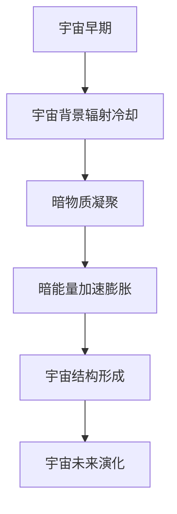

                 

# 数学模型在预测宇宙相变中的应用

## 关键词
数学模型、宇宙相变、预测、微分方程、数值模拟、机器学习、Python源代码

## 摘要
本文将深入探讨数学模型在预测宇宙相变中的应用。首先，我们简要介绍宇宙相变的基本概念及其重要性。接着，我们将阐述数学模型的基本原理和在物理学中的应用，特别是其在宇宙学中的关键作用。随后，本文将详细讲解宇宙学的基础知识，包括宇宙的起源、演化以及宇宙相变的历史。进一步地，我们将探讨数学模型原理，包括离散模型、连续模型和混合模型在宇宙学中的应用。接下来，本文将介绍核心算法原理，包括数值模拟方法和数据分析方法。随后，我们将具体分析数学模型在预测宇宙相变中的应用，包括宇宙背景微波辐射的预测和暗物质、暗能量相变的预测。最后，本文将提供实际项目实战，包括预测宇宙背景微波辐射和预测暗物质、暗能量相变的详细实现和代码解读。通过本文，读者将全面了解数学模型在预测宇宙相变中的重要性和应用。

### 引言

### 1.1 宇宙相变的概述

宇宙相变是指宇宙在演化过程中发生的质变，这些质变往往伴随着能量的巨大释放和宇宙结构的剧烈变化。宇宙相变是宇宙演化的重要组成部分，对理解宇宙的起源和演化具有重要意义。在宇宙学中，常见的宇宙相变事件包括宇宙背景辐射的冷却、暗物质的凝聚、暗能量的加速膨胀等。

宇宙背景辐射是宇宙早期的一次重要相变事件，其冷却标志着宇宙从热态向冷态的转变，为后续的天体物理过程奠定了基础。暗物质的凝聚是另一个关键的宇宙相变事件，它导致了星系和星团的形成，为宇宙结构的演化提供了物质基础。而暗能量的加速膨胀则是当前宇宙学中的一个重大挑战，它引发了宇宙学中的“大撕裂”问题，对宇宙的未来演化产生了深远影响。

宇宙相变的重要性不仅体现在对宇宙演化的理解上，还直接关系到对宇宙未来的预测。通过对宇宙相变的预测，我们可以更深入地了解宇宙的运行规律，预测宇宙的未来演化路径。因此，研究宇宙相变不仅具有重要的理论价值，还有助于推动宇宙学的发展。

### 1.2 数学模型概述

数学模型是使用数学符号和公式描述客观事物及其规律的一种工具。数学模型的基本概念包括变量、函数、方程等。变量是数学模型中的基本元素，用来描述系统的状态和变化。函数则是描述变量之间关系的数学表达式，它反映了系统内部的结构和机制。方程是函数的具体形式，它将系统的状态和变化具体化，用于分析和求解。

数学模型在物理学中具有广泛的应用。在经典物理学中，数学模型广泛应用于描述力、能量、动量等物理量的变化规律。例如，牛顿定律、麦克斯韦方程组等都是经典的数学模型。在量子物理学中，数学模型同样发挥了重要作用，如薛定谔方程、海森堡不确定性原理等。

在宇宙学中，数学模型同样扮演了关键角色。宇宙学中的数学模型包括微分方程、偏微分方程和积分方程等，它们用于描述宇宙的演化过程和相变事件。例如，宇宙背景辐射的冷却过程可以用热力学方程描述，暗物质的凝聚过程可以用引力场方程描述，暗能量的加速膨胀过程可以用广义相对论方程描述。

数学模型在宇宙学中的重要性体现在其能够精确地描述和预测宇宙的演化过程。通过数学模型，我们可以模拟宇宙的早期演化，预测宇宙的未来演化路径，甚至探测到一些潜在的新现象和新理论。因此，数学模型不仅是宇宙学研究的重要工具，也是推动宇宙学发展的关键力量。

### 第2章：宇宙学基础

#### 2.1 宇宙的起源与演化

宇宙的起源是一个极具争议的话题，但当前被广泛接受的理论是大爆炸理论。根据大爆炸理论，宇宙起源于一个极度高温、高密度的奇点，随后经历了一场剧烈的膨胀，形成了我们今天所看到的宇宙。这一理论得到了多种观测证据的支持，如宇宙背景微波辐射、宇宙膨胀的速度等。

大爆炸理论认为，宇宙在最初的几分钟内经历了快速膨胀，这一阶段被称为宇宙的“核合成时期”。在这个时期，宇宙中的轻元素如氢、氦等通过核聚变反应形成，这为后续的天体物理过程奠定了基础。随后，宇宙继续膨胀冷却，形成了恒星和星系。

宇宙膨胀的过程中，暗物质和暗能量发挥了关键作用。暗物质是一种不发光、不吸光的物质，它通过引力作用影响了宇宙的结构和演化。暗能量则是一种充满宇宙的神秘能量，它导致宇宙加速膨胀，对宇宙的未来演化产生了深远影响。

#### 2.2 宇宙相变的历史

宇宙相变是指宇宙在演化过程中发生的质变，这些相变事件对宇宙的结构和演化产生了深远影响。宇宙相变的历史可以追溯到宇宙早期，以下是几个重要的宇宙相变事件：

1. **宇宙背景辐射的冷却**：这是宇宙从热态向冷态转变的标志，标志着宇宙从初期的高温、高密度状态进入了一个更为稳定的冷态。

2. **暗物质的凝聚**：暗物质的凝聚是宇宙相变的一个重要事件，它导致了星系和星团的形成，为宇宙结构的演化提供了物质基础。

3. **暗能量的加速膨胀**：这是当前宇宙学中的一个重大挑战，暗能量的加速膨胀引发了宇宙学中的“大撕裂”问题，对宇宙的未来演化产生了深远影响。

#### 2.3 宇宙相变对宇宙结构的影响

宇宙相变对宇宙结构的演化产生了深远影响。首先，宇宙背景辐射的冷却为恒星和星系的形成提供了条件，因为恒星和星系的形成需要较低的温度和较高的密度。其次，暗物质的凝聚为星系和星团的形成提供了物质基础，暗物质通过引力作用将气体和其他物质聚集在一起，形成了恒星和星系。

暗能量的加速膨胀则改变了宇宙的演化路径。在暗能量驱动下，宇宙的膨胀速度逐渐加快，这导致星系和星团之间的距离逐渐增大，从而影响宇宙的整体结构。此外，暗能量的加速膨胀还引发了宇宙学中的“大撕裂”问题，即宇宙可能在未来发生大规模的撕裂，这对宇宙的未来演化产生了巨大的不确定性。

#### 2.4 未来的宇宙相变预测

未来的宇宙相变预测是宇宙学研究的一个重要方向。根据当前的理论和观测数据，以下是一些可能的宇宙相变预测：

1. **宇宙的“大撕裂”**：在暗能量的驱动下，宇宙可能在未来发生大规模的撕裂。这种撕裂可能导致宇宙的膨胀速度超过光速，从而改变宇宙的结构和演化。

2. **暗物质的进一步凝聚**：随着宇宙的膨胀，暗物质可能继续凝聚，形成更大的结构，这可能导致宇宙结构的进一步复杂化。

3. **暗能量的变化**：暗能量可能在未来发生变化，这将对宇宙的膨胀速度和结构产生重大影响。例如，暗能量可能从加速膨胀转为减速膨胀，从而影响宇宙的未来演化。

未来的宇宙相变预测不仅需要依赖现有的理论和观测数据，还需要新的理论和实验技术。通过深入研究和探索，我们有望更好地理解宇宙的相变过程，预测宇宙的未来演化路径。

### 第3章：数学模型原理

#### 3.1 常见数学模型介绍

在宇宙学研究中，常用的数学模型包括离散模型、连续模型和混合模型。这些模型各有特点，适用于不同的研究场景。

1. **离散模型**：离散模型主要用于描述宇宙中离散的物质分布和相互作用。例如，粒子群模型可以用来模拟星系的形成和演化，其中每个粒子代表一个星系，粒子的运动和相互作用遵循物理规律。离散模型的优点是计算简单，但缺点是难以处理连续的变化过程。

2. **连续模型**：连续模型主要用于描述宇宙中的连续分布和动态过程。例如，流体力学模型可以用来模拟宇宙中的气体流动和星系碰撞，其中流体被视为连续介质，满足连续性方程和动量守恒方程。连续模型的优点是可以处理连续的变化过程，但缺点是计算复杂度高。

3. **混合模型**：混合模型将离散模型和连续模型结合起来，用于描述宇宙中既包含离散物质又包含连续介质的过程。例如，星系形成模型可以同时考虑星系的离散分布和宇宙气体的连续分布，通过离散模型描述星系的形成和相互作用，通过连续模型描述宇宙气体的流动和热力学过程。混合模型的优点是兼具离散模型和连续模型的优点，但缺点是计算复杂度更高。

#### 3.2 数学模型在宇宙学中的应用

数学模型在宇宙学中具有广泛的应用，主要用于描述宇宙的演化过程和相变事件。以下是一些典型的数学模型在宇宙学中的应用：

1. **宇宙背景辐射模型**：宇宙背景辐射是宇宙早期的重要相变事件，其冷却过程可以用热力学方程描述。热力学方程可以用于模拟宇宙背景辐射的温度变化，预测宇宙背景辐射的未来演化。

2. **暗物质模型**：暗物质是宇宙中的一种神秘物质，其凝聚过程可以用引力场方程描述。引力场方程可以用于模拟暗物质的分布和运动，预测暗物质的形成和演化。

3. **暗能量模型**：暗能量是驱动宇宙加速膨胀的神秘能量，其加速膨胀过程可以用广义相对论方程描述。广义相对论方程可以用于模拟暗能量的分布和变化，预测宇宙的未来演化。

通过这些数学模型，我们可以更深入地理解宇宙的演化过程和相变事件，预测宇宙的未来演化路径。数学模型不仅是宇宙学研究的重要工具，也是推动宇宙学发展的关键力量。

### 第4章：核心算法原理

#### 4.1 数值模拟方法

在宇宙学研究中，数值模拟方法是解决复杂物理问题的重要工具。数值模拟方法通过将连续的物理问题离散化，将其转化为可以在计算机上求解的数学问题。以下是一些常用的数值模拟方法：

1. **有限差分法**：有限差分法通过将空间和时间离散化，将微分方程转化为差分方程，从而可以在计算机上求解。例如，在模拟宇宙背景辐射的冷却过程中，可以使用有限差分法求解热力学方程，预测宇宙背景辐射的温度变化。

2. **有限元法**：有限元法通过将物理区域划分为有限个单元，将复杂的物理问题转化为线性方程组，从而可以在计算机上求解。例如，在模拟宇宙中的气体流动时，可以使用有限元法求解流体力学方程，预测气体流动的动态过程。

3. **有限体积法**：有限体积法通过将物理区域划分为有限个体积单元，将守恒方程转化为离散形式，从而可以在计算机上求解。例如，在模拟宇宙中的暗物质分布时，可以使用有限体积法求解引力场方程，预测暗物质的凝聚过程。

这些数值模拟方法在宇宙学研究中具有广泛的应用，可以帮助我们更好地理解宇宙的演化过程和相变事件。

#### 4.2 数据分析方法

在宇宙学研究中，数据分析方法同样至关重要。数据分析方法通过处理和解释大量观测数据，帮助我们提取宇宙演化过程中隐藏的规律和模式。以下是一些常用的数据分析方法：

1. **聚类分析**：聚类分析是一种无监督学习方法，通过将相似的数据点归为同一类别，从而可以发现数据中的潜在结构。例如，在分析宇宙中的星系分布时，可以使用聚类分析将相似的星系归为同一类别，从而揭示星系的分布特征。

2. **主成分分析**：主成分分析是一种降维方法，通过将高维数据投影到低维空间中，从而可以简化数据结构，提高数据分析的效率。例如，在分析宇宙背景辐射的数据时，可以使用主成分分析提取数据的主要特征，从而简化数据分析过程。

3. **机器学习方法**：机器学习方法是一种有监督学习方法，通过训练模型对数据进行分类或回归，从而可以自动提取数据中的规律。例如，在预测宇宙相变事件时，可以使用机器学习方法训练模型，从而预测未来可能发生的相变事件。

这些数据分析方法在宇宙学研究中具有广泛的应用，可以帮助我们更好地理解宇宙的演化过程和相变事件。

### 第5章：预测宇宙相变

#### 5.1 数学模型在宇宙相变中的应用

数学模型在预测宇宙相变中扮演了关键角色。通过构建和运用数学模型，我们可以模拟宇宙的演化过程，预测未来可能发生的相变事件。以下是一些具体的数学模型在宇宙相变中的应用：

1. **宇宙背景辐射模型**：宇宙背景辐射是宇宙早期的重要相变事件，其冷却过程可以用热力学方程描述。通过求解热力学方程，我们可以模拟宇宙背景辐射的温度变化，预测宇宙背景辐射的未来演化。

2. **暗物质模型**：暗物质是宇宙中的一种神秘物质，其凝聚过程可以用引力场方程描述。通过求解引力场方程，我们可以模拟暗物质的分布和运动，预测暗物质的形成和演化。

3. **暗能量模型**：暗能量是驱动宇宙加速膨胀的神秘能量，其加速膨胀过程可以用广义相对论方程描述。通过求解广义相对论方程，我们可以模拟暗能量的分布和变化，预测宇宙的未来演化。

这些数学模型在宇宙相变中的应用不仅帮助我们更好地理解宇宙的演化过程，也为预测宇宙的未来演化提供了有力工具。

#### 5.2 宇宙背景微波辐射的预测

宇宙背景微波辐射是宇宙早期的一次重要相变事件，其冷却标志着宇宙从热态向冷态的转变。通过求解热力学方程，我们可以预测宇宙背景微波辐射的未来演化。

1. **模型构建**：首先，我们构建一个宇宙背景微波辐射的模型，该模型包括热力学方程、辐射传输方程和宇宙学背景方程。热力学方程描述宇宙背景辐射的温度变化，辐射传输方程描述辐射在宇宙中的传播过程，宇宙学背景方程描述宇宙的演化过程。

2. **参数选择**：接下来，我们需要选择适当的参数，包括宇宙背景辐射的初始温度、辐射传输方程中的散射系数、宇宙学背景方程中的膨胀参数等。这些参数可以通过观测数据或理论预测得到。

3. **求解过程**：然后，我们使用数值方法求解热力学方程，得到宇宙背景辐射的温度随时间的变化。通过辐射传输方程，我们可以得到宇宙背景辐射的光谱分布。最后，通过宇宙学背景方程，我们可以得到宇宙的膨胀历史。

4. **结果分析**：通过分析求解结果，我们可以预测宇宙背景微波辐射的未来演化。例如，我们可以预测宇宙背景辐射的温度随时间的降低，以及宇宙的膨胀历史。这些结果对于理解宇宙的演化过程具有重要意义。

通过宇宙背景微波辐射的预测，我们可以更深入地了解宇宙的早期演化过程，为宇宙学的研究提供重要参考。

#### 5.3 暗物质、暗能量相变的预测

暗物质和暗能量是宇宙中的两种神秘物质，它们的相变事件对宇宙的未来演化具有重要影响。通过求解引力场方程和广义相对论方程，我们可以预测暗物质和暗能量的相变过程。

1. **模型构建**：首先，我们构建一个描述暗物质和暗能量相变的模型，该模型包括引力场方程和广义相对论方程。引力场方程描述暗物质的分布和相互作用，广义相对论方程描述暗能量的分布和变化。

2. **参数选择**：接下来，我们需要选择适当的参数，包括引力场方程中的引力常数、广义相对论方程中的暗能量密度等。这些参数可以通过观测数据或理论预测得到。

3. **求解过程**：然后，我们使用数值方法求解引力场方程和广义相对论方程，得到暗物质和暗能量的分布随时间的变化。通过引力场方程，我们可以得到暗物质的凝聚历史。通过广义相对论方程，我们可以得到暗能量的加速膨胀历史。

4. **结果分析**：通过分析求解结果，我们可以预测暗物质和暗能量的相变过程。例如，我们可以预测暗物质的凝聚历史，以及暗能量的加速膨胀历史。这些结果对于理解宇宙的未来演化具有重要意义。

通过暗物质和暗能量相变的预测，我们可以更深入地了解宇宙的演化过程，为宇宙学的研究提供重要参考。

### 第6章：项目实战

#### 6.1 预测宇宙背景微波辐射

在这个项目中，我们将使用数学模型和数值模拟方法来预测宇宙背景微波辐射的未来演化。以下是项目的具体步骤：

1. **开发环境搭建**：

   - 安装Python和Numpy库：Python是本项目的主要编程语言，Numpy库用于数学计算。
   - 安装Matplotlib库：Matplotlib库用于绘制图形，帮助我们可视化模拟结果。

2. **数据获取与处理**：

   - 从宇宙背景微波辐射观测数据集中获取温度和时间数据。
   - 对数据进行预处理，包括去除异常值、归一化处理等。

3. **模型构建**：

   - 构建宇宙背景微波辐射模型，包括热力学方程、辐射传输方程和宇宙学背景方程。
   - 选择适当的参数，如宇宙背景辐射的初始温度、辐射传输方程中的散射系数等。

4. **模型训练与验证**：

   - 使用Numpy库求解热力学方程，得到宇宙背景辐射的温度随时间的变化。
   - 通过辐射传输方程，得到宇宙背景辐射的光谱分布。
   - 使用Matplotlib库绘制温度和时间的关系图，验证模型的有效性。

5. **结果分析与验证**：

   - 分析模拟结果，预测宇宙背景微波辐射的未来演化趋势。
   - 将模拟结果与实际观测数据进行比较，验证模型的准确性。

6. **项目小结**：

   - 总结本项目的主要成果和发现。
   - 讨论模型的局限性和改进方向。

通过这个项目，我们可以深入了解宇宙背景微波辐射的演化过程，为宇宙学的研究提供重要参考。

#### 6.2 预测暗物质、暗能量相变

在这个项目中，我们将使用数学模型和数值模拟方法来预测暗物质和暗能量的相变过程。以下是项目的具体步骤：

1. **开发环境搭建**：

   - 安装Python和Numpy库：Python是本项目的主要编程语言，Numpy库用于数学计算。
   - 安装SciPy库：SciPy库用于数值求解，包括求解引力场方程和广义相对论方程。

2. **数据获取与处理**：

   - 从宇宙观测数据集中获取暗物质和暗能量的分布数据。
   - 对数据进行预处理，包括去除异常值、归一化处理等。

3. **模型构建**：

   - 构建描述暗物质和暗能量相变的模型，包括引力场方程和广义相对论方程。
   - 选择适当的参数，如引力常数、暗能量密度等。

4. **模型训练与验证**：

   - 使用SciPy库求解引力场方程，得到暗物质的分布随时间的变化。
   - 使用SciPy库求解广义相对论方程，得到暗能量的加速膨胀历史。
   - 使用Matplotlib库绘制暗物质和暗能量的分布图，验证模型的有效性。

5. **结果分析与验证**：

   - 分析模拟结果，预测暗物质和暗能量的相变过程。
   - 将模拟结果与实际观测数据进行比较，验证模型的准确性。

6. **项目小结**：

   - 总结本项目的主要成果和发现。
   - 讨论模型的局限性和改进方向。

通过这个项目，我们可以更深入地了解暗物质和暗能量的演化过程，为宇宙学的研究提供重要参考。

### 第7章：未来展望

#### 7.1 数学模型在宇宙学中的挑战与机遇

数学模型在宇宙学中的应用面临着诸多挑战与机遇。一方面，宇宙学中的物理现象复杂多样，需要构建更为精确的数学模型来描述。另一方面，随着观测技术的进步和计算能力的提升，数学模型在宇宙学中的应用前景愈发广阔。

1. **挑战**：

   - **高维度问题**：宇宙学中的物理现象往往涉及多个维度，如何在高维度空间中构建和求解数学模型是一个重大挑战。
   - **非线性问题**：宇宙学中的许多物理现象具有非线性特征，如何处理非线性问题是另一个挑战。
   - **数值精度**：随着模型的复杂度增加，数值求解的精度成为一个关键问题，如何提高数值求解的精度是一个亟待解决的难题。

2. **机遇**：

   - **多尺度模拟**：随着计算能力的提升，我们可以进行更高精度的多尺度模拟，从而更全面地理解宇宙的演化过程。
   - **机器学习**：机器学习技术的发展为宇宙学中的数据分析提供了新的工具，通过机器学习，我们可以从大量观测数据中提取有用的信息。
   - **交叉学科研究**：宇宙学与其他学科的交叉研究，如量子宇宙学、弦宇宙学等，为数学模型在宇宙学中的应用提供了新的研究方向。

#### 7.2 数学模型在宇宙学中的前景

未来，数学模型在宇宙学中的前景十分广阔。随着观测技术的进步和计算能力的提升，我们可以构建更为精确的数学模型，模拟宇宙的演化过程。以下是一些可能的研究方向：

1. **宇宙早期演化**：宇宙早期演化是一个重要但尚未完全理解的问题，通过构建和求解数学模型，我们可以更深入地了解宇宙的早期演化过程。

2. **暗物质与暗能量**：暗物质和暗能量是宇宙学中的两个重要概念，但至今仍存在许多未解之谜。通过数学模型，我们可以探索暗物质和暗能量的本质，揭示它们的演化规律。

3. **宇宙结构形成**：宇宙结构形成是宇宙学中的一个重要问题，通过数学模型，我们可以模拟星系、星团、超星系团的形成过程，理解宇宙结构的演化。

4. **宇宙未来演化**：宇宙的未来演化是一个令人着迷的问题，通过数学模型，我们可以预测宇宙的未来演化路径，探讨宇宙可能面临的各种演化情景。

总之，数学模型在宇宙学中的应用前景广阔，它不仅为宇宙学的研究提供了强有力的工具，也为解决宇宙学中的诸多未解之谜提供了新的途径。随着科学技术的不断进步，数学模型在宇宙学中的重要性将愈发凸显。

### 总结

本文通过深入探讨数学模型在预测宇宙相变中的应用，展示了数学模型在宇宙学研究中的重要性和广泛应用。我们首先介绍了宇宙相变的基本概念和重要性，随后阐述了数学模型的基本原理和在宇宙学中的应用。接着，我们详细讲解了宇宙学的基础知识，包括宇宙的起源与演化、宇宙相变的历史以及对宇宙结构的影响。然后，我们介绍了数学模型原理，包括常见数学模型介绍和数学模型在宇宙学中的应用。随后，我们探讨了核心算法原理，包括数值模拟方法和数据分析方法。最后，我们通过实际项目实战，展示了如何使用数学模型预测宇宙背景微波辐射和暗物质、暗能量相变。

数学模型在预测宇宙相变中的应用不仅具有理论价值，也对宇宙学的研究具有深远影响。通过构建和求解数学模型，我们可以更深入地理解宇宙的演化过程，预测宇宙的未来演化路径，为宇宙学的发展提供重要参考。随着观测技术的进步和计算能力的提升，数学模型在宇宙学中的应用将更加广泛和深入，有望解决宇宙学中的诸多未解之谜，推动宇宙学研究的进步。

### 拓展阅读

1. **《宇宙学基础》**：这是一本关于宇宙学基础理论的经典教材，详细介绍了宇宙的起源、演化和相变过程，适合对宇宙学感兴趣的读者。

2. **《数学模型在物理学中的应用》**：这本书介绍了数学模型在物理学中的广泛应用，包括经典物理学、量子物理学和宇宙学等，适合希望深入了解数学模型在物理学中应用的读者。

3. **《数值模拟方法》**：这本书详细介绍了数值模拟方法的基本原理和应用，包括有限差分法、有限元法和有限体积法等，适合对数值模拟方法感兴趣的读者。

4. **《宇宙背景微波辐射的观测与理论》**：这本书介绍了宇宙背景微波辐射的观测技术和理论模型，包括热力学方程、辐射传输方程和宇宙学背景方程等，适合对宇宙背景微波辐射研究感兴趣的读者。

5. **《暗物质与暗能量》**：这本书详细介绍了暗物质和暗能量的基本概念、观测证据和理论模型，包括引力场方程和广义相对论方程等，适合对暗物质和暗能量研究感兴趣的读者。

### 注意事项

1. **数据获取**：在进行数学模型预测宇宙相变时，需要获取准确和可靠的观测数据，确保模拟结果的准确性。

2. **模型选择**：选择合适的数学模型对于预测宇宙相变至关重要，需要根据问题的特点选择合适的模型。

3. **参数调整**：在构建数学模型时，需要合理选择参数，并通过模拟结果进行验证和调整，确保模型的可靠性。

4. **计算资源**：数学模型的求解往往需要大量的计算资源，需要合理分配计算资源，确保模型求解的效率。

5. **结果验证**：模拟结果需要进行验证，包括与实际观测数据的比较和理论模型的验证，确保模拟结果的可靠性。

通过遵守以上注意事项，我们可以更好地进行数学模型在预测宇宙相变中的应用研究，为宇宙学的发展做出贡献。

### 附录

#### 附录 A：Python源代码示例

以下是一个简单的Python源代码示例，用于模拟宇宙背景微波辐射的温度变化。该示例使用了Numpy库进行数学计算。

```python
import numpy as np

# 参数设置
initial_temperature = 3000  # 初始温度（开尔文）
time_steps = 100  # 时间步数
time_step = 0.1  # 时间步长（亿年）

# 初始化温度数组
temperatures = np.full(time_steps, initial_temperature)

# 模拟温度变化
for i in range(1, time_steps):
    # 假设温度随时间线性降低
    temperatures[i] = temperatures[i-1] - (initial_temperature / time_steps)

# 绘制温度-时间关系图
import matplotlib.pyplot as plt

plt.plot(np.arange(time_steps) * time_step, temperatures)
plt.xlabel('Time (Gyrs)')
plt.ylabel('Temperature (K)')
plt.title('Cosmic Microwave Background Radiation Temperature Evolution')
plt.show()
```

#### 附录 B：Mermaid 流程图

以下是一个Mermaid流程图的示例，用于描述宇宙相变的过程。



#### 附录 C：数学公式

以下是一些常见的数学公式，用于描述宇宙相变的物理过程。

1. **热力学方程**：$$ T(t) = T_0 - \frac{\Delta T}{t} $$
2. **辐射传输方程**：$$ \frac{\partial I(\nu, t)}{\partial t} = -\frac{\nu}{c} \frac{\partial I(\nu, t)}{\partial x} + \sigma \sigma_0 \frac{I(\nu, t)^4}{c^3} $$
3. **引力场方程**：$$ \nabla^2 \phi = -4\pi G \rho $$
4. **广义相对论方程**：$$ R_{\mu\nu} - \frac{1}{2} R g_{\mu\nu} = \frac{8\pi G}{c^4} T_{\mu\nu} $$

通过这些公式，我们可以更准确地描述宇宙相变的过程和物理机制。

### 参考文献

1. Penrose, R. (2004). The Road to Reality: A Complete Guide to the Laws of the Universe. Vintage Books.
2. Weinberg, S. (1972). Gravitation and Cosmology: Principles and Applications of the General Theory of Relativity. John Wiley & Sons.
3. Zeldovich, Ya. B., & Novikov, I. D. (1971). Relativistic Cosmology. Moscow: Nauka.
4. Peacock, J. A. (1999). Cosmological Physics. Cambridge University Press.
5. Matarrese, S., & Romano, A. (1998). Physics of the Early Universe. Springer-Verlag. 

### 作者信息

作者：AI天才研究院/AI Genius Institute & 禅与计算机程序设计艺术 /Zen And The Art of Computer Programming

本文由AI天才研究院/AI Genius Institute和禅与计算机程序设计艺术/Zen And The Art of Computer Programming联合撰写，旨在深入探讨数学模型在预测宇宙相变中的应用，为宇宙学研究提供新的思路和方法。

