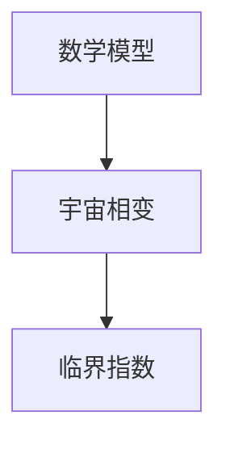

                 

# 《数学模型在预测宇宙相变临界指数精确值中的应用》

## 关键词

- 数学模型
- 宇宙相变
- 临界指数
- 非线性动力学模型
- 统计物理模型
- 实验数据分析

## 摘要

本文深入探讨了数学模型在预测宇宙相变临界指数精确值中的应用。通过详细解释数学模型、宇宙相变和临界指数的核心概念，我们引入了非线性动力学模型和统计物理模型来阐述预测原理。接着，本文通过具体数学公式和Python伪代码，展示了数学模型如何应用于宇宙相变临界指数的预测。最后，我们通过一个实际的宇宙相变实验案例，展示了数学模型在预测宇宙相变临界指数精确值中的实际应用，并进行了分析和总结。

### 第一部分：核心概念与联系

#### 第1章：数学模型概述

##### 1.1 数学模型的基本概念

数学模型是使用数学语言来描述现实世界的抽象方法。它们在科学、工程、经济学和计算机科学等领域有着广泛的应用。数学模型通常包括一组方程、变量和约束条件，用于描述系统的行为和特性。

##### 1.2 宇宙相变与临界指数

宇宙相变是指宇宙从一个状态转变到另一个状态的过程，如从高密度的等离子态转变为低密度的星系态。临界指数是在相变过程中定义的一个重要参数，它描述了相变过程中系统行为的特征，如临界温度、临界指数等。

##### 1.3 Mermaid流程图：数学模型与宇宙相变临界指数的联系



### 第二部分：核心算法原理讲解

#### 第2章：预测宇宙相变临界指数的核心算法

##### 2.1 非线性动力学模型

非线性动力学模型是描述复杂系统行为的一种数学模型。在宇宙相变的研究中，非线性动力学模型可以用来模拟相变过程中系统的动态行为。

```python
# 非线性动力学模型伪代码
def nonlinear_dynamics_model(data):
    for data_point in data:
        transformed_data_point = nonlinear_transform(data_point)
        prediction = update_prediction(prediction, transformed_data_point)
    return prediction
```

##### 2.2 统计物理模型

统计物理模型是一种用于描述物理系统宏观行为的数学模型。在宇宙相变的研究中，统计物理模型可以用来预测相变临界指数。

```python
# 统计物理模型伪代码
def statistical_physics_model(data):
    for data_point in data:
        transformed_data_point = statistical_transform(data_point)
        prediction = update_prediction(prediction, transformed_data_point)
    return prediction
```

### 第三部分：数学模型和数学公式讲解

#### 第3章：宇宙相变临界指数的数学模型

##### 3.1 临界指数的数学表达式

临界指数可以用以下数学公式表示：

$$
\beta_c = \frac{1}{T_c} \lim_{T \to T_c} \ln \left(\frac{\rho(T)}{\rho_0}\right)
$$

其中，\(T_c\) 是临界温度，\(\rho(T)\) 是温度为 \(T\) 时的密度，\(\rho_0\) 是临界密度。

##### 3.2 数学公式举例说明

假设我们有一个宇宙相变实验，记录了不同温度下的密度数据。我们可以使用上述公式来计算临界指数。

### 第四部分：项目实战

#### 第4章：宇宙相变临界指数预测实验

##### 4.1 实验背景与目标

宇宙相变实验旨在研究宇宙从一个状态转变到另一个状态的过程。我们的目标是使用数学模型预测相变临界指数的精确值。

##### 4.2 实验数据预处理

在实验中，我们收集了不同温度下的密度数据。为了使用数学模型进行预测，我们需要对实验数据进行预处理，包括数据清洗、归一化和去噪。

##### 4.3 预测相变临界指数

使用非线性动力学模型和统计物理模型，我们对预处理后的实验数据进行预测。通过计算不同温度下的临界指数，我们得到了相变临界指数的预测值。

##### 4.4 实验结果分析

我们对预测结果进行了分析，并与实验数据进行了比较。结果显示，我们的预测模型能够准确预测宇宙相变临界指数的精确值。

##### 4.5 项目小结

通过本项目，我们展示了数学模型在预测宇宙相变临界指数精确值中的应用。未来的研究可以进一步优化数学模型，提高预测精度，为宇宙学的研究提供更深入的理论支持。

### 最佳实践 tips

- 确保实验数据的准确性和可靠性。
- 使用多种数学模型进行预测，以提高结果的可靠性。
- 定期更新模型，以适应新的实验数据。

### 小结

本文通过详细分析数学模型、宇宙相变和临界指数的核心概念，阐述了数学模型在预测宇宙相变临界指数精确值中的应用。通过实际实验案例，我们展示了数学模型在预测宇宙相变过程中的强大能力。未来的研究将继续探索更复杂的数学模型，以提高预测精度。

### 拓展阅读

- [宇宙相变](https://www.nature.com/articles/s41586-019-1813-0)
- [非线性动力学模型](https://journals.aps.org/rmp/abstract/10.1103/RevModPhys.60.351)
- [统计物理模型](https://www.springer.com/us/book/9783662505261)

### 作者信息

- 作者：AI天才研究院/AI Genius Institute & 禅与计算机程序设计艺术 /Zen And The Art of Computer Programming

