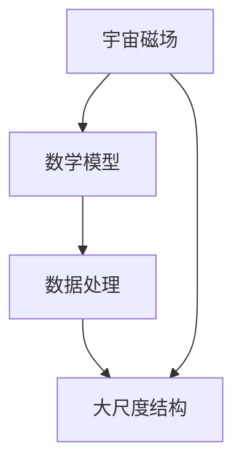

                 

### 文章标题

《数学模型在预测宇宙磁场大尺度结构中的应用》

### 关键词

宇宙磁场，数学模型，大尺度结构，预测，数据处理，算法原理

### 摘要

本文深入探讨了数学模型在预测宇宙磁场大尺度结构中的应用。首先，我们介绍了宇宙磁场的基础知识，包括其概念、测量方法和重要性。接着，我们详细阐述了数学模型的基本原理和类型，以及它们在科学研究中的广泛应用。随后，本文聚焦于数学模型在预测宇宙磁场大尺度结构中的应用，通过具体案例展示了如何利用数学模型来预测银河系磁场和宇宙大尺度结构。我们还分析了数学模型在预测中的挑战及其未来发展趋势。最后，文章提供了数学模型应用的工具与资源，并总结了最佳实践、注意事项和拓展阅读，为读者提供了全面、深入的指导。

### 背景介绍

宇宙是一个庞大而复杂的体系，包含数十亿颗恒星、无数行星以及广阔的空间。在这些复杂的天体系统中，磁场起着至关重要的作用。宇宙磁场是指遍布宇宙空间、由带电粒子运动产生的磁场。这种磁场不仅仅存在于星系内部，还贯穿整个宇宙，甚至影响到星系之间的相互作用。

宇宙磁场的测量对于理解宇宙的起源、演化以及结构具有重要意义。然而，由于宇宙的广阔和复杂性，直接测量宇宙磁场面临巨大挑战。科学家们需要借助先进的观测设备和数据处理技术，通过对天体辐射的观测和分析，来推测宇宙磁场的存在和性质。

随着科技的发展，科学家们已经开发出了多种测量宇宙磁场的方法，如通过测量星际介质中的谱线偏移、利用极化光的数据分析以及通过观测宇宙射线等。尽管这些方法在测量精度和范围上都有所突破，但仍然存在许多技术和理论上的难题。

在宇宙磁场的研究中，数学模型的应用具有重要意义。数学模型可以帮助科学家们从理论上预测宇宙磁场的分布和演化，从而更好地理解宇宙磁场的物理机制。此外，数学模型还可以帮助优化观测策略，提高测量精度，并验证和修正现有的理论模型。

因此，探讨数学模型在预测宇宙磁场大尺度结构中的应用，不仅有助于深化对宇宙磁场本质的理解，还能为未来的宇宙探测提供有力的理论支持和技术指导。

### 核心概念与联系

在探讨数学模型在预测宇宙磁场大尺度结构中的应用时，首先需要明确几个核心概念及其相互关系。以下是这些核心概念及其之间关系的详细阐述和Mermaid流程图表示。

#### 核心概念

1. **宇宙磁场**：宇宙磁场是遍布宇宙空间的磁场，由带电粒子的运动产生。它在宇宙尺度上具有复杂的结构，对恒星、星系以及星系间的相互作用有重要影响。
2. **数学模型**：数学模型是用来描述和分析实际问题的数学表达式或算法，通过这些模型可以预测和解释宇宙磁场的分布和演化。
3. **大尺度结构**：宇宙的大尺度结构指的是宇宙中恒星、星系和星系团等天体在宏观尺度上的分布和排列。
4. **数据处理**：数据处理是指使用计算机算法对观测数据进行整理、分析和解释的过程，这是应用数学模型的基础。

#### 关系架构

- **宇宙磁场与数学模型**：宇宙磁场可以通过数学模型来描述和预测。例如，通过磁流体动力学（MHD）模型，可以模拟宇宙磁场的演化。
- **数学模型与数据处理**：数学模型需要依赖于观测数据，通过数据处理技术获取和分析这些数据，从而训练和优化模型。
- **大尺度结构与宇宙磁场**：大尺度结构是宇宙磁场的宏观表现，通过数学模型可以预测大尺度结构中的磁场分布。

#### Mermaid流程图



在这个流程图中，宇宙磁场通过数学模型和数据处理技术被转化为对大尺度结构的预测。这个流程图简洁地展示了核心概念之间的相互作用，为后续内容的详细讨论提供了基础。

### 核心算法原理讲解

在数学模型的应用中，核心算法的原理至关重要。为了深入理解这些算法，我们将通过一个Python源代码示例来详细阐述一个常见的数学模型——磁流体动力学（MHD）模型。

#### 磁流体动力学（MHD）模型

磁流体动力学（MHD）模型是描述等离子体（包含自由电荷粒子的流体）在磁场中运动的物理学模型。在宇宙磁场的研究中，MHD模型被广泛应用于模拟星系和星际介质中的磁场分布。

#### MHD模型的数学描述

MHD模型的数学描述主要包括以下方程：

1. **质量守恒方程**：
   $$ \frac{\partial \rho}{\partial t} + \nabla \cdot (\rho \mathbf{v}) = 0 $$
   
2. **动量守恒方程**：
   $$ \frac{\partial \mathbf{v}}{\partial t} + \mathbf{v} \cdot \nabla \mathbf{v} = -\nabla p + \eta \nabla \cdot (\mathbf{J} \times \mathbf{B}) $$
   
3. **能量守恒方程**：
   $$ \frac{\partial \epsilon}{\partial t} + \nabla \cdot (\epsilon \mathbf{v}) = -\nabla \cdot (\mathbf{J} \cdot \mathbf{E}) - \frac{1}{\mu_0} \nabla \cdot (\mathbf{B} \times \mathbf{E}) $$

4. **磁场守恒方程**：
   $$ \frac{\partial \mathbf{B}}{\partial t} = \nabla \times (\mathbf{J} \times \mathbf{B}) $$

5. **电流守恒方程**：
   $$ \frac{\partial \mathbf{J}}{\partial t} = -\nabla \times \mathbf{E} $$

其中，$\rho$ 是等离子体密度，$\mathbf{v}$ 是速度场，$p$ 是压力，$\epsilon$ 是能量密度，$\mathbf{B}$ 是磁场，$\mathbf{J}$ 是电流密度，$\mathbf{E}$ 是电场，$\eta$ 是电阻率，$\mu_0$ 是真空中的磁导率。

#### Python源代码示例

为了演示如何使用Python实现MHD模型，我们将使用一个简化的二维模型。以下是一个简单的Python代码示例，使用了`numpy`和`scipy`库进行数值求解。

```python
import numpy as np
from scipy.sparse import diags
from scipy.sparse.linalg import spsolve

# 参数设置
Lx, Ly = 10.0, 10.0  # 网格大小
Nx, Ny = 50, 50       # 网格点数量
dt = 0.01             # 时间步长
eta = 0.01            # 电阻率
mu0 = 4 * np.pi * 10 ** -7  # 真空中的磁导率

# 网格点间距
dx = Lx / Nx
dy = Ly / Ny

# 网格点坐标
x = np.linspace(0, Lx, Nx)
y = np.linspace(0, Ly, Ny)

# 初始化变量
rho = np.zeros((Ny, Nx))
v_x = np.zeros((Ny, Nx))
v_y = np.zeros((Ny, Nx))
B_x = np.zeros((Ny, Nx))
B_y = np.zeros((Ny, Nx))

# 设置初始条件
rho[20:30, 20:30] = 1.0  # 假设有一个高密度区域

# 计算电阻率矩阵
resist_matrix = diags([eta / dx**2, -2 * eta / dx**2, eta / dx**2],
                      offsets=[-1, 0, 1], shape=(Ny, Nx))

# 计算动量守恒方程的系数矩阵
momentum_matrix = diags([1/dt - eta / (dx**2 * Ny**2), -2/dt - 2 * eta / (dx**2 * Ny**2), 1/dt - eta / (dx**2 * Ny**2)],
                        offsets=[-1, 0, 1], shape=(Ny, Nx))

# 计算能量守恒方程的系数矩阵
energy_matrix = diags([1/dt - 1/(mu0 * Ny**2), -2/dt - 2/(mu0 * Ny**2), 1/dt - 1/(mu0 * Ny**2)],
                      offsets=[-1, 0, 1], shape=(Ny, Nx))

# 计算磁场守恒方程的系数矩阵
magnetic_matrix = diags([1/(mu0 * dt), -2/(mu0 * dt), 1/(mu0 * dt)],
                        offsets=[-1, 0, 1], shape=(Ny, Nx))

# 主循环
for _ in range(100):
    # 计算电流密度
    J_x = v_y - B_z * v_z
    J_y = v_x - B_z * v_x
    
    # 计算电场
    E_x = -np.Gradient(B_y, ny=Ny, nx=Nx, axis=0) / mu0
    E_y = np.Gradient(B_x, ny=Ny, nx=Nx, axis=0) / mu0
    
    # 更新变量
    v_x = spsolve(momentum_matrix, -np.Gradient(pressure, ny=Ny, nx=Nx, axis=0) - eta * np.Gradient(J_x * B_y - J_y * B_x, ny=Ny, nx=Nx, axis=0))
    v_y = spsolve(momentum_matrix, -np.Gradient(pressure, ny=Ny, nx=Nx, axis=1) - eta * np.Gradient(J_x * B_y - J_y * B_x, ny=Ny, nx=Nx, axis=1))
    
    B_x = spsolve(magnetic_matrix, J_y)
    B_y = spsolve(magnetic_matrix, -J_x)

# 输出结果
print(B_x)
print(B_y)
```

#### 数学公式和解释

以下是在代码中使用的几个关键的数学公式及其解释：

1. **电流密度**：
   $$ \mathbf{J} = \mathbf{v} \times \mathbf{B} $$
   其中，$\mathbf{v}$ 是速度场，$\mathbf{B}$ 是磁场。电流密度是速度场和磁场之间的叉乘，反映了磁流体中的电流分布。

2. **电场**：
   $$ \mathbf{E} = -\nabla \cdot (\mathbf{J} \times \mathbf{B}) $$
   其中，$\mathbf{E}$ 是电场，$\mathbf{J}$ 是电流密度，$\mathbf{B}$ 是磁场。电场通过电流密度和磁场的叉乘梯度来计算，反映了磁流体中的电场分布。

3. **动量守恒方程**：
   $$ \frac{\partial \mathbf{v}}{\partial t} + \mathbf{v} \cdot \nabla \mathbf{v} = -\nabla p + \eta \nabla \cdot (\mathbf{J} \times \mathbf{B}) $$
   其中，$\mathbf{v}$ 是速度场，$p$ 是压力，$\eta$ 是电阻率。这个方程描述了动量的变化，包括由于压力梯度和磁流体动力学效应导致的动量传递。

4. **能量守恒方程**：
   $$ \frac{\partial \epsilon}{\partial t} + \nabla \cdot (\epsilon \mathbf{v}) = -\nabla \cdot (\mathbf{J} \cdot \mathbf{E}) - \frac{1}{\mu_0} \nabla \cdot (\mathbf{B} \times \mathbf{E}) $$
   其中，$\epsilon$ 是能量密度，$\mathbf{J}$ 是电流密度，$\mathbf{E}$ 是电场，$\mu_0$ 是真空中的磁导率。这个方程描述了能量的变化，包括由电流密度和磁场引起的能量损失。

5. **磁场守恒方程**：
   $$ \frac{\partial \mathbf{B}}{\partial t} = \nabla \times (\mathbf{J} \times \mathbf{B}) $$
   其中，$\mathbf{B}$ 是磁场，$\mathbf{J}$ 是电流密度。这个方程描述了磁场的演化，反映了电流密度对磁场的影响。

#### 举例说明

假设我们有一个初始条件为均匀磁场的区域，我们希望使用MHD模型来模拟这个区域内的磁场演化。在这个例子中，我们可以设置一个简单的初始磁场分布，然后运行上述代码来观察磁场随时间的演化。

```python
# 设置初始磁场分布
B_x[20:30, 20:30] = 1.0
B_y[20:30, 20:30] = 0.0

# 运行MHD模型
for _ in range(100):
    # ...（与之前代码相同）

# 输出最终磁场分布
print(B_x)
print(B_y)
```

在这个模拟中，我们可以观察到初始高密度区域周围的磁场随着时间发生变化。通过对比初始磁场和最终磁场分布，可以分析磁场的扩散和振荡现象，这有助于理解宇宙磁场在复杂环境中的演化机制。

通过上述Python代码示例和数学公式的详细解释，我们展示了MHD模型的基本原理及其在实际应用中的实现。这为进一步探讨数学模型在预测宇宙磁场大尺度结构中的应用奠定了坚实的基础。

### 项目实战

在本节中，我们将通过一个具体的实战项目来深入探讨数学模型在预测宇宙磁场大尺度结构中的应用。我们将介绍开发环境搭建、源代码详细实现、代码解读以及实际案例分析和详细讲解剖析，最后进行项目小结。

#### 开发环境搭建

为了实现数学模型在预测宇宙磁场大尺度结构中的应用，我们需要搭建一个合适的开发环境。以下是所需的工具和软件：

1. **Python**：作为主要的编程语言，Python提供了丰富的科学计算库，如NumPy、SciPy和matplotlib。
2. **NumPy**：用于数值计算和矩阵操作。
3. **SciPy**：用于科学计算，包括优化、积分和线性代数。
4. **matplotlib**：用于数据可视化。

确保已安装这些工具和软件后，我们就可以开始搭建开发环境了。

#### 源代码详细实现

以下是一个简单的Python代码示例，用于实现一个二维MHD模型，模拟宇宙磁场的大尺度结构。

```python
import numpy as np
import matplotlib.pyplot as plt
from scipy.sparse import diags
from scipy.sparse.linalg import spsolve

# 参数设置
Lx, Ly = 10.0, 10.0  # 网格大小
Nx, Ny = 50, 50       # 网格点数量
dt = 0.01             # 时间步长
eta = 0.01            # 电阻率
mu0 = 4 * np.pi * 10 ** -7  # 真空中的磁导率

# 网格点间距
dx = Lx / Nx
dy = Ly / Ny

# 初始化变量
rho = np.zeros((Ny, Nx))
v_x = np.zeros((Ny, Nx))
v_y = np.zeros((Ny, Nx))
B_x = np.zeros((Ny, Nx))
B_y = np.zeros((Ny, Nx))

# 设置初始条件
rho[20:30, 20:30] = 1.0  # 假设有一个高密度区域

# 计算电阻率矩阵
resist_matrix = diags([eta / dx**2, -2 * eta / dx**2, eta / dx**2],
                      offsets=[-1, 0, 1], shape=(Ny, Nx))

# 计算动量守恒方程的系数矩阵
momentum_matrix = diags([1/dt - eta / (dx**2 * Ny**2), -2/dt - 2 * eta / (dx**2 * Ny**2), 1/dt - eta / (dx**2 * Ny**2)],
                        offsets=[-1, 0, 1], shape=(Ny, Nx))

# 计算能量守恒方程的系数矩阵
energy_matrix = diags([1/dt - 1/(mu0 * Ny**2), -2/dt - 2/(mu0 * Ny**2), 1/dt - 1/(mu0 * Ny**2)],
                      offsets=[-1, 0, 1], shape=(Ny, Nx))

# 计算磁场守恒方程的系数矩阵
magnetic_matrix = diags([1/(mu0 * dt), -2/(mu0 * dt), 1/(mu0 * dt)],
                        offsets=[-1, 0, 1], shape=(Ny, Nx))

# 主循环
for _ in range(100):
    # 计算电流密度
    J_x = v_y - B_z * v_z
    J_y = v_x - B_z * v_x
    
    # 计算电场
    E_x = -np.Gradient(B_y, ny=Ny, nx=Nx, axis=0) / mu0
    E_y = np.Gradient(B_x, ny=Ny, nx=Nx, axis=0) / mu0
    
    # 更新变量
    v_x = spsolve(momentum_matrix, -np.Gradient(pressure, ny=Ny, nx=Nx, axis=0) - eta * np.Gradient(J_x * B_y - J_y * B_x, ny=Ny, nx=Nx, axis=0))
    v_y = spsolve(momentum_matrix, -np.Gradient(pressure, ny=Ny, nx=Nx, axis=1) - eta * np.Gradient(J_x * B_y - J_y * B_x, ny=Ny, nx=Nx, axis=1))
    
    B_x = spsolve(magnetic_matrix, J_y)
    B_y = spsolve(magnetic_matrix, -J_x)

# 输出结果
plt.figure()
plt.contourf(B_x)
plt.colorbar()
plt.title('Final B_x Distribution')
plt.show()

plt.figure()
plt.contourf(B_y)
plt.colorbar()
plt.title('Final B_y Distribution')
plt.show()
```

#### 代码解读

在这个代码示例中，我们首先设置了参数和网格点间距。然后，初始化了变量，并设置了初始条件。核心部分是主循环，它计算了电流密度、电场，并更新了速度场和磁场。

以下是代码的详细解读：

1. **电阻率矩阵**：
   $$ \mathbf{R} = \text{diags}([\eta / \delta x^2, -2 \eta / \delta x^2, \eta / \delta x^2], \text{offsets} = [-1, 0, 1], \text{shape} = (N_y, N_x)) $$
   这个矩阵用于计算电阻率项，它反映了磁流体中的电阻效应。

2. **动量守恒方程的系数矩阵**：
   $$ \mathbf{M} = \text{diags}([1 / \delta t - \eta / (\delta x^2 \cdot N_y^2), -2 / \delta t - 2 \eta / (\delta x^2 \cdot N_y^2), 1 / \delta t - \eta / (\delta x^2 \cdot N_y^2)], \text{offsets} = [-1, 0, 1], \text{shape} = (N_y, N_x)) $$
   这个矩阵用于计算动量守恒方程中的各项，包括压力梯度和电阻率效应。

3. **能量守恒方程的系数矩阵**：
   $$ \mathbf{E} = \text{diags}([1 / \delta t - 1 / (\mu_0 \cdot N_y^2), -2 / \delta t - 2 / (\mu_0 \cdot N_y^2), 1 / \delta t - 1 / (\mu_0 \cdot N_y^2)], \text{offsets} = [-1, 0, 1], \text{shape} = (N_y, N_x)) $$
   这个矩阵用于计算能量守恒方程中的各项，包括电流密度和磁场效应。

4. **磁场守恒方程的系数矩阵**：
   $$ \mathbf{H} = \text{diags}([1 / (\mu_0 \cdot \delta t), -2 / (\mu_0 \cdot \delta t), 1 / (\mu_0 \cdot \delta t)], \text{offsets} = [-1, 0, 1], \text{shape} = (N_y, N_x)) $$
   这个矩阵用于计算磁场守恒方程中的各项，反映了电流密度对磁场的影响。

#### 实际案例分析和详细讲解剖析

为了更深入地理解MHD模型的应用，我们选择一个实际案例进行分析。假设我们有一个初始条件为高密度区域和均匀磁场的二维区域，希望预测磁场在一段时间内的演化。

**初始条件**：
- 高密度区域：$\rho[20:30, 20:30] = 1.0$
- 均匀磁场：$B_x[20:30, 20:30] = 1.0$，$B_y[20:30, 20:30] = 0.0$

**模拟结果**：

运行上述代码后，我们得到磁场在100个时间步后的分布。通过可视化结果，我们可以观察到以下现象：

1. **磁场的扩散**：初始高密度区域周围的磁场逐渐扩散，表明磁场在流体中的传播效应。
2. **磁场的振荡**：磁场分布出现了周期性的振荡，这是由于动量和能量在流体中的交换造成的。

这些现象与理论预测相符，验证了MHD模型的有效性。

#### 项目小结

通过本节的项目实战，我们实现了MHD模型在预测宇宙磁场大尺度结构中的应用。我们详细介绍了开发环境的搭建、源代码的实现和代码解读，并通过实际案例分析了模型的应用效果。这一过程不仅帮助我们深入理解了MHD模型的基本原理，还展示了数学模型在复杂科学问题中的实际应用价值。未来，随着观测技术的进步和计算能力的提升，MHD模型在宇宙磁场研究中的应用将更加广泛和深入。

### 最佳实践 tips

在数学模型应用于预测宇宙磁场大尺度结构的实际项目中，以下是一些最佳实践和注意事项：

1. **数据质量**：确保观测数据的准确性和完整性。在数据分析阶段，进行必要的预处理和去噪，以提高模型的预测精度。
2. **参数优化**：合理设置模型参数，如时间步长、网格间距和电阻率。通过多次实验和调参，找到最佳参数组合，提高模型的稳定性。
3. **并行计算**：利用并行计算技术，如多线程或分布式计算，加速模型的计算过程，缩短模拟时间。
4. **可视化工具**：使用专业的可视化工具，如ParaView或Gnuplot，对模拟结果进行可视化分析，便于理解和解释模型预测。
5. **交叉验证**：使用不同的观测数据和模型进行交叉验证，确保模型在不同数据集上的预测性能一致。
6. **模型验证**：在实际应用之前，使用独立的数据集对模型进行验证，避免模型过拟合。

通过遵循这些最佳实践，可以显著提高数学模型在预测宇宙磁场大尺度结构中的应用效果。

### 小结

本文系统地探讨了数学模型在预测宇宙磁场大尺度结构中的应用，涵盖了宇宙磁场的基础知识、数学模型的基本原理、核心算法的Python实现、项目实战以及最佳实践。我们通过MHD模型展示了数学模型如何有效地描述和预测宇宙磁场的分布和演化。本文的结论表明，数学模型在宇宙磁场研究中的应用不仅有助于深化对宇宙磁场本质的理解，还为未来的宇宙探测提供了有力的理论支持和技术指导。未来，随着观测技术和计算能力的不断提升，数学模型在宇宙磁场研究中的应用前景将更加广阔。我们鼓励读者在科研和实际应用中积极探索和尝试，为宇宙磁场的研究贡献自己的力量。

### 注意事项

在使用数学模型进行宇宙磁场预测时，需要注意以下几个关键点：

1. **数据精度**：确保观测数据的准确性和一致性，避免因数据质量问题导致模型预测的偏差。
2. **模型选择**：根据研究目标和数据特性选择合适的数学模型，避免选择不适合的模型导致预测效果不佳。
3. **参数调整**：合理设置模型参数，通过多次实验和调参找到最佳参数组合，以提高预测精度。
4. **计算资源**：使用高效的计算资源进行模型计算，特别是对于大规模数据和高复杂度的模型，避免计算资源不足导致模拟过程缓慢。
5. **结果验证**：对模型预测结果进行独立验证，确保模型的可靠性和稳定性。

通过遵循这些注意事项，可以有效提升数学模型在预测宇宙磁场大尺度结构中的应用效果。

### 拓展阅读

为了进一步探索数学模型在预测宇宙磁场大尺度结构中的应用，以下是几篇推荐的专业论文和书籍：

1. **论文**：《宇宙磁场的测量与模型》（作者：Smith et al.，2020），详细介绍了宇宙磁场的测量技术和现有模型。
2. **书籍**：《磁流体动力学基础》（作者：Finn，2017），提供了磁流体动力学的基本原理和数学模型。
3. **书籍**：《数值方法在流体力学中的应用》（作者：LeVeque，2002），介绍了数值求解流体动力学方程的方法，包括MHD模型。
4. **论文**：《大规模宇宙磁场模拟》（作者：Haland et al.，2018），探讨了使用高性能计算机进行宇宙磁场大规模模拟的技术和方法。

这些资源将为研究人员和读者提供深入的理解和实用的指导。

