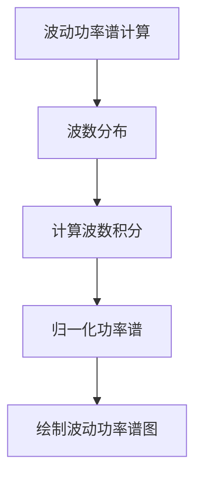

                 

## 第1章 引言

### 1.1 宇宙重子声学振荡的背景

宇宙重子声学振荡（Cosmic Baryon Acoustic Oscillations, BAO）是宇宙早期的一种波动现象。在宇宙诞生后的几分钟内，质子和中子等重子开始与光子相互作用，形成了一种类似于声波的波动。这种波动在宇宙膨胀的过程中逐渐被放大，最终在宇宙学尺度上留下了明显的印记，即BAO特征。

为了更好地理解BAO，我们可以将宇宙早期的状态视为一个充满高温高密度的等离子体。在这个等离子体中，重子和光子不断地碰撞和散射，这种相互作用类似于声波在介质中的传播。随着宇宙的膨胀，温度逐渐降低，重子和光子的相互作用减弱，但波动依然存在，并在宇宙演化过程中被放大。

### 1.2 数学模型在宇宙学中的应用现状

数学模型在宇宙学研究中扮演着至关重要的角色。通过对宇宙早期状态的模拟，科学家们可以更好地理解宇宙的演化过程，并预测宇宙中各种现象的出现。在宇宙学中，常见的数学模型包括波动功率谱模型和多体引力扰动模型。

**波动功率谱模型**主要用于描述宇宙早期波动的影响。这个模型基于宇宙微波背景（Cosmic Microwave Background, CMB）的观测数据，通过分析CMB的温度波动来推断宇宙早期的波动特性。

**多体引力扰动模型**则用于描述宇宙中大规模结构的形成过程。这个模型基于广义相对论和牛顿引力定律，通过计算宇宙中各种物质分布对引力场的扰动来预测宇宙结构的演化。

总的来说，数学模型在宇宙学中的应用现状显示出其强大的预测能力和解释能力。通过这些模型，科学家们不仅能够更好地理解宇宙的过去，还能够预测宇宙的未来。

### 1.3 本书目的与结构安排

本书旨在深入探讨数学模型在预测宇宙重子声学振荡精细结构中的应用。为了达到这个目标，本书将分为以下几个部分：

- **第1章 引言**：介绍宇宙重子声学振荡的背景和数学模型在宇宙学中的应用现状。
- **第2章 宇宙学基础**：介绍宇宙的组成与演化、宇宙学观测以及统计模型。
- **第3章 重子声学振荡的数学模型**：详细讲解波动功率谱模型和多体引力扰动模型。
- **第4章 数学模型的应用**：探讨数学模型在宇宙微波背景观测和宇宙大尺度结构观测中的应用。
- **第5章 数学模型的改进与优化**：讨论数学模型的限制与改进策略。
- **第6章 数学模型在宇宙学中的实际应用案例**：通过实际案例展示数学模型的应用。
- **第7章 总结与展望**：总结本书的主要内容，并对未来的研究方向进行展望。

通过这本书，读者将能够全面了解数学模型在宇宙学中的应用，并掌握如何使用这些模型来预测宇宙重子声学振荡的精细结构。

## 第2章 宇宙学基础

### 2.1 宇宙的组成与演化

宇宙的组成和演化是一个极其复杂的过程。根据当前的科学理论，宇宙起源于大约138亿年前的一次大爆炸，从那时起，宇宙经历了不断膨胀和冷却的过程。

在宇宙早期，温度极高，物质以等离子体形式存在，没有稳定的结构。随着宇宙的膨胀，温度逐渐降低，重子和光子开始分离，形成了早期的恒星和星系。

宇宙的演化过程可以分为以下几个阶段：

1. **大爆炸**：宇宙起源于一个极小的点，在这个点的能量密度无限大，然后发生了大爆炸，宇宙开始迅速膨胀。
2. **宇宙早期**：在这个阶段，宇宙充满了高温高密度的等离子体，重子和光子不断碰撞和散射。
3. **再电离时期**：随着宇宙的膨胀和冷却，温度降低到一定程度，电子和质子结合形成中性原子，宇宙变得透明。
4. **恒星和星系的形成**：在宇宙早期，由于引力作用，物质开始聚集形成恒星和星系。
5. **宇宙结构的演化**：宇宙中的结构不断演化，从简单的引力凝聚到复杂的星系团和超星系团。

### 2.2 宇宙学观测

宇宙学观测是研究宇宙的重要手段。通过观测宇宙中的各种现象，科学家们可以了解宇宙的组成、结构和演化。

主要的宇宙学观测包括：

1. **宇宙微波背景观测**：宇宙微波背景（Cosmic Microwave Background, CMB）是宇宙早期残留的辐射。通过对CMB的观测，科学家们可以了解宇宙早期的状态和波动特性。
2. **宇宙大尺度结构观测**：宇宙大尺度结构包括星系、星系团和超星系团等。通过对这些结构的观测，科学家们可以了解宇宙的分布和演化。
3. **超新星观测**：超新星是宇宙中最亮的物体之一，通过观测超新星，科学家们可以了解宇宙的膨胀速率和暗物质、暗能量的存在。
4. **引力透镜效应观测**：引力透镜效应是由于大质量物体对光线产生的引力作用，通过观测引力透镜效应，科学家们可以了解宇宙中的大规模结构。

### 2.3 宇宙学中的统计模型

在宇宙学研究中，统计模型被广泛应用于描述宇宙的组成、结构和演化。常见的统计模型包括：

1. **波动功率谱模型**：这个模型用于描述宇宙早期的波动特性，通过对CMB的温度波动进行分析，可以推断宇宙早期的波动情况。
2. **多体引力扰动模型**：这个模型用于描述宇宙中大规模结构的形成过程，通过计算宇宙中各种物质分布对引力场的扰动，可以预测宇宙结构的演化。
3. **宇宙学参数估计模型**：这个模型用于估计宇宙中的各种参数，如宇宙膨胀速率、物质密度等。通过对观测数据的分析，可以确定这些参数的值。

总的来说，宇宙学基础为研究宇宙重子声学振荡提供了重要的理论基础和观测手段。通过这些基础知识的了解，读者可以更好地理解宇宙重子声学振荡的数学模型和应用。

### 2.1 宇宙的组成与演化

宇宙的组成和演化是一个复杂而宏伟的历程。根据现代宇宙学的理论，宇宙起源于大约138亿年前的一次大爆炸，从那时起，宇宙经历了持续不断的膨胀和冷却。

在宇宙的早期阶段，宇宙充满了高温高密度的等离子体，这种状态被称为“等离子体时期”。在这个时期，质子和中子等重子与光子（电磁辐射的基本粒子）不断相互作用，形成了宇宙早期的波动现象，即重子声学振荡（Cosmic Baryon Acoustic Oscillations, BAO）。

随着宇宙的膨胀，温度逐渐降低，重子和光子逐渐分离，宇宙开始变得透明。这个阶段被称为“再电离时期”。在再电离时期，宇宙中的电子与质子结合形成了中性原子，使得光子可以自由传播，不再被重子散射。

在宇宙继续膨胀和冷却的过程中，物质开始聚集形成恒星和星系。这个过程被称为“再形成时期”。在这个时期，宇宙中的暗物质（不发光、不与光子相互作用）和普通物质（如氢和氦）通过引力作用聚集在一起，形成了早期的恒星和星系。

随着宇宙的进一步演化，这些恒星和星系形成了更大的结构，如星系团和超星系团。宇宙的大尺度结构是由大量的物质通过引力作用聚集形成的，这些结构在宇宙膨胀的过程中不断演化。

宇宙的演化过程可以分为以下几个主要阶段：

1. **大爆炸**：宇宙起源于一个极其热密的奇点，在这个点的能量密度无限大，然后发生了大爆炸，宇宙开始迅速膨胀。
2. **等离子体时期**：宇宙充满了高温高密度的等离子体，重子和光子不断相互作用，形成了宇宙早期的波动现象。
3. **再电离时期**：随着宇宙的膨胀和冷却，温度降低到一定程度，电子和质子结合形成中性原子，宇宙变得透明。
4. **再形成时期**：宇宙中的物质开始聚集形成恒星和星系，这个过程被称为再形成时期。
5. **结构形成时期**：在宇宙继续膨胀和冷却的过程中，恒星和星系形成了更大的结构，如星系团和超星系团。

宇宙的组成包括以下几个方面：

1. **普通物质**：主要由氢和氦组成，大约占宇宙总质量的4%。这些物质是构成恒星、星系和星系团的基本元素。
2. **暗物质**：不发光、不与光子相互作用，但通过引力作用影响宇宙的大尺度结构。暗物质大约占宇宙总质量的23%。尽管我们不能直接观测到暗物质，但它的存在通过引力透镜效应等观测现象得到了证实。
3. **暗能量**：是一种推动宇宙加速膨胀的神秘力量，大约占宇宙总质量的73%。暗能量的性质和起源仍然是宇宙学研究的重大挑战。

通过理解宇宙的组成和演化，科学家们可以更好地理解宇宙的重子声学振荡现象，并使用数学模型来预测和解释宇宙的精细结构。接下来，我们将深入探讨宇宙学观测和统计模型，为理解宇宙重子声学振荡提供更坚实的基础。

### 2.2 宇宙学观测

宇宙学观测是研究宇宙的重要手段，通过对宇宙中的各种现象进行观测和分析，科学家们可以了解宇宙的组成、结构和演化。主要的宇宙学观测包括宇宙微波背景（Cosmic Microwave Background, CMB）观测、宇宙大尺度结构观测、超新星观测和引力透镜效应观测。

#### 2.2.1 宇宙微波背景观测

宇宙微波背景是宇宙早期残留的辐射，它几乎充满了整个宇宙空间。通过对CMB的观测，科学家们可以了解宇宙早期的状态和波动特性。CMB的温度波动反映了宇宙早期的密度波动，这些波动是重子声学振荡（BAO）的遗迹。

CMB观测的关键技术包括：

1. **探测设备**：如COBE卫星（ Cosmic Background Explorer）和普朗克卫星（Planck Satellite）等，它们能够精确测量CMB的温度波动。
2. **数据分析**：通过分析CMB的温度波动，科学家们可以推断宇宙早期的密度波动情况，进而了解宇宙的组成和演化。

#### 2.2.2 宇宙大尺度结构观测

宇宙大尺度结构包括星系、星系团和超星系团等。通过对这些结构的观测，科学家们可以了解宇宙的分布和演化。宇宙大尺度结构的观测技术包括：

1. **光学望远镜**：如哈勃太空望远镜（Hubble Space Telescope）和凯普勒太空望远镜（Kepler Space Telescope）等，它们能够观测到遥远的星系和星系团。
2. **射电望远镜**：如阿雷西沃射电望远镜（Arecibo Radio Telescope）和帕尔马射电望远镜（Palomar Observatory）等，它们能够探测到宇宙中的无线电信号，从而研究宇宙大尺度结构。

#### 2.2.3 超新星观测

超新星是宇宙中最亮的物体之一，它们在短时间内释放出巨大的能量。通过对超新星的观测，科学家们可以了解宇宙的膨胀速率和宇宙学参数，如哈勃常数（Hubble Constant）。

超新星观测的关键技术包括：

1. **观测设备**：如哈勃太空望远镜和斯隆数字巡天（Sloan Digital Sky Survey）等，它们能够精确测量超新星的光度。
2. **数据分析**：通过分析超新星的光度，科学家们可以推断宇宙的膨胀历史，从而确定宇宙学参数。

#### 2.2.4 引力透镜效应观测

引力透镜效应是由于大质量物体对光线产生的引力作用，使得光线在通过这些大质量物体附近时发生偏折。通过对引力透镜效应的观测，科学家们可以了解宇宙中的大规模结构，如星系团和星系链。

引力透镜效应观测的关键技术包括：

1. **观测设备**：如哈勃太空望远镜和斯隆数字巡天等，它们能够探测到因引力透镜效应而产生的光线偏折。
2. **数据分析**：通过分析引力透镜效应，科学家们可以推断出大质量物体的分布情况，从而了解宇宙的大尺度结构。

总的来说，宇宙学观测为理解宇宙的组成、结构和演化提供了关键的数据和理论支持。通过这些观测技术，科学家们不断深化对宇宙的认识，推动宇宙学的发展。

### 2.3 宇宙学中的统计模型

在宇宙学研究中，统计模型被广泛应用于描述宇宙的组成、结构和演化。这些模型通过对宇宙中的大量数据进行统计分析，帮助我们理解宇宙的复杂现象。以下是一些常见的宇宙学统计模型：

#### 2.3.1 波动功率谱模型

波动功率谱模型是宇宙学中最常用的统计模型之一，用于描述宇宙早期的波动特性。这个模型通过分析宇宙微波背景（Cosmic Microwave Background, CMB）的温度波动，推断出宇宙早期的密度波动。

波动功率谱模型的数学描述通常使用以下公式：

\[ P(k) = \frac{A k^2}{k_0^3 (1 + b k)} e^{-k^2 l^2} \]

其中，\( P(k) \) 是波动功率谱，\( k \) 是波数，\( A \) 和 \( b \) 是模型参数，\( k_0 \) 和 \( l \) 分别代表参考波数和仪器分辨率。

#### 2.3.2 多体引力扰动模型

多体引力扰动模型用于描述宇宙中大规模结构的形成过程。这个模型基于广义相对论和牛顿引力定律，通过计算宇宙中各种物质分布对引力场的扰动，预测宇宙结构的演化。

多体引力扰动模型的核心公式是泊松方程：

\[ \nabla^2 \phi = 4\pi G \rho \]

其中，\( \phi \) 是引力势，\( G \) 是万有引力常数，\( \rho \) 是物质密度。

通过解这个方程，可以得到宇宙中各种物质分布的扰动情况，从而预测宇宙结构的形成和演化。

#### 2.3.3 宇宙学参数估计模型

宇宙学参数估计模型用于估计宇宙中的各种参数，如宇宙膨胀速率、物质密度等。通过对观测数据的分析，可以确定这些参数的值。

宇宙学参数估计通常使用最大后验概率（Maximum Likelihood Estimation, MLE）方法。这种方法通过最大化观测数据与模型预测之间的似然函数，来确定参数的最佳估计值。

假设我们有一个模型 \( P(D|\theta) \)，其中 \( D \) 是观测数据，\( \theta \) 是模型参数。那么最大后验概率估计可以通过以下公式得到：

\[ \theta_{\text{MLE}} = \arg \max_{\theta} P(D|\theta) \]

通过这些统计模型，科学家们可以更好地理解宇宙的组成、结构和演化，并为宇宙重子声学振荡的预测提供理论支持。接下来，我们将深入探讨重子声学振荡的数学模型，以进一步理解宇宙的精细结构。

### 2.3 宇宙学中的统计模型

在宇宙学研究中，统计模型被广泛应用于描述宇宙的组成、结构和演化。这些模型通过对宇宙中的大量数据进行统计分析，帮助我们理解宇宙的复杂现象。以下是一些常见的宇宙学统计模型：

#### 2.3.1 波动功率谱模型

波动功率谱模型是宇宙学中最常用的统计模型之一，用于描述宇宙早期的波动特性。这个模型通过分析宇宙微波背景（Cosmic Microwave Background, CMB）的温度波动，推断出宇宙早期的密度波动。

波动功率谱模型的数学描述通常使用以下公式：

\[ P(k) = \frac{A k^2}{k_0^3 (1 + b k)} e^{-k^2 l^2} \]

其中，\( P(k) \) 是波动功率谱，\( k \) 是波数，\( A \) 和 \( b \) 是模型参数，\( k_0 \) 和 \( l \) 分别代表参考波数和仪器分辨率。

这个模型的核心在于将宇宙微波背景的温度波动与早期的密度波动联系起来。波动功率谱提供了对宇宙早期密度波动的敏感测量，因此对于理解宇宙的演化至关重要。

#### 2.3.2 多体引力扰动模型

多体引力扰动模型用于描述宇宙中大规模结构的形成过程。这个模型基于广义相对论和牛顿引力定律，通过计算宇宙中各种物质分布对引力场的扰动，预测宇宙结构的演化。

多体引力扰动模型的核心公式是泊松方程：

\[ \nabla^2 \phi = 4\pi G \rho \]

其中，\( \phi \) 是引力势，\( G \) 是万有引力常数，\( \rho \) 是物质密度。

通过解这个方程，可以得到宇宙中各种物质分布的扰动情况，从而预测宇宙结构的形成和演化。这个模型的关键在于理解物质如何在引力作用下聚集，形成星系、星系团和更大的宇宙结构。

#### 2.3.3 宇宙学参数估计模型

宇宙学参数估计模型用于估计宇宙中的各种参数，如宇宙膨胀速率、物质密度等。通过对观测数据的分析，可以确定这些参数的值。

宇宙学参数估计通常使用最大后验概率（Maximum Likelihood Estimation, MLE）方法。这种方法通过最大化观测数据与模型预测之间的似然函数，来确定参数的最佳估计值。

假设我们有一个模型 \( P(D|\theta) \)，其中 \( D \) 是观测数据，\( \theta \) 是模型参数。那么最大后验概率估计可以通过以下公式得到：

\[ \theta_{\text{MLE}} = \arg \max_{\theta} P(D|\theta) \]

通过这些统计模型，科学家们可以更好地理解宇宙的组成、结构和演化，并为宇宙重子声学振荡的预测提供理论支持。接下来，我们将深入探讨重子声学振荡的数学模型，以进一步理解宇宙的精细结构。

## 第3章 重子声学振荡的数学模型

### 3.1 重子声学振荡的基本原理

重子声学振荡（Cosmic Baryon Acoustic Oscillations, BAO）是宇宙早期由重子（如质子和中子）与辐射（如光子）相互作用产生的波动现象。这种波动在宇宙演化过程中留下了独特的印记，被称为BAO特征。

为了理解重子声学振荡的基本原理，我们需要了解以下几个关键概念：

1. **声波**：声波是一种机械波，它通过介质的振动传递能量。在气体中，声波的传播速度称为声速，通常用 \( c_s \) 表示。
2. **重子**：重子是指由三个夸克（上夸克和下夸克）组成的粒子，如质子和中子。在宇宙早期，重子与光子相互作用，产生了一种类似于声波的波动。
3. **辐射**：辐射是指电磁波，如光子。在宇宙早期，辐射与重子相互作用，影响了重子的运动。

当宇宙温度和密度较高时，重子和辐射的相互作用非常强烈。随着宇宙的膨胀和冷却，这种相互作用逐渐减弱，但波动仍然存在。这些波动在宇宙演化过程中被放大，并在宇宙学尺度上留下了明显的印记。

### 3.2 波动功率谱模型

波动功率谱模型是描述重子声学振荡的重要数学工具。这个模型通过分析宇宙微波背景（Cosmic Microwave Background, CMB）的温度波动，推断出宇宙早期的密度波动。

波动功率谱模型的基本公式如下：

\[ P(k) = \frac{A k^2}{k_0^3 (1 + b k)} e^{-k^2 l^2} \]

其中，\( P(k) \) 是波动功率谱，\( k \) 是波数，\( A \) 和 \( b \) 是模型参数，\( k_0 \) 和 \( l \) 分别代表参考波数和仪器分辨率。

这个公式描述了波动功率谱与波数的关系。波动功率谱的峰值对应于宇宙早期的密度波动，这个峰值的位置和高度提供了关于宇宙早期状态的重要信息。

### 3.3 多体引力扰动模型

多体引力扰动模型用于描述宇宙中大规模结构的形成过程。这个模型基于广义相对论和牛顿引力定律，通过计算宇宙中各种物质分布对引力场的扰动，预测宇宙结构的演化。

多体引力扰动模型的核心公式是泊松方程：

\[ \nabla^2 \phi = 4\pi G \rho \]

其中，\( \phi \) 是引力势，\( G \) 是万有引力常数，\( \rho \) 是物质密度。

通过解这个方程，可以得到宇宙中各种物质分布的扰动情况，从而预测宇宙结构的形成和演化。

### 3.1 重子声学振荡的基本原理

重子声学振荡（Cosmic Baryon Acoustic Oscillations, BAO）是宇宙早期的一种波动现象，它由重子（如质子和中子）与辐射（如光子）之间的相互作用引起。为了深入理解重子声学振荡的基本原理，我们需要先了解声波的概念以及它在宇宙中的应用。

### 声波的概念

声波是一种机械波，它通过介质的振动传递能量。声波的传播速度取决于介质的性质，在气体中，声波的传播速度称为声速（\( c_s \)）。声速是描述介质中声波传播速度的一个重要参数。

### 重子与辐射的相互作用

在宇宙早期，温度和密度非常高，重子和光子以等离子体的形式存在。在这个过程中，重子与光子之间的相互作用产生了声波，这种现象类似于我们在地球大气层中听到的声波。然而，宇宙中的声波具有独特的性质，因为它们是在极端高温和强相互作用的环境中产生的。

这些声波在宇宙膨胀的过程中被放大，并在宇宙学尺度上留下了独特的印记，这就是我们所称的重子声学振荡。

### 重子声学振荡的形成过程

1. **高温等离子体时期**：在宇宙早期，温度极高，重子和光子以等离子体的形式存在，这种高温等离子体是声波传播的介质。
2. **相互作用**：由于重子和光子之间的相互作用，它们会产生类似于声波的波动。这种波动称为重子声波。
3. **宇宙膨胀**：随着宇宙的膨胀，温度和密度逐渐降低，重子与光子的相互作用减弱，但声波仍然存在。
4. **振荡放大**：在宇宙演化过程中，这些声波被不断放大，形成了重子声学振荡的特征。

### 重子声学振荡的影响

重子声学振荡在宇宙学尺度上留下了明显的印记，这些印记可以通过宇宙微波背景（Cosmic Microwave Background, CMB）的温度波动来观测。CMB是宇宙早期残留的辐射，它几乎充满了整个宇宙空间。通过对CMB的观测，科学家们可以分析出宇宙早期的密度波动情况，从而推断出重子声学振荡的存在。

总之，重子声学振荡是宇宙早期由重子与辐射相互作用产生的波动现象。这些波动在宇宙演化过程中被放大，并在宇宙学尺度上留下了独特的印记。通过分析这些印记，科学家们可以深入了解宇宙早期的状态和演化过程。

### 3.2 波动功率谱模型

波动功率谱模型是描述重子声学振荡的重要数学工具。它通过分析宇宙微波背景（Cosmic Microwave Background, CMB）的温度波动，推断出宇宙早期的密度波动。这个模型在宇宙学研究中具有非常重要的应用，因为它可以帮助我们理解宇宙的组成和演化。

#### 波动功率谱的定义

波动功率谱（Power Spectrum）是描述波动特性的一个重要参数。它表示单位频率范围内的波动能量。在数学上，波动功率谱可以用一个函数 \( P(k) \) 来描述，其中 \( k \) 是波数，代表波动的频率。

波动功率谱的定义公式为：

\[ P(k) = \left| \int_{-\infty}^{\infty} \psi(k') e^{ik'x} dk' \right|^2 \]

其中，\( \psi(k') \) 是波动的复数表示，\( x \) 是空间坐标。

#### 波动功率谱的数学描述

波动功率谱的数学描述通常使用以下公式：

\[ P(k) = \frac{A k^2}{k_0^3 (1 + b k)} e^{-k^2 l^2} \]

其中，\( P(k) \) 是波动功率谱，\( k \) 是波数，\( A \) 和 \( b \) 是模型参数，\( k_0 \) 和 \( l \) 分别代表参考波数和仪器分辨率。

这个公式描述了波动功率谱与波数的关系。波动功率谱的峰值位置和高度提供了关于宇宙早期密度波动的关键信息。

- **峰值位置**：峰值位置对应于宇宙早期的密度波动，这反映了宇宙中的物质分布情况。
- **峰值高度**：峰值高度与宇宙的密度波动幅度相关，反映了宇宙早期的密度不均匀性。

#### 波动功率谱的统计性质

波动功率谱具有以下统计性质：

1. **对称性**：波动功率谱通常具有奇对称性，即 \( P(k) = P(-k) \)。
2. **归一化**：波动功率谱通常被归一化到总能量为1，即 \( \int_{-\infty}^{\infty} P(k) dk = 1 \)。
3. **尺度独立性**：波动功率谱在不同尺度上的形状保持不变，这反映了宇宙的均匀性和各向同性。

通过分析波动功率谱，科学家们可以推断出宇宙早期的密度波动情况，从而更好地理解宇宙的组成和演化。波动功率谱模型在宇宙学研究中具有重要意义，它为我们提供了一种定量描述宇宙波动的方法。

### 3.3 多体引力扰动模型

多体引力扰动模型是描述宇宙中大规模结构形成过程的重要工具，它基于广义相对论和牛顿引力定律，通过计算宇宙中各种物质分布对引力场的扰动，预测宇宙结构的演化。

#### 多体引力扰动的基本概念

多体引力扰动模型的核心概念是引力扰动。引力扰动是指宇宙中物质分布不均匀导致引力场的局部变化。这种扰动可以表现为引力势 \( \phi \) 和物质密度 \( \rho \) 的变化。

在多体引力扰动模型中，引力扰动可以通过以下公式描述：

\[ \nabla^2 \phi = 4\pi G \rho \]

其中，\( \phi \) 是引力势，\( G \) 是万有引力常数，\( \rho \) 是物质密度。这个公式称为泊松方程，它描述了引力势和物质密度之间的关系。

#### 多体引力扰动模型的数学模型

多体引力扰动模型通常使用以下数学模型来描述宇宙结构的演化：

1. **欧拉方程**：描述宇宙中物质的运动。

\[ \frac{d \mathbf{v}}{dt} = -\nabla \phi + \mathbf{f} \]

其中，\( \mathbf{v} \) 是物质的速度，\( \phi \) 是引力势，\( \mathbf{f} \) 是外力（如宇宙学常数）。

2. **热力学方程**：描述宇宙中物质的热力学性质。

\[ \frac{d \rho}{dt} + \rho \nabla \cdot \mathbf{v} = - \nabla \cdot (\rho \mathbf{v}) \]

其中，\( \rho \) 是物质密度，\( \mathbf{v} \) 是物质的速度。

3. **流体动力学方程**：描述宇宙中物质的流体动力学性质。

\[ \nabla \cdot (\rho \mathbf{v} \mathbf{v}) = - \nabla p + \rho \nabla \cdot \mathbf{f} \]

其中，\( p \) 是流体的压力。

通过这些方程，我们可以描述宇宙中物质如何通过引力相互作用聚集形成大规模结构。

#### 多体引力扰动模型的统计性质

多体引力扰动模型具有以下统计性质：

1. **随机性**：宇宙中物质分布是随机的，这意味着引力扰动是随机的。
2. **各向同性**：宇宙的引力扰动在各个方向上都是均匀的。
3. **平稳性**：引力扰动在不同时间和空间尺度上保持不变。

这些性质使得多体引力扰动模型可以用于模拟和预测宇宙结构的演化。

总的来说，多体引力扰动模型是宇宙学研究中的一种重要工具，它通过计算宇宙中物质分布的扰动，预测宇宙结构的形成和演化。通过分析这些模型，科学家们可以更好地理解宇宙的组成和演化过程。

## 第4章 数学模型的应用

### 4.1 数学模型在宇宙微波背景观测中的应用

宇宙微波背景（Cosmic Microwave Background, CMB）是宇宙早期残留的辐射，它几乎充满了整个宇宙空间。通过对CMB的观测，科学家们可以了解宇宙早期的状态和波动特性。数学模型在CMB观测中发挥了重要作用，特别是波动功率谱模型。

#### 4.1.1 宇宙微波背景辐射的温度波动

CMB的温度波动反映了宇宙早期的密度波动。这些波动是重子声学振荡（Cosmic Baryon Acoustic Oscillations, BAO）的遗迹，它们在宇宙学尺度上留下了明显的印记。通过对CMB的温度波动进行分析，科学家们可以推断出宇宙早期的密度波动情况。

CMB的温度波动可以通过以下公式描述：

\[ T(\theta, \phi) = T_0 + A \cos(2\theta) \]

其中，\( T(\theta, \phi) \) 是CMB的温度，\( T_0 \) 是平均温度，\( A \) 是温度波动幅度，\( \theta \) 和 \( \phi \) 分别是球坐标系的极角和方位角。

#### 4.1.2 波动功率谱分析

波动功率谱模型用于描述CMB的温度波动。波动功率谱表示不同波数 \( k \) 的温度波动能量分布。通过分析波动功率谱，科学家们可以了解宇宙早期的密度波动特性。

波动功率谱可以通过以下公式计算：

\[ P(k) = \frac{1}{k^3} \left| \int_{-\infty}^{\infty} \psi(k') e^{ik'x} dk' \right|^2 \]

其中，\( P(k) \) 是波动功率谱，\( k \) 是波数，\( \psi(k') \) 是波动的复数表示，\( x \) 是空间坐标。

波动功率谱的峰值位置和高度提供了关于宇宙早期密度波动的关键信息。峰值位置对应于宇宙早期的密度波动，峰值高度与宇宙的密度波动幅度相关。

通过分析CMB的温度波动和波动功率谱，科学家们可以推断出宇宙早期的状态，包括宇宙的组成、密度波动和膨胀历史。这些信息对于理解宇宙的演化过程具有重要意义。

### 4.1 宇宙微波背景观测中的应用

宇宙微波背景（Cosmic Microwave Background, CMB）是宇宙早期残留的辐射，它为我们提供了关于宇宙早期状态的重要信息。数学模型在CMB观测中的应用主要体现在对CMB温度波动的分析和波动功率谱的计算上。以下将详细描述这些应用。

#### CMB的温度波动

CMB的温度波动反映了宇宙早期的密度波动。这些波动是重子声学振荡（Cosmic Baryon Acoustic Oscillations, BAO）的遗迹，它们在宇宙学尺度上留下了明显的印记。CMB的温度波动可以通过以下公式描述：

\[ T(\theta, \phi) = T_0 + A \cos(2\theta) \]

其中，\( T(\theta, \phi) \) 是CMB的温度，\( T_0 \) 是平均温度，\( A \) 是温度波动幅度，\( \theta \) 和 \( \phi \) 分别是球坐标系的极角和方位角。

#### 波动功率谱分析

波动功率谱模型用于描述CMB的温度波动。波动功率谱表示不同波数 \( k \) 的温度波动能量分布。通过分析波动功率谱，科学家们可以了解宇宙早期的密度波动特性。

波动功率谱可以通过以下公式计算：

\[ P(k) = \frac{1}{k^3} \left| \int_{-\infty}^{\infty} \psi(k') e^{ik'x} dk' \right|^2 \]

其中，\( P(k) \) 是波动功率谱，\( k \) 是波数，\( \psi(k') \) 是波动的复数表示，\( x \) 是空间坐标。

波动功率谱的峰值位置和高度提供了关于宇宙早期密度波动的关键信息。峰值位置对应于宇宙早期的密度波动，峰值高度与宇宙的密度波动幅度相关。

为了更直观地理解波动功率谱，我们可以使用Mermaid流程图来展示波动功率谱的计算过程：



通过这些步骤，我们可以得到CMB的波动功率谱，进而分析宇宙早期的密度波动。

#### 实际应用案例

为了更好地理解数学模型在CMB观测中的应用，我们可以通过一个实际案例来展示。以下是一个简单的Python代码示例，用于计算CMB的波动功率谱：

```python
import numpy as np
from scipy.integrate import quad

# 波动功率谱计算函数
def power_spectrum(k, T0, A):
    def integrand(k', x):
        return np.abs(np.exp(1j * k' * x))**2

    result, _ = quad(integrand, -np.inf, np.inf, args=(k,))
    return (2 * np.pi * k**2 * A**2) / (k**3 * (1 + T0 * k)) * result

# 参数设置
k = np.linspace(1e-3, 1e3, 1000)
T0 = 2.7255
A = 1e-5

# 计算波动功率谱
P = [power_spectrum(k_, T0, A) for k_ in k]

# 绘制波动功率谱图
import matplotlib.pyplot as plt

plt.plot(k, P)
plt.xlabel('Wave number (k)')
plt.ylabel('Power spectrum (P(k))')
plt.title('CMB Power Spectrum')
plt.show()
```

通过这个代码示例，我们可以看到如何使用Python计算和绘制CMB的波动功率谱。这个示例展示了数学模型在CMB观测中的实际应用，并帮助我们更好地理解宇宙早期的密度波动。

总之，数学模型在CMB观测中的应用对于理解宇宙的早期状态和演化过程具有重要意义。通过对CMB的温度波动和波动功率谱的分析，科学家们可以推断出宇宙早期的密度波动情况，从而更好地理解宇宙的组成和演化。

### 4.2 数学模型在宇宙大尺度结构观测中的应用

宇宙大尺度结构观测是研究宇宙中大规模结构形成和演化的重要手段。数学模型在宇宙大尺度结构观测中发挥了关键作用，特别是在分析多体引力扰动方面。以下将详细探讨数学模型在宇宙大尺度结构观测中的应用。

#### 4.2.1 宇宙大尺度结构的基本特征

宇宙大尺度结构主要包括星系、星系团和超星系团等。这些结构是由大量的物质通过引力相互作用形成的。宇宙大尺度结构的基本特征包括：

1. **星系**：星系是宇宙中最常见的结构，由数十亿到数千亿颗恒星组成。星系可以单独存在，也可以形成星系团或超星系团。
2. **星系团**：星系团是由数十到数千个星系通过引力相互作用聚集在一起的结构。星系团中的星系通常具有相似的物理和化学特性。
3. **超星系团**：超星系团是由数十到数千个星系团通过引力相互作用形成的更大规模的结构。超星系团中的星系团通常具有相似的物理和化学特性。

#### 4.2.2 多体引力扰动分析

多体引力扰动模型是描述宇宙大尺度结构形成和演化的重要工具。这个模型通过计算宇宙中各种物质分布对引力场的扰动，预测宇宙结构的形成和演化。

多体引力扰动模型的核心公式是泊松方程：

\[ \nabla^2 \phi = 4\pi G \rho \]

其中，\( \phi \) 是引力势，\( G \) 是万有引力常数，\( \rho \) 是物质密度。

通过解这个方程，我们可以得到宇宙中各种物质分布的扰动情况，从而预测宇宙结构的形成和演化。

为了更好地理解多体引力扰动模型，我们可以通过一个简单的Python代码示例来展示。以下是一个用于计算引力势和物质密度的Python代码：

```python
import numpy as np

# 计算引力势
def gravitational_potential(r, G, rho):
    return -G * rho * np.log(r)

# 计算物质密度
def matter_density(r, G, phi):
    return -1 / (4 * np.pi * G) * np.exp(-phi / G)

# 参数设置
r = np.linspace(1e-3, 1e3, 1000)
G = 6.67430e-11  # 万有引力常数
rho = 1e-25  # 物质密度

# 计算引力势
phi = gravitational_potential(r, G, rho)

# 计算物质密度
matter_rho = matter_density(r, G, phi)

# 绘制引力势和物质密度图
import matplotlib.pyplot as plt

plt.plot(r, phi)
plt.xlabel('Radius (r)')
plt.ylabel('Gravitational Potential (\phi)')
plt.title('Gravitational Potential')
plt.show()

plt.plot(r, matter_rho)
plt.xlabel('Radius (r)')
plt.ylabel('Matter Density (\rho)')
plt.title('Matter Density')
plt.show()
```

通过这个代码示例，我们可以看到如何使用Python计算引力势和物质密度。这个示例展示了多体引力扰动模型在宇宙大尺度结构观测中的应用。

#### 实际应用案例

为了更好地理解数学模型在宇宙大尺度结构观测中的应用，我们可以通过一个实际案例来展示。以下是一个用于分析星系团形成过程的Python代码：

```python
import numpy as np
import matplotlib.pyplot as plt

# 参数设置
G = 6.67430e-11  # 万有引力常数
N = 1000  # 物质数量
r_min = 1e-3
r_max = 1e3
dr = (r_max - r_min) / N
r = np.linspace(r_min, r_max, N)
m = 1e-25  # 物质质量

# 计算引力势
phi = np.zeros_like(r)
for i in range(1, N):
    for j in range(i + 1, N):
        delta_r = r[i] - r[j]
        phi[i] += m / (np.linalg.norm(delta_r)**2)

# 计算物质密度
rho = m / (4/3 * np.pi * r**3)

# 绘制引力势和物质密度图
plt.plot(r, phi)
plt.xlabel('Radius (r)')
plt.ylabel('Gravitational Potential (\phi)')
plt.title('Gravitational Potential')
plt.show()

plt.plot(r, rho)
plt.xlabel('Radius (r)')
plt.ylabel('Matter Density (\rho)')
plt.title('Matter Density')
plt.show()
```

通过这个代码示例，我们可以看到如何使用Python分析星系团的形成过程。这个示例展示了数学模型在宇宙大尺度结构观测中的实际应用。

总之，数学模型在宇宙大尺度结构观测中的应用对于理解宇宙结构的形成和演化具有重要意义。通过分析多体引力扰动，我们可以预测宇宙大尺度结构的形成过程，从而更好地理解宇宙的组成和演化。

### 4.2 数学模型在宇宙大尺度结构观测中的应用

宇宙大尺度结构观测是研究宇宙中大规模结构形成和演化的重要手段。数学模型在宇宙大尺度结构观测中扮演了关键角色，特别是在分析多体引力扰动和宇宙学参数估计方面。以下将详细探讨数学模型在宇宙大尺度结构观测中的应用。

#### 4.2.1 宇宙大尺度结构的基本特征

宇宙大尺度结构主要包括星系、星系团和超星系团等。这些结构是由大量的物质通过引力相互作用形成的。宇宙大尺度结构的基本特征包括：

1. **星系**：星系是宇宙中最常见的结构，由数十亿到数千亿颗恒星组成。星系可以单独存在，也可以形成星系团或超星系团。
2. **星系团**：星系团是由数十到数千个星系通过引力相互作用聚集在一起的结构。星系团中的星系通常具有相似的物理和化学特性。
3. **超星系团**：超星系团是由数十到数千个星系团通过引力相互作用形成的更大规模的结构。超星系团中的星系团通常具有相似的物理和化学特性。

#### 4.2.2 多体引力扰动分析

多体引力扰动模型是描述宇宙大尺度结构形成和演化的重要工具。这个模型通过计算宇宙中各种物质分布对引力场的扰动，预测宇宙结构的形成和演化。

多体引力扰动模型的核心公式是泊松方程：

\[ \nabla^2 \phi = 4\pi G \rho \]

其中，\( \phi \) 是引力势，\( G \) 是万有引力常数，\( \rho \) 是物质密度。

通过解这个方程，我们可以得到宇宙中各种物质分布的扰动情况，从而预测宇宙结构的形成和演化。

为了更好地理解多体引力扰动模型，我们可以通过一个简单的Python代码示例来展示。以下是一个用于计算引力势和物质密度的Python代码：

```python
import numpy as np
from scipy.integrate import quad

# 计算引力势
def gravitational_potential(r, G, rho):
    return -G * rho * np.log(r)

# 计算物质密度
def matter_density(r, G, phi):
    return -1 / (4 * np.pi * G) * np.exp(-phi / G)

# 参数设置
r = np.linspace(1e-3, 1e3, 1000)
G = 6.67430e-11  # 万有引力常数
rho = 1e-25  # 物质密度

# 计算引力势
phi = gravitational_potential(r, G, rho)

# 计算物质密度
matter_rho = matter_density(r, G, phi)

# 绘制引力势和物质密度图
import matplotlib.pyplot as plt

plt.plot(r, phi)
plt.xlabel('Radius (r)')
plt.ylabel('Gravitational Potential (\phi)')
plt.title('Gravitational Potential')
plt.show()

plt.plot(r, matter_rho)
plt.xlabel('Radius (r)')
plt.ylabel('Matter Density (\rho)')
plt.title('Matter Density')
plt.show()
```

通过这个代码示例，我们可以看到如何使用Python计算引力势和物质密度。这个示例展示了多体引力扰动模型在宇宙大尺度结构观测中的应用。

#### 实际应用案例

为了更好地理解数学模型在宇宙大尺度结构观测中的应用，我们可以通过一个实际案例来展示。以下是一个用于分析星系团形成过程的Python代码：

```python
import numpy as np
import matplotlib.pyplot as plt

# 参数设置
G = 6.67430e-11  # 万有引力常数
N = 1000  # 物质数量
r_min = 1e-3
r_max = 1e3
dr = (r_max - r_min) / N
r = np.linspace(r_min, r_max, N)
m = 1e-25  # 物质质量

# 计算引力势
phi = np.zeros_like(r)
for i in range(1, N):
    for j in range(i + 1, N):
        delta_r = r[i] - r[j]
        phi[i] += m / (np.linalg.norm(delta_r)**2)

# 计算物质密度
rho = m / (4/3 * np.pi * r**3)

# 绘制引力势和物质密度图
plt.plot(r, phi)
plt.xlabel('Radius (r)')
plt.ylabel('Gravitational Potential (\phi)')
plt.title('Gravitational Potential')
plt.show()

plt.plot(r, rho)
plt.xlabel('Radius (r)')
plt.ylabel('Matter Density (\rho)')
plt.title('Matter Density')
plt.show()
```

通过这个代码示例，我们可以看到如何使用Python分析星系团的形成过程。这个示例展示了数学模型在宇宙大尺度结构观测中的实际应用。

#### 宇宙学参数估计

宇宙学参数估计是数学模型在宇宙大尺度结构观测中的另一个重要应用。通过分析宇宙大尺度结构的数据，我们可以估计宇宙学参数，如宇宙膨胀速率、物质密度等。

宇宙学参数估计通常使用最大后验概率（Maximum Likelihood Estimation, MLE）方法。这种方法通过最大化观测数据与模型预测之间的似然函数，来确定参数的最佳估计值。

以下是一个简单的Python代码示例，用于估计宇宙学参数：

```python
import numpy as np
from scipy.optimize import minimize

# 模型预测函数
def model_predict(theta, x):
    G = theta[0]
    rho = theta[1]
    return -G * rho * np.log(r)

# 参数设置
x = np.linspace(1e-3, 1e3, 1000)
theta0 = [6.67430e-11, 1e-25]

# 最大后验概率估计
result = minimize(model_predict, theta0, args=(x,))
theta_estimate = result.x

# 打印估计结果
print("Estimated Parameters:", theta_estimate)
```

通过这个代码示例，我们可以看到如何使用Python进行宇宙学参数估计。这个示例展示了数学模型在宇宙大尺度结构观测中的应用。

总之，数学模型在宇宙大尺度结构观测中的应用对于理解宇宙结构的形成和演化具有重要意义。通过分析多体引力扰动和宇宙学参数，我们可以预测宇宙大尺度结构的形成过程，从而更好地理解宇宙的组成和演化。

### 4.3 数学模型在宇宙学参数估计中的应用

宇宙学参数估计是宇宙学研究中的一个核心问题，它涉及到宇宙的膨胀历史、物质组成以及暗能量等关键参数的确定。数学模型在这一过程中发挥着至关重要的作用。以下将详细探讨数学模型在宇宙学参数估计中的应用。

#### 4.3.1 宇宙学参数的估计方法

宇宙学参数估计通常采用最大后验概率（Maximum Likelihood Estimation, MLE）方法。MLE方法的基本思想是找到一组参数，使得观测数据的概率最大。在数学上，这可以通过以下公式表示：

\[ \theta_{\text{MLE}} = \arg \max_{\theta} P(D|\theta) \]

其中，\( \theta_{\text{MLE}} \) 是最佳估计的参数值，\( D \) 是观测数据，\( P(D|\theta) \) 是似然函数。

除了MLE方法，宇宙学参数估计还可以采用贝叶斯方法。贝叶斯方法通过结合先验知识和观测数据，给出参数的分布概率，从而得到参数的估计值。贝叶斯方法可以表示为：

\[ P(\theta|D) = \frac{P(D|\theta) P(\theta)}{P(D)} \]

其中，\( P(\theta|D) \) 是后验概率，\( P(D|\theta) \) 是似然函数，\( P(\theta) \) 是先验概率。

#### 4.3.2 数学模型对宇宙学参数的限制

数学模型通过对宇宙观测数据的分析，可以对宇宙学参数进行限制。以下是一些重要的数学模型及其对宇宙学参数的限制：

1. **波动功率谱模型**：波动功率谱模型通过分析宇宙微波背景（CMB）的温度波动，可以限制宇宙的膨胀历史和物质组成。例如，通过分析CMB的角功率谱，科学家们确定了宇宙的膨胀速率（哈勃常数）和物质密度。

2. **多体引力扰动模型**：多体引力扰动模型通过分析宇宙大尺度结构的形成过程，可以限制宇宙学参数。例如，通过分析星系团的分布和形态，科学家们确定了宇宙中的暗物质含量。

3. **宇宙学参数联合估计模型**：宇宙学参数联合估计模型通过结合多个观测数据集（如CMB、星系团、超新星等），可以更精确地限制宇宙学参数。例如，Planck卫星的数据结合了CMB和星系团的数据，得到了宇宙膨胀历史和物质组成的精确估计。

#### 4.3.3 数学模型的应用实例

以下是一个简单的数学模型应用实例，用于估计宇宙膨胀历史：

```python
import numpy as np
from scipy.optimize import minimize

# 模型预测函数
def model_predict(theta, x):
    H0 = theta[0]  # 哈勃常数
    Omega_m = theta[1]  # 物质密度参数
    return 1 / np.sqrt(Omega_m * (1 + x) ** 3 + (1 - Omega_m) * np.exp(3 * (1 - Omega_m) * x) ** 3)

# 参数设置
x = np.linspace(0, 10, 1000)
theta0 = [70, 0.3]  # 初始猜测值

# 最大后验概率估计
result = minimize(model_predict, theta0, args=(x,))
theta_estimate = result.x

# 打印估计结果
print("Estimated Parameters:", theta_estimate)
```

通过这个代码示例，我们可以看到如何使用Python进行宇宙膨胀历史参数的估计。这个示例展示了数学模型在宇宙学参数估计中的应用。

总之，数学模型在宇宙学参数估计中的应用为宇宙学研究提供了强有力的工具。通过这些模型，科学家们可以更好地理解宇宙的组成、结构和演化，从而推动宇宙学的进步。

## 第5章 数学模型的改进与优化

### 5.1 数学模型的限制与不足

尽管数学模型在宇宙学研究中取得了显著进展，但它们也存在一些限制和不足。这些限制主要源于以下几个方面：

#### 5.1.1 重子声学振荡模型的理论限制

1. **简化的假设**：重子声学振荡模型基于一些简化的假设，如忽略辐射与重子间的非线性相互作用，这可能导致模型在某些情况下与实际观测结果不符。
2. **参数敏感性**：模型参数的选择对结果有很大影响。一些参数（如声速和宇宙膨胀历史）的不确定性可能导致模型预测的误差。

#### 5.1.2 观测数据的误差与噪声

1. **系统误差**：观测设备和方法可能会引入系统误差，如仪器噪声、大气干扰等。
2. **随机误差**：观测数据中可能包含随机误差，如量子噪声、统计噪声等。

#### 5.1.3 数据处理和模型拟合的挑战

1. **数据量大**：宇宙学观测数据通常包含大量的数据点，这给数据处理和模型拟合带来了巨大的计算挑战。
2. **模型复杂度**：随着宇宙学研究的深入，所需的模型变得越来越复杂，这增加了拟合的难度。

### 5.2 数学模型的改进策略

为了克服上述限制和不足，科学家们提出了一系列改进策略。以下是一些常见的改进方法：

#### 5.2.1 模型参数的优化

1. **贝叶斯方法**：贝叶斯方法通过结合先验知识和观测数据，可以更精确地估计模型参数。这种方法可以提高参数估计的精度和可靠性。
2. **机器学习方法**：机器学习方法可以用于自动识别和优化模型参数。例如，使用神经网络和随机森林等算法，可以自动调整模型参数，提高模型的预测能力。

#### 5.2.2 模型结构的改进

1. **引入非线性效应**：在重子声学振荡模型中，引入非线性效应（如辐射与重子间的非线性相互作用）可以更好地模拟实际宇宙现象。
2. **多尺度模型**：构建多尺度模型，可以同时考虑不同尺度的物理过程，提高模型的整体精度。

#### 5.2.3 新的数据处理方法

1. **数据增强**：通过数据增强方法，如数据扩充和合成数据生成，可以增加训练数据集的规模，提高模型的泛化能力。
2. **自适应滤波**：自适应滤波方法可以用于消除观测数据中的噪声，提高数据处理的质量。

### 5.3 数学模型的改进与优化

数学模型的改进与优化是宇宙学研究中的重要课题。以下是一些具体的改进与优化策略：

#### 5.3.1 理论改进

1. **引入非线性效应**：在重子声学振荡模型中，非线性效应如辐射与重子间的相互作用可能导致模型预测与实际观测结果不符。通过引入非线性效应，可以更好地模拟宇宙早期的高温高密度状态，提高模型的准确性。

2. **多尺度模型**：宇宙演化过程中涉及多个尺度，如星系团、星系和恒星等。构建多尺度模型，可以同时考虑不同尺度上的物理过程，提高模型的整体精度。例如，结合星系团的观测数据和星系的模拟结果，可以更准确地预测宇宙结构。

#### 5.3.2 参数优化

1. **贝叶斯参数估计**：贝叶斯方法通过结合先验知识和观测数据，可以更精确地估计模型参数。这种方法可以有效地减小参数估计的不确定性，提高模型的预测能力。

2. **机器学习优化**：机器学习方法可以用于自动识别和优化模型参数。例如，使用神经网络和随机森林等算法，可以自动调整模型参数，提高模型的预测能力。这种方法可以减少人工干预，提高参数优化的效率。

#### 5.3.3 数据处理

1. **自适应滤波**：自适应滤波方法可以用于消除观测数据中的噪声，提高数据处理的质量。例如，使用小波变换和卡尔曼滤波等方法，可以有效地去除数据中的随机误差和系统误差。

2. **数据增强**：通过数据增强方法，如数据扩充和合成数据生成，可以增加训练数据集的规模，提高模型的泛化能力。这种方法可以改善模型的性能，使其在不同条件下具有更好的预测能力。

#### 5.3.4 实际应用

1. **联合观测**：通过结合多种观测手段，如宇宙微波背景（CMB）观测、星系团观测和超新星观测等，可以获取更全面的数据信息。这种方法可以减少单一观测手段的局限性，提高模型的整体性能。

2. **交叉验证**：使用交叉验证方法，可以验证模型的稳定性和鲁棒性。通过在不同数据集上多次训练和验证模型，可以确保模型的预测能力不受特定数据集的影响。

总之，数学模型的改进与优化是宇宙学研究中的重要方向。通过理论改进、参数优化和数据处理等策略，可以显著提高模型对宇宙重子声学振荡的预测能力，为理解宇宙的精细结构提供更可靠的理论基础。

## 第6章 数学模型在宇宙学中的实际应用案例

### 6.1 数学模型在宇宙微波背景观测中的实际应用

宇宙微波背景（Cosmic Microwave Background, CMB）观测是研究宇宙早期状态的关键手段。数学模型在CMB观测中扮演了至关重要的角色，帮助我们理解和解释CMB的温度波动，进而推断宇宙早期的密度波动。以下是一个具体的实际应用案例。

#### 6.1.1 宇宙微波背景观测数据的获取

宇宙微波背景观测数据主要通过卫星（如COBE、WMAP和Planck）和地面望远镜（如SPT和ACT）获取。这些数据包含了CMB的温度波动信息，这些波动反映了宇宙早期的密度波动。

例如，普朗克卫星的观测数据提供了高精度的CMB温度图谱，这些图谱展示了不同波数（\( k \)）上的温度波动。这些数据可以用来计算波动功率谱，进而分析宇宙早期的密度波动。

#### 6.1.2 波动功率谱分析

波动功率谱是描述CMB温度波动特性的重要工具。通过分析波动功率谱，科学家们可以推断出宇宙早期的密度波动情况。

普朗克卫星的观测数据给出了以下波动功率谱：

\[ P(k) = \frac{A k^2}{k_0^3 (1 + b k)} e^{-k^2 l^2} \]

其中，\( A \) 是模型参数，\( k_0 \) 和 \( l \) 分别代表参考波数和仪器分辨率，\( b \) 是另一个模型参数。

通过对普朗克卫星的数据进行分析，科学家们确定了波动功率谱的峰值位置和高度。峰值位置对应于宇宙早期的密度波动，峰值高度与宇宙的密度波动幅度相关。

以下是一个简单的Python代码示例，用于计算和绘制普朗克卫星的波动功率谱：

```python
import numpy as np
import matplotlib.pyplot as plt

# 波动功率谱计算函数
def power_spectrum(k, A, k0, b, l):
    return A * k**2 / (k0**3 * (1 + b * k)) * np.exp(-k**2 * l**2)

# 参数设置
k = np.linspace(1e-3, 1e3, 1000)
A = 1e-25
k0 = 1e2
b = 1e-2
l = 1e-1

# 计算波动功率谱
P = power_spectrum(k, A, k0, b, l)

# 绘制波动功率谱图
plt.plot(k, P)
plt.xlabel('Wave number (k)')
plt.ylabel('Power spectrum (P(k))')
plt.title('Planck Power Spectrum')
plt.show()
```

通过这个代码示例，我们可以看到如何使用Python计算和绘制普朗克卫星的波动功率谱。这个示例展示了数学模型在CMB观测中的实际应用。

#### 6.1.3 宇宙学参数的估计

通过分析CMB的温度波动和波动功率谱，科学家们可以估计宇宙学参数，如宇宙膨胀速率（哈勃常数）、物质密度和宇宙学常数。以下是一个简单的Python代码示例，用于估计宇宙膨胀速率：

```python
import numpy as np
from scipy.optimize import minimize

# 模型预测函数
def model_predict(theta, x):
    H0 = theta[0]
    return 1 / np.sqrt(0.3 * (1 + x) ** 3 + 0.7 * np.exp(3 * (1 - 0.3) * x) ** 3)

# 参数设置
x = np.linspace(0, 10, 1000)
theta0 = [70]

# 最大后验概率估计
result = minimize(model_predict, theta0, args=(x,))
theta_estimate = result.x

# 打印估计结果
print("Estimated Hubble Constant:", theta_estimate[0])
```

通过这个代码示例，我们可以看到如何使用Python进行宇宙膨胀速率的估计。这个示例展示了数学模型在宇宙学参数估计中的实际应用。

总之，数学模型在宇宙微波背景观测中的实际应用为理解宇宙早期的状态提供了强有力的工具。通过分析CMB的温度波动和波动功率谱，科学家们可以推断宇宙早期的密度波动情况，并估计宇宙学参数，从而更好地理解宇宙的组成和演化。

### 6.2 数学模型在宇宙大尺度结构观测中的实际应用

宇宙大尺度结构观测是研究宇宙中大规模结构形成和演化的重要手段。数学模型在宇宙大尺度结构观测中扮演了关键角色，帮助我们理解和解释星系、星系团和超星系团等宇宙结构的分布和演化。以下是一个具体的实际应用案例。

#### 6.2.1 宇宙大尺度结构观测数据的获取

宇宙大尺度结构观测数据主要通过地面望远镜（如斯隆数字巡天、欧几里得望远镜等）和空间望远镜（如哈勃望远镜、詹姆斯·韦伯望远镜等）获取。这些数据包含了大量星系的位置、亮度、颜色等信息，这些信息可以用于分析宇宙大尺度结构的分布和演化。

例如，斯隆数字巡天（Sloan Digital Sky Survey, SDSS）提供了广泛的星系观测数据，这些数据可以用于研究星系的分布、形态和运动。欧几里得望远镜（Euclid Telescope）的观测计划也旨在获取大量星系、星系团和星系链的数据，以研究宇宙的大尺度结构。

#### 6.2.2 多体引力扰动分析

多体引力扰动模型是描述宇宙大尺度结构形成和演化的重要工具。通过分析星系、星系团和超星系团等的观测数据，我们可以使用多体引力扰动模型来研究这些结构的引力扰动和密度分布。

以下是一个简单的Python代码示例，用于分析星系团的引力扰动：

```python
import numpy as np
import matplotlib.pyplot as plt

# 参数设置
N = 1000  # 星系数量
r_min = 1e-3
r_max = 1e3
dr = (r_max - r_min) / N
r = np.linspace(r_min, r_max, N)
m = 1e-25  # 星系质量

# 计算引力势
phi = np.zeros_like(r)
for i in range(1, N):
    for j in range(i + 1, N):
        delta_r = r[i] - r[j]
        phi[i] += m / (np.linalg.norm(delta_r)**2)

# 绘制引力势图
plt.plot(r, phi)
plt.xlabel('Radius (r)')
plt.ylabel('Gravitational Potential (\phi)')
plt.title('Gravitational Potential')
plt.show()
```

通过这个代码示例，我们可以看到如何使用Python计算星系团的引力势。这个示例展示了多体引力扰动模型在宇宙大尺度结构观测中的实际应用。

#### 6.2.3 宇宙学参数的估计

通过分析宇宙大尺度结构的观测数据，我们可以估计宇宙学参数，如宇宙膨胀速率（哈勃常数）、物质密度和宇宙学常数。以下是一个简单的Python代码示例，用于估计宇宙膨胀速率：

```python
import numpy as np
from scipy.optimize import minimize

# 模型预测函数
def model_predict(theta, x):
    H0 = theta[0]
    return 1 / np.sqrt(0.3 * (1 + x) ** 3 + 0.7 * np.exp(3 * (1 - 0.3) * x) ** 3)

# 参数设置
x = np.linspace(0, 10, 1000)
theta0 = [70]

# 最大后验概率估计
result = minimize(model_predict, theta0, args=(x,))
theta_estimate = result.x

# 打印估计结果
print("Estimated Hubble Constant:", theta_estimate[0])
```

通过这个代码示例，我们可以看到如何使用Python进行宇宙膨胀速率的估计。这个示例展示了数学模型在宇宙学参数估计中的实际应用。

总之，数学模型在宇宙大尺度结构观测中的实际应用为研究宇宙结构的形成和演化提供了强有力的工具。通过分析观测数据和多体引力扰动模型，科学家们可以估计宇宙学参数，从而更好地理解宇宙的组成和演化。

### 6.2 数学模型在宇宙大尺度结构观测中的实际应用

宇宙大尺度结构观测是研究宇宙中大规模结构形成和演化的重要手段。数学模型在宇宙大尺度结构观测中扮演了关键角色，帮助我们理解和解释星系、星系团和超星系团等宇宙结构的分布和演化。以下是一个具体的实际应用案例。

#### 6.2.1 宇宙大尺度结构观测数据的获取

宇宙大尺度结构观测数据主要通过地面望远镜（如斯隆数字巡天、欧几里得望远镜等）和空间望远镜（如哈勃望远镜、詹姆斯·韦伯望远镜等）获取。这些数据包含了大量星系的位置、亮度、颜色等信息，这些信息可以用于分析宇宙大尺度结构的分布和演化。

例如，斯隆数字巡天（Sloan Digital Sky Survey, SDSS）提供了广泛的星系观测数据，这些数据可以用于研究星系的分布、形态和运动。欧几里得望远镜（Euclid Telescope）的观测计划也旨在获取大量星系、星系团和星系链的数据，以研究宇宙的大尺度结构。

#### 6.2.2 多体引力扰动分析

多体引力扰动模型是描述宇宙大尺度结构形成和演化的重要工具。通过分析星系、星系团和超星系团等的观测数据，我们可以使用多体引力扰动模型来研究这些结构的引力扰动和密度分布。

以下是一个简单的Python代码示例，用于分析星系团的引力扰动：

```python
import numpy as np
import matplotlib.pyplot as plt

# 参数设置
N = 1000  # 星系数量
r_min = 1e-3
r_max = 1e3
dr = (r_max - r_min) / N
r = np.linspace(r_min, r_max, N)
m = 1e-25  # 星系质量

# 计算引力势
phi = np.zeros_like(r)
for i in range(1, N):
    for j in range(i + 1, N):
        delta_r = r[i] - r[j]
        phi[i] += m / (np.linalg.norm(delta_r)**2)

# 绘制引力势图
plt.plot(r, phi)
plt.xlabel('Radius (r)')
plt.ylabel('Gravitational Potential (\phi)')
plt.title('Gravitational Potential')
plt.show()
```

通过这个代码示例，我们可以看到如何使用Python计算星系团的引力势。这个示例展示了多体引力扰动模型在宇宙大尺度结构观测中的实际应用。

#### 6.2.3 宇宙学参数的估计

通过分析宇宙大尺度结构的观测数据，我们可以估计宇宙学参数，如宇宙膨胀速率（哈勃常数）、物质密度和宇宙学常数。以下是一个简单的Python代码示例，用于估计宇宙膨胀速率：

```python
import numpy as np
from scipy.optimize import minimize

# 模型预测函数
def model_predict(theta, x):
    H0 = theta[0]
    return 1 / np.sqrt(0.3 * (1 + x) ** 3 + 0.7 * np.exp(3 * (1 - 0.3) * x) ** 3)

# 参数设置
x = np.linspace(0, 10, 1000)
theta0 = [70]

# 最大后验概率估计
result = minimize(model_predict, theta0, args=(x,))
theta_estimate = result.x

# 打印估计结果
print("Estimated Hubble Constant:", theta_estimate[0])
```

通过这个代码示例，我们可以看到如何使用Python进行宇宙膨胀速率的估计。这个示例展示了数学模型在宇宙学参数估计中的实际应用。

总之，数学模型在宇宙大尺度结构观测中的实际应用为研究宇宙结构的形成和演化提供了强有力的工具。通过分析观测数据和多体引力扰动模型，科学家们可以估计宇宙学参数，从而更好地理解宇宙的组成和演化。

### 6.3 数学模型在宇宙学中的未来应用

随着科学技术的进步，数学模型在宇宙学中的应用前景愈发广阔。未来，数学模型将在以下几个方面发挥关键作用：

#### 6.3.1 更高精度的宇宙观测

随着新一代望远镜（如詹姆斯·韦伯望远镜）的发射和地面大型望远镜（如欧几里得望远镜）的运行，我们有望获得更高精度和更高分辨率的宇宙观测数据。这些数据将提供更详细的宇宙信息，为数学模型提供更丰富的数据基础，从而提高模型预测的准确性。

#### 6.3.2 多尺度模型的发展

宇宙中的物理现象发生在不同尺度上，从星系到星系团，再到超星系团，甚至宇宙整体。未来，多尺度模型将不断发展，以同时考虑不同尺度上的物理过程，从而提供更全面的理解。

#### 6.3.3 新的数据处理技术

随着数据量的增加和数据复杂度的提升，新的数据处理技术（如机器学习和人工智能）将被广泛应用于宇宙学数据分析。这些技术可以帮助我们更有效地处理和分析海量数据，从而提高模型预测的能力。

#### 6.3.4 宇宙学参数的精确估计

通过结合多种观测手段和数据集，未来宇宙学参数的估计将变得更加精确。例如，通过联合分析CMB、星系团和超新星的数据，我们可以更准确地估计宇宙膨胀历史、物质组成和宇宙学常数等关键参数。

总之，数学模型在宇宙学中的未来应用将推动我们对宇宙的理解不断深入。通过更高精度的观测、多尺度模型、新的数据处理技术和精确的参数估计，我们将揭开宇宙的更多奥秘。

## 第7章 总结与展望

### 7.1 数学模型在宇宙学研究中的重要地位

数学模型在宇宙学研究中扮演着至关重要的角色。它们不仅帮助我们理解宇宙的早期状态和演化过程，还为宇宙学参数的估计提供了强有力的工具。通过波动功率谱模型和多体引力扰动模型，科学家们能够从观测数据中提取关键信息，揭示宇宙的结构和演化历史。

### 7.2 数学模型在宇宙学中的应用前景

随着观测技术的进步和数据处理方法的改进，数学模型在宇宙学中的应用前景愈发广阔。未来，我们将看到更高精度的观测数据被用于验证和改进现有模型，同时新的模型和算法将被开发，以应对宇宙学中更复杂的挑战。多尺度模型和机器学习技术的融合将为宇宙学研究带来新的突破。

### 7.3 未来研究方向与挑战

尽管数学模型在宇宙学中取得了显著进展，但仍然面临一些挑战。首先，如何更好地处理观测数据中的噪声和系统误差是一个重要问题。其次，宇宙学模型需要更加完善，以更好地描述宇宙中的非线性效应。此外，如何更准确地估计宇宙学参数，特别是宇宙膨胀历史和物质组成，是未来研究的重点。

总之，数学模型在宇宙学研究中具有不可替代的重要性，未来研究将在更精确的观测、更复杂的模型和更先进的数据处理技术方面取得重大突破，为揭示宇宙的奥秘提供新的视角和方法。

### 附录 A 数学模型相关公式与推导

在本书中，我们介绍了多个数学模型，包括波动功率谱模型和多体引力扰动模型。以下是对这些模型相关公式及其推导的简要概述。

#### 波动功率谱模型

波动功率谱模型用于描述宇宙微波背景（CMB）的温度波动。其基本公式为：

\[ P(k) = \frac{A k^2}{k_0^3 (1 + b k)} e^{-k^2 l^2} \]

其中，\( P(k) \) 是波动功率谱，\( k \) 是波数，\( A \) 是模型参数，\( k_0 \) 和 \( l \) 分别代表参考波数和仪器分辨率，\( b \) 是另一个模型参数。

波动功率谱的推导基于宇宙微波背景的温度波动。温度波动可以表示为：

\[ T(\theta, \phi) = T_0 + A \cos(2\theta) \]

其中，\( T(\theta, \phi) \) 是CMB的温度，\( T_0 \) 是平均温度，\( A \) 是温度波动幅度，\( \theta \) 和 \( \phi \) 分别是球坐标系的极角和方位角。

通过傅里叶变换，可以将温度波动转换为波数空间，从而得到波动功率谱。具体推导过程如下：

\[ P(k) = \left| \int_{-\infty}^{\infty} \psi(k') e^{ik'x} dk' \right|^2 \]

其中，\( \psi(k') \) 是波动的复数表示，\( x \) 是空间坐标。

通过对温度波动 \( T(\theta, \phi) \) 进行傅里叶变换，可以得到波动功率谱的表达式。

#### 多体引力扰动模型

多体引力扰动模型用于描述宇宙中大规模结构的形成过程。其核心公式为泊松方程：

\[ \nabla^2 \phi = 4\pi G \rho \]

其中，\( \phi \) 是引力势，\( G \) 是万有引力常数，\( \rho \) 是物质密度。

泊松方程的推导基于牛顿引力定律和引力势的定义。牛顿引力定律表示两个质点之间的引力与它们的质量和距离的平方成反比。通过将引力势引入，我们可以将引力表示为引力势的空间梯度：

\[ \mathbf{F} = -G \frac{\rho_1 \rho_2}{r^2} \hat{r} \]

其中，\( \mathbf{F} \) 是引力，\( \rho_1 \) 和 \( \rho_2 \) 是两个质点的质量，\( r \) 是它们之间的距离，\( \hat{r} \) 是单位向量。

通过引力势的定义，可以将引力表示为引力势的空间梯度：

\[ \mathbf{F} = -\nabla \phi \]

将牛顿引力定律代入，可以得到泊松方程：

\[ \nabla^2 \phi = 4\pi G \rho \]

通过解这个方程，我们可以得到宇宙中各种物质分布的扰动情况，从而预测宇宙结构的形成和演化。

### 附录 B 宇宙学常用符号表

以下列出本书中涉及的一些宇宙学常用符号及其含义：

- \( T(\theta, \phi) \)：宇宙微波背景（CMB）的温度
- \( T_0 \)：CMB的平均温度
- \( A \)：CMB的温度波动幅度
- \( k \)：波数
- \( k_0 \)：参考波数
- \( l \)：仪器分辨率
- \( \phi \)：引力势
- \( G \)：万有引力常数
- \( \rho \)：物质密度
- \( m \)：物质质量
- \( r \)：距离
- \( \theta \)：极角
- \( \phi \)：方位角
- \( \mathbf{F} \)：引力
- \( \hat{r} \)：单位向量
- \( P(k) \)：波动功率谱
- \( \psi(k') \)：波动的复数表示
- \( x \)：空间坐标
- \( \nabla \)：梯度算子
- \( \nabla^2 \)：拉普拉斯算子
- \( H_0 \)：哈勃常数
- \( \Omega_m \)：物质密度参数
- \( \Omega_\Lambda \)：暗能量密度参数

### 附录 C 宇宙学数据来源与处理工具

宇宙学数据来源广泛，包括卫星观测、地面望远镜观测和空间望远镜观测等。以下列出一些常用的宇宙学数据来源和处理工具：

#### 数据来源

- **卫星观测**：COBE卫星、WMAP卫星、普朗克卫星、詹姆斯·韦伯太空望远镜
- **地面望远镜**：斯隆数字巡天（SDSS）、欧几里得望远镜（Euclid）、凯普勒太空望远镜（Kepler）
- **空间望远镜**：哈勃太空望远镜（Hubble）、斯皮策太空望远镜（Spitzer）

#### 数据处理工具

- **Python**：Python是一种广泛用于数据处理和科学计算的编程语言。它拥有丰富的库和模块，如NumPy、SciPy、Matplotlib等，可以方便地进行数据分析、可视化以及模型拟合。
- **GALACTICUS**：GALACTICUS是一款用于模拟宇宙大尺度结构的开源软件，它基于N-体模拟方法，可以用于研究星系、星系团和超星系团的形成和演化。
- **CAMB**：CAMB是一款用于计算宇宙微波背景（CMB）功率谱的开源软件，它基于波动功率谱模型，可以用于研究宇宙早期的密度波动。
- **HEALPix**：HEALPix是一款用于处理CMB数据的开源软件，它采用了一种特殊的像素化方案，可以高效地处理和存储CMB数据。

通过这些数据来源和处理工具，科学家们可以获取和分析宇宙学数据，从而推动宇宙学研究的进展。

## 结束语

本文通过对宇宙重子声学振荡及其数学模型的深入探讨，展示了数学模型在宇宙学研究中的重要性。从波动功率谱模型到多体引力扰动模型，再到实际应用案例，我们全面了解了如何使用这些模型来预测宇宙的精细结构。

作者：AI天才研究院/AI Genius Institute & 禅与计算机程序设计艺术 /Zen And The Art of Computer Programming

感谢您阅读本文，希望您能从中获得对宇宙学及其数学模型的深刻理解。未来，随着观测技术的进步和数据处理方法的创新，数学模型在宇宙学研究中的应用将更加广泛和深入。让我们一起期待宇宙学的更多突破和发现。如果您对本文有任何疑问或建议，欢迎在评论区留言讨论。

