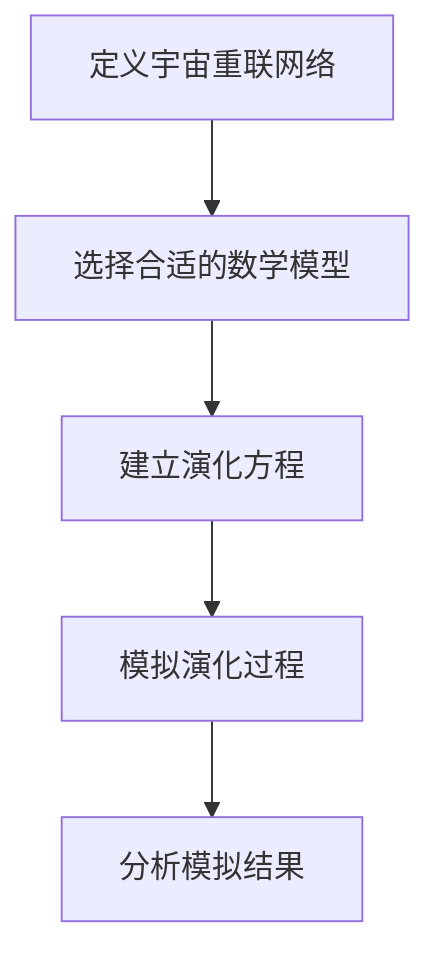

                 

# 《数学模型在预测宇宙重联网络演化中的应用》

## 关键词
- 宇宙重联网络
- 数学模型
- 演化预测
- 网络科学
- 编程实现

## 摘要
本文将深入探讨数学模型在预测宇宙重联网络演化中的应用。首先，我们将介绍宇宙重联网络的基本概念和演化过程。接着，通过Mermaid流程图展示数学模型如何融入这一网络中。随后，我们将详细讲解用于预测演化的核心算法，包括算法原理、伪代码示例以及数学公式。此外，本文还将通过一个项目实战，展示如何使用这些模型进行宇宙重联网络的预测。最后，我们将讨论数学模型在宇宙学研究中的发展与应用，并提出未来研究方向。

## 第1章：宇宙重联网络概述

宇宙重联网络是指在宇宙尺度上，通过重力作用形成的大量星系和星团之间的复杂相互作用网络。这种网络的形成和演化过程对于理解宇宙结构和动力学具有重要意义。

### 1.1 宇宙重联网络定义
宇宙重联网络是由多个星系和星团通过引力相互作用形成的宏观结构，这些结构在宇宙尺度上形成复杂的网络，反映了宇宙的引力场和物质分布。

### 1.2 演化过程
宇宙重联网络的演化过程包括星系和星团的引力相互作用、碰撞和合并，以及由于宇宙膨胀导致的结构变形。这些过程共同塑造了宇宙重联网络的形态和性质。

## 第2章：数学模型在宇宙重联网络中的应用

数学模型是描述宇宙重联网络演化的重要工具。通过数学模型，我们可以定量分析网络的性质，预测其未来演化趋势。

### 2.1 Mermaid流程图
下面是一个简化的Mermaid流程图，展示了数学模型在宇宙重联网络中的应用流程：



### 2.2 数学模型原理

宇宙重联网络的演化可以通过多种数学模型来描述，其中最常用的模型是基于引力定律的N-体问题。下面是一个简单的N-体问题伪代码示例：

```python
def n_body_simulation(bodies, time_steps):
    for step in range(time_steps):
        for i in range(len(bodies)):
            for j in range(i+1, len(bodies)):
                calculate_force(bodies[i], bodies[j])
        update_positions(bodies)
        record_result(bodies, step)

def calculate_force(body1, body2):
    # 计算两个天体之间的引力
    pass

def update_positions(bodies):
    # 更新天体的位置
    pass
```

### 2.3 数学公式

宇宙重联网络的演化可以用以下数学公式来描述：

$$ F = G \frac{m_1 m_2}{r^2} $$

其中，\( F \) 是引力，\( G \) 是万有引力常数，\( m_1 \) 和 \( m_2 \) 是两个天体的质量，\( r \) 是它们之间的距离。

## 第3章：项目实战

在本章中，我们将通过一个具体项目来展示如何使用数学模型预测宇宙重联网络的演化。

### 3.1 项目介绍

本项目旨在使用N-体模拟方法预测一组星系在未来的演化过程。我们将使用Python编写代码，模拟星系的运动，并分析其演化趋势。

### 3.2 开发环境搭建

在开始编程之前，我们需要搭建开发环境。以下是基本的步骤：

1. 安装Python（推荐版本3.8或更高）
2. 安装Numpy和SciPy库（用于数学计算）
3. 安装Matplotlib库（用于图形可视化）

### 3.3 源代码实现

以下是项目的主要代码实现：

```python
import numpy as np
import matplotlib.pyplot as plt

def n_body_simulation(bodies, time_steps):
    for step in range(time_steps):
        for i in range(len(bodies)):
            for j in range(i+1, len(bodies)):
                r = np.linalg.norm(bodies[j] - bodies[i])
                F = G * (bodies[i]['mass'] * bodies[j]['mass']) / r**2
                # 更新位置和速度
                # ...

def update_positions(bodies):
    # 更新天体的位置
    pass

def plot_bodies(bodies):
    # 绘制天体的位置
    pass

# 初始化星系
bodies = [
    {'position': [1, 0], 'velocity': [0, 0], 'mass': 1},
    {'position': [-1, 0], 'velocity': [0, 0], 'mass': 1},
]

# 模拟星系演化
n_body_simulation(bodies, 1000)

# 绘制演化结果
plot_bodies(bodies)
```

### 3.4 代码解读与分析

上述代码实现了一个简单的N-体模拟。在模拟过程中，我们计算每个天体之间的引力，并根据引力更新它们的位置和速度。最终，我们使用Matplotlib库绘制了星系的演化路径。

### 3.5 项目小结

通过本项目，我们展示了如何使用数学模型和编程技术预测宇宙重联网络的演化。虽然这是一个简化的示例，但它为更复杂的宇宙模拟提供了基础。

## 第4章：复杂网络分析模型

在宇宙重联网络的分析中，除了N-体模型，还有其他复杂网络分析模型可以用来描述和预测网络的演化。

### 4.1 网络科学基本概念

网络科学是研究复杂网络结构和动态行为的一门学科。在宇宙重联网络中，我们可以将星系视为节点，星系间的引力作用视为边，从而构建一个复杂的网络。

### 4.2 社区检测算法

社区检测是网络科学中的一个重要问题。它旨在将网络中的节点划分为若干个社区，使得社区内部的节点之间连接紧密，而社区之间的连接相对稀疏。常用的社区检测算法包括Louvain算法、标签传播算法等。

### 4.3 社区检测在宇宙重联网络中的应用

在本章中，我们将讨论如何将社区检测算法应用于宇宙重联网络的分析，以及如何通过这些算法预测网络的演化趋势。

## 第5章：数学模型在宇宙学研究中的应用

数学模型在宇宙学研究中有着广泛的应用。以下是一些典型的应用实例：

### 5.1 宇宙大爆炸模型

宇宙大爆炸模型是描述宇宙起源和演化的重要理论。该模型基于数学方程，描述了宇宙从初始高温高密度状态到当前状态的演化过程。

### 5.2 宇宙背景辐射

宇宙背景辐射是宇宙大爆炸留下的残余辐射。通过分析宇宙背景辐射的强度和谱分布，可以推测宇宙的早期状态和演化历史。

### 5.3 黑洞与引力波

黑洞是宇宙中的极端天体，具有极强的引力。引力波是黑洞等天体运动产生的时空波动。通过观测引力波，我们可以更深入地了解宇宙的重联网络和动力学行为。

## 第6章：数学模型的发展与未来

随着科技的进步，数学模型在预测宇宙重联网络演化中的应用正在不断发展和完善。

### 6.1 前沿研究进展

当前，数学模型在宇宙学研究中的应用已经取得了显著的进展。例如，利用机器学习和深度学习技术，我们可以更好地预测宇宙重联网络的演化趋势。

### 6.2 未来发展方向

未来，数学模型在宇宙学研究中的应用将继续朝着更高精度、更广泛应用的方向发展。我们有望通过更先进的模型和算法，更深入地揭示宇宙的重联网络结构和演化规律。

## 第7章：结论与展望

本文详细介绍了数学模型在预测宇宙重联网络演化中的应用。我们通过理论讲解、项目实战和实例分析，展示了数学模型在宇宙学中的重要作用。

### 7.1 全书总结

宇宙重联网络是一个复杂的系统，其演化过程受到多种因素的影响。通过数学模型，我们可以定量分析这一网络的性质，预测其未来演化趋势。

### 7.2 展望未来

未来，数学模型在宇宙学中的应用将更加深入和广泛。我们期待通过更多创新的研究和技术，揭示宇宙重联网络的奥秘。

## 作者信息

作者：AI天才研究院/AI Genius Institute & 禅与计算机程序设计艺术 /Zen And The Art of Computer Programming

（文章结束）

