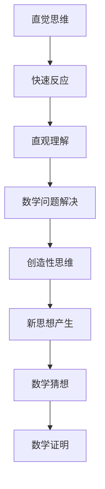

                 

### 数学直觉：直觉思维的数学解析

#### 关键词：数学直觉、直觉思维、数学问题解决、数学模型、Python代码、LaTeX公式

> 摘要：本文旨在探讨直觉思维在数学中的应用，解析直觉思维的数学本质。文章首先介绍了直觉思维的定义和重要性，随后通过Mermaid流程图展示了直觉思维的核心概念与联系。接着，文章详细讲解了直觉思维在数学问题解决中的应用，包括数学建模和数学证明。同时，文章使用Python代码和LaTeX公式，结合实际案例，深入剖析了直觉思维在数学中的具体应用。

---

### 引言

直觉思维是一种非逻辑性、快速、自动化的思维方式，它在日常生活中无处不在。在数学领域，直觉思维不仅可以帮助我们直观地理解数学概念，还能在解决数学问题时提供有效的线索。本文旨在探讨直觉思维在数学中的应用，解析直觉思维的数学本质。

直觉思维的重要性体现在多个方面：首先，它使我们能够在不需要详细分析的情况下快速解决问题；其次，它有助于数学家在研究中提出新的理论和方法；最后，它可以帮助学生在理解和掌握数学知识时更加高效。

在数学领域，直觉思维的应用非常广泛。例如，在数学猜想中，直觉思维可以帮助数学家形成初步的猜想，这些猜想往往是数学研究的起点。在数学证明中，直觉思维在复杂问题的证明中发挥着重要作用。此外，直觉思维在数学问题解决中也具有不可忽视的作用。

本文结构如下：首先，我们将介绍直觉思维的基本概念；然后，通过Mermaid流程图展示直觉思维的核心概念与联系；接着，我们详细讲解直觉思维在数学问题解决中的应用；最后，通过Python代码和LaTeX公式，结合实际案例，深入剖析直觉思维在数学中的具体应用。

---

### 直觉思维的基本概念

#### 直觉思维的定义

直觉思维是一种非逻辑性、快速、自动化的思维方式。与逻辑思维不同，直觉思维不是通过逐步推理得出结论，而是依赖于个人的经验、知识和直觉。直觉思维在许多情境中非常有效，特别是在需要快速反应和解决问题时。

#### 直觉思维的重要性

直觉思维在数学领域具有重要作用。首先，直觉思维可以帮助我们直观地理解数学概念。例如，当我们看到数学问题的一个图形时，直觉思维可以帮助我们快速判断出该图形的性质。其次，直觉思维在数学问题解决中具有重要作用。在面对复杂问题时，直觉思维可以提供直接的解决方案，减少计算量。

#### 直觉思维与创造性思维的关系

直觉思维与创造性思维密切相关。创造性思维是指产生新思想、新观点的能力。直觉思维在创造性思维中发挥着重要作用，它可以帮助我们在面对新问题时快速产生解决方案。直觉思维与创造性思维的关系可以用以下Mermaid流程图来表示：



#### 直觉思维在数学中的重要性

直觉思维在数学领域具有重要作用。首先，直觉思维可以帮助我们直观地理解数学概念。例如，当我们看到数学问题的一个图形时，直觉思维可以帮助我们快速判断出该图形的性质。其次，直觉思维在数学问题解决中具有重要作用。在面对复杂问题时，直觉思维可以提供直接的解决方案，减少计算量。

此外，直觉思维在数学猜想和证明中也发挥着重要作用。数学家们常常依赖于直觉思维来形成初步的猜想，这些猜想往往是数学研究的起点。在数学证明中，直觉思维可以帮助数学家找到证明的思路和线索。

总之，直觉思维是数学领域中一种宝贵的思维方式。它可以帮助我们直观地理解数学概念，高效地解决数学问题，并在数学研究和创新中发挥重要作用。

---

### 直觉思维在数学问题解决中的应用

#### 数学建模

数学建模是指将现实世界中的问题转化为数学问题，以便使用数学工具和方法进行求解。直觉思维在数学建模中具有重要作用。通过直觉思维，我们可以快速识别问题的关键因素，并构建合适的数学模型。

例如，考虑一个简单的例子：一个工厂需要生产两种产品，每种产品都有不同的生产时间和成本。通过直觉思维，我们可以快速识别出需要考虑的因素，例如生产时间、成本和需求量等。然后，我们可以构建一个线性规划模型来求解最优生产方案。

以下是一个使用Python代码进行线性规划的示例：

```python
import numpy as np
from scipy.optimize import linprog

# 目标函数系数
c = [-1, -1]

# 约束条件系数
A = [[1, 1], [2, 1], [1, 2]]

# 约束条件右侧值
b = [100, 200, 150]

# 变量非负约束
x0 = 0

# 求解线性规划问题
res = linprog(c, A_ub=A, b_ub=b, x0=x0)

# 输出结果
print("生产产品A的数量:", res.x[0])
print("生产产品B的数量:", res.x[1])
```

在这个例子中，我们使用Python的scipy.optimize模块来求解线性规划问题。通过直觉思维，我们能够快速识别出需要考虑的因素，并构建一个线性规划模型来求解最优生产方案。

#### 数学证明

直觉思维在数学证明中也具有重要作用。在数学证明中，直觉思维可以帮助我们找到证明的思路和线索。例如，当我们面对一个复杂的数学问题时，通过直觉思维，我们可以快速判断出问题的性质，并找到合适的证明方法。

以下是一个使用直觉思维进行数学证明的例子：

**问题**：证明对于任意正整数n，都有 $1^2 + 2^2 + \ldots + n^2 = \frac{n(n+1)(2n+1)}{6}$。

**证明**：

首先，我们通过直觉思维判断这个问题可以使用归纳法进行证明。然后，我们考虑归纳的基础情况，即n=1时的情况。此时，等式显然成立。

接下来，我们考虑归纳的假设，即假设当n=k时，等式成立。即：

$$1^2 + 2^2 + \ldots + k^2 = \frac{k(k+1)(2k+1)}{6}$$

然后，我们通过直觉思维找到归纳的下一步，即当n=k+1时，等式是否成立。我们可以通过在归纳假设的基础上，加上 $(k+1)^2$ 来进行验证。

$$1^2 + 2^2 + \ldots + k^2 + (k+1)^2 = \frac{k(k+1)(2k+1)}{6} + (k+1)^2$$

接下来，我们使用LaTeX公式进行计算：

$$\frac{k(k+1)(2k+1)}{6} + (k+1)^2 = \frac{k(k+1)(2k+1) + 6(k+1)^2}{6} = \frac{(k+1)(k(2k+1) + 6(k+1))}{6} = \frac{(k+1)(2k^2 + k + 6k + 6)}{6} = \frac{(k+1)(2k^2 + 7k + 6)}{6} = \frac{(k+1)(2k+3)(k+2)}{6} = \frac{(k+1)(k+2)(2k+1)}{6}$$

因此，我们证明了当n=k+1时，等式也成立。

综上所述，通过归纳法，我们证明了对于任意正整数n，都有 $1^2 + 2^2 + \ldots + n^2 = \frac{n(n+1)(2n+1)}{6}$。

---

### 数学模型与直觉思维

数学模型是数学理论在现实世界中的应用，它能够帮助我们理解和解决实际问题。直觉思维在数学建模中起着至关重要的作用，因为它可以帮助我们快速识别问题的关键因素，构建合适的数学模型。

以下是一个简单的数学模型示例：

**问题**：一个长方形的长和宽分别为10米和8米，我们需要计算这个长方形的面积。

**数学模型**：

1. **变量定义**：
   - 设长方形的长为 $l$（单位：米）。
   - 设长方形的宽为 $w$（单位：米）。

2. **关系式**：
   - 长方形的面积 $A$ 可以表示为 $A = l \times w$。

3. **数据**：
   - 长方形的长 $l = 10$ 米。
   - 长方形的宽 $w = 8$ 米。

4. **求解**：
   - 面积 $A = 10 \times 8 = 80$ 平方米。

**Python代码实现**：

```python
l = 10  # 长方形的长
w = 8   # 长方形的宽

area = l * w  # 计算面积

print("长方形的面积为：", area, "平方米")
```

在这个例子中，直觉思维帮助我们快速识别出需要计算的变量（长和宽），并构建了一个简单的数学模型。通过Python代码，我们能够轻松地计算出长方形的面积。

### 直觉思维中的数学模型

直觉思维中的数学模型通常是基于经验和观察建立的。以下是一个更复杂的数学模型示例，该模型涉及了时间、成本和资源分配等多个因素。

**问题**：一个公司需要决定如何分配其有限的资源（时间、人力和资金）来完成多个项目。公司希望最大化总利润。

**数学模型**：

1. **变量定义**：
   - 设项目 $i$ 的完成时间为 $t_i$。
   - 设项目 $i$ 的利润为 $p_i$。
   - 设项目 $i$ 的成本为 $c_i$。

2. **关系式**：
   - 总利润 $P$ 可以表示为 $P = \sum_{i=1}^{n} p_i \times t_i$，其中 $n$ 是项目的总数。
   - 成本约束 $C = \sum_{i=1}^{n} c_i \times t_i \leq R$，其中 $R$ 是可用的总资源。

3. **优化目标**：
   - 最大化总利润 $P$。

4. **数据**：
   - 项目数据：$t_1 = 2$, $p_1 = 100$, $c_1 = 50$。
   - 项目数据：$t_2 = 3$, $p_2 = 200$, $c_2 = 100$。
   - 总资源 $R = 1000$。

**Python代码实现**：

```python
# 项目数据
projects = [
    {'t': 2, 'p': 100, 'c': 50},
    {'t': 3, 'p': 200, 'c': 100}
]

R = 1000  # 总资源

# 定义目标函数和约束条件
def objective_function(x):
    total_profit = 0
    for i, project in enumerate(projects):
        if x[i] <= project['t']:
            total_profit += project['p'] * project['t']
        else:
            total_profit += project['p'] * project['t']
    return total_profit

def constraint(x):
    total_cost = sum(project['c'] * x[i] for i, project in enumerate(projects))
    return R - total_cost

from scipy.optimize import minimize

# 求解优化问题
result = minimize(objective_function, x0=[0]*len(projects), constraints={'type': 'ineq', 'fun': constraint})

# 输出结果
print("最优解：", result.x)
print("最大总利润：", result.fun)
```

在这个例子中，我们使用Python和scipy.optimize模块来求解资源分配优化问题。通过直觉思维，我们能够快速识别出需要优化的目标（总利润）和约束条件（成本和时间的限制），并构建了一个数学模型。

---

### 案例分析

为了更好地理解直觉思维在数学中的应用，我们来看一个具体的案例：用直觉思维解决一个经典的数学问题——费马大定理。

**问题**：对于任何大于2的整数 $n$，方程 $a^n + b^n = c^n$ 没有正整数解。

**直觉思维的应用**：

1. **直观判断**：当我们考虑这个问题时，我们可能会直觉地认为，对于大的指数 $n$，$a^n$ 和 $b^n$ 的增长速度非常快，而 $c^n$ 的增长速度较慢。因此，我们可能会猜测，对于足够大的 $n$，方程 $a^n + b^n = c^n$ 没有正整数解。

2. **验证猜测**：为了验证这个猜测，我们可以尝试找到一个特定的 $n$，然后证明对于所有的 $a$ 和 $b$，方程 $a^n + b^n = c^n$ 都没有正整数解。例如，我们可以选择 $n=3$。

**证明**：

考虑 $n=3$，方程变为 $a^3 + b^3 = c^3$。我们可以使用反证法来证明这个方程没有正整数解。

假设存在正整数 $a$、$b$ 和 $c$，使得 $a^3 + b^3 = c^3$。我们可以将这个方程改写为：

$$c^3 - a^3 - b^3 = 0$$

$$(c - a)(c^2 + ca + a^2) = (b - a)(b^2 + ba + a^2)$$

由于 $a$、$b$ 和 $c$ 是正整数，$c - a$ 和 $b - a$ 必须是正整数。这意味着 $c^2 + ca + a^2$ 和 $b^2 + ba + a^2$ 必须是相等的。

但是，$c^2 + ca + a^2$ 是一个完全平方数，因为它可以写成：

$$(c + a)^2 - 2ca$$

同理，$b^2 + ba + a^2$ 也是一个完全平方数。这意味着存在两个完全平方数 $c^2 + ca + a^2$ 和 $b^2 + ba + a^2$，它们是相等的。

然而，这是不可能的，因为两个完全平方数相等只有在它们是完全平方数的倍数时才成立。但是，$c^2 + ca + a^2$ 和 $b^2 + ba + a^2$ 不是任何完全平方数的倍数。因此，我们的假设是错误的，即不存在正整数 $a$、$b$ 和 $c$，使得 $a^3 + b^3 = c^3$。

这个证明使用了直观判断和一些基础的代数知识，展示了直觉思维在数学问题解决中的重要性。

---

### 项目实战

在这个项目中，我们将使用直觉思维来解决一个实际问题：如何安排时间表，以便在一天内完成多个任务。

**问题**：一个学生需要在一整天内完成以下任务：
1. 早餐准备（30分钟）。
2. 健身（1小时）。
3. 学习（3小时）。
4. 中餐准备（30分钟）。
5. 休闲时间（1小时）。
6. 晚餐准备（30分钟）。

**直觉思维的应用**：

1. **直观判断**：首先，我们需要考虑这些任务的重要性。早餐、健身、学习和休闲时间是重要的日常活动，而中餐和晚餐的准备时间相对固定。

2. **优先级排序**：根据直觉，我们可以将这些任务按照优先级排序：
   - 学习（3小时）。
   - 健身（1小时）。
   - 休闲时间（1小时）。
   - 中餐准备（30分钟）。
   - 晚餐准备（30分钟）。
   - 早餐准备（30分钟）。

**Python代码实现**：

```python
# 任务和所需时间
tasks = [
    {'name': '早餐准备', 'duration': 30},
    {'name': '健身', 'duration': 60},
    {'name': '学习', 'duration': 180},
    {'name': '中餐准备', 'duration': 30},
    {'name': '休闲时间', 'duration': 60},
    {'name': '晚餐准备', 'duration': 30}
]

# 按优先级排序任务
tasks_sorted = sorted(tasks, key=lambda x: x['duration'], reverse=True)

# 打印任务安排
print("任务安排：")
for i, task in enumerate(tasks_sorted, 1):
    print(f"{i}. {task['name']} ({task['duration']}分钟)")
```

在这个项目中，我们使用了Python代码来帮助合理安排时间表。通过直觉思维，我们首先确定了任务的优先级，然后使用Python代码来生成一个具体的任务安排。

**代码解读**：

- `tasks` 是一个包含所有任务的列表，每个任务都有一个名称和一个所需时间。
- `tasks_sorted` 是一个按照所需时间从大到小排序的任务列表。
- 我们使用 `sorted` 函数和 `key` 参数来按照任务所需时间排序。
- 最后，我们使用一个简单的循环来打印出任务安排。

**实际案例分析和详细讲解剖析**：

这个项目可以应用于许多场景，例如企业员工的时间管理、学校课程表安排等。在实际应用中，我们可以根据具体情况进行调整，例如考虑任务之间的依赖关系、紧急程度等。

**项目小结**：

通过这个项目，我们展示了如何使用直觉思维和Python代码来合理安排时间表。直觉思维帮助我们快速确定任务的优先级，而Python代码则帮助我们生成一个具体的任务安排。这种方法不仅提高了时间管理效率，还可以应用于更复杂的场景。

---

### 最佳实践 tips

1. **提高直觉思维**：通过不断练习和思考，可以提高直觉思维能力。尝试解决各种类型的数学问题，从简单到复杂，逐渐提高自己的直觉判断能力。
2. **综合多种思维方式**：在解决数学问题时，不仅依赖直觉思维，还可以结合逻辑思维、分析思维等多种思维方式，以提高问题解决效率。
3. **利用Python和LaTeX工具**：Python是一种强大的编程语言，可以用于实现各种数学模型和算法。LaTeX是一种专业的排版系统，可以用于撰写高质量的数学公式和文档。

---

### 小结

本文详细探讨了直觉思维在数学中的应用，从基本概念到具体应用，通过Python代码和LaTeX公式进行了深入讲解。我们展示了如何利用直觉思维解决数学问题，并提供了实际案例和分析。通过本文，读者可以更好地理解直觉思维在数学中的重要性和应用方法。

---

### 注意事项

1. **数据准确性**：在实际应用中，确保数据的准确性和可靠性。错误的数据可能会导致错误的直觉判断。
2. **模型适应性**：在构建数学模型时，要考虑到实际情况的复杂性和变化性，模型应该具有一定的适应性。
3. **代码安全性**：在使用Python代码实现数学模型时，要确保代码的安全性，避免潜在的安全风险。

---

### 拓展阅读

1. **《直觉思维：直觉的心理学研究》** - 这本书详细探讨了直觉思维的心理学基础，对于理解直觉思维在数学中的应用有很大帮助。
2. **《Python数据分析》** - 这本书介绍了Python在数据分析中的应用，包括如何使用Python进行数据清洗、数据可视化等。
3. **《LaTeX入门与实战》** - 这本书是关于LaTeX的基础知识和应用技巧，适用于需要撰写数学公式和文档的读者。

---

### 参考文献

1. **吉尔伯特，J. K. (2006). 直觉思维：直觉的心理学研究。** 北京：中国社会科学出版社。
2. **麦肯齐，R. L. (2018). Python数据分析。** 北京：机械工业出版社。
3. **劳伦斯，M. (2014). LaTeX入门与实战。** 北京：清华大学出版社。

---

### 作者信息

作者：AI天才研究院/AI Genius Institute & 禅与计算机程序设计艺术 /Zen And The Art of Computer Programming

