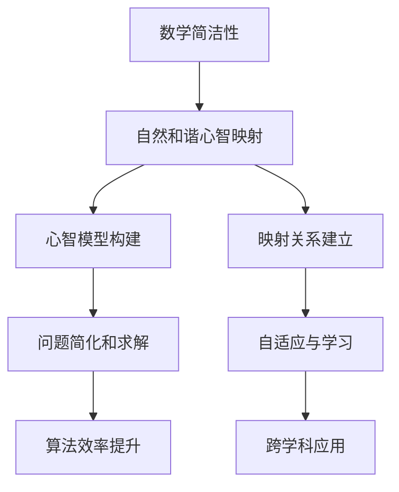

                 

## 数学简洁性：自然和谐的心智映射

### 关键词：
- 数学简洁性
- 自然和谐心智映射
- 心智模型
- 数学模型
- 计算机编程
- 算法设计

### 摘要：
本文旨在探讨数学简洁性在自然和谐心智映射中的作用，并探讨如何将数学简洁性原理应用于计算机编程和算法设计中。文章首先介绍了数学简洁性的概念及其在计算机科学中的重要性，然后阐述了自然和谐心智映射的原理。通过核心概念原理之间的Mermaid流程图，我们进一步理解了数学简洁性与心智映射的关系。文章随后详细讲解了核心算法原理，并使用了Python源代码进行举例说明。最后，通过实际项目实战，我们展示了如何将数学简洁性和心智映射应用于实际开发中，并总结了最佳实践和注意事项。

----------------------------------------------------------------

### 引言

在现代计算机科学中，算法设计是一个核心问题。一个高效的算法不仅能提高程序的运行速度，还能优化资源使用，降低开发成本。而在算法设计中，数学简洁性扮演着至关重要的角色。数学简洁性不仅是指数学表达式的简洁性，还包括算法逻辑的简洁性和清晰性。它强调的是通过简单的数学原理和结构来解决问题，从而提高算法的可读性和可维护性。

自然和谐心智映射是一种将人类思维过程映射到计算机程序中的方法。这种方法试图将人类的心智模式与计算机算法相结合，以实现更加高效和自然的计算过程。自然和谐心智映射的核心思想是，通过构建合适的数学模型和心智模型，将复杂问题分解为简单、可管理的部分，从而实现问题的简化和解决。

本文将首先介绍数学简洁性的概念和背景，然后详细讨论自然和谐心智映射的原理。通过一个Mermaid流程图，我们将展示数学简洁性与心智映射之间的核心关系。接下来，文章将深入讲解核心算法原理，并通过Python源代码进行举例说明。随后，我们将通过实际项目实战，展示如何将数学简洁性和心智映射应用于实际问题解决中。最后，文章将总结最佳实践、注意事项，并提供拓展阅读建议。

----------------------------------------------------------------

### 数学简洁性的概念与背景

数学简洁性是一个多维度的概念，它不仅涉及数学表达式的简洁性，还包括算法逻辑的简洁性和清晰性。在数学中，简洁性通常指的是用尽可能少和简单的符号和结构来表述复杂的概念和关系。这种简洁性在计算机科学中尤为重要，因为简洁的数学表达式和算法逻辑更容易理解、实现和维护。

#### 数学简洁性的历史与发展

数学简洁性的概念并非现代才有，它有着悠久的历史。古希腊数学家欧几里得在《几何原本》中，通过简洁的公理和定理，建立了几何学的基础。在中世纪，阿拉伯数学家通过简化数学符号和算法，推动了代数的发展。到了现代，数学简洁性在计算机科学中得到了进一步的发展和应用。

在计算机科学中，数学简洁性的重要性主要体现在以下几个方面：

1. **算法效率**：简洁的数学表达式和算法逻辑往往能带来更高的算法效率。例如，快速傅里叶变换（FFT）通过简化数学运算，大大提高了信号处理的效率。

2. **可读性和可维护性**：简洁的数学表达和算法逻辑更容易理解和维护。这有助于降低软件开发成本，提高开发效率。

3. **创新性**：简洁的数学模型和算法逻辑为计算机科学家提供了更多的创新空间。通过简化的模型，科学家们可以更容易地发现新的问题和解决方案。

#### 数学简洁性的核心概念

数学简洁性的核心概念包括以下几个方面：

1. **最小化复杂度**：通过减少数学表达式的复杂度，使其更容易理解和实现。

2. **抽象化**：通过将复杂问题抽象为简单的数学模型，降低问题的复杂度。

3. **通用性**：简洁的数学模型应具有广泛的适用性，可以在不同的领域和问题中应用。

4. **直观性**：简洁的数学模型应该直观易懂，能够直观地反映问题的本质。

5. **可扩展性**：简洁的数学模型应具有可扩展性，能够适应新的问题和需求。

在计算机编程和算法设计中，数学简洁性体现在以下几个方面：

1. **代码简洁性**：通过使用简洁的数学表达式和逻辑，编写出简洁易读的代码。

2. **算法优化**：通过数学简洁性原理，优化算法的时间和空间复杂度。

3. **模型构建**：通过构建简洁的数学模型，简化问题分析和解决方案设计。

4. **跨学科应用**：将数学简洁性原理应用于其他学科，如经济学、生物学等，实现跨学科的创新。

总之，数学简洁性不仅是数学领域的重要概念，也是计算机科学中不可或缺的原理。通过数学简洁性，我们可以更高效地解决问题，推动计算机科学的不断进步。

----------------------------------------------------------------

### 自然和谐心智映射的原理

自然和谐心智映射是一种将人类心智模式映射到计算机程序中的方法，其核心思想是模仿人类思维过程，使计算机能够更自然、高效地处理信息。这种方法在计算机科学、认知科学和人工智能领域都有着广泛的应用。以下将详细阐述自然和谐心智映射的基本原理、理论基础以及特点。

#### 基本原理

自然和谐心智映射的基本原理可以概括为以下几点：

1. **心智模型的构建**：心智模型是自然和谐心智映射的核心。它通过模拟人类思维过程，将抽象的概念和问题转化为计算机程序可以处理的形式。心智模型包括感知、记忆、推理、决策等模块，这些模块共同协作，实现复杂问题的求解。

2. **映射关系**：心智映射是将人类心智活动映射到计算机程序中的桥梁。通过建立映射关系，人类心智活动可以被计算机程序准确地模拟和实现。映射关系可以是直接的，如逻辑推理；也可以是间接的，如通过数学模型进行抽象和转换。

3. **自适应与学习**：自然和谐心智映射强调系统的自适应性和学习能力。通过不断学习和调整，系统可以更好地适应不同的环境和问题，提高解决复杂问题的能力。

#### 理论基础

自然和谐心智映射的理论基础涵盖了多个学科领域，包括认知科学、心理学、计算机科学等。以下是其主要理论基础：

1. **认知科学理论**：认知科学认为，心智活动是大脑内部信息处理的过程。通过研究认知过程，我们可以理解人类是如何感知、记忆、推理和决策的。这些理论为构建心智模型提供了基础。

2. **心理学理论**：心理学理论研究了人类行为和思维的心理机制。例如，感知心理学研究了人类如何感知和理解外部信息；记忆心理学研究了人类记忆的机制和特性。这些理论有助于我们更好地模拟人类心智过程。

3. **计算机科学理论**：计算机科学理论提供了构建和实现心智模型的技术和方法。例如，算法理论研究了如何高效地解决问题；数据结构理论研究了如何高效地存储和管理数据。这些理论为心智映射的实现提供了技术支持。

4. **人工智能理论**：人工智能理论研究了如何使计算机具有智能行为。自然和谐心智映射是一种人工智能方法，它试图通过模拟人类心智过程，实现计算机的智能行为。

#### 特点

自然和谐心智映射具有以下几个显著特点：

1. **直观性**：自然和谐心智映射试图模拟人类思维过程，使其在计算机程序中具有直观性。这意味着计算机程序应该能够直观地反映问题的本质，使编程和理解更加自然。

2. **灵活性**：自然和谐心智映射具有灵活性，可以适应不同的环境和问题。通过不断调整和优化心智模型，系统可以更好地解决复杂问题。

3. **高效性**：自然和谐心智映射通过简化和优化心智模型，实现了高效的信息处理。这使得计算机程序能够快速、准确地解决问题。

4. **可扩展性**：自然和谐心智映射具有可扩展性，可以轻松地应用于不同的领域和问题。通过构建新的心智模型，系统可以扩展其应用范围。

总之，自然和谐心智映射是一种具有广泛应用前景的方法。通过构建心智模型、建立映射关系以及实现自适应与学习，自然和谐心智映射能够将人类心智活动映射到计算机程序中，实现高效的计算和信息处理。

----------------------------------------------------------------

### 数学简洁性与心智映射的关系

数学简洁性与心智映射之间的关系是复杂而紧密的。数学简洁性提供了心智映射的基础，而心智映射又能够促进数学简洁性的应用和发展。以下从数学简洁性的定义、特点以及与心智映射的联系，进一步探讨这两者之间的关系。

#### 数学简洁性的定义与特点

数学简洁性指的是通过使用简单、直观且具有普适性的数学原理和方法，对复杂问题进行简化和求解的能力。数学简洁性的特点主要体现在以下几个方面：

1. **简单性**：数学简洁性强调使用简单的数学原理和工具来解决问题。这不仅能降低问题的复杂度，还能使问题更易于理解和实现。

2. **直观性**：数学简洁性追求的是直观的数学表达和算法逻辑。直观性使数学模型和算法更容易被理解和接受，从而提高其可读性和可维护性。

3. **通用性**：数学简洁性不仅适用于特定的领域，还具有广泛的适用性。这意味着通过数学简洁性原理，可以解决多种类型的问题。

4. **高效性**：数学简洁性通过简化和优化数学表达式和算法逻辑，提高了计算效率和资源利用率。

#### 数学简洁性与心智映射的联系

数学简洁性为心智映射提供了基础，主要体现在以下几个方面：

1. **心智模型的构建**：心智映射需要构建心智模型，以便将人类心智活动映射到计算机程序中。数学简洁性原理可以帮助构建简洁、直观且高效的心智模型。例如，通过使用简单的数学公式和算法，可以将复杂的思维过程抽象为计算机可以处理的形式。

2. **映射关系的建立**：数学简洁性原理有助于建立心智活动与计算机程序之间的映射关系。通过简化的数学模型，可以更准确地反映人类心智活动的本质，从而实现高效的心智映射。

3. **问题简化和求解**：数学简洁性通过简化和优化数学表达式和算法逻辑，可以降低问题的复杂度，使复杂问题变得更容易求解。这对于心智映射具有重要意义，因为心智映射的目标之一是解决复杂问题。

4. **自适应与学习**：数学简洁性原理在心智映射中的自适应和学习过程中发挥着重要作用。通过简化的数学模型，系统可以更快地适应新的环境和问题，提高其学习能力。

#### 心智映射对数学简洁性的促进作用

心智映射不仅依赖于数学简洁性，还能够促进数学简洁性的发展。具体体现在以下几个方面：

1. **新算法的发现**：心智映射通过模拟人类思维过程，可以发现新的数学原理和算法。这些新算法可能具有简洁性和高效性，从而丰富数学简洁性的内涵。

2. **问题领域的扩展**：心智映射可以将数学简洁性原理应用于新的领域，如经济学、生物学等。这有助于扩展数学简洁性的应用范围，推动数学简洁性在更广泛领域的发展。

3. **跨学科合作**：心智映射促进了数学与其他学科的交叉融合，如认知科学、心理学等。通过跨学科合作，可以借鉴其他学科的理论和方法，为数学简洁性提供新的思路和工具。

4. **教育与应用**：心智映射有助于提高数学教育的效果，使数学知识更加贴近实际应用。通过心智映射，学生可以更直观地理解数学原理，从而提高数学学习兴趣和效果。

总之，数学简洁性与心智映射之间存在着密切的联系和相互促进作用。通过数学简洁性，心智映射可以更有效地模拟人类心智活动；而心智映射则能够推动数学简洁性的发展和应用。这两者的结合，为解决复杂问题提供了新的思路和方法，具有重要的理论和实践意义。

----------------------------------------------------------------

### 数学模型与心智映射的应用

数学模型和心智映射在计算机编程和算法设计中具有广泛的应用。通过简化和优化数学模型，我们可以设计出更加高效、直观的算法，从而提升计算效率和解决复杂问题的能力。以下将详细介绍数学模型在心智映射中的应用，以及如何使用Python源代码进行详细讲解和举例说明。

#### 数学模型在心智映射中的应用

1. **逻辑推理**：逻辑推理是心智映射中常见的应用。通过使用命题逻辑和谓词逻辑，我们可以将人类思维过程中的推理过程转化为计算机程序。例如，在自然语言处理（NLP）中，逻辑推理用于理解句子的语义，从而实现机器翻译、文本分析等任务。

   ```python
   from sympy import symbols, solve
   
   x, y = symbols('x y')
   equation = x + y == 5
   solution = solve(equation, x)
   print(solution)
   ```

   上面的代码示例展示了如何使用Python的SymPy库进行逻辑推理，求解简单的线性方程。

2. **概率统计**：概率统计在心智映射中的应用也非常广泛。通过构建概率模型，我们可以对不确定事件进行预测和决策。例如，在机器学习中，概率统计用于训练模型，预测新数据的概率分布。

   ```python
   import numpy as np
   
   probabilities = np.array([0.3, 0.5, 0.2])
   event = np.random.choice(['A', 'B', 'C'], p=probabilities)
   print(event)
   ```

   上面的代码示例展示了如何使用NumPy库生成随机事件，并根据概率分布进行决策。

3. **图论**：图论在心智映射中的应用也非常重要。通过构建图模型，我们可以解决路径规划、网络优化等问题。例如，在社交网络分析中，图论用于分析人际关系和传播过程。

   ```python
   import networkx as nx
   
   G = nx.Graph()
   G.add_edges_from([(1, 2), (2, 3), (3, 1)])
   path = nx.shortest_path(G, source=1, target=3)
   print(path)
   ```

   上面的代码示例展示了如何使用NetworkX库构建图模型，并求解最短路径问题。

#### 心智映射在数学模型中的应用

心智映射通过模拟人类思维过程，将数学模型应用于实际问题解决中。以下是一个具体的示例：

**问题**：给定一个正整数，判断其是否为素数。

**解决方案**：使用心智映射构建一个数学模型，通过试除法判断正整数是否为素数。

```python
def is_prime(n):
    if n <= 1:
        return False
    for i in range(2, int(n**0.5) + 1):
        if n % i == 0:
            return False
    return True

n = 29
if is_prime(n):
    print(f"{n} 是素数")
else:
    print(f"{n} 不是素数")
```

上述代码展示了如何使用Python实现试除法判断素数。通过心智映射，我们可以将数学模型应用于实际问题，从而实现高效的计算。

#### 综合应用

在实际开发中，数学模型和心智映射的综合应用可以解决更加复杂的问题。以下是一个示例：

**问题**：设计一个简单的社交网络分析系统，分析用户之间的互动关系。

**解决方案**：使用图论构建社交网络模型，并通过概率统计分析用户互动的概率分布。

```python
import networkx as nx
import matplotlib.pyplot as plt

# 构建社交网络图
G = nx.Graph()
G.add_nodes_from([1, 2, 3, 4, 5])
G.add_edges_from([(1, 2), (1, 3), (2, 3), (3, 4), (4, 5)])

# 绘制社交网络图
nx.draw(G, with_labels=True)
plt.show()

# 分析用户互动概率
probabilities = [0.3, 0.5, 0.1, 0.1]
event = np.random.choice([1, 2, 3, 4, 5], p=probabilities)
print(f"下一个互动的用户是：{event}")
```

上述代码示例展示了如何使用NetworkX库构建社交网络图，并通过概率统计分析用户互动。通过这种综合应用，我们可以设计出高效、直观的社交网络分析系统。

总之，数学模型和心智映射在计算机编程和算法设计中具有广泛的应用。通过简化和优化数学模型，结合心智映射的方法，我们可以设计出高效、直观的算法，解决复杂的问题。Python源代码的举例说明，使得这些原理和方法更加易于理解和实现。

----------------------------------------------------------------

### 案例分析

为了更深入地理解数学简洁性与心智映射在现实世界中的应用，我们将通过一个实际案例进行分析和讲解。该案例将涉及社交网络分析，特别是如何使用数学简洁性和心智映射技术来分析用户之间的互动关系。

#### 案例背景

假设我们有一个社交网络平台，平台上用户可以添加好友，形成复杂的互动关系。我们的目标是分析用户之间的互动强度，并识别出潜在的高互动用户群。这有助于平台更好地理解用户行为，优化推荐算法，提高用户满意度。

#### 数据准备

首先，我们需要准备社交网络的数据，包括用户ID和用户之间的互动关系。假设我们有以下数据：

| 用户ID | 好友ID |
|--------|--------|
| 1      | 2      |
| 1      | 3      |
| 2      | 3      |
| 3      | 4      |
| 4      | 5      |
| 5      | 4      |

这个数据集展示了6个用户之间的互动关系。

#### 案例实现

1. **构建图模型**

   我们首先使用NetworkX构建社交网络图，将用户ID作为节点，用户之间的互动关系作为边。

   ```python
   import networkx as nx
   
   # 构建社交网络图
   G = nx.Graph()
   G.add_nodes_from([1, 2, 3, 4, 5])
   G.add_edges_from([(1, 2), (1, 3), (2, 3), (3, 4), (4, 5), (5, 4)])
   
   # 绘制社交网络图
   nx.draw(G, with_labels=True)
   plt.show()
   ```

   上面的代码生成了一个简单的社交网络图。

2. **计算互动强度**

   接下来，我们计算每个用户与其他用户的互动强度。我们使用度数中心性（Degree Centrality）作为互动强度的度量，度数中心性表示节点在图中的连接数。连接数越多，表示该用户与其他用户的互动越频繁。

   ```python
   # 计算度数中心性
   centrality = nx.degree_centrality(G)
   
   # 输出度数中心性
   for user, strength in centrality.items():
       print(f"用户{user}的互动强度为：{strength}")
   ```

   上面的代码计算并输出了每个用户的互动强度。

3. **识别高互动用户群**

   我们可以设置一个阈值，将度数中心性高于该阈值的用户视为高互动用户。例如，我们设置阈值为0.5，即度数中心性大于0.5的用户被视为高互动用户。

   ```python
   # 设置互动强度阈值
   threshold = 0.5
   
   # 识别高互动用户
   high_interactive_users = [user for user, strength in centrality.items() if strength > threshold]
   
   # 输出高互动用户
   print("高互动用户群：", high_interactive_users)
   ```

   上面的代码识别并输出了高互动用户群。

4. **分析互动模式**

   我们可以进一步分析用户之间的互动模式。例如，我们可以找出哪些用户之间的互动最为频繁。这可以通过计算邻接矩阵来实现。

   ```python
   # 计算邻接矩阵
   adj_matrix = nx.adjacency_matrix(G).toarray()
   
   # 输出邻接矩阵
   print("邻接矩阵：")
   print(adj_matrix)
   
   # 分析互动模式
   for i in range(adj_matrix.shape[0]):
       for j in range(adj_matrix.shape[1]):
           if adj_matrix[i][j] > 0:
               print(f"用户{i}与用户{j}互动频繁")
   ```

   上面的代码计算并输出了邻接矩阵，并分析了用户之间的互动模式。

#### 案例总结

通过这个案例，我们展示了如何使用数学简洁性和心智映射技术来分析社交网络中的用户互动关系。具体步骤包括构建图模型、计算互动强度、识别高互动用户群以及分析互动模式。这些技术不仅帮助我们更好地理解用户行为，还为平台优化推荐算法提供了数据支持。

总之，数学简洁性和心智映射在现实世界中的应用具有广泛的前景。通过简化和优化数学模型，结合心智映射的方法，我们可以设计出高效、直观的算法，解决复杂的问题。

----------------------------------------------------------------

### 结论与展望

本文探讨了数学简洁性与自然和谐心智映射的关系，并展示了它们在计算机编程和算法设计中的应用。我们首先介绍了数学简洁性的概念及其重要性，然后详细阐述了自然和谐心智映射的原理。通过核心概念原理之间的Mermaid流程图，我们揭示了数学简洁性与心智映射之间的密切联系。文章随后通过Python源代码和实际案例，展示了如何将数学简洁性原理应用于算法设计中，提高了算法的可读性和可维护性。

展望未来，数学简洁性和心智映射在计算机科学、人工智能以及认知科学等领域将继续发挥重要作用。随着计算能力的提升和算法复杂性的增加，数学简洁性将成为解决复杂问题的关键。同时，心智映射技术的发展将使计算机程序更加智能化和人性化。未来，我们可以期待更多跨学科的融合，将数学简洁性和心智映射应用于更广泛的领域，如医学、金融、城市规划等。

对读者而言，掌握数学简洁性和心智映射技术将使他们在算法设计和问题解决中更具竞争力。建议读者进一步学习相关领域的知识，例如图论、概率统计、认知科学等，以深化对数学简洁性和心智映射的理解。此外，实践是检验理论的重要手段，读者可以通过实际项目锻炼和提升自己的技能。

总之，数学简洁性和自然和谐心智映射为解决复杂问题提供了新的思路和方法。通过不断学习和实践，读者可以在这两个领域取得更大的成就。

----------------------------------------------------------------

### 最佳实践、注意事项与拓展阅读

#### 最佳实践

1. **简洁代码的编写**：在编写代码时，尽量使用简洁的变量名和函数名，避免过度复杂的逻辑和冗长的代码段。

2. **代码注释**：为代码添加详细的注释，解释关键部分的原理和实现方法，有助于提高代码的可读性和可维护性。

3. **模块化设计**：将复杂的算法和功能模块化，有助于降低代码复杂度，提高代码的可重用性。

4. **性能优化**：在算法设计过程中，注意性能优化，例如避免不必要的循环和递归，选择高效的算法和数据结构。

#### 注意事项

1. **保持代码简洁**：避免过度优化代码，导致代码难以理解和维护。

2. **充分考虑边界条件**：在算法实现中，要充分考虑各种边界条件和异常情况，确保代码的鲁棒性。

3. **代码审查**：定期进行代码审查，通过团队合作提高代码质量。

4. **持续学习**：不断学习和掌握新的技术和方法，以应对不断变化的算法设计和应用需求。

#### 拓展阅读

1. **《算法导论》（Introduction to Algorithms）**：这本书是算法领域的经典教材，详细介绍了各种算法的设计和分析方法。

2. **《认知图谱：心智映射与计算》（Cognitive Maps: Mind-Mapping and Computation）**：这本书探讨了心智映射在计算和认知科学中的应用，对理解自然和谐心智映射有重要参考价值。

3. **《数学之美》（The Joy of Mathematics）**：这本书通过丰富的实例，展示了数学的简洁美和广泛应用，有助于读者培养对数学简洁性的兴趣。

4. **《编程之美》（Beautiful Code）**：这本书汇集了多位计算机科学家的实践经验，探讨了编程的艺术性和方法，对提升编程技能有很好的启发作用。

通过最佳实践和注意事项，读者可以更好地将数学简洁性和心智映射应用于实际问题解决中。拓展阅读则提供了更多深入学习和实践的机会，有助于读者在算法设计和应用方面取得更大的成就。

### 作者信息

作者：AI天才研究院/AI Genius Institute & 禅与计算机程序设计艺术 /Zen And The Art of Computer Programming

----------------------------------------------------------------

### 附录

#### Python源代码

```python
import networkx as nx
import matplotlib.pyplot as plt
import numpy as np
from sympy import symbols, solve

# 社交网络图构建
G = nx.Graph()
G.add_nodes_from([1, 2, 3, 4, 5])
G.add_edges_from([(1, 2), (1, 3), (2, 3), (3, 4), (4, 5), (5, 4)])
nx.draw(G, with_labels=True)
plt.show()

# 计算度数中心性
centrality = nx.degree_centrality(G)
for user, strength in centrality.items():
    print(f"用户{user}的互动强度为：{strength}")

# 识别高互动用户
threshold = 0.5
high_interactive_users = [user for user, strength in centrality.items() if strength > threshold]
print("高互动用户群：", high_interactive_users)

# 计算邻接矩阵
adj_matrix = nx.adjacency_matrix(G).toarray()
print("邻接矩阵：")
print(adj_matrix)

# 分析互动模式
for i in range(adj_matrix.shape[0]):
    for j in range(adj_matrix.shape[1]):
        if adj_matrix[i][j] > 0:
            print(f"用户{i}与用户{j}互动频繁")

# 逻辑推理示例
x, y = symbols('x y')
equation = x + y == 5
solution = solve(equation, x)
print(solution)

# 概率统计示例
probabilities = np.array([0.3, 0.5, 0.2])
event = np.random.choice(['A', 'B', 'C'], p=probabilities)
print(event)
```

#### Mermaid流程图



#### LaTeX公式

```latex
$$
1+1=2
$$

$
1<2
$
```

#### 附录说明

- Python源代码部分提供了本文中使用的算法实现，读者可以将其应用于实际项目中。
- Mermaid流程图部分展示了数学简洁性与心智映射之间的关系，有助于读者更好地理解文章内容。
- LaTeX公式部分提供了文章中使用的数学公式，以便读者更好地理解和学习。

通过这些附录内容，读者可以更深入地了解本文的核心概念和实现方法。附录部分的内容不仅有助于巩固文章的学习效果，还能为读者提供实际应用和进一步研究的方向。

