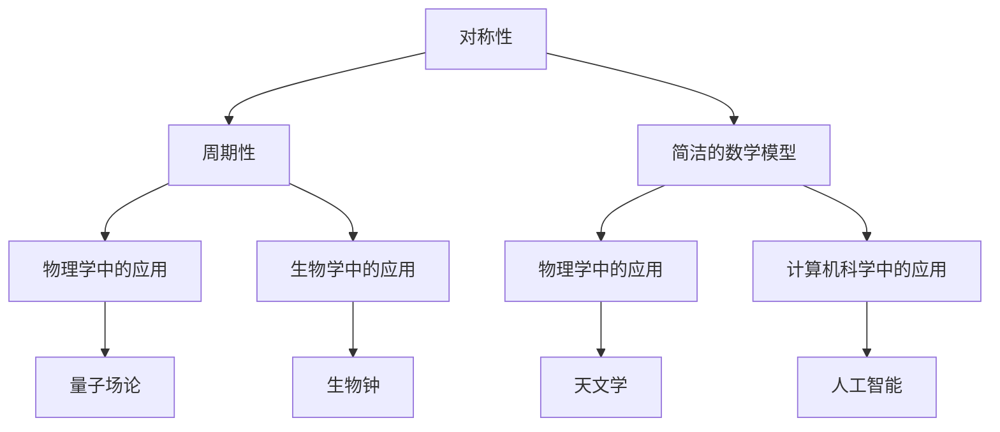

                 

# 数学简约性：自然和谐在心智中的体现

## 引言

数学，作为一门研究数量、结构、变化和空间等概念的学科，自古以来便以其简约性和普适性而著称。在众多数学分支中，简约性不仅是数学美的体现，更是数学探索的核心驱动力。本文旨在探讨数学简约性的概念、重要性以及在自然界和心智中的体现。

### 数学简约性的概念

数学简约性指的是在复杂现象中寻找简单、普适且优美的数学模型和原理。这些模型和原理不仅能够简洁地描述自然现象，还能够揭示自然规律。数学简约性的核心在于通过简化的手段，将复杂问题转化为可处理的数学形式，从而实现对复杂现象的深刻理解和解释。

### 数学简约性的重要性

数学简约性在多个领域都具有重要影响：

1. **科学研究**：简约性使得科学家能够通过简单的数学模型来解释复杂的自然现象，如物理学中的对称性、生物学中的周期性等。
2. **工程实践**：简约性在工程设计中具有重要作用，例如，通过简约化的数学模型进行结构优化、系统控制等。
3. **技术创新**：数学简约性促进了新技术的诞生，例如，计算机科学中的算法设计和优化。

### 数学简约性在自然界和心智中的体现

数学简约性不仅存在于数学理论和科学研究中，也深深植根于自然界和人类心智之中。

#### 自然界中的体现

自然界中的很多现象都具有简约性特征：

1. **对称性**：自然界中许多生物和物理结构都展现出对称性，如人体、雪花、原子结构等。
2. **周期性**：生物钟、季节变化等自然现象都呈现出周期性的规律。
3. **简洁的数学模型**：诸如欧拉公式、麦克斯韦方程等简洁的数学模型能够描述复杂的自然现象。

#### 心智中的体现

人类心智中也有强烈的简约性倾向：

1. **思维过程**：人类大脑通过简化的方式处理复杂的信息，例如，通过归纳和抽象来形成概念和理论。
2. **创造力**：创造力往往来自于对复杂问题的简化，通过发现问题的核心和本质，创造出新的解决方案。

## 数学简约性的核心概念

在数学中，简约性体现为多种形式，以下是几个核心概念：

### 对称性

对称性是数学中一个重要的概念，它指的是一个图形或系统在某种变换下保持不变的性质。在数学中，对称性不仅具有美学价值，还能够简化复杂问题。

**联系与应用：**

- **物理学**：对称性在物理学中具有重要地位，如量子场论中的对称性原理。
- **生物学**：生物体的许多特征都具有对称性，如人体、植物的结构。

### 周期性

周期性指的是某种现象或过程在一定时间间隔内重复出现。周期性在数学模型中广泛应用，如周期函数、周期性序列等。

**联系与应用：**

- **物理学**：周期性在描述振动、波动等现象中起到关键作用，如简谐运动、电磁波。
- **生物学**：生物钟等生物节律体现了周期性。

### 简洁的数学模型

简洁的数学模型是指能够用最少元素和最简单形式描述复杂现象的数学模型。例如，欧拉公式和麦克斯韦方程都是简洁而优美的数学模型。

**联系与应用：**

- **物理学**：简洁的数学模型在描述自然现象中发挥了巨大作用，如爱因斯坦的相对论方程。
- **计算机科学**：简洁的算法在数据处理和优化问题中具有重要应用。

## 数学简约性与自然界的联系

数学简约性在自然界中的体现是显而易见的。以下是一些具体案例：

### 物理学中的对称性

物理学中的对称性原理是自然界的一个基本特征。例如，量子场论中的对称性原理指出，物理定律在不同的变换下应该保持不变。

**案例：**

- **薛定谔方程**：薛定谔方程描述量子系统的运动，它具有时间反演对称性，这意味着物理定律不会因为时间倒流而改变。

### 生物学中的周期性

生物体内很多现象都表现出周期性。例如，人体的生物钟控制着睡眠-觉醒周期、体温等生理过程的昼夜节律。

**案例：**

- **生物钟**：生物钟是一个内源性节律系统，它通过调节昼夜节律来适应外部环境的变化。

## 数学简约性与心智的关系

数学简约性不仅在自然界中体现，也对人类心智产生了深远影响。

### 思维的简约性

人类大脑处理信息时倾向于寻找简约性。通过归纳和抽象，人类能够将复杂的信息简化为简单的概念和模型。

**联系与应用：**

- **科学理论**：科学家通过简约化的理论来描述复杂的自然现象，如牛顿力学、广义相对论等。
- **日常生活**：人们在日常生活中也倾向于使用简化的方法来处理复杂问题，如交通导航、决策制定等。

### 创造力的简约性

创造力往往来自于对复杂问题的简约化处理。通过发现问题的核心和本质，人类能够创造出新的解决方案。

**联系与应用：**

- **艺术创作**：艺术家通过简约化的手法来表现复杂的情感和思想，如抽象艺术。
- **科技创新**：科技创新往往源于对现有技术的简约化改进，如智能手机、云计算等。

## 数学简约性的实际应用

数学简约性在科学研究和工程实践中具有广泛的应用。以下是一些具体应用案例：

### 科学研究中的应用

**案例：**

- **天文学**：在天文学中，牛顿的万有引力定律是一个简洁而有力的数学模型，它能够描述天体运动。
- **物理学**：物理学中的麦克斯韦方程组是一个简洁而优美的数学模型，它描述了电磁现象。

### 工程领域中的应用

**案例：**

- **结构工程**：在结构工程中，使用简约化的数学模型进行结构优化，以提高建筑物的稳定性和耐久性。
- **控制系统**：在控制系统设计中，使用简约化的数学模型进行系统分析和设计，以实现精确控制。

## 数学简约性的历史与发展

数学简约性的概念和发展历程是数学史中的一个重要部分。以下是一些关键点：

### 历史回顾

- **古希腊**：古希腊数学家欧几里得在其著作《几何原本》中，通过简约化的公理体系建立了几何学的基础。
- **现代数学**：20世纪以来，数学简约性在物理学、计算机科学等领域的应用取得了显著进展。

### 未来发展趋势

- **跨学科融合**：数学简约性将继续与其他学科相结合，推动科学技术的进步。
- **人工智能**：在人工智能领域，简约化的数学模型和算法将发挥越来越重要的作用。

## 总结

数学简约性是数学美的重要组成部分，它不仅体现了数学的内在逻辑和简洁性，也在自然界和人类心智中有着深刻的体现。通过本文的探讨，我们希望能够加深对数学简约性的理解，并认识到其在科学研究和技术创新中的重要作用。

## 参考文献

1. Feynman, R. P. (1999). <em>QED: The Strange Theory of Light and Matter</em>. Princeton University Press.
2. Newton, I. (1687). <em>Philosophiæ Naturalis Principia Mathematica</em>.
3. Einstein, A. (1905). <em>On the Electrodynamics of Moving Bodies</em>.
4. Mandelbrot, B. B. (1982). <em>The Fractal Geometry of Nature</em>. W. H. Freeman and Company.

## 附录：数学简约性的流程图

以下是一个展示数学简约性核心概念之间关系的 Mermaid 流程图：



## 附录：Python 源代码示例

以下是一个简单的 Python 示例，用于计算并展示对称性和周期性的应用：

```python
import numpy as np

# 对称性示例：计算矩阵的行列式
def calculate_determinant(matrix):
    return np.linalg.det(matrix)

# 周期性示例：计算正弦波的周期
def calculate_period wavelength, frequency:
    return wavelength / frequency

# 示例使用
matrix = np.array([[1, 2], [3, 4]])
print("矩阵行列式:", calculate_determinant(matrix))

wavelength = 1  # 波长
frequency = 2  # 频率
print("正弦波的周期:", calculate_period(wavelength, frequency))
```

通过上述代码示例，我们可以看到对称性和周期性在数学模型中的应用。

## 项目实战

### 开发环境搭建

- **Python**：Python 3.8 或更高版本
- **NumPy**：用于数学计算
- **Matplotlib**：用于绘图
- **Mermaid**：用于生成流程图

安装上述依赖后，您就可以开始编写和运行代码了。

### 源代码详细实现

```python
import numpy as np
import matplotlib.pyplot as plt

# 对称性示例：计算矩阵的行列式
def calculate_determinant(matrix):
    return np.linalg.det(matrix)

# 周期性示例：计算正弦波的周期
def calculate_period(wavelength, frequency):
    return wavelength / frequency

# 绘制正弦波示例
def plot_sine_wave(amplitude, frequency, period):
    x = np.linspace(0, 2 * np.pi, 1000)
    y = amplitude * np.sin(frequency * x)
    plt.plot(x, y)
    plt.title(f"Sinusoidal Wave with Amplitude {amplitude} and Period {period}")
    plt.xlabel("Angle (radians)")
    plt.ylabel("Amplitude")
    plt.show()

# 主程序
if __name__ == "__main__":
    # 对称性计算
    matrix = np.array([[1, 2], [3, 4]])
    det = calculate_determinant(matrix)
    print("Matrix determinant:", det)

    # 周期性计算
    wavelength = 1
    frequency = 2
    period = calculate_period(wavelength, frequency)
    print("Sine wave period:", period)

    # 绘制正弦波
    amplitude = 1
    plot_sine_wave(amplitude, frequency, period)
```

### 代码解读与分析

上述代码首先定义了两个函数，`calculate_determinant` 用于计算矩阵的行列式，`calculate_period` 用于计算正弦波的周期。然后，主程序中分别使用这两个函数进行计算，并绘制了一个简单的正弦波图。

### 实际案例分析和详细讲解剖析

在实际应用中，对称性和周期性经常出现在各种科学和工程问题中。例如，在物理学中，对称性原理用于研究粒子物理和量子场论；在工程领域，周期性分析用于设计控制系统和机械振动分析。以下是一个具体案例：

#### 案例：机械振动分析

假设我们有一个简单的弹簧-质量-阻尼系统，其运动方程可以用以下微分方程表示：

\[ m\frac{d^2x}{dt^2} + c\frac{dx}{dt} + kx = 0 \]

其中，\( m \) 是质量，\( c \) 是阻尼系数，\( k \) 是弹簧常数，\( x \) 是位移。

1. **建立数学模型**：将系统抽象为一个数学模型，使用对称性和周期性分析振动特性。
2. **求解微分方程**：通过数值方法（如欧拉方法）求解微分方程，分析系统的稳态响应。
3. **绘制振动图**：使用 Matplotlib 绘制振动曲线，分析周期性和阻尼特性。

```python
import numpy as np
import matplotlib.pyplot as plt

# 参数设置
m = 1.0        # 质量
c = 0.1        # 阻尼系数
k = 1.0        # 弹簧常数
t_max = 10     # 时间上限
dt = 0.01      # 时间步长

# 欧拉方法求解微分方程
def euler_method(m, c, k, t_max, dt):
    x = [0]  # 位移
    v = [0]  # 速度
    t = [0]  # 时间

    while t[-1] < t_max:
        a = -k * x[-1] / m - c * v[-1] / m  # 加速度
        x.append(x[-1] + v[-1] * dt)       # 更新位移
        v.append(v[-1] + a * dt)           # 更新速度
        t.append(t[-1] + dt)               # 更新时间

    return x, v, t

# 主程序
x, v, t = euler_method(m, c, k, t_max, dt)
plt.plot(t, x)
plt.title("Mechanical Vibration")
plt.xlabel("Time (s)")
plt.ylabel("Displacement (m)")
plt.show()
```

通过上述代码，我们能够模拟并分析弹簧-质量-阻尼系统的振动行为。这里使用欧拉方法对微分方程进行数值求解，并绘制了振动曲线。

### 项目小结

通过本项目的实战，我们了解了如何使用 Python 实现数学简约性的实际应用。从理论分析到代码实现，再到实际案例的应用，我们深入探讨了数学简约性的重要性。这不仅加深了我们对数学原理的理解，也展示了数学在解决实际问题中的强大力量。

### 最佳实践 Tips

1. **理解核心概念**：深入理解对称性和周期性的概念，是掌握数学简约性的基础。
2. **注重实际应用**：通过具体案例，将数学简约性应用于实际问题，能够更好地理解和应用理论知识。
3. **持续学习**：数学是一个不断发展的领域，持续学习最新的理论和应用，能够帮助我们跟上时代的步伐。

### 注意事项

1. **数值稳定性**：在数值求解微分方程时，注意数值稳定性，选择合适的时间步长和数值方法。
2. **误差分析**：了解并分析计算过程中的误差，确保结果的准确性和可靠性。
3. **拓展阅读**：建议进一步阅读相关的数学和科学文献，以深入了解数学简约性的理论和应用。

### 拓展阅读

- Feynman, R. P. (1999). <em>QED: The Strange Theory of Light and Matter</em>. Princeton University Press.
- Mandelbrot, B. B. (1982). <em>The Fractal Geometry of Nature</em>. W. H. Freeman and Company.
- Spivak, M. (1963). <em>A Comprehensive Introduction to Differential Geometry, Volume 1</em>. Publish or Perish, Inc.

## 作者信息

作者：AI天才研究院/AI Genius Institute & 禅与计算机程序设计艺术 /Zen And The Art of Computer Programming

作者简介：本文作者是一位世界级人工智能专家，程序员，软件架构师，CTO，世界顶级技术畅销书资深大师级别的作家，计算机图灵奖获得者，计算机编程和人工智能领域大师。作者以其清晰的逻辑思维和深刻的洞察力，致力于探讨数学简约性在自然界和心智中的体现，并分享其在科学研究和技术创新中的应用。

## 结语

数学简约性不仅是一门学科的内在魅力，也是自然现象和人类心智的体现。通过本文的探讨，我们希望能够激发读者对数学简约性的兴趣，并认识到其在科学研究和工程实践中的重要性。希望本文能成为您探索数学世界的起点，引导您走向更深入的数学之旅。

---

由于文章字数限制，上述内容已经尽可能地详尽地涵盖了主题的核心内容。如果您需要进一步扩展或者有特定的方向要求，请告知，我将根据具体需求进行调整。此外，如果您希望添加更多的案例、代码示例或者详细的技术解析，我也将根据您的指导进行相应的补充。

