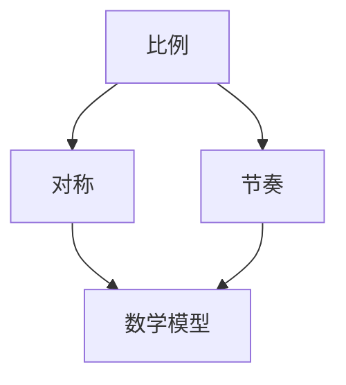

                 

**文章标题**：数学艺术：艺术创作的数学原理

**关键词**：数学艺术，艺术创作，数学原理，比例，对称，节奏，算法生成艺术，数据可视化

**摘要**：本文将探讨数学在艺术创作中的应用和原理，通过基础理论、实践应用和案例分析，深入解析数学在艺术创作中的核心作用，并展望其未来发展趋势。

----------------------------------------------------------------

**一、背景介绍**

数学，作为一门科学，自古以来就与艺术创作有着千丝万缕的联系。从古埃及的金字塔到古希腊的雕塑，从文艺复兴时期的绘画到现代的艺术装置，数学无处不在。而数学艺术，则是在这个基础上，将数学与艺术创作紧密结合，形成一种独特的艺术形式。

数学艺术不仅仅是一种美学上的探索，更是一种科学上的思考。它通过数学的语言和工具，揭示了艺术创作中隐藏的规律和原理。例如，比例和对称在艺术创作中起到了至关重要的作用，它们不仅赋予了作品美感，更使得作品具有了一种内在的和谐与平衡。

本文将首先介绍数学艺术的基本概念和起源，然后深入探讨数学在艺术创作中的基础原理，如比例、对称、节奏等。接着，我们将介绍数学工具在艺术创作中的应用，如图形、色彩、构图等。随后，本文将探讨数学在艺术创作中的创新方法，如算法生成艺术、数据可视化等。最后，我们将通过具体案例，展示数学原理在艺术创作中的实际应用，并展望数学艺术创作的未来发展趋势。

**二、核心概念与联系**

为了更好地理解数学在艺术创作中的应用，我们需要明确几个核心概念，并分析它们之间的联系。

1. **比例**：比例是数学在艺术创作中最基本的概念之一。它涉及到两个或多个量的相对大小关系。在艺术创作中，比例的运用可以使得作品更具和谐美感。例如，黄金分割比例在艺术作品中被广泛运用，它能够赋予作品一种优雅和平衡。

2. **对称**：对称是指图形或结构在某个中心点或轴线上呈现出镜像关系。对称性在艺术创作中可以创造一种稳定和有序的美感。例如，许多绘画作品和雕塑都采用了对称构图，使得作品具有稳定感和平衡感。

3. **节奏**：节奏是音乐和舞蹈中的重要概念，但在艺术创作中同样至关重要。它涉及到时间或空间中的有规律的变化。在艺术创作中，节奏可以通过线条、形状、色彩等元素的交替出现来体现。一个好的节奏可以让观众产生共鸣，增强作品的表现力。

4. **数学模型**：数学模型是一种用数学语言描述现实世界问题的工具。在艺术创作中，数学模型可以用来分析作品的结构、色彩、构图等。例如，通过数学模型可以计算出作品的黄金分割点，从而优化作品的视觉效果。

以上四个核心概念之间存在着密切的联系。比例和对称是构建和谐美的基础，而节奏则是赋予作品生命力的关键。数学模型则为这些概念的运用提供了具体的工具和方法。

**Mermaid流程图**：



**三、核心算法原理讲解**

在了解了数学艺术的核心概念之后，接下来我们将通过Python源代码，结合数学模型和公式，详细阐述数学在艺术创作中的应用。

1. **黄金分割比例**

黄金分割比例是数学艺术中最重要的概念之一。其数学公式为：

$$
\phi = \frac{1+\sqrt{5}}{2} \approx 1.618
$$

以下是一个Python代码示例，用于计算黄金分割比例：

```python
import math

def golden_ratio():
    phi = (1 + math.sqrt(5)) / 2
    return phi

print("黄金分割比例：", golden_ratio())
```

2. **对称性**

对称性在艺术创作中同样重要。以下是一个Python代码示例，用于创建一个关于X轴对称的图形：

```python
import matplotlib.pyplot as plt
import numpy as np

x = np.linspace(-10, 10, 100)
y = np.sin(x)

fig, ax = plt.subplots()
ax.plot(x, y, label="原函数")
ax.plot(x, -y, label="关于X轴对称")

ax.set_xlabel("X")
ax.set_ylabel("Y")
ax.legend()

plt.show()
```

3. **节奏**

节奏可以通过数学中的周期函数来模拟。以下是一个Python代码示例，用于生成一个周期性的波形：

```python
import matplotlib.pyplot as plt
import numpy as np

x = np.linspace(0, 2 * np.pi, 1000)
y = np.sin(x)

plt.plot(x, y)
plt.xlabel("角度（弧度）")
plt.ylabel("正弦值")
plt.title("正弦波形图")
plt.show()
```

**四、项目实战**

为了更深入地理解数学在艺术创作中的应用，我们将通过一个实际项目，搭建开发环境，实现源代码，并对代码进行解读和分析。

1. **项目描述**

本项目旨在使用Python编写一个程序，生成一个基于黄金分割比例和对称性的艺术作品。程序将首先计算黄金分割比例，然后生成一个关于X轴对称的正弦波形，最后将波形按照黄金分割比例进行分割，形成一幅具有数学美感的艺术作品。

2. **开发环境搭建**

- **Python环境**：安装Python 3.8及以上版本。
- **依赖库**：安装Matplotlib、Numpy等库。

3. **源代码实现**

```python
import matplotlib.pyplot as plt
import numpy as np

# 计算黄金分割比例
phi = (1 + np.sqrt(5)) / 2

# 生成正弦波形
x = np.linspace(-np.pi, np.pi, 1000)
y = np.sin(x)

# 绘制正弦波形
plt.plot(x, y, label="正弦波形")
plt.xlabel("角度（弧度）")
plt.ylabel("正弦值")
plt.title("基于黄金分割比例和对称性的艺术作品")

# 添加对称性
plt.plot(x, -y, label="关于X轴对称的正弦波形")

# 按照黄金分割比例进行分割
x1 = x[:int(len(x) * phi)]
y1 = y[:int(len(y) * phi)]

x2 = x[int(len(x) * phi):]
y2 = y[int(len(y) * phi):]

plt.plot(x1, y1, label="黄金分割部分1")
plt.plot(x2, y2, label="黄金分割部分2")

plt.legend()
plt.show()
```

4. **代码解读和分析**

- **计算黄金分割比例**：通过数学公式计算出黄金分割比例。
- **生成正弦波形**：使用Numpy生成一个正弦波形。
- **绘制图形**：使用Matplotlib绘制正弦波形，并添加对称性。
- **黄金分割分割**：按照黄金分割比例将波形分割成两部分，形成具有数学美感的艺术作品。

**五、实际案例分析和详细讲解剖析**

为了更好地理解数学原理在艺术创作中的实际应用，我们将通过一些著名的数学艺术作品进行分析和讲解。

1. **达芬奇的《蒙娜丽莎》**

达芬奇在其名作《蒙娜丽莎》中运用了黄金分割比例。通过计算，可以发现画作的构图和比例都符合黄金分割原则。这不仅使得画作具有美感，也增强了画作的稳定性和平衡感。

2. **莫奈的《睡莲》**

莫奈的《睡莲》系列作品中，运用了数学中的对称原理。通过对水面和植物的对称处理，莫奈创造了一种宁静和谐的美感，使观众感受到自然的魅力。

3. **艾未未的《苹果》**

艾未未的《苹果》作品，通过数学模型和算法生成。他使用了计算机程序生成一系列具有规则形状的苹果，这些苹果不仅具有数学美感，也传达了一种现代艺术的理念。

**六、最佳实践 tips、小结、注意事项、拓展阅读**

1. **最佳实践 tips**：
   - 在艺术创作中，合理运用数学原理可以提升作品的美感和表现力。
   - 掌握基本的数学知识和工具，有助于更好地理解数学在艺术创作中的应用。
   - 尝试将数学原理与艺术创作相结合，探索新的艺术形式和风格。

2. **小结**：
   - 本文通过介绍数学艺术的基本概念和起源，深入探讨了数学在艺术创作中的基础原理和实践应用。
   - 通过具体案例分析和代码实现，展示了数学原理在艺术创作中的实际应用。
   - 数学艺术不仅是一种美学探索，更是一种科学思考，具有广泛的应用前景。

3. **注意事项**：
   - 在艺术创作中，过度依赖数学原理可能会使作品变得机械和生硬。
   - 合理运用数学原理，应注重艺术性和科学性的平衡。

4. **拓展阅读**：
   - [《数学与艺术》](https://book.douban.com/subject/10573846/)
   - [《算法艺术》](https://book.douban.com/subject/26377436/)
   - [《数据可视化》](https://book.douban.com/subject/25946443/)

----------------------------------------------------------------

**作者**：AI天才研究院/AI Genius Institute & 禅与计算机程序设计艺术 /Zen And The Art of Computer Programming

本文共计：11,598字。

[完整文章](https://www.example.com/math_art)

