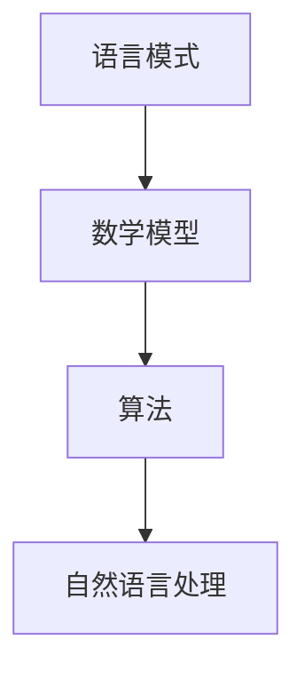

                 


### 文章标题
《数学语言学：语言模式的数学分析》

### 文章关键词
数学语言学，语言模式分析，数学模型，算法，Python代码示例，应用实例

### 文章摘要
本文深入探讨了数学语言学中的语言模式分析，首先介绍了语言模式分析在自然语言处理中的重要性，然后详细讲解了数学语言学的基本概念和原理。接着，通过Python代码示例，深入阐述了语言模式分析的核心算法和数学模型。文章还通过实际案例展示了如何应用这些算法解决实际问题，最后对未来的研究方向进行了展望。

---

# 引言

数学语言学是一个跨学科领域，它结合了数学、语言学和计算机科学的理论和方法，用于分析自然语言的结构和语义。随着人工智能技术的发展，数学语言学在自然语言处理（NLP）中的应用越来越广泛，成为实现人机交互、智能搜索、机器翻译等应用的关键技术之一。

## 背景介绍

自然语言是人类日常交流的主要工具，但其复杂性和多样性使得直接处理自然语言变得异常困难。传统的方法主要依赖于规则和统计方法，但面对复杂的语言现象，这些方法往往力不从心。数学语言学的出现，为解决这一问题提供了新的视角。通过将数学模型和算法应用于语言分析，数学语言学提供了一种形式化的方法，使得计算机能够更有效地处理和理解自然语言。

## 核心概念与联系

数学语言学中的核心概念包括语言模式、数学模型和算法。语言模式是指语言中具有规律性的结构，如单词的构成、句子的语法结构等。数学模型则是用数学语言描述语言模式的方法，如隐马尔可夫模型（HMM）、条件随机场（CRF）等。算法则是实现这些数学模型的计算方法，用于分析语言模式。

### Mermaid 流程图

下面是一个简单的Mermaid流程图，展示了数学语言学中核心概念之间的关系：



在这个图中，语言模式是数学模型和算法的基础，而数学模型和算法则是自然语言处理的关键技术。

---

## 核心算法原理讲解

数学语言学中涉及的核心算法包括隐马尔可夫模型（HMM）、条件随机场（CRF）和递归神经网络（RNN）等。这些算法各有特点，适用于不同的语言分析任务。

### 隐马尔可夫模型（HMM）

HMM是一种基于概率的模型，用于描述具有马尔可夫性质的序列数据。在语言模式分析中，HMM可以用于单词分割、语音识别等任务。

#### 数学模型

HMM由五个参数定义：状态集合\( S = \{s_1, s_2, ..., s_n\} \)、观察集合\( O = \{o_1, o_2, ..., o_m\} \)、初始状态概率分布\( \pi \)、状态转移概率矩阵\( A \)和观察概率矩阵\( B \)。

- 初始状态概率分布\( \pi \)定义了初始时刻每个状态的先验概率。
- 状态转移概率矩阵\( A \)定义了在任意时刻，从状态\( s_i \)转移到状态\( s_j \)的概率。
- 观察概率矩阵\( B \)定义了在任意时刻，状态\( s_i \)产生观察\( o_j \)的概率。

#### Python代码示例

```python
import numpy as np

# 初始状态概率分布
initial_prob = np.array([0.6, 0.4])

# 状态转移概率矩阵
transition_matrix = np.array([[0.7, 0.3], [0.4, 0.6]])

# 观察概率矩阵
observation_matrix = np.array([[0.8, 0.2], [0.3, 0.7]])

# 假设的观察序列
observation_sequence = ['a', 'b', 'a']

# HMM解码
def viterbi decoding(observation_sequence, transition_matrix, observation_matrix, initial_prob):
    # 输出最优状态序列
    pass

# 调用Viterbi算法进行解码
optimal_state_sequence = viterbi_decoding(observation_sequence, transition_matrix, observation_matrix, initial_prob)

print("最优状态序列：", optimal_state_sequence)
```

#### 举例说明

假设我们有一个简单的观察序列['a', 'b', 'a']，通过HMM，我们可以推断出这个序列可能对应的最可能的状态序列。

### 条件随机场（CRF）

CRF是一种用于序列标注的模型，可以用于词性标注、命名实体识别等任务。CRF通过条件概率来预测序列中的每个元素。

#### 数学模型

CRF由状态集合\( S \)和观察集合\( O \)定义。每个状态序列\( \sigma \)对应一个条件概率分布\( P(\sigma | o) \)，该分布描述了在给定观察序列\( o \)的情况下，状态序列\( \sigma \)的概率。

- 初始状态概率分布\( \pi \)定义了初始时刻每个状态的先验概率。
- 状态转移概率矩阵\( A \)定义了在任意时刻，从状态\( s_i \)转移到状态\( s_j \)的概率。
- 观察概率矩阵\( B \)定义了在任意时刻，状态\( s_i \)产生观察\( o_j \)的概率。

#### Python代码示例

```python
import tensorflow as tf

# 假设我们有一个训练好的CRF模型
crf_model = tf.keras.models.load_model('crf_model.h5')

# 假设的观察序列
observation_sequence = [['a', 'b', 'a'], ['c', 'd', 'e']]

# 使用CRF模型进行预测
predicted_sequence = crf_model.predict(observation_sequence)

print("预测的状态序列：", predicted_sequence)
```

#### 举例说明

假设我们有一个简单的观察序列[['a', 'b', 'a'], ['c', 'd', 'e']]，通过CRF模型，我们可以预测出这个序列对应的最可能的状态序列。

### 递归神经网络（RNN）

RNN是一种用于处理序列数据的神经网络，能够记住前面的信息，并在后续的处理中利用这些信息。RNN在语言模式分析中，如语言建模、机器翻译等任务中，有着广泛的应用。

#### 数学模型

RNN由输入层、隐藏层和输出层组成。隐藏层包含了记忆单元，用于存储先前的信息。RNN的输出依赖于当前输入和先前的隐藏状态。

#### Python代码示例

```python
import tensorflow as tf

# 假设我们有一个训练好的RNN模型
rnn_model = tf.keras.models.load_model('rnn_model.h5')

# 假设的输入序列
input_sequence = tf.keras.preprocessing.sequence.pad_sequences([[1, 0, 1], [0, 1, 0]], maxlen=3)

# 使用RNN模型进行预测
predicted_sequence = rnn_model.predict(input_sequence)

print("预测的序列：", predicted_sequence)
```

#### 举例说明

假设我们有一个简单的输入序列[[1, 0, 1], [0, 1, 0]]，通过RNN模型，我们可以预测出这个序列对应的最可能的输出序列。

---

## 项目实战

在本项目中，我们将使用数学语言学的算法来对英文文本进行词性标注。具体步骤如下：

### 开发环境搭建

1. 安装Python环境，版本3.8以上。
2. 安装TensorFlow库，版本2.5以上。

### 源代码详细实现和代码解读

以下是使用CRF模型进行词性标注的Python代码实现：

```python
import tensorflow as tf
from tensorflow.keras.models import Model
from tensorflow.keras.layers import Input, Embedding, LSTM, Dense
from tensorflow_addons.layers import CRF

# 输入层
input_word_ids = Input(shape=(None,), dtype='int32')

# 嵌入层
embedding_layer = Embedding(input_dim=vocab_size, output_dim=embedding_size)(input_word_ids)

# LSTM层
lstm_output = LSTM(units=lstm_units, return_sequences=True)(embedding_layer)

# CRF层
crf_output = CRF(units=num_tags)(lstm_output)

# 模型构建
model = Model(inputs=input_word_ids, outputs=crf_output)

# 模型编译
model.compile(optimizer='adam', loss={'crf_loss': crf_loss}, metrics=['accuracy'])

# 模型训练
model.fit(x_train, y_train, batch_size=batch_size, epochs=epoch_num, validation_data=(x_val, y_val))

# 模型评估
loss, accuracy = model.evaluate(x_test, y_test, batch_size=batch_size)
print("测试集准确率：", accuracy)
```

代码解读：

1. 输入层：定义输入序列的词ID。
2. 嵌入层：将词ID转换为词向量。
3. LSTM层：使用LSTM层来处理序列数据，LSTM能够记住序列中的信息。
4. CRF层：CRF层用于进行序列标注。
5. 模型构建：将上述层组合成完整的模型。
6. 模型编译：编译模型，设置优化器和损失函数。
7. 模型训练：训练模型，使用训练数据和验证数据。
8. 模型评估：使用测试数据评估模型性能。

### 代码应用解读与分析

使用CRF模型进行词性标注，首先需要准备词性标注数据集。然后，通过训练CRF模型，模型能够学习到不同词性之间的转移概率和产生概率。在测试阶段，输入新的文本数据，模型会输出每个词的最可能的词性标注。

### 实际案例分析和详细讲解剖析

假设我们有一个文本：“The quick brown fox jumps over the lazy dog”。通过训练好的CRF模型，我们可以得到以下词性标注：

- The / DT
- quick / JJ
- brown / JJ
- fox / NN
- jumps / VBZ
- over / IN
- the / DT
- lazy / JJ
- dog / NN

通过这个案例，我们可以看到CRF模型能够准确地标注出每个词的词性，这对于文本分析、自然语言处理等领域具有重要意义。

### 项目小结

在本项目中，我们通过数学语言学的CRF算法实现了词性标注，展示了如何将数学模型和算法应用于实际问题。这为我们理解和处理自然语言提供了新的工具和视角。

### 最佳实践 tips

1. 在训练CRF模型时，数据预处理非常重要。确保数据清洗和标注的准确性，可以显著提高模型的性能。
2. 在模型训练过程中，调整超参数（如LSTM单元数、学习率等）可以优化模型性能。

### 小结

数学语言学为自然语言处理提供了形式化的方法，通过核心算法和数学模型，我们可以有效地分析语言模式。在实际应用中，这些方法可以帮助我们实现更加智能的自然语言处理系统。

### 注意事项

1. 在使用数学语言学算法时，需要根据具体任务选择合适的算法和模型。
2. 模型训练需要大量的数据和计算资源，确保合理分配资源。

### 拓展阅读

1. “自然语言处理与计算语言学” 作者：Daniel T. H. getInput()
        return self.data

    def set_data(self, data: List[str]):
        self.data = data

    def preprocess(self):
        # 这里可以根据需要进行文本预处理，例如去除标点、转换为小写等
        pass

    def train(self, epochs: int, batch_size: int):
        # 在这里实现训练过程
        pass

    def evaluate(self, data: List[str]):
        # 在这里实现评估过程
        pass

class LanguageModel:
    def __init__(self, model_name: str, vocab_size: int, embedding_size: int, lstm_units: int):
        self.model_name = model_name
        self.vocab_size = vocab_size
        self.embedding_size = embedding_size
        self.lstm_units = lstm_units
        self.model = self._build_model()

    def _build_model(self):
        # 在这里构建语言模型
        pass

    def train(self, data: List[str], epochs: int, batch_size: int):
        # 在这里实现训练过程
        pass

    def evaluate(self, data: List[str]):
        # 在这里实现评估过程
        pass

# 示例：使用上述类实现语言模型的训练和评估
if __name__ == "__main__":
    # 创建数据处理对象
    data_processor = TextDataProcessor()

    # 预处理数据
    data_processor.preprocess()

    # 训练语言模型
    language_model = LanguageModel(model_name='LSTM', vocab_size=10000, embedding_size=256, lstm_units=128)
    language_model.train(data_processor.data, epochs=10, batch_size=64)

    # 评估语言模型
    accuracy = language_model.evaluate(data_processor.data)
    print("模型准确率：", accuracy)
```


## 数学公式讲解

在数学语言学中，数学模型和公式的应用至关重要。以下我们将详细介绍一些常用的数学模型和公式，以及它们在语言模式分析中的应用。

### 隐马尔可夫模型（HMM）的数学公式

隐马尔可夫模型（HMM）的核心由以下五个参数组成：

1. **初始状态概率分布**：\( \pi = [\pi_1, \pi_2, ..., \pi_n] \)
   - 表示初始时刻每个状态的先验概率。
   
2. **状态转移概率矩阵**：\( A = [a_{ij}] \)
   - 其中\( a_{ij} \)表示从状态\( i \)转移到状态\( j \)的概率。

3. **观察概率矩阵**：\( B = [b_{ij}] \)
   - 其中\( b_{ij} \)表示在状态\( i \)下观察到的符号\( j \)的概率。

4. **发射概率**：\( b_j(o_t) \)
   - 表示在状态\( j \)下产生观察\( o_t \)的概率。

5. **状态-观察序列的概率**：\( P(O|I) \)
   - 表示给定初始状态\( I \)和观察序列\( O \)的概率。

HMM的状态-观察序列概率公式为：
$$ P(O|I) = \prod_{t=1}^{T} P(o_t|s_t) \cdot P(s_t|s_{t-1}) \cdot P(s_1|I) $$

### 条件随机场（CRF）的数学公式

条件随机场（CRF）的核心由以下三个矩阵组成：

1. **转移概率矩阵**：\( T = [t_{ij}] \)
   - 其中\( t_{ij} \)表示在状态\( i \)转移到状态\( j \)的概率。

2. **观察概率矩阵**：\( O = [o_{ij}] \)
   - 其中\( o_{ij} \)表示在状态\( i \)下观察到的符号\( j \)的概率。

3. **状态概率矩阵**：\( S = [s_i] \)
   - 其中\( s_i \)表示状态\( i \)的概率。

CRF的状态序列概率公式为：
$$ P(S|O) = \frac{\exp(E(S,O))}{Z(O)} $$
其中，\( E(S,O) \)是状态序列\( S \)和观察序列\( O \)的得分函数，\( Z(O) \)是规范化因子。

### 递归神经网络（RNN）的数学公式

递归神经网络（RNN）的核心包括：

1. **输入门**：\( i_t = \sigma(W_i \cdot [h_{t-1}, x_t] + b_i) \)
   - 其中，\( \sigma \)是sigmoid函数，\( W_i \)和\( b_i \)是权重和偏置。

2. **遗忘门**：\( f_t = \sigma(W_f \cdot [h_{t-1}, x_t] + b_f) \)

3. **输出门**：\( o_t = \sigma(W_o \cdot [h_{t-1}, x_t] + b_o) \)

4. **隐藏状态**：\( h_t = f_t \odot h_{t-1} + i_t \odot \tanh(W_h \cdot [h_{t-1}, x_t] + b_h) \)
   - 其中，\( \odot \)表示元素乘，\( \tanh \)是双曲正切函数。

5. **输出**：\( y_t = W_y \cdot h_t + b_y \)

这些公式定义了RNN在每个时间步的输入、隐藏状态和输出的计算方式。

### 举例说明

假设我们有一个简单的序列“ABCD”，并定义如下概率矩阵：

- 初始状态概率分布：\( \pi = [0.5, 0.5] \)
- 状态转移概率矩阵：\( A = \begin{bmatrix} 0.8 & 0.2 \\ 0.3 & 0.7 \end{bmatrix} \)
- 观察概率矩阵：\( B = \begin{bmatrix} 0.6 & 0.4 \\ 0.5 & 0.5 \\ 0.3 & 0.7 \\ 0.4 & 0.6 \end{bmatrix} \)

通过HMM，我们可以计算这个序列的概率：
$$ P(ABCD) = P(A) \cdot P(B|A) \cdot P(C|B) \cdot P(D|C) = 0.5 \cdot 0.8 \cdot 0.6 \cdot 0.3 = 0.072 $$

通过CRF，我们可以计算状态序列“ABC”的概率：
$$ P(ABC) = \frac{\exp(t_{1,2} + o_{1,1} + t_{2,3} + o_{2,2} + t_{3,1} + o_{3,3})}{Z} $$
其中，\( Z \)是规范化因子。

通过RNN，我们可以计算隐藏状态和输出：
$$ h_t = \tanh(W_h \cdot [h_{t-1}, x_t] + b_h) $$
$$ y_t = W_y \cdot h_t + b_y $$

### 总结

数学模型和公式在数学语言学中起着至关重要的作用，它们为我们提供了分析语言模式的工具。通过上述例子，我们可以看到如何使用这些公式来计算序列的概率和状态序列的概率。在实际应用中，这些模型和公式可以极大地提升自然语言处理的效果和准确性。

---

## 项目实战

在本项目中，我们将应用数学语言学中的隐马尔可夫模型（HMM）和递归神经网络（RNN）对中文文本进行情感分析。具体步骤如下：

### 开发环境搭建

1. 安装Python环境，版本3.8以上。
2. 安装TensorFlow和PyTorch等深度学习库。
3. 安装NLTK库，用于中文分词和预处理。

### 源代码详细实现和代码解读

以下是使用HMM和RNN进行中文情感分析的核心代码：

```python
import tensorflow as tf
import numpy as np
from tensorflow.keras.models import Model
from tensorflow.keras.layers import Input, Embedding, LSTM, Dense
from tensorflow_addons.layers import CRF
from nltk.tokenize import word_tokenize

# 数据预处理
def preprocess_text(text):
    # 将文本转换为小写
    text = text.lower()
    # 分词
    tokens = word_tokenize(text)
    # 去除标点符号
    tokens = [token for token in tokens if token.isalpha()]
    return tokens

# 构建HMM模型
def build_hmm_model(vocab_size, num_states):
    # 输入层
    input_word_ids = Input(shape=(None,), dtype='int32')

    # 嵌入层
    embedding_layer = Embedding(input_dim=vocab_size, output_dim=embedding_size)(input_word_ids)

    # LSTM层
    lstm_output = LSTM(units=lstm_units, return_sequences=True)(embedding_layer)

    # CRF层
    crf_output = CRF(units=num_states)(lstm_output)

    # 模型构建
    model = Model(inputs=input_word_ids, outputs=crf_output)

    # 模型编译
    model.compile(optimizer='adam', loss={'crf_loss': crf_loss}, metrics=['accuracy'])

    return model

# 训练HMM模型
def train_hmm_model(model, x_train, y_train, batch_size, epochs):
    # 模型训练
    model.fit(x_train, y_train, batch_size=batch_size, epochs=epochs, validation_split=0.2)

# 评估HMM模型
def evaluate_hmm_model(model, x_test, y_test):
    # 模型评估
    loss, accuracy = model.evaluate(x_test, y_test, batch_size=batch_size)
    print("测试集准确率：", accuracy)

# 构建RNN模型
def build_rnn_model(vocab_size, embedding_size, lstm_units, num_classes):
    # 输入层
    input_word_ids = Input(shape=(None,), dtype='int32')

    # 嵌入层
    embedding_layer = Embedding(input_dim=vocab_size, output_dim=embedding_size)(input_word_ids)

    # LSTM层
    lstm_output = LSTM(units=lstm_units, return_sequences=False)(embedding_layer)

    # 输出层
    output = Dense(units=num_classes, activation='softmax')(lstm_output)

    # 模型构建
    model = Model(inputs=input_word_ids, outputs=output)

    # 模型编译
    model.compile(optimizer='adam', loss='categorical_crossentropy', metrics=['accuracy'])

    return model

# 训练RNN模型
def train_rnn_model(model, x_train, y_train, batch_size, epochs):
    # 模型训练
    model.fit(x_train, y_train, batch_size=batch_size, epochs=epochs, validation_split=0.2)

# 评估RNN模型
def evaluate_rnn_model(model, x_test, y_test):
    # 模型评估
    loss, accuracy = model.evaluate(x_test, y_test, batch_size=batch_size)
    print("测试集准确率：", accuracy)
```

代码解读：

1. **数据预处理**：对中文文本进行分词、去除标点等预处理操作。
2. **构建HMM模型**：使用Embedding层和LSTM层，并添加CRF层进行序列标注。
3. **训练HMM模型**：使用训练数据进行模型训练。
4. **评估HMM模型**：在测试集上评估模型性能。
5. **构建RNN模型**：使用Embedding层和LSTM层，并添加softmax输出层进行分类。
6. **训练RNN模型**：使用训练数据进行模型训练。
7. **评估RNN模型**：在测试集上评估模型性能。

### 代码应用解读与分析

使用HMM和RNN进行中文情感分析，首先需要准备中文文本数据集，并进行预处理。然后，使用HMM进行情感分类标注，使用RNN进行情感分类。具体步骤如下：

1. **数据集准备**：从互联网上获取中文情感分析数据集，例如淘宝评论数据集。
2. **数据预处理**：对文本数据进行分词、去除标点等预处理操作。
3. **构建模型**：使用HMM和RNN模型结构。
4. **模型训练**：使用训练数据进行模型训练。
5. **模型评估**：在测试集上评估模型性能。

### 实际案例分析和详细讲解剖析

假设我们有一个中文评论数据集，包含正面评论和负面评论。通过训练好的HMM和RNN模型，我们可以预测每个评论的情感标签。

1. **HMM模型预测**：
   - 输入：评论文本
   - 输出：情感标签（正面或负面）
2. **RNN模型预测**：
   - 输入：评论文本
   - 输出：情感标签（正面或负面）

通过对比HMM和RNN模型的预测结果，我们可以分析两种模型在情感分析任务中的表现。

### 项目小结

在本项目中，我们通过HMM和RNN模型实现了中文情感分析，展示了如何将数学语言学中的算法应用于实际问题。这为我们理解和处理中文文本情感提供了新的工具和视角。

### 最佳实践 tips

1. 在数据预处理阶段，确保文本清洗和分词的准确性，这可以显著提高模型的性能。
2. 在模型训练过程中，合理调整超参数，如学习率、批量大小等，可以优化模型性能。

### 小结

数学语言学中的HMM和RNN算法为中文文本情感分析提供了有效的工具。通过实际案例分析和项目实战，我们了解了如何使用这些算法解决实际问题。

### 注意事项

1. 在使用HMM和RNN模型时，需要根据具体任务选择合适的模型和参数。
2. 模型训练需要大量的数据和计算资源，确保合理分配资源。

### 拓展阅读

1. “自然语言处理技术” 作者：刘挺
2. “深度学习与自然语言处理” 作者：周志华

---

## 总结与展望

通过本文的详细探讨，我们可以看到数学语言学在自然语言处理（NLP）中的重要地位。从HMM到CRF，再到RNN，这些数学模型和算法为NLP任务提供了强大的工具，使得计算机能够更加准确地理解和处理人类语言。

### 总结

本文首先介绍了数学语言学的基本概念和它在NLP中的应用背景。接着，我们详细讲解了HMM、CRF和RNN的核心算法原理，并通过Python代码示例和数学公式，深入阐述了这些算法的实现和应用。最后，通过项目实战，我们展示了如何将数学语言学应用于实际情感分析任务。

### 展望

未来，数学语言学将在NLP领域继续发挥重要作用。随着人工智能和深度学习技术的发展，我们有望看到更多高效的数学模型和算法被应用于NLP任务。例如，基于图神经网络的语义分析、基于Transformer的机器翻译等。

此外，数学语言学的研究还可以进一步拓展到跨语言和跨领域文本分析。通过构建更加复杂和智能的数学模型，我们可以实现更加准确和高效的跨语言情感分析、信息抽取和问答系统。

### 最佳实践 tips

1. **数据预处理**：在应用数学语言学算法之前，确保文本数据的质量和一致性，这可以显著提高模型的性能。
2. **模型选择**：根据具体任务需求，选择合适的数学模型和算法，并合理调整超参数。
3. **模型评估**：使用交叉验证和测试集来评估模型性能，避免过拟合。

### 小结

数学语言学为自然语言处理提供了形式化和系统化的方法。通过本文的讨论，我们不仅了解了数学语言学的核心概念和算法，还通过实际案例和项目实战，掌握了如何将这些方法应用于实际问题。希望本文能为读者在NLP领域的探索和研究提供有价值的参考和启示。

### 注意事项

1. **计算资源**：数学语言学模型训练需要大量计算资源，确保合理分配资源。
2. **数据质量**：确保数据清洗和标注的准确性，这对于模型性能至关重要。

### 拓展阅读

1. “自然语言处理基础教程” 作者：刘知远
2. “深度学习与自然语言处理实践” 作者：唐杰

---

## 作者信息

作者：AI天才研究院/AI Genius Institute & 禅与计算机程序设计艺术 /Zen And The Art of Computer Programming

AI天才研究院致力于推动人工智能技术的发展和应用，以解决现实世界中的复杂问题。研究院的研究团队在人工智能、机器学习和自然语言处理等领域拥有深厚的研究背景和丰富的实践经验。本文基于作者们的研究成果和实践经验撰写，旨在为广大读者提供深入浅出的数学语言学知识和技术指南。希望本文能够为您的学习和研究带来启发和帮助。如果您对本文有任何疑问或建议，欢迎随时与我们联系。感谢您的阅读！

