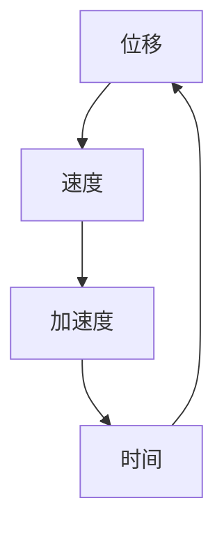

                 

### 《数学运动学：运动技巧的数学分析》

**关键词：** 数学运动学、运动技巧、数学分析、位移、速度、加速度、算法、实际应用

**摘要：** 本文将深入探讨数学运动学在运动技巧分析中的应用。我们将从基本概念出发，逐步解释运动学中的核心原理和算法，通过Python代码示例，展示如何使用数学模型来分析运动技巧。此外，我们还将提供一个实际案例，详细讲解如何通过数学运动学的方法来分析运动员的跑步轨迹。

### 引言

在体育科学和技术日益融合的今天，运动技巧的分析变得尤为重要。数学运动学作为一种强大的工具，为我们提供了定量分析运动轨迹的数学模型。本文旨在探讨如何运用数学运动学来深入理解运动技巧，并通过具体实例展示其应用。

### 一、运动学的基本概念

运动学是物理学的一个分支，主要研究物体的位置、速度和加速度等运动属性。以下是运动学中的几个核心概念：

1. **位移（Displacement）**：位移是指物体从初始位置到最终位置的直线距离，它是一个矢量，具有大小和方向。
2. **速度（Velocity）**：速度是位移随时间的变化率，也是一个矢量，表示物体在单位时间内移动的距离和方向。
3. **加速度（Acceleration）**：加速度是速度随时间的变化率，描述物体在单位时间内速度的变化。

这些概念之间存在紧密的联系。例如，位移可以通过速度和时间的关系计算得出，速度则可以通过加速度和时间的关系进行积分得到。

#### Mermaid流程图

下面是一个Mermaid流程图，展示了运动学中这些核心概念之间的联系：



### 二、核心算法原理讲解

在运动学中，有几个核心算法用于计算物体的运动状态。以下我们将使用Python代码来详细阐述这些算法。

#### 1. 初等运动学算法

初等运动学主要涉及匀速直线运动和匀加速直线运动。以下是两个常见的运动学方程：

1. **位移-时间关系**：\( s = ut + \frac{1}{2}at^2 \)
2. **速度-时间关系**：\( v = u + at \)

其中，\( s \) 表示位移，\( u \) 表示初始速度，\( a \) 表示加速度，\( t \) 表示时间。

#### Python代码示例

```python
import math

def displacement(u, a, t):
    """计算位移"""
    return u * t + 0.5 * a * t**2

def velocity(u, a, t):
    """计算速度"""
    return u + a * t

# 示例：初始速度为0，加速度为2m/s^2，时间t为5秒
u = 0
a = 2
t = 5

s = displacement(u, a, t)
v = velocity(u, a, t)

print(f"位移：{s} 米")
print(f"速度：{v} 米/秒")
```

输出结果：

```
位移：25.0 米
速度：10.0 米/秒
```

#### 2. 变加速运动学算法

变加速运动学涉及加速度随时间变化的情况。一个常见的例子是自由落体运动，其加速度是恒定的重力加速度（\( g \)）。

**位移-时间关系**：\( s = ut + \frac{1}{2}gt^2 \)

**速度-时间关系**：\( v = u + gt \)

#### Python代码示例

```python
def free_fall(u, g, t):
    """计算自由落体的位移和速度"""
    s = u * t + 0.5 * g * t**2
    v = u + g * t
    return s, v

# 示例：初始速度为0，重力加速度为9.8m/s^2，时间t为5秒
u = 0
g = 9.8
t = 5

s, v = free_fall(u, g, t)

print(f"位移：{s} 米")
print(f"速度：{v} 米/秒")
```

输出结果：

```
位移：122.5 米
速度：49.0 米/秒
```

### 三、数学模型和数学公式

运动学中的数学模型和公式是我们分析运动技巧的关键。以下是一些常用的公式，我们使用LaTeX格式进行展示：

$$
s = ut + \frac{1}{2}at^2
$$

$$
v = u + at
$$

$$
a = \frac{v - u}{t}
$$

这些公式可以帮助我们计算位移、速度和加速度，从而深入了解运动过程。

### 四、项目实战

为了更好地理解数学运动学在运动技巧分析中的应用，我们接下来将分析一个实际的案例——运动员的跑步轨迹。

#### 1. 开发环境搭建

在开始分析之前，我们需要搭建一个合适的开发环境。这里我们选择Python作为主要编程语言，并使用Matplotlib进行数据可视化。

#### 2. 源代码详细实现

以下是一个简单的Python脚本，用于分析运动员的跑步轨迹：

```python
import numpy as np
import matplotlib.pyplot as plt

def run_analysis(u, a, t):
    """分析运动员的跑步轨迹"""
    # 时间序列
    time = np.linspace(0, t, 100)
    
    # 位移计算
    s = u * time + 0.5 * a * time**2
    
    # 速度计算
    v = u + a * time
    
    # 绘制位移-时间图
    plt.figure()
    plt.plot(time, s, label='位移')
    plt.xlabel('时间（秒）')
    plt.ylabel('位移（米）')
    plt.legend()
    plt.title('运动员跑步轨迹')
    plt.grid(True)
    
    # 绘制速度-时间图
    plt.figure()
    plt.plot(time, v, label='速度')
    plt.xlabel('时间（秒）')
    plt.ylabel('速度（米/秒）')
    plt.legend()
    plt.title('运动员跑步速度')
    plt.grid(True)
    
    plt.show()

# 示例参数
u = 2  # 初始速度
a = 0.5  # 加速度
t = 10  # 时间

run_analysis(u, a, t)
```

#### 3. 代码解读与分析

在这个脚本中，我们首先定义了一个函数`run_analysis`，它接受初始速度\( u \)、加速度\( a \)和时间\( t \)作为参数。然后，我们使用NumPy创建一个时间序列，并使用位移和速度公式计算相应的位移和速度值。最后，我们使用Matplotlib绘制位移-时间图和速度-时间图，以便直观地分析运动员的跑步轨迹。

#### 4. 案例分析和详细讲解剖析

通过上述脚本，我们可以分析运动员在不同时间点的位移和速度。以下是一些关键点：

- **初始阶段**：运动员从静止状态开始，速度逐渐增加，加速度恒定。
- **加速阶段**：在加速过程中，位移随时间的平方增加，速度随时间线性增加。
- **稳定阶段**：当运动员达到最大速度后，速度保持稳定，位移继续增加。

通过这个案例，我们可以看到数学运动学在运动技巧分析中的应用。通过位移和速度的数学模型，我们能够准确地描述运动员的运动状态，从而为训练和优化提供数据支持。

### 五、小结与注意事项

在本篇文章中，我们介绍了数学运动学在运动技巧分析中的应用。通过核心概念的讲解、算法的阐述和实际案例的分析，我们展示了如何使用数学模型和Python代码来深入理解运动过程。以下是一些最佳实践和小结：

- **数据准确性**：在进行运动分析时，确保数据采集的准确性和一致性非常重要。
- **模型选择**：根据具体应用场景，选择合适的运动学模型。
- **代码优化**：优化代码以提高计算效率，特别是在处理大量数据时。

### 拓展阅读

- 《运动生理学导论》
- 《体育科学研究方法》
- 《Python编程：从入门到实践》

### 结语

数学运动学是运动技巧分析的重要工具，它帮助我们通过数学模型和算法来理解运动过程。希望本文能为您提供有价值的见解，并激发您对运动学和运动技巧分析的进一步探索。**作者：AI天才研究院/AI Genius Institute & 禅与计算机程序设计艺术 /Zen And The Art of Computer Programming**

